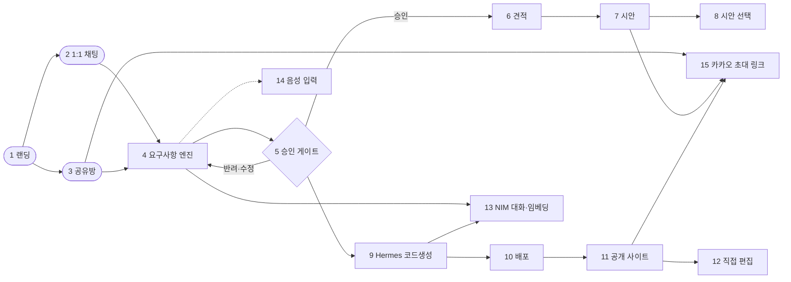

# agt001 — 말하면 가게 사이트가 된다

소상공인이 채팅(글·음성·사진)으로 원하는 것을 설명하면, AI가 요구사항을 정리해 확인받은 뒤 실제로 동작하는 웹사이트를 만들어 바로 공개해 주는 서비스.

- 운영 주소: https://144.24.91.250.sslip.io
- 직접 편집 화면: https://144.24.91.250.sslip.io/editor (프로토타입, 목업 데이터)
- 1:1 채팅: https://144.24.91.250.sslip.io/ (정적 폴백) 또는 기존 채팅 위젯
- 다인원 공유방: https://144.24.91.250.sslip.io/room.html

## 30초 사용 흐름

1. 랜딩 입력 — 가게와 원하는 것을 한 문장으로 입력한다 (`frontend/src/Landing.tsx`).
2. 질문 몇 개 — 요구사항 엔진이 빈 칸 하나씩 최대 8회까지 되묻는다. 선택지 4개 이하 + 자유 입력 (`app/services/prd_engine.py`).
3. 요약 확인 — 요구사항 카드를 보고 확정한다. 공유방은 과반 투표 (`app/services/rooms.py`).
4. 견적 — 견적 3안과 산정 근거를 확인한다 (베타 무료, 외주를 맡길 때의 참고값) (`app/services/quote.py`).
5. 시안 — 분위기가 다른 시안 후보를 보고 하나를 고른다 (진행 중, 현재는 1종 정적 템플릿).
6. 코드생성 — 확정 요구사항으로 Hermes가 격리 샌드박스에서 사이트를 만든다 (`app/services/codegen.py`).
7. 공개 사이트 — `/site/<id>/` 로 실제 접속 가능한 결과물을 받는다 (`app/api/public.py`).

## 지금 상태 (2026-09-26 갱신)

**운영에서 바로 확인할 수 있는 것**

| 기능 | 확인 방법 |
|---|---|
| 입력창 중심 랜딩 + 업종 템플릿 6개 | https://144.24.91.250.sslip.io |
| 요구사항 질문 엔진: 선택지 버튼, 알아들은 내용 되짚기("이렇게 이해했어요"), 최대 8질문, "시안 먼저" 건너뛰기 | 랜딩에 입력 → 채팅방 |
| 음성 입력(NVIDIA Parakeet 한국어): 마이크 버튼 → 글자로 바뀌어 입력창에 들어감(자동 전송 없음) | 채팅방 입력줄의 마이크 버튼 |
| 공유방: 초대, 과반 투표, 본인 확인 값 비노출 | `/room.html` |
| 사장님 직접 편집 화면(목업 데이터) | `/editor` |
| 견적 → 시안(1종) → 코드생성 → 공개 사이트 | 채팅방에서 승인 → 진행 |

**진행 중 (병렬 계획: [DELIVERY_PIPELINE.md §5.4](docs/product/DELIVERY_PIPELINE.md))**

| 작업 | 상태 |
|---|---|
| 요구사항 엔진 결함 16건 수정 (독립 검증 결과, [검증 보고서](docs/product/reviews/REQUIREMENTS_ENGINE_VERIFICATION.md)) | 수정 중 — `tests/engine`이 재현 테스트 |
| 입구 게이트: 문의 종류 분류(가게·개인·단체·웹서비스), 기능 가능성 판정, 질문 예산 ([설계](docs/product/INTAKE_GATE_DESIGN.md), [기능 사례집](docs/product/FEATURE_CATALOG.md)) | 설계·사례집 완료, 구현 중 |
| 플랫폼 공용 기능 ① 문의 받기 + 사장님 알림 | 대기 |
| 시안 3안(섹션 부품 20종 기반 렌더러) | 부품·토큰 완료, 렌더러 대기 |
| 실제 대화 기록 기반 AI 성능 평가 (대화 턴 기록은 운영 적용 완료) | 평가 도구 작성 중 |
| 내 프로젝트 목록 화면 (서버 API 완료) | 화면 대기 |

**알려진 한계:** 업종·숨은 항목 표가 고정(가게 6업종)이라 표에 없는 문의는 입구 게이트 구현 전까지 일반 질문으로 처리됩니다. 시안은 아직 1종입니다. 견적은 AI가 만든 3안입니다(베타 참고값).

## NVIDIA 기술을 쓴 곳

| 기술 | 용도 | 코드·문서 위치 | 상태 |
|---|---|---|---|
| NIM 대화 모델 `nvidia/nemotron-3-super-120b-a12b` | 요구사항 추출(`chat_json`), 대화 응답, 견적 3안 생성 | `app/llm.py` (`chat`, `chat_json`), `app/services/prd_engine.py`, `app/services/chat_flow.py`, `app/services/quote.py`, `.env.example` (`NIM_CHAT_MODEL`) | 동작 |
| NIM 임베딩 `nvidia/nemotron-3-embed-1b` | 유사 프로젝트 확인 (RAG 코사인 유사도) | `app/llm.py` (`embed`), `app/services/rag.py`, `.env.example` (`NIM_EMBED_MODEL`) | 동작 |
| Parakeet 1.1B RNNT 다국어 음성 인식 (NVIDIA 호스팅) | 채팅방 마이크 버튼: 녹음 → 16kHz 변환 → 한국어 전사 → 한글 숫자("공일공…")를 숫자로 → 입력창에 넣고 사장님이 고친 뒤 전송 | `app/services/stt.py`, `app/api/stt.py`(`POST /api/stt`), `static/voice.js`, `static/room.html` | 동작 |
| Magpie TTS 다국어 (NVIDIA 호스팅) | 질문 읽어주기(선택 버튼) | `docs/product/VOICE_INPUT_PLAN.md` 부록 (실측) | 진행 중 (화면 연결 전) |
| Hermes 코드생성 에이전트 | 확정 스펙으로 정적 웹 프로젝트 생성, 요청별 Docker 컨테이너(`--rm`, `/workspace`만 마운트)로 격리 | `app/services/codegen.py`, `app/config.py` (`hermes_sandbox_image`), `docker-compose.yml` (docker.sock 주석) | 동작 (로컬·OCI 검증, 작업 큐 전환 예정) |

음성 실측 (부록 `docs/product/VOICE_INPUT_PLAN.md` 부록, 2026-09-26, Claude 실측):

- Parakeet 1.1B RNNT 다국어: 한국어 문장 약 9초 분량을 2.5초에 전사. "객실 세 개"를 "객실세계"로 오인식 1건, 전화번호는 한글 숫자("공일공 …")로 출력.
- Magpie TTS 다국어: 7.4초 분량을 1.4초에 합성 (한국어 목소리 6개).
- 합성 음성을 다시 전사한 왕복 확인: 원문과 거의 같음 (띄어쓰기만 차이).
- 계획 변경 기록: 3단계 서버 전사의 기본 엔진을 Parakeet로 하며, 전사 결과는 입력창에 넣고 사용자가 고친 뒤 전송한다. 녹음 파일은 전사 직후 삭제. 호스팅 API의 운영 규모 이용 조건·요금·호출 한도는 NVIDIA 약관 확인이 필요하다.

요구사항 추출 실측 (`docs/product/research/REQUIREMENTS_ENGINE_RESEARCH.md` §5):

- `guided_json`·`response_format` 스키마 강제는 이 모델에서 형식을 깨뜨려 사용하지 않는다.
- 채택: 추론 끔(`enable_thinking=false`) + 스키마를 프롬프트에 + 서버 검증. 발화 8개 시험에서 형식 통과 8/8, 지어낸 사실 0건, 평균 응답 3.4초.

## 주최 요구 1~11 대응표

원 요구 목록은 `docs/hackathon/REQUIREMENTS.md` §8, 상세 REQ는 같은 문서 §2~§7.

| 요구 | 어떻게 | 코드·문서 위치 | 상태 |
|---|---|---|---|
| 1. 인프라 설계 + Mermaid + 역할분담 | 본 README 구조도 + `ARCHITECTURE.md` 시스템 컨텍스트 | `docs/hackathon/ARCHITECTURE.md` §1~§3 | 완료 |
| 2. 채팅 요구사항 전달 | 1:1 `/chat` + 공유방 `/room/<id>/chat`, 4초 폴링 조회 | `app/api/chat.py`, `app/api/rooms.py`, `app/services/chat_flow.py`, `app/services/rooms.py`, `static/room.html` | 완료 |
| 3. 접수/검증/질의(옵션+추천)/게이트 | PRD 엔진: 추출→규칙 검사→칸 점수→질문 1개, 최대 8회, 공유방 사실은 방장 확인 | `app/services/prd_engine.py`, `app/services/prd_schema.py`, `tests/unit/test_prd_engine.py` (13건) | 완료 (T3 시뮬레이션 성적표는 미실행) |
| 4. RAG 사전확인 | NIM 임베딩 코사인 유사도, 임계값 미만은 신규, 실패해도 대화 중단 없음 | `app/services/rag.py`, `app/llm.py` (`embed`) | 완료 |
| 5. 동작하는 산출물 (웹/안드로이드) | 웹 정적 사이트를 `/site/<id>/`로 직접 서빙. 안드로이드(React Native)는 미구현 | `app/services/codegen.py`, `app/services/deploy.py`, `app/api/public.py` (`serve_site`) | 부분 완료 (웹만 동작, 안드로이드 미착수) |
| 6. 채팅 확인 필수 + 견적 근거 | 공유방 과반 투표 승인 게이트. 견적은 현재 AI 3안 JSON + 추천 (D25에서 규칙 계산 전환 결정, 미적용) | `app/services/rooms.py`, `app/services/quote.py`, `docs/product/DECISIONS.md` D25 | 완료 (견적 방식 전환은 진행 중) |
| 7. UI 시안 선택 | 견적 승인 후 정적 HTML 템플릿 1종 렌더링 + Playwright 실제 스크린샷. 3안·취향 반영·부분 수정은 미구현 | `app/services/design.py`, `app/api/public.py` (`design_page`), `docs/product/DESIGN_PIPELINE_PLAN.md` §13 | 진행 중 |
| 8. 시안 링크 전송 | 시안(`/design/<id>`)·배포(`/site/<id>/`) 링크를 카카오 초대·공유 흐름으로 전달. 사람 최종 검토 게이트는 설계만 | `app/services/rooms.py` (초대 링크), `app/api/public.py`, `docs/hackathon/REVIEW_GATE_DESIGN.md` | 부분 완료 (검토 게이트 미착수) |
| 9. 에이전트 분리 + Flow 검토 산출물 | `app/services` 모듈 분리 (chat, prd, rag, quote, design, codegen, deploy). 실행 흐름 Mermaid 산출물은 미제출 | `app/services/`, `app/main.py` | 부분 완료 (FLOWDOC 미제출) |
| 10. 동일 개발환경 | `docker compose up --build` 한 줄 기동, `.env.example` 템플릿, 비밀 키 미커밋 | `docker-compose.yml`, `.env.example`, `docs/hackathon/deployment/templates/Dockerfile.backend` | 완료 |
| 11. 온보딩 가이드 | 배경/목적/핸즈온 3단 구조 문서, 로컬 셋업·배포 가이드 | `docs/hackathon/LOCAL_SETUP.md`, `docs/hackathon/ENVIRONMENT.md`, `docs/hackathon/deployment/RENDER_DEPLOY.md` | 완료 |

추가 (REVIEW): 사람 최종 검토 게이트는 설계 문서(`docs/hackathon/REVIEW_GATE_DESIGN.md`)까지 완료, 구현은 미착수.

## 구조도



| 번호 | 노드 | 설명 |
|---|---|---|
| 1 | 랜딩 | 가치 제안 + 입력창. React (`frontend/src/Landing.tsx`), `/` 에서 서빙 |
| 2 | 1:1 채팅 | 개인 요청 흐름 (`app/api/chat.py`, `app/services/chat_flow.py`) |
| 3 | 공유방 | 다인원 방, 과반 투표, 4초 폴링 (`app/api/rooms.py`, `app/services/rooms.py`, `static/room.html`) |
| 4 | 요구사항 엔진 | 추출(NIM) + 규칙(질문 고르기·지어내기 차단). 최대 8회, 선택지 4개 이하 (`app/services/prd_engine.py`) |
| 5 | 승인 게이트 | 확정 또는 과반 투표 통과 시에만 다음 단계 (`app/services/rooms.py`) |
| 6 | 견적 | AI 3안 JSON + 추천. 규칙 계산 전환 결정됨 (D25) (`app/services/quote.py`) |
| 7 | 시안 | 정적 템플릿 1종 렌더링 + 스크린샷 (`app/services/design.py`) |
| 8 | 시안 선택 | 현재 단일 시안 확인. 3안 비교·투표는 진행 중 |
| 9 | Hermes 코드생성 | Docker 샌드박스(`--rm`, `/workspace`만) 격리 실행 (`app/services/codegen.py`) |
| 10 | 배포 | 산출물을 `generated/<id>/`에 기록, 백엔드가 직접 서빙 (`app/services/deploy.py`) |
| 11 | 공개 사이트 | `/site/<id>/`, CSP sandbox 격리 (`app/api/public.py`) |
| 12 | 직접 편집 | 명세 값 수정 프로토타입, 목업 데이터 (`frontend/src/editor/`, `/editor`) |
| 13 | NIM 대화·임베딩 | 모든 LLM 호출의 단일 진입점 (`app/llm.py`) |
| 14 | 음성 입력 | 1단계 키보드 안내부터. Parakeet 연동은 진행 중 (`docs/product/VOICE_INPUT_PLAN.md`) |
| 15 | 카카오 초대 링크 | 방 초대·시안·배포 링크 공유. 그룹채팅 내 봇 동작은 공식 API로 불가하여 링크 공유 방식 |

## 품질

테스트 수 (파일을 직접 세어 확인, 2026-09-26 기준):

- 단위 테스트: 89개 (`tests/unit`, 실제 PostgreSQL 위에서, CI에서 매 커밋 실행).
- 엔진 검증 테스트: 31개 (`tests/engine`, 경계 조건. 15개 통과·16개는 결함 재현 — 수정 중).
- 평가 도구 테스트: 17개 (`evals/tests`, 추출 평가·대화 시뮬레이션 실행기).
- E2E 테스트: 5개 (`tests/e2e/test_room_e2e.py`: 입장→요청→투표→견적→시안→코드생성→배포 URL 흐름).
- 프론트 테스트: 18개 (`frontend/src/editor/EditorPage.test.tsx` 3, `specReducer.test.ts` 15, vitest + jsdom).

CI (`.github/workflows/ci.yml`):

- 백엔드 잡: Python 3.11, PostgreSQL 16 서비스, `compileall` + `pytest -q`.
- 프론트 잡: Node 18, `tsc --noEmit` + `vite build` + `vitest run`.

보안 조치:

- 생성 사이트·시안은 CSP `sandbox` 헤더로 서빙하여 앱 출처로 취급되지 않게 하고 저장소·쿠키 접근을 차단 (`app/api/public.py`). 별도 미리보기 호스트 분리는 로그인 전 필수 과제로 남음 (`docs/product/DESIGN_PIPELINE_PLAN.md` §13.5 S-1).
- 방 참여자 본인 확인 값(`member_id`)은 응답에 노출하지 않고 SHA-256 앞 12자리 핸들로만 내보냄 (`app/services/rooms.py` `member_handle`).
- `requirement_id`·`room_id`·`member_id`는 영숫자·하이픈·밑줄로 정제, 생성 사이트 경로는 산출물 디렉터리 안으로 제한 (`app/security.py`, `app/api/public.py`).
- 코드생성 프롬프트에는 정제·길이제한된 스펙만 넣고, API 키는 환경변수로만 전달하여 프로세스 인자에 노출하지 않음 (`app/services/codegen.py`).
- 말하지 않은 전화·주소·가격은 추출 단계에서 버리고, 확정 칸은 확인 없이 바꾸지 않음. `test_prd_engine.py`에서 규칙을 검사 (`app/services/prd_engine.py`).

운영:

- HTTPS: Caddy가 `144.24.91.250.sslip.io`로 들어오는 요청을 백엔드(8643)로 전달, 인증서 자동 발급 (`deploy/Caddyfile`).
- DB: PostgreSQL 16 컨테이너 + Alembic 마이그레이션. 기동 시 마이그레이션·세션 복구 (`app/db/migrate.py`, `app/main.py` lifespan, `docker-compose.yml`).
- 백업: `scripts/backup_db.sh` (cron 예시 포함, 최근 14개 보관). 복구 절차는 `docs/product/DB_OPERATIONS.md`.
- 롤백: `scripts/deploy.sh` 배포 전 스냅샷(최근 5개 보관) + `scripts/rollback.sh`, 헬스체크 실패 시 자동 롤백 옵션.

## 로컬 실행 방법

`.env.example` 기준. `.env` 파일은 읽거나 커밋하지 않는다.

```sh
cp .env.example .env
# .env에 POSTGRES_PASSWORD를 채운다 (로컬 개발용 임의 값, 예: openssl rand -hex 24)
# NIM을 쓰려면 NIM_API_KEY도 채운다. 없으면 폴백 동작으로 실행된다
docker compose up --build
```

- 1:1 채팅·랜딩: http://localhost:8643/
- 공유방: http://localhost:8643/room.html
- 편집기: 프론트 빌드 후 http://localhost:8643/editor (`frontend`에서 `npm ci && npm run build`)
- 헬스체크: http://localhost:8643/health
- 테스트: `pytest -q` (PostgreSQL 필요 시 `TEST_DATABASE_URL` 지정, CI 참고), 프론트는 `frontend`에서 `npm test`

## 폴더 구조 요약

```
agt001/
├── app/                  # 백엔드 (FastAPI)
│   ├── api/              # chat, rooms, public(시안·사이트 서빙), events
│   ├── services/         # chat_flow, prd_engine, rag, quote, design, codegen, deploy, rooms, funnel
│   ├── db/               # PostgreSQL 모델·세션·Alembic 마이그레이션
│   ├── llm.py            # NIM 호출 단일 진입점
│   └── security.py       # 토큰·스펙 정제
├── frontend/src/         # 랜딩·편집기 (React + TypeScript + Vite)
├── static/               # 기존 채팅·공유방 정적 화면 (index.html, room.html)
├── templates/            # 시안 템플릿 (현재 1종)
├── tests/unit, tests/engine, tests/e2e # 단위 89개·엔진 검증 31개·E2E 5개
├── evals/               # 시나리오 36개, 추출 평가 60개, 평가 실행기
├── contracts/            # 팀원 간 경계(BND) 스키마 + 예시
├── scripts/              # deploy.sh, rollback.sh, backup_db.sh
├── deploy/Caddyfile      # HTTPS 리버스 프록시
├── docker-compose.yml    # db + backend + caddy
└── docs/                 # 문서 (아래 목록)
```

## 문서 목록

- 진행 상황: `STATUS.md`
- 요구사항 정본·아키텍처: `docs/hackathon/REQUIREMENTS.md`, `docs/hackathon/ARCHITECTURE.md`
- 제품 로드맵·결정: `docs/product/PRODUCT_ROADMAP.md`, `docs/product/DECISIONS.md`
- 요구사항 엔진: `docs/product/REQUIREMENTS_ENGINE_PLAN.md`, `docs/product/research/REQUIREMENTS_ENGINE_RESEARCH.md`
- 시안 파이프라인: `docs/product/DESIGN_PIPELINE_PLAN.md` (§13이 우선)
- 음성 입력: `docs/product/VOICE_INPUT_PLAN.md` (부록에 Parakeet·Magpie 실측)
- 검토 게이트 설계: `docs/hackathon/REVIEW_GATE_DESIGN.md`
- 로컬 셋업·환경: `docs/hackathon/LOCAL_SETUP.md`, `docs/hackathon/ENVIRONMENT.md`
- 배포·DB 운영: `docs/hackathon/deployment/RENDER_DEPLOY.md`, `docs/product/DB_OPERATIONS.md`
