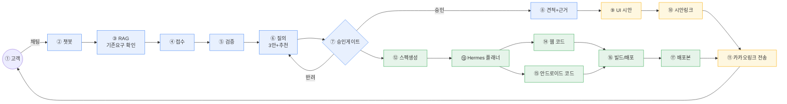
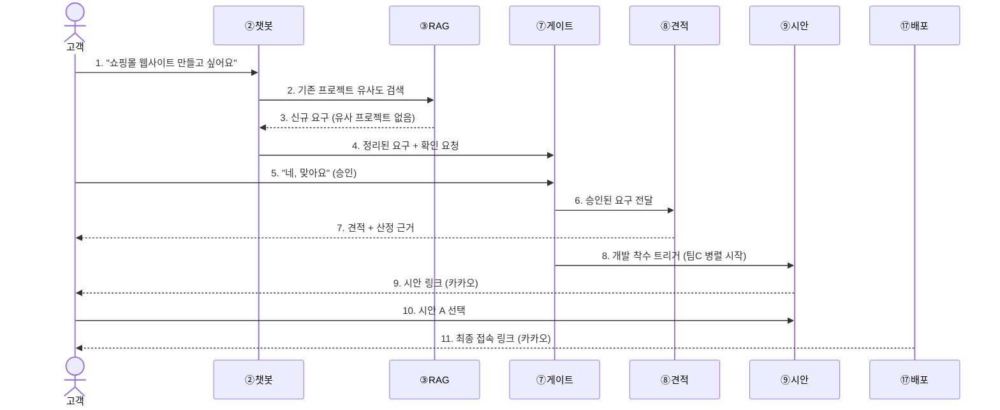
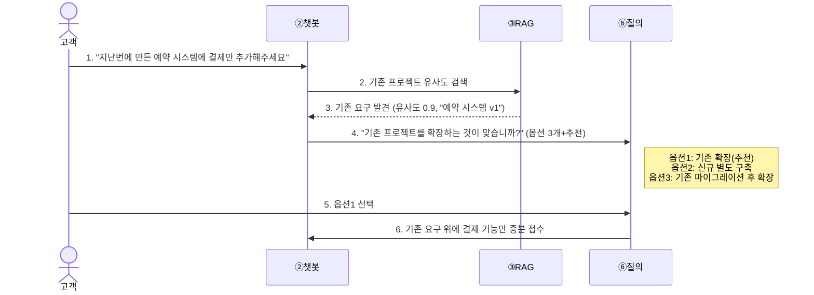
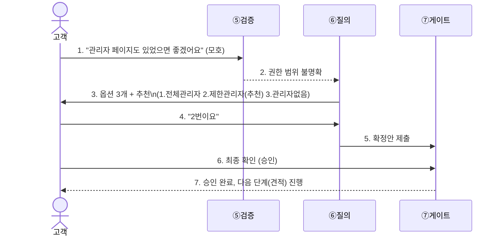
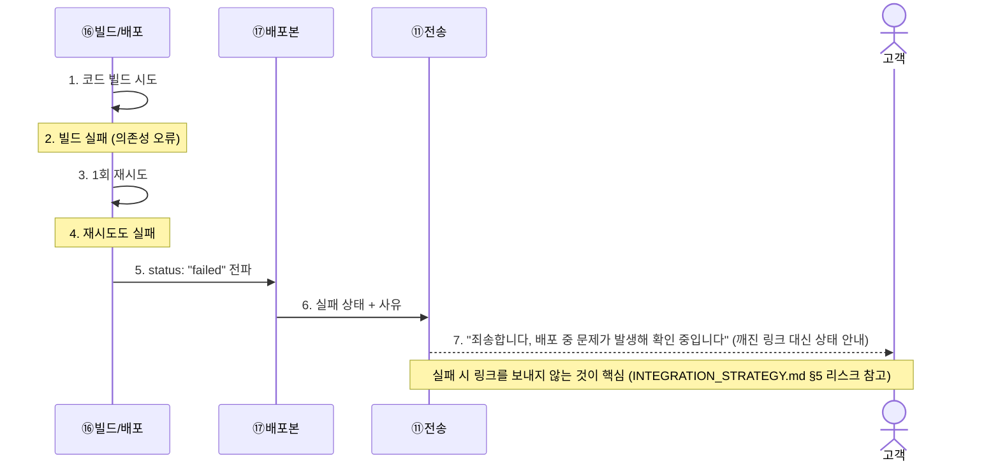
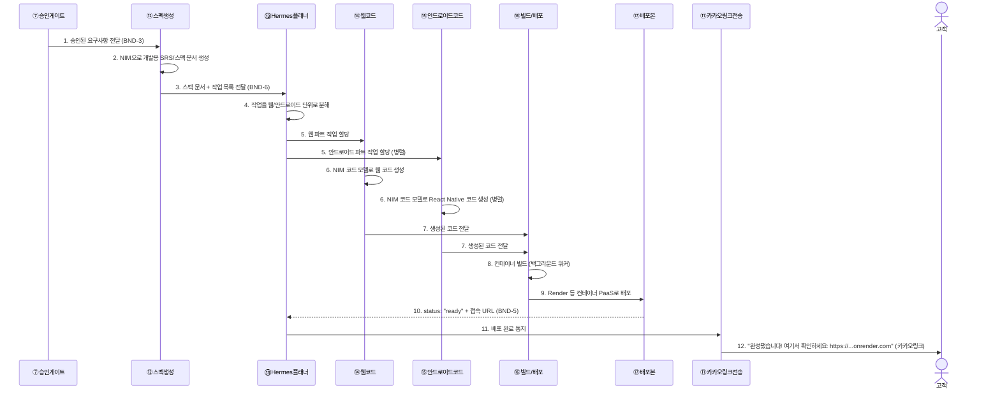

# agt001

이 저장소는 두 가지 문서 묶음을 담고 있다.

1. **`reqpipe`** — 기획서를 넣으면 요구사항 명세·아키텍처를 자동 생성하는 AI 드리븐 파이프라인의 기존 설계 문서
2. **NVIDIA 해커톤 프로젝트** — `reqpipe`의 개념(요구사항 접수→검증→질의→게이트→RAG)을 챗봇형 멀티에이전트 시스템으로 확장한 신규 프로젝트 (제출 기한 2026-09-28)

두 묶음은 서로 다른 목적을 갖지만, 해커톤 프로젝트는 `reqpipe`의 게이트·RAG·감사 개념을 재사용하므로 함께 보관한다.

## 시스템 블루프린트 (한눈에 보기)

해커톤 프로젝트(고객 채팅 → 코드 산출물) 전체를 압축한 그림이다. 번호(①~⑰)는 [docs/hackathon/ARCHITECTURE.md §1](docs/hackathon/ARCHITECTURE.md#1-시스템-컨텍스트-전체-그림)의 전체 번호 체계와 동일하며, 상세 설명·팀원별 담당은 그 문서를 본다.



> 파랑=팀원 A, 노랑=팀원 B, 초록=팀원 C. 경계별 데이터 계약은 [INTEGRATION_STRATEGY.md §1](docs/hackathon/INTEGRATION_STRATEGY.md#1-계약-우선-원칙--경계boundary-정의)에 정의되어 있다.

| 번호 | 노드 | 담당 | 설명 |
|---|---|---|---|
| ① | 고객 | - | 채팅으로 요구사항을 전달하고 시안·최종 링크를 받는 사용자 |
| ② | 챗봇 | 팀원 A | 고객 채팅이 들어오는 창구 |
| ③ | RAG | 팀원 A | 접수 전에 기존 프로젝트와 겹치는지 먼저 검색 |
| ④ | 접수 | 팀원 A | 채팅 내용을 구조화된 요구사항으로 정리 |
| ⑤ | 검증 | 팀원 A | 모호하거나 빠진 항목을 찾아냄 |
| ⑥ | 질의 | 팀원 A | 애매한 항목을 옵션 3개+추천으로 되물음 |
| ⑦ | 승인게이트 | 팀원 A | 고객이 반드시 채팅으로 확인해야 다음 단계로 진행 |
| ⑧ | 견적+근거 | 팀원 A | 승인된 요구로 견적과 산정 근거를 생성 |
| ⑨ | UI 시안 | 팀원 B | 커스텀 생성기로 시안 여러 종을 렌더링 |
| ⑩ | 시안링크 | 팀원 B | 고객이 시안을 확인·선택할 수 있는 링크 |
| ⑪ | 카카오링크 전송 | 팀원 B | 시안 링크와 최종 배포 링크를 고객에게 전송 |
| ⑫ | 스펙생성 | 팀원 C | 승인된 요구사항을 개발용 스펙 문서로 변환 |
| ⑬ | Hermes 플래너 | 팀원 C | 스펙을 작업 단위로 쪼개 코드생성 에이전트에 할당 |
| ⑭ | 웹 코드 | 팀원 C | 웹 산출물 코드 생성 |
| ⑮ | 안드로이드 코드 | 팀원 C | React Native 기반 코드 생성 |
| ⑯ | 빌드/배포 | 팀원 C | 생성된 코드를 빌드해 배포 |
| ⑰ | 배포본 | 팀원 C | 실제로 접속 가능한 최종 산출물 |

> 각 노드의 상세 설명·입출력 계약은 [ARCHITECTURE.md §1 번호별 설명](docs/hackathon/ARCHITECTURE.md#번호별-설명)과 [INTEGRATION_STRATEGY.md §1](docs/hackathon/INTEGRATION_STRATEGY.md#1-계약-우선-원칙--경계boundary-정의)을 본다.

## 사용자 시나리오 예시

같은 시스템이 상황에 따라 어떻게 다르게 움직이는지, 대표 시나리오 4가지를 시퀀스로 그렸다.

### 시나리오 1 — 정상 경로 (한 번에 승인, 신규 요구)



| 번호 | 무슨 일이 일어나는가 |
|---|---|
| 1 | 고객이 챗봇에 새 프로젝트를 요청한다 |
| 2 | 챗봇이 기존 프로젝트 중 비슷한 것이 있는지 RAG로 먼저 검색한다 |
| 3 | 검색 결과 유사한 기존 프로젝트가 없다고 확인된다 (신규 건) |
| 4 | 정리된 요구사항을 고객에게 보여주고 확인을 요청한다 |
| 5 | 고객이 승인한다 |
| 6 | 승인된 요구사항이 견적 담당으로 넘어간다 |
| 7 | 견적과 산정 근거가 고객에게 전달된다 |
| 8 | 동시에 개발 착수가 트리거되어 팀 C가 코드 생성을 시작한다 |
| 9 | 팀 B가 만든 UI 시안 링크가 카카오로 고객에게 전송된다 |
| 10 | 고객이 여러 시안 중 하나를 선택한다 |
| 11 | 개발이 끝나면 실제로 접속 가능한 최종 링크가 고객에게 전송된다 |

### 시나리오 2 — RAG가 기존 프로젝트를 발견 (재사용 경로)



| 번호 | 무슨 일이 일어나는가 |
|---|---|
| 1 | 고객이 기존 프로젝트를 확장해달라고 요청한다 |
| 2 | 챗봇이 RAG로 기존 프로젝트가 있는지 검색한다 |
| 3 | "예약 시스템 v1"이라는 기존 프로젝트가 90% 유사도로 발견된다 |
| 4 | 그냥 넘어가지 않고, 기존 것을 확장하는 게 맞는지 옵션 3개+추천으로 되묻는다 |
| 5 | 고객이 추천된 옵션(기존 확장)을 선택한다 |
| 6 | 처음부터 다시 만들지 않고, 기존 요구 위에 결제 기능만 추가로 접수된다 |

### 시나리오 3 — 검증 실패 → 재질의 → 승인 (반려 경로)



| 번호 | 무슨 일이 일어나는가 |
|---|---|
| 1 | 고객이 "관리자 페이지"라고만 말해, 권한 범위가 정해지지 않은 모호한 요구를 준다 |
| 2 | 검증 단계가 이 모호함을 잡아내 질의 단계로 넘긴다 |
| 3 | 질의 단계가 임의로 정하지 않고, 옵션 3개(+추천 1개)를 고객에게 되묻는다 |
| 4 | 고객이 추천된 "제한관리자" 옵션을 선택한다 |
| 5 | 명확해진 요구사항으로 확정안이 승인 게이트에 제출된다 |
| 6 | 고객이 최종적으로 한 번 더 확인해준다 (채팅 확인 필수 원칙) |
| 7 | 승인이 완료되어 다음 단계(견적)로 넘어간다 |

### 시나리오 4 — 배포 실패 처리 (실패 경로)



| 번호 | 무슨 일이 일어나는가 |
|---|---|
| 1 | 생성된 코드를 빌드한다 |
| 2 | 의존성 오류 등으로 빌드가 실패한다 |
| 3 | 자동으로 한 번 더 재시도한다 |
| 4 | 재시도도 실패한다 |
| 5 | "실패했다"는 상태가 배포 컴포넌트로 전달된다 (성공한 척하지 않음) |
| 6 | 실패 상태와 사유가 전송(카카오링크) 컴포넌트로 전달된다 |
| 7 | 고객에게는 깨진 링크 대신, 문제가 발생했다는 안내 메시지가 전송된다 |

### 시나리오 5 — 승인된 요구사항이 에이전트를 거쳐 카카오톡 링크로 도착하기까지 (개발~배포 상세)

시나리오 1은 전체 흐름을 압축해서 보여줬다. 여기서는 "⑦ 승인게이트를 통과한 이후, 코드가 실제로 만들어지고 배포되어 고객 카카오톡에 링크가 뜨기까지" 구간만 떼어 자세히 그린다.



| 번호 | 무슨 일이 일어나는가 |
|---|---|
| 1 | 고객이 승인한 요구사항이 스펙생성 에이전트(팀원 C)로 넘어간다 |
| 2 | 스펙생성 에이전트가 NIM을 호출해 개발자/AI가 코드로 옮길 수 있는 SRS/스펙 문서를 만든다 |
| 3 | 완성된 스펙과 작업 목록이 Hermes 플래너에게 전달된다 |
| 4 | 플래너가 이 작업을 "웹 만들기"와 "안드로이드 만들기"로 쪼갠다 |
| 5 | 웹 코드 에이전트와 안드로이드 코드 에이전트에게 각자의 작업을 동시에(병렬로) 할당한다 |
| 6 | 두 에이전트가 각각 NIM 코드 생성 모델을 불러 실제 코드를 만든다 (동시 진행) |
| 7 | 완성된 코드가 빌드/배포 파이프라인으로 모인다 |
| 8 | 코드를 컨테이너로 빌드한다 (오래 걸리는 작업이라 별도 백그라운드 워커에서 처리, §6-2 참고) |
| 9 | 빌드된 컨테이너를 Render 같은 상시 배포 서비스에 올린다 |
| 10 | 배포가 끝나면 "준비됨" 상태와 실제 접속 주소가 플래너에게 돌아온다 |
| 11 | 플래너가 배포 완료를 전송(카카오링크) 컴포넌트에 알린다 |
| 12 | 고객의 카카오톡으로 실제 접속 가능한 링크가 도착한다 — 이때부터 요구 5)("배포된 최종산출물은 동작하는 것") 충족 |
```

| 번호 | 무슨 일이 일어나는가 |
|---|---|
| 1 | 생성된 코드를 빌드한다 |
| 2 | 의존성 오류 등으로 빌드가 실패한다 |
| 3 | 자동으로 한 번 더 재시도한다 |
| 4 | 재시도도 실패한다 |
| 5 | "실패했다"는 상태가 배포 컴포넌트로 전달된다 (성공한 척하지 않음) |
| 6 | 실패 상태와 사유가 전송(카카오링크) 컴포넌트로 전달된다 |
| 7 | 고객에게는 깨진 링크 대신, 문제가 발생했다는 안내 메시지가 전송된다 |

## 폴더 구조

```
agt001/
├── README.md                          # 이 파일 — 전체 안내
├── docs/
│   ├── reqpipe/                       # 기존 reqpipe 시스템 문서 (읽는 순서: 01→02→03)
│   │   ├── 01_OVERVIEW_AND_HISTORY.md #   버전 이력·결정 근거 아카이브
│   │   ├── 02_REQUIREMENTS.md         #   ★ 정본 요구사항 ("시스템은 ~해야 한다", G01~G18)
│   │   ├── 03_SPEC.md                 #   구현 스펙 (API/데이터모델/상태/배포 + 부록 RAG·환경·구현전략)
│   │   └── archive/                   #   원본 근거자료 (CSV·mmd·toml 원문, 수정하지 않음)
│   │       ├── ARCH_S3_v1.2/          #     아키텍처 설계 원본 (모듈89·인터페이스22·다이어그램)
│   │       └── AI_pipeline_confirmed_v1.1/  # 결정 로그·파라미터 원본
│   └── hackathon/                     # NVIDIA 해커톤 신규 프로젝트 문서
│       ├── ARCHITECTURE.md            #   ★ 전체 아키텍처 (팀 역할분담·Mermaid·에이전트 구성)
│       ├── INTEGRATION_STRATEGY.md    #   팀원별 통합 전략 + 일자별 상세 마일스톤(D0~D7)
│       └── deployment/
│           ├── RENDER_DEPLOY.md       #     배포 가이드 (배경/목적/핸즈온, AI 에이전트 온보딩용)
│           ├── templates/             #     Dockerfile·render.yaml 템플릿
│           └── scripts/warmup.sh      #     콜드스타트 워밍업 스크립트
```

## 읽는 순서

### 처음 합류하는 팀원 (해커톤 작업을 할 사람)

1. 이 README — 전체 그림 파악
2. [docs/hackathon/ARCHITECTURE.md](docs/hackathon/ARCHITECTURE.md) — 시스템 컨텍스트, 팀원별 역할, 확정된 기술 결정
3. [docs/hackathon/INTEGRATION_STRATEGY.md](docs/hackathon/INTEGRATION_STRATEGY.md) — 내가 맡은 파트를 오늘부터 어떻게 시작할지(D0~D7 마일스톤)
4. [docs/hackathon/deployment/RENDER_DEPLOY.md](docs/hackathon/deployment/RENDER_DEPLOY.md) — 실제 배포를 맡았다면 여기까지
5. 필요 시 [docs/reqpipe/02_REQUIREMENTS.md](docs/reqpipe/02_REQUIREMENTS.md) — 재사용 중인 게이트/RAG/감사 개념의 원래 정의를 참고

### reqpipe 자체를 개발/검토할 사람

1. [docs/reqpipe/02_REQUIREMENTS.md](docs/reqpipe/02_REQUIREMENTS.md) — ★ 정본. "무엇을 만들어야 하는가"
2. [docs/reqpipe/03_SPEC.md](docs/reqpipe/03_SPEC.md) — "어떻게 코드로 옮기는가" (API·데이터모델·상태·배포)
3. [docs/reqpipe/01_OVERVIEW_AND_HISTORY.md](docs/reqpipe/01_OVERVIEW_AND_HISTORY.md) — 왜 지금 이 모습인지 근거가 필요할 때만
4. `docs/reqpipe/archive/` — 원본 CSV·다이어그램·결정 로그 (01/03 문서가 요약하며 링크하는 원본, 직접 열 필요는 거의 없음)

## 문서 작성 규칙 (이 저장소 공통)

- 각 문서는 상단에 **성격**(정본/아카이브/구현스펙 등)과 **개요**, **목차**, 필요 시 **용어집**을 둔다.
- 같은 표·다이어그램을 두 곳에 복사하지 않는다. 원본 위치를 정하고, 다른 문서에서는 링크만 한다 (`docs/reqpipe/01_OVERVIEW_AND_HISTORY.md` §8·§11 참고 — 아키텍처 원본은 `archive/ARCH_S3_v1.2/`가 정본).
- 용어는 [docs/reqpipe/02_REQUIREMENTS.md의 용어집](docs/reqpipe/02_REQUIREMENTS.md#02-용어집-한자어영어-약어-첫-등장-풀어쓰기)을 공통 정본으로 삼고, 각 하위 문서는 그 문서에서만 쓰는 용어만 추가로 정의한다 (예: [docs/hackathon/ARCHITECTURE.md §0.1](docs/hackathon/ARCHITECTURE.md#01-용어-이-문서-한정)).
