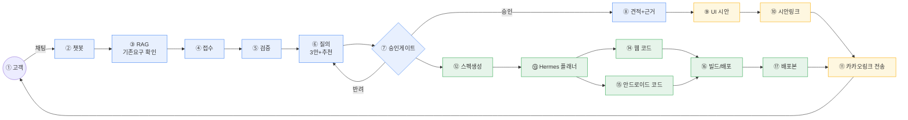
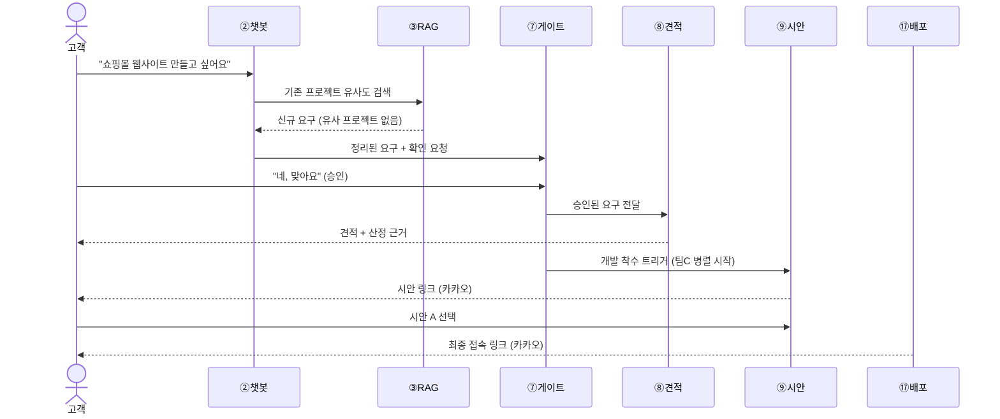
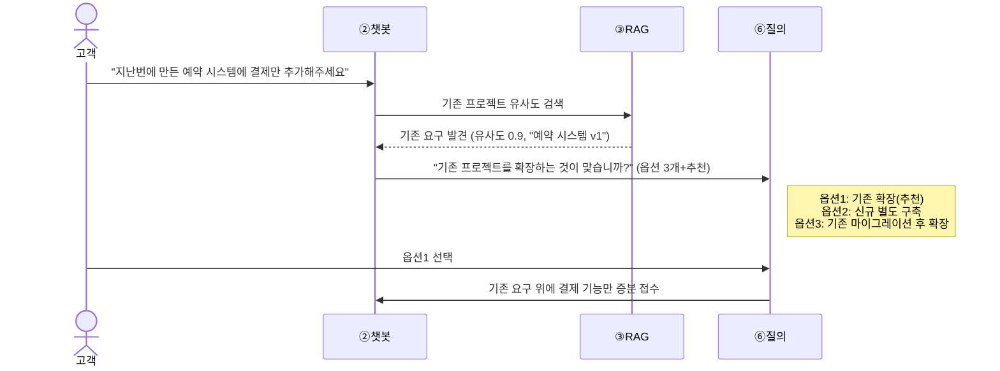
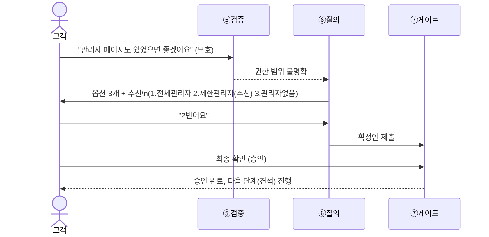

# agt001

이 저장소는 두 가지 문서 묶음을 담고 있다.

1. **`reqpipe`** — 기획서를 넣으면 요구사항 명세·아키텍처를 자동 생성하는 AI 드리븐 파이프라인의 기존 설계 문서
2. **NVIDIA 해커톤 프로젝트** — `reqpipe`의 개념(요구사항 접수→검증→질의→게이트→RAG)을 챗봇형 멀티에이전트 시스템으로 확장한 신규 프로젝트 (제출 기한 2026-09-28)

두 묶음은 서로 다른 목적을 갖지만, 해커톤 프로젝트는 `reqpipe`의 게이트·RAG·감사 개념을 재사용하므로 함께 보관한다.

## 시스템 블루프린트 (한눈에 보기)

해커톤 프로젝트(고객 채팅 → 코드 산출물) 전체를 압축한 그림이다. 번호(①~⑰)는 [docs/hackathon/ARCHITECTURE.md §1](docs/hackathon/ARCHITECTURE.md#1-시스템-컨텍스트-전체-그림)의 전체 번호 체계와 동일하며, 상세 설명·팀원별 담당은 그 문서를 본다.



> 파랑=팀원 A, 노랑=팀원 B, 초록=팀원 C. 경계별 데이터 계약은 [INTEGRATION_STRATEGY.md §1](docs/hackathon/INTEGRATION_STRATEGY.md#1-계약-우선-원칙--경계boundary-정의)에 정의되어 있다.

## 사용자 시나리오 예시

같은 시스템이 상황에 따라 어떻게 다르게 움직이는지, 대표 시나리오 4가지를 시퀀스로 그렸다.

### 시나리오 1 — 정상 경로 (한 번에 승인, 신규 요구)



### 시나리오 2 — RAG가 기존 프로젝트를 발견 (재사용 경로)



### 시나리오 3 — 검증 실패 → 재질의 → 승인 (반려 경로)



### 시나리오 4 — 배포 실패 처리 (실패 경로)


## 폴더 구조

```
agt001/
├── README.md                          # 이 파일 — 전체 안내
├── docs/
│   ├── reqpipe/                       # 기존 reqpipe 시스템 문서 (읽는 순서: 01→02→03)
│   │   ├── 01_OVERVIEW_AND_HISTORY.md #   버전 이력·결정 근거 아카이브
│   │   ├── 02_REQUIREMENTS.md         #   ★ 정본 요구사항 ("시스템은 ~해야 한다", G01~G18)
│   │   ├── 03_SPEC.md                 #   구현 스펙 (API/데이터모델/상태/배포 + 부록 RAG·환경·구현전략)
│   │   └── archive/                   #   원본 근거자료 (CSV·mmd·toml 원문, 수정하지 않음)
│   │       ├── ARCH_S3_v1.2/          #     아키텍처 설계 원본 (모듈89·인터페이스22·다이어그램)
│   │       └── AI_pipeline_confirmed_v1.1/  # 결정 로그·파라미터 원본
│   └── hackathon/                     # NVIDIA 해커톤 신규 프로젝트 문서
│       ├── ARCHITECTURE.md            #   ★ 전체 아키텍처 (팀 역할분담·Mermaid·에이전트 구성)
│       ├── INTEGRATION_STRATEGY.md    #   팀원별 통합 전략 + 일자별 상세 마일스톤(D0~D7)
│       └── deployment/
│           ├── RENDER_DEPLOY.md       #     배포 가이드 (배경/목적/핸즈온, AI 에이전트 온보딩용)
│           ├── templates/             #     Dockerfile·render.yaml 템플릿
│           └── scripts/warmup.sh      #     콜드스타트 워밍업 스크립트
```

## 읽는 순서

### 처음 합류하는 팀원 (해커톤 작업을 할 사람)

1. 이 README — 전체 그림 파악
2. [docs/hackathon/ARCHITECTURE.md](docs/hackathon/ARCHITECTURE.md) — 시스템 컨텍스트, 팀원별 역할, 확정된 기술 결정
3. [docs/hackathon/INTEGRATION_STRATEGY.md](docs/hackathon/INTEGRATION_STRATEGY.md) — 내가 맡은 파트를 오늘부터 어떻게 시작할지(D0~D7 마일스톤)
4. [docs/hackathon/deployment/RENDER_DEPLOY.md](docs/hackathon/deployment/RENDER_DEPLOY.md) — 실제 배포를 맡았다면 여기까지
5. 필요 시 [docs/reqpipe/02_REQUIREMENTS.md](docs/reqpipe/02_REQUIREMENTS.md) — 재사용 중인 게이트/RAG/감사 개념의 원래 정의를 참고

### reqpipe 자체를 개발/검토할 사람

1. [docs/reqpipe/02_REQUIREMENTS.md](docs/reqpipe/02_REQUIREMENTS.md) — ★ 정본. "무엇을 만들어야 하는가"
2. [docs/reqpipe/03_SPEC.md](docs/reqpipe/03_SPEC.md) — "어떻게 코드로 옮기는가" (API·데이터모델·상태·배포)
3. [docs/reqpipe/01_OVERVIEW_AND_HISTORY.md](docs/reqpipe/01_OVERVIEW_AND_HISTORY.md) — 왜 지금 이 모습인지 근거가 필요할 때만
4. `docs/reqpipe/archive/` — 원본 CSV·다이어그램·결정 로그 (01/03 문서가 요약하며 링크하는 원본, 직접 열 필요는 거의 없음)

## 문서 작성 규칙 (이 저장소 공통)

- 각 문서는 상단에 **성격**(정본/아카이브/구현스펙 등)과 **개요**, **목차**, 필요 시 **용어집**을 둔다.
- 같은 표·다이어그램을 두 곳에 복사하지 않는다. 원본 위치를 정하고, 다른 문서에서는 링크만 한다 (`docs/reqpipe/01_OVERVIEW_AND_HISTORY.md` §8·§11 참고 — 아키텍처 원본은 `archive/ARCH_S3_v1.2/`가 정본).
- 용어는 [docs/reqpipe/02_REQUIREMENTS.md의 용어집](docs/reqpipe/02_REQUIREMENTS.md#02-용어집-한자어영어-약어-첫-등장-풀어쓰기)을 공통 정본으로 삼고, 각 하위 문서는 그 문서에서만 쓰는 용어만 추가로 정의한다 (예: [docs/hackathon/ARCHITECTURE.md §0.1](docs/hackathon/ARCHITECTURE.md#01-용어-이-문서-한정)).
