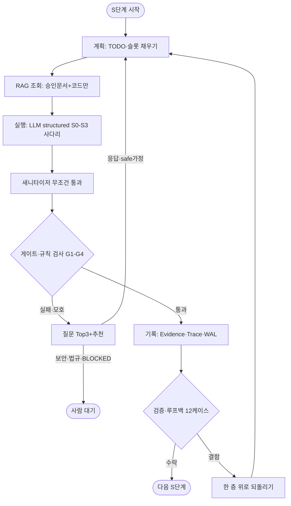
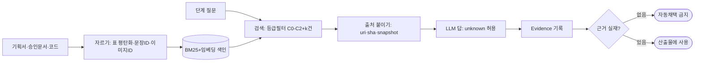
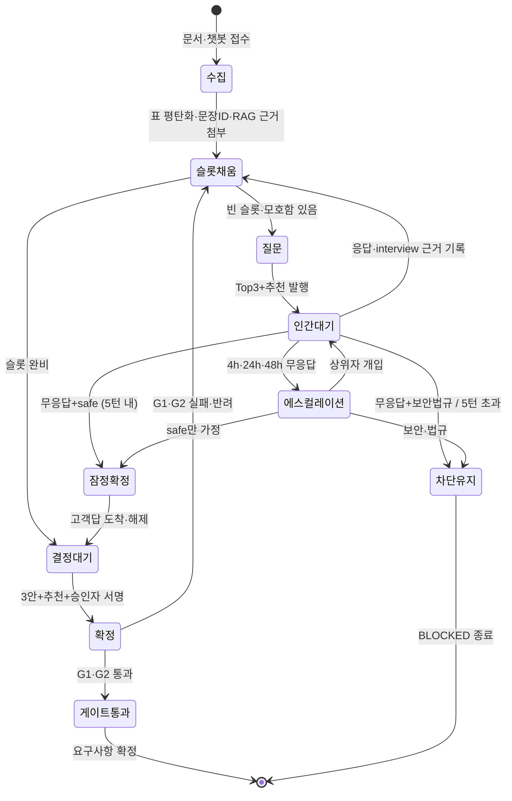

# SPEC.md — reqpipe v1.2 (AI 드리븐 개발 파이프라인)

> 작성일: 2026-09-21 / 기준: SRS.md + SRS_shall.md + AI_pipeline_confirmed_v1.1 + ARCH_S3_v1.2
> 언어: 한국어 (MD는 한국어, 코드는 프로그래밍 언어). 비개발자가 MD를 관리하고 AI가 MD를 보고 코드를 뽑는 구조.
> 읽는 순서: 1 개요 → 2 용어 → 3 요구 → 4 시나리오 → 5 API → 6 데이터 → 7 상태 → 8 예외 → 9 권한 → 10 UI → 11 인수 → 12 로그 → 13 배포 → 부록 MECE/MD주기

## 1. 프로젝트 개요 (Overview)

### 1-1. 기능 (무엇을 하는가)

| 입력 | 처리 | 출력 4종 |
|---|---|---|
| 기획서·문서 파일 + 필요 시 AI 챗봇 수집 + 프로파일 YAML | 12단계 파이프라인(S0 환경→S1 시스템요구→S2 소프트웨어요구→S3 결정→S4 아키텍처→S5 계약→S6 유닛→S7 마일스톤→S8 TODO→S9 검증→S10 스캐폴딩→S11 릴리스) + 5게이트 | ① 사용자 이야기+인수조건 ② SRS 명세서 ③ AI 작업지시서 ④ 비개발자 핵심기능 정리 |

### 1-2. 목적 (왜 만드는가)

| 문제 정의 | 비즈니스 배경 |
|---|---|
| 기획서가 있어도 해석이 사람마다 다르고, AI가 없는 사실을 지어내며(환각), 보내면 안 되는 정보(개인정보·열쇠·고객 실명+계약)가 밖으로 샌다 | 1인이 기획→개발→감사까지 돌려야 하는 구조. 승인자는 1명, 고객은 카카오톡으로만 답한다. 기록이 없으면 `왜 이렇게 만들었나`를 나중에 증명할 수 없다 |
| 파서·질문·승인·감사가 따로 놀면 재현이 안 되고 무한 반복이 생긴다 | 로컬 PC 1대로 시작(P0)해서 나중에 클라우드(OCI)로 옮겨야 한다. 처음부터 뼈대(M1, 인터넷 없이 동작)를 굳혀야 한다 |

### 1-3. 기대 효과

| 효과 | 측정 |
|---|---|
| 해석 다툼 제거: 한 문장 한 행동 `시스템은 ~해야 한다` 90여 개로 고정 | G1~G5 게이트 통과율, 루프백 재발 2회 이상 0건 |
| 유출 차단: 하드금지 3범주 모드 무관 차단 + 기록 실패 시 미전송 | 외부송신 차단 건수·사유 분포 (SWR-EGR-013 사전 산출과 대조) |
| 재현 가능: 난수 금지·순서 고정·결정적 규칙 우선 | 동일 입력 재실행 diff 0건, M1 네트워크 차단 테스트 전량 통과 |
| 감사 가능: 전량 원문 보관+암호화+해시 사슬 | chain verify 통과, 예외 1건당 레코드 3종 존재 |
| 단계 제작: M1→M2→M3 | M1 50모듈 → M2 36모듈 → M3 3모듈 완료 |

## 2. 용어 정의 (Glossary)

### 2-1. 도메인 용어

| 용어 | 뜻 (쉬운 말) |
|---|---|
| 산출물(産出物) | 만들어 내놓는 문서·파일 4종 |
| 추적(追跡, Trace) | 어디서 와서 어디로 갔는지 연결선으로 따라가는 일 (TRC-01~09) |
| 승인(承認) | `맞다`고 확정하는 일. 내부는 1인, 고객은 링크 응답 |
| 가정(假定, Assumption) | 답이 없어 일단 `이렇다고 치고` 가는 것. safe/risky 구분, 잠정(暫定, Provisional) 표식 |
| 증거(證據, Evidence) | `왜 이렇게 적었나`를 받치는 출처 (uri·스냅샷·커밋·nature·derivation) |
| 질문(質問, Ask) | Top-3+추천, 점수·MMR로 고른 것. audience internal/customer 구분 |
| 결정(決定, Decision) | 3안+추천+선택+근거+승인자+시각 기록 |
| 게이트(Gate) | 다음 단계로 못 가게 막는 문 5개 (G1 완결→G2 확정0→G3 계약→G4 TODO연결→G5 수락) |
| 루프백(Loopback) | 검증 실패 시 되돌아가는 층 판정. 12케이스 규칙표, LLM 판정 금지 |
| 에그레스(Egress, 외부 송신) | 밖으로 보내는 것. 유일 통로 egress_broker로만 가능 |
| 감사(監査, Audit) | 보낸 기록을 장부(WAL+해시 사슬)에 남겨 나중에 따지는 일 |
| 잠정(暫定, Provisional) | 고객 답 대기 중 임시 확정. 1건이라도 남으면 출시 금지 |
| 에이전트(Agent) | 사용자를 대신해 단계별로 일하는 실행자 5역할 (계획·검색·실행·검증·질문). 상세 UC-5, 요구 SRS_shall G17 |
| 검색 증강 생성(RAG) | 필요한 승인문서를 찾아 AI에게 먹이는 방식. 승인된 것만, 출처 필수. 상세 UC-6, 요구 SRS_shall G18 |

### 2-2. 약어·내부 용어

| 약어 | 풀어쓰기 |
|---|---|
| SRS / SYS / SWR | 소프트웨어 요구사항 명세서 (Software Requirements Specification) / 시스템 요구 (System) / 소프트웨어 요구 (Software) |
| FR / NFR | 기능 요구 (Functional) / 비기능 요구 (Non-Functional) |
| CLI | 명령줄 인터페이스 (Command Line Interface) |
| LLM / RAG / NIM | 거대 언어 모델 (Large Language Model) / 검색 증강 생성 (Retrieval-Augmented Generation) / 엔비디아 추론 서비스 (NVIDIA Inference Microservice) |
| BaaS / WAL / HMAC·SHA | 서비스형 백엔드 (Backend as a Service) / 선행 장부 (Write-Ahead Log) / 인증 코드·해시 (Hash-based Message Authentication Code, Secure Hash Algorithm) |
| AC | 인수조건 (引受條件, Acceptance Criteria) |
| C0/C1/C2 | 비기밀 / 사내한정 / 기밀. 미지정=C1 |
| P0 / M1/M2/M3 | 0단계 형태(로컬 PC) / 만들기 순서 1·2·3단계 |
| S0~S12 / G1~G5 | 파이프라인 12단계 / 게이트 5개 |
| TTL | 유효 기간 (Time To Live, 72h 잠정) |
| venv / OCI / NGC | 가상환경 (virtual environment) / 오라클 클라우드 (Oracle Cloud Infrastructure) / 엔비디아 클라우드 (NVIDIA GPU Cloud) |

## 3. 요구사항 (Requirements)

> 전체 90여 개 `시스템은` 문장은 SRS_shall.md G01~G16에 있다. 여기서는 유저 시나리오형 기능 요구와 비기능 요구로 요약하고, ID로 연결한다.

### 3-1. 기능 요구사항 (Functional)

| ID | 유저 시나리오형 요구 |
|---|---|
| FR-U01 | 사용자는 기획서 파일을 CLI에 넣어 4종 산출물을 받을 수 있다 (REQ-G01-001/002) |
| FR-U02 | 사용자는 도메인을 CLI 인자로 지정할 수 있다. 시스템이 알아서 추측해서는 안 된다 (REQ-G01-004/005) |
| FR-U03 | 사용자는 표·그림이 섞인 문서도 문장 ID가 붙은 상태로 읽을 수 있다 (REQ-G02-001/002) |
| FR-U04 | 내부 담당자는 질문 Top-3+추천을 CLI 큐에서 보고 답할 수 있다 (REQ-G03-003/004) |
| FR-U05 | 고객은 카카오톡 링크로 온 질문에만 답할 수 있고 내부 큐를 볼 수 없다 (REQ-G03-007/008) |
| FR-U06 | 승인자는 3안+추천 결정을 확정하고 근거를 남길 수 있다 (REQ-G04-003) |
| FR-U07 | 사용자는 `run` 한 번으로 S0→S11을 게이트와 함께 돌릴 수 있다 (REQ-G05-001/002) |
| FR-U08 | 사용자는 외부 보내기 전에 등급·금지·허용 순서로 자동 판정받을 수 있다 (REQ-G08-002/003) |
| FR-U09 | 승인자는 오탐 예외를 건별로 TTL과 함께 줄 수 있다. 전체 해제는 할 수 없다 (REQ-G11-001~003) |
| FR-U10 | 사용자는 `ask`(질문 보기)·`audit`(기록 보기·검증)·`conformance`(검사)로 따로 조회할 수 있다 (REQ-G14-005) |
| FR-U11 | 사용자는 스캐폴딩 계획(plan)을 먼저 보고 사람 코드를 지키는 방식으로만 적용(apply)할 수 있다 (REQ-G15-007/008) |

### 3-2. 비기능 요구사항 (Non-functional)

| 구분 | 요구 |
|---|---|
| 보안 | C0/C1/C2 판정·상속·강등승인 (G07). 하드금지 모드 무관 차단 (G08). AES-256-GCM 보관, 키 없으면 거부 (G09). 소켓 1파일 제한 (G08) |
| 성능 | 탐지 지연 500ms 잠정(5회 중앙값 교체). 추출 병렬 4콜만, 전면 async 금지 (G13) |
| 가용성 | P0 로컬 단독, 벽시계 기준, 재기동 캐치업 (G12/G14). M1 네트워크 차단 동작 (G16) |
| 확장성 | 어댑터 교체는 deploy.yaml 한 줄. P1 전환은 설정 한 줄 (D20-C). BaaS/SQLite 동일 계약 (G13) |
| 재현성 | 난수 금지, 순서 고정, 결정적 규칙 우선, structured 실패→unknown 합류 (G04/G06) |
| 감사성 | WAL+해시 사슬, verify 통과, 예외 3종 기록, 보존 90d 잠정 (G09) |

## 4. 유스케이스 / 시나리오 (Use cases)

### UC-1. 첫 실행~산출물 받기 (정상 흐름)

```
1. 사용자: reqpipe run --domain web_internal --input 기획서.pdf
2. 시스템: S0 환경·능력협상 → S1 SYS 분석 → S2 SWR 전개 → S3 결정 3안
3. 내부 승인자: ask 큐에서 Top-3 확인·확정 (무응답 시 safe만 가정, 보안은 BLOCKED)
4. 시스템: S4 아키텍처→S5 계약→S6 유닛→S7 마일스톤→S8 TODO (G1~G4 검사)
5. 시스템: S9 검증·루프백 판정 (12케이스, 2회 재발 시 상위 승격)
6. 시스템: S10 스캐폴딩 plan 제시→사람 확인→apply (마커 밖 보존)
7. 시스템: S11 릴리스 (G5 AC100%+라인70%+provisional 0건이면 생성)
```

### UC-2. 고객 질문 왕복 (반자동)

```
1. 시스템: customer용 질문 2건 생성 → 카카오 링크+메시지 생성 (발송은 사람)
2. 고객: 링크로 답장 → 사용자: CLI에 답 입력 → interview:// 근거 기록
3. 시스템: PRV 잠정 해제 → 파생 전파 → 릴리스 차단 해제
```

### UC-3. 외부 보내기 1건 (단일 통로)

```
classify(C0/C1/C2, 미지정=C1) → gate(deny_hard>allowlist>mode)
→ deny면 Blocked+예외신청 안내
→ allow/audit면 WAL begin(원문 포함) → send(req, decision)
→ transport에서 HMAC 지문 대조 → HTTPS → WAL commit
→ WAL 실패 어느 지점이든 중단
```

### UC-4. 에스컬레이션·재기동

```
질문 무응답 4h→L1, 24h→L2, 48h→L3 (업무시간 정지)
PC 종료 후 재기동: TTL 만료 캐치업 회수 + 체크포인터 이어하기
```

### UC-5. 에이전트 루프 (Agent, 대리 실행자) — 한눈보기

> 에이전트(Agent, 사용자를 대신해 단계별로 일하는 실행자)는 S1~S12 각 단계 노드로 돌고, 매번 게이트·감사를 거친다. LLM이 멋대로 판단하지 않고 규칙(policy)이 판정한다.



| 역할 | 담당 | 금지 |
|---|---|---|
| 계획자(Planner) | TODO·슬롯 채우기, 순서 정하기 | 출처 없는 값 만들기 금지 |
| 검색자(Retriever) | 승인 문서·코드에서 근거 가져오기 | 티켓·PR·미승인 글 가져오기 금지 |
| 실행자(Executor) | LLM structured 호출, 4콜 분할 | 새니타이저 건너뛰기 금지 |
| 검증자(Verifier) | G1~G4·루프백 12케이스 판정 | LLM으로 층 판정하기 금지 |
| 질문자(Questioner) | Top-3+추천, audience 분리 | customer를 내부 큐에 보이기 금지 |

### UC-6. RAG 파이프라인 (검색 증강 생성) — 한눈보기

> RAG(Retrieval-Augmented Generation, 필요한 문서를 찾아서 AI에게 먹이는 방식)는 승인된 것만 찾아서 답에 출처를 붙인다.



## 5. API 명세 (API Spec)

> 본 시스템은 REST 서버가 아니라 CLI + 내부 포트 계약이다. 외부로 열리는 것은 CLI 4 명령과 어댑터 2 HTTP뿐이다.

### 5-1. CLI (사용자 접점)

| 커맨드 | 용도 | 주요 인자 | 성공 출력 | 실패 |
|---|---|---|---|---|
| `run` | 파이프라인 실행 | --domain, --input, --profile | 산출물 4종 + verification report | 게이트 미통과 시 중단·리포트 |
| `ask` | 질문 조회·답 입력 (내부 전용) | --list, --answer | 큐 목록·접수 영수증 | customer 항목 요청 시 거부 |
| `audit` | 감사 조회·검증·전환 시뮬 | --verify-chain, --simulate-enforce | 무결성 리포트, 차단 분포 | 체인 깨지면 FAIL |
| `conformance` | 레이어·누출·소켓 검사 | (없음) | PASS/FAIL n건 | 위반 1건이면 exit 1 |

### 5-2. 내부 포트 11종 22메서드 (요약, 전문은 ARCH_S3_v1.2)

| 포트 | 대표 메서드 | request | response | 에러 |
|---|---|---|---|---|
| StorePort | save/load/find/link/neighbors/transaction/schema_version | kernel 엔티티·필터 | ID·목록·ctx | IntegrityError, PolicyError, CycleError, TxError, QueryError |
| TransportPort | send(req, decision) 필수 / health | EgressRequest+Decision | Response/Status | GateBypass, FingerprintMismatch, TransportError |
| LLMPort | structured / capabilities | 스키마·프롬프트·예산 | 객체+사용량 / Caps | StructuredFailure→unknown 슬롯 |
| DocPort / IndexPort | load / search | URI / 질의+k+등급필터 | 블록·청크+출처 | DocError |
| NotifyPort | notify | 채널·대상·본문·링크 | 영수증 | NotifyError (customer는 생성까지) |
| ClockPort | now | - | 벽시계 | - (monotonic 미제공) |
| AuditPort | begin/commit/verify_chain | 레코드(원문)·WAL ID | WAL ID·리포트 | AuditWriteError→송신 중단 |
| RenderPort | render | 종류+SpecModel | 바이트 | RenderError |
| ScaffoldPort | plan/apply | 아키텍처/계획+mode | 계획·결과 | OverwriteBlocked |
| MetricsPort | record | 메트릭 | - | 임계 시 CLI 경고 |

### 5-3. 외부 HTTP (어댑터만)

| 호출 | 메서드·경로 | 용도 | 비고 |
|---|---|---|---|
| NIM 호스티드 | POST /v1/chat/completions (OpenAI 호환) | LLM structured | ready/live 분리 확인, 실패 시 최악값 |
| 외부 엔드포인트 | HTTPS (transport_https만 소켓 보유) | 승인된 송신만 | Decision 지문 일치 시만 발송 |

## 6. 데이터 모델 (Data Model)

### 6-1. 엔티티표 (kernel L0)

| 엔티티 | 필드 | 설명 |
|---|---|---|
| ProjectContext | id, 배경·이해관계자·제약·용어 | 프로젝트당 1개 |
| Requirement | id, 항목 N개, SlotValue(dict), deps, conflicts | 슬롯명 하드코딩 금지 |
| Evidence | source_uri, snapshot, commit_sha, nature(normative/descriptive), derivation(verbatim/derived/inferred) | 출처 증빙 |
| Assumption | safe/risky, Provisional 플래그·전파 | 무응답 가정 관리 |
| Question/Answer | target, audience(internal/customer), score, answer | Top-3+추천 |
| DecisionRecord | 3안·추천·선택·근거·승인자·확정시각 | D1~D42 전량 |
| TraceNode/Edge | LinkType derives/verifies/implements/conflicts/assumes | 영향분석 기반 |
| Classification | Level C0/C1/C2, ClassifiedPayload, 상속(최댓값) | 미지정=C1 |
| EgressRequest/Decision | payload·목적 / verdict·지문(HMAC)·발행자(gate) | 봉인형, gate만 생성 |
| SpecModel | 정본 1개 + 4종 뷰 식별자 | 렌더 단일 근원 |
| AuditRecord/WAL | 원문·등급·판정·prev_hash·결과 | append-only, 90d 보존 잠정 |

### 6-2. 관계 (ERD 문장형)

```
ProjectContext 1 ─ N Requirement
Requirement N ─ N Evidence (verifies)
Requirement N ─ N Assumption (assumes)
Requirement N ─ N Question (묻고 답함)
Question N ─ 1 Answer (또는 무응답→Assumption)
Requirement N ─ N DecisionRecord (derives)
Requirement N ─ N TraceEdge (derives/verifies/implements/conflicts)
Requirement 1 ─ 1 Classification (등급)
EgressRequest N ─ 1 EgressDecision (판정)
EgressRequest 1 ─ N AuditRecord (begin/commit)
DecisionRecord 1 ─ N Exception (TTL·범위)
SpecModel 1 ─ 4 산출물뷰 (US+AC/SRS/지시서/KeyFeature)
```

### 6-3. 저장 스키마

| 항목 | 정본 | 규칙 |
|---|---|---|
| 스키마 파일 | 마이그레이션 파일 | ORM·콘솔이 정본이 아님. 콘솔 수기 변경은 schema_version 불일치로 기동 검출 |
| 저장소 | SQLite(P0 기본) / BaaS(M2) 동일 StorePort | 코어에 벤더 심볼 노출 금지 |
| 디렉터리 | 단일 작업디렉터리 (DB·WAL·픽스처·산출물) + SqliteSaver 체크포인터 | 복사만으로 OCI 이전 가능 |

## 7. 상태 흐름 (State / Flow)

### 7-1. 파이프라인 상태

```
S0 ENV → S1 SYS →[G1]→ S2 SWR →[G2]→ S3 DEC → S4 ARCH →[G3]→ S5 IFC
→ S6 UNT → S7 MS(병렬) → S8 TODO →[G4]→ S9 VERIFY → S10 SCF → S11 REL[G5]
VERIFY 실패 → UNIT(구현결함) / ARCH(IF불일치) / SWR(AC모순) / SYS(상위충돌·신규)
UNIT에서 동일결함 2회 → ARCH 강제 승격
```

### 7-2. 에그레스 1건 상태

```
요청 → 분류(C0/C1/C2) → 판정(deny_hard/allow/audit) → WAL begin
→ send+지문대조 → HTTPS → commit → 응답
deny → Blocked (예외신청 가능) / WAL실패·지문불일치·키없음 → 미송신
```

### 7-3. 질문·에스컬레이션 상태

```
생성(Top3+추천) → 대기(L0) → 4h→L1 → 24h→L2 → 48h→L3 (업무시간 정지)
→ 응답(접수·근거 기록) / 무응답(safe 가정 or 보안 BLOCKED 유지)
```

### 7-4. 잠정(PRV) 상태

```
대기 → 임시확정(전파 표식) → 고객답 → 해제 / 미해제 잔류 시 릴리스 금지
```

### 7-5. 에이전트 요구사항 수신 상태머신 (한눈보기)

> 에이전트가 문서 한 건을 받아 확정된 요구사항으로 바꾸기까지의 상태. 인터뷰 최대 5턴, 반복 상한 5회(D44 제안), 보안·법규는 자동가정 금지.



## 8. 예외 처리 (Error Handling)

| 코드/상황 | 메시지(예) | 처리 |
|---|---|---|
| GateBypass | `게이트를 거치지 않은 송신` | 컴파일 불가 구조 + 정적검사 FAIL |
| FingerprintMismatch | `지문 불일치, 재사용 의심` | 미송신, 감사에 기록 |
| AuditWriteError (begin) | `장부 기록 실패` | 송신 중단 (사후감사 성립 조건) |
| PolicyLoadFail (D33) | `reviewed_on 만료·스키마 불일치` | 기동 중단 (fail-closed) |
| KeyMissing/DecryptFail | `감사 키 없음·복호 실패` | 신규 전송 거부, 기동 시 send 0건 |
| RosterMissing | `명부 없음, 실명 미탐` | 기동 배너 경고 1건, pass 기록 금지 |
| SchemaMismatch | `스키마 버전 불일치` | 기동 시 검출·중단 |
| OverwriteBlocked | `사람 영역 덮어쓰기 차단` | 스캐폴딩 중단, plan 재확인 |
| CycleError | `requires 순환` | 링크 거부 |
| StructuredFailure | `LLM 출력 불량` | unknown 슬롯→질문 경로 합류 (예외 던지지 않음) |
| CapabilityProbeFail | `능력 확인 실패` | 최악값 고정, 예외 없이 진행 |
| G1~G5 미통과 | `게이트 n 미통과: 사유` | 다음 단계 차단, 리포트 출력 |

## 9. 권한 / 인증 (Auth & Permission)

| 주체 | 가능 | 금지 |
|---|---|---|
| 사용자 (CLI 조작) | run/ask(내부)/audit/conformance, 답 입력, plan 확인·적용 | customer 항목 조회, 사람 영역 강제 덮어쓰기, 게이트 우회 송신 코드 작성 |
| 내부 단일 승인자 1인 | 결정 확정, 등급 강등 승인, 예외 건별 부여(TTL·범위) | 전역·카테고리 일괄 해제 |
| 고객 (외부) | 카카오 링크 질문에 답장 | 내부 큐·산출물 중간물·감사 원문 접근 |
| 시스템 (기계) | 등급 판정·게이트·WAL·지문 대조를 코드 상수로 수행 | 정책파일·P0허용으로 하드금지 뒤집기, monotonic 제공, 소켓 분산 보유 |

등급·키 규칙: 미지정 입력=C1. 파생=최댓값 상속. 강등=승인 레코드 필수. 키=OS 키링 우선, 없으면 mode 600 파일. 키 없으면 전송 거부.

## 10. UI/UX

> 별도 피그마 없음. UI는 CLI 4 명령과 기동 배너·리포트·다이어그램 텍스트다.

| 화면 | 구성 | 인터랙션 |
|---|---|---|
| `run` 진행 | 단계 S0→S11 진행률(자기보고 아님, 단계 완료 기준), 게이트 결과, 산출물 경로 | 실패 시 해당 게이트 리포트와 되돌아갈 층 안내 |
| `ask` 큐 | Top-3+추천, 점수 요소(영향·불확실·차단−비용), audience 뱃지 | depends_on은 보류 표시, 동점은 선언순, 최대 5턴 인터뷰 |
| `audit` 뷰 | 체인 verify PASS/FAIL, 예외 TTL 남은 시간(벽시계), enforce 시뮬 분포 | 깨지면 FAIL 행과 첫 깨진 위치 표시 |
| 기동 배너 | 명부 미로드 경고, reviewed_on 만료 경고, 키 상태 | 경고 1건씩, 통과 처리 없음 |
| 다이어그램 | .mmd 3종 (층·송신순서·루프백) | 텍스트 diff로 리뷰, 외부 뷰어로 렌더 |
| 스캐폴딩 | plan(생성·수정 목록) → 사람 확인 → apply | 마커 밖 수정은 손대지 않음 표시 |

원칙: 질문 순서 난수 금지(재현성). customer 생성은 링크·메시지까지, 발송은 사람(반자동).

## 11. 테스트 기준 (Acceptance Criteria)

### Done의 정의 (모두 만족해야 완료)

| # | 완료 조건 |
|---|---|
| 1 | AC 100% + 신규코드 라인 커버리지 70%, 측정 실패는 불통과 (Q5/G5) |
| 2 | G1~G5 전부 통과, TODO-테스트 연결 누락 0건 (G4) |
| 3 | provisional 잔류 0건 (관통원칙) |
| 4 | chain verify 통과 + 예외 1건당 레코드 3종 (G09) |
| 5 | M1 전량 네트워크 차단 테스트 통과 (NF-AVL-02) |
| 6 | 정적검사 3종 PASS (layering·leakage·socket_owner) |
| 7 | 키 제거 기동 시 send 0건, 명부 없이 기동 시 경고 1건·pass 0건 (SWR-AUD-012/DET-011/012) |
| 8 | PC 96h 종료 후 기동 시 72h 예외 만료 처리 (SWR-EXC-004) |

QA이자 PR 기준: 위 8개 중 1개라도 깨지면 병합·출시 금지. 잠정값(90d/72h/1회/500ms)은 운영 5회 후 중앙값·규정으로 교체하고 다시 측정한다.

## 12. 로그 / 모니터링

| 남기는 것 | 내용 | 보는 곳 |
|---|---|---|
| WAL+체인 | 송신 원문·등급·판정·지문·결과·파기 사실·예외 부여/사용/만료 | `audit --verify-chain` |
| 추적 그래프 | derives/verifies/implements/conflicts/assumes, 영향분석 | trace_service 조회 |
| 런 메트릭 4종 | 채움률·자동채택률·질문턴수·citation_miss | metrics 기록, 임계 초과 시 CLI 경고 |
| 능력·프로브 | negotiated caps, 최악값 고정 여부 | 부팅 로그 |
| 게이트·루프백 | 13종 구조 검사, 5축×3점, 12케이스 판정·승격 | verification report |
| 장애 대응 | 체인 깨짐→즉시 중단·원인 구간 표시 / 키 없음→전송 거부 / 스키마 불일치→기동 중단 / TTL 만료→캐치업 회수 | 각 에러 메시지 + `audit` 리포트 |

## 13. 배포 / 롤백 전략

| 항목 | P0 (현행) | 이후 (M2~) |
|---|---|---|
| 배포 형태 | 단일 파이썬 패키지 + venv (D42-A). 도커 불요, GPU 불요 | OCI 전환 시 도커 재검토, deploy.yaml 프로파일 교체 한 줄 |
| 저장·상태 | 단일 작업디렉터리 복사만으로 이전 (DB·WAL·픽스처·산출물+체크포인터) | BaaS 어댑터로 교체, 코어 수정 없음 |
| 롤백 | ① SqliteSaver 체크포인터로 단계 복귀 ② 마이그레이션 버전으로 스키마 복귀 ③ 스캐폴딩은 마커 밖 보존이라 사람 코드 유지 ④ git diff로 산출물·mmd 복귀 | 동일 + BaaS 스냅샷 |
| 실패 시 | 기동 차단(fail-closed) 3종: 정책 만료·키 없음·스키마 불일치 → 로그 남기고 중단, 자동 재시도 없음 | enforce 전환 전 시뮬(SWR-EGR-013) 분포 확인 후 전환 |

---

### 부록 A. MECE 원칙 (코드 설계의 뼈대)

> Mutually Exclusive(겹치지 않게), Collectively Exhaustive(빠짐없이)

| 적용 | 규칙 |
|---|---|
| 층 분리 | kernel(08-15 종속 없음)→policy(판정만)→ports(계약만)→app(묶기만)→adapters(기술만)→cli(합성만). adapters→policy, app→adapters 금지로 우회 경로 제거 |
| 그룹 분리 | G01~G16 각 그룹은 자기 영역만 담당. 예: 등급(G07)과 송신(G08)과 감사(G09)를 섞지 않는다 |
| 계약 분리 | 포트 11종·22메서드는 입출력이 kernel 타입만 오간다. 어댑터 타입이 경계를 넘지 않는다 |
| 검사 연결 | 설계도(ARCH 테이블)와 검사(checks 3종·import-linter 5계약)로 모든 층·그룹이 연결된다. 위반 1건이면 실패 |

### 부록 B. MD 라이프사이클 (MD로 시작해서 MD로 끝)

```
1. MD 설계 → 2. 코드 생성 → 3. 수정 필요 시 MD 먼저 수정 → 4. 코드 재생성 → 5. 완료 후 MD 업데이트
```

| 규칙 | 내용 |
|---|---|
| MD가 정본 | SPEC.md·SRS.md·SRS_shall.md가 정본. 코드는 AI가 MD를 보고 뽑는 파생물 |
| 수정 순서 | 코드를 직접 고치지 않고 MD를 먼저 고친 뒤 재생성한다 |
| 언어 | MD는 한국어, 코드는 프로그래밍 언어 |
| 자산 | 비개발자가 관리할 수 있는 MD를 자산으로 유지한다. 진행상황은 커밋 이력(.mmd diff 포함)으로 추적한다 |
| 본 SPEC 위치 | ./SPEC.md (루트 main). 상세 shall 90여 개는 SRS_shall.md, 건수·결정 대장은 SRS.md, 설계 전문은 ARCH_S3_v1.2/ 참조 |
