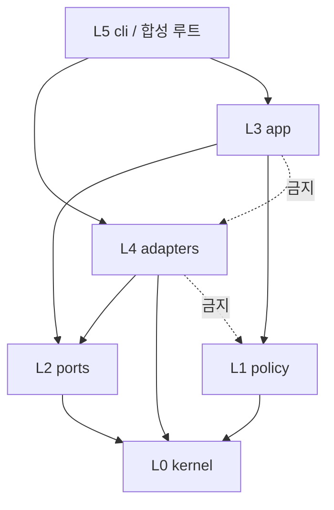
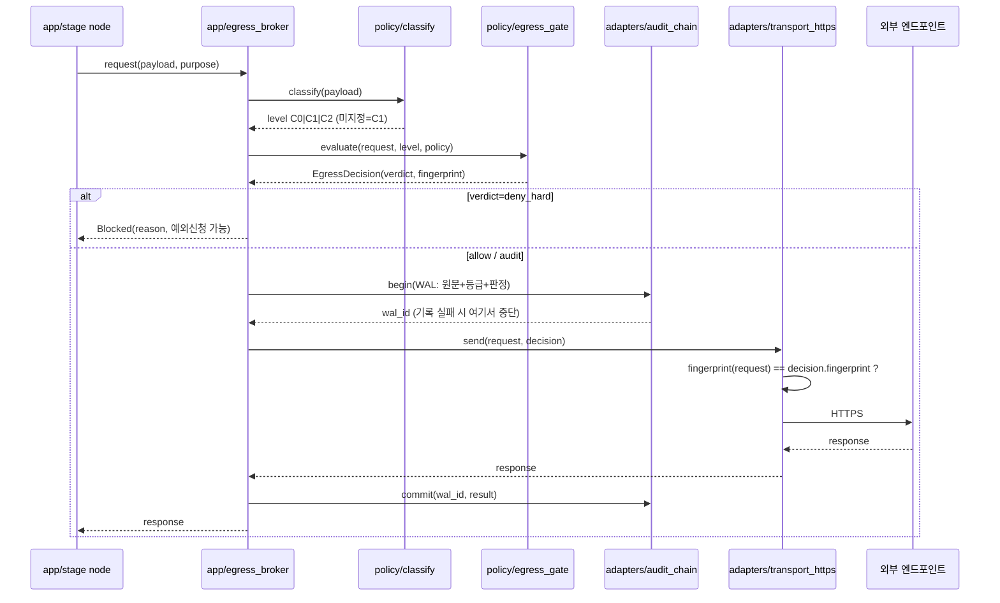
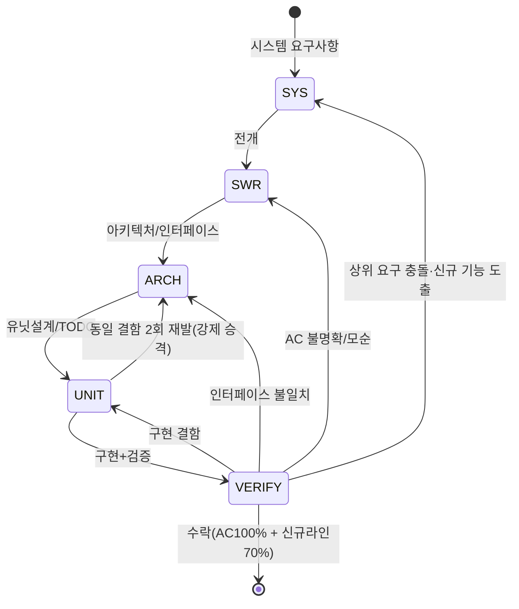

# SRS 통합 요구사항 명세서 (단일 파일)

> 작성일: 2026-09-21 / 기준: `AI_pipeline_confirmed_v1.1` + `ARCH_S3_v1.2` / 브랜치: `main`
> 성격: 사람이 읽는 통합본. 아래에 있는 모든 표와 본문이 곧 요구사항의 전체이며, 원본 CSV/MD의 내용을 빠짐없이 옮겼다.
> 한계 고지: v0.1~v1.0 원본 CSV 중 개별 요구문 전문 233건은 세션 초기화로 작업폴더에 없고 대화첨부에만 있다. 그 부분은 건수·그룹·결정으로 정리하고, 원본 위치를 12장에 명시했다. 나머지 v1.1/D36~D42/ARCH/파라미터/미해결은 전문 수록이다.

## 0. 읽는 법 (30초 요약)

| 질문 | 답 |
|---|---|
| 이 프로젝트는? | 기획서·문서를 넣으면 User Story+AC / SRS / AI 작업지시서 / Key Feature 4종을 만드는 AI 드리븐 파이프라인 `reqpipe` |
| 지금 어디? | S0~S2 완료 (SYS 233건, SWR 79건), S3 설계 완료 (ARCH 89모듈), 다음은 구현 |
| 실행 형태는? | P0 로컬 PC 단독, CLI 단독, 호스티드 Hermes 유지, 벽시계 기준 |
| 가장 중요한 규칙 3개는? | 1) `send(req, decision)` 없이 송신코드 작성 불가 2) 하드금지 3범주는 어떤 모드에서도 차단 3) 기록 실패 시 전송 중단 |
| 릴리스 조건은? | AC 100% + 신규라인 70% + provisional 0건 + TODO-테스트 연결 |

## 1. 프로젝트 전제·범위표

### 1-1. 입력·산출물·채널표

| ID | 항목 | 확정 내용 |
|---|---|---|
| A01 | 입력 형태 | 기획서·문서 파일 첨부 + 필요 시 AI 챗봇 요구사항 수집 |
| A02 | 산출물 4종 | User Story+AC / SRS 명세서 / AI 개발용 작업지시서 / 비개발자용 Key Feature |
| A03 | 인터뷰 채널 | CLI 단독 실행 (OpenWebUI 범위 외) |
| A04 | 도메인 범위 | 공통 코어 + 도메인 팩 3종 (web_internal / android_aaos / mcu_firmware). 판별은 CLI 인자 명시, LLM 위임 금지, 코어에 도메인어휘 하드코딩 금지 |
| A05 | RAG 소스 | 코드·설정 저장소 + 승인 문서 (SRS/기획서/ADR). 티켓·PR 제외 |
| A06 | 모델 | Nemotron 계열 Hermes. 모델ID 하드코딩, 서버설정은 런타임 해소 |
| A07 | 실측 금지 | 부팅 핸드셰이크로 능력협상. 프로브 실패 시 예외 없이 최악값 고정 (ctx 32K / S3 / sanitize always) |
| Q2 | 승인 구조 | 고객 질문은 카카오톡 링크 전달, 그 외 내부 단일 승인자. customer 항목 내부큐 노출 금지 |
| Q3 | 에스컬레이션 | L0→L1→L2→L3 = 4h / 24h / 48h, 업무시간 기준 정지 적용 |
| Q5 | 수락 기준 | AC 100% + 신규코드 라인 커버리지 70%, 측정 실패는 fail-closed |
| Q9 | 외부 추론 | 허용 (호스티드 엔드포인트) |
| Q10 | API 키 | 호스티드 추론용 확보됨. NGC pull 키와 분리 관리 (D28) |
| Q11 | GPU 한도 | '없음' 응답이 무제한/미할당 양의적. D21-A로 설계 영향 없음, self-host 전환 시 재확인 |
| Q12 | 기밀 등급 | 사내 체계 부재 → C0(비기밀)/C1(사내한정)/C2(기밀) 신설, 미지정 입력 기본값 C1 |

## 2. SRS 버전 계보·건수표 (전체)

| 버전 | 문서 | 건수 | 핵심 변경 | 상태 |
|---|---|---:|---|---|
| FR v0.1 | FR_spec 수집기 자체 | FR 63 + NFR 8 = 71 | 1~6턴 결정 요구문화 | S1~S3에 흡수 |
| SRS v0.2 | 파이프라인 전체 | 132 (TRC 관통 9 포함) | 12단계 5게이트 정의 | 원본첨부 참조 |
| SRS v0.3 | 델타 | 누적 157 (신규 +25) | audience축 ASK 13건, 고객대기 PRV 5건, M1/M2/M3 경계 | 원본첨부 참조 |
| SYS v0.4 | SYS_SRS | 138 (기능 75 / 비기능 29 / IF 34) | NIM·EC2·BaaS 전제 반영 | 원본첨부 참조 |
| SYS v0.5 | 델타 | 신규 33 → 누적 171 | C0/C1/C2, 외부송신 통제 | 원본첨부 참조 |
| SYS v0.6 | 델타 | 신규 37 → 누적 208 | D20-C 보상통제 23건 (기능21+비기능2), 벤더대응 | 원본첨부 참조 |
| SYS v0.7 | 델타 | 신규 25 → 누적 233 | 로컬/OCI 프로파일, 벽시계 타이머, 키 분리 | 원본첨부 참조 |
| SWR v1.0 | SWR_security_egress | 73 | 상위 36건 (SEC10/EGR9/AUD7/DNY3/VEN3/KEY4) 전개, 36/36 | v1.1이 정본 |
| SWR v1.1 | D29~D35 파생 | 79 (신규 +6) | AUD-011/012, DET-011/012, EXC-004/005 | **현 정본, 전문수록** |
| ARCH v1.2 | S3 설계 | 모듈 89 (M1 50/M2 36/M3 3) | 6층, 포트11종/22메서드, D36~D42 | **현 정본, 전문수록** |

| 계층 | 현 건수 | 비고 |
|---|---|---:|
| 수집기 FR | 71 | FR 63 + NFR 8 |
| 파이프라인 SRS | 157 | M1 46 / M2 92 / M3 19 (v0.3 기준, 이후 델타로 증가) |
| 시스템 SYS | 233 | 최종 누적 |
| 소프트웨어 SWR | 79 | 커버리지 100% |
| 아키텍처 모듈 | 89 | M1 50 / M2 36 / M3 3 |

집계 정정 이력: v0.3 M1 47/M2 95/M3 15 → 실제 46/92/19=157 / v0.6 D20 21건 → 실제 23건 / v0.7 신규24·누적232 → 실제 25·233 / S2 착수 37건 예고 → 실제 36건.

## 3. 프로세스 12단계 5게이트표 (전체)

| 단계 | 이름 | 산출물 | 게이트 |
|---|---|---|---|
| S0 | 환경 세팅·능력 협상 | capabilities.json, deploy.yaml | - |
| S1 | 시스템 요구사항 분석 (기능/비기능/인터페이스) | SYS_SRS | G1 요구완결성 |
| S2 | 소프트웨어 요구사항 전개 (입출력·전제·사후·오류·AC) | SWR | G2 미확정 0건 |
| S3 | 구현 결정 수집 (3안+추천) | decisions.csv | - |
| S4 | 아키텍처 설계 (레이어·파일역할) | architecture.md | G3 계약완비 |
| S5 | 인터페이스 계약 | interfaces.csv | G3 계약완비 |
| S6 | 유닛 설계 | unit_design.md | - |
| S7 | 마일스톤 배치 (S4와 병렬) | milestones.csv | - |
| S8 | TODO 전개 | todo.csv | G4 TODO-테스트 연결 |
| S9 | 검증·루프백 판정 | verification report | G4 TODO-테스트 연결 |
| S10 | 스캐폴딩 (폴더·파일 생성, 역할분리) | 소스 트리 | - |
| S11 | 시각화·릴리스 | 다이어그램, 최종 산출물 | G5 AC100%+신규라인70% |

| 규칙 영역 | 규칙 전문 |
|---|---|
| 루프백 | 12케이스 규칙표 고정, LLM 판정 금지. 같은 상위 파생 둘 모순→상위가 원인. 동일결함 2회 재발→1계층 상위 강제승격 |
| 질문 | Top-k 3+추천. score=w1영향+w2불확실+w3차단-w4비용, MMR 중복제거. depends_on 보류, 동점은 선언순서. 인터뷰 최대 5턴, 답변은 interview:// 근거로 기록 |
| 가정 | 무응답 시 추천안 assumption 채택, safe/risky 구분. 보안·법규·정합성은 자동채택 금지, BLOCKED 유지 |
| 에스컬레이션 | L0→L1→L2→L3=4h/24h/48h, 업무시간 정지, 재기동 캐치업, 알림병합, 가동시간 기준 금지 |
| 관통 must_not | 코어 도메인어휘 하드코딩 금지 (프로파일YAML만). 도메인판별 LLM위임 금지 (CLI인자). descriptive 근거 단독 자동채택 금지 (승인문서만 A밴드). 출처 없는 값 산출물 진입 금지. 진행률 자기보고 금지. 테스트 없이 TODO완료 금지. 사람코드 덮어쓰기 금지. 수락미달 릴리스 금지. provisional 1건 잔류 시 릴리스 금지. 질문순서 난수 금지 |
| 게이트 상세 | G1 요구완결성 / G2 미확정 0건 / G3 IF계약완비 / G4 TODO-테스트연결 / G5 AC100%+신규라인70%, 측정실패 불통과 |

## 4. SYS_SRS 상세 (233건, 그룹별 사람이 읽는 정리)

> 원본 138건 전문은 대화첨부 `SYS_requirements_v0.4.csv` 등에 있다. 여기서는 v0.4 구조 + v0.5~v0.7 델타의 확정 내용을 빠짐없이 문장으로 정리했다.

### 4-1. v0.4 기본 구조표 (138건)

| 구분 | 건수 | 내용 요약 (사람용) |
|---|---|---:|
| 기능 75 | 75 | 요구 수집·スロット·증거·가정·질문·추적·결정·산출물렌더·에스컬레이션·provisional 등 파이프라인 본기능 |
| 비기능 29 | 29 | 보안등급·외부송신·감사·타이머·데이터보존·가용성·재현성·성능 등 제약 |
| 인터페이스 34 | 34 | LLM(NIM)·저장(BaaS/SQLite)·문서·인덱스·알림·시계·감사·렌더·스캐폴딩·메트릭 등 외부결합 |

### 4-2. v0.5 델타표 (신규 33 → 171)

| 주제 | 확정 내용 (사람용) |
|---|---|
| 기밀등급 신설 | C0 비기밀 / C1 사내한정 / C2 기밀. 미지정 입력은 C1 (fail-safe). 파생 산출물 등급은 입력 근거 중 최댓값 상속. 강등은 승인레코드 없이 불가 |
| 외부송신 통제 시작 | 분류→게이트→감사→전송 순서 도입. P0 범위 논의 착수 (v0.6 D20-C로 확정) |
| D19/D22 | A안 채택 (제목은 원본 decisions_v0.5.csv 참조 필요) |

### 4-3. v0.6 델타표 (신규 37 → 208)

| 주제 | 확정 내용 (사람용) |
|---|---|
| D20-C | P0 한정 전면 허용 + 사후감사. 단 하드금지 3범주 (개인정보/크리덴셜/고객사 실명+계약조건)는 모드 무관 차단. 보상통제 23건 (기능21+비기능2) |
| D21-A | 호스티드 유지. self-host 전환 트리거 4개를 정책파일 값으로 명문화할 것 (조건부 전환) |
| D23-A | 합성 샘플로 대체 진행. 합성 기반 수치를 품질지표로 제시 금지 |
| D24-A | S2 착수 SEC+EGR 우선 → AUD·DNY·VEN·KEY 합류, 상위 36건으로 조정 (SEC10/EGR9/AUD7/DNY3/VEN3/KEY4) |
| 벤더대응 | 벤더 데이터 취급 요구 반영 |

### 4-4. v0.7 델타표 (신규 25 → 233)

| 주제 | 확정 내용 (사람용) |
|---|---|
| D25-A | P0 실행호스트 로컬 PC 단독. 타이머는 벽시계 절대시각 필수, 가동시간 기준 금지. 상태는 단일 작업디렉터리에 집중 |
| D26-A | 고객폼 P0 반자동 (로컬 폼 생성+사람 발송) → M2 공개노드 |
| D28-A | 호스티드 키만 사용, NGC pull 키 보류 (self-host 시 발급) |
| D27 | 원본 decisions_v0.7.csv 참조 필요 |
| 배포 | 로컬/OCI 배포 프로파일, deploy.yaml로 어댑터 선택. 키 분리 (호스티드 vs NGC) |

## 5. SWR 상세 (79건, 현 정본)

### 5-1. 전개 구조표

| 상위 그룹 | 상위 건수 | 의미 (사람용) |
|---|---|---|
| SEC 10 | 10 | 등급판정·상속·강등·분류 관련 |
| EGR 9 | 9 | 외부송신 게이트·브로커·전송 관련 |
| AUD 7 | 7 | 감사 체인·WAL·보존·암호화 관련 |
| DNY 3 | 3 | 하드금지 3범주 판정 관련 |
| VEN 3 | 3 | 벤더·명부·외부데이터 관련 |
| KEY 4 | 4 | 키 보관·분리·암호화 관련 |
| 합계 | 36 | → SWR 73건 전개, 커버리지 36/36 |

### 5-2. v1.1 신규 6건 전문표 (빠짐없음)

| ID | modality | 요구문 전문 | 출처 | 인수조건(AC) |
|---|---|---|---|---|
| SWR-AUD-011 | must | 보존기한 경과 감사 레코드를 벽시계 기준으로 파기하고, 파기 사실 자체를 체인에 기록한다 | D31 | 파기 후 chain verify가 여전히 통과 |
| SWR-AUD-012 | must | 감사 로그 암호화 키 부재·복호 실패 시 신규 전송을 거부한다(fail-closed) | D31/D33 | 키 제거 상태로 기동 시 send 0건 |
| SWR-DET-011 | must | 명부 사전 미로드 시 '고객사 실명' 범주를 미탐 상태로 표기하고 기동 배너에 경고한다 | D34 | 사전 없이 기동 시 경고 1건 출력 |
| SWR-DET-012 | must_not | 명부 사전 부재를 이유로 해당 범주를 자동 통과 처리해서는 안 된다 | D34 | 사전 없을 때 해당 범주 판정이 pass로 기록되지 않음 |
| SWR-EXC-004 | must | 예외 TTL 만료를 재기동 시 캐치업 검사하여 만료분을 즉시 회수한다 | D35/SF-TMR-02 | PC 종료 96h 후 기동 시 72h 예외가 만료 처리됨 |
| SWR-EXC-005 | must | 예외 부여·사용·만료 각각을 감사 체인에 별도 레코드로 남긴다 | D35/D32 | 예외 1건당 레코드 3종 존재 |

v1.0 73건 전문은 대화첨부 `SWR_security_egress_v1.0.md/csv`에 있다. v1.1 확정으로 그 중 7건의 DECISION_REQUIRED가 READY로 전환되고 총계 79건이 됐다.

## 6. 결정 전체표 (빠짐없음, A/Q/D)

| ID | 구분 | 주제 | 확정 내용 | 상태 |
|---|---|---|---|---|
| A01 | 전제 | 입력 형태 | 기획서·문서 첨부 + AI 챗봇 수집 | 확정 |
| A02 | 전제 | 산출물 4종 | User Story+AC / SRS / AI 작업지시서 / Key Feature | 확정 |
| A03 | 전제 | 인터뷰 채널 | CLI 단독 | 확정 |
| A04 | 전제 | 도메인 범위 | 공통코어+3팩, CLI인자 지정 | 확정 |
| A05 | 전제 | RAG 소스 | 코드·설정+승인문서, 티켓·PR 제외 | 확정 |
| A06 | 전제 | 모델 | Nemotron Hermes, ID 하드코딩 | 확정 |
| A07 | 전제 | 실측 미실시 | 핸드셰이크+최악값 고정 | 확정 |
| Q2 | 전제 | 승인 구조 | 카카오링크+단일승인자 | 확정 |
| Q3 | 전제 | 에스컬레이션 | 4h/24h/48h 업무시간정지 | 확정 |
| Q5 | 전제 | 수락 기준 | AC100%+라인70% fail-closed | 확정 |
| Q9 | 전제 | 외부 추론 | 허용 | 확정 |
| Q10 | 전제 | API 키 | 호스티드 확보, NGC 분리 | 확정 |
| Q11 | 전제 | GPU 한도 | '없음' 양의적, 설계영향 없음 | 미확정(영향없음) |
| Q12 | 전제 | 기밀등급 | C0/C1/C2 신설, 기본 C1 | 확정 |
| D19 | 결정 | (제목 원본참조) | A안 채택, decisions_v0.5.csv 참조 | 원본참조 필요 |
| D20 | 결정 | P0 외부전송 범위 | C안 P0전면허용+사후감사, 하드금지3범주 차단 | 확정 |
| D21 | 결정 | 추론 배치 | A안 호스티드 유지, 조건부 전환 | 확정 |
| D22 | 결정 | (제목 원본참조) | A안 채택, decisions_v0.5.csv 참조 | 원본참조 필요 |
| D23 | 결정 | 입력 확보 | A안 합성대체, 지표제시 금지 | 확정 |
| D24 | 결정 | S2 착수 그룹 | A안 SEC+EGR 우선→36건 | 확정 |
| D25 | 결정 | P0 호스트 | A안 로컬PC 단독, 벽시계 필수 | 확정 |
| D26 | 결정 | 고객 폼 | A안 반자동→M2 공개 | 확정 |
| D27 | 결정 | (제목 원본참조) | decisions_v0.7.csv 참조 | 원본참조 필요 |
| D28 | 결정 | NGC 키 | A안 호스티드만, NGC 보류 | 확정 |
| D29 | 결정 | 게이트 강제 지점 | A안 send(req, decision) 필수인자, 미경유 작성불가 | 확정 |
| D30 | 결정 | 판정 우선순위 | A안 deny_hard>allowlist>mode 코드상수 고정 | 확정 |
| D31 | 결정 | 원문 보관 | A안 전량보관+암호화+자동파기 | 확정 |
| D32 | 결정 | 감사 무결성 | A안 해시체인+WAL, 실패 시 전송중단 | 확정 |
| D33 | 결정 | 정책로드 실패 | A안 스키마·reviewed_on 검증, fail-closed 중단 | 확정 |
| D34 | 결정 | 탐지기 구성 | A안 결정적규칙+명부, NER/LLM 배제 | 확정 |
| D35 | 결정 | 오탐 예외 | A안 1인 건별+TTL+감사, 전역해제 불가 | 확정 |
| D36 | 결정 | Decision 위조방지 | A안 HMAC지문 내장+어댑터검증 (B 타입의존 / C 세션토큰 탈락, TOCTOU 방지) | 제안→ARCH정본 |
| D37 | 결정 | 스키마 정본 | A안 마이그레이션 파일 정본, 콘솔변경 검출 (B ORM / C 콘솔 탈락) | 제안→ARCH정본 |
| D38 | 결정 | 상태 영속 | A안 SqliteSaver+단일디렉터리 (B JSON / C 메모리 탈락, 재기동 잦음) | 제안→ARCH정본 |
| D39 | 결정 | 동시성 | A안 단일프로세스+스레드풀 4콜만 (B async / C 멀티 탈락) | 제안→ARCH정본 |
| D40 | 결정 | 다이어그램 | A안 .mmd 텍스트+외부뷰어 (B graphviz / C SVG 탈락, diff 가능) | 제안→ARCH정본 |
| D41 | 결정 | 스캐폴딩 안전 | A안 영역마커+밖보존 (B 신규만 / C 덮어쓰기 탈락, SCF-02 영역단위 준수) | 제안→ARCH정본 |
| D42 | 결정 | 배포 형태 | A안 단일패키지+venv (B 도커 / C pipx 탈락, P0 로컬·GPU불요) | 제안→ARCH정본 |

### 6-1. D29~D35 영향 SWR표

| ID | 영향 SWR |
|---|---|
| D29 | SWR-EGR-001, SWR-EGR-002, SWR-CLS-013 |
| D30 | SWR-EGR-003, SWR-DNY-001~003 |
| D31 | SWR-AUD-001, SWR-AUD-004 (+신규 AUD-011/012 파생) |
| D32 | SWR-AUD-002, SWR-AUD-006 (+신규 EXC-005 연계) |
| D33 | SWR-POL-005 (+신규 AUD-012 연계) |
| D34 | SWR-DET-001~007 (+신규 DET-011/012 파생) |
| D35 | SWR-EXC-001~003 (+신규 EXC-004/005 파생) |

## 7. 확정 파라미터 전체표 (빠짐없음)

| 파라미터 | 값 | 출처 | 근거 (사람용) | 상태 |
|---|---|---|---|---|
| AUD.retention_days | 90 | D31 | 감사 최소 1분기, 사내규정 없음 | 잠정 |
| AUD.encryption | AES-256-GCM | D31 | 저장 시 암호화 | 확정 |
| AUD.key_location | OS 키링, 부재 시 파일 mode 600 | D31 | 로컬PC 전제 | 확정 |
| AUD.purge_clock | wall_clock | D31 | 가동시간 금지 준수 | 확정 |
| AUD.chain_algo | sha256(prev_hash\|\|record) | D32 | 해시체인 | 확정 |
| AUD.write_ahead | intent→send→outcome 2단 | D32 | intent 실패 시 send 금지 | 확정 |
| EXC.ttl_hours | 72 | D35 | 초기값, 관측 후 재설정 | 잠정 |
| EXC.max_renewals | 1 | D35 | 무기한 방지 | 잠정 |
| EXC.scope | (item_id, category, payload_hash) | D35 | 전역/카테고리 해제 금지 | 확정 |
| EXC.expiry_clock | wall_clock | D35 | 가동시간 금지 준수 | 확정 |
| DET.roster_dict | 미확보 | D34 | 없으면 실명탐지 공백 | 미해결 |
| SWR-DET-007 지연 | 500ms | v1.0 이월 | 첫 5회 중앙값 교체 예정 | 잠정 |

## 8. 아키텍처 S3 전체 (89모듈·22메서드 빠짐없음)

### 8-1. 설계를 규정한 3개 확정사항표

| 순위 | 결정 | 사람용 의미 |
|---|---|---|
| 1 | D29-A Decision 필수인자 | 게이트 안 거치면 송신코드 자체가 안 만들어짐. 레이어 경계의 출발점 |
| 2 | D25-A 로컬PC 단독 | 상시가동 아님. 시간은 벽시계, 재기동 캐치업 필수, 단일 작업디렉터리, 코어는 클라우드SDK 모름 |
| 3 | D20-C audit 모드 | 게이트 제거 없이 mode audit/enforce로 둠. 게이트·감사는 P0부터 존재, P1 전환은 설정 한 줄 |

### 8-2. 6층 레이어표

| 층 | 패키지 | 허용 참조 | 설명 |
|---|---|---|---|
| L0 | kernel | 없음 | 순수도메인, I/O·시간·난수 금지 |
| L1 | policy | kernel | 결정적 규칙엔진, 부작용 없음 |
| L2 | ports | kernel | 추상 Protocol |
| L3 | app | kernel,policy,ports | LangGraph 노드·게이트·브로커·질문엔진 |
| L4 | adapters | kernel,ports (policy 금지) | HTTP/DB/FS/LLM/렌더, 판정은 EgressDecision 값으로만 받음 |
| L5 | cli | 전부 | 유일하게 adapters를 아는 합성루트 |

핵심: adapters→policy 금지가 우회 (`그냥 보내자`)를 막는다. 강제장치는 `dependency_rules.toml` 5계약 + `test_layering.py` AST검사 (위반1건 exit1) + `test_socket_owner.py` (소켓은 transport_https만) + `test_leakage.py` (코어 도메인어휘 누출 단어경계 검사).

### 8-3. 외부송신 단일통로표 (순서 고정)

`classify → gate(evaluate) → audit.begin(WAL 원문포함) → transport.send(req, decision) → audit.commit`

| 규칙 | 내용 (사람용) |
|---|---|
| 생성 봉인 | EgressDecision은 policy/egress_gate만 생성 가능 |
| 지문 | Decision에 요청바이트 지문 내장, transport_https가 송신직전 재계산 대조 (D36-A). 다르면 미송신, TOCTOU 방지 |
| WAL | audit.begin 실패는 곧 송신중단 (D32-A). 사후감사는 전량 기록될 때만 성립 |
| 우선순위 | deny_hard > allowlist > mode, 코드상수. 정책파일·P0허용으로 하드금지 뒤집기 불가 (D30-A) |

### 8-4. 모듈 89 전체표 (빠짐없음)

| path | layer | 역할 (사람용) | 추적 | 마일스톤 |
|---|---|---|---|---|
| kernel/ids.py | L0 | ReqId/EvId/RunId/NodeId, 해시 ID (난수금지) | TRC-01, FR-E08 | M1 |
| kernel/model_project.py | L0 | ProjectContext 배경·이해관계자·제약·용어, 1개 | FR-C01 | M1 |
| kernel/model_requirement.py | L0 | Requirement+SlotValue(dict, 하드코딩금지)+deps/conflicts | FR-C01, FR-C02 | M1 |
| kernel/model_evidence.py | L0 | Evidence source_uri·snapshot·sha·nature·derivation | FR-D01~D03 | M1 |
| kernel/model_assumption.py | L0 | Assumption safe/risky+Provisional 전파 | PRV-01~05 | M1 |
| kernel/model_question.py | L0 | Question(target,audience,score)+Answer | ASK-01, ASK-16 | M1 |
| kernel/model_decision.py | L0 | DecisionRecord 3안+추천+선택+근거+승인+시각 | DEC-01~ | M1 |
| kernel/model_trace.py | L0 | TraceNode/Edge, derives/verifies/implements/conflicts/assumes | TRC-01~09 | M1 |
| kernel/model_classification.py | L0 | Level C0/C1/C2, ClassifiedPayload, 최댓값상속 | SF-SEC-01~06 | M1 |
| kernel/model_egress.py | L0 | EgressRequest/Decision(봉인)/Verdict/Fingerprint | D29-A, D30-A | M1 |
| kernel/model_artifact.py | L0 | SpecModel 정본+4종뷰 식별자 | FR-B01 | M2 |
| kernel/errors.py | L0 | 정책/무결성/계약 예외 구분 | - | M1 |
| policy/classify.py | L1 | 등급판정, 미지정=C1 | SF-SEC-01,02 | M1 |
| policy/inherit.py | L1 | 파생등급=입력최댓값 | SF-SEC-06 | M1 |
| policy/downgrade.py | L1 | 승인 없이 강등불가 | SF-SEC-05 | M1 |
| policy/detectors/rules_pii.py | L1 | 주민·연락처·계좌·이메일 패턴 | SF-DNY-01, D34-A | M1 |
| policy/detectors/rules_credential.py | L1 | 키·토큰·PEM·커넥션스트링 | SF-DNY-01 | M1 |
| policy/detectors/roster_match.py | L1 | 명부매칭, 부재 시 pass금지 | SWR-DET-011,012 | M1 |
| policy/detectors/normalize.py | L1 | 단위·조사·불용어 정규화, 수치토큰 (4열vs6열) | S0 결함2,3 | M1 |
| policy/egress_gate.py | L1 | deny>allow>mode 상수, Decision 유일발행 | D30-A, SWR-EGR-003 | M1 |
| policy/exception_ledger.py | L1 | 1인 TTL72h 갱신1회 벽시계 | D35-A, SWR-EXC-004 | M1 |
| policy/retention.py | L1 | 90일보존·파기산출 벽시계 | D31-A | M2 |
| policy/timer_policy.py | L1 | 4h/24h/48h 업무정지, 가동기준금지 | SF-TMR-01,02, ASK-28 | M1 |
| policy/gate_l1_rules.py | L1 | 구조규칙 13종 (근거·스냅샷·수치·순환·충돌대칭) | GATE-L1 | M1 |
| policy/rubric_l2.py | L1 | 루브릭 5축×3점 계약 | GATE-L2 | M2 |
| policy/loopback_rules.py | L1 | 12케이스, LLM금지, 2회 상위승격 | LB-01~12 | M2 |
| policy/profile_schema.py | L1 | 프로파일YAML 검증, required/risk/depends_on | FR-C02~C06 | M1 |
| ports/store_port.py | L2 | 영속계약 BaaS/SQLite 공통 | SF-DAT-01, SI-I-02 | M1 |
| ports/transport_port.py | L2 | send(req,decision) 필수 | D29-A | M1 |
| ports/llm_port.py | L2 | structured/complete/capabilities kernel반환 | SI-E-01 | M2 |
| ports/doc_port.py | L2 | 원본바이트·블록 접근 | FR-A01 | M1 |
| ports/index_port.py | L2 | BM25+임베딩 | FR-D05 | M2 |
| ports/notify_port.py | L2 | 콘솔/텔레그램/카카오반자동 | ASK-05~ | M2 |
| ports/clock_port.py | L2 | 벽시계만, monotonic 미노출 | SF-TMR-01 | M1 |
| ports/audit_port.py | L2 | begin/commit/append/verify | D32-A, SF-AUD-02,07 | M1 |
| ports/render_port.py | L2 | 4종+다이어그램 렌더 | FR-B01, VIZ | M2 |
| ports/scaffold_port.py | L2 | 폴더·파일 계획·적용 | SCF-01~ | M2 |
| ports/metrics_port.py | L2 | 런메트릭 기록 | MET-01~04 | M1 |
| app/capability.py | L3 | 핸드셰이크, 실패 시 최악값 | FR-H01,H02 | M2 |
| app/llm_call.py | L3 | S0~S3사다리+새니타이저+4콜분할 | FR-G01~, S2 | M2 |
| app/egress_broker.py | L3 | 유일통로 gate→WAL→send→commit | D29-A, D32-A | M1 |
| app/question_engine.py | L3 | Top3+추천, 보류·선언순 | FR-E01~E08 | M1 |
| app/interview_session.py | L3 | 최대5턴, interview:// 근거 | FR-E09 | M1 |
| app/provisional.py | L3 | 임시확정·전파, 릴리스차단 | PRV-01~05 | M2 |
| app/escalation.py | L3 | L0→L3·캐치업·병합 | ASK-27,28 | M2 |
| app/trace_service.py | L3 | 그래프·질의·영향분석 | TRC-01~09 | M1 |
| app/metrics.py | L3 | 채움률·채택률·턴수·miss | MET-01~04 | M1 |
| app/graph_build.py | L3 | LangGraph 조립·체크포인터 | S1~S12 | M2 |
| app/stages/s01_env.py | L3 | 환경노드 | ENV | M1 |
| app/stages/s02_sysreq.py | L3 | SYS노드 | SYS | M1 |
| app/stages/s03_swreq.py | L3 | SWR노드 | SWR | M2 |
| app/stages/s04_decision.py | L3 | 3안+추천 노드 | DEC | M2 |
| app/stages/s05_arch.py | L3 | 아키텍처 노드 | ARC | M2 |
| app/stages/s06_iface.py | L3 | IF계약 노드 | IFC | M2 |
| app/stages/s07_unit.py | L3 | 유닛 노드 | UNT | M2 |
| app/stages/s08_todo.py | L3 | TODO 노드 | TSK | M2 |
| app/stages/s09_verify.py | L3 | 검증·결함 노드 | VER | M2 |
| app/stages/s10_loopback.py | L3 | 루프백 규칙노드 | LB | M3 |
| app/stages/s11_scaffold.py | L3 | 스캐폴딩 노드 | SCF | M2 |
| app/stages/s12_release.py | L3 | 패키징 노드 | REL | M3 |
| app/gates/g1_reqready.py | L3 | G1 완결성 | GATE | M1 |
| app/gates/g2_decided.py | L3 | G2 미확정0건 | GATE | M2 |
| app/gates/g3_archready.py | L3 | G3 계약완비 | GATE | M2 |
| app/gates/g4_impl.py | L3 | G4 TODO-테스트 | GATE | M2 |
| app/gates/g5_accept.py | L3 | G5 AC100%+라인70% 실패불통과 | VER-12, Q5 | M3 |
| adapters/store_sqlite.py | L4 | 로컬 Store P0기본 | D25-A | M1 |
| adapters/store_baas.py | L4 | BaaS Store, 벤더심볼 비노출 | SF-DAT-01~06 | M2 |
| adapters/transport_https.py | L4 | 유일소켓, 지문검증 후 송신 | D29-A, SF-EGR-08 | M2 |
| adapters/llm_openai_compat.py | L4 | NIM /v1/chat, ready/live 분리 | SI-E-01, SF-AI-02 | M2 |
| adapters/llm_replay.py | L4 | 픽스처재생 소켓0건 | SF-EGR-08 | M1 |
| adapters/doc_loader.py | L4 | 평탄화·forward-fill·ID·문장ID | FR-A01~A08 | M1 |
| adapters/modality_tagger.py | L4 | 어미사전1차+미해결만LLM | FR-A05,A06 | M1 |
| adapters/index_hybrid.py | L4 | BM25+임베딩 원형보존 | FR-D05 | M2 |
| adapters/notify_console.py | L4 | 콘솔 P0기본 | ASK-05 | M1 |
| adapters/notify_telegram.py | L4 | 내부알림 | ASK-06 | M2 |
| adapters/notify_kakao_manual.py | L4 | 링크반자동 생성까지, 발송은 사람 | D26-A | M2 |
| adapters/clock_system.py | L4 | 벽시계 타임존고정 | SF-TMR-01 | M1 |
| adapters/audit_chain.py | L4 | 해시체인+WAL | D32-A | M1 |
| adapters/render_markdown.py | L4 | 4종 SpecModel 파생 | FR-B01 | M2 |
| adapters/render_diagram.py | L4 | .mmd 텍스트 산출 | VIZ-01~04 | M2 |
| adapters/scaffold_fs.py | L4 | 사람영역 덮어쓰기금지 | SCF-02 | M2 |
| cli/__main__.py | L5 | run/ask/audit/conformance | - | M1 |
| cli/wiring.py | L5 | DI합성 deploy.yaml 선택 | SF-HOST-01 | M1 |
| cli/commands_run.py | L5 | 실행 | - | M2 |
| cli/commands_ask.py | L5 | 질문조회·응답 내부전용 | ASK-16 | M1 |
| cli/commands_audit.py | L5 | 조회·검증·전환시뮬 | SWR-EGR-013 | M2 |
| checks/test_layering.py | L5 | AST 위반1건 실패 | D29-A 보조 | M1 |
| checks/test_leakage.py | L5 | 어휘누출 단어경계 | FR-C02 | M1 |
| checks/test_socket_owner.py | L5 | 소켓은 transport만 | SF-EGR-08 | M1 |

### 8-5. 인터페이스 22 전체표 (빠짐없음)

| port | method | 입력 | 출력 | 오류 | 비고 (사람용) |
|---|---|---|---|---|---|
| StorePort | save(entity) | kernel엔티티(등급포함) | EntityId | IntegrityError, PolicyError | 멱등, 동일입력 동일ID |
| StorePort | load(id,type) | ID,타입 | 엔티티 | None 반환 (NotFound 없음) | 읽기전용 |
| StorePort | find(type,filter,order) | 타입,필터,정렬키 | 목록 | QueryError | 미지정 시 선언순서 (난수금지) |
| StorePort | link(src,dst,type) | 두ID+LinkType | EdgeId | CycleError | 멱등 |
| StorePort | neighbors(id,type,dir) | ID,타입,방향 | 목록 | - | 영향분석 기반 |
| StorePort | transaction() | - | ctx매니저 | TxError | BaaS/SQLite 동일 |
| StorePort | schema_version() | - | 버전 | - | 콘솔변경 감지 |
| TransportPort | send(req,decision) | EgressRequest+Decision필수 | Response | GateBypass,FingerprintMismatch,TransportError | 지문불일치 거부 |
| TransportPort | health(kind) | ready\|live | 상태 | - | 추론성공으로 준비대체 금지 |
| LLMPort | structured(schema,prompt,budget) | 스키마,프롬프트,예산 | 객체+사용량 | StructuredFailure→unknown | S0~S3 내부처리 |
| LLMPort | capabilities() | - | ctx,json,tool | - | 실패 시 최악값 |
| DocPort | load(uri) | URI | 블록+페이지·문장ID | DocError | 이미지 ID보존 |
| IndexPort | search(q,k,filters) | 질의,k,등급필터 | 청크+uri/sha/snapshot | - | BM25+임베딩 결정적 |
| NotifyPort | notify(ch,aud,msg,link) | 채널,대상,본문,링크 | 영수증 | NotifyError | customer 반자동 |
| ClockPort | now() | - | 벽시계 | - | monotonic 미노출 |
| AuditPort | begin(record) | 예정레코드 원문포함 | WAL ID | AuditWriteError→중단 | 실패 시 전송금지 |
| AuditPort | commit(wal,result) | WAL,요약 | - | AuditWriteError | 해시갱신 |
| AuditPort | verify_chain() | - | 리포트 | - | 변조탐지 |
| RenderPort | render(kind,spec) | 종류,SpecModel | 바이트 | RenderError | 4종 동일정본 파생 |
| ScaffoldPort | plan(arch) | 아키텍처 | 계획 | - | 사람확인 가능 |
| ScaffoldPort | apply(plan,mode) | 계획,new_only\|merge | 결과 | OverwriteBlocked | 사람영역 보호 |
| MetricsPort | record(metric) | 메트릭 | - | - | 임계 시 경고 |

계약 3줄 요약: Clock은 monotonic을 주지 않아 오용 자체를 막는다. find는 정렬키 없으면 선언순서로 재현성을 지킨다. structured 실패는 예외가 아니라 unknown 슬롯으로 정상 질문경로에 합류한다.

### 8-6. 영속·동시성·마일스톤표

| 항목 | 확정 내용 (사람용) |
|---|---|
| 영속 | SqliteSaver 체크포인터, DB·WAL·픽스처·산출물 단일 작업디렉터리 (D38-A). 복사만으로 OCI 이전 |
| 동시성 | 단일프로세스+스레드풀, 병렬은 추출 4콜만 (D39-A). 전면 async 금지 (재현성·디버깅) |
| M1 50모듈 | kernel·policy 전량, ports 전량, sqlite/doc/audit/replay, 질문·추적·G1. 외부의존 없음 (GPU·네트워크 불요), 네트워크차단 테스트 |
| M2 36모듈 | LLM런타임, transport, BaaS, 렌더·다이어그램·스캐폴딩, 에스컬레이션·provisional. 호스티드 필요 |
| M3 3모듈 | 루프백자동판정, 릴리스패키징, G5. 골든셋 필요 |
| 다이어그램 | 01_layers (금지화살표) / 02_egress_sequence (WAL·지문) / 03_loopback_state (계층전이). .mmd 텍스트라 diff 가능 (D40-A) |

## 9. 마일스톤·게이트·수락표

| 마일스톤 | SRS 건수 | ARCH 모듈 | 성격 (사람용) |
|---|---|---|---|
| M1 | 46 | 50 | LLM 없이 동작하는 뼈대 먼저 |
| M2 | 92 | 36 | LLM·외부·렌더·스캐폴딩 붙이기 |
| M3 | 19 | 3 | 자동판정·릴리스·최종수락 |
| G1/G2/G3/G4/G5 | - | - | 완결성 / 미확정0 / 계약완비 / TODO-테스트 / AC100%+70% |

## 10. 미해결·차단 전체표 (빠짐없음)

| # | 항목 | 왜 문제인가 (사람용) | 필요한 것 |
|---|---|---|---|
| A1 | egress_policy.yaml reviewed_on 2건 TODO | D33-A fail-closed로 기동거부 | 약관확인일자 기입 |
| A2 | 감사키 미설정 | SWR-AUD-012 전송거부 | 키링 또는 mode600 파일 |
| B1 | 명부사전 미확보 | 실명탐지 공백, DET-011/012는 통과차단만 함 | 고객사·인명사전 |
| B2 | 기획서샘플 미확보 | 입도(1행=1항목?)·파서튜닝 불가, 합성대체 중 | 샘플 1건 |
| B3 | 골든셋 미확보 | 채움률·채택률 기준선 없음 | 완료기능 3건 역산 |
| C1 | retention 90d 잠정 | 근거 없음 | 사내규정 확인 후 |
| C2 | TTL 72h·갱신1회 잠정 | 근거 없음 | 관측 후 재설정 |
| C3 | 500ms 잠정 | 근거 없음 | 5회 중앙값 교체 |
| D | Q11 양의적 | 무제한/미할당 불명, 설계영향 없음 | self-host 시 재확인 |
| E | CR-09 역류 | C1기본+P0audit→enforce 시 대량차단 정지. SWR-EGR-013 신설됐으나 SYS 미반영 | SYS 역반영 필요 |
| - | 추적ID 대조 | 원본CSV 미열람으로 커버리지 검증 불가 | v0.4~v1.0 CSV 대조 |
| - | egress reviewed_on 외 키 | 실행차단 외 추가 차단 가능 | 기동 전 점검 |
| - | D19/D22/D27 제목 | 대화본문에 남지 않음, 지어내지 않음 | 원본 decisions CSV 참조 |

## 11. 다이어그램·검사 원문 (빠짐없음, 붙여넣기용)

### 11-1. 01_layers.mmd

### 11-2. 02_egress_sequence.mmd

### 11-3. 03_loopback_state.mmd

### 11-4. dependency_rules.toml (5계약 전문 요약)

| 계약 | 소스 | 금지 대상 | 사람용 의미 |
|---|---|---|---|
| 레이어 단방향 | 전체 | 역방향 참조 | cli>adapters>app>ports>policy>kernel 순서만 허용 |
| app은 adapters 모름 | app | adapters | 오케스트레이션이 기술 몰라도 됨 |
| adapters는 policy 모름 | adapters | policy | 어댑터에서 예외 우회 금지 |
| transport는 broker만 | stages,gates,policy | transport_port | 송신계약은 브로커만 앎 |
| 소켓 단일화 | kernel,policy,app,cli | socket/requests/httpx 등 | 소켓은 transport_https만 |

### 11-5. test_layering.py 동작 (사람용)

`reqpipe` 아래 `.py`를 AST로 훑어 import만 본다. 네트워크 라이브러리가 소유자以外에 있으면 위반. 레이어 허용집합 밖 참조면 위반. policy/app에서 broker以外 transport_port 참조면 위반. 위반 1건이면 `FAIL n건 exit1`, 없으면 `PASS`.

## 12. 원본 위치·한계표 (빠짐없음)

| # | 파일명 | 내용 | 위치 | 대체 정리 위치 |
|---|---|---|---|---|
| 1 | FR_spec v0.1 | FR63+NFR8 | 대화첨부 | 2장 건수·4장 구조 |
| 2 | SRS v0.2 | 132건 | 대화첨부 | 2장·3장 |
| 3 | decisions_3options_v0.2.csv | 결정 9건 | 대화첨부 | 6장 일부 |
| 4 | SRS_delta_v0.3 등 + policy.yaml | audience·PRV 157건 | 대화첨부 | 2장·3장 |
| 5 | SYS_SRS_v0.4 + csv + decisions | 138건 | 대화첨부 | 4-1 |
| 6 | SYS v0.5 델타 + classification.yaml | +33 →171 | 대화첨부 | 4-2 |
| 7 | SYS v0.6 델타 + egress_policy.yaml | +37 →208 | 대화첨부 | 4-3 |
| 8 | SYS v0.7 델타 + deploy.yaml | +25 →233 | 대화첨부 | 4-4 |
| 9 | SWR v1.0 + decisions_v1.0.csv | 73건+D29~D35 제안 | 대화첨부 (v1.1이 정본) | 5장 |
| 10 | reqcollector.zip·schemas.py·gate.py 등 | 초기 프로토타입 | 보관 (S0 재작성됨) | 8장 |
| 11 | v1.1 정본 4종 | D29~D35·파라미터11·신규6건 | AI_pipeline_confirmed_v1.1/10_confirmed_originals/ | 5-2·6·7 전문수록 |
| 12 | 재구성 4종 | 대장·파이프라인·미해결·로그 | AI_pipeline_confirmed_v1.1/20_reconstructed/ | 2·3·6·10 전문수록 |
| 13 | ARCH v1.2 7종 | 설계·모듈89·IF22·D36~D42·toml·py·mmd | ARCH_S3_v1.2/ | 8·11 전문수록 |
| 14 | 본 파일 | 통합본 | ./SRS.md (루트 main) | 전체 |

> 권고: 1~9번 대화첨부 원본을 내려받아 `10_confirmed_originals/` 옆에 함께 보관할 것. 재구성 문서는 건수·결정만 담아 전문을 대체하지 못하나, 본 SRS.md는 현재 폴더에 있는 전문은 모두 합쳤다.
