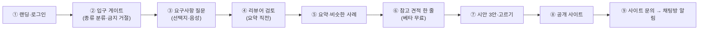

# 진행 상황 (경영진 확인용)

> 커밋·배포할 때마다 갱신한다. 기능 목록은 [README.md](README.md) "지금 상태", 남은 일 전체는 [docs/product/BACKLOG.md](docs/product/BACKLOG.md), 결정 기록은 [docs/product/DECISIONS.md](docs/product/DECISIONS.md).

**최종 갱신**: 2026-09-29 (운영 배포 HEAD `fb4da4d`: 베타 흐름 2차 — 동의 전 빈칸 묻기, 봇 답 주소 고리, 메뉴 추출·조사 수정. 배포 스크립트 헬스체크 통과)
**방향**: 초기 프로토타입에서 실제 서비스로 전환(9/25). 소상공인·개인·단체 누구나 채팅(또는 음성)으로 사이트를 설명하면 AI가 요구사항을 정리하고, 시안 3안을 보여 주고, 고른 안으로 사이트를 만든다.

## 1. 한 줄 요약

**요구사항 받기 → 시안 3안 → 고르기 → 공개 → 문의 알림까지 휴대폰 크기 자동 점검 11단계가 운영에서 모두 통과한다(9/26).** 카카오 로그인은 운영 동작(구글은 테스트 모드라 버튼 숨김). 새로 들어간 것: 사진 올리기(위치 정보 제거, 시안·공개본 자동 반영), 영상 카드, AI 소개 문구 초안, 공개 사이트 빈칸 감추기, 업종별 예시 그림, 방장·초대 링크, 타이머 사전 경고, 문의 → 사장님 카톡, 직접 편집 화면, 무전기 모드, PWA. 남은 약점은 AI 대화 평가(T3 최신 z3 32/35(91%)·지어낸 값 0건(`docs/product/evals/simulation-2026-09-27-zen-qwen-z3.md`), 질문 수 평균 5.9회로 목표 3회 초과·운영 모델 NIM 기준 공식 측정 아직 없음)다.

## 2. 지금 바로 확인할 수 있는 곳

| 주소 | 무엇 |
|---|---|
| https://144.24.91.250.sslip.io | 랜딩(입력창 + 업종 템플릿 6개). 입력하면 채팅방으로 이동 |
| https://144.24.91.250.sslip.io/projects | 내 프로젝트(로그인하면 다른 기기 방도) |
| https://144-24-91-250.sslip.io/design/&lt;id&gt; | 시안 3안 고르기 페이지(생성물은 앱과 다른 주소에서만 열림) |
| https://144.24.91.250.sslip.io/privacy.html · /terms.html | 개인정보처리방침·이용약관(베타, 법률 검토 전) |

## 3. 사용자 흐름과 상태

| 번호 | 단계 | 상태 | 근거·비고 |
|---|---|---|---|
| ① | 랜딩, 카카오 로그인, 내 프로젝트 | ✅ 운영 확인 | 9/26 실제 계정으로 로그인→내 프로젝트→로그아웃. 구글은 테스트 모드(초대된 계정만)라 버튼을 숨김(`4c68466`, 서버 경로는 유지) |
| ② | 입구 게이트: 가게 6업종·개인·단체·웹서비스 분류, 종류별 질문 예산(가게 8·개인 7·단체 8·웹서비스 12), 사칭·피싱·도박 등 거절 | ✅ 운영 | D29~D33, `tests/engine/test_intake_gate.py` |
| ③ | 질문 엔진: 선택지 버튼, "이렇게 이해했어요", "시안 먼저", 기능 사례집 42개 판정, 음성 입력(NVIDIA Parakeet), 듣기(NVIDIA Magpie) | ✅ 운영 | 엔진 결함 16건 수정(검증 31/31) |
| ④ | 리뷰어 에이전트: 원문↔카드 대조, 빠진 요구 채움·어긋남은 확인 요청 | ✅ 운영 | D34. 실측 약 3초, 첼로 사례에서 놓친 카톡 문의 요구를 찾음 |
| ⑤ | 요약 + 비슷한 사례(기능 사례집 기반 RAG) | ✅ 운영 | 가짜 "이전 프로젝트" 문구 제거 |
| ⑥ | 참고 견적 한 줄 + 베타 무료 | ✅ 운영 | D25. AI 3안(150만~650만 원) 제거 |
| ⑦ | 시안 3안(기본형·사진 강조형·간결형), 채팅방 미리보기 카드, "이걸로 할게요" | ✅ 운영 | 기본 요구 7. 휴대폰 화면으로 끝까지 눌러 확인 |
| ⑧ | 공개 사이트 `/site/<id>/`: 고른 안을 "공개"로 그대로 연다. 빈칸(`[… 입력]`)·"예시" 표시는 공개본에서 감추고 빈 가격은 "가격 문의"로. AI 문구 초안(첫 화면 한 줄·소개·상품 설명, 원문에 없는 숫자 문장은 버림). 문의 양식 기본 포함 | ✅ 운영 | 9/26 요청→2안→공개→문의 접수 확인. 빈칸 감추기 `ab82082`·`586b821`, AI 문구 `64d06f3` |
| ⑨ | 사이트 문의 양식 → 저장(30일) → 채팅방 "문의 알림" + 사장님 카톡 "나에게 보내기" | ✅ 운영 배포 | 스팸 숨김 칸·IP당 10분 5건. 카톡 알림은 `talk_message` 추가 동의 + 리프레시 토큰만 암호화 저장(`c47f887`). **실제 카톡 수신은 아직 실측 전** |
| ⑩ | 사진 올리기: 위치정보 제거·1600px JPEG, 대표 사진·사진첩 자동 배치. 사진이 없으면 요약·시안 때 묻고, 올리면 시안·공개본 자동 갱신 | ✅ 운영 배포 | `c47f887`·`de9dec1`, `tests/unit/test_photos.py` |
| ⑪ | 영상 링크(유튜브·인스타·네이버TV)를 채팅에 붙이면 소개 뒤 영상 카드 | ✅ 운영 배포 | `8423a02` |
| ⑫ | 공개 뒤 직접 편집 화면(`/editor`): 실제 카드를 불러와 바뀐 칸만 저장, 공개본에 바로 반영. 방장만 편집 | ✅ 운영 배포 | `c47f887`, `frontend/src/editor/CardEditor.test.tsx` |
| ⑬ | 공유방 운영: 방장 넘기기·나가기(먼저 들어온 사람이 승계), 초대 링크(기간·목록·폐기), 타이머 사전 경고(투표 20시간·견적 6일·닫힘 27일) | ✅ 운영 배포 | `c47f887`, ROOM_POLICY R-2 일부 |

**안드로이드:** PWA로 홈 화면 설치 가능(9/26 실제 브라우저에서 서비스 워커 동작 확인). 네이티브 앱은 나중에 다른 방식으로.

**운영 기반**
- **NIM 대비 모델:** super가 과부하(503)면 ultra → lightning으로 넘어간다. 9/26에 실제 과부하가 있었고 이걸로 해결했다.
- **보안:** 생성물은 별도 주소 + CSP sandbox. 로그인은 state+PKCE와 `__Host-` HttpOnly 쿠키.
- **채팅방 규칙:** 투표 24시간·견적 7일·30일 닫기 타이머, 10명 상한.
- **채팅방 하단(N-5):** 초대하기·더보기 2개만 노출·나머지 더보기 안, 360px 1줄 확인(9/26).
- **타이머·인원 상한(S-9):** 24시간·7일·30일·10명은 설정값(`config.py`) 사용 확인, 회귀 테스트 2개(9/26 밤).
- **배포:** git 방식. 스냅샷 + 자동 되돌리기.
- **서버 밖 백업:** 서버 매일 03:30 덤프 → Mac이 매일 13:00에 `~/agt001-backups-offsite/`로 가져옴(최근 30개). 9/26 예약 실행으로 2개 받음·검사 통과.

**테스트:** 단위 269, 엔진 65, 프런트 36, evals 29 모두 통과, 프런트 타입 검사 통과(9/26 밤, `.venv` + `npm test`). CI는 단위+엔진 합계 334개를 매 커밋 실행.

## 4. 안 된 것 (영향 순)

| # | 안 된 것 | 영향 | 다음 행동 |
|---|---|---|---|
| 1 | AI 대화 평가 T3(시나리오 36개): r3 14/36 → r4 18/36 → r5 21/36(58%, 9/27 오전) → Zen z1 31/36 → **z3 32/35(91%, 9/27 밤, 1개는 연결 끊김으로 건너뜀)**. 채움 100%·정확도 99%·지어낸 값 0건·여러 명 방 6/6(D52 전원 동의). 9/27 밤 수정: 여러 명 방 목록 답이 마지막만 남던 버그, 가격·담당자 예시 업종별, 답마다 방장 확인 → 요약 단계 전원 동의(D52). 남은 실패 3개: pension-talkative(체크인·아웃 짝), restaurant-changes_mind, salon-terse. 질문 수 평균 5.9회(목표 3회) 초과. 실행마다 ±3 흔들림. 공식 NIM 측정은 아직 없음 | 실제 사용에서 질문이 조금 많게 느껴질 수 있다 | 결과: [z3](docs/product/evals/simulation-2026-09-27-zen-qwen-z3.md) · [r5](docs/product/evals/simulation-2026-09-27-r5.md) |
| 2 | AI 추출 평가 T2(60개): 1차 77.3%·지어낸 값 3건 → **2차 90.2% / 3차 87.1%·지어낸 값 0건**. 실행마다 ±3%p 흔들림 | 합격선(90%·0건)에 걸쳐 있다 | 대상 손님·상품 칸 표현 차이 보정 후 재측정. 결과: [1차](docs/product/evals/extraction-2026-09-26.md) · [2차](docs/product/evals/extraction-2026-09-26-r2.md) · [3차](docs/product/evals/extraction-2026-09-26-r3.md) |
| 3 | 사장님 카톡 알림 실제 수신 확인 | 코드는 배포됐지만 9/26 운영 DB에 동의한 계정이 0개라 아직 한 번도 나간 적 없다 | 사용자(휴대폰): 카카오 로그인 → 내가 방장인 방 → "문의를 카톡으로 받기" → 동의 → "카톡 알림 켜짐" 확인. 그 뒤 Claude가 테스트 문의 1건 보내고 서버 기록 확인. KOE205 에러면 카카오 콘솔 동의항목에서 "카카오톡 메시지 전송" 켜기 |
| 4 | ✅ 음성 인식 실패율 카운터(원문·IP 저장 없음, 9/27): 브라우저 올리기 실패·빈결과 POST /events + 서버 400/415/429/503·성공(has_number) funnel 기록 → `report()` `voice_fail_rate`(성공 대비) | 해소 | 카운터만, 원문·IP 저장 없음 |
| 5 | 다른 기기에서 같은 참여자로 들어가기, 72시간 알림, 게스트 방 자동 삭제 | 공유방이 조금 불편 | 베타 뒤(ROOM_POLICY) |
| 6 | ✅ 미리보기 창 자동 검사·게시 전 검사(외부 스크립트·폼 차단) — 9/26 밤 구현·테스트 11개 통과. 미리보기 iframe `sandbox` + 서빙 CSP 헤더 자동 검사(S-2), 공개 직전 위반 5종(우회 iframe 포함) 차단(S-5) | 해소 | `app/services/publish_check.py`, `tests/unit/test_publish_check.py` |
| 7 | 법률 검토 | 방침·약관에 "확인 필요"가 남아 있다(국외 이전 국가·보관 기간 등) | 정식 공개 전 |

## 5. 경영진·사용자 결정·조치 대기

| # | 무엇 | 추천 |
|---|---|---|
| 1 | **저장소 공개 전환**(공개 직전, M-12) | 마지막 커밋 뒤 직접 전환 |
| 2 | 구글 콘솔 옛 시크릿(`****cLxC`) 삭제 | 지금 삭제(서버는 새 값 사용 중) |
| 3 | 외부 평가자가 구글 로그인을 써야 하면 테스트 사용자 추가 (지금은 버튼을 숨겨 카카오만 보임) | 필요 없으면 그대로. 카카오는 누구나 가능 |
| 4 | 조사 에이전트(대화 밖 사례집 후보), 이전 프로젝트 정보 불러오기 | 둘 다 베타 뒤 |
| 5 | 전용 도메인, 개발자 결정 전화(Twilio) | 베타 뒤 |

## 6. 위험

| 위험 | 대비 |
|---|---|
| NVIDIA NIM 과부하·지연 | 대비 모델 3단(super → ultra → lightning), 실패 모델 60초 건너뛰기 |
| 운영 중 서버 장애 | 스냅샷·자동 되돌리기(`scripts/rollback.sh`), 헬스체크 |
| 구글 테스트 모드라 외부 평가자 로그인 불가 | 카카오 로그인 또는 로그인 없이 시작(기본 흐름은 로그인 불필요) |
