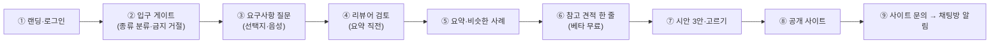

# 진행 상황 (경영진 확인용)

> 커밋·배포할 때마다 갱신한다. 기능 목록은 [README.md](README.md) "지금 상태", 남은 일 전체는 [docs/product/BACKLOG.md](docs/product/BACKLOG.md), 결정 기록은 [docs/product/DECISIONS.md](docs/product/DECISIONS.md).

**마감**: 2026-09-28 (제출: 온라인 GitHub 주소)
**최종 갱신**: 2026-09-26 오후 (운영 배포 HEAD는 `git log --oneline -1` 기준. 한때 이 줄에 SSH로 확인한 `494bd7f`가 적혀 있었으나 이후 배포로 바뀜)
**방향**: 해커톤 데모에서 실제 서비스로 전환(9/25). 소상공인·개인·단체 누구나 채팅(또는 음성)으로 사이트를 설명하면 AI가 요구사항을 정리하고, 시안 3안을 보여 주고, 고른 안으로 사이트를 만든다.

## 1. 한 줄 요약

**요구사항 받기 → 시안 3안 → 고르기 → 공개 → 문의 알림까지 휴대폰 크기 자동 점검 11단계가 운영에서 모두 통과한다(9/26).** 카카오 로그인은 운영 동작(구글은 테스트 모드라 버튼 숨김). 새로 들어간 것: 사진 올리기(위치 정보 제거, 시안·공개본 자동 반영), 영상 카드, AI 소개 문구 초안, 공개 사이트 빈칸 감추기, 업종별 예시 그림, 방장·초대 링크, 타이머 사전 경고, 문의 → 사장님 카톡, 직접 편집 화면, 무전기 모드, PWA. 남은 약점은 AI 대화 평가(T3 1차 10/34, 원인 수정 후 재측정 중)다.

## 2. 지금 바로 확인할 수 있는 곳

| 주소 | 무엇 |
|---|---|
| https://144.24.91.250.sslip.io | 랜딩(입력창 + 업종 템플릿 6개). 입력하면 채팅방으로 이동 |
| https://144.24.91.250.sslip.io/projects | 내 프로젝트(로그인하면 다른 기기 방도) |
| https://144-24-91-250.sslip.io/design/&lt;id&gt; | 시안 3안 고르기 페이지(생성물은 앱과 다른 주소에서만 열림) |
| https://144.24.91.250.sslip.io/privacy.html · /terms.html | 개인정보처리방침·이용약관(베타, 법률 검토 전) |

## 3. 사용자 흐름과 상태

| 번호 | 단계 | 상태 | 근거·비고 |
|---|---|---|---|
| ① | 랜딩, 카카오·구글 로그인, 내 프로젝트 | ✅ 운영 확인 | 9/26 실제 계정으로 로그인→내 프로젝트→로그아웃. 구글은 테스트 모드(초대된 계정만) |
| ② | 입구 게이트: 가게 6업종·개인·단체·웹서비스 분류, 종류별 질문 예산(가게 8·개인 7·단체 8·웹서비스 12), 사칭·피싱·도박 등 거절 | ✅ 운영 | D29~D33, `tests/engine/test_intake_gate.py` |
| ③ | 질문 엔진: 선택지 버튼, "이렇게 이해했어요", "시안 먼저", 기능 사례집 42개 판정, 음성 입력(NVIDIA Parakeet), 듣기(NVIDIA Magpie) | ✅ 운영 | 엔진 결함 16건 수정(검증 31/31) |
| ④ | 리뷰어 에이전트: 원문↔카드 대조, 빠진 요구 채움·어긋남은 확인 요청 | ✅ 운영 | D34. 실측 약 3초, 첼로 사례에서 놓친 카톡 문의 요구를 찾음 |
| ⑤ | 요약 + 비슷한 사례(기능 사례집 기반 RAG) | ✅ 운영 | 가짜 "이전 프로젝트" 문구 제거 |
| ⑥ | 참고 견적 한 줄 + 베타 무료 | ✅ 운영 | D25. AI 3안(150만~650만 원) 제거 |
| ⑦ | 시안 3안(기본형·사진 강조형·간결형), 채팅방 미리보기 카드, "이걸로 할게요" | ✅ 운영 | 해커톤 요구 7. 휴대폰 화면으로 끝까지 눌러 확인 |
| ⑧ | 공개 사이트 `/site/<id>/`: 고른 안을 "공개"로 그대로 연다. 빈 자리가 있으면 목록을 보여 주고 "그대로 공개"로 한 번 더 확인(⑱) | ✅ 운영 | 9/26 운영에서 요청→2안→공개→문의 접수까지 확인 |
| ⑨ | 사이트 문의 양식 → 저장(30일) → 채팅방 "문의 알림" | ✅ 운영 | 스팸 숨김 칸·IP당 10분 5건. 카카오톡 "나에게 보내기" 알림은 아직 |

**안드로이드:** PWA로 홈 화면 설치 가능(9/26 실제 브라우저에서 서비스 워커 동작 확인). 네이티브 앱은 나중에 다른 방식으로.

**운영 기반**
- **NIM 대비 모델:** super가 과부하(503)면 ultra → lightning으로 넘어간다. 9/26에 실제 과부하가 있었고 이걸로 해결했다.
- **보안:** 생성물은 별도 주소 + CSP sandbox. 로그인은 state+PKCE와 `__Host-` HttpOnly 쿠키.
- **채팅방 규칙:** 투표 24시간·견적 7일·30일 닫기 타이머, 10명 상한.
- **배포:** git 방식. 스냅샷 + 자동 되돌리기.

**테스트:** 단위 169, 엔진 45, 프런트 29, evals 29 모두 통과(9/26).

## 4. 안 된 것 (마감 영향 순)

| # | 안 된 것 | 영향 | 다음 행동 |
|---|---|---|---|
| 2 | 실제 AI 평가 T2(추출 60개): 1차 77.3%·지어낸 값 3건 → 고친 뒤 **2차 90.2% / 3차 87.1%·지어낸 값 0건**, 케이스 통과 34 → 46개. 영업시간 20% → 93~100%, 전화 100%. 실행마다 ±3%p 흔들림(대비 모델 전환 영향 추정). T3 대화 36개는 실행 중 | 합격선(90%·0건)에 근접 | 남은 약점: 대상 손님·상품 칸 표현 차이. 결과: [1차](docs/product/evals/extraction-2026-09-26.md) · [2차](docs/product/evals/extraction-2026-09-26-r2.md) · [3차](docs/product/evals/extraction-2026-09-26-r3.md) |
| 3 | 공개 뒤 빈 자리 채우기(지금은 확인만 하고 공개) | 공개 후 가게 정보를 채팅으로 고칠 길이 없다 | 직접 편집 화면(P-10) 또는 채팅 수정 흐름 |
| 4 | 사진 올리기 | 시안의 사진 칸이 모두 "[사진 입력]" | 베타 뒤(P-6). 데모는 자리 표시로 진행 |
| 5 | 초대 링크 관리·방장 넘기기·다른 기기에서 같은 참여자로 들어가기 | 공유방 운영이 불편 | 베타 뒤(ROOM_POLICY R-2) |
| 6 | 타이머 사전 경고 알림(20시간·6일·27일), 72시간 알림, 게스트 방 자동 삭제 | 사용자가 초기화를 미리 모른다 | 베타 뒤 |
| 7 | 문의 알림을 사장님 카카오톡으로 | 지금은 채팅방에서만 보인다 | 베타 뒤(D32 ①의 나머지). 카카오 `talk_message` 동의 필요 |
| 8 | 사장님 직접 편집 화면 | 목업 데이터로만 동작 | 베타 뒤(P-10) |
| 9 | 백업을 서버 밖으로 | 서버 디스크가 망가지면 백업도 잃는다 | 베타 뒤(U-6, 사용자 승인 필요) |
| 10 | 법률 검토 | 방침·약관에 "확인 필요"가 남아 있다(국외 이전 국가·보관 기간 등) | 정식 공개 전 |

## 5. 경영진·사용자 결정·조치 대기

| # | 무엇 | 추천 |
|---|---|---|
| 1 | **저장소 공개 전환**(제출 직전, M-12) | 마지막 커밋 뒤 직접 전환 |
| 2 | 구글 콘솔 옛 시크릿(`****cLxC`) 삭제 | 지금 삭제(서버는 새 값 사용 중) |
| 3 | 심사위원이 구글 로그인을 써야 하면 테스트 사용자 추가 | 심사위원 이메일을 받으면 추가. 카카오는 누구나 가능 |
| 4 | 조사 에이전트(대화 밖 사례집 후보), 이전 프로젝트 정보 불러오기 | 둘 다 베타 뒤 |
| 5 | 전용 도메인, 개발자 결정 전화(Twilio) | 베타 뒤 |

## 6. 위험

| 위험 | 대비 |
|---|---|
| NVIDIA NIM 과부하·지연 | 대비 모델 3단(super → ultra → lightning), 실패 모델 60초 건너뛰기 |
| 발표 중 서버 장애 | 스냅샷·자동 되돌리기(`scripts/rollback.sh`), 헬스체크 |
| 구글 테스트 모드라 심사위원 로그인 불가 | 카카오 로그인 또는 로그인 없이 시작(기본 흐름은 로그인 불필요) |
