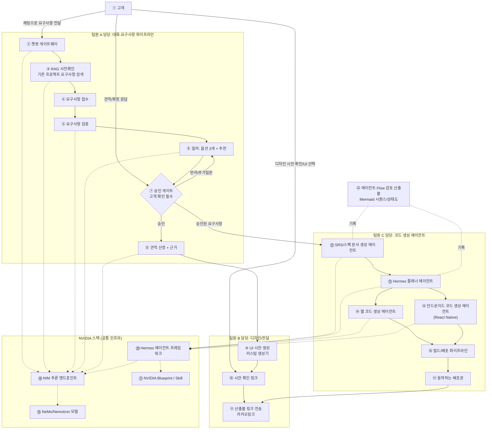
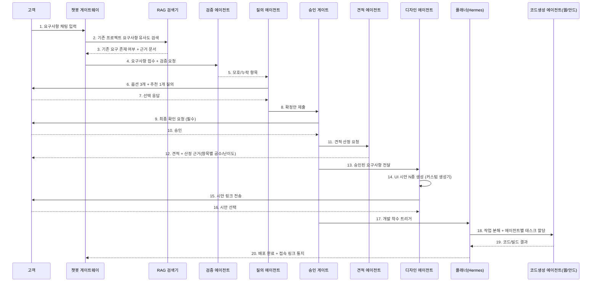

# NVIDIA 해커톤 에이전트 시스템 아키텍처 (초안 v0.1)

> 작성일: 2026-09-21 / 제출 기한: 2026-09-28
> 팀원: 3명 / 기반: 기존 `reqpipe`([docs/reqpipe/](../reqpipe/)) 개념을 챗봇형 에이전트로 확장
> 필수 스택: NVIDIA NeMo(니모), NIM, Hermes 에이전트, (선택) NVIDIA Blueprint / NVIDIA 제공 Skill 최대 활용
> 읽기 순서: 이 저장소를 처음 본다면 먼저 [최상위 README.md](../../README.md)를 읽을 것

## 목차

- [0. 이 문서의 목적](#0-이-문서의-목적)
- [0.1 용어 (이 문서 한정)](#01-용어-이-문서-한정)
- [0.2 배경지식 (에이전트·NIM·Hermes를 처음 접하는 사람을 위한 설명)](#02-배경지식-에이전트nimhermes를-처음-접하는-사람을-위한-설명)
- [1. 시스템 컨텍스트 (전체 그림)](#1-시스템-컨텍스트-전체-그림)
- [2. 요구사항 처리 파이프라인 (상세 시퀀스)](#2-요구사항-처리-파이프라인-상세-시퀀스)
- [3. 에이전트 구성 (팀원별 소유권)](#3-에이전트-구성-팀원별-소유권)
- [4. 동일 개발환경 (요구 10)](#4-동일-개발환경-요구-10)
- [5. 온보딩 가이드 구조 (요구 11)](#5-온보딩-가이드-구조-요구-11)
- [6. 확정된 결정 사항](#6-확정된-결정-사항)
- [7. 9/28 제출까지 마일스톤](#7-928-제출까지-마일스톤)

## 0. 이 문서의 목적

해커톤 요구사항 11개(챗봇 → 코드 산출물, RAG 사전확인, 접수/검증/질의/게이트, 견적 근거, 디자인 시안, 산출물 전송, 에이전트 분리, 동일 개발환경, 온보딩 가이드)를 하나의 시스템으로 묶기 위한 전체 아키텍처를 정의한다. 팀원 3명이 이 문서 하나만 보고 각자 맡은 서브시스템을 병렬로 개발할 수 있도록 경계(Context)를 명확히 나눈다.

## 0.1 용어 (이 문서 한정)

`reqpipe`의 공통 용어(RAG, NIM, WAL 등)는 [docs/reqpipe/02_REQUIREMENTS.md의 용어집](../reqpipe/02_REQUIREMENTS.md#02-용어집-한자어영어-약어-첫-등장-풀어쓰기)을 정본으로 삼는다. 아래는 이 해커톤 문서에서만 추가로 쓰는 용어다.

| 용어 | 뜻 |
|---|---|
| Hermes 에이전트 | NVIDIA NemoClaw 위에서 구동되는 에이전트 게이트웨이. OpenAI 호환 API로 NIM을 호출한다. 참고: [hackathon-agent-chatbot](https://github.com/kyungsikjeung/hackathon-agent-chatbot)(토이 프로젝트) |
| 게이트(승인 게이트) | 고객이 채팅으로 확인/승인해야만 다음 단계(견적·개발 착수)로 넘어가는 필수 확인 지점 |
| 시안 | 고객이 선택할 수 있도록 생성한 UI 디자인 후보(커스텀 템플릿 렌더링 결과) |
| 컨테이너 PaaS | Docker 이미지만 올리면 빌드·배포·HTTPS를 대신 처리해주는 배포 방식 (Render 등). 상세: [deployment/RENDER_DEPLOY.md](deployment/RENDER_DEPLOY.md) |

## 0.2 배경지식 (에이전트·NIM·Hermes를 처음 접하는 사람을 위한 설명)

요구 11)에 따라, 에이전트를 처음 만들어보거나 Hermes를 처음 쓰는 팀원도 이 문서를 읽을 수 있도록 핵심 개념을 먼저 풀어쓴다. 아래를 이미 알고 있다면 [1. 시스템 컨텍스트](#1-시스템-컨텍스트-전체-그림)로 바로 가도 된다.

**LLM(거대 언어 모델)이란**: 질문을 넣으면 그럴듯한 답을 만들어주는 AI 모델이다. 다만 혼자 두면 "모르는 것도 아는 척 지어내는"(환각) 문제가 있고, 여러 단계로 나뉜 복잡한 작업을 한 번에 시키면 중간에 실수한다.

**에이전트(Agent)란**: LLM 혼자 답을 뱉게 두지 않고, "계획 세우기 → 필요한 정보 찾기 → 실제로 실행하기 → 결과 확인하기 → 애매하면 되묻기"처럼 정해진 절차를 반복하게 만든 프로그램이다. 사람이 비서에게 "이거 알아서 처리해줘"라고 맡기되, 중요한 결정은 다시 확인받게 하는 것과 비슷하다. 이 프로젝트에서는 이 역할을 여러 개의 작은 에이전트로 쪼개서(§3), 각자 한 가지 일만 잘하게 만든다.

**멀티에이전트(여러 에이전트가 함께 일하는 구조)란**: 에이전트 하나가 모든 일(요구사항 정리+견적+디자인+코드생성)을 다 하게 만들면 실수가 잦고 디버깅도 어렵다. 그래서 "요구사항 담당 에이전트", "견적 담당 에이전트", "코드생성 담당 에이전트"처럼 역할을 나누고, 한 에이전트의 결과물을 다음 에이전트에게 넘기는 방식(파이프라인)으로 만든다. §2의 시퀀스 다이어그램이 이 순서를 보여준다.

**NVIDIA NIM이란**: NVIDIA가 만든 "AI 모델을 API로 호출할 수 있게 해주는 서비스"다. 우리가 GPU 서버를 직접 사서 모델을 돌릴 필요 없이, 인터넷으로 요청을 보내면 답을 받는 방식(다른 회사의 챗봇 API와 비슷한 사용 방식)이다.

**Nemotron/NeMo란**: NVIDIA가 만든 LLM 모델 계열(Nemotron)과, 그 모델을 학습·서빙하는 도구 모음(NeMo)의 이름이다. 이 프로젝트에서는 NIM을 통해 이 모델을 호출해서 챗봇 응답, 요구사항 검증, 임베딩(문서를 숫자로 변환해 검색 가능하게 만드는 것) 등을 처리한다.

**Hermes 에이전트/NemoClaw란**: 에이전트를 실제로 동작시켜주는 프레임워크(뼈대 코드)다. "계획 세우기→실행하기→검증하기"라는 반복 절차를 직접 짜지 않아도, Hermes가 그 틀을 제공하고 우리는 각 단계에서 무엇을 할지만 채워 넣는다. NemoClaw는 그 위에서 도는 실행 환경(샌드박스)이라고 이해하면 된다. 참고: [hackathon-agent-chatbot](https://github.com/kyungsikjeung/hackathon-agent-chatbot)(토이 프로젝트 — 처음 붙여보는 예제로 유용하지만, 상시 배포 없이 발표 시간에만 켜는 구조라 그대로 쓰면 안 됨, §6-1)

**RAG(검색 증강 생성)란**: LLM이 답하기 전에, 우리가 가진 신뢰할 수 있는 문서(이 프로젝트에서는 `docs/reqpipe`의 SRS.md/SPEC.md)를 먼저 검색해서 "이 내용을 참고해서 답해"라고 알려주는 방식이다. 모델이 모르는 걸 지어내지 않고, 실제 문서에 있는 내용을 근거로 답하게 만드는 안전장치다. §1 다이어그램의 ③번이 이 역할이다.

**승인 게이트란**: 에이전트가 자동으로 진행하다가, 중요한 결정(견적 확정, 개발 착수 등) 앞에서는 반드시 사람(고객)의 확인을 받고 멈추는 지점이다. AI가 마음대로 결정해서 사고 나는 것을 막는 안전장치다. §1의 ⑦번.

## 1. 시스템 컨텍스트 (전체 그림)

### 번호별 설명

| 번호 | 노드 | 담당 | 설명 |
|---|---|---|---|
| ① | 고객 | - | 챗봇으로 요구사항을 전달하고, 시안을 확인하고, 견적·확정 응답을 주는 외부 사용자 |
| ② | 챗봇 게이트웨이 | 팀원 A | 고객과의 채팅 창구. 모든 요구사항 입력이 여기로 들어온다 |
| ③ | RAG 사전확인 | 팀원 A | 요구사항 접수 전, 기존 프로젝트(SRS.md/SPEC.md 인덱스)에 유사 요구가 있었는지 검색 |
| ④ | 요구사항 접수 | 팀원 A | 채팅 내용을 구조화된 요구사항 항목으로 정리 |
| ⑤ | 요구사항 검증 | 팀원 A | 모호하거나 누락된 항목을 찾아냄 |
| ⑥ | 질의: 옵션 3개 + 추천 | 팀원 A | 검증에서 걸린 항목을 고객에게 옵션 3개 + 추천 1개로 되물음 |
| ⑦ | 승인 게이트 | 팀원 A | 고객이 반드시 채팅으로 확인해야 다음 단계(견적)로 넘어가는 필수 확인 지점 |
| ⑧ | 견적 산정 + 근거 | 팀원 A | 승인된 요구사항으로 견적과 산정 근거(항목별 공수/난이도)를 생성 |
| ⑨ | UI 시안 생성 | 팀원 B | 커스텀 HTML/CSS 템플릿 생성기로 UI 시안 N종 렌더링 |
| ⑩ | 시안 확인 링크 | 팀원 B | 고객이 시안을 보고 선택할 수 있는 웹 링크 |
| ⑪ | 산출물 링크 전송 | 팀원 B | 시안 링크·최종 배포 링크를 카카오링크로 고객에게 전송 |
| ⑫ | SRS/스펙 문서 생성 에이전트 | 팀원 C | 승인된 요구사항을 개발용 SRS/스펙 문서로 변환 |
| ⑬ | Hermes 플래너 에이전트 | 팀원 C | 스펙을 작업 단위로 분해해 웹/안드로이드 에이전트에 할당 |
| ⑭ | 웹 코드 생성 에이전트 | 팀원 C | 웹 산출물 코드를 생성 |
| ⑮ | 안드로이드 코드 생성 에이전트 | 팀원 C | React Native 기반 크로스플랫폼 코드를 생성 |
| ⑯ | 빌드/배포 파이프라인 | 팀원 C | 생성된 코드를 빌드하고 배포 |
| ⑰ | 동작하는 배포본 | 팀원 C | 실제로 접속 가능한 최종 산출물 (컨테이너 PaaS 상시 배포, §6-3 참고) |
| ⑱ | NIM 추론 엔드포인트 | 공통 인프라 | NVIDIA NIM 챗/임베딩 API 호출 지점 |
| ⑲ | NeMo/Nemotron 모델 | 공통 인프라 | NIM이 서빙하는 실제 모델 |
| ⑳ | Hermes 에이전트 프레임워크 | 공통 인프라 | NemoClaw 기반 에이전트 게이트웨이, NIM을 OpenAI 호환 API로 호출 |
| ㉑ | NVIDIA Blueprint / Skill | 공통 인프라 | 가능한 경우 활용하는 NVIDIA 제공 참조 구현/스킬 |
| ㉒ | 에이전트 Flow 검토 산출물 | 팀원 C | 에이전트 간 흐름을 검토할 수 있도록 남기는 Mermaid 시퀀스/상태도 기록 |

**요구사항 매핑**
| 요구 번호 | 반영 위치 |
|---|---|
| 1) 인프라 설계 + Mermaid + 역할분담 | 본 다이어그램 (TEAM_A/B/C 서브그래프) |
| 2) 채팅 요구사항 전달 | ② |
| 3) 접수/검증/질의(3+추천)/게이트 | ④→⑤→⑥→⑦ |
| 4) RAG 사전확인 | ③ (④ 이전 단계) |
| 5) 웹/안드로이드, 동작하는 산출물 | ⑭/⑮→⑯→⑰ |
| 6) 채팅 확인 필수 + 견적 근거 | ⑦, ⑧ |
| 7) UI 시안(커스텀) | ⑨ |
| 8) 시안 링크 전송 | ⑪ |
| 9) 에이전트 분리 + Flow 검토 산출물 | TEAM_C 서브그래프(⑫~⑰), ㉒ |
| 10) 동일 개발환경 | §4 |
| 11) 온보딩 가이드 | §5 |

## 2. 요구사항 처리 파이프라인 (상세 시퀀스)

| 번호 | 무슨 일이 일어나는가 |
|---|---|
| 1 | 고객이 챗봇 게이트웨이에 요구사항을 채팅으로 입력한다 |
| 2 | 챗봇이 RAG 검색기에게 기존 프로젝트와 유사한지 먼저 물어본다 |
| 3 | RAG가 기존 요구 존재 여부와 근거 문서를 돌려준다 |
| 4 | 챗봇이 검증 에이전트에게 요구사항 접수·검증을 요청한다 |
| 5 | 검증 에이전트가 모호하거나 빠진 항목을 질의 에이전트에게 전달한다 |
| 6 | 질의 에이전트가 고객에게 옵션 3개 + 추천 1개로 되묻는다 |
| 7 | 고객이 옵션 중 하나를 선택해 응답한다 |
| 8 | 질의 에이전트가 확정된 요구안을 승인 게이트에 제출한다 |
| 9 | 승인 게이트가 고객에게 최종 확인을 요청한다 (건너뛸 수 없는 필수 단계) |
| 10 | 고객이 승인한다 |
| 11 | 승인 게이트가 견적 에이전트에게 견적 산정을 요청한다 |
| 12 | 견적 에이전트가 견적과 산정 근거(항목별 공수/난이도)를 고객에게 전달한다 |
| 13 | 승인 게이트가 디자인 에이전트에게 승인된 요구사항을 전달한다 |
| 14 | 디자인 에이전트가 커스텀 생성기로 UI 시안 여러 종을 만든다 |
| 15 | 디자인 에이전트가 고객에게 시안 링크를 전송한다 |
| 16 | 고객이 시안 중 하나를 선택한다 |
| 17 | 승인 게이트가 (시안 작업과 별개로, 동시에) 개발 착수를 플래너에게 트리거한다 |
| 18 | 플래너(Hermes)가 작업을 분해해 웹/안드로이드 코드생성 에이전트에게 나눠준다 |
| 19 | 코드생성 에이전트가 코드/빌드 결과를 플래너에게 돌려준다 |
| 20 | 플래너가 배포 완료와 접속 링크를 챗봇 게이트웨이에 통지해 고객에게 전달되게 한다 |

## 3. 에이전트 구성 (팀원별 소유권)

| 서브시스템 | 담당 | 핵심 에이전트/모듈 | NVIDIA 스택 활용 |
|---|---|---|---|
| 대화·요구사항 | 팀원 A | 챗봇 게이트웨이, RAG 검색기(SRS.md/SPEC.md 색인), 검증 에이전트, 질의 에이전트, 승인 게이트 | NIM 챗 엔드포인트(Nemotron 3 Super), NIM 임베딩(`nemotron-3-embed-1b`) + 벡터DB, NemoClaw 기반 Hermes 게이트웨이 |
| 견적·디자인·전달 | 팀원 B | 견적 에이전트, 커스텀 UI 시안 생성기, 카카오링크 전송 서비스 | NIM(견적 근거 생성), HTML 템플릿 렌더러 + 헤드리스 브라우저 스크린샷, 카카오링크 API |
| 코드 생성·배포 | 팀원 C | Hermes 플래너, 웹 코드 에이전트, React Native 코드 에이전트, 상시 배포 파이프라인 | NemoClaw/Hermes 에이전트 프레임워크, NIM 코드 모델, Docker 기반 상시 호스팅(ngrok 데모 방식 지양) |

각 에이전트는 **입력/출력 계약(스키마)**을 문서로 고정하고, 팀원 간에는 이 계약으로만 통신한다(직접 내부 구현 의존 금지) — reqpipe의 `ports`/`egress_broker` 유일 통로 원칙을 재사용.

## 4. 동일 개발환경 (요구 10)

- `docker-compose.yml` 또는 `devcontainer.json`으로 3인 동일 컨테이너 배포 (Python/Node 버전, NIM API 키 환경변수, Hermes SDK 버전 고정)
- 공용 `.env.example` 제공, 실제 키는 팀 노션/1Password 등 별도 공유 (레포에 커밋 금지)
- 브랜치 전략: `main` 보호, 서브시스템별 `feature/agent-a`, `feature/agent-b`, `feature/agent-c`
- 계약 스키마(§3)는 `contracts/` 디렉터리에 JSON Schema로 버전 관리 → 팀원 간 변경 시 PR 리뷰 필수

## 5. 온보딩 가이드 구조 (요구 11)

에이전트/Hermes를 처음 접하는 팀원을 위해, AI가 질문할 때도 아래 3단 구조로 답을 구성한다.

1. **배경**: 왜 이 결정이 필요한가 (예: "Hermes는 멀티에이전트 오케스트레이션 프레임워크로, 태스크를 플래너→워커로 분해합니다")
2. **목적**: 이 결정이 전체 파이프라인에서 어떤 역할을 하는가
3. **상세 핸즈온**: 실행 가능한 단계별 명령/코드 스니펫 (복붙 가능한 수준)

이 구조를 `docs/onboarding/` 하위에 파트별로 작성 (`01_nim_setup.md`, `02_hermes_basics.md`, `03_agent_contracts.md`, `04_local_dev.md`).

## 6. 확정된 결정 사항

| 항목 | 결정 | 비고 |
|---|---|---|
| UI 시안 생성 | **커스텀 생성기** (Figma API 미사용) | HTML/CSS 템플릿 N종 + 요구사항 파라미터(색상/레이아웃/컴포넌트 구성)를 채워넣는 방식. 렌더링 후 스크린샷(헤드리스 브라우저)으로 미리보기 이미지도 함께 생성해 링크 페이지에 임베드 |
| 시안/산출물 전송 | **카카오링크** | reqpipe가 이미 카카오링크 기준으로 설계돼 있어 그대로 재사용. §1 다이어그램의 `DELIVER`는 카카오링크 API(또는 카카오톡 공유 URL 스킴) 단일 통로로 구현 |
| 안드로이드 산출물 | **크로스플랫폼 (React Native)** | 팀 C가 웹(React 계열)과 스택을 공유해 코드 생성 에이전트 프롬프트/템플릿을 재사용 가능. Flutter 대비 팀 기존 경험(React) 활용도가 높음 |
| RAG 인덱스 | **SRS.md + SPEC.md 초기 지식베이스** | 레퍼런스 리포(`hackathon-agent-chatbot`)의 `ingest.py` 패턴을 재사용: NIM 임베딩(`nemotron-3-embed-1b`) → 벡터DB(Pinecone 또는 로컬 대체) 색인. 두 문서를 섹션 단위로 청크 분할 후 색인 |
| 에이전트 프레임워크 | **NemoClaw 기반 Hermes 게이트웨이** ([참조](https://github.com/kyungsikjeung/hackathon-agent-chatbot)) | ⚠️ 참조 리포는 **토이 프로젝트**: 로컬 macOS `backend.py`(포트 8643) + ngrok 터널을 발표 시간에만 기동하는 구조로, 상시 배포가 아님. 요구 5)의 "배포된 최종산출물은 동작해야 한다"를 만족하려면 §6-1 참고 |

### 6-1. 참조 리포와의 차이 — 프로덕션화 필요 지점

레퍼런스는 **데모 시연용**(발표 시간에만 백엔드 기동)이라, 이번 해커톤 제출물은 아래를 추가로 확정해야 한다.

- [ ] **상시 배포**: ngrok 대신 실제 호스팅(예: NIM 엔드포인트는 NVIDIA 호스티드 API 그대로 사용, `backend.py` 역할은 Render/Railway/Fly.io 등 상시 서버로 이전) — 심사 시간 외에도 산출물이 동작해야 하므로 로컬+ngrok 방식은 채택 불가
- [ ] Hermes/NemoClaw 로컬 샌드박스 의존성(`nemohermes hermespatched ...` CLI)을 팀원 전원이 각자 환경에서 재현 가능한지 확인 (Docker Desktop 필요) → §4 동일 개발환경에 Docker 포함하여 셋업
- [ ] 참조 리포는 단일 상담 챗봇(요구사항 수집 + 예산/납기 수집)까지만 구현되어 있음 — 이번 프로젝트가 추가해야 하는 범위: RAG 사전확인(신규 vs 기존 프로젝트 판별), 검증/질의(3안+추천)/게이트, 견적 근거 생성, UI 시안 생성기, 코드 생성 에이전트(웹/안드), 카카오링크 전송. 참조 리포의 RAG+Hermes 연동 패턴만 재사용하고 나머지는 신규 구현
- [ ] 카카오톡 연동은 참조 리포에서 "미착수(스트레치 골)" 상태 — 이번 프로젝트에서는 필수 요구(요구 8)이므로 팀원 B가 최우선으로 구현

### 6-2. 상시 운영환경 제안 (신규)

참조 리포의 "로컬 macOS + ngrok, 발표 시간에만 기동" 방식은 이번 요구 5)("고객은 배포된 최종산출물은 동작하는것이어야 한다")를 만족하지 못한다. 아래 3안 중 하나를 팀 상황(비용/러닝커브/시간)에 맞게 선택한다.

| 안 | 구성 | 장점 | 단점 | 추천 상황 |
|---|---|---|---|---|
| **A. 컨테이너 PaaS (권장)** | 프론트: Netlify/Vercel (그대로 유지) · 백엔드(`backend.py` 역할, RAG/게이트/에이전트 오케스트레이션): Render 또는 Railway에 Docker 컨테이너로 상시 배포 · NIM/NemoClaw: NVIDIA 호스티드 NIM API를 그대로 호출(로컬 GPU 불필요) | ngrok 제거로 항상 접속 가능, 설정이 단순, 팀원 3명 모두 Docker 이미지 하나로 로컬 재현 가능(§4와 합치) | 무료 티어는 콜드스타트 지연 있음(수십 초) — 데모 직전 워밍업 요청 권장 | 팀 인프라 경험이 적고 해커톤 기간(1주) 내 안정성이 최우선일 때 |
| **B. 서버리스 함수** | 백엔드 로직을 API 라우트/서버리스 함수(Vercel Functions, Cloudflare Workers 등)로 분리, RAG 벡터DB는 관리형 서비스(Pinecone/Qdrant Cloud) 그대로 사용 | 인프라 관리 거의 없음, 오토스케일 | 장시간 실행되는 멀티에이전트 코드생성 플로우(팀 C)는 서버리스 실행시간 제한에 걸릴 수 있음 | 챗봇/견적/RAG 파트는 서버리스, 코드생성 파트만 별도 상시 서버로 혼합 운용 시 |
| **C. 클라우드 VM 상시 기동** | OCI/AWS/GCP 프리티어 VM 1대에 Docker Compose로 백엔드+Hermes 게이트웨이 상시 기동, 프론트는 Netlify | 완전한 제어권, 장시간 작업(코드생성 빌드) 제약 없음 | VM 셋업/보안(방화벽, HTTPS 인증서) 팀원이 직접 관리해야 함, 해커톤 기간 내 부담 큼 | 팀에 인프라 경험자가 있고 코드생성 파이프라인이 무거울 것으로 예상될 때 |

**권장안**: A(컨테이너 PaaS)를 기본으로 하되, 팀 C의 코드 생성·빌드 파이프라인만 실행시간이 긴 작업이므로 큐(Job Queue, 예: 간단한 백그라운드 워커)로 분리해 A안의 웹 요청/응답 흐름과 분리 실행한다. §1 다이어그램의 `BUILD` 단계를 별도 워커 프로세스로 설계하면 A안 그대로 적용 가능.

### 6-3. 최종 확정: Render (무료 플랜 + 워밍업 전략)

A안 중 **Render**를 채택하고, 무료 플랜의 콜드스타트는 발표/심사 직전 워밍업 절차로 감수한다 (유료 플랜 상시 전환은 심사 당일에만 적용). 사람 팀원과 AI 코드생성 에이전트가 동일하게 따라갈 수 있는 배포 절차는 별도 문서로 분리했다.

→ [deployment/RENDER_DEPLOY.md](deployment/RENDER_DEPLOY.md) (Dockerfile 템플릿, Render 설정값, 환경변수 목록, 워밍업 스크립트, AI 에이전트 작업 범위/제약 포함)

## 7. 9/28 제출까지 마일스톤

팀원별 단계적 통합 전략, 경계(Boundary)별 계약 스키마, 일자별 상세 마일스톤(D0~D7), 공통 개발 전략과 리스크 폴백은 별도 문서로 분리했다.

→ [INTEGRATION_STRATEGY.md](INTEGRATION_STRATEGY.md)
