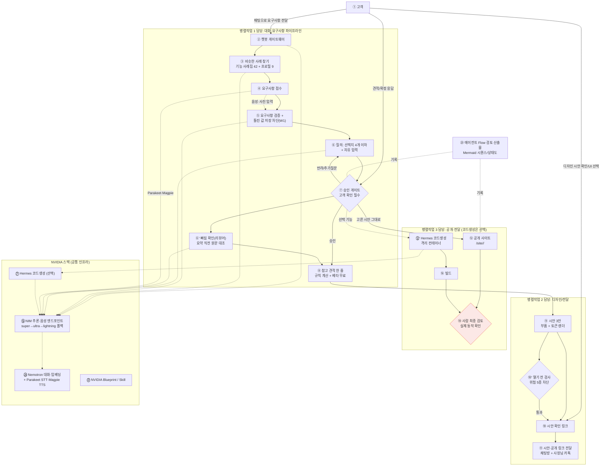
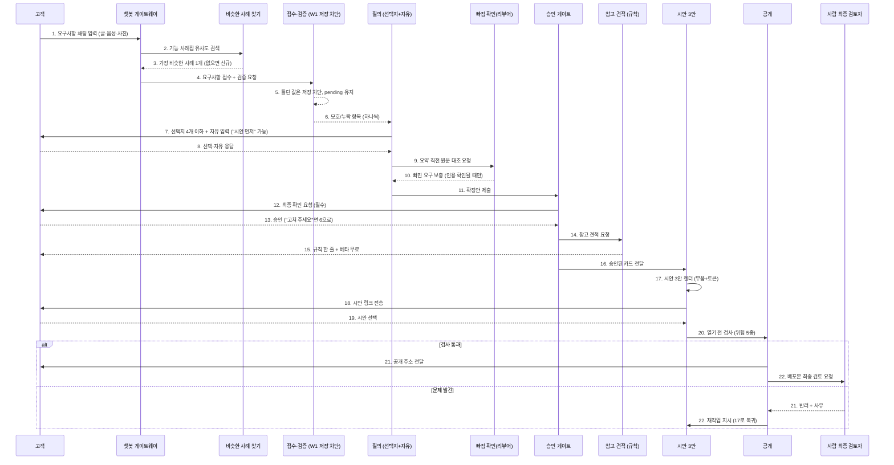

# 한마디(agt001) 시스템 아키텍처 (v0.2)

> 참고: 이 문서의 backend.py 는 초기 구조다. 지금 코드는 app/ (FastAPI) 구조이며 에이전트 목록은 docs/product/AGENTS.md 를 본다.

> 작성일: 2026-09-21 / v0.2 개정: 2026-09-27
> v0.2 변경: D25(규칙 견적)·D31(AI 화면만+공용 API)·D34(리뷰어)·W1(저장 차단)·사례집 RAG·PWA·OCI 직접 배포·게시 검사·사진/음성/편집/예약 반영. 상세 변경표는 §8.
> 병렬작업 3개 / 기반: 기존 `reqpipe`([docs/reqpipe/](../reqpipe/)) 개념을 챗봇형 에이전트로 확장
> 필수 스택: NVIDIA NeMo(니모), NIM, Hermes 에이전트, (선택) NVIDIA Blueprint / NVIDIA 제공 Skill 최대 활용
> 읽기 순서: [최상위 README.md](../../README.md)(간략 개요) → [REQUIREMENTS.md](REQUIREMENTS.md)(무엇을·완료조건) → 이 문서(어떻게 만들지)

## 목차

- [0. 이 문서의 목적](#0-이-문서의-목적)
- [0.1 용어 (이 문서 한정)](#01-용어-이-문서-한정)
- [0.2 배경지식 (에이전트·NIM·Hermes를 처음 접하는 사람을 위한 설명)](#02-배경지식-에이전트nimhermes를-처음-접하는-사람을-위한-설명)
- [1. 시스템 컨텍스트 (전체 그림)](#1-시스템-컨텍스트-전체-그림)
- [2. 요구사항 처리 파이프라인 (상세 시퀀스)](#2-요구사항-처리-파이프라인-상세-시퀀스)
- [3. 에이전트 구성 (작업자별 소유권)](#3-에이전트-구성-작업자별-소유권)
- [4. 동일 개발환경 (요구 10)](#4-동일-개발환경-요구-10)
- [5. 온보딩 가이드 구조 (요구 11)](#5-온보딩-가이드-구조-요구-11)
- [6. 확정된 결정 사항](#6-확정된-결정-사항)
- [7. 마일스톤](#7-마일스톤-v02-개정)

## 0. 이 문서의 목적

기본 요구사항 11개(챗봇 → 코드 산출물, RAG 사전확인, 접수/검증/질의/게이트, 견적 근거, 디자인 시안, 산출물 전송, 에이전트 분리, 동일 개발환경, 온보딩 가이드)를 하나의 시스템으로 묶기 위한 전체 아키텍처를 정의한다. 병렬작업 3개가 이 문서 하나만 보고 각자 맡은 서브시스템을 병렬로 개발할 수 있도록 경계(Context)를 명확히 나눈다.

## 0.1 용어 (이 문서 한정)

`reqpipe`의 공통 용어(RAG, NIM, WAL 등)는 [docs/reqpipe/02_REQUIREMENTS.md의 용어집](../reqpipe/02_REQUIREMENTS.md#02-용어집-한자어영어-약어-첫-등장-풀어쓰기)을 정본으로 삼는다. 아래는 이 문서에서만 추가로 쓰는 용어다.

| 용어 | 뜻 |
|---|---|
| Hermes 에이전트 | NVIDIA NemoClaw 위에서 구동되는 에이전트 게이트웨이. OpenAI 호환 API로 NIM을 호출한다. 참고: [hackathon-agent-chatbot](https://github.com/kyungsikjeung/hackathon-agent-chatbot)(토이 프로젝트) |
| 게이트(승인 게이트) | 고객이 채팅으로 확인/승인해야만 다음 단계(견적·개발 착수)로 넘어가는 필수 확인 지점 |
| 시안 | 고객이 선택할 수 있도록 생성한 UI 디자인 후보(커스텀 템플릿 렌더링 결과) |
| 컨테이너 PaaS | Docker 이미지만 올리면 빌드·배포·HTTPS를 대신 처리해주는 배포 방식 (Render 등). 상세: [deployment/RENDER_DEPLOY.md](deployment/RENDER_DEPLOY.md) |

## 0.2 배경지식 (에이전트·NIM·Hermes를 처음 접하는 사람을 위한 설명)

요구 11)에 따라, 에이전트를 처음 만들어보거나 Hermes를 처음 쓰는 개발자도 이 문서를 읽을 수 있도록 핵심 개념을 먼저 풀어쓴다. 아래를 이미 알고 있다면 [1. 시스템 컨텍스트](#1-시스템-컨텍스트-전체-그림)로 바로 가도 된다.

**LLM(거대 언어 모델)이란**: 질문을 넣으면 그럴듯한 답을 만들어주는 AI 모델이다. 다만 혼자 두면 "모르는 것도 아는 척 지어내는"(환각) 문제가 있고, 여러 단계로 나뉜 복잡한 작업을 한 번에 시키면 중간에 실수한다.

**에이전트(Agent)란**: LLM 혼자 답을 뱉게 두지 않고, "계획 세우기 → 필요한 정보 찾기 → 실제로 실행하기 → 결과 확인하기 → 애매하면 되묻기"처럼 정해진 절차를 반복하게 만든 프로그램이다. 사람이 비서에게 "이거 알아서 처리해줘"라고 맡기되, 중요한 결정은 다시 확인받게 하는 것과 비슷하다. 이 프로젝트에서는 이 역할을 여러 개의 작은 에이전트로 쪼개서(§3), 각자 한 가지 일만 잘하게 만든다.

**멀티에이전트(여러 에이전트가 함께 일하는 구조)란**: 에이전트 하나가 모든 일(요구사항 정리+견적+디자인+코드생성)을 다 하게 만들면 실수가 잦고 디버깅도 어렵다. 그래서 "요구사항 담당 에이전트", "견적 담당 에이전트", "코드생성 담당 에이전트"처럼 역할을 나누고, 한 에이전트의 결과물을 다음 에이전트에게 넘기는 방식(파이프라인)으로 만든다. §2의 시퀀스 다이어그램이 이 순서를 보여준다.

**NVIDIA NIM이란**: NVIDIA가 만든 "AI 모델을 API로 호출할 수 있게 해주는 서비스"다. 우리가 GPU 서버를 직접 사서 모델을 돌릴 필요 없이, 인터넷으로 요청을 보내면 답을 받는 방식(다른 회사의 챗봇 API와 비슷한 사용 방식)이다.

**Nemotron/NeMo란**: NVIDIA가 만든 LLM 모델 계열(Nemotron)과, 그 모델을 학습·서빙하는 도구 모음(NeMo)의 이름이다. 이 프로젝트에서는 NIM을 통해 이 모델을 호출해서 챗봇 응답, 요구사항 검증, 임베딩(문서를 숫자로 변환해 검색 가능하게 만드는 것) 등을 처리한다.

**Hermes 에이전트/NemoClaw란**: 에이전트를 실제로 동작시켜주는 프레임워크(뼈대 코드)다. "계획 세우기→실행하기→검증하기"라는 반복 절차를 직접 짜지 않아도, Hermes가 그 틀을 제공하고 우리는 각 단계에서 무엇을 할지만 채워 넣는다. NemoClaw는 그 위에서 도는 실행 환경(샌드박스)이라고 이해하면 된다. 참고: [hackathon-agent-chatbot](https://github.com/kyungsikjeung/hackathon-agent-chatbot)(토이 프로젝트 — 처음 붙여보는 예제로 유용하지만, 상시 배포 없이 발표 시간에만 켜는 구조라 그대로 쓰면 안 됨, §6-1)

**RAG(검색 증강 생성)란**: LLM이 답하기 전에, 우리가 가진 신뢰할 수 있는 문서(이 프로젝트에서는 `docs/reqpipe`의 SRS.md/SPEC.md)를 먼저 검색해서 "이 내용을 참고해서 답해"라고 알려주는 방식이다. 모델이 모르는 걸 지어내지 않고, 실제 문서에 있는 내용을 근거로 답하게 만드는 안전장치다. §1 다이어그램의 ③번이 이 역할이다.

**승인 게이트란**: 에이전트가 자동으로 진행하다가, 중요한 결정(견적 확정, 개발 착수 등) 앞에서는 반드시 사람(고객)의 확인을 받고 멈추는 지점이다. AI가 마음대로 결정해서 사고 나는 것을 막는 안전장치다. §1의 ⑦번.

## 1. 시스템 컨텍스트 (전체 그림)

### 번호별 설명

| 번호 | 노드 | 담당 | 설명 |
|---|---|---|---|
| ① | 고객 | - | 챗봇으로 요구사항을 전달하고, 시안을 확인하고, 견적·확정 응답을 주는 외부 사용자 |
| ② | 챗봇 게이트웨이 | 병렬작업 1 | 고객과의 채팅 창구. 모든 요구사항 입력이 여기로 들어온다 |
| ③ | 비슷한 사례 찾기 | 병렬작업 1 | 기능 사례집 42개 + 문의 종류 프로필 9개를 NIM 임베딩으로 검색. 실패해도 대화는 계속된다 (v0.1 "기존 프로젝트 검색"에서 교체) |
| ④ | 요구사항 접수 | 병렬작업 1 | 채팅 내용을 구조화된 요구사항 항목으로 정리 |
| ⑤ | 요구사항 검증 + 저장 차단 | 병렬작업 1 | 모호·누락 항목 검출 + 틀린 값(전화·시간·가격·민감정보)은 저장 차단(W1), pending 유지·3회 반복 시 PLACEHOLDER |
| ⑥ | 질의: 선택지 4개 이하 + 자유 입력 | 병렬작업 1 | 검증에서 걸린 항목을 하나씩 되물음. "시안 먼저"로 건너뛰기 가능 |
| ⑥' | 빠짐 확인(리뷰어) | 병렬작업 1 | 요약 직전 원문↔카드 대조. 원문 인용 확인될 때만 채움 (D34) |
| ⑦ | 승인 게이트 | 병렬작업 1 | 고객이 반드시 채팅으로 확인해야 다음 단계(견적)로 넘어가는 필수 확인 지점 |
| ⑧ | 참고 견적 한 줄 | 병렬작업 1 | 규칙 계산 "외주면 약 OO만원 상당 · 베타 무료". AI 금액 생성 금지 (D25, v0.1 "견적 산정 + 근거"에서 교체) |
| ⑨ | 시안 3안 | 병렬작업 2 | 승인된 카드로 부품+토큰 렌더. 역할 고정(정석·분위기·대비) |
| ⑩ | 시안 확인 링크 | 병렬작업 2 | 고객이 시안을 보고 선택할 수 있는 웹 링크 |
| ⑩' | 열기 전 검사 | 병렬작업 2 | 외부 스크립트·외부 전송 폼 등 위험 5종이면 게시 차단 (S-5) |
| ⑪ | 시안·공개 링크 전달 | 병렬작업 2 | 채팅방 링크 + 사장님 카톡 전달 (v0.1 "카카오링크 단일 통로"에서 교체) |
| ⑫ | 공개 사이트 | 병렬작업 3 | 고른 시안 그대로 `/site/<id>/`. 빈칸 감추기. 기본 경로는 시안 우선 (D31) |
| ⑫' | Hermes 코드생성 (선택) | 병렬작업 3 | 확정 카드로 정적 사이트 생성. 요청별 격리 컨테이너. 공개본 기본값이 아님 |
| ⑱ | **사람 최종 검토** | 검토자 순번제 (A/B/C 돌아가며) | 자동 헬스체크(`/health` 200 OK)만으로는 "링크가 열리는지"만 확인될 뿐, 실제로 요구사항대로 동작하는지는 사람이 봐야 한다. 배포본을 직접 열어 ① 핵심 화면이 뜨는지 ② 요구했던 핵심 기능 1개가 실제로 동작하는지 ③ 깨진 링크·에러 화면이 없는지 확인 후 승인해야 ⑪ 전송이 실행된다. 문제 발견 시 ⑯ 빌드로 되돌아가 재작업 |
| ⑲ | NIM 추론·음성 엔드포인트 | 공통 인프라 | 대화·추출·임베딩·STT·TTS 호출 지점. 과부하 시 super→ultra→lightning 폴백, 실패 모델 60초 제외 |
| ⑳ | Nemotron·Parakeet·Magpie | 공통 인프라 | NIM이 서빙하는 실제 모델 (대화·임베딩·한국어 음성) |
| ㉑ | Hermes 코드생성 (선택) | 공통 인프라 | 격리 컨테이너 실행. 공개본 기본 경로가 아님 |
| ㉒ | NVIDIA Blueprint / Skill | 공통 인프라 | 가능한 경우 활용하는 NVIDIA 제공 참조 구현/스킬 |
| ㉓ | 에이전트 Flow 검토 산출물 | 병렬작업 3 | 에이전트 간 흐름을 검토할 수 있도록 남기는 Mermaid 시퀀스/상태도 기록 (`docs/product/FLOWDOC.md`) |

> **왜 사람이 끼어드는가**: 요구 5)("고객은 배포된 최종산출물은 동작하는것이어야 한다")를 자동화된 헬스체크만으로 보장할 수 없다. AI 코드생성 에이전트(⑫~⑯)가 문법적으로는 문제없지만 요구사항과 다르게 동작하는 코드를 만들 가능성이 있으므로, 고객에게 링크가 나가기 직전 마지막 한 명이 눈으로 확인하는 단계를 필수로 둔다. 이 검토는 병렬작업 1·2·3가 순번을 정해 돌아가며 맡는다(전담 인력을 따로 두지 않음).

**요구사항 매핑**
| 요구 번호 | 반영 위치 |
|---|---|
| 1) 인프라 설계 + Mermaid + 역할분담 | 본 다이어그램 (PAR_1·2·3 서브그래프) |
| 2) 채팅 요구사항 전달 | ② |
| 3) 접수/검증/질의(선택지+자유)/게이트 | ④→⑤(W1 저장 차단)→⑥→⑥'(리뷰어)→⑦ |
| 4) 비슷한 사례 사전확인 | ③ (④ 이전 단계, 사례집 42+프로필 9) |
| 5) 웹/안드로이드, 동작하는 산출물 | ⑫(고른 시안 공개)→⑱(사람 최종 검토)→⑪. 안드로이드는 PWA 1차, ⑫' Hermes는 선택 |
| 6) 채팅 확인 필수 + 견적 근거 | ⑦, ⑧(규칙 한 줄+D25) |
| 7) UI 시안(커스텀) | ⑨(3안) |
| 8) 시안 링크 전송 | ⑪(채팅방+카톡) |
| 9) 에이전트 분리 + Flow 검토 산출물 | 병렬작업 3 서브그래프(⑫~⑰), ㉓ |
| 10) 동일 개발환경 | §4 |
| 11) 온보딩 가이드 | §5 |
| (신규) 배포본 사람 최종 검토 | ⑱ — 자동 헬스체크만으로는 부족, 전송 직전 사람이 실제 동작을 확인 |

## 2. 요구사항 처리 파이프라인 (상세 시퀀스)

| 번호 | 무슨 일이 일어나는가 |
|---|---|
| 1 | 고객이 챗봇 게이트웨이에 요구사항을 채팅으로 입력한다 (글·음성·사진) |
| 2 | 챗봇이 비슷한 사례 찾기에 기능 사례집 유사도 검색을 먼저 물어본다 |
| 3 | 가장 비슷한 사례 1개를 돌려준다. 없으면 신규로 진행 (실패해도 대화 중단 없음) |
| 4 | 챗봇이 접수·검증에 요구사항 접수·검증을 요청한다 |
| 5 | 틀린 값(전화·시간·가격·민감정보)은 저장 차단하고 pending으로 둔다 (W1) |
| 6 | 모호하거나 빠진 항목을 질의에 하나씩 전달한다 |
| 7 | 질의가 선택지 4개 이하 + 자유 입력으로 되묻는다. "시안 먼저"로 건너뛸 수 있다 |
| 8 | 고객이 선택·자유 입력으로 응답한다 |
| 9 | 요약 직전에 리뷰어가 원문 대조를 요청받는다 |
| 10 | 원문 인용이 확인될 때만 빠진 요구를 보충한다 (D34) |
| 11 | 질의가 확정된 요구안을 승인 게이트에 제출한다 |
| 12 | 승인 게이트가 고객에게 최종 확인을 요청한다 (건너뛸 수 없는 필수 단계) |
| 13 | 고객이 승인한다. "고쳐 주세요"면 6번으로 돌아간다 |
| 14 | 승인 게이트가 참고 견적에 계산을 요청한다 |
| 15 | 규칙 한 줄("외주면 약 OO만원 상당 · 베타 무료")을 고객에게 전달한다 (D25) |
| 16 | 승인 게이트가 시안에 승인된 카드를 전달한다 |
| 17 | 시안이 부품+토큰으로 3안을 렌더한다 |
| 18 | 시안 링크를 고객에게 전송한다 |
| 19 | 고객이 시안 중 하나를 선택한다 |
| 20 | 공개가 열기 전 검사(위험 5종)를 먼저 돌린다. 막히면 사장님께 알린다 |
| 21 (통과) | 고른 시안 그대로 공개 주소를 전달하고, 검토자가 실제 동작을 확인한다 |
| 21 (반려) | 검토자가 문제를 발견하면 사유와 함께 반려한다 |
| 22 (통과) | (공개 유지, 문의 받기 시작) |
| 22 (반려) | 시안에 재작업을 지시한다 (17번으로 되돌아감) |

## 3. 에이전트 구성 (작업자별 소유권)

| 서브시스템 | 담당 | 핵심 에이전트/모듈 | NVIDIA 스택 활용 |
|---|---|---|---|
| 대화·요구사항·견적 | 병렬작업 1 | 챗봇 게이트웨이, 비슷한 사례 찾기(사례집 42+프로필 9), 접수·검증(W1 저장 차단), 질의(선택지+자유), 빠짐 확인 리뷰어(D34), 승인 게이트, 참고 견적(규칙 한 줄) ([상세: PARALLEL_1_SPEC.md](PARALLEL_1_SPEC.md)) | NIM 대화(super→ultra→lightning 폴백) + NIM 임베딩(`nemotron-3-embed-1b`), Parakeet STT·Magpie TTS |
| 디자인·전달 | 병렬작업 2 | 시안 3안 렌더러(부품+토큰), 열기 전 검사(S-5), 시안·공개 링크 전달(채팅방+카톡) ([상세: PARALLEL_2_SPEC.md](PARALLEL_2_SPEC.md)) | 정적 템플릿 렌더러 + 헤드리스 브라우저 스크린샷 |
| 공개·전달 | 병렬작업 3 | 고른 시안 공개(`/site/<id>/`), 직접 편집 카드 API, 문의·예약 공용 API, Hermes 코드생성(선택·격리) ([상세: PARALLEL_3_SPEC.md](PARALLEL_3_SPEC.md)) | Docker 격리 실행, OCI 직접 배포(Caddy) |
| **배포본 최종 검토(신규, ⑱)** | **병렬작업 1·2·3 순번제** | 전담 에이전트 없음 — 사람이 직접 배포본을 열어 확인 | 해당 없음 (사람 작업) |

각 에이전트는 **입력/출력 계약(스키마)**을 문서로 고정하고, 작업자 간에는 이 계약으로만 통신한다(직접 내부 구현 의존 금지) — reqpipe의 `ports`/`egress_broker` 유일 통로 원칙을 재사용.

## 4. 동일 개발환경 (요구 10)

- `docker-compose.yml` 또는 `devcontainer.json`으로 3인 동일 컨테이너 배포 (Python/Node 버전, NIM API 키 환경변수, Hermes SDK 버전 고정)
- 공용 `.env.example` 제공, 실제 키는 프로젝트 노션/1Password 등 별도 공유 (레포에 커밋 금지)
- 브랜치 전략: `main` 보호, 서브시스템별 `feature/agent-a`, `feature/agent-b`, `feature/agent-c`
- 계약 스키마(§3)는 `contracts/` 디렉터리에 JSON Schema로 버전 관리 → 작업자 간 변경 시 PR 리뷰 필수

## 5. 온보딩 가이드 구조 (요구 11)

에이전트/Hermes를 처음 접하는 개발자를 위해, AI가 질문할 때도 아래 3단 구조로 답을 구성한다.

1. **배경**: 왜 이 결정이 필요한가 (예: "Hermes는 멀티에이전트 오케스트레이션 프레임워크로, 태스크를 플래너→워커로 분해합니다")
2. **목적**: 이 결정이 전체 파이프라인에서 어떤 역할을 하는가
3. **상세 핸즈온**: 실행 가능한 단계별 명령/코드 스니펫 (복붙 가능한 수준)

이 구조를 `docs/onboarding/` 하위에 파트별로 작성 (`01_nim_setup.md`, `02_hermes_basics.md`, `03_agent_contracts.md`, `04_local_dev.md`).

## 6. 확정된 결정 사항

| 항목 | 결정 | 비고 |
|---|---|---|
| UI 시안 생성 | **커스텀 생성기** (Figma API 미사용) | HTML/CSS 템플릿 N종 + 요구사항 파라미터(색상/레이아웃/컴포넌트 구성)를 채워넣는 방식. 렌더링 후 스크린샷(헤드리스 브라우저)으로 미리보기 이미지도 함께 생성해 링크 페이지에 임베드 |
| 시안/산출물 전송 | **채팅방 링크 + 사장님 카톡 전달** | 시안·공개 링크는 채팅방으로, 문의 알림은 채팅방 + 사장님 카톡("나에게 보내기"). 그룹채팅 봇 동작은 공식 API로 불가하여 링크 공유 방식 |
| 안드로이드 산출물 | **PWA 1차** | 홈 화면 설치(standalone·아이콘·오프라인 안내). React Native 코드생성은 하지 않는다. 네이티브 앱은 나중에 다른 방식으로 |
| 비슷한 사례 자료 | **기능 사례집 42개 + 프로필 9개** | 가짜 과거 프로젝트 문구 제거. NIM 임베딩 1회 임베딩(2.4초), 코사인 기준 0.76. 실패해도 대화 중단 없음 |
| 에이전트 프레임워크 | **역할별 모듈 + 단일 NIM 진입점** | `app/llm.py` 한 곳으로 모든 NIM 호출. 한 턴마다 여러 에이전트를 부르지 않고 요약 직전 리뷰어 1회만 (D34) |
| 배포본 최종 검토 | **사람 순번제 검토 게이트 추가** (§1 ⑱) | 자동 헬스체크(`/health`)는 "서버가 켜져 있는지"만 확인하고 "요구사항대로 동작하는지"는 확인하지 못한다. 전송(⑪) 직전에 병렬작업 1·2·3가 돌아가며 직접 배포본을 열어 핵심 화면·핵심 기능 1개·에러 여부를 확인해야 통과된다. 전담 인력을 새로 두지 않고 기존 3명이 순번으로 처리 |

### 6-1. 참조 리포와의 차이 — 프로덕션화 필요 지점

레퍼런스는 **시연용**(발표 시간에만 백엔드 기동)이라, 이번 서비스는 아래를 추가로 확정해야 한다.

- [ ] **상시 배포**: ngrok 대신 실제 호스팅(예: NIM 엔드포인트는 NVIDIA 호스티드 API 그대로 사용, `backend.py` 역할은 Render/Railway/Fly.io 등 상시 서버로 이전) — 점검 시간 외에도 산출물이 동작해야 하므로 로컬+ngrok 방식은 채택 불가
- [ ] Hermes/NemoClaw 로컬 샌드박스 의존성(`nemohermes hermespatched ...` CLI)을 작업자 전원이 각자 환경에서 재현 가능한지 확인 (Docker Desktop 필요) → §4 동일 개발환경에 Docker 포함하여 셋업
- [ ] 참조 리포는 단일 상담 챗봇(요구사항 수집 + 예산/납기 수집)까지만 구현되어 있음 — 이번 프로젝트가 추가해야 하는 범위: RAG 사전확인(신규 vs 기존 프로젝트 판별), 검증/질의(3안+추천)/게이트, 견적 근거 생성, UI 시안 생성기, 코드 생성 에이전트(웹/안드), 카카오링크 전송. 참조 리포의 RAG+Hermes 연동 패턴만 재사용하고 나머지는 신규 구현
- [ ] 카카오톡 연동은 참조 리포에서 "미착수(스트레치 골)" 상태 — 이번 프로젝트에서는 필수 요구(요구 8)이므로 병렬작업 2가 최우선으로 구현

### 6-2. 상시 운영환경 제안 (신규)

참조 리포의 "로컬 macOS + ngrok, 발표 시간에만 기동" 방식은 이번 요구 5)("고객은 배포된 최종산출물은 동작하는것이어야 한다")를 만족하지 못한다. 아래 3안 중 하나를 프로젝트 상황(비용/러닝커브/시간)에 맞게 선택한다.

| 안 | 구성 | 장점 | 단점 | 추천 상황 |
|---|---|---|---|---|
| **A. 컨테이너 PaaS (권장)** | 프론트: Netlify/Vercel (그대로 유지) · 백엔드(`backend.py` 역할, RAG/게이트/에이전트 오케스트레이션): Render 또는 Railway에 Docker 컨테이너로 상시 배포 · NIM/NemoClaw: NVIDIA 호스티드 NIM API를 그대로 호출(로컬 GPU 불필요) | ngrok 제거로 항상 접속 가능, 설정이 단순, 병렬작업 3개 모두 Docker 이미지 하나로 로컬 재현 가능(§4와 합치) | 무료 티어는 콜드스타트 지연 있음(수십 초) — 시연 직전 워밍업 요청 권장 | 작업자 인프라 경험이 적고 개발 기간(1주) 내 안정성이 최우선일 때 |
| **B. 서버리스 함수** | 백엔드 로직을 API 라우트/서버리스 함수(Vercel Functions, Cloudflare Workers 등)로 분리, RAG 벡터DB는 관리형 서비스(Pinecone/Qdrant Cloud) 그대로 사용 | 인프라 관리 거의 없음, 오토스케일 | 장시간 실행되는 멀티에이전트 코드생성 플로우(병렬작업 3)는 서버리스 실행시간 제한에 걸릴 수 있음 | 챗봇/견적/RAG 파트는 서버리스, 코드생성 파트만 별도 상시 서버로 혼합 운용 시 |
| **C. 클라우드 VM 상시 기동** | OCI/AWS/GCP 프리티어 VM 1대에 Docker Compose로 백엔드+Hermes 게이트웨이 상시 기동, 프론트는 Netlify | 완전한 제어권, 장시간 작업(코드생성 빌드) 제약 없음 | VM 셋업/보안(방화벽, HTTPS 인증서) 작업자가 직접 관리해야 함, 개발 기간 내 부담 큼 | 작업자 중에 인프라 경험자가 있고 코드생성 파이프라인이 무거울 것으로 예상될 때 |

**권장안**: A(컨테이너 PaaS)를 기본으로 하되, 병렬작업 3의 코드 생성·빌드 파이프라인만 실행시간이 긴 작업이므로 큐(Job Queue, 예: 간단한 백그라운드 워커)로 분리해 A안의 웹 요청/응답 흐름과 분리 실행한다. §1 다이어그램의 `BUILD` 단계를 별도 워커 프로세스로 설계하면 A안 그대로 적용 가능.

### 6-3. 최종 확정: OCI 직접 배포 (Caddy + Docker Compose)

v0.1의 Render안에서 변경. 실제 채택은 **OCI 무료 VM 1대 + Docker Compose(db + backend + caddy)**다 (v0.1 §6-2 C안).
Caddy가 `144.24.91.250.sslip.io`로 들어오는 요청을 백엔드(8643)로 전달하고 인증서를 자동 발급한다.
배포는 `scripts/deploy.sh` (배포 전 스냅샷 5개 보관) + `scripts/rollback.sh` (헬스체크 실패 시 자동 롤백).
DB는 PostgreSQL 16 컨테이너 + Alembic 마이그레이션, 백업은 `scripts/backup_db.sh` + 서버 밖 복사.

→ [deployment/RENDER_DEPLOY.md](deployment/RENDER_DEPLOY.md) (v0.1 잔재, OCI 기준으로 다시 쓸 예정)

## 7. 마일스톤 (v0.2 개정)

- 2026-09-28: 내부 점검 기준일. 산출물은 동작하는 서비스 + 본 문서.
- 2026-10-17: 비공개 베타 검증. 사장님 약 10명과 3안 선택·비교 (D41). 날짜 고정, 완성도와 무관하게 만남.
- 2026-11-14: 정식 오픈 목표 (D47). 전제: 유료 모델 전환·법률 검토·전용 도메인·운영 알림·무료 한도 장부.

상세 historically: → [INTEGRATION_STRATEGY.md](INTEGRATION_STRATEGY.md) (v0.1 D0~D7 마일스톤, 이력 보관)

## 8. v0.1 → v0.2 변경표

| # | v0.1 | v0.2 | 근거 |
|---|---|---|---|
| 1 | ⑧ AI 견적 3안 + 근거 | 규칙 참고 견적 한 줄 + 베타 무료 | D25 |
| 2 | ⑥ 옵션 3개 + 추천 1개 | 선택지 4개 이하 + 자유 입력, "시안 먼저" | 운영 실측 |
| 3 | ⑫~⑰ SRS→플래너→웹/안드 병렬 생성 | ⑫ 고른 시안 공개가 기본, ⑫' Hermes는 선택 | D31 |
| 4 | ⑪ 카카오링크 단일 통로 | 채팅방 링크 + 사장님 카톡 | 운영 실측 |
| 5 | ⑰ Render PaaS (§6-3) | OCI 직접 배포 (Caddy) | 운영 실측 |
| 6 | ③ 기존 프로젝트 RAG | 기능 사례집 42 + 프로필 9 | M-2 |
| 7 | 리뷰어·W1·사진/음성·편집·예약·게시검사 없음 | ⑤(W1)·⑥'(리뷰어)·⑩'(게시검사) 노드 추가 | D34·S-5·D32 |
| 8 | NIM 단일 모델 | super→ultra→lightning 3단 폴백 | 9/26 과부하 실측 |
| 9 | §7 9/28 D0~D7 마일스톤 | 베타 10/17·오픈 11/14 | D41·D47 |
