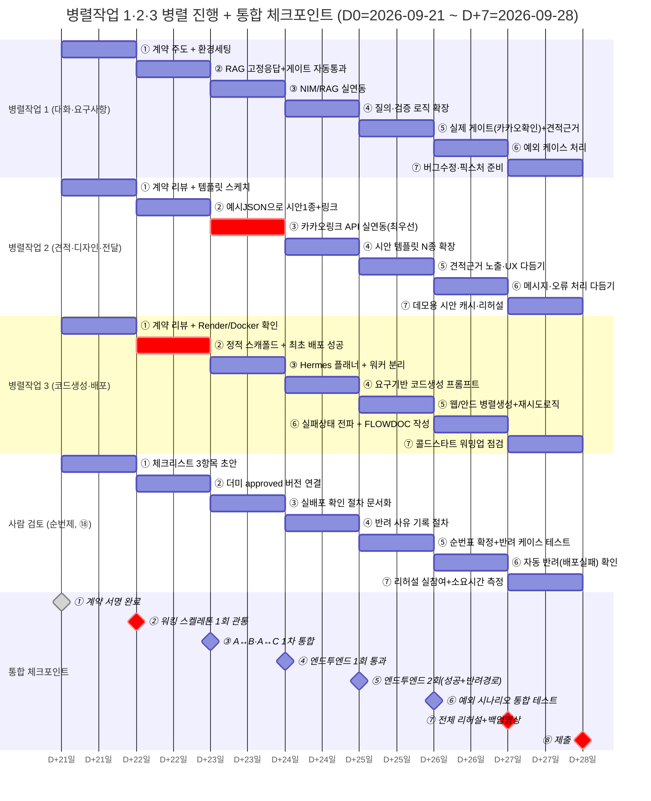

# 통합 전략 및 상세 마일스톤

> 작성일: 2026-09-21 / 1차 완성 목표: 2026-09-28
> 전제: [ARCHITECTURE.md](ARCHITECTURE.md)의 시스템 컨텍스트(①~㉓ 번호)와 작업자별 소유권(§3)을 기준으로 함
> 읽기 순서: [ARCHITECTURE.md](ARCHITECTURE.md) → 이 문서 → 매일 아침 §3(오늘 할 일) 확인
> PM 관점의 병목 점검·일일 운영 절차·계약 거버넌스는 [PM_ORCHESTRATION.md](PM_ORCHESTRATION.md)를 함께 본다.

## 목차

- [0. 전략 요약 (왜 이렇게 하는가)](#0-전략-요약-왜-이렇게-하는가)
- [1. 계약 우선 원칙 — 경계(Boundary) 정의](#1-계약-우선-원칙--경계boundary-정의)
- [2. 작업자별 통합 전략](#2-작업자별-통합-전략)
- [3. 상세 마일스톤 (D0~D7)](#3-상세-마일스톤-d0d7)
- [4. 공통 개발 전략](#4-공통-개발-전략)
- [5. 리스크 및 폴백](#5-리스크-및-폴백)

## 0. 전략 요약 (왜 이렇게 하는가)

**흔한 실패 패턴**: 3명이 각자 파트를 "완성"까지 만든 뒤 마지막에 합치면, 인터페이스가 서로 안 맞는 문제가 D+6~D+7에 터지고 고칠 시간이 없다.

**우리가 쓸 전략**: 아래 두 가지를 결합한다.

1. **계약 우선(Contract-First)**: 코드를 짜기 전에, 작업자 사이의 모든 경계(누가 누구에게 어떤 데이터를 넘기는가)를 JSON 스키마로 먼저 합의한다 (§1). 이후 각자는 상대방의 실제 구현이 아니라 이 계약을 흉내 내는 **가짜(mock)**를 만들어 자기 파트를 독립적으로 개발한다.
2. **워킹 스켈레톤(Walking Skeleton)**: 완성도는 0%여도 좋으니, 고객 채팅 한 줄이 챗봇→RAG→접수→검증→질의→게이트→견적→디자인→코드생성→배포→전송까지 **끝까지 관통하는 가장 얇은 파이프라인**을 D+1에 한 번 통과시킨다. 이후 매일 그 안의 내용물(품질)만 채운다.

이렇게 하면 "통합이 되는지 안 되는지"를 마지막 날이 아니라 매일 확인할 수 있다.

## 1. 계약 우선 원칙 — 경계(Boundary) 정의

[ARCHITECTURE.md §1](ARCHITECTURE.md#1-시스템-컨텍스트-전체-그림)의 번호를 기준으로, 작업자 간 데이터가 넘어가는 지점(경계)마다 스키마를 정의한다. **D0에 이 표의 모든 스키마를 3명이 함께 확정**해야 한다 — 이후 변경은 §4의 "계약 변경 절차"를 따른다.

| 경계 ID | 넘기는 쪽 → 받는 쪽 | 데이터 (요약 스키마) | 저장 위치 |
|---|---|---|---|
| BND-1 | 병렬작업 1 ⑦승인게이트 → 병렬작업 1 ⑧견적 | `{ requirement_id, confirmed_items: [...], customer_id }` | `contracts/gate_to_quote.schema.json` |
| BND-2 | 병렬작업 1 ⑧견적 → 병렬작업 2 ⑨시안생성 | `{ requirement_id, platform: "web"\|"android", features: [...], quote: {amount, basis} }` | `contracts/quote_to_design.schema.json` |
| BND-3 | 병렬작업 1 ⑦승인게이트 → 병렬작업 3 ⑫스펙생성 | `{ requirement_id, confirmed_items: [...], platform, acceptance_criteria: [...] }` | `contracts/gate_to_spec.schema.json` |
| BND-4 | 병렬작업 2 ⑨시안생성 → 병렬작업 2 ⑩시안링크 | `{ requirement_id, design_variants: [{id, preview_url}] }` | `contracts/design_to_link.schema.json` |
| BND-5 | 병렬작업 3 ⑰배포 → ⑱사람 최종 검토 | `{ requirement_id, deploy_url, status: "ready"\|"failed" }` | `contracts/deploy_to_review.schema.json` |
| BND-6 | 병렬작업 3 ⑫스펙생성 → 병렬작업 3 ⑬플래너 | `{ requirement_id, spec_doc_url, tasks: [...] }` | `contracts/spec_to_planner.schema.json` |
| BND-7 (공통) | 모든 컴포넌트 → NIM/Hermes | OpenAI 호환 `/v1/chat/completions` 요청/응답 | NVIDIA 표준, 별도 정의 불필요 |
| BND-8 (공통) | 병렬작업 1 RAG검색 → SRS.md/SPEC.md 인덱스 | `{ query, top_k }` → `{ chunks: [{text, source, score}] }` | `contracts/rag_query.schema.json` |
| BND-9 (신규) | ⑱사람 최종 검토 → 병렬작업 2 ⑪전송 | `{ requirement_id, review_status: "approved"\|"rejected", reviewer, reason?, checked_at }` | `contracts/review_to_deliver.schema.json` |

> **BND-9 규칙**: `review_status`가 `"approved"`일 때만 ⑪전송이 실행된다. `"rejected"`면 전송은 절대 일어나지 않고, 대신 병렬작업 3의 ⑯빌드로 재작업 신호가 간다(§2 병렬작업 3 참고). 이 경계는 사람이 직접 채워 넣는 값이므로, 화면(콘솔/간단한 체크리스트 폼)에서 체크박스 3개(핵심 화면 로드/핵심 기능 동작/에러 없음)를 통과해야 `approved`가 되도록 만든다.

> **규칙**: 각 경계는 실제 구현이 없어도 D0에 `contracts/*.schema.json` 파일 + 그 스키마를 만족하는 **더미 응답 예시 파일**(`contracts/examples/*.json`)까지 만든다. 예시 파일이 곧 "상대 파트가 아직 없을 때 내가 테스트할 가짜 데이터"다.

## 2. 작업자별 통합 전략

### 병렬작업 1 — 대화·요구사항·견적 파이프라인 (②~⑧)

> 컴포넌트별 상세 설계(챗봇·RAG 분기·접수/검증 규칙·질의·게이트·견적 근거, 데이터 모델, 에러 처리)는 [PARALLEL_1_SPEC.md](PARALLEL_1_SPEC.md)를 본다. 여기서는 통합 관점(의존성·순서)만 다룬다.

- **먼저 만드는 것(D0~D1)**: BND-1/2/3/8 스키마를 실제로 뱉는 가장 단순한 버전 — RAG는 항상 "기존 요구 없음" 고정 응답, 검증/질의는 규칙 하나만, 게이트는 아무 확인 없이 자동 통과. 이렇게 해야 병렬작업 2/C가 D+1부터 진짜 입력으로 개발을 시작할 수 있다.
- **점진적으로 채우는 것(D2~D5)**: 실제 NIM 호출 연결 → RAG 인덱스(SRS.md/SPEC.md) 실제 검색 → 질의 3안+추천 로직 → 카카오링크로 고객 확인받는 실제 게이트.
- **의존성**: 아무에게도 의존하지 않는 시작점이므로, A가 가장 먼저 "무엇이든" 산출해야 B/C가 막히지 않는다. **A의 진행이 곧 B/C의 병목**이라는 점을 작업자 전원이 인지해야 한다.
- **통합 시 확인할 것**: BND-2(→B)와 BND-3(→C)를 동시에 같은 `requirement_id`로 내보내는지, 게이트 승인 없이는 절대 BND-3가 발화되지 않는지(요구 6 위반 방지).

### 병렬작업 2 — 디자인/전달 (⑨~⑪)

> 컴포넌트별 상세 설계(시안 생성기 구조, 카카오링크 메시지 2종, 데이터 모델, 에러 처리)는 [PARALLEL_2_SPEC.md](PARALLEL_2_SPEC.md)를 본다. 여기서는 통합 관점(의존성·순서)만 다룬다.

- **먼저 만드는 것(D0~D1)**: BND-2/BND-9의 예시 파일을 입력으로 받아 시안 1종을 고정 템플릿으로 렌더링 → 링크 페이지 생성 → 콘솔에 카카오링크 텍스트만 출력(실제 발송 없이). A/C의 실제 구현을 기다리지 않고 예시 JSON만으로 끝까지 돌아가게 만드는 게 목표.
- **점진적으로 채우는 것(D2~D5)**: 시안 템플릿 N종으로 확장 → 헤드리스 브라우저 스크린샷 → 카카오링크 API 실연동(요구 8, 참조 리포에서 미착수였던 부분이라 최우선 리스크로 취급) → BND-9로 사람 검토를 통과한 배포 URL만 받아 최종 산출물 링크 전송.
- **의존성**: A(BND-2)와 ⑱사람 최종 검토(BND-9) 양쪽에서 입력을 받는 **결합점(join)** 역할. **C의 배포 결과를 직접 받지 않고 반드시 사람 검토를 거친 결과만 받는다** — 이는 실수로 검토를 건너뛰고 링크가 나가는 것을 구조적으로 막기 위함. 둘 중 하나라도 늦으면 B가 막히므로, A/검토자 각각의 예시 파일을 D0에 반드시 받아둔다.
- **통합 시 확인할 것**: 시안 선택(요구 7)과 최종 배포 링크 전송(요구 8)이 같은 채널(카카오링크)에서 순서대로 오는지, 두 번째 메시지가 첫 번째를 덮어쓰지 않는지.

### 병렬작업 3 — 코드 생성·배포 (⑫~⑰)

> 컴포넌트별 상세 설계(스펙생성·플래너·코드생성 프롬프트·빌드/배포·FLOWDOC)는 [PARALLEL_3_SPEC.md](PARALLEL_3_SPEC.md)를 본다. 여기서는 통합 관점(의존성·순서)만 다룬다.

- **먼저 만드는 것(D0~D1)**: BND-3의 예시 파일을 입력으로, 정적 "Hello World" 수준의 웹/React Native 스캐폴드를 생성 → 컨테이너 PaaS(Render)에 **가장 단순한 형태로 D1에 한 번 실제 배포**까지 끝내본다. 코드 생성 로직의 완성도보다 "배포 파이프라인 자체가 동작하는지"를 먼저 검증하는 게 훨씬 중요하다 (여기서 막히면 요구 5 전체가 무너짐).
- **점진적으로 채우는 것(D2~D5)**: Hermes 플래너로 태스크 분해 → 실제 요구사항 기반 코드 생성 → 웹/안드로이드 병렬 생성 → 빌드 실패 시 재시도/보고 로직 → §FLOWDOC(㉓) 에이전트 흐름 검토 산출물 작성.
- **의존성**: A(BND-3)에서 입력을 받고, ⑱사람 최종 검토(BND-5)에게 배포 결과를 넘긴다 — **B에게 직접 넘기지 않는다**. 코드 생성·빌드는 프로젝트에서 가장 실행 시간이 긴 작업이므로 [ARCHITECTURE.md §6-2](ARCHITECTURE.md#6-2-상시-운영환경-제안-신규)의 백그라운드 워커 분리를 D2까지 반드시 적용한다(웹 요청과 섞이면 타임아웃 위험).
- **통합 시 확인할 것**: 배포 실패 시 BND-5의 `status: "failed"`가 검토자에게 제대로 전달되어 자동으로 반려되는지, 검토자의 반려(BND-9 `rejected`)가 오면 실제로 재작업 큐에 들어가는지.

### 사람 최종 검토 — ⑱ (병렬작업 1·2·3 순번제)

- **먼저 만드는 것(D0~D1)**: 검토용 체크리스트 3항목(핵심 화면 로드/핵심 기능 1개 동작/에러 없음)을 문서(또는 간단한 콘솔 체크박스)로 만들어, BND-5 예시 파일을 입력으로 "무조건 approved" 더미 응답을 BND-9로 내보내는 최소 버전부터 시작한다. 이래야 B(전송)가 D1부터 막히지 않는다.
- **점진적으로 채우는 것(D2~D5)**: 실제 배포 URL을 열어보는 절차를 문서화([RENDER_DEPLOY.md](deployment/RENDER_DEPLOY.md)의 확인 방법과 연결) → 반려 시 사유를 남기는 절차 → 순번표 확정(누가 언제 검토하는지).
- **의존성**: C(BND-5)에서 입력을 받고, B(BND-9)에게 승인/반려를 넘긴다. **이 검토는 전담 에이전트가 아니라 사람이 하는 수동 단계**이므로, 데모 리허설 때 "검토자가 자리에 없어서 막히는" 상황이 나지 않도록 D+6 리허설에서 반드시 함께 점검한다.
- **통합 시 확인할 것**: 반려 시 고객에게 절대 링크가 나가지 않는지(§5 리스크 참고), 검토 소요시간이 전체 파이프라인을 과도하게 지연시키지 않는지.

**순번표 (D0에 확정, PM이 매일 갱신)**: 검토는 "자기가 만든 것을 자기가 검토하지 않는다" 원칙으로 돌린다 — 배포를 만든 사람(병렬작업 3)이 아닌 사람이 그날의 1차 검토자가 되고, 1차가 30분 내 응답하지 않으면 2차가 자동으로 넘겨받는다.

| 요일 | 1차 검토자 | 2차(30분 무응답 시) | 비고 |
|---|---|---|---|
| 월·목 | 병렬작업 1 | 병렬작업 2 | |
| 화·금 | 병렬작업 2 | 병렬작업 1 | |
| 수·토·일 | 병렬작업 1/B 중 가용자 | 병렬작업 3 | 병렬작업 3는 보통 빌드 작업 중이라 2차로만 배치 |
| **시연 당일(9/28)** | **3명 전원 대기** | — | 순번 무관, 배포가 뜨는 즉시 가장 먼저 확인 가능한 사람이 검토 (§5 리스크 대응) |

> 이 표는 예시 배정이다 — 실제 작업자 이름과 가용 시간으로 D0 당일 아침 반드시 교체하고, 이후 이 문서를 갱신한다(플레이스홀더로 방치하지 않는다).

## 3. 상세 마일스톤 (D0~D7)

> D0 = 오늘(2026-09-21) 기준. 실제 시작일에 맞춰 날짜를 당겨서 읽는다. 매일 **저녁 15분 통합 체크**(§4)를 고정한다.

아래는 표(일자×담당) 앞에, 3명이 같은 기간에 무엇을 병렬로 하고 어디서 만나는지(통합 체크포인트)를 시각적으로 보여주는 타임라인이다. 번호 ①~⑧은 아래 표의 행 번호와 같다.

| 번호 | 일자 | 병렬작업 1 | 병렬작업 2 | 병렬작업 3 | 사람 검토(⑱, 순번제) | 그날의 통합 체크포인트 |
|---|---|---|---|---|---|---|
| ① | D0 | 계약 스키마 초안 작성 주도, 개발환경(Docker) 세팅 | 계약 리뷰, 커스텀 템플릿 후보 1종 스케치 | 계약 리뷰, Render 계정/Dockerfile 템플릿 확인 | 검토 체크리스트 3항목 초안 작성 | 3명이 계약 스키마+예시 JSON에 서명 |
| ② | D+1 | RAG 고정응답+게이트 자동통과 버전으로 산출 | 예시 JSON으로 시안 1종+링크 페이지까지 동작 | 예시 JSON으로 정적 스캐폴드 생성 + Render 최초 배포 성공 | "무조건 approved" 더미 버전으로 BND-9 산출 | 워킹 스켈레톤 1회 통과 |
| ③ | D+2 | 실제 NIM 연결, RAG 실색인 | 카카오링크 API 실연동(최우선 리스크) | Hermes 플래너 연결, 백그라운드 워커 분리 | 실제 배포 URL 열어보는 절차 문서화 | A↔B, A↔C 1차 통합(실데이터) |
| ④ | D+3 | 질의·검증 로직 확장 | 시안 템플릿 N종 확장 | 요구기반 코드생성 프롬프트 작성 | 반려 사유 기록 절차 추가 | 엔드투엔드 1회 통과 |
| ⑤ | D+4 | 실제 게이트(카카오 확인)+견적근거 | 견적근거 노출, UX 다듬기 | 웹/안드 병렬생성+재시도 로직 | 순번표 확정, 실제 반려 케이스 1회 테스트 | 엔드투엔드 2회(성공+반려경로) |
| ⑥ | D+5 | 예외 케이스 처리 | 메시지·오류 처리 다듬기 | 실패상태 전파+FLOWDOC 작성 | 배포 실패(status:failed) 시 자동 반려 확인 | 예외 시나리오 통합 테스트 |
| ⑦ | D+6 | 버그수정, 데모 픽스처 준비 | 데모용 시안 캐시, 리허설 | 콜드스타트 워밍업 점검 | 리허설에 검토자 실참여, 소요시간 측정 | 전체 리허설+백업 영상 |
| ⑧ | D+7 (9/28) | — | — | — | 시연 당일 검토 당번 확인 | 워밍업 실행 후 제출 |

> 아래는 위 요약과 같은 내용을 담당별로 더 자세히 풀어 쓴 표다(계약 ID·문서 링크 포함). 사람 검토(⑱)의 상세 작업은 [§2 사람 최종 검토](#2-작업자별-통합-전략) 항목을 본다.

| 일자 | 병렬작업 1 | 병렬작업 2 | 병렬작업 3 | 그날의 통합 체크포인트 |
|---|---|---|---|---|
| **D0** | §1 계약 스키마 초안 작성 주도, 개발환경(Docker) 세팅 | 계약 리뷰, Figma 대신 커스텀 템플릿 후보 1종 스케치 | 계약 리뷰, Render 계정/Dockerfile 템플릿 확인([RENDER_DEPLOY.md](deployment/RENDER_DEPLOY.md)) | 3명이 `contracts/*.schema.json` + 예시 JSON에 서명(리뷰 완료) |
| **D+1** | RAG 고정응답+게이트 자동통과 버전으로 BND-1/2/3 산출 | 예시 JSON으로 시안 1종+링크 페이지까지 동작 | 예시 JSON으로 정적 스캐폴드 생성 + Render 최초 배포 성공 | **워킹 스켈레톤 1회 통과**: 채팅 입력 한 줄 → (가짜)배포 링크까지 전 구간 무중단 실행 (사람 검토는 더미 approved로 통과) |
| **D+2** | 실제 NIM 연결(챗/임베딩), RAG 인덱스에 SRS.md/SPEC.md 실색인 | 카카오링크 API 실연동(요구 8 리스크 최우선 해소) | Hermes 플래너 연결, 백그라운드 워커로 빌드 분리 | A↔B, A↔C 경계에서 실데이터로 1차 통합 테스트 |
| **D+3** | 질의(3안+추천) 로직, 검증 규칙 확장 | 시안 템플릿 N종 확장, 스크린샷 렌더링 | 실제 요구사항 기반 코드 생성 프롬프트/템플릿 작성 | 3명 모두 실데이터로 엔드투엔드 1회 통과 |
| **D+4** | 카카오링크로 고객 확인받는 실제 게이트, 견적 근거 로직 | 견적 근거를 시안 페이지에 노출, UX 다듬기 | 웹/안드로이드 병렬 생성, 실패 재시도 로직 | 엔드투엔드 2회 통과(성공 경로 + 반려/재질의 경로 + **사람 검토 반려 1회 테스트**) |
| **D+5** | 예외 케이스(모호한 요구, RAG 히트 시 분기) 처리 | 카카오링크 메시지 문구/오류 처리 다듬기 | 배포 실패 시 상태 전파(BND-5 `failed`), FLOWDOC(㉓) 작성 | 예외 시나리오(요구사항 불명확·배포 실패·**사람 검토 반려**) 통합 테스트 |
| **D+6** | 버그 수정, 데모 시나리오용 입력 픽스처 준비 | 데모용 시안 미리 생성해 캐시, 시연 리허설 | Render 콜드스타트 워밍업([RENDER_DEPLOY.md §3-6](deployment/RENDER_DEPLOY.md#3-6-시연평가-전-워밍업-절차-콜드스타트-감수-전략의-핵심)) | 전체 리허설 1회 + 백업 데모 영상 촬영 (**검토 당번도 리허설에 실참여**) |
| **D+7 (9/28)** | — | — | — | 제출. 시연 10~15분 전 워밍업 스크립트 실행 + 검토 당번 대기 확인 |

## 4. 공통 개발 전략

- **브랜치**: `main` 보호, `feature/agent-a`, `feature/agent-b`, `feature/agent-c`. 계약 파일(`contracts/`) 변경은 반드시 PR 리뷰(3명 중 2명 승인)를 거친다 — 계약은 셋의 공유 자산이라 혼자 바꾸면 다른 둘이 조용히 깨진다.
- **계약 변경 절차**: ① 변경이 필요하면 PR에 "왜 바꾸는지" 한 줄과 영향받는 경계 ID를 적는다 → ② 영향받는 작업자에게 채팅으로 알린다 → ③ 병합 후 그날 저녁 통합 체크에서 실제로 안 깨졌는지 같이 확인한다.
- **매일 저녁 15분 통합 체크**: 각자 "오늘 만든 것"을 워킹 스켈레톤에 붙여 한 번 끝까지 돌려본다. 실패하면 그 자리에서 원인(내 코드 vs 상대 계약 위반)을 가른다. 이 15분을 절대 생략하지 않는다 — 생략하는 순간 D+6에 몰아서 터진다.
- **동일 개발환경**: [ARCHITECTURE.md §4](ARCHITECTURE.md#4-동일-개발환경-요구-10)의 Docker/`.env.example` 그대로 유지. `contracts/` 디렉터리는 이 문서 §1의 스키마·예시 파일을 담는 공용 폴더로 D0에 만든다.
- **테스트 전략**: 유닛 테스트보다 **계약 테스트**(내가 만든 출력이 스키마를 만족하는가)를 우선한다. 3인 초기 개발에서 완벽한 커버리지보다 "경계가 안 깨진다는 확신"이 훨씬 값지다.
- **AI 코딩 에이전트 활용**: 병렬작업 3의 코드생성 에이전트뿐 아니라, 각자 자기 파트 구현에도 Hermes/NIM 기반 코드생성을 적극 활용하되, 계약 스키마(§1)를 프롬프트에 항상 포함시켜 "계약을 벗어난 출력"이 나오지 않게 한다.

## 5. 리스크 및 폴백

| 리스크 | 징후를 알아챌 시점 | 폴백 |
|---|---|---|
| 카카오링크 API 연동 실패/지연 (참조 리포에서도 미착수였던 부분) | D+2 통합 체크에서 발신 실패 | D+3까지 안 되면 이메일/SMS로 임시 대체하고, 시연 스크립트에서는 "카카오 연동은 다음 단계"로 솔직히 밝힌다 |
| Render 콜드스타트가 시연 중 발생 | D+6 리허설 | §3-6 워밍업 스크립트를 시연 담당자가 시연 10분 전 반드시 실행. 백업으로 D+6에 촬영한 데모 영상 준비 |
| 코드생성 에이전트(병렬작업 3)가 빌드 실패를 계속 냄 | D+3~D+4 엔드투엔드 테스트 | 데모 시나리오에 쓸 요구사항 입력 3~5개를 미리 확정해 그 입력에서는 100% 성공하도록 좁혀서 안정화 |
| A의 게이트/RAG 개발이 지연되어 B/C가 막힘 | D+1 워킹 스켈레톤 실패 | A는 D0~D1에 "고정 응답이라도 스키마를 만족하는 버전"을 최우선으로 내놓는다(§2 병렬작업 1). 품질은 나중, 형태가 먼저 |
| 계약(스키마)이 중간에 바뀌어 다른 작업자 코드가 깨짐 | 매일 저녁 통합 체크 | §4 계약 변경 절차를 반드시 따르고, 변경 즉시 그날 통합 체크로 확인 |
| 사람 검토 당번이 자리에 없어 배포본이 전송 직전에서 멈춤 | D+6 리허설, 시연 당일 | 시연 당일은 순번과 무관하게 3명 모두 대기, 검토 소요시간 상한(예: 5분) 정해두고 넘기면 다음 순번이 대신 처리하는 규칙을 D+4~D+5에 확정 |
