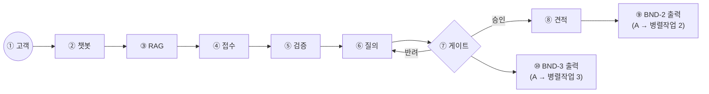

# 병렬작업 1 상세 스펙 — 대화·요구사항·견적 (②~⑧)

> 작성일: 2026-09-21 / 1차 완성 목표: 2026-09-28
> 전제: [ARCHITECTURE.md](ARCHITECTURE.md)의 전체 그림·번호 체계, [INTEGRATION_STRATEGY.md](INTEGRATION_STRATEGY.md)의 경계(BND) 계약을 따른다
> 성격: 병렬작업 1가 이 문서 하나만 보고 자기 파트를 처음부터 끝까지 구현할 수 있도록 만든 상세 스펙

## 목차

- [0. 개요](#0-개요)
- [0.1 용어](#01-용어)
- [1. 담당 범위와 경계](#1-담당-범위와-경계)
- [2. ② 챗봇 게이트웨이](#2--챗봇-게이트웨이)
- [3. ③ RAG 사전확인](#3--rag-사전확인)
- [4. ④⑤ 요구사항 접수·검증](#4--요구사항-접수검증)
- [5. ⑥ 질의: 옵션 3개 + 추천](#5--질의-옵션-3개--추천)
- [6. ⑦ 승인 게이트](#6--승인-게이트)
- [7. ⑧ 견적 산정 + 근거](#7--견적-산정--근거)
- [8. 데이터 모델](#8-데이터-모델)
- [9. 에러 처리](#9-에러-처리)
- [10. 테스트 체크리스트](#10-테스트-체크리스트)
- [11. 일정](#11-일정)

## 0. 개요

병렬작업 1는 파이프라인의 **시작점**이다. 고객 채팅을 처음 받는 곳도, RAG로 기존 프로젝트를 확인하는 곳도, 요구사항을 검증·질의·승인받는 곳도, 견적을 만드는 곳도 모두 A다. B와 C는 A가 만들어내는 출력(BND-2, BND-3)이 있어야 비로소 시작할 수 있으므로, **A의 진행 속도가 곧 프로젝트 전체의 병목**이다([INTEGRATION_STRATEGY.md §2](INTEGRATION_STRATEGY.md#2-작업자별-통합-전략) 참고). 품질보다 "무엇이든 먼저 산출하는 것"이 D0~D1의 최우선 목표다.

## 0.1 용어

프로젝트 공통 용어는 [ARCHITECTURE.md §0.1](ARCHITECTURE.md#01-용어-이-문서-한정)/[§0.2](ARCHITECTURE.md#02-배경지식-에이전트nimhermes를-처음-접하는-사람을-위한-설명)를 본다. reqpipe의 요구사항 수집·게이트·RAG 개념을 그대로 재사용하므로, 더 상세한 정의는 [docs/reqpipe/02_REQUIREMENTS.md](../reqpipe/02_REQUIREMENTS.md)(특히 G02 요구수집, G03 질문, G08 게이트, G18 RAG)를 본다. 이 문서에서만 쓰는 용어:

| 용어 | 뜻 |
|---|---|
| 유사도 임계값 | RAG 검색 결과를 "기존 프로젝트로 볼지" 판단하는 기준점 (예: 0.8 이상이면 기존 프로젝트로 간주) |
| 고정 응답(Stub Response) | D0~D1에 실제 로직 대신 미리 정해둔 값을 돌려주는 최소 구현 (예: RAG가 항상 "기존 요구 없음"만 응답) |
| 반려 루프 | ⑦ 게이트에서 고객이 승인하지 않았을 때 ⑥ 질의로 되돌아가는 순환 경로 |

## 1. 담당 범위와 경계



| 번호 | 노드 | 설명 |
|---|---|---|
| ① | 고객 | 채팅으로 요구사항을 전달하는 외부 사용자 |
| ② | 챗봇 게이트웨이 | 모든 대화 입력이 들어오는 창구 |
| ③ | RAG 사전확인 | 접수 전에 기존 프로젝트와 겹치는지 검색 |
| ④ | 요구사항 접수 | 채팅을 구조화된 요구사항으로 정리 |
| ⑤ | 요구사항 검증 | 모호하거나 빠진 항목을 찾아냄 |
| ⑥ | 질의 | 애매한 항목을 옵션 3개+추천으로 되물음 |
| ⑦ | 승인 게이트 | 고객이 채팅으로 반드시 확인해야 통과하는 필수 지점 |
| ⑧ | 견적 산정 | 승인된 요구로 견적+근거를 만든다 |
| ⑨ | BND-2 출력 | 견적 완료 후 병렬작업 2에게 전달 |
| ⑩ | BND-3 출력 | 게이트 승인과 동시에(⑨와 별개로) 병렬작업 3에게 전달 |

**입력**: 고객 채팅(①) 외에는 외부 의존이 없다 — A는 파이프라인의 시작점이므로 아무도 기다리지 않는다.

**출력 계약** (전체 스키마는 [INTEGRATION_STRATEGY.md §1](INTEGRATION_STRATEGY.md#1-계약-우선-원칙--경계boundary-정의)):
- BND-2 (A → 병렬작업 2): `{ requirement_id, platform: "web"|"android", features: [...], quote: {amount, basis} }`
- BND-3 (A → 병렬작업 3): `{ requirement_id, confirmed_items: [...], platform, acceptance_criteria: [...] }`
- BND-1 (A 내부, ⑦→⑧): `{ requirement_id, confirmed_items: [...], customer_id }`
- BND-8 (A 내부, RAG 검색): `{ query, top_k }` → `{ chunks: [{text, source, score}] }`

**규칙**: BND-2와 BND-3는 **동일한 `requirement_id`로 동시에** 나가야 한다(B와 C가 같은 요구를 다루고 있음을 보장). 그리고 BND-3는 **게이트 승인 없이는 절대 발화되지 않는다** — 이는 요구 6)("채팅은 반드시 고객에게 확인되어야 하는 정보")을 구조적으로 강제하는 지점이므로, 코드 리뷰에서 가장 먼저 확인해야 할 항목이다.

## 2. ② 챗봇 게이트웨이

- 고객 채팅을 받는 단일 창구. NIM 챗 엔드포인트(Nemotron 3 Super)를 호출해 자연어 요청을 이해한다.
- 참조 리포([hackathon-agent-chatbot](https://github.com/kyungsikjeung/hackathon-agent-chatbot))의 `backend.py` 구조(CORS 처리 + RAG 조회 후 Hermes로 전달)를 초기 골격으로 재사용할 수 있다 — 단, 토이 프로젝트라 상시 배포가 아니었다는 점은 [RENDER_DEPLOY.md](deployment/RENDER_DEPLOY.md)로 보완한다.
- **개발 순서**: D0에 계약 스키마 확정 → D+1에 고정 응답 버전 → D+2에 실제 NIM 연결.

## 3. ③ RAG 사전확인

- 요구사항 접수(④) 전에 **항상 먼저** 실행된다 — 요구 4)("고객이 전달한 요구사항 받기 전 래그를 통해, 기존 프로젝트 요구사항이 있었는지 확인")를 그대로 반영.
- **인덱스 대상**: `docs/reqpipe/02_REQUIREMENTS.md`(정본 요구사항)와 `docs/reqpipe/03_SPEC.md`([ARCHITECTURE.md §6](ARCHITECTURE.md#6-확정된-결정-사항) 결정). NIM 임베딩(`nemotron-3-embed-1b`)으로 섹션 단위 청크 색인.
- **분기 로직**: 검색 결과 유사도가 임계값 이상이면 "기존 프로젝트 확장" 시나리오로 분기해, ⑥ 질의에서 "기존 확장 vs 신규 구축 vs 마이그레이션" 3안+추천으로 고객에게 되묻는다 (README [시나리오 2](ARCHITECTURE.md#2-요구사항-처리-파이프라인-상세-시퀀스) 참고). 유사도가 낮으면 곧바로 신규 건으로 ④ 접수를 진행한다.
- **개발 순서**: D0~D1에는 "항상 신규 요구"로 고정 응답 → D+2에 SRS.md/SPEC.md 실색인 연결.

## 4. ④⑤ 요구사항 접수·검증

- **접수(④)**: 채팅 내용을 `confirmed_items`(구조화된 항목 목록)로 정리. reqpipe의 슬롯(SlotValue) 개념을 재사용해, 필드명을 하드코딩하지 않고 `required`/`risk` 속성이 있는 dict 구조로 관리한다([docs/reqpipe/02_REQUIREMENTS.md G02](../reqpipe/02_REQUIREMENTS.md#그룹-2-요구-수집슬롯증거-g02) 참고).
- **검증(⑤)**: 필수 항목 누락, 상충되는 요구, 범위가 불명확한 표현("관리자 페이지도 있었으면")을 규칙 기반으로 먼저 걸러내고, 애매한 경우만 ⑥ 질의로 넘긴다(전부 LLM 판단에 맡기지 않는다 — reqpipe의 "LLM 판정 금지, 결정적 규칙 우선" 원칙 재사용).
- **개발 순서**: D0~D1에는 규칙 1개(필수 필드 존재 여부)만 → D+3에 검증 규칙 확장.

## 5. ⑥ 질의: 옵션 3개 + 추천

- 애매한 항목마다 **옵션 3개 + 추천 1개**를 만들어 고객에게 되묻는다(요구 3 핵심). 자유 서술형 질문을 하지 않는 것이 원칙 — 고객이 선택만 하면 되게 만들어 응답 마찰을 줄인다.
- 추천 로직: 가장 일반적인 선택지를 NIM으로 추천하되, 최종 선택은 항상 고객이 한다(AI가 임의로 확정하지 않음).
- 반려 루프: ⑦ 게이트에서 고객이 승인하지 않으면 다시 ⑥으로 돌아온다(README [시나리오 3](ARCHITECTURE.md#2-요구사항-처리-파이프라인-상세-시퀀스) 참고).

## 6. ⑦ 승인 게이트

- **가장 중요한 규칙**: 고객이 채팅으로 명시적으로 확인해야만 통과한다 — 건너뛸 수 없다(요구 6). 자동 승인·타임아웃 승인 같은 우회 경로를 두지 않는다.
- 게이트 통과 시점에 BND-2(→B)와 BND-3(→C)가 **동시에** 발화된다. 이 동시성은 코드에서 단일 트랜잭션/이벤트로 구현해, 한쪽만 나가는 상황(B는 받았는데 C는 못 받은 경우 등)이 생기지 않게 한다.
- **개발 순서**: D0~D1에는 "무조건 자동 통과"(가짜) → D+4에 실제로 카카오링크를 통해 고객 확인을 받는 버전으로 교체.

## 7. ⑧ 견적 산정 + 근거

- 승인된 요구사항(`confirmed_items`)을 항목별 공수/난이도로 매핑해 견적 금액과 근거 문구를 만든다. 근거는 반드시 사람이 읽고 납득할 수 있는 형태(예: "화면 4개 x 표준단가 + 결제연동 가산")로 만든다(요구 6, 근거 있는 견적).
- 출력은 BND-2로 병렬작업 2에게 넘어가 시안 페이지에 노출된다([PARALLEL_2_SPEC.md §3](PARALLEL_2_SPEC.md#3--시안-확인-링크-페이지) 참고) — A는 견적을 "만들기"까지만 하고, 고객에게 보여주는 화면은 B가 만든다.

## 8. 데이터 모델

```json
// contracts/examples/gate_to_quote.example.json (BND-1, 내부)
{
  "requirement_id": "req_20260921_001",
  "confirmed_items": ["로그인", "상품목록", "장바구니", "결제"],
  "customer_id": "cust_kakao_abc123"
}
```

```json
// contracts/examples/quote_to_design.example.json (BND-2, A → B)
{
  "requirement_id": "req_20260921_001",
  "platform": "web",
  "features": ["로그인", "상품목록", "장바구니", "결제"],
  "quote": { "amount": 3500000, "basis": "화면 4개 x 표준단가 + 결제연동 가산" }
}
```

```json
// contracts/examples/gate_to_spec.example.json (BND-3, A → C)
{
  "requirement_id": "req_20260921_001",
  "confirmed_items": ["로그인", "상품목록", "장바구니", "결제"],
  "platform": "web",
  "acceptance_criteria": ["회원가입 후 로그인 가능", "장바구니에 상품 담고 결제까지 완료 가능"]
}
```

## 9. 에러 처리

| 상황 | 처리 |
|---|---|
| RAG 검색 실패(인덱스 조회 오류) | 검색 실패가 전체 대화를 막지 않도록 best-effort로 처리하고, 근거 없이 "신규 건"으로 가정하지 않는다 — 실패 시 사람에게 알리고 재시도 |
| 고객이 게이트 확인에 끝까지 응답하지 않음 | reqpipe의 에스컬레이션 개념([docs/reqpipe/02_REQUIREMENTS.md G12](../reqpipe/02_REQUIREMENTS.md#그룹-12-타이머에스컬레이션알림-g12)) 재사용 — 일정 시간 후 담당자에게 알림 |
| 질의 응답이 옵션 3개 중 어디에도 해당하지 않음(자유 서술) | 다시 옵션 3개+추천으로 재질문. 자유 서술을 그대로 확정안에 반영하지 않는다 |

## 10. 테스트 체크리스트

- [ ] 고정 응답만으로 BND-1/2/3가 스키마를 만족하는가 (D+1 워킹 스켈레톤)
- [ ] BND-2와 BND-3가 항상 동일한 `requirement_id`로, 게이트 승인 시점에만 동시에 나가는가 (D+2~D+3)
- [ ] RAG가 기존 프로젝트를 발견했을 때 질의(⑥)로 올바르게 분기하는가 (D+2)
- [ ] 게이트에서 고객 확인 없이는 절대 BND-3가 발화되지 않는가 (요구 6 위반 방지, 매 통합 체크마다 재확인)

## 11. 일정

일자별 상세 작업은 [INTEGRATION_STRATEGY.md §3](INTEGRATION_STRATEGY.md#3-상세-마일스톤-d0d7)의 "병렬작업 1" 열을 따른다.
