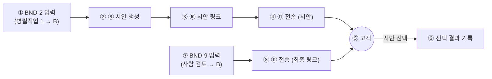

# 병렬작업 2 상세 스펙 — 디자인·전달 (⑨~⑪)

> 작성일: 2026-09-21 / 1차 완성 목표: 2026-09-28
> 전제: [ARCHITECTURE.md](ARCHITECTURE.md)의 전체 그림·번호 체계, [INTEGRATION_STRATEGY.md](INTEGRATION_STRATEGY.md)의 경계(BND) 계약을 따른다
> 성격: 병렬작업 2가 이 문서 하나만 보고 자기 파트를 처음부터 끝까지 구현할 수 있도록 만든 상세 스펙

## 목차

- [0. 개요](#0-개요)
- [0.1 용어](#01-용어)
- [1. 담당 범위와 경계](#1-담당-범위와-경계)
- [2. ⑨ UI 시안 생성기](#2--ui-시안-생성기)
- [3. ⑩ 시안 확인 링크 페이지](#3--시안-확인-링크-페이지)
- [4. ⑪ 카카오링크 전송 서비스](#4--카카오링크-전송-서비스)
- [5. 데이터 모델](#5-데이터-모델)
- [6. 에러 처리](#6-에러-처리)
- [7. 테스트 체크리스트](#7-테스트-체크리스트)
- [8. 일정](#8-일정)

## 0. 개요

병렬작업 2는 "승인된 요구사항 + 견적"을 받아서 고객이 실제로 만질 수 있는 두 가지 산출물(UI 시안, 최종 배포 링크)을 만들고, 그것을 카카오링크로 고객에게 전달하는 파트를 담당한다. 견적 자체는 병렬작업 1가 만들지만, 견적 근거를 시안 페이지에 보기 좋게 노출하는 것까지는 B의 몫이다. 전체 파이프라인에서 B는 "안 보이는 처리"가 아니라 "고객이 직접 보는 화면"을 만드는 유일한 파트이므로, 기능보다 완성도(디자인 품질, 메시지 문구)가 평가에서 특히 중요하다.

## 0.1 용어

프로젝트 공통 용어는 [ARCHITECTURE.md §0.1](ARCHITECTURE.md#01-용어-이-문서-한정)/[§0.2](ARCHITECTURE.md#02-배경지식-에이전트nimhermes를-처음-접하는-사람을-위한-설명)를 본다. 이 문서에서만 쓰는 용어:

| 용어 | 뜻 |
|---|---|
| 시안 변형(Design Variant) | 같은 요구사항으로 만든 서로 다른 디자인 후보 1개 (색상/레이아웃 조합이 다름) |
| 헤드리스 브라우저 스크린샷 | 실제 브라우저를 화면 없이 띄워 렌더링 결과를 이미지 파일로 저장하는 것. 카카오링크 미리보기 이미지에 사용 |
| 전송 순서(Delivery Order) | 시안 링크(⑩)가 먼저, 최종 배포 링크(⑪, 사람 검토 통과 후)가 나중에 가는 순서. 뒤바뀌면 안 됨 |

## 1. 담당 범위와 경계



| 번호 | 노드 | 설명 |
|---|---|---|
| ① | BND-2 입력 | 병렬작업 1의 견적 산정 완료 후, `{ requirement_id, platform, features, quote }`를 받는다 |
| ② | 시안 생성 | 입력을 바탕으로 커스텀 템플릿 N종을 렌더링 |
| ③ | 시안 링크 | 시안들을 볼 수 있는 웹 페이지를 만든다 |
| ④ | 전송(시안) | 시안 링크를 카카오링크로 고객에게 보낸다 |
| ⑤ | 고객 | 시안을 보고 하나를 선택 |
| ⑥ | 선택 결과 기록 | 고객이 고른 시안을 기록해둔다 (병렬작업 3의 코드생성 참고용) |
| ⑦ | BND-9 입력 | 사람 최종 검토가 승인(`approved`)한 배포 URL만 받는다 — 반려된 것은 절대 받지 않음 |
| ⑧ | 전송(최종 링크) | 실제 접속 가능한 배포 링크를 카카오링크로 고객에게 보낸다 |

**입력 계약** (전체 스키마는 [INTEGRATION_STRATEGY.md §1](INTEGRATION_STRATEGY.md#1-계약-우선-원칙--경계boundary-정의) 참고):
- BND-2 (병렬작업 1 → B): `{ requirement_id, platform: "web"|"android", features: [...], quote: {amount, basis} }`
- BND-9 (사람 최종 검토 → B): `{ requirement_id, review_status: "approved"|"rejected", deploy_url? }` — `approved`이고 `deploy_url`이 있을 때만 ⑧을 실행한다

**출력**: B는 아무에게도 출력을 넘기지 않는다 — B의 출력은 항상 고객(카카오톡)에게 직접 나간다. 이것이 B가 "파이프라인의 끝"인 이유다.

## 2. ⑨ UI 시안 생성기

- **입력 파라미터**: `platform`(web/android), `features`(핵심 기능 목록), 색상 프리셋(3~5종 고정 팔레트 중 요구사항 톤에 맞춰 선택 — 처음엔 규칙 기반 매핑으로 시작, 여유 있으면 NIM으로 문구·톤 추천).
- **렌더링 방식**: 정적 HTML/CSS 템플릿(`templates/variant-1.html` 등) N종을 준비해두고, `features` 목록을 각 템플릿의 섹션에 채워 넣는 방식. Figma API를 쓰지 않는다([ARCHITECTURE.md §6](ARCHITECTURE.md#6-확정된-결정-사항) 결정 재확인).
- **미리보기 이미지**: 렌더링된 HTML을 헤드리스 브라우저(예: Playwright)로 스크린샷 찍어 카카오링크 미리보기 이미지로 사용.
- **개발 순서**: D0~D1에는 템플릿 1종 고정 렌더링 → D+3~D+4에 N종으로 확장 → D+4에 헤드리스 브라우저 스크린샷 연결.

## 3. ⑩ 시안 확인 링크 페이지

- 고객이 접속했을 때 시안 N종을 나란히 보여주고, 하나를 선택하면 그 결과가 서버에 기록되는 간단한 웹 페이지.
- 시안 옆에 견적 근거(BND-2의 `quote.basis`)를 함께 노출해, 고객이 "왜 이 가격인지"도 같은 화면에서 확인할 수 있게 한다(요구 6 지원).
- 정적 페이지 + 최소한의 서버 엔드포인트(선택 결과 저장) 정도로 충분 — 병렬작업 3의 배포 파이프라인과는 별개로, B가 직접 가벼운 정적 호스팅(Netlify 등)에 올려도 된다.

## 4. ⑪ 카카오링크 전송 서비스

- **연동 대상**: 카카오 디벨로퍼스에서 발급한 카카오링크 API (또는 카카오톡 공유 URL 스킴).
- **리스크 등급**: 최우선([INTEGRATION_STRATEGY.md §5](INTEGRATION_STRATEGY.md#5-리스크-및-폴백) 1순위 리스크) — 참조 리포([hackathon-agent-chatbot](https://github.com/kyungsikjeung/hackathon-agent-chatbot))에서도 미착수였던 부분이라 D+2에 가장 먼저 실연동을 검증해야 한다.
- **메시지 2종**:
  1. 시안 안내 메시지: "시안이 준비됐어요! 마음에 드는 디자인을 골라주세요 👉 {시안링크}"
  2. 최종 완료 메시지(⑧, BND-9 승인 후에만 발송): "완성됐습니다! 지금 바로 확인해보세요 👉 {배포링크}"
- **전송 순서 보장**: 메시지 2가 메시지 1보다 먼저 나가면 안 된다(고객이 아직 시안도 못 본 상태에서 완성 메시지를 받는 모순). `requirement_id`별로 전송 상태 머신(시안전송완료 → 배포전송가능)을 두어 순서를 강제한다.
- **폴백**: D+3까지 카카오링크가 안 되면 이메일/SMS로 임시 대체([INTEGRATION_STRATEGY.md §5](INTEGRATION_STRATEGY.md#5-리스크-및-폴백) 참고).

## 5. 데이터 모델

```json
// contracts/examples/quote_to_design.example.json (BND-2)
{
  "requirement_id": "req_20260921_001",
  "platform": "web",
  "features": ["로그인", "상품목록", "장바구니", "결제"],
  "quote": { "amount": 3500000, "basis": "화면 4개 x 표준단가 + 결제연동 가산" }
}
```

```json
// contracts/examples/review_to_deliver.example.json (BND-9)
{
  "requirement_id": "req_20260921_001",
  "review_status": "approved",
  "deploy_url": "https://agt001-demo.onrender.com",
  "reviewer": "병렬작업 3",
  "checked_at": "2026-09-27T10:00:00+09:00"
}
```

## 6. 에러 처리

| 상황 | 처리 |
|---|---|
| BND-9가 `rejected`로 옴 | 아무것도 전송하지 않는다. 고객에게 아무 메시지도 가지 않는 것이 정상 동작(병렬작업 3가 재작업 중이라는 뜻) |
| 카카오링크 API 호출 실패 | 3회 재시도 후에도 실패하면 작업자 내부 알림(콘솔/슬랙 등)으로 담당자에게 알리고, 사람이 수동 발송 |
| 시안 렌더링 실패(템플릿 오류 등) | 고정 템플릿 1종(폴백)으로라도 반드시 시안이 나가게 한다 — "시안이 아예 안 옴"은 최악의 실패 |

## 7. 테스트 체크리스트

- [ ] BND-2 예시 JSON만으로 시안 페이지가 끝까지 렌더링되는가 (D+1 워킹 스켈레톤)
- [ ] 카카오링크 메시지 2종이 실제 카카오톡에 순서대로 도착하는가 (D+2)
- [ ] BND-9가 `rejected`일 때 전송이 절대 일어나지 않는가 (D+4~D+5)
- [ ] 시안 페이지에 견적 근거가 정상적으로 노출되는가

## 8. 일정

일자별 상세 작업은 [INTEGRATION_STRATEGY.md §3](INTEGRATION_STRATEGY.md#3-상세-마일스톤-d0d7)의 "병렬작업 2" 열을 따른다.
