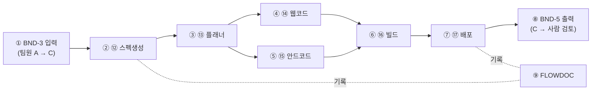

# 팀원 C 상세 스펙 — 코드 생성·배포 (⑫~⑰)

> 작성일: 2026-09-21 / 제출 기한: 2026-09-28
> 전제: [ARCHITECTURE.md](ARCHITECTURE.md)의 전체 그림·번호 체계, [INTEGRATION_STRATEGY.md](INTEGRATION_STRATEGY.md)의 경계(BND) 계약, [RENDER_DEPLOY.md](deployment/RENDER_DEPLOY.md)의 배포 절차를 따른다
> 성격: 팀원 C가 이 문서 하나만 보고 자기 파트를 처음부터 끝까지 구현할 수 있도록 만든 상세 스펙

## 목차

- [0. 개요](#0-개요)
- [0.1 용어](#01-용어)
- [1. 담당 범위와 경계](#1-담당-범위와-경계)
- [2. ⑫ SRS/스펙 문서 생성 에이전트](#2--srs스펙-문서-생성-에이전트)
- [3. ⑬ Hermes 플래너 에이전트](#3--hermes-플래너-에이전트)
- [4. ⑭⑮ 웹/안드로이드 코드 생성 에이전트](#4--웹안드로이드-코드-생성-에이전트)
- [5. ⑯ 빌드 파이프라인 (백그라운드 워커)](#5--빌드-파이프라인-백그라운드-워커)
- [6. ⑰ 배포 (Render)](#6--배포-render)
- [7. ⑱ 사람 최종 검토로의 인계](#7--사람-최종-검토로의-인계)
- [8. 데이터 모델](#8-데이터-모델)
- [9. 에러 처리 및 재시도](#9-에러-처리-및-재시도)
- [10. FLOWDOC — 에이전트 흐름 검토 산출물](#10-flowdoc--에이전트-흐름-검토-산출물)
- [11. 테스트 체크리스트](#11-테스트-체크리스트)
- [12. 일정](#12-일정)

## 0. 개요

팀원 C는 "승인된 요구사항"을 받아서 실제로 동작하는 코드를 만들고, 빌드하고, 배포까지 끝내는 파트를 담당한다. 3개 파트 중 실행 시간이 가장 길고(코드 생성·빌드), 실패 지점이 가장 많으며(빌드 실패, 배포 실패), 요구 5)("배포된 최종산출물은 동작하는것이어야 한다")가 최종적으로 충족되는지 여부가 이 파트에 달려 있다. 완성도보다 **끊기지 않고 끝까지 도는 것**이 D+1에 가장 중요한 목표다.

## 0.1 용어

프로젝트 공통 용어는 [ARCHITECTURE.md §0.1](ARCHITECTURE.md#01-용어-이-문서-한정)/[§0.2](ARCHITECTURE.md#02-배경지식-에이전트nimhermes를-처음-접하는-사람을-위한-설명)를, 배포·컨테이너 용어는 [RENDER_DEPLOY.md §0.1](deployment/RENDER_DEPLOY.md#01-용어집)을 본다. 이 문서에서만 쓰는 용어:

| 용어 | 뜻 |
|---|---|
| 태스크 분해(Task Decomposition) | 스펙 문서 하나를 "웹 파트 작업"과 "안드로이드 파트 작업"처럼 독립적으로 병렬 처리 가능한 단위로 쪼개는 것 |
| 백그라운드 워커 | 웹 요청-응답과 분리되어 오래 걸리는 작업(빌드)을 처리하는 별도 프로세스. [ARCHITECTURE.md §6-2](ARCHITECTURE.md#6-2-상시-운영환경-제안-신규) 참고 |
| FLOWDOC | 에이전트 간 호출 흐름을 기록한 Mermaid 시퀀스/상태도 산출물. 요구 9)("AI 끼리의 Flow에 대해 검토할 수 있는 산출물")를 충족시키기 위한 것 |

## 1. 담당 범위와 경계



| 번호 | 노드 | 설명 |
|---|---|---|
| ① | BND-3 입력 | 팀원 A의 승인 게이트를 통과한 요구사항을 받는다 |
| ② | 스펙생성 | NIM으로 개발용 SRS/스펙 문서를 만든다 |
| ③ | 플래너 | 스펙을 웹/안드로이드 작업 단위로 쪼갠다 |
| ④⑤ | 코드생성 | 웹/안드로이드 코드를 병렬로 생성한다 |
| ⑥ | 빌드 | 생성된 코드를 컨테이너로 빌드한다 (백그라운드 워커) |
| ⑦ | 배포 | Render에 배포한다 |
| ⑧ | BND-5 출력 | 배포 결과(`status`, `deploy_url`)를 **팀원 B가 아니라 사람 최종 검토(⑱)**에게 넘긴다 |
| ⑨ | FLOWDOC | 스펙생성·플래너 단계에서 에이전트 흐름을 계속 기록해 산출물로 남긴다 |

**입력 계약**: BND-3 (팀원 A → C): `{ requirement_id, confirmed_items: [...], platform, acceptance_criteria: [...] }`

**출력 계약**: BND-5 (C → 사람 검토): `{ requirement_id, deploy_url, status: "ready"|"failed" }` — **팀원 B에게 직접 보내지 않는다.** 이는 [INTEGRATION_STRATEGY.md §1 BND-9 규칙](INTEGRATION_STRATEGY.md#1-계약-우선-원칙--경계boundary-정의)에 따라 구조적으로 강제된다(B는 BND-9만 구독하고 BND-5는 구독하지 않음).

## 2. ⑫ SRS/스펙 문서 생성 에이전트

- 입력받은 `confirmed_items`와 `acceptance_criteria`를 NIM에 넣어, 개발자(또는 다음 단계 AI 에이전트)가 바로 코드로 옮길 수 있는 스펙 문서를 만든다. `docs/reqpipe/03_SPEC.md`의 구조(API/데이터모델/상태흐름 절)를 프롬프트 템플릿으로 재사용할 수 있다.
- 출력: `spec_doc_url` + `tasks: [...]` (BND-6로 플래너에게 전달).

## 3. ⑬ Hermes 플래너 에이전트

- Hermes/NemoClaw 프레임워크 위에서, 스펙 문서를 "웹 만들기"/"안드로이드 만들기" 두 개의 독립 태스크로 분해한다.
- 태스크 분해 규칙: 화면 단위로 쪼개지 않고 **플랫폼 단위**로만 쪼갠다(웹/안드로이드 2갈래) — 해커톤 기간 내 조율 비용을 줄이기 위한 의도적 단순화.
- 코드생성 에이전트(⑭⑮)에게 태스크를 할당하고, 결과(코드/빌드 성공 여부)를 받아 다음 단계(⑯)로 넘긴다.
- 배포 완료 후에는 사람 검토(⑱) 요청도 플래너가 트리거한다([ARCHITECTURE.md §2](ARCHITECTURE.md#2-요구사항-처리-파이프라인-상세-시퀀스) 20번 단계).

## 4. ⑭⑮ 웹/안드로이드 코드 생성 에이전트

- **웹**: 표준 웹 스택(React 계열 권장 — B/C가 스택을 공유하면 프롬프트/템플릿 재사용 가능).
- **안드로이드**: **React Native** (크로스플랫폼, [ARCHITECTURE.md §6](ARCHITECTURE.md#6-확정된-결정-사항) 결정 재확인) — 웹과 동일 언어(JS/TS)라 코드생성 프롬프트를 상당 부분 재사용 가능.
- **개발 순서**: D0~D1에는 "Hello World" 수준 정적 스캐폴드로 배포 파이프라인 자체를 먼저 검증 → D+3에 요구사항 기반 실제 생성 프롬프트 작성 → D+4에 웹/안드 병렬 생성 + 재시도 로직.
- **프롬프트에 반드시 포함**: 경계 스키마(BND-3의 `acceptance_criteria`)를 그대로 포함시켜, 생성된 코드가 인수조건을 벗어나지 않게 한다.

## 5. ⑯ 빌드 파이프라인 (백그라운드 워커)

- 코드 생성·빌드는 팀에서 가장 오래 걸리는 작업이므로, 웹 요청-응답 흐름과 분리된 **별도 백그라운드 워커** 프로세스에서 처리한다([ARCHITECTURE.md §6-2](ARCHITECTURE.md#6-2-상시-운영환경-제안-신규) 권장안 A 참고). 웹 서버와 섞으면 Render의 요청 타임아웃에 걸릴 위험이 있다.
- Dockerfile로 컨테이너 빌드 → 실패 시 1회 자동 재시도 → 재시도도 실패하면 `status: "failed"`를 즉시 BND-5로 내보낸다(성공한 척하지 않는다 — README [시나리오 4](ARCHITECTURE.md#2-요구사항-처리-파이프라인-상세-시퀀스) 참고).

## 6. ⑰ 배포 (Render)

- 배포 절차·환경변수·헬스체크·콜드스타트 대응은 전부 [deployment/RENDER_DEPLOY.md](deployment/RENDER_DEPLOY.md)를 따른다 — 이 문서에서 반복하지 않는다.
- 배포가 성공하면 `deploy_url`과 `status: "ready"`를 BND-5로 내보낸다.

## 7. ⑱ 사람 최종 검토로의 인계

- C는 배포가 끝나면 **자동으로 고객에게 링크를 보내지 않는다.** 반드시 BND-5를 통해 사람 최종 검토자(팀원 A/B/C 순번제)에게 먼저 넘긴다.
- 검토자가 반려하면(BND-9 `rejected`), 플래너가 C의 빌드 단계로 재작업을 지시한다 — 이 재작업 루프를 D+4~D+5에 최소 1회 실제로 발생시켜 테스트해야 한다.
- 검토 절차 자체(체크리스트, 순번)는 팀원 C만의 책임이 아니라 전체 공동 책임이다. 상세는 [INTEGRATION_STRATEGY.md §2 "사람 최종 검토"](INTEGRATION_STRATEGY.md#2-팀원별-통합-전략)를 본다.

## 8. 데이터 모델

```json
// contracts/examples/gate_to_spec.example.json (BND-3)
{
  "requirement_id": "req_20260921_001",
  "confirmed_items": ["로그인", "상품목록", "장바구니", "결제"],
  "platform": "web",
  "acceptance_criteria": ["회원가입 후 로그인 가능", "장바구니에 상품 담고 결제까지 완료 가능"]
}
```

```json
// contracts/examples/deploy_to_review.example.json (BND-5)
{
  "requirement_id": "req_20260921_001",
  "deploy_url": "https://agt001-demo.onrender.com",
  "status": "ready"
}
```

## 9. 에러 처리 및 재시도

| 상황 | 처리 |
|---|---|
| 코드 생성 결과가 컴파일/빌드 안 됨 | 1회 자동 재시도 → 실패 시 `status: "failed"` 즉시 전파 (§5) |
| Render 배포 자체가 실패 | 마찬가지로 `status: "failed"` 전파, 사람 검토 단계까지 도달하지 않음 |
| 사람 검토가 반려 | 플래너가 재작업 지시, ⑯부터 다시 시작 (§7) |
| Hermes/NemoClaw 로컬 의존성 문제 | [RENDER_DEPLOY.md](deployment/RENDER_DEPLOY.md)의 Docker 기반 동일 개발환경으로 우회 |

## 10. FLOWDOC — 에이전트 흐름 검토 산출물

요구 9)("AI 끼리의 Flow에 대해 검토할 수 있는 산출물")를 충족하기 위해, ⑫스펙생성과 ⑬플래너 단계에서 실제 호출 흐름을 Mermaid 시퀀스/상태도로 계속 기록한다. [ARCHITECTURE.md §2](ARCHITECTURE.md#2-요구사항-처리-파이프라인-상세-시퀀스)의 시퀀스 다이어그램이 그 초기 형태이며, 실제 실행 로그를 반영해 D+5에 갱신본을 산출물로 제출한다.

## 11. 테스트 체크리스트

- [ ] BND-3 예시 JSON만으로 정적 스캐폴드가 끝까지 배포되는가 (D+1 워킹 스켈레톤)
- [ ] 빌드가 별도 백그라운드 워커에서 처리되어 웹 요청과 섞이지 않는가 (D+2)
- [ ] 빌드 실패 시 `status: "failed"`가 정확히 전파되는가 (D+3~D+4)
- [ ] 사람 검토 반려(BND-9 `rejected`) 시 실제로 재작업 루프가 도는가 (D+4~D+5)
- [ ] Render 콜드스타트 워밍업이 발표 전 정상 동작하는가 ([RENDER_DEPLOY.md §3-6](deployment/RENDER_DEPLOY.md#3-6-발표심사-전-워밍업-절차-콜드스타트-감수-전략의-핵심))

## 12. 일정

일자별 상세 작업은 [INTEGRATION_STRATEGY.md §3](INTEGRATION_STRATEGY.md#3-상세-마일스톤-d0d7)의 "팀원 C" 열을 따른다.
