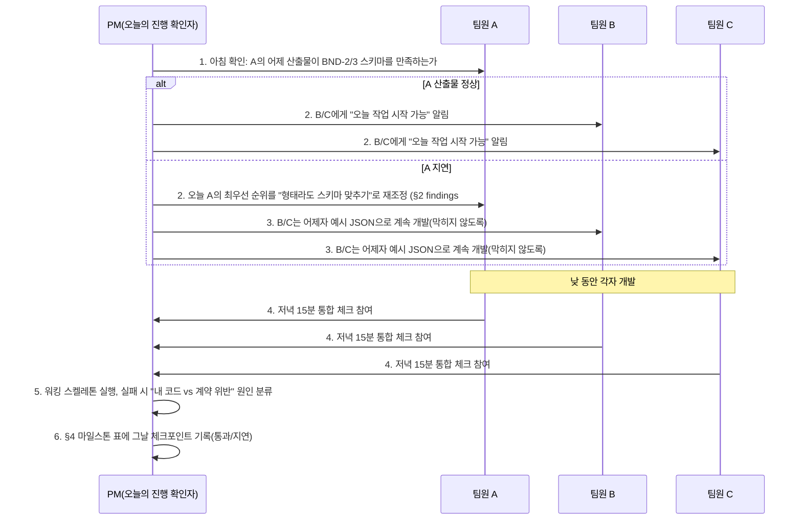

# PM 오케스트레이션 플랜 — 병목/에러 점검 및 실행 절차

> 작성일: 2026-09-21 / 제출 기한: 2026-09-28
> 성격: **PM 관점에서 기존 문서 전체를 감사(audit)한 결과 + 그것을 바탕으로 한 실행 절차.** 계획 자체(무엇을 만들지)는 [REQUIREMENTS.md](REQUIREMENTS.md)·[ARCHITECTURE.md](ARCHITECTURE.md)·[INTEGRATION_STRATEGY.md](INTEGRATION_STRATEGY.md)가 정본이고, 이 문서는 "그 계획이 실제로 에러 없이 돌아가게 만드는 관리 절차"를 다룬다.
> 읽기 순서: 이 문서 → 매일 아침 [§3 오케스트레이션 절차](#3-오케스트레이션-절차)의 "오늘 할 일" 확인 → 저녁 [§4 마일스톤](#4-마일스톤-pm-체크포인트-포함)의 그날 체크포인트로 마감

## 목차

- [0. PM으로서의 판단](#0-pm으로서의-판단)
- [1. 감사 방법](#1-감사-방법)
- [2. 발견한 병목·에러 포인트](#2-발견한-병목에러-포인트)
- [3. 오케스트레이션 절차](#3-오케스트레이션-절차)
- [4. 마일스톤 (PM 체크포인트 포함)](#4-마일스톤-pm-체크포인트-포함)
- [5. 인터페이스 규약 거버넌스](#5-인터페이스-규약-거버넌스)
- [6. 리스크 대장](#6-리스크-대장)

## 0. PM으로서의 판단

지금까지 나온 문서(ARCHITECTURE, INTEGRATION_STRATEGY, REQUIREMENTS, TEAM_A/B/C_SPEC, RENDER_DEPLOY)는 **설계 품질은 이미 높다** — 계약(BND)이 정의돼 있고, 팀원별 경계가 명확하며, 실패 경로도 시나리오로 그려져 있다. 문제는 설계가 아니라 **"문서에는 있는데 실제로는 없는 것"**이었다. 이 문서를 실제로 열어보고, 참조하는 파일이 진짜 존재하는지, 설명이 빠짐없이 이어지는지를 하나씩 확인했다. 그 결과 발견한 4가지를 이번에 직접 해결했고(§2), 나머지는 실행 절차(§3~§5)로 관리한다.

## 1. 감사 방법

문서 내용을 다시 요약하지 않고, **문서가 참조하는 것이 실제로 존재하는지**를 명령으로 직접 확인했다.

```bash
ls contracts/                                  # 여러 문서가 반복 참조하는 디렉터리가 실제로 있는가
grep -c "워커\|worker" docs/hackathon/deployment/RENDER_DEPLOY.md   # 백그라운드 워커 배포 방법이 실제로 적혀있는가
grep -n "월요일\|담당자:" docs/hackathon/*.md   # "순번표"가 실제 이름/요일로 존재하는가
ls .env.example docker-compose.yml              # REQ-ENV-001(동일 개발환경) 산출물이 실제로 있는가
```

## 2. 발견한 병목·에러 포인트

| # | 심각도 | 위치 | 문제 | 왜 병목이 되는가 | 조치(이번에 완료) |
|---|---|---|---|---|---|
| 1 | 🔴 높음 | 전 문서 | `contracts/*.schema.json`, `contracts/examples/*.json`을 8개 문서가 반복 참조하지만 실제 파일이 하나도 없었다 | D0에 "계약에 서명"하기로 했는데 서명할 실물이 없어, 팀원 A/B/C가 각자 다른 가정으로 목업을 만들게 됨 — 가장 먼저 터지는 병목 | `contracts/` 디렉터리에 BND-1~9 스키마 9종 + 예시 JSON 9종(반려 케이스 포함) 생성 |
| 2 | 🔴 높음 | RENDER_DEPLOY.md | ARCHITECTURE §6-2·TEAM_C_SPEC §5가 "빌드는 별도 백그라운드 워커"라고 못박았는데, 배포 가이드에는 워커 배포 방법이 0건 | D+2에 팀원 C가 "워커를 대체 어떻게 Render에 올리는지" 몰라서 막힘 — 설계와 실행 가이드의 싱크가 깨진 전형적 사례 | RENDER_DEPLOY.md §3-8 추가, render.yaml에 Background Worker 서비스 정의 추가 |
| 3 | 🟡 중간 | INTEGRATION_STRATEGY.md, ARCHITECTURE.md, REQUIREMENTS.md | "사람 최종 검토 순번표"가 D+4~D+5에 "확정"하기로 3곳에서 언급되지만, 실제 이름·요일이 들어간 표는 어디에도 없었다 | 발표 당일 "누가 검토하지?"를 그 자리에서 정하면 요구 5)의 마지막 관문에서 지연 발생 | 요일별 1차/2차 검토자 표 초안 추가(자기 작업 자기검토 금지 원칙), D0 아침 실제 이름으로 교체하도록 명시 |
| 4 | 🟡 중간 | 저장소 전체 | `.env.example`/`docker-compose.yml`이 REQUIREMENTS.md의 REQ-ENV-001 Success Criteria("3명 모두 같은 명령 한 줄로 재현")로 요구되지만 실물이 없었고, `.gitignore`도 아예 없어 `.env`를 실수로 커밋할 위험이 있었다 | 각자 다른 방식으로 로컬 환경을 만들면 "내 컴퓨터에선 됐는데" 문제가 재발하고, 비밀키 유출 위험도 있음 | `.env.example`, `docker-compose.yml`, `.gitignore` 추가 |
| 5 | 🟡 중간 | render.yaml | `docs/deployment/`라는 이전 폴더 구조(재구성 전) 경로가 남아있었다 — README 재구성(§ 이전 세션) 때 문서 본문은 다 고쳤지만 이 템플릿 파일은 빠뜨림 | 이 템플릿을 그대로 복사해 쓰면 Dockerfile 경로를 못 찾아 Render 빌드가 즉시 실패함 | `docs/hackathon/deployment/`로 경로 수정 |
| 6 | 🟢 낮음(구조적, 상시 감시 필요) | 팀원 A 전체 | A는 RAG/접수/검증/질의/게이트/견적을 전부 담당하며 B·C 모두 A의 출력(BND-2/BND-3)을 받아야 시작할 수 있다 | A 진행이 늦어지면 3명 중 2명이 동시에 막히는 구조적 단일 지점(SPOF) | 새 산출물은 없음 — §3의 **매일 아침 A 우선 확인** 절차로 상시 관리 |
| 7 | 🟢 낮음(리스크, 이미 인지됨) | INTEGRATION_STRATEGY §5 | 카카오링크 API가 참조 리포에서도 미착수였던 최우선 리스크 | 이미 §5에 폴백까지 정의돼 있어 추가 조치 불필요, PM 관점에서는 **D+2 저녁에 반드시 상태를 확인**하는 게이트로만 편입 | §4에 명시적 체크포인트로 편입 |

> 6번·7번은 "고칠 파일"이 없는 **구조적 리스크**이므로 §3(절차)과 §6(리스크 대장)으로 관리한다. 나머지 1~5번은 이번에 실물 파일로 해결했다 — 아래에서 새로 생긴 파일 목록을 확인할 수 있다.

**새로 생성된 파일**

```
contracts/
├── gate_to_quote.schema.json       (BND-1)
├── quote_to_design.schema.json     (BND-2)
├── gate_to_spec.schema.json        (BND-3)
├── design_to_link.schema.json      (BND-4)
├── deploy_to_review.schema.json    (BND-5, 팀원C→검토, B로 직접 안 감)
├── spec_to_planner.schema.json     (BND-6)
├── rag_query.schema.json           (BND-8)
├── review_to_deliver.schema.json   (BND-9, approved일 때만 전송 실행)
└── examples/*.example.json         (위 9종 각각의 더미 데이터, 반려 케이스 포함)
.env.example
.gitignore
docker-compose.yml
```

## 3. 오케스트레이션 절차

이미 [INTEGRATION_STRATEGY.md §4](INTEGRATION_STRATEGY.md#4-공통-개발-전략)에 계약 변경 절차·매일 저녁 통합 체크가 정의돼 있다. PM으로서 여기에 **시작점(아침)과 종료점(저녁) 사이의 하루 리듬**을 추가한다.



| # | 설명 |
|---|---|
| 1 | PM이 매일 아침 팀원 A의 산출물(BND-2/BND-3)이 계약을 만족하는지 가장 먼저 확인한다(§2 findings #6, A가 SPOF이므로) |
| 2 | 정상이면 B/C에게 오늘 작업 개시를 알리고, 지연이면 A의 우선순위를 재조정한다 |
| 3 | A가 지연돼도 B/C는 전날 예시 JSON으로 계속 개발해 멈추지 않는다(계약 우선 전략의 핵심 효과) |
| 4~5 | 저녁 15분 통합 체크([INTEGRATION_STRATEGY.md §4](INTEGRATION_STRATEGY.md#4-공통-개발-전략))를 PM이 주관하고, 실패 시 원인을 "내 코드 문제"와 "상대 계약 위반"으로 분리해 그 자리에서 담당을 정한다 |
| 6 | 그날 결과를 마일스톤 표(§4)에 남겨 다음날 아침 확인의 입력으로 삼는다 |

**PM의 3가지 원칙**

1. **매일 아침 A부터 본다** — A가 막히면 팀 전체가 막히므로, PM의 첫 확인 대상은 항상 A다.
2. **계약 위반은 그날 안에 고친다** — 계약(스키마) 문제를 다음날로 넘기면 그 사이 B/C가 잘못된 가정 위에 하루치 코드를 더 쌓는다.
3. **"문서에 적혀있다"와 "실제로 있다"를 구분한다** — §1의 감사 방법을 이후에도 반복한다. 새 문서를 쓸 때마다 그 문서가 참조하는 파일·경로가 실존하는지 커밋 전에 확인한다.

## 4. 마일스톤 (PM 체크포인트 포함)

일자별 팀원 작업 내용은 [INTEGRATION_STRATEGY.md §3](INTEGRATION_STRATEGY.md#3-상세-마일스톤-d0d7)이 정본이다. 여기서는 PM이 그날 저녁 반드시 확인해야 할 **게이트 조건**만 추가로 정리한다 — 아래 조건을 만족 못 하면 다음날로 절대 넘어가지 않고 그 자리에서 원인을 해소한다.

| 일자 | PM 게이트 조건 (이걸 통과해야 다음날 진행) | 관련 발견 |
|---|---|---|
| D0 | `contracts/` 9종 스키마+예시에 3명 모두 실제로 커밋을 확인했다 / `.env.example`·`docker-compose.yml`로 3명 모두 로컬 기동을 1회 성공시켰다 / 검토 순번표를 실제 이름으로 교체했다 | #1, #3, #4 |
| D+1 | 워킹 스켈레톤이 가짜 데이터로 실제로 1회 끝까지 돌았다(로그로 증빙) | — |
| D+2 | 카카오링크 실연동 상태를 확인했다(성공/지연 여부를 명시적으로 판단, 지연이면 폴백 전환 결정) / 팀원 C가 워커 서비스를 Render에 최초 배포했다 | #2, findings #7 |
| D+3 | 3명 모두 실데이터로 엔드투엔드 1회 통과를 증빙했다 | — |
| D+4 | 반려 경로(사람 검토 rejected) 1회를 실제로 재현했다 | — |
| D+5 | 예외 시나리오(요구불명확/빌드실패/검토반려) 3종을 모두 통합 테스트했다 | — |
| D+6 | 전체 리허설에 검토 당번이 실제로 참여했고, 백업 데모 영상을 확보했다 | #3 |
| D+7 | 워밍업 스크립트 실행 확인 후 제출 | — |

## 5. 인터페이스 규약 거버넌스

경계(BND) 스키마 자체의 정의는 [INTEGRATION_STRATEGY.md §1](INTEGRATION_STRATEGY.md#1-계약-우선-원칙--경계boundary-정의)이 정본이며, 실물 파일은 `contracts/`에 있다(§2). PM으로서 이 규약이 살아있는 문서로 유지되도록 아래 거버넌스를 적용한다.

| 규칙 | 내용 |
|---|---|
| 변경 승인 | `contracts/*.schema.json` 변경 PR은 반드시 영향받는 반대편 팀원 1명 이상의 리뷰 승인 필요 (예: BND-2 변경 시 팀원 B 승인 필수) |
| 변경 통지 | 계약 변경 병합 직후 그날 저녁 통합 체크에서 실제로 안 깨졌는지 함께 확인([INTEGRATION_STRATEGY.md §4](INTEGRATION_STRATEGY.md#4-공통-개발-전략)) |
| 예시 파일 동기화 | 스키마를 바꾸면 같은 PR에서 `contracts/examples/*.example.json`도 함께 갱신한다 — 스키마와 예시가 따로 노는 순간 "계약 우선" 전략이 무력화된다 |
| 필수/선택 필드 | `required` 배열에 있는 필드는 팀원 임의로 생략 금지. 새 필드가 필요하면 `additionalProperties: true`인 스키마(BND-1~6, 8)는 우선 자유롭게 추가하고 다음 통합 체크에서 정식 반영, `additionalProperties: false`인 BND-9(사람 검토 결과)는 예외 없이 먼저 스키마 변경 승인을 받는다 |
| 버전 없음, 단일 정본 | 이 프로젝트는 기간이 짧아 계약 버전 관리(v1/v2)를 두지 않는다 — 항상 `contracts/`의 현재 상태가 유일한 정본이다. 과거 버전이 필요하면 git 이력을 본다 |

## 6. 리스크 대장

[INTEGRATION_STRATEGY.md §5](INTEGRATION_STRATEGY.md#5-리스크-및-폴백)의 리스크 표에 이번 감사로 새로 발견한 항목만 추가한다(기존 항목은 중복 기재하지 않음).

| 리스크 | 소유자 | 트리거 시점 | 대응 |
|---|---|---|---|
| 팀원이 `contracts/` 예시 파일을 안 보고 각자 상상으로 목업 데이터를 만든다 | PM | D0 저녁 통합 체크 | 통합 체크 때 "예시 파일 그대로 썼는지" 1분간 확인하는 것을 체크리스트 항목으로 고정 |
| Background Worker가 Web Service와 별도 과금이라는 것을 모르고 무료 한도를 초과한다 | 팀원 C | D+2 | RENDER_DEPLOY.md §3-8에 명시, D+2 통합 체크에서 Render 대시보드 사용량 1회 확인 |
| 검토 순번표가 D0 아침에 실제 이름으로 교체되지 않고 예시 그대로 방치된다 | PM | D0 아침 | §4 D0 게이트 조건에 포함, PM이 직접 확인 후 다음 단계 승인 |
