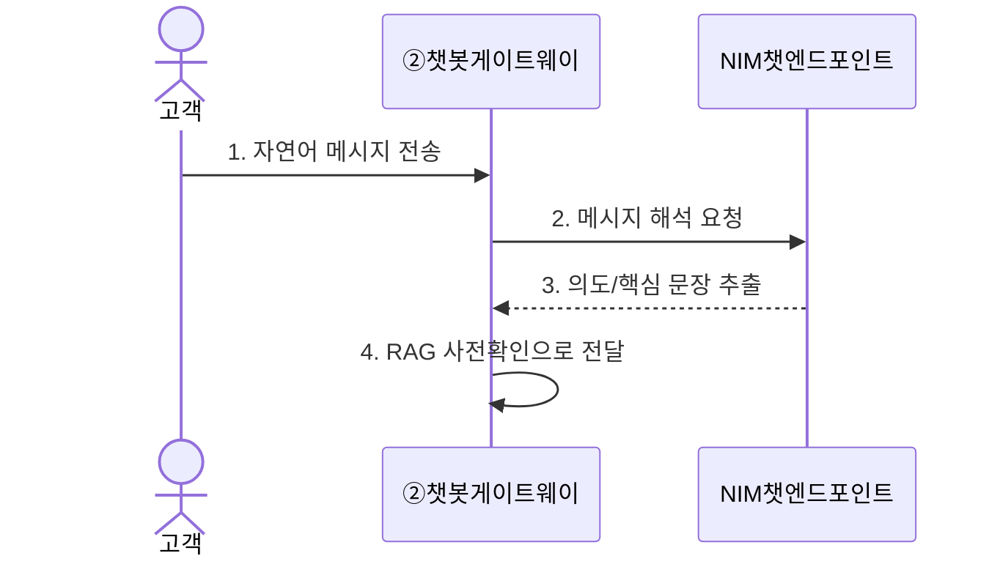
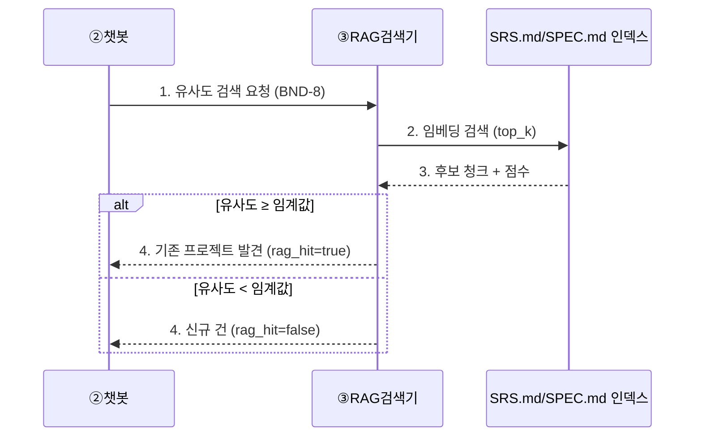
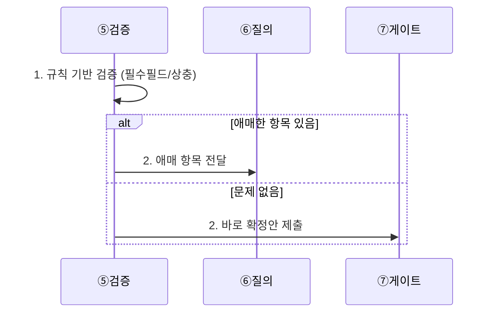

# 요구사항 명세 (REQ 카탈로그)

> 작성일: 2026-09-21 / 제출 기한: 2026-09-28
> 성격: **README(시나리오)와 ARCHITECTURE.md(기술 설계) 사이를 잇는 정본 요구사항 문서.** README는 "어떻게 보이는가"를, 이 문서는 "무엇이 요구사항이고 언제 완료로 볼 것인가"를, ARCHITECTURE.md는 "어떻게 만드는가"를 다룬다.
> 명명법: `REQ-<영역>-<번호>` (reqpipe의 `REQ-G01-001` 표기를 재사용, [docs/reqpipe/02_REQUIREMENTS.md](../reqpipe/02_REQUIREMENTS.md) 참고)

## 목차

- [0. 이 문서를 읽는 법](#0-이-문서를-읽는-법)
- [0.1 용어](#01-용어)
- [1. 요구사항 개요표 (전체 목록)](#1-요구사항-개요표-전체-목록)
- [2. 대화·요구사항 (REQ-CHAT / REQ-RAG / REQ-INTAKE / REQ-VALIDATE / REQ-ASK)](#2-대화요구사항)
- [3. 승인·견적 (REQ-GATE / REQ-QUOTE)](#3-승인견적)
- [4. 디자인·전달 (REQ-DESIGN / REQ-DELIVER)](#4-디자인전달)
- [5. 코드생성·배포 (REQ-CODEGEN / REQ-BUILD / REQ-DEPLOY)](#5-코드생성배포)
- [6. 최종 검토 (REQ-REVIEW)](#6-최종-검토)
- [7. 공통/운영 (REQ-ENV / REQ-DOC / REQ-FLOW)](#7-공통운영)
- [8. 원래 해커톤 요구사항(1~11)과의 매핑](#8-원래-해커톤-요구사항111과의-매핑)

## 0. 이 문서를 읽는 법

각 REQ 항목은 아래 6개 필드를 모두 갖는다.

| 필드 | 뜻 |
|---|---|
| 요약 | 한 줄 요약 |
| 요약 상세 | 2~3문장으로 풀어쓴 설명 |
| Input | 이 요구사항이 시작되기 위해 필요한 입력(트리거·데이터) |
| Output | 이 요구사항이 끝났을 때 나오는 결과물(데이터·상태 변화) |
| 완료 조건 (DoD) | 무엇을 확인해야 "이 요구사항이 개발 완료됐다"고 판정하는지 — 체크리스트 형태 |
| Description | 상세 설명 + Mermaid 시퀀스 다이어그램(번호+설명 표 포함, 정상 경로와 예외 경로를 `alt` 블록으로 함께 표현) |

## 0.1 용어

프로젝트 공통 용어는 [ARCHITECTURE.md §0.1/§0.2](ARCHITECTURE.md#01-용어-이-문서-한정)를 본다. `BND-*`(경계 계약 ID)는 [INTEGRATION_STRATEGY.md §1](INTEGRATION_STRATEGY.md#1-계약-우선-원칙--경계boundary-정의)에서 정의한 것과 동일하다.

## 1. 요구사항 개요표 (전체 목록)

| ID | 요약 | 담당 | 관련 노드(ARCHITECTURE.md §1) |
|---|---|---|---|
| REQ-CHAT-001 | 고객이 채팅으로 요구사항을 전달할 수 있다 | 팀원 A | ② |
| REQ-RAG-001 | 접수 전 기존 프로젝트 유사도를 검색해 신규/기존 분기한다 | 팀원 A | ③ |
| REQ-INTAKE-001 | 채팅 내용을 구조화된 요구사항으로 정리한다 | 팀원 A | ④ |
| REQ-VALIDATE-001 | 모호·누락 항목을 검증해 질의로 넘긴다 | 팀원 A | ⑤ |
| REQ-ASK-001 | 애매한 항목을 옵션 3개+추천으로 되묻는다 | 팀원 A | ⑥ |
| REQ-GATE-001 | 고객이 채팅으로 확정안을 확인해야 통과한다(반려 시 재질의) | 팀원 A | ⑦ |
| REQ-QUOTE-001 | 승인된 요구로 견적과 산정 근거를 만든다 | 팀원 A | ⑧ |
| REQ-DESIGN-001 | 커스텀 생성기로 UI 시안 여러 종을 만든다 | 팀원 B | ⑨ |
| REQ-DESIGN-002 | 고객이 시안 링크에서 하나를 선택한다 | 팀원 B | ⑩ |
| REQ-CODEGEN-001 | 승인된 요구를 개발용 스펙으로 바꾸고 작업을 분해한다 | 팀원 C | ⑫⑬ |
| REQ-CODEGEN-002 | 웹/안드로이드 코드를 병렬로 생성한다 | 팀원 C | ⑭⑮ |
| REQ-BUILD-001 | 코드를 빌드하고, 실패 시 재시도 후 실패를 전파한다 | 팀원 C | ⑯ |
| REQ-DEPLOY-001 | 상시 접속 가능한 배포본을 만든다 | 팀원 C | ⑰ |
| REQ-REVIEW-001 | 배포본을 사람이 최종 확인해야 전송이 실행된다(반려 시 재작업) | 팀원 순번제 | ⑱ |
| REQ-DELIVER-001 | 시안 링크와 최종 배포 링크를 카카오링크로 순서대로 전송한다 | 팀원 B | ⑪ |
| REQ-ENV-001 | 팀원 모두가 동일한 개발환경에서 개발한다 | 전체 | §4(ARCHITECTURE) |
| REQ-DOC-001 | 처음 접하는 팀원을 위한 배경/목적/핸즈온 온보딩 문서를 제공한다 | 전체 | §5(ARCHITECTURE) |
| REQ-FLOW-001 | 에이전트 간 호출 흐름을 검토 가능한 산출물로 남긴다 | 팀원 C | ㉓(FLOWDOC) |

## 2. 대화·요구사항

### REQ-CHAT-001 — 고객 채팅 접수

- **요약**: 고객이 챗봇에 자연어로 요구사항을 전달할 수 있다.
- **요약 상세**: 고객은 별도 양식 없이 일상 언어로 "이런 걸 만들고 싶다"고 말하면 되고, 시스템이 이를 받아 다음 단계(RAG 확인)로 넘긴다. 이 접점이 전체 파이프라인의 유일한 입구다.
- **Input**: 고객의 자연어 채팅 메시지(텍스트)
- **Output**: `{ raw_message, customer_id, timestamp }` — RAG 사전확인(REQ-RAG-001)으로 전달
- **완료 조건 (DoD)**:
  - [ ] 임의의 자연어 문장을 받아 오류 없이 다음 단계로 전달한다
  - [ ] `customer_id`가 매 메시지마다 일관되게 유지된다(같은 대화 세션 추적)
  - [ ] NIM 챗 엔드포인트 응답 지연이 사용자가 체감할 정도로 길 경우 "처리 중" 안내를 준다

**Description**

| 번호 | 설명 |
|---|---|
| 1 | 고객이 챗봇 위젯/채널에 메시지를 보낸다 |
| 2 | 챗봇이 NIM 챗 엔드포인트에 메시지 해석을 요청한다 |
| 3 | NIM이 의도와 핵심 문장을 추출해 돌려준다 |
| 4 | 챗봇이 이 결과를 RAG 사전확인(REQ-RAG-001) 단계로 넘긴다 |

### REQ-RAG-001 — 기존 프로젝트 사전확인 + 분기

- **요약**: 요구사항을 접수하기 전에 기존 프로젝트와 겹치는지 RAG로 먼저 확인하고, 결과에 따라 분기한다.
- **요약 상세**: SRS.md/SPEC.md를 인덱스로 검색해 유사도가 임계값 이상이면 "기존 확장" 후보로, 미만이면 "신규 건"으로 분기한다. 신규/기존 여부는 시스템이 임의로 확정하지 않고 REQ-ASK-001로 고객에게 한 번 더 확인받는다.
- **Input**: REQ-CHAT-001의 출력(`raw_message` 등)
- **Output**: `{ requirement_id, rag_hit: true|false, matched_project?, similarity_score? }`
- **완료 조건 (DoD)**:
  - [ ] 유사 프로젝트가 없을 때 신규 건으로 정확히 분기한다
  - [ ] 유사도 임계값 이상일 때 기존 프로젝트 후보와 점수를 정확히 반환한다
  - [ ] RAG 검색 실패 시에도 대화가 멈추지 않고(best-effort), "신규 건으로 임의 가정"하지 않는다(§9 에러 처리, [TEAM_A_SPEC.md](TEAM_A_SPEC.md#9-에러-처리))

**Description**

| 번호 | 설명 |
|---|---|
| 1 | 챗봇이 RAG 검색기에 `{query, top_k}`로 검색을 요청한다 (BND-8) |
| 2 | RAG가 SRS.md/SPEC.md 인덱스에서 임베딩 유사도 검색을 수행한다 |
| 3 | 인덱스가 관련 청크와 점수를 돌려준다 |
| 4 (기존) | 유사도가 임계값 이상이면 기존 프로젝트 발견으로 판정한다 → REQ-ASK-001에서 "확장 vs 신규 vs 마이그레이션" 질의로 이어짐(README [시나리오 2](ARCHITECTURE.md#2-요구사항-처리-파이프라인-상세-시퀀스)) |
| 4 (신규) | 유사도가 임계값 미만이면 신규 건으로 판정하고 곧바로 REQ-INTAKE-001로 진행한다 |

### REQ-INTAKE-001 — 요구사항 구조화 접수

- **요약**: 채팅 내용을 시스템이 다룰 수 있는 구조화된 요구사항 항목 목록으로 정리한다.
- **요약 상세**: 자유 텍스트를 `confirmed_items` 같은 구조화된 슬롯으로 변환한다. 슬롯명은 하드코딩하지 않고 `required`/`risk` 속성이 있는 dict로 관리한다([docs/reqpipe/02_REQUIREMENTS.md G02](../reqpipe/02_REQUIREMENTS.md#그룹-2-요구-수집슬롯증거-g02) 원칙 재사용).
- **Input**: REQ-RAG-001의 출력(분기 결과 포함)
- **Output**: `{ requirement_id, items: [...] }` (미검증 상태)
- **완료 조건 (DoD)**:
  - [ ] 서로 다른 표현(동의어)의 같은 요구가 같은 슬롯으로 정리된다
  - [ ] 항목마다 출처(원문 채팅 발췌)가 남는다

**Description**: REQ-CHAT-001/REQ-RAG-001 시퀀스의 연속이며 별도 다이어그램 없이, REQ-VALIDATE-001의 다이어그램 1~2번 단계로 이어진다.

### REQ-VALIDATE-001 — 요구사항 검증 및 질의 트리거

- **요약**: 접수된 항목 중 모호하거나 빠진 것을 찾아내 질의로 넘긴다.
- **요약 상세**: 규칙 기반 검증(필수 필드 존재, 상충 여부)을 먼저 적용하고, 규칙으로 판정할 수 없는 애매한 표현만 REQ-ASK-001로 넘긴다. 전부 LLM 판단에 맡기지 않는다.
- **Input**: REQ-INTAKE-001의 출력
- **Output**: `{ requirement_id, ambiguous_items: [...] }` 또는 (문제 없으면) 바로 REQ-GATE-001로 직행
- **완료 조건 (DoD)**:
  - [ ] "관리자 페이지" 같은 범위 불명확 표현이 애매 항목으로 정확히 걸러진다
  - [ ] 필수 항목이 모두 채워졌으면 질의 없이 바로 게이트로 진행한다

**Description**

| 번호 | 설명 |
|---|---|
| 1 | 검증 에이전트가 규칙 기반으로 먼저 판정한다 |
| 2 (애매) | 애매한 항목이 있으면 질의(REQ-ASK-001)로 넘긴다 |
| 2 (정상) | 문제가 없으면 질의를 건너뛰고 바로 게이트(REQ-GATE-001)로 간다 |

### REQ-ASK-001 — 질의: 옵션 3개 + 추천

- **요약**: 애매한 항목마다 옵션 3개와 추천 1개를 만들어 고객에게 선택하게 한다.
- **요약 상세**: 자유 서술형 재질문을 하지 않는다. 고객은 선택만 하면 되므로 응답 마찰이 적다. 추천은 NIM이 만들지만 최종 선택은 항상 고객이 한다.
- **Input**: REQ-VALIDATE-001의 `ambiguous_items`
- **Output**: `{ requirement_id, confirmed_items: [...] }` (모든 애매함이 해소된 상태) → REQ-GATE-001로 전달
- **완료 조건 (DoD)**:
  - [ ] 모든 애매 항목에 대해 옵션이 정확히 3개(+추천 1개)로 생성된다
  - [ ] 고객이 옵션 밖의 자유 서술로 답하면 재질문한다(§9 에러 처리)

**Description**: README [시나리오 3](ARCHITECTURE.md#2-요구사항-처리-파이프라인-상세-시퀀스)의 1~4번 단계와 동일하므로 중복 게재하지 않는다.

## 3. 승인·견적

### REQ-GATE-001 — 승인 게이트 (반려 시 재질의)

- **요약**: 고객이 채팅으로 확정안을 확인해야만 다음 단계(견적)로 진행되며, 반려 시 질의로 되돌아간다.
- **요약 상세**: 요구 6)("채팅은 반드시 고객에게 확인되어야 하는 정보")을 구현하는 핵심 지점. 자동 승인·타임아웃 승인 같은 우회 경로가 없다. 승인 시점에 BND-2(→팀원 B)와 BND-3(→팀원 C)가 동일한 `requirement_id`로 동시에 발화된다.
- **Input**: REQ-ASK-001의 `confirmed_items`
- **Output** (승인 시): `{ requirement_id, confirmed_items, platform, acceptance_criteria }` — BND-2, BND-3로 동시 발화
- **Output** (반려 시): 없음 — REQ-ASK-001로 되돌아감
- **완료 조건 (DoD)**:
  - [ ] 고객 확인 없이는 어떤 경로로도 BND-3(팀원 C 트리거)가 발화되지 않는다
  - [ ] BND-2와 BND-3가 항상 동일한 `requirement_id`로 함께 나간다
  - [ ] 반려 시 원래 애매했던 항목으로 정확히 되돌아간다(처음부터 다시 묻지 않음)

**Description**: README [시나리오 3](ARCHITECTURE.md#2-요구사항-처리-파이프라인-상세-시퀀스) 5~7번 단계 참고. 승인 직후 BND-2/BND-3 동시 발화는 [ARCHITECTURE.md §2](ARCHITECTURE.md#2-요구사항-처리-파이프라인-상세-시퀀스) 8~13번, 17번 단계에서 확인할 수 있다.

### REQ-QUOTE-001 — 견적 산정 + 근거

- **요약**: 승인된 요구로 견적 금액과 산정 근거를 만든다.
- **요약 상세**: 항목별 공수/난이도를 매핑해 금액을 산정하고, "왜 이 금액인지" 사람이 읽고 납득할 수 있는 근거 문구를 함께 만든다(요구 6).
- **Input**: REQ-GATE-001 승인 출력의 `confirmed_items`
- **Output**: `{ requirement_id, quote: {amount, basis} }` → REQ-DESIGN-001(BND-2)로 전달
- **완료 조건 (DoD)**:
  - [ ] 모든 견적에 근거 문구가 함께 존재한다(근거 없는 견적 금지)
  - [ ] 같은 입력이면 같은 견적이 나온다(재현성)

**Description**: [ARCHITECTURE.md §2](ARCHITECTURE.md#2-요구사항-처리-파이프라인-상세-시퀀스) 11~12번 단계, 상세는 [TEAM_A_SPEC.md §7](TEAM_A_SPEC.md#7--견적-산정--근거).

## 4. 디자인·전달

### REQ-DESIGN-001 — UI 시안 생성

- **요약**: 승인된 요구와 견적으로 커스텀 생성기가 UI 시안 여러 종을 만든다.
- **요약 상세**: Figma API를 쓰지 않고 HTML/CSS 템플릿 N종에 요구사항을 채워 넣는 방식([ARCHITECTURE.md §6](ARCHITECTURE.md#6-확정된-결정-사항) 결정). 헤드리스 브라우저로 미리보기 이미지를 함께 생성한다.
- **Input**: REQ-QUOTE-001의 출력(BND-2)
- **Output**: `{ requirement_id, design_variants: [{id, preview_url}] }` (BND-4)
- **완료 조건 (DoD)**:
  - [ ] 시안이 최소 1종 이상 생성되며, 렌더링 실패 시에도 고정 템플릿으로 폴백해 "시안이 아예 안 옴"이 발생하지 않는다([TEAM_B_SPEC.md §6](TEAM_B_SPEC.md#6-에러-처리))
  - [ ] 견적 근거가 시안 페이지에 함께 노출된다

**Description**: 상세는 [TEAM_B_SPEC.md §2](TEAM_B_SPEC.md#2--ui-시안-생성기).

### REQ-DESIGN-002 — 시안 확인 및 선택

- **요약**: 고객이 시안 링크에서 여러 시안 중 하나를 선택한다.
- **요약 상세**: 고객이 웹 페이지에서 시안을 비교하고 선택하면, 그 결과가 팀 C의 코드생성 단계에 참고 자료로 남는다(요구 7).
- **Input**: REQ-DESIGN-001의 `design_variants` + REQ-DELIVER-001로 전송된 링크
- **Output**: `{ requirement_id, selected_variant_id }`
- **완료 조건 (DoD)**:
  - [ ] 고객이 선택하지 않아도 다음 단계(코드생성)가 무한정 막히지 않는다(타임아웃 시 추천 시안으로 기본 진행 — 세부 정책은 D+4에 확정)
  - [ ] 선택 결과가 기록되어 나중에 조회 가능하다

**Description**: README [시나리오 1](ARCHITECTURE.md#2-요구사항-처리-파이프라인-상세-시퀀스) 8~10번 단계 참고.

### REQ-DELIVER-001 — 카카오링크 전송 (시안 + 최종, 순서 보장)

- **요약**: 시안 링크는 먼저, 최종 배포 링크는 사람 검토(REQ-REVIEW-001) 승인 후에만 카카오링크로 전송한다.
- **요약 상세**: 두 메시지의 순서가 뒤바뀌면 안 되며("완성됐다"는 메시지가 시안도 보기 전에 오면 모순), 최종 링크는 반드시 사람 검토를 통과한 것만 나간다.
- **Input**: REQ-DESIGN-001의 시안 링크 / REQ-REVIEW-001의 승인된 `deploy_url`(BND-9)
- **Output**: 고객 카카오톡에 도착한 메시지 2종
- **완료 조건 (DoD)**:
  - [ ] 최종 링크 메시지가 시안 메시지보다 먼저 나가는 경우가 0건이다
  - [ ] 사람 검토가 반려(`rejected`)한 배포는 어떤 경로로도 전송되지 않는다
  - [ ] 카카오링크 API 실패 시 3회 재시도 후 사람에게 알림([TEAM_B_SPEC.md §6](TEAM_B_SPEC.md#6-에러-처리))

**Description**: README [시나리오 5](ARCHITECTURE.md#2-요구사항-처리-파이프라인-상세-시퀀스) 11~15번 단계 참고 (사람 검토 통과 후 전송되는 alt 블록 포함).

## 5. 코드생성·배포

### REQ-CODEGEN-001 — 스펙 생성 + 작업 분해

- **요약**: 승인된 요구사항을 개발용 스펙 문서로 바꾸고, Hermes 플래너가 웹/안드로이드 작업으로 분해한다.
- **요약 상세**: 스펙 문서는 다음 단계(코드생성) 에이전트가 바로 참고할 수 있는 형태로 만들어야 하며, 작업 분해는 화면 단위가 아니라 플랫폼 단위(웹/안드로이드)로만 쪼갠다.
- **Input**: REQ-GATE-001 승인 출력(BND-3)
- **Output**: `{ requirement_id, spec_doc_url, tasks: [...] }` (BND-6)
- **완료 조건 (DoD)**:
  - [ ] 스펙 문서에 REQ-GATE-001의 `acceptance_criteria`가 그대로 포함된다(요구사항 유실 없음)
  - [ ] 웹/안드로이드 작업이 서로 의존성 없이 병렬 처리 가능한 형태로 분해된다

**Description**: [ARCHITECTURE.md §2](ARCHITECTURE.md#2-요구사항-처리-파이프라인-상세-시퀀스) 13~18번 단계, 상세는 [TEAM_C_SPEC.md §2~3](TEAM_C_SPEC.md#2--srs스펙-문서-생성-에이전트).

### REQ-CODEGEN-002 — 웹/안드로이드 병렬 코드 생성

- **요약**: NIM 코드 모델로 웹과 React Native(안드로이드) 코드를 동시에 생성한다.
- **요약 상세**: 플래너가 할당한 작업을 각 코드생성 에이전트가 독립적으로 처리하며, 프롬프트에는 항상 인수조건(`acceptance_criteria`)을 포함해 생성 결과가 요구를 벗어나지 않게 한다.
- **Input**: REQ-CODEGEN-001의 `tasks`
- **Output**: 웹/안드로이드 각각의 생성된 코드
- **완료 조건 (DoD)**:
  - [ ] 두 코드생성 작업이 서로를 기다리지 않고 병렬로 실행된다
  - [ ] 생성된 코드가 REQ-BUILD-001로 전달 가능한 형태(빌드 가능한 프로젝트 구조)다

**Description**: README [시나리오 5](ARCHITECTURE.md#2-요구사항-처리-파이프라인-상세-시퀀스) 4~7번 단계 참고.

### REQ-BUILD-001 — 빌드 (실패 시 재시도·전파)

- **요약**: 생성된 코드를 컨테이너로 빌드하고, 실패하면 1회 재시도 후 실패 상태를 정직하게 전파한다.
- **요약 상세**: 빌드는 실행 시간이 가장 긴 작업이므로 웹 요청-응답과 분리된 백그라운드 워커에서 처리한다. 실패를 숨기고 성공한 척하지 않는다.
- **Input**: REQ-CODEGEN-002의 생성 코드
- **Output** (성공): 빌드된 컨테이너 이미지 → REQ-DEPLOY-001로 전달
- **Output** (실패): `{ requirement_id, status: "failed" }` (BND-5)
- **완료 조건 (DoD)**:
  - [ ] 빌드가 백그라운드 워커에서 처리되어 다른 웹 요청과 섞이지 않는다([ARCHITECTURE.md §6-2](ARCHITECTURE.md#6-2-상시-운영환경-제안-신규))
  - [ ] 재시도도 실패하면 정확히 `status: "failed"`가 전파되고, 고객에게 깨진 링크가 가지 않는다

**Description**: README [시나리오 4](ARCHITECTURE.md#2-요구사항-처리-파이프라인-상세-시퀀스) 전체(1~7번) 참고.

### REQ-DEPLOY-001 — 상시 배포

- **요약**: 빌드된 컨테이너를 Render 같은 상시 배포 서비스에 올려, 항상 접속 가능한 URL을 만든다.
- **요약 상세**: 발표 시간에만 켜는 ngrok 방식(참조 리포 방식)을 쓰지 않는다. 배포 절차/환경변수/콜드스타트 대응은 [RENDER_DEPLOY.md](deployment/RENDER_DEPLOY.md)에 따른다.
- **Input**: REQ-BUILD-001의 빌드 결과
- **Output**: `{ requirement_id, deploy_url, status: "ready" }` (BND-5) → REQ-REVIEW-001로 전달
- **완료 조건 (DoD)**:
  - [ ] `/health` 엔드포인트가 200 OK를 반환한다
  - [ ] ngrok/로컬 기동 없이 24시간 접속 가능하다
  - [ ] 배포 결과가 팀원 B가 아니라 반드시 사람 최종 검토(REQ-REVIEW-001)로 먼저 간다

**Description**: [RENDER_DEPLOY.md §0](deployment/RENDER_DEPLOY.md#0-큰-그림-5분-요약-배포를-처음-해보는-사람용)의 흐름도 참고.

## 6. 최종 검토

### REQ-REVIEW-001 — 사람 최종 검토 게이트 (반려 시 재작업)

- **요약**: 배포본이 실제로 요구사항대로 동작하는지 사람이 직접 확인해야 고객에게 링크가 나간다.
- **요약 상세**: 자동 헬스체크는 "서버가 켜져 있는지"만 확인할 뿐, "요구사항대로 동작하는지"는 보장하지 못한다. 팀원 A/B/C가 순번제로, 핵심 화면 로드·핵심 기능 1개 동작·에러 없음 3항목을 확인한다. 문제 발견 시 빌드(REQ-BUILD-001)로 되돌아간다.
- **Input**: REQ-DEPLOY-001의 출력(BND-5)
- **Output** (통과): `{ requirement_id, review_status: "approved", deploy_url }` (BND-9) → REQ-DELIVER-001
- **Output** (반려): `{ requirement_id, review_status: "rejected", reason }` (BND-9) → REQ-BUILD-001 재작업 트리거
- **완료 조건 (DoD)**:
  - [ ] `approved` 상태가 아니면 REQ-DELIVER-001이 절대 실행되지 않는다(구조적으로 강제, [TEAM_B_SPEC.md §1](TEAM_B_SPEC.md#1-담당-범위와-경계))
  - [ ] 반려 사유가 기록되어 재작업하는 팀원 C가 참고할 수 있다
  - [ ] 순번표가 확정되어 "검토자가 없어서 멈추는" 상황이 없다

**Description**: [ARCHITECTURE.md §2](ARCHITECTURE.md#2-요구사항-처리-파이프라인-상세-시퀀스) 20~22번 단계(alt 블록), README [시나리오 5](ARCHITECTURE.md#2-요구사항-처리-파이프라인-상세-시퀀스) 11~14번 단계 참고. 별도 다이어그램을 중복 게재하지 않는다.

## 7. 공통/운영

### REQ-ENV-001 — 동일 개발환경

- **요약**: 팀원 3명이 동일한 컨테이너/환경변수 구성으로 개발한다.
- **요약 상세**: Docker/`.env.example`로 파이썬·Node 버전, NIM API 키 변수명, Hermes SDK 버전을 고정한다.
- **Input**: 없음(팀 전체가 D0에 합의)
- **Output**: `docker-compose.yml`(또는 devcontainer.json) + `.env.example` + `contracts/` 디렉터리
- **완료 조건 (DoD)**:
  - [ ] 3명 모두 같은 명령 한 줄로 로컬 환경을 재현할 수 있다
  - [ ] 실제 비밀 키는 레포에 커밋되지 않는다

**Description**: 시퀀스 다이어그램 대상이 아닌 환경설정 요구사항. 상세는 [ARCHITECTURE.md §4](ARCHITECTURE.md#4-동일-개발환경-요구-10).

### REQ-DOC-001 — 온보딩 가이드 (배경/목적/핸즈온)

- **요약**: 에이전트·Hermes를 처음 접하는 팀원도 AI의 질문/문서만으로 따라올 수 있어야 한다.
- **요약 상세**: 모든 결정·질문에 배경(왜 필요한가)/목적(전체에서 어떤 역할인가)/상세 핸즈온(복붙 가능한 절차)의 3단 구조를 따른다.
- **Input**: 없음(문서화 규칙)
- **Output**: [ARCHITECTURE.md §0.2](ARCHITECTURE.md#02-배경지식-에이전트nimhermes를-처음-접하는-사람을-위한-설명), [RENDER_DEPLOY.md §0](deployment/RENDER_DEPLOY.md#0-큰-그림-5분-요약-배포를-처음-해보는-사람용) 등
- **완료 조건 (DoD)**:
  - [ ] 새 팀원이 이 문서들만 읽고 별도 설명 없이 첫 커밋을 만들 수 있다

**Description**: 문서화 규칙이므로 시퀀스 다이어그램 대상이 아니다.

### REQ-FLOW-001 — 에이전트 Flow 검토 산출물

- **요약**: 에이전트 간 호출 흐름을 Mermaid로 계속 기록해 검토 가능한 산출물로 남긴다.
- **요약 상세**: 요구 9)를 충족하기 위해, 스펙생성·플래너 단계에서 실제 실행 흐름을 시퀀스/상태도로 남긴다.
- **Input**: REQ-CODEGEN-001~002의 실행 로그
- **Output**: FLOWDOC(㉓) — 갱신된 Mermaid 시퀀스/상태도 파일
- **완료 조건 (DoD)**:
  - [ ] D+5까지 실제 실행 흐름을 반영한 갱신본이 산출물로 제출된다

**Description**: [TEAM_C_SPEC.md §10](TEAM_C_SPEC.md#10-flowdoc--에이전트-흐름-검토-산출물) 참고.

## 8. 원래 해커톤 요구사항(1~11)과의 매핑

| 원 요구 번호 | 내용 | 관련 REQ |
|---|---|---|
| 1 | 인프라 설계 + Mermaid + 역할분담 | [ARCHITECTURE.md](ARCHITECTURE.md) 전체, 본 문서 §1 |
| 2 | 채팅 요구사항 전달 | REQ-CHAT-001 |
| 3 | 접수/검증/질의(3+추천)/게이트 | REQ-INTAKE-001, REQ-VALIDATE-001, REQ-ASK-001, REQ-GATE-001 |
| 4 | RAG 사전확인 | REQ-RAG-001 |
| 5 | 웹/안드로이드, 동작하는 산출물 | REQ-CODEGEN-002, REQ-BUILD-001, REQ-DEPLOY-001 |
| 6 | 채팅 확인 필수 + 견적 근거 | REQ-GATE-001, REQ-QUOTE-001 |
| 7 | UI 시안 선택 | REQ-DESIGN-001, REQ-DESIGN-002 |
| 8 | 시안 링크 전송 | REQ-DELIVER-001 |
| 9 | 에이전트 분리 + Flow 검토 산출물 | REQ-CODEGEN-001~002, REQ-FLOW-001 |
| 10 | 동일 개발환경 | REQ-ENV-001 |
| 11 | 온보딩 가이드 | REQ-DOC-001 |
| (신규) | 배포본 사람 최종 검토 | REQ-REVIEW-001 |
