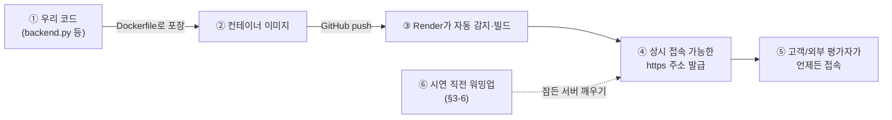

# Render 배포 가이드 (AI 에이전트 온보딩용)

> ⚠ 이력 보관 (2026-09-27): Render안은 v0.1 결정으로, 실제 배포는 OCI 직접 배포(Caddy)로 바뀌었다
> ([ARCHITECTURE.md](../ARCHITECTURE.md) §6-3). 이 문서는 절차 참고용으로만 보관한다. 현행 배포는 `scripts/deploy.sh`.
>
> 대상: 사람 작업자 + 배포를 대신 수행하는 AI 에이전트(Hermes 플래너/코드생성 에이전트) 모두
> 목적: 백엔드(RAG/게이트/오케스트레이션 서버)를 Render 컨테이너로 상시 배포. 프론트(Netlify)는 변경 없음
> 전제: [ARCHITECTURE.md](../ARCHITECTURE.md) §6-2에서 컨테이너 PaaS(A안) 중 **Render**를 채택함

## 목차

- [0. 큰 그림 (5분 요약, 배포를 처음 해보는 사람용)](#0-큰-그림-5분-요약-배포를-처음-해보는-사람용)
- [0.1 용어집](#01-용어집)
- [1. 배경](#1-배경-왜-render인가-왜-콜드스타트를-감수하는가)
- [2. 목적](#2-목적-이-문서가-하는-일)
- [3. 상세 핸즈온 가이드](#3-상세-핸즈온-가이드)
- [4. AI 에이전트가 이 문서를 사용할 때 지켜야 할 규칙](#4-ai-에이전트가-이-문서를-사용할-때-지켜야-할-규칙)
- [5. 템플릿 파일 위치](#5-템플릿-파일-위치)

## 0. 큰 그림 (5분 요약, 배포를 처음 해보는 사람용)

이 문서는 "우리가 만든 백엔드 서버를, 고객이 아무 때나 접속해도 동작하도록 인터넷에 항상 켜둔다"는 작업 하나를 다룬다. 프론트엔드/임베디드 개발 경험만 있고 서버 운영(배포, DevOps)은 처음이어도 이해할 수 있도록, 먼저 전체 그림부터 설명한다.

**왜 이 작업이 필요한가**: 지금까지 참조 리포는 시연자 컴퓨터에서 서버를 켜고 `ngrok`이라는 도구로 "일시적으로만" 외부에 노출했다(마치 시연할 때만 노트북 화면을 공유하는 것과 비슷하다). 이번 초기 개발은 외부 평가자가 아무 때나 접속해서 실제로 동작하는 걸 확인해야 하므로, 노트북을 끄더라도 계속 켜져 있는 서버가 필요하다.

**어떤 방식으로 해결하는가**: 서버를 직접 사서 관리하는 대신(전기세·보안·운영체제 관리까지 다 해야 함), "컨테이너만 올리면 나머지는 대신 해주는 서비스"(PaaS, §0.1 참고)인 **Render**를 쓴다. 우리가 할 일은 딱 두 가지다.

1. 우리 서버 코드를 **컨테이너**(포장 방식, §0.1 참고)로 포장하는 방법을 정의한 `Dockerfile` 하나를 작성한다.
2. Render 웹사이트에서 그 코드가 있는 GitHub 저장소를 연결하고 "실행해줘"라고 누른다.

그러면 Render가 코드를 가져가서(빌드) 서버를 대신 띄워주고, 고정된 인터넷 주소(`https://내서비스.onrender.com`)를 하나 내준다. 이 주소가 바로 "항상 켜져 있는 우리 백엔드"의 주소다.

**딱 하나 감수해야 하는 단점**: 공짜(무료 플랜)로 쓰면, 아무도 안 쓰는 시간이 좀 지나면 서버가 잠깐 잠든다(마치 컴퓨터가 절전모드 들어가듯). 그 상태에서 첫 요청이 오면 깨어나는 데 수십 초가 걸린다(§0.1 콜드스타트). 이 문서는 "시연 직전에 미리 한 번 깨워두는" 방법(§3-6 워밍업)으로 이 문제를 해결하는 절차까지 담았다.

**전체 흐름 한눈에**



| 번호 | 노드 | 설명 |
|---|---|---|
| ① | 우리 코드 | `backend.py` 등 우리가 직접 짠 서버 코드 |
| ② | 컨테이너 이미지 | `Dockerfile`의 설명대로 코드를 포장한 결과물 (§0.1 컨테이너 참고) |
| ③ | Render가 자동 감지·빌드 | GitHub에 push하면 Render가 이 이미지를 가져가 빌드·배포 |
| ④ | https 주소 발급 | 항상 접속 가능한 고정 URL이 발급됨 (ngrok처럼 시연 시간에만 켜는 게 아님) |
| ⑤ | 고객/외부 평가자 접속 | 이 URL로 아무 때나 접속해 실제 산출물을 확인 |
| ⑥ | 시연 직전 워밍업 | 무료 플랜은 안 쓰면 잠들기 때문에(콜드스타트), 시연 전 미리 한 번 깨워둠 (§3-6) |

## 0.1 용어집

이 문서에서만 쓰는 배포/운영(DevOps) 용어를 처음 보는 사람 기준으로 풀어썼다. `reqpipe` 공통 용어(RAG, NIM 등)는 [docs/reqpipe/02_REQUIREMENTS.md의 용어집](../../reqpipe/02_REQUIREMENTS.md#02-용어집-한자어영어-약어-첫-등장-풀어쓰기)을, 초기 개발 공통 용어는 [ARCHITECTURE.md §0.1](../ARCHITECTURE.md#01-용어-이-문서-한정)을 참고한다.

| 용어 | 쉬운 설명 |
|---|---|
| 배포(Deploy) | 우리가 만든 코드를 "개발자 컴퓨터 밖"의, 다른 사람이 접속 가능한 곳에서 실행되게 만드는 일 |
| 컨테이너(Container) | 우리 코드 + 실행에 필요한 모든 것(파이썬 버전, 라이브러리 등)을 하나의 "포장 상자"로 묶은 것. 어느 컴퓨터에서 열어도 똑같이 동작해서 "내 컴퓨터에선 됐는데" 문제를 없앤다 |
| Docker / Dockerfile | 컨테이너를 만드는 도구(Docker)와, "이 상자 안에 뭘 어떻게 넣을지" 적은 설명서(Dockerfile) |
| PaaS (Platform as a Service) | 컨테이너 이미지만 올리면 서버 구동·인터넷 주소 발급·HTTPS 보안설정까지 대신 처리해주는 서비스. 서버를 직접 사서 방화벽·운영체제까지 관리하는 것(VM 방식)보다 훨씬 쉽다. Render, Railway 등이 이런 서비스다 |
| Web Service | Render에서 "인터넷 요청을 받아 응답하는 상시 실행 프로그램"을 등록하는 단위. 우리 백엔드 서버 하나 = Web Service 하나 |
| 포트(Port) | 한 컴퓨터 안에서 여러 프로그램이 동시에 네트워크 통신을 할 때 서로 구분하는 번호(문 번호라고 생각하면 됨). 우리 서버는 이 번호로 "여기로 요청을 보내라"고 알려준다 |
| 환경변수(Environment Variable) | API 키처럼 코드에 직접 적으면 안 되는 값을, 코드 밖에서 실행 시점에 주입하는 방식. Render 대시보드에 입력해두면 컨테이너 안에서 코드가 읽어갈 수 있다 |
| 헬스체크(Health Check) | "서버가 잘 살아있는지" 주기적으로 확인하는 절차. 우리 서버에 `/health`라는 간단한 확인용 주소를 만들어두고, Render가 여기로 주기적으로 물어본다 |
| 콜드스타트(Cold Start) | 한동안 요청이 없어 잠들어 있던 서버가, 다시 요청을 받고 깨어나는 데 걸리는 지연 시간(수십 초). 절전모드에서 컴퓨터를 다시 켤 때 걸리는 시간과 비슷하다 |
| 워밍업(Warmup) | 콜드스타트를 피하려고, 실제 사용자가 오기 전에 미리 한 번 요청을 보내 서버를 깨워두는 절차 |
| GitHub OAuth 연결 | Render가 우리 GitHub 저장소의 코드를 읽어갈 수 있도록, GitHub 계정으로 권한을 승인해주는 과정 |
| Auto-Deploy | GitHub 저장소의 특정 브랜치(예: `main`)에 새 코드가 올라오면, Render가 자동으로 다시 빌드·배포해주는 기능 |
| IaC (Infrastructure as Code) | 위에서 설명한 설정(Region, 환경변수 등)을 대시보드에서 마우스로 클릭하는 대신, `render.yaml` 같은 파일 하나로 코드처럼 적어두는 방식. 나중에 그대로 재현 가능 |
| CORS | 브라우저가 "다른 주소(프론트엔드)에서 이 서버(백엔드)로 요청해도 되는지" 확인하는 보안 규칙. 프론트(Netlify)와 백엔드(Render) 주소가 다르므로 백엔드에서 허용 설정이 필요하다 |

## 1. 배경 (왜 Render인가, 왜 콜드스타트를 감수하는가)

- 참조 리포(`hackathon-agent-chatbot`)는 로컬 macOS + ngrok을 시연 시간에만 켜는 구조였다. 이번 요구사항 5)는 "고객이 접속했을 때 최종산출물이 동작해야 한다"이므로, 상시 접속 가능한 고정 URL이 필요하다.
- Render 무료/저가 플랜은 일정 시간(기본 15분) 요청이 없으면 컨테이너가 잠들고, 다음 요청 시 **콜드스타트(수십 초 지연)**가 발생한다. 이번 프로젝트는 GPU 연산을 PaaS가 아니라 NVIDIA 호스티드 NIM API가 담당하므로, 콜드스타트는 "백엔드 컨테이너 재기동" 지연일 뿐이며 데이터 손실이나 재구축은 없다.
- 콜드스타트를 없애려면 유료 플랜(상시 기동)이 필요하지만, 초기 개발 예산/일정상 **1차는 무료 플랜 + 워밍업 절차로 감수**하고, 평가 직전에만 유료 전환하는 전략을 취한다. 이 문서는 그 절차를 AI/사람 모두 그대로 재현할 수 있도록 기록한다.

## 2. 목적 (이 문서가 하는 일)

이 문서 하나만 따라가면(사람이든 Hermes 코드생성 에이전트든) 아래를 할 수 있다.
1. 백엔드를 Dockerfile로 패키징
2. Render에 Web Service로 배포하고 환경변수를 설정
3. 무료 플랜 콜드스타트를 감수하되, 데모/평가 전 워밍업으로 지연을 없앰
4. 배포 상태를 헬스체크로 검증

## 3. 상세 핸즈온 가이드

### 3-1. 사전 준비물 (체크리스트)

- [ ] GitHub에 백엔드 코드가 푸시되어 있을 것 (이 레포 또는 별도 백엔드 레포)
- [ ] `Dockerfile`이 레포 루트(또는 백엔드 서브디렉터리)에 있을 것 — §3-2 참고
- [ ] NVIDIA NIM API 키 확보 (build.nvidia.com에서 발급)
- [ ] Render 계정 (GitHub OAuth로 가입 가능)

### 3-2. Dockerfile 준비 (없다면 이 템플릿 사용)

```dockerfile
# templates/Dockerfile.backend 로도 저장되어 있음 (§5 참고)
FROM python:3.11-slim

WORKDIR /app
COPY requirements.txt .
RUN pip install --no-cache-dir -r requirements.txt

COPY . .

# Render는 PORT 환경변수를 런타임에 주입한다. 반드시 이 변수를 읽어서 바인딩할 것.
ENV PORT=8643
EXPOSE 8643

CMD ["python", "backend.py"]
```

> **AI 에이전트 주의사항**: `backend.py`(또는 동등한 서버 진입점)는 하드코딩된 포트가 아니라 `os.environ.get("PORT", 8643)`으로 포트를 읽어야 한다. Render는 컨테이너 기동 시 `PORT` 환경변수를 주입하고, 이 포트로 리스닝하지 않으면 헬스체크가 실패해 배포가 롤백된다.

### 3-3. Render Web Service 생성

1. https://dashboard.render.com → **New +** → **Web Service**
2. GitHub 레포 연결 (Render OAuth 앱 권한 승인 필요 — 이 단계는 작업자가 직접 승인해야 함, AI 에이전트는 대행 불가)
3. 설정값:

| 항목 | 값 |
|---|---|
| Environment | Docker |
| Region | Singapore (한국에서 가장 가까움) |
| Instance Type | Free (1차) → 평가 전 Starter($7/월)로 전환 |
| Health Check Path | `/health` (§3-5에서 엔드포인트 추가) |
| Auto-Deploy | Yes (main 브랜치 push 시 자동 재배포) |

4. 환경변수(Environment → Add Environment Variable):

| Key | Value | 비고 |
|---|---|---|
| `NIM_API_KEY` | (NVIDIA NIM 발급 키) | 절대 레포에 커밋 금지, Render 대시보드에만 입력 |
| `NIM_CHAT_MODEL` | `nemotron-3-super-120b` (또는 실제 사용 모델명) | |
| `NIM_EMBED_MODEL` | `nemotron-3-embed-1b` | |
| `VECTOR_DB_URL` / `VECTOR_DB_API_KEY` | (Pinecone 등) | RAG 인덱스(SRS.md/SPEC.md) 조회용 |
| `KAKAO_LINK_API_KEY` | (카카오 디벨로퍼스 발급 키) | 시안/산출물 전송용 |
| `PORT` | 자동 주입됨 (직접 설정하지 않음) | Render가 런타임에 넣어줌 |

5. **Create Web Service** 클릭 → 첫 빌드/배포 대기 (5~10분)

### 3-4. 배포 확인

```bash
curl -i https://<서비스명>.onrender.com/health
```

기대 응답: `200 OK` + `{"status": "ok"}` 형태. 콜드 상태였다면 첫 요청은 10~50초 정도 걸릴 수 있다 (정상).

### 3-5. 백엔드에 헬스체크 엔드포인트 추가 (AI 에이전트가 코드생성 시 반드시 포함할 것)

```python
# backend.py 에 추가
@app.route("/health")
def health():
    return {"status": "ok"}, 200
```

이 엔드포인트는 Render의 자동 헬스체크뿐 아니라, §4의 워밍업 스크립트에서도 사용한다.

### 3-6. 시연/평가 전 워밍업 절차 (콜드스타트 감수 전략의 핵심)

시연 10~15분 전, 아래 스크립트로 컨테이너를 깨워둔다.

```bash
# scripts/warmup.sh
#!/usr/bin/env bash
URL="https://<서비스명>.onrender.com/health"
echo "워밍업 시작: $URL"
for i in $(seq 1 5); do
  code=$(curl -s -o /dev/null -w "%{http_code}" "$URL")
  echo "시도 $i: HTTP $code"
  if [ "$code" = "200" ]; then
    echo "워밍업 완료"
    exit 0
  fi
  sleep 5
done
echo "경고: 워밍업 실패, 수동 확인 필요"
exit 1
```

> 병렬작업 2 또는 시연 담당자가 시연 직전 이 스크립트를 실행한다. Hermes 플래너 에이전트가 배포 자동화를 맡는다면, 이 워밍업 호출을 배포 파이프라인의 마지막 단계로 포함시킬 것.

### 3-7. 무료 → 유료 전환 (평가 당일 권장)

1. Render 대시보드 → 서비스 선택 → **Settings** → **Instance Type** → `Starter` 선택
2. 전환 즉시 콜드스타트 없이 상시 기동으로 전환됨
3. 평가 종료 후 다시 `Free`로 되돌려 비용 절감 가능

### 3-8. 백그라운드 워커 배포 (병렬작업 3 전용 — 코드생성·빌드)

> 이 절은 [ARCHITECTURE.md §6-2](../ARCHITECTURE.md#6-2-상시-운영환경-제안-신규)와 [PARALLEL_3_SPEC.md §5](../PARALLEL_3_SPEC.md#5--빌드-파이프라인-백그라운드-워커)에서 "빌드는 별도 백그라운드 워커에서 처리한다"고 정했지만, 지금까지 이 문서에는 실제로 어떻게 배포하는지가 빠져 있었다. 이 절이 그 빈 부분을 채운다.

**왜 Web Service 하나로는 안 되는가**: §3-3의 `agt001-backend`는 "요청 하나에 짧게 응답"하는 용도다. 코드 생성·빌드처럼 몇 분씩 걸리는 작업을 같은 서비스에서 처리하면, 그동안 다른 고객의 챗봇 요청이 막히거나 Render의 요청 타임아웃에 걸릴 수 있다. 그래서 **별도의 Render 서비스 타입인 Background Worker**를 하나 더 만든다.

1. Render 대시보드 → **New +** → **Background Worker**
2. 같은 GitHub 저장소 연결, Dockerfile은 §3-2와 동일한 것을 재사용해도 된다(진입점만 다름 — 예: `backend.py` 대신 `worker.py`)
3. 설정값은 §3-3 표와 대부분 같으나 **Health Check Path가 없다**(Worker는 외부 HTTP 요청을 받지 않으므로)
4. `agt001-backend`(Web Service)와 `agt001-build-worker`(Background Worker)는 **서로 다른 서비스로 개별 과금**된다 — 무료 플랜 2개를 동시에 쓸 수 있지만, 워커도 자기만의 콜드스타트를 가진다(§3-6 워밍업은 Web Service용이며 워커에는 적용되지 않음. 대신 워커는 작업이 큐에 들어올 때만 깨어나면 되므로 콜드스타트가 상대적으로 덜 치명적이다)
5. IaC로 한 번에 정의하려면 [templates/render.yaml](templates/render.yaml)의 `agt001-build-worker` 항목을 그대로 사용한다

> **AI 에이전트 주의사항**: 병렬작업 3의 코드생성 에이전트가 배포 자동화를 대신 작성한다면, `backend.py`(웹 요청 처리)와 `worker.py`(빌드 처리) 두 진입점을 반드시 분리해서 생성해야 한다. 하나의 파일에 둘을 합치면 이 절의 목적 자체가 무효화된다.

## 4. AI 에이전트가 이 문서를 사용할 때 지켜야 할 규칙

- 3-3의 **GitHub OAuth 권한 승인**과 **환경변수에 API 키 입력**은 사람의 명시적 조작이 필요하다 (자격증명 입력은 대행 금지 — 세션 전역 규칙과 동일). AI 에이전트는 "무엇을 어디에 입력해야 하는지"까지만 안내하고, 실제 키 입력은 작업자에게 요청한다.
- Dockerfile/헬스체크 엔드포인트 코드 작성은 AI 에이전트(병렬작업 3의 코드생성 에이전트)가 자동 생성해도 된다. 단 §3-2의 `PORT` 환경변수 규칙을 반드시 준수해야 배포가 실패하지 않는다.
- 배포 자동화(예: `render.yaml`을 통한 IaC 방식)를 원하면 `templates/render.yaml` 예시를 확장해서 사용한다 (아래 §5).

## 5. 템플릿 파일 위치

- `templates/Dockerfile.backend` — §3-2 Dockerfile 원본
- `templates/render.yaml` — Render Blueprint(IaC) 예시, 대시보드 수동 설정 대신 코드로 재현 가능
- `scripts/warmup.sh` — §3-6 워밍업 스크립트

> 위 템플릿 파일들은 아직 생성 전이면 이 문서의 코드 블록을 그대로 복사해 해당 경로에 만들어 사용한다.
