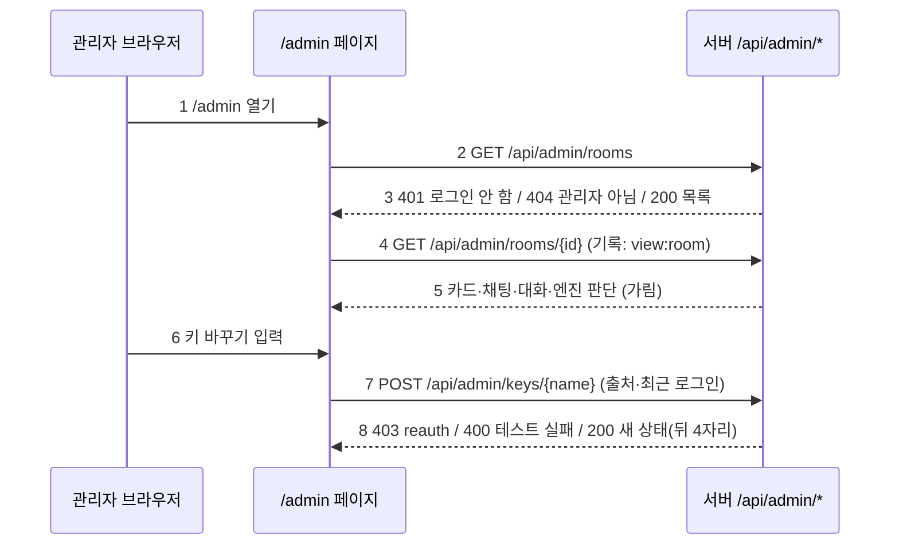

# 계약서: 관리자 화면 (ADMIN_CONTRACT)

> 2026-10-01 (KST) / Claude 작성·구현·검토. 결정 D49(관리자 사이트, 10/17 전 범위)·D50(키 관리).
> 9/28에 다른 작업 폴더(`../agent_project-admin`)에서 시작했다가 멈춘 미커밋 작업(ADMIN_PLAN)이 있었다. 그 코드는 가져오지 않고, 같은 결정을 바탕으로 이 세션에서 다시 썼다. 원본 폴더는 손대지 않았다.
> 재사용: 로그인 세션 `auth.user_for_session`, 키 저장소 `keystore`(상태·형식 확인·연결 테스트·교체·되돌리기·지우기·기록), 대화 지표 `evals/live_metrics.py`(`session_metrics`·`mask_pii`), D45 지표 `design_log.report`, CSRF `_check_origin`.

## 0. 결론

- **슈퍼 관리자** = 플랫폼 운영자. 명단은 서버 `.env`의 `ADMIN_USER_IDS`(우리 `users.id`, 쉼표)에만 있다. 사장님은 자기 가게만(채팅방·`/settings`·`/owner`) 보고 `/admin`에는 못 들어온다.
- 관리자가 아니면 관리자 기능이 있다는 것 자체를 숨긴다(404). 로그인 안 했으면 401.
- 관리자가 무엇을 봤는지·바꿨는지 기록한다(`admin_audit`). 키 값과 개인정보는 기록하지 않는다.
- 내보내는 글은 전화·주소·이메일을 가린다: 카드 값, 채팅, 대화 턴, **엔진 판단(meta)**, 대화 지표.
- 키 교체·되돌리기·지우기는 우리 출처 + **최근 로그인**(`admin_reauth_minutes`, 기본 10분)만. 새 키는 연결 테스트를 통과해야 저장된다.

| 번호 | 단계 | 설명 |
|---|---|---|
| 1 | 페이지 | `GET /admin` = `static/admin.html`. 권한은 페이지가 부르는 API에서 확인한다 |
| 2 | 첫 요청 | 가게 목록을 부른다 |
| 3 | 권한 | 401이면 카카오·구글 로그인 단추(`next=/admin`), 404면 "관리자만 볼 수 있어요" |
| 4 | 상세 | 가게 하나를 누른다. 본 것을 기록한다 |
| 5 | 가림 | 전화·주소·이메일은 `[전화]`·`[주소]`·`[이메일]`로 |
| 6 | 키 | 키 표에서 새 값을 넣는다 |
| 7 | 교체 | 우리 출처(CSRF)와 최근 로그인을 확인한다 |
| 8 | 결과 | 오래된 로그인은 다시 로그인 안내, 테스트 실패는 그 이유, 성공은 새 상태(값 없음) |

## 1. 접근 통제 (`app/services/admin.py`)

| 함수 | 뜻 |
|---|---|
| `require_admin(request) -> user` | 로그인 안 함 401, 관리자 아님 404 |
| `require_recent_login(request)` | 로그인 세션이 `admin_reauth_minutes` 안에 만들어졌어야 함, 아니면 403 `reauth` |
| `viewed(user, what, target)` | `keystore.audit(user, "view:<what>", target)`. 실패해도 화면은 막지 않는다 |

모든 관리자 API 응답은 `Cache-Control: no-store`다.

## 2. 읽기 API (`app/api/admin.py`)

| 번호 | 경로 | 응답 |
|---|---|---|
| 1 | `GET /api/admin/rooms?q=&limit=50&offset=0` | `{rooms, total}` 최신순. 줄: `room_id, session_id, site_key, created_at, shop_name, industry, state, published, turns, flags, inquiries, bookings, owner_logged_in`. `q`는 가게 이름·업종·사이트 키 부분 일치. 대화 수·신호·문의·예약·사장님 로그인은 **보이는 페이지 줄만** 계산한다 |
| 2 | `GET /api/admin/rooms/{room_id}` | `{room, card: {칸: {status, value}}, messages: [{ts, who(ai·system·member), kind, text}] 최근 200, turns: [{ts, user_text, ai_text, state_before, state_after, meta}] 최근 200, metrics}`. 글과 meta·metrics는 가린다. 없으면 404 |
| 3 | `GET /api/admin/signals?days=7` | `{sessions: [{room_id, session_id, shop_name, n_turns, flags, reached_summary, extract_fail_rate, extract_p50_ms}]}` 신호가 하나라도 있는 대화, 최근 순(최대 200, days 1~90) |
| 4 | `GET /api/admin/metrics?days=30` | `{days, design: design_log.report, funnel: {event: 수}, rooms_created, published, owners_logged_in}` |

### 2-3. 대화 문제 신호

| flag | 조건 (`session_metrics` 값) |
|---|---|
| `stuck` | 대화 12턴 이상인데 요약에 못 감 |
| `extract_fail` | 추출 3번 이상이고 실패율 30% 이상 |
| `slow` | 추출 중앙값 8초 이상 |
| `repeat` | 같은 칸을 3번 이상 연달아 물음 |
| `english` | AI 답에 영문 낱말 3개 이상 연속(R1 감시) |

## 3. 키 API (`app/api/admin_keys.py`)

| 경로 | 내용 |
|---|---|
| `GET /api/admin/keys` | `{ready, keys: keystore.status()}`. 값은 뒤 4자리만 |
| `POST /api/admin/keys/{name}` `{value}` | 출처 + 최근 로그인. 바꿀 수 없는 이름 404, 암호화 열쇠 없으면 409, 형식·연결 테스트 실패 400(이유), 통과하면 저장 → 새 상태 |
| `POST /api/admin/keys/{name}/rollback`, `/clear` | 출처 + 최근 로그인 → 되돌리기(7일 안 이전 키)·지우기(.env 값으로) → 새 상태. 할 수 없으면 400(이유) |

## 3-2. 사이트 내리기 (`app/services/takedown.py`, 로드맵 P2-4·백로그 O-4)

| 경로 | 내용 |
|---|---|
| `POST /api/admin/rooms/{room_id}/takedown` `{reason}` | 출처 + 최근 로그인. 이유 필수(200자). `generated/<site_key>/takedown.json`에 이유·관리자·시각을 쓰고 `admin_audit`(`site_takedown`)·텔레그램 운영 알림에 남긴다. 방 없음 404, 이유 없음 400 |
| `POST /api/admin/rooms/{room_id}/restore` | 출처 + 최근 로그인. 표시 파일을 지운다(`site_restore` 기록). 내린 적 없으면 400 |

- 내린 사이트: `/site/<키>/` 전체가 410(안내 한 줄, `noindex`), 문의·예약(`site_exists`)·주문(`orders.check`)·손님 채팅(`guest_chat.enabled`)이 모두 막힌다.
- 공개본·생성본 파일은 지우지 않는다. 사장님이 다시 공개해도 내림은 풀리지 않고, 되돌리면 그대로 열린다.
- 표시 파일이 깨져 읽히지 않아도 내린 것으로 본다(열어 두는 쪽이 더 위험).
- 목록·상세 줄에 `taken_down`(`{reason, by, at}` 또는 null)이 붙는다. 화면은 가게 상세 머리에 "사이트 내리기"(이유 입력 → 한 번 더 확인)·"사이트 다시 열기".

## 4. 화면 (`static/admin.html`, `GET /admin`)

owner.html과 같은 모양의 가벼운 한 페이지(외부 스크립트 없음, 글은 모두 `textContent`로 넣는다). 탭 4개:

| 번호 | 탭 | 내용 |
|---|---|---|
| 1 | 가게 | 검색 + 목록(가게 이름·업종·상태·대화 수·공개·문의·예약·사장님 로그인·신호 칩) + 더 보기. 누르면 상세: 카드 칸, 채팅, 대화 턴(엔진 판단은 접어 둠), 대화 지표 |
| 2 | 문제 신호 | 최근 7일 신호가 있는 대화, 누르면 가게 상세 |
| 3 | 지표 | 시안 → 고르기 → 공개 → 문의, 방·공개·사장님 로그인 수, 퍼널 수 |
| 4 | 키 | 이름·쓰는 곳·출처(화면·.env·없음)·뒤 4자리·바꾼 사람·시각. 바꾸기(연결 테스트 후 저장)·되돌리기·지우기. 403 `reauth`면 "보안을 위해 다시 로그인해 주세요" + 로그인 링크 |

- 390px에서 가로로 넘치지 않는다(목록은 카드 모양). 누름 칸 44px.

## 5. 합격 테스트

| 번호 | 테스트 |
|---|---|
| 1 | 로그인 안 함 401, 관리자 아님 404, 관리자 200, 응답 `no-store` |
| 2 | 목록: 검색, 페이지, 신호(`stuck`·`english`), 문의·예약 수, 사장님 로그인 |
| 3 | 상세: 카드 값·채팅·대화 글·**엔진 판단 meta**·지표의 전화번호가 가려짐, 없는 방 404 |
| 4 | 기록: 목록·상세·키 보기가 `admin_audit`에 남음 |
| 5 | 키: 값이 응답에 없음, 출처 없음 403, 오래된 로그인 403 `reauth`, 바꿀 수 없는 이름 404, 열쇠 없음 409, 테스트 실패 400, 교체·되돌리기·지우기 |
| 6 | `/admin` 페이지가 뜬다. Claude: 가짜 응답으로 390px·1280px 캡처 |

## 6. 운영에서 켜기

1. 대표가 운영 사이트에 카카오로 로그인 → `/api/me`에서 자기 `id` 확인.
2. 서버 `.env`에 `ADMIN_USER_IDS=<id>`와 `TOKEN_ENC_KEY=<무작위 긴 값>`을 넣고 다시 시작.
3. `/admin`을 연다. 키 교체는 로그인한 지 10분 안에만 된다.

## 변경 이력

| 날짜 | 내용 |
|---|---|
| 2026-10-02 | §3-2 사이트 내리기 추가(로드맵 P2-4). |
| 2026-10-01 | 처음 작성. 9/28 미커밋 작업은 가져오지 않고 다시 씀. 엔진 판단 가림·보이는 페이지만 계산을 처음부터 넣음 |
