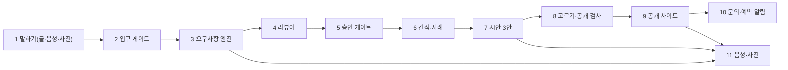
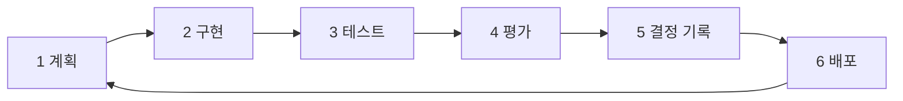

# 에이전트와 개발 도구: 무엇을 만들었고 어떻게 만들었나

> 독자: 이 저장소를 처음 보는 개발자·평가자. 쉬운 말로, 과장 없이 쓴다.
> 서비스 이름: 한마디. 사장님이 채팅(글·음성·사진)으로 설명하면 AI가 요구사항을 정리해 확인받은 뒤 웹사이트를 만들어 공개한다.

## 1. 한눈에 — 사장님 말 한마디가 사이트가 되기까지 누가 무엇을 하나

| 번호 | 에이전트/도구 | 하는 일 | 파일 |
|---|---|---|---|
| 1 | 사장님 입력 | 글·음성·사진으로 가게 설명을 보낸다 | `static/room.html`, `app/api/chat.py`, `app/api/rooms.py` |
| 2 | 입구 게이트 | 금지 요청 거절, 문의 종류 분류, 기능 가능 여부 판정 | `app/services/intake.py` |
| 3 | 요구사항 엔진 | 말에서 칸 추출, 근거 검사, 다음 질문 1개 | `app/services/prd_engine.py` |
| 4 | 리뷰어 | 요약 직전 원문과 카드 대조, 빠진 요구 보충 | `app/services/prd_engine.py` (`review`) |
| 5 | 승인 게이트 | 요약·투표 통과 때만 다음 단계로 보냄 | `app/services/prd_engine.py` (`close_gate`), `app/services/chat_flow.py` (`_gate_or_summary`) |
| 6 | 견적·사례 | 규칙 참고 견적 한 줄, 비슷한 사례 1개 | `app/services/quote.py`, `app/services/rag.py` |
| 7 | 시안 3안 | 카드로 부품·토큰 렌더 3안, 컨셉·문구 초안 | `app/services/design_concept.py`, `app/services/design_variants.py`, `app/services/design.py`, `app/services/site_render.py`, `app/services/copywriter.py` |
| 8 | 고르기·공개 검사 | 고른 안 확인, 빈 자리 확인, 게시 전 위험 5종 차단 | `app/services/chat_flow.py` (`_publish`), `app/services/publish_check.py` |
| 9 | 공개 사이트 | 고른 안을 `/site/<id>/`로 연다 | `app/services/deploy.py`, `app/api/public.py` |
| 10 | 문의·예약 알림 | 폼 저장 뒤 채팅방 알림, 사장님 카톡 전송 시도 | `app/services/inquiries.py`, `app/services/bookings.py`, `app/services/notify.py`, `app/services/kakao_talk.py` |
| 11 | 음성·사진 | 말→글, 답장→소리, 사진 정리·반영 | `app/services/stt.py`, `app/services/tts.py`, `app/services/voice_turn.py`, `app/api/callbot.py`, `app/services/photos.py` |

## 2. 서비스 안의 에이전트와 도구

### 입구 게이트 (`app/services/intake.py`)

하는 일: 금지 요청(사칭·피싱·도박 등)을 거절하고, 기능 요구가 지금 가능한지 사례집에서 판정한다 (`app/services/intake.py`).
입력→출력: 채팅 글 → 통과·거절·기능 판정. 쓰는 모델·외부 도구: 없음(규칙 + 사례집, `app/services/intake.py`).
틀리지 않게 막는 장치: 규칙 먼저 판정, 애매하면 쉬운 질문·템플릿·운영자 알림으로 넘긴다 (`docs/product/DECISIONS.md` D33).
검증: 엔진 검증 테스트 65개 중 입구 게이트 테스트 (`tests/engine/test_intake_gate.py`, `STATUS.md` §3 ②번 줄).
파일: `app/services/intake.py`, `app/services/prd_schema.py` (종류 분류).

### 요구사항 엔진 (`app/services/prd_engine.py`: 추출→근거 검사→다음 질문)

하는 일: 한 턴의 말에서 칸을 뽑고, 가장 중요한 빈 칸 하나를 다음 질문으로 고른다 (`app/services/prd_engine.py`).
입력→출력: 사장님 발화 → 구조 카드 슬롯 + 다음 질문 1개. 쓰는 모델: NIM 대화 모델 `nvidia/nemotron-3-super-120b-a12b`, 대비 `nvidia/nemotron-3-ultra-550b-a55b`, `nvidia/nemotron-3.5-lightning-30b-a3b`를 `llm.chat_json` 추출로만 쓴다 (`app/llm.py`, `app/config.py`, `app/services/prd_engine.py` `extract_detail`).
틀리지 않게 막는 장치: 말하지 않은 사실은 채우지 않는다, 근거 없는 값은 버린다, 질문 예산(가게 8·개인 7·단체 8·웹서비스 12, `docs/product/DECISIONS.md` D33)을 넘기지 않는다 (`app/services/prd_engine.py`).
검증: 엔진 검증 65개 전부 통과 (`tests/engine/`, `STATUS.md` §3 ③번 줄), T2 추출 평가 2차 90.2%·3차 87.1% (`docs/product/evals/extraction-2026-09-26-r2.md`, `docs/product/evals/extraction-2026-09-26-r3.md`), T3 대화 시뮬 최신 z3 32/35(91%) (`docs/product/evals/simulation-2026-09-27-zen-qwen-z3.md`).
파일: `app/services/prd_engine.py`, `app/services/chat_flow.py` (상태머신).

### 입력 검사 (`app/services/validate.py`, `app/services/numbers.py`)

하는 일: 카드에 적기 전에 전화 자리수·영업시간·가격·민감정보 모양을 규칙으로 검사하고, 말로 한 숫자를 값으로 비교한다 (`app/services/validate.py`, `app/services/numbers.py`).
입력→출력: 칸 후보값 → 정상 또는 짧은 사유 글. 쓰는 모델·외부 도구: 없음(표준 라이브러리만, `app/services/validate.py`, `app/services/numbers.py`).
틀리지 않게 막는 장치: 틀린 값은 저장 차단·대기 유지, 3회 반복 시 자리 표시 (`docs/hackathon/ARCHITECTURE.md` §1 ⑤번).
검증: 엔진 검증 테스트의 저장 차단 회귀 테스트 (`tests/engine/`, `STATUS.md` §3 ③번 줄).
파일: `app/services/validate.py`, `app/services/numbers.py`.

### 리뷰어 에이전트 (D34, `app/services/prd_engine.py` `review`)

하는 일: 요약 직전에 원문과 카드를 대조해 빠진 요구는 원문 인용이 확인될 때만 채우고, 어긋난 값은 고치지 않고 묻는다 (`app/services/prd_engine.py` `review`, `docs/product/DECISIONS.md` D34).
입력→출력: 카드 + 대화 원문 → 보충 항목·어긋남 질문. 쓰는 모델: NIM `chat_json` 1회 (`app/services/prd_engine.py` `review`).
틀리지 않게 막는 장치: 인용이 원문에 없으면 버린다, 가정값을 어긋남으로 보는 오탐은 코드로 거른다 (`docs/product/FLOWDOC.md` §2 10~13번).
검증: 실측 약 3초, 첼로 사례에서 놓친 카톡 문의 요구를 찾음 (`STATUS.md` §3 ④번 줄) (확인 필요: 초 단위 실측 원본).
파일: `app/services/prd_engine.py` (`review`, `review_text`), `app/services/chat_flow.py` (`_gate_or_summary`).

### 비슷한 사례 RAG (`app/services/rag.py`)

하는 일: 기능 사례집 42개 + 업종·종류 프로필 9개에서 가장 비슷한 사례 1개를 말한다 (`app/services/rag.py`, `STATUS.md` §3 ⑤번 줄).
입력→출력: 사장님 말 → 사례 1개 또는 신규 판정. 쓰는 모델·외부 도구: NIM 임베딩 `nvidia/nemotron-3-embed-1b` (`app/llm.py` `embed`, `embed_many`), 기준 0.76 (`README.md` NIM 표).
틀리지 않게 막는 장치: 가짜 과거 프로젝트 문구 제거, 실패해도 대화 중단 없음, 다른 사장님 대화·사실은 넣지 않음 (`app/services/rag.py`).
검증: 기동 시 51개 자료 1회 임베딩 약 2.4초 (`app/llm.py` `embed_many`) (확인 필요: 최신 실측 시각).
파일: `app/services/rag.py`, `app/llm.py`, `app/data/feature_catalog.json` (확인 필요: 파일명).

### 견적 (`app/services/quote.py`)

하는 일: 승인된 카드로 규칙 계산 참고 견적 한 줄과 산정 근거를 만든다. AI가 금액을 만들지 않는다 (`app/services/quote.py`, `docs/product/DECISIONS.md` D25).
입력→출력: 확정 카드 → 금액 한 줄 + 근거 + 베타 무료 안내. 쓰는 모델·외부 도구: 없음(규칙, `app/services/quote.py` `rule_quote`).
틀리지 않게 막는 장치: AI 금액 생성 금지, 같은 입력이면 같은 견적 (`docs/hackathon/REQUIREMENTS.md` REQ-QUOTE-001).
검증: 공유방 흐름 E2E 5개 (`tests/e2e/test_room_e2e.py`, `README.md` 품질 절) (확인 필요: 견적 전용 테스트).
파일: `app/services/quote.py`.

### 디자인 컨셉·시안 3안 (`app/services/design_concept.py`, `app/services/design_variants.py`, `app/services/design.py`, `app/services/site_render.py`)

하는 일: NIM이 정해진 목록 안에서 색·글꼴·구성 컨셉을 정하고, 카드로 부품 + 토큰 렌더 3안(기본형·사진 강조형·간결형)을 만든다 (`app/services/design_concept.py`, `app/services/design_variants.py`, `app/services/design.py`, `app/services/site_render.py`).
입력→출력: 확정 카드 → 컨셉 + 3안 명세 + HTML. 쓰는 모델: NIM `chat_json` (컨셉 쓰기·말로 고치기, `app/services/design_concept.py` `make`, `adjust`), 실패 시 업종별 규칙 컨셉으로 대체 (`app/services/design_concept.py` `rule_concept`).
틀리지 않게 막는 장치: 사장님이 말한 사실만 넣고 나머지는 자리 표시, 대비·44px·금지 속성 검증, AI 전체 HTML 자유 생성 금지 (`docs/product/DECISIONS.md` D38, D31).
검증: 휴대폰 크기 자동 점검 11단계 통과(운영) (`tests/e2e/mobile_flow.py`, `STATUS.md` §1), 공개 사이트 품질 자동 점검 36쪽 (`docs/product/evals/site-quality-2026-09-26-r3.md`), Qwen vision 첫 화면 채점 36/36쪽 (`docs/product/evals/site-quality-2026-09-27-qwen.md`).
파일: `app/services/design_concept.py`, `app/services/design_variants.py`, `app/services/design.py`, `app/services/site_render.py`.

### AI 문구 (`app/services/copywriter.py`)

하는 일: 첫 화면 한 줄·소개·상품 설명 초안을 쓴다. 사장님이 말한 소개가 우선이다 (`app/services/copywriter.py`).
입력→출력: 카드 → 문구 초안 또는 없음. 쓰는 모델: NIM `chat_json` (`app/services/copywriter.py` `generate`).
틀리지 않게 막는 장치: 원문에 없는 숫자(가격·전화·경력·인원)가 들어간 문장은 버린다 (`app/services/copywriter.py` `_clean`).
검증: 공개 사이트 품질 점검의 사실 누락 항목 (`docs/product/evals/site-quality-2026-09-26-r3.md`) (확인 필요: 문구 전용 점수).
파일: `app/services/copywriter.py`.

### AI 이미지 (`app/services/ai_images.py`, D51)

하는 일: 사장님 사진이 없을 때 빈 사진 칸을 AI 사진으로 채운다. 버튼을 눌러야만 만든다 (`app/services/ai_images.py`).
입력→출력: 업종·용도 + 버튼 → 공용 예시 사진. 쓰는 모델·외부 도구: Gemini 이미지 (`gemini-2.5-flash-image`, `GEMINI_API_KEY`, `app/services/ai_images.py`, `app/config.py`).
틀리지 않게 막는 장치: 가게 이름·전화·주소·가격은 프롬프트에 넣지 않음, 사장님 사진이 오면 항상 먼저 씀, 공개 사이트에 예시 표시, 얼굴·간판 글자·로고·실제 상호 금지 (`docs/product/DECISIONS.md` D51).
검증: 키 확인 스크립트 (`scripts/check_gemini_image.py`) (확인 필요: 사진 표시 회귀 테스트).
파일: `app/services/ai_images.py`.

### 사진 (`app/services/photos.py`)

하는 일: 올린 사진의 위치 정보를 지우고 긴 변 1600px JPEG로 바꿔 대표 사진·사진첩에 자동 배치한다 (`app/services/photos.py`, `STATUS.md` §3 ⑩번 줄).
입력→출력: 업로드 파일 → 정리된 사진 + 카드 반영. 쓰는 모델·외부 도구: 없음(규칙, `app/services/photos.py`).
틀리지 않게 막는 장치: 원본 보관 안 함, EXIF 제거, 지우면 시안·공개본도 다시 만듦 (`docs/product/BACKLOG.md` §7 D4-5 줄).
검증: 사진 단위 테스트 (`tests/unit/test_photos.py`, `STATUS.md` §3 ⑩번 줄).
파일: `app/services/photos.py`.

### 공개 전 검사 (`app/services/publish_check.py`)

하는 일: 공개 직전 HTML에서 외부 스크립트·외부 전송 폼·자동 이동·비밀값·우회 iframe 5종이 있으면 게시를 막고 사장님께 알린다 (`app/services/publish_check.py`, `STATUS.md` §4 6번 줄).
입력→출력: 공개 후보 HTML → 통과 또는 차단 사유. 쓰는 모델·외부 도구: 없음(규칙, `app/services/publish_check.py`).
틀리지 않게 막는 장치: 정해진 부품 렌더 결과물은 항상 통과하도록 설계, 시안 미리보기 iframe도 `sandbox`로 묶음 (`README.md` 보안 절).
검증: 게시 검사 테스트 11개 (`tests/unit/test_publish_check.py`, `STATUS.md` §4 6번 줄).
파일: `app/services/publish_check.py`.

### 공개·배포 (`app/services/deploy.py`, `app/api/public.py`)

하는 일: 고른 시안을 `/site/<id>/`로 열고, 생성물은 앱과 다른 미리보기 주소에서 CSP `sandbox`로 서빙한다 (`app/services/deploy.py`, `app/api/public.py`, `README.md` 보안 절).
입력→출력: 고른 안 → 공개 주소. 쓰는 모델·외부 도구: 없음, Caddy 리버스 프록시 (`deploy/Caddyfile`, `README.md` 운영 절).
틀리지 않게 막는 장치: 별도 미리보기 호스트 + CSP sandbox, 생성 경로를 산출물 안으로 제한 (`app/security.py`, `app/api/public.py`).
검증: 휴대폰 크기 자동 점검 11단계 통과(운영) (`tests/e2e/mobile_flow.py`, `STATUS.md` §1).
파일: `app/services/deploy.py`, `app/api/public.py`, `app/main.py` (`_split_hosts`).

### 코드 생성 (`app/services/codegen.py` — 지금 흐름에서 실제로 쓰이는지 확인함)

하는 일: 확정 스펙으로 정적 웹 프로젝트를 요청별 Docker 컨테이너에서 만든다. 지금 기본 흐름에서는 뒤에서 함께 돌 뿐이고, 공개 사이트는 사장님이 고른 시안을 먼저 쓴다 (`app/services/codegen.py`, `app/services/chat_flow.py`, `docs/product/DECISIONS.md` D31).
입력→출력: 정제·길이제한 스펙 → 생성 파일. 쓰는 모델·외부 도구: Hermes CLI + Docker (`--rm`, `/workspace`만 마운트, `app/services/codegen.py`).
틀리지 않게 막는 장치: 원문이 아니라 정제 스펙만 전달, API 키는 환경변수로만 전달, 90초 타임아웃, 파일 실제 생성 확인 (`app/services/codegen.py`).
검증: E2E 5개 흐름에 코드생성→배포 URL 포함 (`tests/e2e/test_room_e2e.py`, `README.md` 품질 절).
파일: `app/services/codegen.py`, `app/services/chat_flow.py` (`codegen.start`).

### 문의·예약·알림 (`app/services/inquiries.py`, `app/services/bookings.py`, `app/services/notify.py`, `app/services/kakao_talk.py`)

하는 일: 공개 사이트 폼을 저장하고 채팅방에 알린 뒤 사장님 카톡 전송을 시도한다. 문의는 30일 보관, 예약은 사장님이 채팅방에서 확정·거절한다 (`app/services/inquiries.py`, `app/services/bookings.py`, `app/services/notify.py`, `app/services/kakao_talk.py`).
입력→출력: 방문자 폼 → 저장 + 채팅방 알림 + 카톡 시도. 쓰는 모델·외부 도구: 없음, 카카오 나에게 보내기 API (`app/services/kakao_talk.py`).
틀리지 않게 막는 장치: 스팸 숨김 칸, IP당 10분 5건, 문의 양식 기본 포함·외부 전송 폼 차단, 카톡은 추가 동의 + 리프레시 토큰만 암호화 저장 (`STATUS.md` §3 ⑨번 줄, `docs/product/DECISIONS.md` D32).
검증: 채팅방 알림은 운영 확인, 사장님 카톡 실제 수신은 아직 확인 전 (`STATUS.md` §4 3번).
파일: `app/services/inquiries.py`, `app/services/bookings.py`, `app/services/notify.py`, `app/services/kakao_talk.py`, `app/api/inquiries.py`, `app/api/bookings.py`.

### 음성 (`app/services/stt.py`, `app/services/tts.py`, `app/services/voice_turn.py`, `app/api/callbot.py`)

하는 일: 말→글(입력창 전달), 답장 듣기 버튼, 읽을 말 다듬기, 브라우저 통화 PoC를 맡는다 (`app/services/stt.py`, `app/services/tts.py`, `app/services/voice_turn.py`, `app/api/callbot.py`).
입력→출력: 녹음 → 글자, 답장 글 → 음성. 쓰는 모델·외부 도구: NVIDIA 호스팅 Parakeet 1.1B RNNT 다국어 음성 인식, Magpie TTS 다국어 `KO-KR.Aria`, 통화는 Twilio ConversationRelay (`app/services/stt.py`, `app/services/tts.py`, `app/api/callbot.py`, `app/config.py`).
틀리지 않게 막는 장치: 녹음은 전사 직후 삭제, 전사 결과는 입력창에 넣고 사장님이 고친 뒤 전송, TTS 자동 재생 없음 (`app/services/stt.py`, `README.md` 음성 표).
검증: 운영 실측 STT 약 9초 분량 2.5초 전사·TTS 7.4초 분량 1.4초 합성·합성→재인식 왕복 확인 (`README.md` 음성 실측 절), 음성 실패율 카운터 (`app/services/funnel.py` `voice_fail_rate`, `STATUS.md` §4 4번 줄).
파일: `app/services/stt.py`, `app/services/tts.py`, `app/services/voice_turn.py`, `app/api/callbot.py`, `app/api/stt.py`, `app/api/tts.py`.

### 공유방 (`app/services/rooms.py`)

하는 일: 다인원 방·초대 링크·과반 대신 전원 동의·방장 넘기기·타이머를 맡는다 (`app/services/rooms.py`, `docs/product/DECISIONS.md` D52).
입력→출력: 참여자 말 → 같은 상태머신 처리 + 투표·동의. 쓰는 모델·외부 도구: 없음(규칙, 상태머신은 `app/services/chat_flow.py` 재사용).
틀리지 않게 막는 장치: 본인 확인 값 비노출(SHA-256 앞 12자리 핸들), 새 방은 초대로만 입장, 10명 상한 (`app/services/rooms.py`, `STATUS.md` §3 ⑬번 줄).
검증: T3 공유방 6/6 동의율 100% (`docs/product/evals/simulation-2026-09-27-zen-qwen-z3.md`), 방 타이머 회귀 테스트 2개 (`STATUS.md` 운영 기반 줄) (확인 필요: 테스트 파일명).
파일: `app/services/rooms.py`, `app/api/rooms.py`, `static/room.html`.

### 지표 (`app/services/funnel.py`, `app/services/design_log.py`)

하는 일: 유입·전환 단계와 시안 보기·고르기·공개·문의 수를 개인 식별 없이 기록한다 (`app/services/funnel.py`, `app/services/design_log.py`, `docs/product/DECISIONS.md` D44·D45).
입력→출력: 브라우저·서버 사건 → 익명 기록(90일). 쓰는 모델·외부 도구: 없음(`app/services/funnel.py`).
틀리지 않게 막는 장치: 이름·연락처·대화 원문·IP 저장 없음, 집계만 장기 보관 (`app/services/funnel.py`, `app/services/design_log.py`).
검증: 음성 실패율 카운터 포함 (`app/services/funnel.py` `report()`, `STATUS.md` §4 4번 줄) (확인 필요: 지표 대시보드).
파일: `app/services/funnel.py`, `app/services/design_log.py`, `app/api/events.py`.

### 키 저장소 (`app/services/keystore.py`)

하는 일: 관리자 화면 키 교체 기반. 암호화 저장·테스트 통과 후 저장·7일 되돌리기·기록·재시작 없이 적용한다 (`app/services/keystore.py`, `docs/product/DECISIONS.md` D50).
입력→출력: 새 키 + 연결 테스트 → 저장. 쓰는 모델·외부 도구: 없음, DB 암호화 저장(`token_enc_key`, `app/services/keystore.py`).
틀리지 않게 막는 장치: 값 다시 보기 불가·뒤 4자리만 표시, 암호화 열쇠·DB 주소·관리자 명단은 화면에서 못 바꿈 (`docs/product/DECISIONS.md` D50).
검증: 키 확인 스크립트 (`scripts/check_zen_key.py`, `scripts/check_gemini_image.py`) (확인 필요: 교체 회귀 테스트).
파일: `app/services/keystore.py`.

## 3. 개발에 쓴 도구 (직접 만든 것)

| 도구 | 무엇을 재나 | 어떻게 돌리나(명령) | 결과가 어디에 남나 |
|---|---|---|---|
| T2 추출 평가 (`evals/run_extraction.py`) | 60개 말에서 칸 정확도·지어낸 값 | `.venv/bin/python -m evals.run_extraction` (`evals/run_extraction.py`) | `docs/product/evals/extraction-2026-09-26.md`, `extraction-2026-09-26-r2.md`, `extraction-2026-09-26-r3.md` (2차 90.2%·3차 87.1%, `docs/product/evals/extraction-2026-09-26-r2.md`, `docs/product/evals/extraction-2026-09-26-r3.md`) |
| T3 대화 시뮬레이션 (`evals/run_simulation.py`) | 가상 사장님 역할 모델이 36개 시나리오로 대화해 채움률·정확도·지어낸 값·질문 수·동의율을 잰다 | `.venv/bin/python evals/run_simulation.py --live --out docs/product/evals/〈이름〉.md` (`evals/run_simulation.py`, `docs/product/BACKLOG.md` §8 N-1 줄) | `docs/product/evals/simulation-2026-09-27-zen-qwen-z3.md` 등 (최신 z3 32/35(91%), `docs/product/evals/simulation-2026-09-27-zen-qwen-z3.md`) |
| 공개 사이트 품질 자동 점검 (`evals/run_site_quality.py`) | 6업종×정보 2단계×3안 36쪽의 넘침·글자·대비·누름 칸·깨진 그림·빈칸·사실 누락·죽은 버튼·틀린 번호를 잰다 | `.venv/bin/python -m evals.run_site_quality` (`evals/run_site_quality.py`) | `docs/product/evals/site-quality-2026-09-26-r3.md`, `docs/product/evals/site-quality-2026-09-27-qwen.md` |
| 비전 모델 시안 채점 (Qwen vision) | 첫 화면 36쪽을 그림 보는 모델이 0~2점으로 매긴다 | 품질 점검 뒤 채점 (`docs/product/evals/site-quality-2026-09-27-qwen.md`) | `docs/product/evals/site-quality-2026-09-27-qwen.md` (모델 `qwen3.8-flash`, `docs/product/evals/site-quality-2026-09-27-qwen.md`) |
| 디자인 비교·보고고치기 (`evals/run_design_compare.py`, `scripts/design_report.py`, `scripts/draft_score.py`) | 같은 설명문 6종의 품질·속도·가격 비교, 학습 기록 요약, 중간 시안 임계값 검사 | `.venv/bin/python` + 각 스크립트 (`evals/run_design_compare.py`, `scripts/design_report.py`, `scripts/draft_score.py`) | `docs/product/evals/design-compare/` (확인 필요: 최신 비교표 날짜) |
| 배포·되돌리기 (`scripts/deploy.sh`, `scripts/rollback.sh`) | 운영 배포 전 스냅샷 5개 보관, 헬스체크 실패 시 자동 되돌리기 | `scripts/deploy.sh`, `scripts/rollback.sh` (`scripts/deploy.sh`, `scripts/rollback.sh`) | 서버 스냅샷(원격 보관, `scripts/deploy.sh`) (확인 필요: 최신 배포 시각) |
| 비용 보고 (`scripts/oci_cost_report.sh`) | OCI 월 비용·무료 한도 사용량을 읽기 전용으로 조회 | `./scripts/oci_cost_report.sh` (`scripts/oci_cost_report.sh`) | 터미널 출력 (확인 필요: 최신 리포트 파일) |
| 키 확인 (`scripts/check_zen_key.py`, `scripts/check_gemini_image.py`) | Zen·Gemini 키 연결과 모델 목록을 값 노출 없이 확인 | `.venv/bin/python scripts/check_zen_key.py`, `.venv/bin/python scripts/check_gemini_image.py` (`scripts/check_zen_key.py`, `scripts/check_gemini_image.py`) | 터미널 출력(뒤 4자리만, `scripts/check_zen_key.py`) |
| 시안 초안·채점 스크립트 (`scripts/draft_academy_preview.py`, `scripts/draft_fit.py`, `scripts/draft_score.py`, `scripts/draft_corpus.py`, `scripts/render_fit_gold.py`) | 업종 시안 초안·적합성·점수·말뭉치·정답 시안을 만든다 | `.venv/bin/python scripts/〈이름〉.py` (`scripts/`) | `generated/` 미리보기·골드셋 (확인 필요: 파일별 산출물) |
| CI 테스트 (`.github/workflows/ci.yml`) | 매 커밋 단위·엔진 합계 334개 + 프론트 타입·빌드·테스트를 돌린다 | `git push` 시 자동, 로컬은 `pytest -q`, 프론트는 `frontend`에서 `npm test` (`README.md` 품질 절) | GitHub Actions 결과, 단위 269개·엔진 65개·프론트 36개 (`README.md` 품질 절) |

## 4. 어떻게 만들었나 (개발 방식)

AI 코딩 도구 역할 분담: Claude Code가 계획·핵심 코드·검토·git 반영을 맡고, OpenCode가 후속 작업·문서 초안·검증 초안을 맡은 뒤 결과는 Claude가 검토 후 반영한다 (`docs/product/DELIVERY_PIPELINE.md` §1, `docs/product/DEV_OPS_SYSTEM.md` §2).
커밋 메시지에서 확인되는 예 3개 (`git log --oneline`):

- `144dca3 문서: 공유방 규칙·API 계약에 D52 반영(전원 동의, to_ai/aside, 2명 안내) — OpenCode 작성, Claude 검토` (`git log --oneline`)
- `f942ff8 시안 품질 체인 + AI 예시 이미지 (OpenCode 앱 세션 'PM'·'시스템 관점' 작업, Claude 검토)` (`git log --oneline`)
- `cd9cb8e 공개 사이트 작은 글자·누름 칸 0쪽 + 6요소 자동 점수(D37) + 3주 계획·Zen 국외 이전 고지 (OpenCode O1~O3, Claude 검토)` (`git log --oneline`)

결정 기록은 `docs/product/DECISIONS.md` D번호로 남긴다 (`docs/product/DECISIONS.md`).
측정→실패 분석→수정→재측정 반복 예: T3 r3 14/36 → r5 21/36(58%, 9/27 오전) → z3 32/35(91%, 9/27 밤) (`STATUS.md` §4 1번 줄, `docs/product/evals/simulation-2026-09-27-zen-qwen-z3.md`).
운영 배포 방식은 git + 스냅샷 + 자동 되돌리기이며, 서버 감시·텔레그램 작업 지시는 Hermes가 읽기 + 이슈 쓰기만 맡는다 (`scripts/deploy.sh`, `scripts/rollback.sh`, `docs/product/DEV_OPS_SYSTEM.md` §2).
안전 규칙: 비밀값 미커밋(`.env.example` 템플릿만, `README.md` 로컬 실행 절), 생성물 별도 주소 + CSP sandbox (`app/api/public.py`, `app/main.py` `_split_hosts`, `README.md` 보안 절).

| 번호 | 단계 | 설명 | 파일 |
|---|---|---|---|
| 1 | 계획 | Claude가 작업 묶음 설계, OpenCode 소유 파일 지정 | `docs/product/DELIVERY_PIPELINE.md` §2~§3 |
| 2 | 구현 | Claude 핵심 코드, OpenCode 후속·초안 | `app/services/`, `git log --oneline` |
| 3 | 테스트 | 단위·엔진·프론트·E2E, CI 매 커밋 | `.github/workflows/ci.yml`, `tests/` |
| 4 | 평가 | T2·T3·품질·비전 채점 실행 | `evals/`, `docs/product/evals/` |
| 5 | 결정 기록 | D번호로 확정·변경 이력 보관 | `docs/product/DECISIONS.md` |
| 6 | 배포 | git 방식 + 스냅샷 + 자동 되돌리기 | `scripts/deploy.sh`, `scripts/rollback.sh` |

## 5. 한계 (솔직하게)

`STATUS.md` §4 중 에이전트 관련만 옮긴다 (`STATUS.md` §4).

- AI 대화 평가 T3 최신 z3 32/35(91%)·지어낸 값 0건이나 질문 수 평균 5.9회로 목표 3회 초과, 실행마다 ±3 흔들림, 운영 모델 NIM 기준 공식 측정 아직 없음 (`STATUS.md` §4 1번 줄, `docs/product/evals/simulation-2026-09-27-zen-qwen-z3.md`).
- AI 추출 평가 T2 2차 90.2%·3차 87.1%로 합격선(90%·0건)에 걸쳐 있고 실행마다 ±3%p 흔들림 (`STATUS.md` §4 2번 줄, `docs/product/evals/extraction-2026-09-26-r2.md`, `docs/product/evals/extraction-2026-09-26-r3.md`).
- 사장님 카톡 알림은 코드는 배포됐으나 9/26 운영 DB 동의 계정 0개라 실제 수신은 아직 확인 전 (`STATUS.md` §4 3번).
