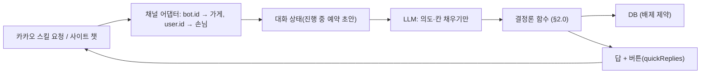
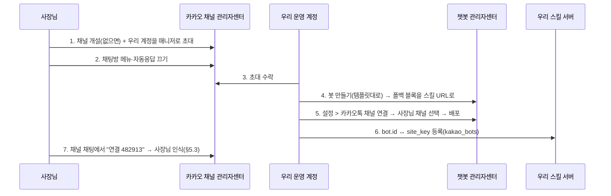

# AI 예약 비서: 손님 시나리오·시간 규칙·사장님 AI 설정·사장님 인증 (AI_BOOKING_AGENT_PLAN)

> 2026-09-29 (KST) / Claude. 대표 요청: "손님이 카카오톡 채팅방에서 예약·변경·취소·문의를 하고 AI가 운영한다. 그러려면 사장님이 시간 단위와 시술·식사 소요시간을 잘 적어 둬야 한다. 사장님도 영업시간·휴무를 AI로 쉽게 설정하게. 그러려면 사이트 관리자가 누구인지 알아야 하고, 어떻게 인증할지."
> 함께 읽을 것: [OWNER_CONSOLE_PLAN](OWNER_CONSOLE_PLAN.md)(계정·가게·DB·사장님 화면), [BOOKING_RULES_PLAN](BOOKING_RULES_PLAN.md)(빈 시간 계산), [research/CHATBOT_AGENT_DESIGN](research/CHATBOT_AGENT_DESIGN.md)(사이트 챗봇 초안), [CUSTOMER_PLAN](CUSTOMER_PLAN.md)(손님 명단·문자 인증).
> 성격: 설계 제안. 표시한 "확인 필요"는 실제 카카오 계정으로 시험해야 한다.

## 0. 핵심 원칙 한 줄

**AI는 말을 알아듣고 되묻는 일만 하고, 빈 시간 계산·저장·취소는 정해진 함수가 한다. 상태를 바꾸는 순간에는 반드시 손님(또는 사장님)이 버튼으로 확인한다.**

AI가 "3시 가능해요"라고 지어내면 이중 예약이 된다. 그래서 AI가 쓸 수 있는 시간은 계산 함수가 돌려준 목록뿐이다. 이것은 요구사항 엔진의 "근거 있는 값만" 규칙(D34)을 예약에 그대로 옮긴 것이다.

## 1. 사장님이 적어 둘 시간 규칙

### 1.1 헷갈리기 쉬운 세 가지 시간

| 이름 | 뜻 | 예 |
|---|---|---|
| **시작 간격** `step_min` | 손님이 고를 수 있는 시작 시각의 간격 | 30분 → 10:00, 10:30, 11:00 … |
| **소요시간** `duration_min` | 한 예약이 자원(사람·테이블)을 차지하는 시간 | 컷 60분, 펌 150분, 식사 90분 |
| **정리 시간** `buffer_min` | 다음 손님 전에 비워 둘 시간 | 미용 15분, 식당 테이블 정리 10분 |

"1시간 단위냐 2시간 단위냐"는 사실 두 가지 질문이 섞여 있다. **시작 간격은 가게 전체에 하나**(보통 30분)만 두고, **길이는 메뉴·시술마다** 둔다. 그래야 펌 손님이 14:00에 오면 14:00~16:45가 막히고, 컷 손님은 14:30 같은 틈에도 들어갈 수 있다. 1시간 칸 하나로 고정하면 펌이 1칸만 막아서 이중 예약이 된다. 지금 코드의 `SLOT_MIN = 60`이 이 문제다.

### 1.2 업종별 사장님 입력표 (AI가 이 표를 채우도록 묻는다)

**식당·카페** (`table` 모드)

| 항목 | 예 | 없으면 기본값 |
|---|---|---|
| 영업시간(요일별) | 화~일 11:30~21:30 | 카드 영업시간 |
| 브레이크 | 15:00~17:00 | 없음 |
| 마지막 예약 | 20:00 (마감 90분 전) | 마감 − 식사 시간 |
| 시작 간격 | 30분 | 30분 |
| 식사 시간(인원별) | 1~2명 60분 · 3~4명 90분 · 5명 이상 120분 | 90분 |
| 한 칸 최대(페이싱) | 30분마다 3팀 · 12명 | 3팀 · 12명 |
| 인원 범위 | 1~8명, 9명 이상은 "전화 주세요" | 1~8명 |
| 코스·룸 | 룸 1개(6~10명), 코스 120분 | 없음 |

**미용실·네일** (`slot` 모드)

| 시술 | 소요 | 정리 | 담당자별 차이 |
|---|---|---|---|
| 컷 | 60분 | 15분 | 원장 45분 |
| 펌 | 150분 | 15분 | 실장 180분 |
| 염색 | 120분 | 15분 | — |
| 펌 + 염색 | 240분 | 15분 | 합이 아니라 따로 적는다(동시 진행 때문) |
| 클리닉 | 60분 | 0분 | — |

| 담당자 | 근무 | 휴무 | 할 수 있는 시술 |
|---|---|---|---|
| 원장 | 10~20시 | 매주 월 | 전부 |
| 실장 | 11~21시 | 매주 화 | 컷·펌·클리닉 |

**펜션** (`night` 모드): 객실별 인원, 입실 15시, 퇴실 11시, 최소 숙박(주말 2박).
**공방·학원** (`class` 모드): 수업별 요일·시각·길이·정원(예: 토 14:00 120분 8명).

### 1.3 예약 받는 규칙 (모든 모드 공통, `shop_settings`)

| 항목 | 기본값 | 뜻 |
|---|---|---|
| `lead_min` | 120 | 지금부터 몇 분 뒤 시각부터 받나 |
| `max_days` | 30 | 며칠 뒤까지 받나 |
| `change_deadline_hours` | 24 | 몇 시간 전까지 손님이 직접 변경 가능 |
| `cancel_deadline_hours` | 3 | 몇 시간 전까지 손님이 직접 취소 가능(지나면 "가게에 전화 주세요") |
| `auto_confirm` | false | 빈 시간이 확실하면 바로 확정 |
| `hold_hours` | 24 | 사장님이 결정하지 않은 신청이 자리를 잡고 있는 시간 |

## 2. 손님 시나리오 (사이트 채팅 먼저, 카카오톡 채팅방은 같은 대화)

손님은 먼저 **가게 사이트의 채팅창**에서 대화한다(E2 확정). 카카오톡 채널을 연결한 가게(§6.1)에서는 같은 대화가 카톡 안에서 이어진다. 버튼은 사이트에서는 HTML 버튼, 카톡에서는 quickReplies로 그린다.

### 2.0 AI가 부를 수 있는 함수 (전부 결정론)

| 함수 | 하는 일 |
|---|---|
| `find_slots(date_range, service?, staff?, party?)` | 빈 시각 목록. 없으면 가장 가까운 다른 날 3개 |
| `hold(slot)` | 10분 동안 자리 잡기(`status='held'`). 버튼을 누르는 사이 다른 손님이 가져가지 않게 |
| `create_booking(hold_id, name, phone)` | 신청 또는 자동 확정. DB 배제 제약이 겹침을 최종으로 막음 |
| `my_bookings(customer)` | 이 손님의 다가오는 예약 |
| `change_booking(id, new_hold_id)` | 새 자리를 잡은 뒤 옛 자리를 푼다(한 트랜잭션) |
| `cancel_booking(id)` | 취소 마감 전이면 취소, 지났으면 거절 사유 |
| `shop_facts(key)` | 카드의 메뉴·가격·위치·주차 등(근거 있는 값만) |
| `ask_owner(question)` | 모르는 질문은 사장님께 넘긴다(채팅방·카톡 알림) |

### 2.1 예약 (미용실)

```
손님: 내일 오후에 펌 되나요?
AI  : [find_slots(내일 12~18시, 펌)] 내일(목) 펌은 아래 시간에 가능해요. 2시간 30분 정도 걸려요.
      [13:00] [14:30] [15:00]  [다른 날 보기]
손님: (14:30 누름)
AI  : [hold] 담당 선생님을 고르실래요?  [원장] [실장] [상관없음]
손님: (상관없음)
AI  : 이름과 연락받을 번호를 알려 주세요.
손님: 김민지 010-1234-5678
AI  : 9/30(목) 14:30 펌 · 김민지 · 010-****-5678  맞으면 눌러 주세요.
      [예약 신청] [고치기]
손님: (예약 신청)
AI  : [create_booking] 신청했어요. 사장님이 확인하면 이 채팅으로 알려 드릴게요.
      (자동 확정 가게: "예약이 확정됐어요. 변경·취소는 이 채팅에서 '예약 변경'이라고 말씀하세요.")
```

| 단계 | 규칙 |
|---|---|
| 시각 버튼 | `find_slots` 결과만 보인다. AI가 적은 시각은 버튼이 아니면 저장 경로가 없다 |
| 번호 | 처음 온 손님이면 문자 인증(가게 설정이 켜진 경우, CUSTOMER_PLAN §4). 한 번 인증하면 이 카톡 사용자 키에 붙여서 다음부터는 묻지 않는다 |
| 사장님 쪽 | 채팅방·카톡 알림 + `/owner` 결정 대기에 뜬다. 확정·거절하면 손님 채팅으로 결과가 간다 |

### 2.2 예약 (식당, 인원 중심)

```
손님: 토요일 저녁 7시 6명이요
AI  : [find_slots(토 19:00 전후, party=6)] 토요일 19:00는 6명 자리가 다 찼어요.
      같은 날 [18:00] [20:00]은 가능해요. 식사는 2시간 정도 잡아 드려요.
손님: 8시요
AI  : ... (이름·번호·확인 버튼, 2.1과 같음)
```

- 9명 이상이거나 룸 요청이면 `party_max` 초과 → "단체는 가게에 전화 주세요 [전화 걸기]" + `ask_owner`.
- 알레르기·유아 의자 같은 요청은 예약 메모(`memo`)에 넣고 사장님 알림에 굵게 보인다.

### 2.3 예약 확인·변경

```
손님: 예약 시간 바꾸고 싶어요
AI  : [my_bookings] 9/30(목) 14:30 펌 예약이 있어요. 언제로 바꿀까요?
손님: 금요일 같은 시간이요
AI  : [find_slots] 금요일 14:30 가능해요. [14:30으로 변경] [다른 시간 보기]
손님: (누름)
AI  : [change_booking] 10/1(금) 14:30으로 바꿨어요.
```

| 규칙 | 설명 |
|---|---|
| 본인 확인 | 같은 카톡 사용자 키로 만든 예약만 보인다. 다른 경로(사이트·전화)로 만든 예약은 번호 문자 인증 뒤 붙인다 |
| 변경 마감 | `change_deadline_hours` 전까지만. 지나면 "가게에 직접 연락해 주세요 [전화 걸기]" |
| 순서 | 새 자리 `hold` → 옛 자리 해제를 한 트랜잭션으로. 새 자리를 못 잡으면 옛 예약은 그대로 둔다 |
| 확정된 예약 변경 | `auto_confirm`이 꺼진 가게에서는 변경이 다시 "신청"이 되고 사장님이 확인한다 |

### 2.4 취소

```
손님: 예약 취소할게요
AI  : 9/30(목) 14:30 펌 예약을 취소할까요?  [취소하기] [아니요]
손님: (취소하기)
AI  : [cancel_booking] 취소했어요. 다음에 또 찾아 주세요.
```

마감이 지났으면 "3시간 전부터는 채팅으로 취소할 수 없어요. 가게로 전화 주세요." 사장님에게는 취소 알림이 가고, 풀린 자리는 바로 다른 손님이 잡을 수 있다.

### 2.5 문의

| 질문 | 동작 |
|---|---|
| "펌 얼마예요?" | `shop_facts(offerings)`. 카드에 값이 있을 때만 답한다 |
| "주차돼요?" | 카드 편의 정보. 없으면 `ask_owner` → "사장님께 여쭤보고 이 채팅으로 알려 드릴게요." 사장님이 답하면 손님에게 전달되고, 그 답을 가게 FAQ에 저장할지 사장님께 묻는다 |
| "월요일 해요?" | `find_slots`·영업시간으로 답한다(휴무·임시 휴무 반영) |
| 불만·환불 | AI가 판단하지 않고 사장님께 바로 넘긴다 |

### 2.6 사장님이 먼저 보내는 알림 (손님에게)

| 때 | 내용 |
|---|---|
| 확정·거절 | "예약이 확정됐어요 / 그 시간은 어렵다고 하셨어요. [다른 시간 보기]" |
| 전날 | "내일 14:30 펌 예약 있어요. [그대로 갈게요] [변경] [취소]" → 노쇼가 줄어든다 |
| 사장님이 임시 휴무를 넣어 예약이 걸릴 때 | 사장님이 확인 누른 뒤에만 "가게 사정으로 … 다른 시간 보기" |

카카오 챗봇은 손님이 먼저 말을 건 대화 안에서만 답할 수 있다. 채팅이 끝난 뒤 먼저 보내려면 알림톡(비즈 채널·템플릿 심사·건당 비용)이 필요하다. 베타에서는 **문자(솔라피, 이미 있음)로 보내고**, 알림톡은 사업자 인증(§5 L3) 뒤에 붙인다. (확인 필요: 콜백·이벤트 API로 먼저 보내기가 되는 범위)

## 3. AI 운영 구조



| 부분 | 설명 |
|---|---|
| 의도 | 예약·변경·취소·확인·문의·사장님 연결 6개. 버튼을 누른 입력은 LLM을 거치지 않는다 |
| 대화 상태 | `agent_threads(channel, external_user_id, site_key, draft JSONB, updated_at)`. 30분이 지나면 초안을 버린다 |
| 5초 제한 | 카카오 스킬은 5초 안에 답해야 한다. 버튼 처리는 LLM 없이 바로 답하고, LLM이 필요한 자유 문장은 콜백(`useCallback`)으로 먼저 "잠시만요"를 보낸 뒤 1분 안에 결과를 보낸다 |
| 기록 | 모든 상태 변경은 `booking_events(booking_id, actor=customer·owner·ai, action, before, after, ts)`에 남긴다. 사장님이 "누가 바꿨지?"를 볼 수 있다 |
| 평가 | 기존 `evals/`처럼 시나리오 코퍼스(§2의 대화 + 마감·겹침·마감 시간 지남)를 돌려 "없는 시각을 말한 횟수 0"을 합격선으로 둔다 |

## 4. 사장님이 AI로 설정하기

### 4.1 처음 설정: 인터뷰 (공개 직후, 5분)

> 2026-09-29: 이 절은 [BOTMAKER_PLAN](BOTMAKER_PLAN.md)(봇메이커 에이전트)으로 대체한다. 아래 표는 첫 질문 예시로만 남긴다.

AI가 카드에서 이미 아는 값은 확인만 받고, 모르는 것만 묻는다. 업종별 질문 순서는 다음과 같다(미용실).

| 순서 | AI 질문 | 채우는 칸 |
|---|---|---|
| 1 | "예약은 몇 분 간격으로 받을까요? 보통 30분이에요." [30분] [1시간] | `step_min` |
| 2 | "시술마다 걸리는 시간을 확인해 주세요." (표: 컷 60 · 펌 150 · 염색 120, 칸 눌러 고치기) | `booking_services` |
| 3 | "선생님마다 시간이 다른 시술이 있나요?" | `staff_minutes` |
| 4 | "선생님별 쉬는 요일은요?" | 자원 근무표 |
| 5 | "예약은 몇 시간 전까지 받을까요?" [1시간] [2시간] [전날까지] | `lead_min` |
| 6 | "제가 바로 확정해도 될까요, 사장님이 확인하실래요?" | `auto_confirm` |
| 7 | 미리보기: "내일 손님에게는 이렇게 보여요: 10:00 10:30 …" → [예약 받기 켜기] | `booking_enabled` |

식당은 1·식사 시간(인원별)·페이싱·브레이크·마지막 예약·인원 범위 순서로 묻는다.

### 4.2 평소 바꾸기: 한 문장 → 변경 카드 → 적용

```
사장님: 다음주 화요일 쉬어요
AI    : 10/6(화) 하루 휴무로 막을게요.
        ⚠ 그날 예약 2건이 있어요: 11:00 컷 이○○, 15:00 염색 박○○
        [휴무 적용 + 두 분께 변경 요청 보내기] [휴무만 적용] [취소]
```

| 사장님 말 | 바뀌는 것 |
|---|---|
| "매주 월요일 정기 휴무로 바꿔요" | `weekly_hours.mon` 비움 |
| "오늘 2시부터 4시 막아줘" | `booking_closures` 1행 |
| "실장님 10일부터 13일 휴가" | 자원별 `booking_closures` |
| "펌 시간 3시간으로" | `booking_services.duration_min` (이미 잡힌 예약은 그대로, 앞으로만) |
| "토요일은 6시까지만" | `weekly_hours.sat` |
| "금요일 저녁은 5팀까지만" | 날짜별 페이싱 덮어쓰기(`booking_closures`에 `pace_override`) |

| 규칙 | 이유 |
|---|---|
| LLM 출력은 **변경 명세(JSON)** 로만 받고, 서버가 검증해 전후 차이를 카드로 보인다 | 잘못 알아들어도 적용 전에 사장님이 본다 |
| 적용은 버튼으로만 | 말로 "응"을 했다고 적용하지 않는다(오해 방지) |
| 기존 예약과 부딪히면 반드시 목록을 보인다 | 조용히 예약이 사라지는 일 방지 |
| 모든 변경은 `booking_events`와 같은 방식으로 기록, 24시간 안에 [되돌리기] | 실수 복구 |
| 날짜는 KST 기준으로 풀어 다시 말한다("다음주 화요일 = 10/6") | 상대 날짜 오해 방지 |

어디서 말하나: ① `/owner`의 "AI 비서" 탭(웹 로그인, 가장 안전) ② 기존 채팅방(방장 로그인 확인 뒤) ③ 가게 카카오 채널에서 사장님으로 인식되면(§5.3) 같은 명령을 쓸 수 있다.

## 5. 사이트 관리자는 누구인가, 어떻게 인증하나

### 5.1 관리자 ID

**관리자 ID = `users.id`** (우리 회원 ID)다. 카카오 회원번호·구글 sub는 `oauth_accounts`에서 이 ID로 이어지는 "로그인 수단"일 뿐이다. 한 사람이 카카오와 구글을 모두 연결해도 ID는 하나다. 가게와의 관계는 `shop_members(site_key, user_id, role)`가 정한다(OWNER_CONSOLE_PLAN §2).

### 5.2 인증 단계 (필요할 때만 올린다)

| 단계 | 증명하는 것 | 방법 | 풀리는 기능 |
|---|---|---|---|
| **L1 로그인** | "이 사이트를 만든 사람" | 카카오·구글 로그인 + 공개 때 방장이 계정에 붙임(이미 있음) | 사이트 공개, `/owner` 보기, 예약 확정·거절, AI 설정 |
| **L2 가게 확인** | "손님이 전화하는 번호를 가진 사람" | **우리 고객센터 접수(대표 결정 2026-09-29).** `/owner`에 고객센터 번호·신청 버튼 → 운영자가 사이트에 적힌 가게 번호로 전화해 확인 → 관리자 화면에서 "확인됨" 처리 | 손님에게 문자·카톡 보내기, 카카오 채널 챗봇 연결, 가게 이름 옆 "번호 확인됨" 표시 |
| **L3 사업자 확인** | "실제 사업자" | **고객센터 접수.** 사장님이 사업자등록증 사진을 보내면 운영자가 확인해 "확인됨" 처리. 건수가 늘면 국세청 진위확인 API(공공데이터포털, 무료)로 자동화 | 알림톡, 결제·보증금(D13), 여러 지점, 검색 노출 |

- 베타(10/17)는 **L1만** 필수다. L2는 손님 알림을 켤 때, L3는 알림톡·결제를 붙일 때 요구한다.
- L2가 필요한 이유: 남의 가게 이름으로 사이트를 만들어 예약을 가로채는 사칭을 막는다. L1만으로는 "만든 사람"일 뿐 "그 가게"라는 증명이 없다.
- 표: `shops.phone_verified_at`, `shops.biz_no`, `shops.biz_verified_at`, `shops.verified_by`(운영자 users.id). 운영자 처리는 기존 관리자 화면(D49)에 "가게 확인 대기" 목록 한 개와 `admin_audit` 기록으로 한다. 사업자등록증 사진은 확인 뒤 지운다(번호만 남김).
- 고객센터로 받는 이유: 베타 10곳 규모에서는 사람이 확인하는 쪽이 자동 인증 개발보다 빠르고, 사칭·분쟁도 사람이 판단하는 편이 깔끔하다. 카카오 채널 연결 대행(§6.1)도 같은 창구로 받는다.
- 같은 번호·같은 사업자번호로 두 번째 가게가 인증하려 하면 막고 운영자 확인으로 넘긴다(분쟁 방지).

### 5.3 카카오 채팅에서 사장님을 알아보는 법

카카오 챗봇 요청에는 봇마다 다른 손님 키(`userRequest.user.id`)가 온다. 이 키는 우리 로그인 ID와 다르다. 두 가지 방법으로 잇는다.

| 방법 | 설명 | 상태 |
|---|---|---|
| ① 앱 키 연결 | 봇에 우리 카카오 앱 키를 설정하면 요청에 `appUserId`가 실린다. 이것이 `oauth_accounts(kakao).provider_user_id`와 같으면 사장님 | 확인 필요: 앱 키 설정 조건, 앱에 연결(로그인)한 사용자에게만 오는지 |
| ② 연결 코드 (기본) | `/owner`에서 [카톡으로 관리하기] → 6자리 코드(10분) → 사장님이 가게 채널에 "연결 482913" 입력 → `shop_members.kakao_user_key` 저장 | 우리 쪽만으로 된다. 텔레그램 봇 연결과 같은 방식 |

| 카톡에서 할 수 있는 일 | 조건 |
|---|---|
| 예약 확정·거절, 오늘 예약 보기, 휴무·막기 | 연결된 사장님 키 + 버튼 확인 |
| 대량 취소(하루 예약 전부), 직원 권한, 문자 키·설정 | **웹 `/owner`에서만**(최근 로그인). 카톡 기기를 잃어버려도 피해가 작게 |
| 연결 끊기 | `/owner`에서 언제든. 카톡에서 "연결 해제" |

## 6. 카카오 채널 연결 방식

| 사실 (공식 문서·데브톡, 2026-09-29 확인) | 설계에 주는 뜻 |
|---|---|
| 챗봇은 카카오톡 채널에 연결된 오픈빌더 봇이 스킬 서버(우리 HTTP API)를 부른다 | 스킬 서버 URL은 우리 것 하나로 둔다 |
| 요청에 `bot.id`가 온다 | `kakao_bots(bot_id PK, site_key, connected_by, connected_at)` 표로 여러 가게를 한 서버에서 구분 |
| 손님 키는 봇마다 다르다 | 손님 식별은 가게 안에서만 한다. 가게별 `customers`와 맞는다 |
| 스킬 응답 5초 제한, 블록별 콜백 옵션으로 연장 | §3의 "버튼은 즉시, 자유 문장은 콜백" |

**남는 문제는 가게마다 채널과 봇이 하나씩 있어야 한다는 점이다.** 방법은 세 가지다.

| 안 | 방법 | 장단 |
|---|---|---|
| A 사이트 챗 먼저 | 우리 사이트·예약 페이지에 채팅 위젯. 같은 엔진, 카카오 설정 없음 | 오늘 바로 된다. 손님이 카톡 앱 안에 있지는 않다 |
| B 가게 채널 + 우리가 대행 설정 | 사장님이 채널을 만들고 우리를 관리자로 초대 → 우리가 봇을 만들어 스킬 URL을 연결(가게당 10분 수작업) | 진짜 "가게 카톡 채팅방". 베타 10곳이면 수작업으로 충분. 확인 필요: 오픈빌더 권한·채널 관리자 초대 절차 |
| C 우리 공용 채널 1개 | "한마디 예약" 채널 하나에 가게별 진입 링크 | 설정은 쉽지만 손님 눈에 가게 채널이 아니다. 진입 링크로 가게를 구분하는 방법은 확인 필요 |

**확정(2026-09-29): 엔진은 하나, 입구는 A(사이트 채팅) 먼저, 그다음 B.** 어댑터만 다르고 §2.0 함수와 DB는 같다.

### 6.1 안 B: 우리가 사장님 채널에 봇을 붙여 주는 방법 (조사 결과)

**된다.** 카카오 권한 규칙상 "채널에 봇을 연결하는 일은 봇 마스터만 할 수 있고, 봇 마스터는 그 채널의 매니저 이상이어야 한다." 그래서 사장님이 우리 운영 계정을 **채널 매니저로 초대**하면, 우리가 봇을 만들어(우리가 봇 마스터) 사장님 채널에 연결하고 배포할 수 있다. 사장님은 초대 한 번만 하면 된다.



| 번호 | 누가 | 설명 |
|---|---|---|
| 1 | 사장님 | 카카오톡 채널 관리자센터(또는 "카카오비즈니스 파트너센터" 앱) > 관리자 > 초대. 한 채널에 관리자 최대 50명 |
| 2 | 사장님(또는 우리) | 채널의 "채팅방 메뉴"·자동응답은 챗봇과 같이 쓸 수 없어서 끄기가 필요 |
| 3 | 우리 | 고객센터로 "채널 연결 신청" 접수 → 초대 수락 |
| 4 | 우리 | 모든 문장을 우리 서버로 보내는 폴백 블록 하나 + 콜백 켜기(§3). 가게마다 같은 설정이라 10분 수작업 |
| 5 | 우리 | 봇 : 채널 = 1:1. 사장님 채널이 이미 다른 봇에 붙어 있으면 먼저 끊어야 한다 |
| 6 | 우리 | 관리자 화면에서 봇 ID를 가게에 붙인다 |
| 7 | 사장님 | 카톡에서 사장님 명령을 쓰려면 연결 코드 입력 |

| 선택지 | 방법 | 판단 |
|---|---|---|
| **B-1 대행(추천)** | 위 절차. 우리가 봇 마스터 | 사장님 부담이 초대 한 번. 봇 설정을 우리가 통일해 관리 |
| B-2 사장님이 직접 봇 만들기 | 사장님이 봇 마스터가 되고 우리를 "정식 작업자"로 초대 | 채널 연결은 마스터만 가능해 사장님이 직접 해야 한다. 코드 모르는 사장님에게 어렵다. 원하는 가게만 |
| B-3 자동 배포 | 봇 생성·연결을 API로 | 공개 API를 찾지 못했다. 가게 수가 수십 곳을 넘으면 카카오 파트너 제도 문의 |

**주의·확인 필요**
- 사장님이 매니저 초대를 취소하면 이미 연결된 봇은 어떻게 되는지(카카오 실측).
- 봇이 붙은 뒤 사장님이 손님과 직접 1:1 대화(상담 전환)를 어떻게 하는지. 베타는 "사장님께 넘기기"를 우리 알림(§2.5 `ask_owner`)으로 처리.
- 챗봇 관리자센터 이용 조건(개인 채널 가능 여부, 비용)은 실제 계정으로 1곳 시험 연결해 확인한다.
- 우리 운영 계정은 개인 카카오 계정이 아니라 회사용 계정 하나로 두고, 봇 마스터 이양이 가능하므로 담당자가 바뀌어도 넘길 수 있다.

## 7. OWNER_CONSOLE_PLAN에 더할 DB

| 표·칸 | 용도 |
|---|---|
| `shop_settings` + `change_deadline_hours`, `cancel_deadline_hours` | 손님 직접 변경·취소 마감 |
| `bookings.status` + `held` (`hold_expires_at`) | 버튼 누르는 사이 자리 잡기(배제 제약에 포함) |
| `booking_events` | 누가(손님·사장님·AI) 무엇을 바꿨나, 되돌리기 |
| `setting_changes(id, site_key, actor, spec JSONB, applied_at, reverted_at)` | 사장님 AI 설정 변경 기록·24시간 되돌리기 |
| `kakao_bots(bot_id PK, site_key)` | 카카오 봇 → 가게 |
| `customer_channels(site_key, channel, external_user_id, customer_id)` | 카톡 손님 키 ↔ 손님 명단(인증 뒤 연결) |
| `shop_members.kakao_user_key` | 카톡에서 사장님 알아보기 |
| `agent_threads` | 진행 중 대화 초안(30분) |
| `shops.phone_verified_at`, `biz_no`, `biz_verified_at` | 사장님 인증 L2·L3 |

## 8. 단계

| 단계 | 할 일 | 전제 |
|---|---|---|
| A1 | 시간 규칙 표(§1) + `find_slots` 계산기 + 시나리오 평가 코퍼스 | OWNER O2, BOOKING_RULES R1 |
| A2 | 사장님 AI 설정: 인터뷰(§4.1) + 한 문장 변경 카드(§4.2) + 되돌리기, `/owner` AI 비서 탭 | A1 |
| A3 | 사이트 채팅 위젯으로 손님 예약·변경·취소·문의(§2), `hold`·`booking_events` | A1 |
| A4 | 고객센터 접수(L2·L3) 신청 버튼 + 관리자 "가게 확인 대기" 목록 + 손님 문자 알림(확정·전날) | A3 |
| A5 | 카카오 채널 어댑터(안 B), 사장님 연결 코드, 콜백 | A3·A4, 카카오 실측 |
| A6 | 알림톡, 확인 건수가 늘면 국세청 API 자동화 | 오픈 뒤 |

## 9. 대표 결정 질문

| # | 질문 | 추천 답 |
|---|---|---|
| E1 | AI가 시각을 말할 때 계산 함수 결과만 버튼으로 보이게 할까 | 예. 이중 예약을 막는 유일한 확실한 방법 |
| E2 | 손님 입구는 사이트 채팅(A) 먼저, 카카오 채널(B)은 그다음으로 할까 | **확정(2026-09-29): 사이트 채팅 먼저** |
| E3 | 사장님 인증은 베타 L1, L2·L3는 어떻게 | **확정(2026-09-29): L2·L3는 우리 고객센터 번호로 접수받아 운영자가 처리** |
| E4 | 카톡에서는 되돌릴 수 있는 일만, 대량 취소·권한은 웹에서만 할까 | 예 |
| E5 | 손님 직접 변경·취소 마감 기본값 24시간·3시간 | 업종별로 다르면 인터뷰에서 묻는다 |

## 출처 (2026-09-29 확인)

- 스킬 요청 형식(`bot.id`, `user.id`, `appUserId`, `plusfriendUserKey`): https://kakaobusiness.gitbook.io/main/tool/chatbot/skill_guide/answer_json_format
- 봇마다 다른 사용자 키: https://cs.kakao.com/helps_html/1073201568?locale=ko
- 권한(마스터만 채널 연결, 마스터 이양): https://kakaobusiness.gitbook.io/main/tool/chatbot/main_notions/authority
- 채널·챗봇 연결 조건(매니저 이상, 채팅방 메뉴 끄기): https://cs.kakao.com/helps_html/1073196934?locale=ko
- 채널 관리자 초대(최대 50명): https://kakaobusiness.gitbook.io/main/channel/run/mychannel
- 스킬 5초 제한·콜백: https://kakaobusiness.gitbook.io/main/tool/chatbot/skill_guide/ai_chatbot_callback_guide , https://devtalk.kakao.com/t/topic/128246
- 국세청 사업자등록정보 진위확인·상태조회: https://www.data.go.kr/data/15081808/openapi.do

## 변경 이력

| 날짜 | 내용 |
|---|---|
| 2026-09-29 | 처음 작성 |
| 2026-09-29 | 대표 결정: 손님 입구 사이트 채팅 먼저(E2), L2·L3 고객센터 접수(E3). §6.1 채널 매니저 초대로 봇 대행 연결 조사 추가 |
