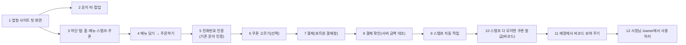

# 앱형 시안 · 눌러서 편집 · 결제 · 스탬프 · 바코드 쿠폰 (APP_COMMERCE_PLAN)

> 2026-09-29 (KST) / Claude. 대표 요청: 스타벅스 앱처럼 공지 팝업·스탬프·쿠폰·앱형 하단 탭, 앱형 시안 추가, 예시 이미지로 시안 품질, 시안을 눌러서 편집(구역 순서·추가·삭제까지).
> **대표 결정(같은 날)**: ① 앱형 시안은 3안 중 간결형을 교체 ② 스탬프는 **결제할 때 자동 적립, 결제 UI까지 완성** ③ 쿠폰은 **바코드, 발급·사용 처리 기능까지** ④ 편집은 **구역 순서·추가·삭제까지**. 멤버십 카드·Pay 충전은 소규모 가게에 안 맞아 뺀다.
> D42(3주 부품 확장 금지)의 대표 예외. 결제는 [PAYMENT_PLAN](PAYMENT_PLAN.md) 결정(포트원 V2, 개발은 지금·실결제는 계약 뒤)을 따른다.

## 0. 결론

- 결제는 **포트원 테스트 채널로 화면·흐름을 끝까지 완성**한다. 실제 돈은 포트원 계약·파트너 정산 신청·약관 고지가 끝난 뒤 키만 바꿔 연다(PAYMENT_PLAN §2.3 법 확인 전 실결제 금지). 베타 사이트에는 "테스트 결제" 표시.
- 스탬프·쿠폰은 **전화번호 인증 손님**(이미 있는 `customers`·문자 인증)에 붙인다. 따로 회원가입을 만들지 않는다.
- 쿠폰 바코드는 Code128을 서버에서 SVG로 그린다(외부 라이브러리·외부 호출 없음). 사장님은 `/owner`에서 번호 입력 또는 휴대폰 카메라로 읽어 사용 처리한다.
- 10/15 동결 안에 **물결 1·2는 베타에 넣고, 3·4는 테스트 결제로 베타에 넣되 실결제는 뒤**로 한다.

## 1. 손님 흐름

| 번호 | 단계 | 설명 |
|---|---|---|
| 1 | 앱형 첫 화면 | 흰 바탕·둥근 카드·큰 인사 문구·강조색 하나. 상단 내비 대신 하단 탭 |
| 2 | 공지 띠·팝업 | 사장님이 공지를 켰을 때만. 팝업은 닫기만: 공개 사이트는 CSP sandbox(출처 없음)라 기기 저장소를 못 써 "오늘 하루 보지 않기"를 뺐다(9/30) |
| 3 | 하단 탭 | 홈·메뉴·스탬프·쿠폰(예약 가게는 예약). 휴대폰 폭에서만, 넓은 화면은 상단 |
| 4 | 담기·주문 | 메뉴 부품의 "담기"(지금 `order-soon` 자리)를 실제 장바구니로 |
| 5 | 번호 인증 | 결제·스탬프·쿠폰의 손님 식별. 기기 기억 90일(CUSTOMER_PLAN) |
| 6 | 쿠폰 적용 | 받은 쿠폰을 결제에 쓰면 할인. 매장용 쿠폰은 7로 가지 않고 11로 |
| 7 | 결제 | 앱 주소의 `/pay/{id}`(공개 사이트는 CSP라 결제창을 못 띄움, PAYMENT_PLAN §3.3) |
| 8 | 결제 확인 | 포트원 조회 금액·상태가 DB 주문과 같을 때만 `paid`. 웹훅도 같은 길, 한 번만 |
| 9 | 스탬프 적립 | 결제 확정 1건당 가게 규칙대로(기본 1잔=1개). 환불되면 회수 |
| 10 | 쿠폰 발급 | 기본 10개 → "음료 1잔 무료" 쿠폰. 사장님이 개수·혜택을 정함 |
| 11 | 바코드 | 쿠폰 화면에 Code128 바코드 + 숫자. 화면 밝기 안내 |
| 12 | 사용 처리 | 사장님이 번호 입력 또는 카메라(지원 기기)로 읽고 "사용". 두 번 못 씀 |

## 2. 물결

| 물결 | 날짜(KST) | 일 | 합격 기준 |
|---|---|---|---|
| 1 시안 | 9/30~10/3 | 앱형 스타일 계열(간결형 교체) + 하단 탭 부품 + 공지 팝업 부품 + 업종별 예시 사진 보강(미용실·학원·공방·펜션) | 3안 첫 화면 차이 8 이상(지금 사진 있는 4업종 미달), 390px 캡처, 공개 전 검사 통과 |
| 2 편집 | 10/2~10/8 | 시안을 실제 모양 그대로 보며 글자·가격·사진을 눌러 고치기 + 구역 순서·숨기기·추가(부품 목록에서) | 고친 것이 새로고침·공개 뒤에도 남음, 편집 표시는 공개본에 0건. 계약 [EDIT_WAVE2_CONTRACT](EDIT_WAVE2_CONTRACT.md) |
| 3 결제 | 10/5~10/10 | 장바구니·주문·`/pay` 결제 페이지·완료·웹훅(포트원 테스트), `/owner` 주문 목록·환불 | 테스트 카드로 결제→`paid`, 금액 위조 거절, 웹훅 두 번 와도 한 번. 계약 [PAY_WAVE3_CONTRACT](PAY_WAVE3_CONTRACT.md) |
| 4 스탬프·쿠폰 | 10/8~10/13 | 표 `stamps`·`coupons`(0018), 결제 확정 시 적립, 쿠폰 발급·바코드 SVG·사용 처리·결제 할인 | 적립·회수·발급·사용 1회 제한 테스트, 실기기 바코드 읽기 1회. 계약 [STAMP_WAVE4_CONTRACT](STAMP_WAVE4_CONTRACT.md) |

## 3. 데이터 (0018 — 0017은 물결 3 `shop_settings.order_on`)

| 표 | 칸 |
|---|---|
| `stamp_rules` | shop_id, per_amount 또는 per_item, goal(기본 10), reward_title, reward_value, active |
| `stamp_events` | shop_id, customer_id, payment_id, delta(+1/-1), created_at — 합계가 곧 도장 수(따로 저장하지 않음) |
| `coupons` | id, shop_id, customer_id, code(12자리 숫자, 가게 안에서 유일), title, kind(무료·정액·정률), value, status(issued·used·expired), issued_at, used_at, used_by, source(stamp·owner) |

## 4. 위험

| 위험 | 대응 |
|---|---|
| 실결제 법 문제(PG 등록) | 테스트 채널만. 실결제는 포트원 문서 확인 뒤(PAYMENT_PLAN §2.3) |
| 공개 사이트는 CSP·스크립트 최소 | 팝업 여닫기만 작은 인라인 스크립트, 결제·스탬프·쿠폰 화면은 앱 주소 페이지 |
| 바코드 위조·재사용 | 코드는 서버 난수, 사용은 사장님 로그인 + `SELECT … FOR UPDATE`로 한 번만 |
| iOS는 카메라 바코드 읽기(BarcodeDetector) 미지원 | 숫자 입력을 기본, 카메라는 되는 기기에서만 |
| 일정 | 물결 3·4가 밀리면 베타는 "결제 화면 미리보기"로, 적립은 사장님 수동 적립으로 대체 |

## 변경 이력

| 날짜 | 내용 |
|---|---|
| 2026-09-29 | 처음 작성 (대표 결정 ①~④) |
| 2026-09-30 | 물결 4 계약서 [STAMP_WAVE4_CONTRACT](STAMP_WAVE4_CONTRACT.md): 적립은 결제 확정·회수는 전액 환불, 도장 수는 이벤트 합, 쿠폰 held 15분(cron 없음), Code128-C SVG 직접 |
| 2026-09-30 | 물결 3 계약서 [PAY_WAVE3_CONTRACT](PAY_WAVE3_CONTRACT.md): 포장 주문 가게만, JS 없는 수량 폼, httpx 직접 호출, 마이그레이션 0017=order_on·스탬프는 0018 |
| 2026-09-30 | 물결 2 계약서 [EDIT_WAVE2_CONTRACT](EDIT_WAVE2_CONTRACT.md) |
| 2026-09-30 | 공지 팝업에서 '오늘 하루 보지 않기' 뺌 (sandbox라 저장 불가, 대표 확인) |
