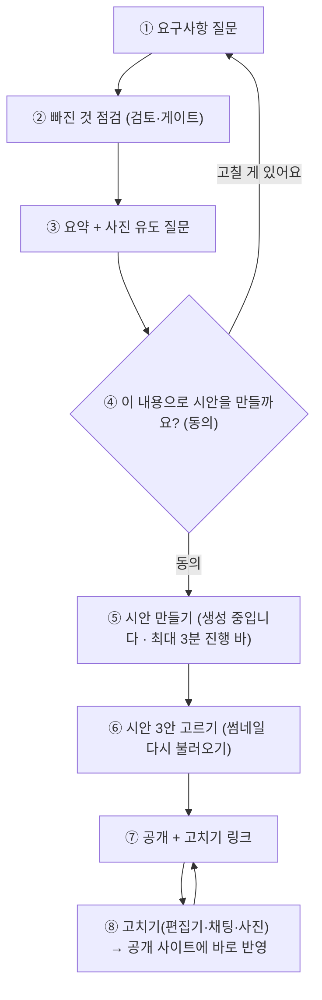

# 베타 흐름 핫픽스 계약·작업판 (BETA_FLOW_PLAN)

> 2026-09-28 (KST). 대표 요청 6가지(같은 날 채팅)를 한 번에 고친다. **계획·계약·검토는 Claude, 구현은 OpenCode** (BUILD_W1_W2 §0 운영 방식 그대로).
> 계약(§2)을 바꾸려면 Claude와 먼저 합의한다. 작업(§3)은 "소유 파일"만 고친다.

## 0. 대표 요청과 원인 (코드로 확인한 것)

| # | 요청 | 지금 코드 (원인) |
|---|---|---|
| R1 | 요구사항 답에 가끔 영어가 나온다. 무조건 한국어 | `llm.chat_json`을 부르는 곳(추출·검토·컨셉·문구)마다 한국어 규칙이 없거나 일부만 있다. 대비 모델(ultra·lightning)로 넘어가면 값·설명이 영어로 올 때가 있고, 그 값이 요약·확인 말에 그대로 나간다. 걸러 주는 곳이 없다 |
| R2 | 시안이 가끔 안 나온다. 3분까지 기다리고 "생성 중입니다" 진행 바 | ① 스크린샷(v1~v3.png)이 실패하거나 늦으면 채팅방 썸네일이 `onerror` 한 번에 "미리보기 준비 중"으로 멈춘다(다시 불러오지 않음). ② 시안 만들기(문구·컨셉·원형 판정 LLM + 스크린샷)가 한 요청 안에서 도는데 `GENERATING` 상태는 **끝날 때** 저장돼 기다리는 동안 아무 표시가 없다. ③ 스크린샷 제한 15초 |
| R3 | "객실 4개"라고 하면 공개 사이트에 "객실 4개" 글자만 나온다. 객실마다 사진(올린 사진 → 이미 만든 그림 → Gemini), 여러 개면 옆으로 넘기는 캐러셀, 성수기·비수기 중 지금 요금 표시. 객실만이 아니라 미용실 펌·파마 등도 LLM이 사진 필요 여부를 판단 | `card_data._rooms`가 "객실 4개"를 이름이 "객실 4개"인 객실 **1개**로 만든다. 요금 칸(`price`)의 "성수기 …/비수기 …"는 객실과 이어지지 않아 "가격 문의"로 나온다. 사진은 예시 팩 `room:1`만 붙는다. Gemini 그림은 방마다 `hero·gallery-1·gallery-2` 세 칸 이름으로만 저장되고 **뜻 태그가 없다**. 사장님 사진도 설명(caption)뿐이고 채팅방 올리기에는 설명 칸도 없다 |
| R4 | 베타는 견적 단계 없이 바로 시안으로. 그 전에 빠진 것 점검, 사진이 필요한 곳이면 사진 올리기를 유도하는 질문. 견적 버튼도 빼기 | 흐름이 요약 → 승인 → **견적(QUOTED) → 진행** → 시안. 방 화면에 "견적을 진행할까요?"·"이 견적으로 진행할까요? 🚀 진행" 막대가 있다. 빠진 것 점검(검토·게이트)은 요약 전에 이미 돈다. 사진 질문은 식당·카페·펜션만 무엇을 찍을지 말한다 |
| R5 | 방에 들어오면 자동으로 읽어 주고, 사용자가 입력하면 멈췄다가, 다음 답이 오면 다시 읽기 (핫픽스) | "답변 읽어주기"가 **기본 꺼짐**(localStorage `agt001_autoread`가 `'1'`일 때만). 들어올 때 받은 글(첫 안내·지난 답)은 읽지 않는다. 입력 시작·보내기 때 멈추는 것은 이미 있다 |
| R6 | 공개 뒤 고칠 수 있는 링크를 주고, 고친 게 공개 사이트에 다시 반영 | 반영은 이미 된다(채팅 고치기·직접 고치기 PUT·사진 올리기가 모두 `publish_choice`를 다시 부른다). 없는 것: 공개 답에 **고치기 링크가 없다**(더보기 안 "직접 고치기"에 숨어 있음). 편집기는 같은 브라우저의 member id로만 열려서 다른 기기(카톡으로 받은 링크)에서는 안 열린다 |

## 1. 새 베타 흐름

| 번호 | 단계 | 설명 |
|---|---|---|
| ① | 요구사항 질문 | 지금과 같다. 펜션은 요금 질문(성수기·비수기)이 하나 늘어난다(§2.5) |
| ② | 빠진 것 점검 | 지금 있는 검토(리뷰어)·게이트가 요약 전에 돈다. 바뀌지 않는다 |
| ③ | 요약 + 사진 유도 | 사진이 들어가는 섹션(객실·메뉴·작품 등)이 있으면 무엇을 올리면 좋은지 구체적으로 묻는다(§2.4) |
| ④ | 시안 동의 | 예전 "참고 견적을 만들어 볼까요?"를 "시안을 만들어 볼까요?"로 바꾼다. 견적 단계(QUOTED)는 건너뛴다(§2.3) |
| ⑤ | 시안 만들기 | 시작할 때 방 상태를 바로 `GENERATING`으로 저장해 모두에게 진행 바가 보인다. LLM 준비 단계는 전체 3분 안에 끝나게 자른다(§2.2) |
| ⑥ | 시안 고르기 | 썸네일이 아직 없으면 "생성 중입니다" 막대를 보이고 5초마다 다시 불러온다(3분까지) |
| ⑦ | 공개 | 공개 답에 편집기 링크를 붙인다. 로그인한 방장은 다른 기기에서도 열린다(§2.6) |
| ⑧ | 다시 반영 | 지금 있는 재공개 경로 그대로 |

## 2. 계약

### 2.1 한국어 (R1) — 모든 LLM 호출이 지나는 곳에서 한 번에

- `app/llm.py`
  - 상수 `KO_RULE = "사람에게 보이는 글(값·설명·이유·답·문구)은 모두 한국어로 쓴다. 영어로 번역하지 않는다. 사장님이 영어로 쓴 가게 이름·주소·링크·이메일은 그대로 둔다. JSON 키와 정해진 목록의 영문 값은 그대로 쓴다."`
  - `chat_json(system, …)`은 실제 보내는 system을 `KO_RULE + "\n" + system`으로 만든다. `chat(messages)`는 첫 메시지가 system이 아니면 `{"role": "system", "content": KO_RULE}`를 앞에 붙인다(예전 1:1 견적).
  - `foreign_words(value: str, source: str = "") -> list[str]` 추가: `value` 안의 ① 영문 낱말(`[A-Za-z]{3,}`) 중 `source`에 (대소문자 무시) 없는 것, ② 한자·가나(`[\u3040-\u30ff\u4e00-\u9fff]`) 글자 중 `source`에 없는 것을 돌려준다. 숫자·기호·URL 안의 글자는 영문 낱말로 보되, `source`에 그대로 있으면 통과한다.
- 거르는 곳 (값을 버리고 `log.warning`만 남긴다. 대화는 계속된다):
  - `prd_engine.extract_detail`: 결과 `ups` 중 `foreign_words(value, text + " " + (last_question or ""))`가 있는 값은 버린다.
  - `prd_engine._parse_review`: `missing`의 `value`, `conflicts`의 `said`에 `foreign_words(…, said_text)`가 있으면 버린다.
  - `design_concept`: LLM 컨셉의 `name`·`mood`·`reason`, 조정의 `reply`·`mood`에 `foreign_words(…, "")`가 있으면 그 칸은 규칙 값(`rule_concept`의 값, 조정 reply는 규칙 문장)으로 바꾼다.
  - `copywriter.generate`: `tagline`·`intro`·각 `items` 값에 `foreign_words(…, 사장님 원문 + 카드 요약)`가 있으면 그 칸만 비운다(둘 다 비면 기존대로 `None`).
- 영어 enum(팔레트 키 등)·JSON 키는 거르지 않는다. 사장님이 영어로 쓴 가게 이름(예: "Cafe Moon")은 원문에 있으므로 통과한다.

### 2.2 시안 진행 바·3분 (R2)

- `app/config.py`: `design_screenshot_timeout_ms` 기본값 15000 → 60000. 새 값 `design_total_timeout_sec: float = 180.0`.
- `chat_flow`: 시안 만들기 시작 **첫 줄**에서 `_set_room_status(room, "GENERATING", persist=True)`. 문구 초안·컨셉·원형 판정(LLM 3단계)은 시작부터 잰 시간이 `design_total_timeout_sec - 60`(=120초)을 넘으면 남은 단계를 건너뛰고 규칙 값으로 간다(`log.warning("시안 준비 시간 초과, 남은 LLM 단계 건너뜀")`). 스크린샷에 60초를 남기기 위해서다.
- `design.render_variants`: 스크린샷이 실패하면 뒤에서 **한 번** 다시 찍는다(데몬 스레드, 같은 `shots`). 성공하면 `preview.png`도 쓴다. 두 번째도 실패하면 로그만.
- `static/room.html`
  - `STATUS_LABEL.GENERATING = '시안을 생성 중입니다… (최대 3분, 나갔다 와도 돼요)'`.
  - `ai_status`가 `GENERATING`인 동안 상태 막대 아래에 **진행 바**: 처음 본 시각부터 지난 초 `t`로 너비 `min(95, t/180*100)%`, 글 "시안을 생성 중입니다 · {t}초 / 최대 3분". `role="progressbar"`, `aria-valuenow`(0~100), `aria-valuetext`. 상태가 바뀌면 숨기고 시계를 지운다. `prefers-reduced-motion`이면 너비 전환 애니메이션 없음.
  - 시안 카드 썸네일: 불러오기 실패하면 그 자리에 "시안을 생성 중입니다" 글 + 작은 진행 바(같은 규칙)를 보이고, 5초마다 `src`에 `?t=<시각>`을 붙여 다시 불러온다. 카드를 만든 뒤 180초가 지나면 멈추고 "미리보기를 만들지 못했어요 · '크게 보기'로 확인해 주세요". 성공하면 원래 모습.

### 2.3 견적 건너뛰기 (R4)

- `app/config.py`: `quote_enabled: bool = False` (베타). 켜면 예전 흐름 그대로.
- `chat_flow`
  - QUOTED에서 "진행"일 때 하던 시안 만들기 전체를 `_start_design(session_id, session, room) -> str`(답 글)로 옮긴다. 동작은 바꾸지 않는다(§2.2의 상태 저장·시간 자르기는 이 함수 안).
  - AWAIT_APPROVAL에서 승인이면: `quote_enabled`가 False이면 견적 없이 `reply = _start_design(...)`(상태 GENERATING). True이면 예전 그대로.
  - `APPROVAL_ASK`: `quote_enabled`가 False이면 `"이 내용으로 시안을 만들어 볼까요? (승인/거절로 답해주세요)"`.
  - `_TRANSITION_EVENTS`: `("AWAIT_APPROVAL", "GENERATING")` 전이는 `requirement_approved`와 `generate_start` 두 이벤트를 모두 남긴다(값을 튜플로 바꿔도 된다).
  - 빈 메시지 QUOTED 답: `"이대로 시안을 만들까요? (진행/취소)"` (견적 말 빼기).
- `static/room.html`: 동의 막대 글 `'이 내용으로 시안을 만들까요?'`(두 곳), 진행 막대 글 `'이대로 시안을 만들까요?'`, 첫 안내 글에서 "견적을 내고" 빼기("함께 요구사항을 정리하고, 실제로 열리는 시안 페이지를 만들어 드립니다."), 공유 설명 "AI가 견적까지" → "AI가 시안까지". 견적 고지(`참고 견적:`) 코드는 그대로(글이 안 오면 안 보인다).
- 테스트: 예전 견적 흐름을 도는 기존 테스트는 `tests/unit/conftest.py`의 autouse 픽스처가 `settings.quote_enabled = True`로 둔다. 새 테스트는 명시적으로 False로 둔다.

### 2.4 사진 유도 질문 (R4)

- `chat_flow._PHOTO_WHAT`를 넓힌다: restaurant·cafe "대표 메뉴", pension "객실", salon "시술(스타일)", workshop "작품", academy "교실·수업 모습", individual "작업", group "모임 모습".
- `photo_choice_text(card)`: 펜션이고 `card_data.build(card)["rooms"]`가 2개 이상이면 `"객실 {n}개 사진을 올려 주시면 객실 카드마다 하나씩 넣어 드려요. 올릴 때 어느 객실인지 골라 주세요."` 한 줄을 덧붙인다.
- 요약(③)에서: 이미 일찍 물었고 답이 "나중에"이며 사진이 0장이면, 요약 뒤에 한 번만 `"시안 전에 사진을 올리시면 바로 넣어 드려요. 아래 '사진' 버튼을 눌러 주세요."`. (`card["photo_prereminded"] = True`로 한 번만)

### 2.5 객실 카드 (R3)

**객실 목록** (`card_data._rooms`):
- offerings 항목이 `객실|방|룸` + 개수(예: "객실 4개", "방 4개", "4개 객실", "객실 4")면 이름 `"객실 1"`…`"객실 N"`(최대 8) N개로 편다. `source="owner"`, 각 항목에 `"numbered": True`.
- 이름 있는 객실("101호 복층")은 지금 규칙 그대로.

**요금** (`card_data.season_prices(card) -> list[dict]`, 새 함수):
- 읽는 곳: `price` 칸(FILLED만) 글.
- 이름표: `극성수기`, `성수기`, `준성수기`, `비수기`, `주중`(=평일), `주말`. 이름표 뒤 첫 금액(`1박 25만원`, `250,000원`, `25만원`)을 가져온다. 이름표 바로 뒤 괄호 안 기간(`7/15~8/20`, `7월 15일~8월 20일`)이 있으면 `period`로.
- 결과: `[{"label": "성수기", "price": "1박 25만원", "period": "7/15~8/20"}]` (이름표 순서는 글에 나온 순서). 이름표가 없고 금액 하나뿐이면 `[{"label": "", "price": …}]`.
- 기본 기간(사장님이 기간을 안 말했을 때): 성수기 `7/15~8/20`, 극성수기 `7/25~8/10`. 준성수기는 기본 기간 없음(지금 표시 안 함).
- 객실마다: `price_pairs`에 그 객실 요금이 있으면 그것, 없으면 `prices = season_prices(card)`.

**지금 요금** (`card_data.current_label(prices, today) -> str`, 새 함수, 오늘은 KST 날짜):
- 기간이 있는 이름표 중 오늘이 기간 안(연도 무시, 12/20~2/28처럼 해를 넘는 기간 지원)이면 그 이름표(극성수기가 성수기보다 먼저). 아니면 `비수기`가 있으면 `비수기`.
- `주중`·`주말`: 금·토요일이면 `주말`, 아니면 `주중` (숙박 기준: 금·토 밤이 주말 요금).
- 모르면 `""`.

**사진 고르는 순서**는 §2.7의 항목 사진 규칙(객실 이름 = 항목 이름)을 따른다. 예시 팩 차례에서는 `templates/examples/C.json`의 `room:k`를 돌려 쓴다: k = (pos-1) % (팩의 room 사진 수) + 1.

**렌더링** (`site_render._room_items` + `templates/sections/rooms--cards.mustache` + `templates/site.css`):
- 객실이 2개 이상이면 목록에 `s-rooms__list--scroll`: 가로 스크롤 스냅(CSS만, 자바스크립트 없음). 휴대폰에서 카드 너비 85%, 720px 이상 45%, `scroll-snap-type: x mandatory`, 카드 `scroll-snap-align: start`, 목록 `tabindex="0"`·`aria-label="객실 {n}개, 옆으로 넘겨 보세요"`, 목록 위 작은 안내 "옆으로 넘겨 보세요 → ({n}개)". 1개면 지금 모양.
- 요금이 `prices`로 오면 카드 안에 요금표: 행마다 이름표·(기간)·금액, 지금 요금 행에 `is-current` 클래스와 "지금 적용" 뱃지. 행에 `data-from="07-15" data-to="08-20"` 또는 `data-dow="5,6"`(주말) / `data-dow="0,1,2,3,4"`(주중)를 단다.
- 공개본(`public=True`)에만 인라인 스크립트 하나(외부 스크립트 금지, 20줄 안): 방문자 날짜(Asia/Seoul)로 `is-current`·뱃지를 다시 매긴다. 서버가 그린 표시는 스크립트가 못 돌 때의 기본값. 시안(스크립트 막힘)은 서버 표시 그대로.
- `rooms[].price`(한 줄 요금)는 지금 요금이 있으면 그 금액, 없으면 기존 규칙.

**펜션 요금 질문** (`prd_schema`): 펜션 `required`에 `price`를 넣고 질문 `"객실 요금을 알려 주세요. 성수기·비수기가 다르면 둘 다 알려 주세요. (예: 성수기 1박 25만원, 비수기 1박 15만원)"`, 선택지 `("나중에 넣을게요",)`.

### 2.6 공개 뒤 고치기 (R6)

- `chat_flow._publish` 성공 답 끝에 (방이 있을 때만):
  `"\n사이트 고치기: {base}/editor?room={room_id}\n고친 내용은 공개 사이트에 바로 반영돼요. 채팅으로 '전화번호는 010-…이에요'라고 말하거나 사진을 올려도 바로 바뀌어요."`
- `app/api/card.py`: 방 멤버 확인을 `X-Member-Id` **또는** 로그인 세션으로 한다. 로그인 사용자에게 `user_rooms`(room_id, user_id) 행이 있으면 그 행의 `member_id`를 멤버로 본다(방장 판정도 그 member_id로). GET·PUT 둘 다.
- `static/room.html`: 공개된 방(`card.published` 또는 AI 답에 `/site/` 주소)에서 방장에게 입력줄 위에 "사이트 고치기" 버튼(편집기 링크)을 보인다. 더보기 안 링크는 그대로 둔다.
- 편집기(`CardEditor`): 카드를 못 불러오면(다른 기기·로그인 안 함) 지금처럼 목업(가짜 예시 화면)을 보이지 않고 "이 기기에서는 사이트를 고칠 수 없어요" + 카카오·구글 로그인(`next=/editor?room=<id>`) + 채팅방 링크를 보인다.

### 2.9 카카오톡 초대 (대표 추가 요청 "카카오톡 초대가 갑자기 안 됨")

- 운영에서 재현한 원인: "링크 만들기"가 `fetch`·`json`·`clipboard`를 기다린 **뒤에** `Kakao.Share.sendDefault`를 불러, 누름 권한이 사라진 상태에서 공유 팝업이 막힌다. 막히면 SDK가 `null.focus` 오류를 내고, 그 오류를 잡은 곳이 "인터넷 연결을 확인하고 다시 시도해 주세요"를 보였다. 카카오 앱 키·도메인 검증은 정상(sharer가 302로 선택 화면을 줌), 초대 토큰으로 입장하는 서버 경로도 정상.
- 고침: 링크 만들기는 링크만 만들고 복사한다. 대화상자를 열 때 링크를 미리 만들어 두고, "카카오톡 공유"는 누름 안에서 바로 SDK를 부른다. SDK가 실패하면 링크를 복사하고 "카톡 대화방에 붙여 넣어 주세요"로 안내한다.

### 2.7 항목 사진: LLM 판단·태그·그림 (R3 + 대표 추가 요청 "미용실 펌·파마 등도 LLM이 사진 필요 여부 판단")

객실만이 아니라 **업종의 대표 항목**(객실·메뉴·시술·수업·작업)마다 사진이 필요한지 LLM이 판단하고, 필요한 항목은 사진을 유도·태그·표시한다.

**항목 후보** (`photo_needs.items(card) -> list[dict]`, 새 파일 `app/services/photo_needs.py`, 결정론):
- `card_data.build(card)`에서: 원형 C → `rooms` 이름(kind `room`), A → `catalog` 품목 이름(kind `menu`), B → `catalog` 품목(kind `style`), D·E → `classes` 이름(없으면 catalog, kind `class`), 그 밖 → catalog 품목(kind `work`). 이름 중복 없이 최대 8개. `[{"name": "펌", "kind": "style"}]`.

**판단** (`photo_needs.judge(card) -> list[str]`, 사진이 필요한 항목 이름 목록):
- `card["photo_needs"] = {"sig": <후보 이름을 "|"로 이은 값>, "need": [...]}`에 둔다. `sig`가 같으면 다시 부르지 않는다(카드마다 1번, 항목이 바뀌면 다시).
- LLM(`llm.chat_json`, timeout 10초, max_tokens 200) 시스템 글: 업종·항목 목록을 주고 "손님이 사진을 보고 고르거나 결과를 기대하는 항목만" 고르게 한다. 출력 `{"need": ["펌", "염색"]}`. 후보 밖 이름은 버린다.
- LLM 실패·형식 오류면 규칙: kind `room`·`menu`·`style`·`work`는 모두 필요, `class`는 이름에 `체험`·`원데이`·`공방`·`만들기`가 있을 때만.
- 부르는 때: 요약 게이트(`chat_flow._gate_or_summary`, 요약 글을 만들기 직전) 한 번. 실패해도 대화는 계속.

**사진 유도 질문** (§2.4의 펜션 문장을 이것으로 바꾼다): 필요한 항목이 있으면 사진 선택지 글에 `"사진이 있으면 좋은 항목: {이름들(최대 5개, 넘으면 '외 n개')}. 올릴 때 어느 항목 사진인지 골라 주세요."` 한 줄을 넣는다.

**태그**:
- `photos.add(..., caption=None, tag=None)`: `tag`는 `hero`, `space`, 또는 `item:<이름>`(이름은 지금 `photo_needs` 후보 안에 있어야)만 받고 아니면 버린다. 카드 사진 dict에 `"tag"`로 둔다(DB 표는 안 바꾼다). `app/api/rooms.py` 사진 올리기에 `tag: Optional[str] = Form(default=None)`.
- `app/api/card.py` GET 응답에 `photo_tags: [{"tag": "item:펌", "label": "펌"}, …, {"tag": "space", "label": "가게·공간"}]` — 필요한 항목(판단 결과가 없으면 후보 전체) + space. 항목이 없으면 `[{"tag": "space", …}]`만.

**항목 사진 고르는 순서** (`card_data.item_photo(card, name) -> dict | None`는 사장님 사진만 본다):
1. 사장님 사진 중 `tag == "item:" + 이름` 또는 설명(caption)에 이름이 들어 있는 것(공백 무시) — 첫 장.
2. 이 가게의 Gemini 그림 `card["ai_images"]["item:" + 이름]["url"]` (`/uploads/`로 시작할 때만), 표시 "AI 예시"(`image_ai`).
3. 예시 팩 사진(객실은 `room:k`, 시그니처는 지금처럼 `category:<분류>`), `image_example`.
- 쓰는 곳: 객실 카드(`_fill_rooms`), 시그니처 카드(`_fill_signature`). 사진첩(`_fill_gallery`·`_fill_menu_photos`)은 지금처럼 사장님 사진을 쓰되, 설명이 없고 태그가 `item:`이면 그 이름을 설명으로 쓴다.
- 여러 장이 가로로 놓이는 카드 목록(객실 2개 이상, 시그니처 2개 이상)은 §2.5의 가로 스크롤(캐러셀) 클래스를 같이 쓴다.

**Gemini 그림** (`ai_images`):
- 칸 이름 `item:<이름>`. 저장 파일 `ai-item-<md5(이름) 앞 8자>.jpg`. `prompt_for(kind, "item:<이름>")`은 업종·항목 kind에 맞춘 실사 프롬프트에 이름을 넣는다(글자·로고·얼굴 클로즈업 없음). 설정은 갤러리 칸과 같다.
- `ensure(room_id, "items")`: 판단 결과 필요한 항목 중 사장님 사진(`card_data.item_photo`)도 AI 그림도 없는 것만, **한 가게 최대 4장**. 사장님 사진이 하나라도 있으면 전부 건너뛰던 지금 규칙은 `hero·gallery` 칸에만 적용한다. `"all"`은 지금 칸 + `items`.
- 시안 만들기(`_start_design`)에서: 필요한 항목 중 사진 없는 것이 있고, Gemini 키가 있고(`keystore.get("gemini_api_key")`), 방이 있고, `card["item_images_requested"]`가 없으면 표시를 남기고 커밋 뒤 `ai_images._ensure_async(room_id, "items")`를 한 번 부른다(끝나면 기존 경로가 시안·공개본을 다시 그린다).
- `app/api/rooms.py` AI 이미지 `slot`에 `"items"`를 받는다.

**화면** (`static/room.html`): 사진을 고른 뒤 보내기 전에, `GET /api/rooms/{id}/card`의 `photo_tags`가 2개 이상이면 "어느 사진인가요?" 고르기(버튼 목록, 기본 "고르지 않음")를 보이고 고른 값을 `tag`로 함께 보낸다.

### 2.8 음성 읽기 (R5)

- `static/voice.js`
  - 답변 읽어주기 기본값을 **켜짐**으로: 저장 값이 `'0'`일 때만 꺼짐(사장님이 끈 것은 존중).
  - 새 함수 `window.speakOnEnter(text)`: 방에 처음 들어와 지난 글을 다 받은 직후 한 번, 마지막 AI 답(없으면 첫 안내 글)을 읽는다. 읽어주기가 꺼져 있거나 전화 중이면 안 읽는다.
  - 브라우저가 자동 재생을 막으면(`play()` 거절) 끄지 않고, 입력줄 위에 한 줄 "🔊 눌러서 안내 듣기" 버튼을 보인다. 누르면 그 글을 읽고 버튼을 없앤다. 또 첫 누름(입력칸·보내기 버튼 밖 아무 곳)에서도 대기 중인 입장 글을 한 번 읽는다. 입력칸에 글자를 치기 시작하면 대기 중인 입장 읽기는 버린다.
  - 입력 시작·보내기·선택지 누름에 읽기를 멈추는 것은 지금 그대로. 새 AI 답이 오면 읽는 것도 그대로(기본 켜짐이 되어 이제 돈다).
- `static/room.html`: 첫 조회를 마친 곳(`historyDone = true` 직후)에서 `window.speakOnEnter(마지막 ai_reply 글 또는 ONBOARDING_TEXT)`를 한 번 부른다.

## 3. 작업판

공통 머리말(모든 작업 앞에 붙인다)은 `scratchpad/opencode_header.md`에 있다: 금지 사항은 BUILD_W1_W2 §0과 같고, DB 테스트는 돌리지 않는다.

| 물결 | 작업 | 소유 파일 | 계약 |
|---|---|---|---|
| 1 | **K** 한국어 | `app/llm.py`, `app/services/prd_engine.py`, `app/services/design_concept.py`, `app/services/copywriter.py`, 새 `tests/engine/test_korean_guard.py` | §2.1 |
| 1 | **F** 흐름·공개 | `app/services/chat_flow.py`, `app/config.py`, `app/services/design.py`, `app/api/card.py`, `tests/unit/conftest.py`, 새 `tests/unit/test_beta_flow.py` | §2.2(서버), §2.3(서버), §2.4, §2.6(서버) |
| 1 | **U** 방 화면·음성 | `static/room.html`, `static/voice.js` | §2.2(화면), §2.3(화면), §2.6(화면), §2.8 |
| 2 | **R1** 객실·항목 카드 그리기 | `app/services/card_data.py`, `app/services/site_data.py`, `app/services/site_render.py`, `templates/sections/rooms--cards.mustache`, `templates/sections/offerings--cards.mustache`, `templates/css/40-w2-parts.css`, `app/services/prd_schema.py`, 새 `tests/engine/test_rooms_season.py` | §2.5, §2.7(사진 순서·가로 스크롤) |
| 2 | **R2** 사진 판단·태그·그림 | 새 `app/services/photo_needs.py`, `app/services/ai_images.py`, `app/services/photos.py`, `app/api/rooms.py`, `app/api/card.py`, `app/services/chat_flow.py`, 새 `tests/unit/test_photo_needs.py` | §2.7(판단·유도·태그·Gemini) |
| 2 | **R3** 사진 태그 고르기 + 카카오 초대 | `static/room.html` | §2.7(화면), §2.9 |
| 2 | **R4** 편집기 로그인 안내 | `frontend/src/editor/CardEditor.tsx`, `frontend/src/editor/CardEditor.test.tsx` | §2.6(편집기) |

물결마다 끝나면 Claude가 검토하고 DB 전체 테스트를 돌린다. 마지막에 펜션 한 건을 처음부터 공개·고치기까지 돌려 흐름을 점검한다(§4).

## 4. 흐름 점검 (마지막)

펜션 대화 한 건: 인사 → 질문(객실 4개, 성수기·비수기 요금) → 요약·사진 유도 → 동의 → 시안(진행 바) → 2안 고르기 → 공개(고치기 링크) → 편집기로 전화번호 고치기 → 공개 사이트 반영 확인. 한국어가 아닌 답이 섞이는지, 견적 말이 남았는지도 본다.
