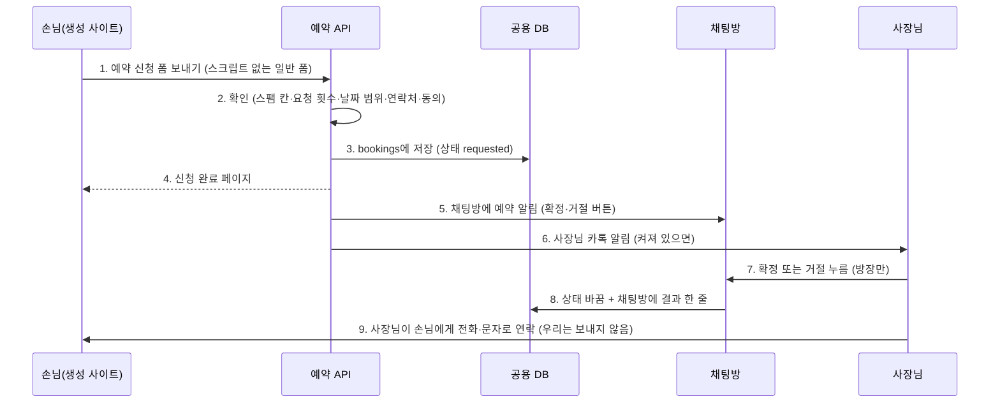

# 예약 신청 받기 (플랫폼 공용 ②) — 1단계 계획·계약

> 작성 2026-09-27 17시, Claude(PM). 근거: DECISIONS D31(공용 기능 + AI는 화면만)·D32 ②(예약·신청 받기)·D13(결제 제외).
> 목표: **오늘 안에** 생성 사이트에서 손님이 예약을 신청하면 공용 DB에 쌓이고, 사장님이 채팅방에서 확정·거절한다.
> 기준 구현: 문의 받기(`app/services/inquiries.py`, `app/api/inquiries.py`, `templates/sections/contact--form.mustache`) 틀을 그대로 따른다.

## 0. 1단계 범위

| 한다 | 안 한다 (다음 단계) |
|---|---|
| 손님: 날짜·시간·메뉴·인원·이름·연락처·메모로 **예약 신청** → "신청됐어요, 가게에서 확인 후 연락드려요" | 빈 시간만 보여 주기·자동 확정(2단계) |
| 공용 DB 한 표(`bookings`)에 사이트 키로 구분해 저장, 상태 `requested → confirmed / declined` | 손님 문자·알림톡(3단계, D6) |
| 사장님: 채팅방 알림 + 카톡 알림, 채팅방에서 **확정·거절** 버튼(방장만) | 예약금·결제(D13) |
| 방문일 + 30일 뒤 자동 삭제, 개인정보 동의 필수 | 네이버 예약 연동(공개 API 없음). 예약 주소가 있으면 지금처럼 링크 |

## 1. 흐름

| 번호 | 설명 |
|---|---|
| 1 | 생성 사이트는 CSP sandbox라 스크립트가 없다. 날짜는 `<input type=date>`, 시간은 `<select>`(영업시간 30분 간격) 또는 `<input type=time>` |
| 2 | 문의와 같은 규칙: 숨김 칸(website) 채워지면 저장 없이 성공처럼, IP당 10분 5건, 날짜는 오늘~60일 뒤, 인원 1~20, 연락처는 전화번호, 동의 필수 |
| 3 | 한 표에 모든 가게. `site_key`로 구분 |
| 4 | `/api/bookings/{site_key}/done`로 303. 스크립트 없는 안내 페이지 |
| 5 | 채팅 메시지 kind=`booking`, meta에 예약 id·상태. 화면에는 `booking: {id, status}`만 공개 |
| 6 | 기존 `notify.owner_kakao` 재사용 |
| 7~8 | `POST /room/{room_id}/bookings/{id}/decision` (방장만). 이미 결정된 것은 다시 못 바꿈(409) |
| 9 | 손님 알림은 1단계에 없다. 채팅 알림에 손님 전화번호가 `tel:` 링크로 보인다 |

## 2. 계약 (병렬 작업의 기준 — 바꾸려면 Claude와 먼저 합의)

### 2.1 DB `bookings` (Alembic 0010)

| 칸 | 형 | 설명 |
|---|---|---|
| id | bigint PK | |
| ts | timestamptz | 신청 시각 |
| site_key | text, 색인 | `sessions.requirement_id` |
| visit_date | date | 방문일 |
| visit_time | text | "HH:MM" |
| service | text null | 메뉴·객실·수업 이름 |
| party | int | 1~20 |
| name | text null | |
| phone | text | |
| memo | text null | 최대 300자 |
| status | text | `requested` / `confirmed` / `declined` |
| decided_at | timestamptz null | |

삭제: `visit_date + 30일`이 지나면 매일 한 번 지움(앱 시작 시·문의 삭제와 같은 자리).

### 2.2 손님 폼 → `POST /api/bookings/{site_key}` (x-www-form-urlencoded)

필드 이름 고정: `date`(YYYY-MM-DD), `time`(HH:MM), `service`(선택), `party`(숫자), `name`(선택), `phone`(필수), `memo`(선택), `agree`(=yes), `website`(숨김 스팸 칸).
성공 303 → `/api/bookings/{site_key}/done`. 실패 400·429는 한 줄 사유 페이지(문의와 같은 모양).

### 2.3 시안 섹션 (design_variants → site_render → 템플릿)

- 섹션: `{"id": "booking", "type": "booking", "variant": "form", "content": {"services": ["컷트", "염색"], "time_options": ["10:00", "10:30", …], "note": "가게에서 확인 후 연락드려요"}}`
- `time_options`가 비면 템플릿은 `<input type=time>`으로.
- 템플릿 컨텍스트: `site_key`, `retention_days`(=30), `services`, `service_label`(업종 라벨), `time_options`, `note`, `id`.
- **방문일 min/max는 HTML에 넣지 않는다**(통합 때 변경): 생성 사이트는 스크립트가 없어 공개 날짜로 굳고, 두 달 뒤엔 고를 날이 없어진다. 범위는 서버가 한국 날짜로 검사한다. 시간 선택지가 없으면 시간은 선택 입력.
- 제목 id: `booking-title-{{id}}` (버튼이 `#booking-title-booking`으로 내려옴).

### 2.4 채팅방 메시지·결정

- 메시지: `kind: "booking"`, 공개 필드 `booking: {"id": 12, "status": "requested"}` (그 밖 meta는 숨김).
- 결정: `POST /room/{room_id}/bookings/{id}/decision`, 헤더 `X-Member-Id`, JSON `{"decision": "confirm" | "decline"}` → 200 `{"id":12,"status":"confirmed"}` / 403 방장 아님 / 404 / 409 이미 결정.
- 현재 상태: `GET /room/{room_id}/bookings` (방장만) → `{"bookings":[{"id","status"}]}` — 새로고침 뒤 버튼 상태 복원용.

### 2.5 언제 예약 섹션을 넣나 (design_variants)

- 카드 `booking_mode == "native"`이면 넣는다. 요구사항 대화에서 "예약은 어떻게 받으세요?"에 **"여기서 받을게요"**를 고르면 native.
- `booking_url`(외부 예약)이 있으면 넣지 않고 지금처럼 링크.
- 둘 다 없으면: 업종이 미용실·펜션·식당·공방·학원이면 넣는다(학원은 "상담 예약"), 카페는 넣지 않는다.
- 첫 화면 예약 버튼(cta)은 native면 `#booking-title-booking`으로.

## 3. 병렬 작업 (파일 소유 — 남의 파일 수정 금지)

| 트랙 | 담당 | 소유 파일 | 내용 |
|---|---|---|---|
| **C** 서버·DB·엔진 연결 | Claude | `alembic/versions/0010_bookings.py`, `app/db/models.py`(BookingRow), `app/services/bookings.py`, `app/api/bookings.py`, `app/main.py`, `app/services/rooms.py`(공개 필드), `app/services/design_variants.py`, `app/services/prd_engine.py`·`prd_schema.py`(선택지), `tests/unit/test_bookings.py` | §2.1·2.2·2.4·2.5 |
| **O1** 예약 폼 부품 | OpenCode | `templates/sections/booking--form.mustache`, `templates/site.css`(s-booking만 추가), `templates/README.md`(부품 목록 한 줄), `app/services/site_render.py`(booking 섹션 컨텍스트만), `tests/unit/test_booking_section.py` | §2.3. 스크립트 없음, 360px, 44px 누름 칸, 라벨·aria |
| **O2** 채팅방 예약 알림 | OpenCode | `static/room.html` | kind=booking 말풍선(노란 문의와 다른 색), 방장에게만 확정·거절 버튼, 누르면 §2.4 호출 후 결과 표시, 입장 시 `GET /room/{id}/bookings`로 상태 복원, 손님 전화번호 `tel:` 링크 |
| **O3** 버튼 동작 점검 | OpenCode | `evals/run_site_quality.py`, `evals/tests/` 새 파일 | 공개 사이트의 모든 누를 것 점검: tel·sms 번호 = 카드, 예약 링크 = booking_url, 폼 action·필수 칸, `href="#"` 등 죽은 버튼 0 |

## 4. 오늘 일정

| 시각 | Claude | OpenCode (동시에) |
|---|---|---|
| 17:30 | 이 문서(계약) 확정 → O1·O2·O3 출발 | — |
| 17:40~19:00 | C: DB·서비스·API·테스트 | O1 폼 부품 / O2 채팅방 말풍선 / O3 버튼 점검 |
| 19:00~19:30 | C: design_variants·엔진 선택지 연결 | (끝난 것 대기) |
| 19:30~20:30 | 통합: O1·O2·O3 검토, 전체 테스트, 로컬에서 폼 전송 → 채팅 알림 → 확정까지 한 바퀴, 360px 화면 확인, 커밋 | 검토 지적 반영 |
| 20:30~ | 푸시 → **사용자가 `scripts/deploy.sh --auto-rollback`** → 휴대폰으로 실제 신청·카톡 알림·확정 확인 | — |

## 5. 기본값 (바꾸려면 말씀만)

방문일 + 30일 보관 · 오늘~60일 뒤까지 신청 · 영업시간 안 30분 간격(영업시간 모르면 시간 직접 입력) · 인원 1~20 · 손님 알림 없음(사장님이 연락) · 카페는 기본 예약 없음.
