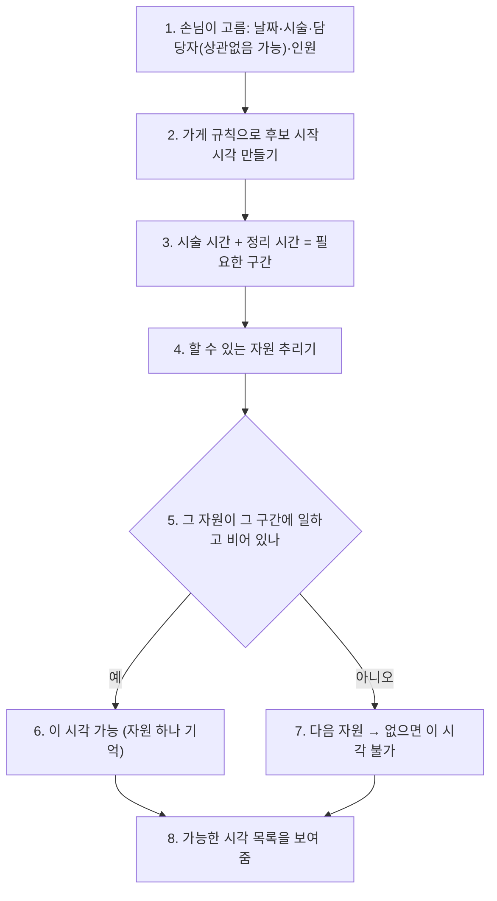
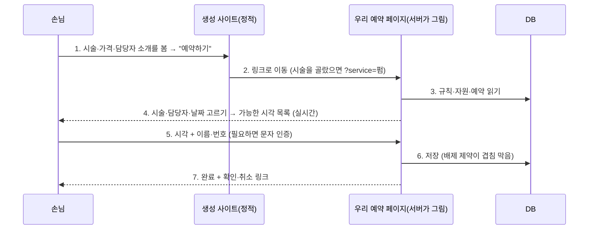

# 예약 규칙: 담당자·시술 시간·테이블·가게별 예약 시간 (BOOKING_RULES_PLAN)

> 2026-09-28 (KST) / Claude. 대표 질문: "디자이너마다 펌 시간이 다르고, 식당은 테이블이 있고, 예약 받는 시간도 가게마다 다른데 해결책은?"
> 먼저 읽은 것: `app/services/availability.py`, `app/api/bookings.py`, `templates/sections/booking--slots.mustache`, [CUSTOMER_PLAN](CUSTOMER_PLAN.md), [BOOKING_PLAN](BOOKING_PLAN.md).
> 성격: 설계 제안. 구현 전 대표 결정(§7) 필요.

## 0. 지금 구조의 한계

| 지금 | 문제 |
|---|---|
| 시간 칸이 60분 고정(`SLOT_MIN = 60`) | 컷 30분·펌 2시간 30분이 똑같이 1칸. 펌 손님이 14시에 들어오면 15·16시도 막혀야 하는데 안 막힌다 |
| 담당자는 이름만 시술 칸 글자에 붙임, 정원 = 담당자 수 | "누가" 비었는지 모른다. 원장이 바빠도 실장이 비면 원장 지명 예약이 들어온다 |
| 테이블 개념 없음 | 식당 2인석·4인석, 6명 단체를 가릴 수 없다 |
| 예약 받는 시간 = 영업시간 전체 | 브레이크 타임, 마감 1시간 전까지만, 2시간 전까지만 받기 같은 가게 규칙이 없다 |
| 빈 시간을 공개 때 계산해 사이트에 박음 | 사이트는 스크립트가 없어 손님이 시술·담당자를 고른 뒤 그에 맞는 빈 시간을 다시 계산할 수 없다 |

## 1. 해결 방향 한 줄

**"자원(담당자·테이블·객실) × 시술 시간 × 가게 규칙"으로 빈 시간을 계산하고, 시간 고르기는 사이트가 아니라 우리 서버의 예약 페이지에서 실시간으로 한다.** 겹침은 DB가 막는다.

## 2. 데이터 모델 (가게마다)

### 2.1 자원 `booking_resources`

| 칸 | 예 (미용실) | 예 (식당) | 예 (펜션) |
|---|---|---|---|
| kind | staff | table | room |
| name | 원장 김단정 | 창가 4인석 | 101호 |
| seats | 1 | 4 (최소 2) | 4 |
| hours | 요일별 근무 시간. 비면 가게 영업시간 | 비면 가게 영업시간 | 입실·퇴실 |
| days_off | 매주 월, 10/9 | — | — |

### 2.2 시술·메뉴 `booking_services`

| 칸 | 예 | 설명 |
|---|---|---|
| name | 펌 | 상품(offerings)과 같은 이름 |
| duration_min | 150 | 걸리는 시간 |
| buffer_min | 15 | 뒤 정리 시간(다음 손님 전) |
| staff_minutes | {"실장 박하나": 180} | 담당자마다 다르면 덮어쓰기(비면 기본값) |
| resource_ids | [원장, 실장] | 이 시술을 할 수 있는 사람. 비면 전원 |

식당은 시술 대신 **식사 시간** 한 줄(`duration_min` 90, 인원별로 다르면 `{"1-2": 60, "3-4": 90, "5+": 120}`).

### 2.3 가게 규칙 `booking_policy`

| 칸 | 기본값 | 예 |
|---|---|---|
| hours | 카드 영업시간 | 평일 11~21, 브레이크 15~17 |
| first_start / last_start | 영업 시작 / 마감 − 시술 시간 | 마지막 예약 20시 |
| step_min | 30 | 시작 시각 간격(15·30·60) |
| lead_min | 60 | 최소 몇 분 전까지 받나 |
| max_days | 30 | 며칠 뒤까지 받나 |
| party_min / party_max | 1 / 8 | 식당 인원 |
| auto_confirm | false | 빈 시간이 확실하면 바로 확정(§6 결정) |
| hold_hours | 24 | 사장님이 결정 안 한 신청이 자리를 잡고 있는 시간 |

## 3. 빈 시간 계산

| 번호 | 설명 |
|---|---|
| 1 | 담당자 "상관없음"이면 할 수 있는 사람 전부가 후보 |
| 2 | 영업시간·브레이크 안, `first_start`~`last_start`, `step_min` 간격, 지금 + `lead_min` 이후, 오늘 + `max_days` 이내, 휴무일 제외 |
| 3 | 예: 펌 150 + 정리 15 = 14:00~16:45. 담당자별 시간(`staff_minutes`)이 있으면 그 값 |
| 4 | 미용실: 이 시술을 할 수 있는 담당자. 식당: 좌석 수 ≥ 인원인 테이블(작은 것부터 → 큰 테이블을 2명이 차지하지 않게). 펜션: 인원 ≥ 객실 |
| 5 | 자원 근무 시간이 구간을 덮고, 그 자원의 확정 예약·잡아 둔 신청(`hold_hours` 안)과 구간이 겹치지 않음 |
| 6 | "상관없음"이면 가장 한가한 자원을 배정(하루 예약 수가 적은 사람) |
| 8 | 시각만 보여 주고, 담당자를 고른 손님에게는 그 사람 기준 |

**겹침은 DB가 막는다**: `bookings`에 `resource_id`, `start_at`, `end_at` 칸을 두고 PostgreSQL 배제 제약(`EXCLUDE USING gist (resource_id WITH =, tstzrange(start_at, end_at) WITH &&) WHERE status IN ('requested','confirmed')`, 확장 `btree_gist`)을 건다. 두 손님이 동시에 같은 사람·같은 시간을 잡으면 하나는 DB에서 거절된다. 지금의 날짜 잠금(`slot_taken`)을 대신한다.

## 4. 손님 화면: 사이트는 그대로, 시간 고르기는 우리 페이지

| 번호 | 설명 |
|---|---|
| 1 | 사이트는 지금처럼 스크립트 없음. 예약 부품은 "빈 시간 미리보기 + 예약하기 버튼"으로 바뀐다 |
| 2 | 우리 도메인 `/book/<site_key>`. 가게 색·글꼴을 입힌 간단한 페이지 |
| 3~4 | 폼을 단계별로 보내는 방식이라 스크립트 없이 된다(고르면 다음 단계 페이지). 휴대폰에서 시각은 큰 버튼 격자 |
| 5 | 문자 인증·기기 기억은 이미 만든 것(CUSTOMER_PLAN §4) 그대로 |
| 6 | 자동 확정이면 바로 확정, 아니면 신청(자리는 `hold_hours` 동안 잡음) |

이렇게 하면 공개본에 박힌 빈 시간이 낡는 문제(J7에서 확정·취소마다 다시 그리던 것)도 예약 페이지에서는 없어진다.

## 5. 사장님이 규칙을 넣는 방법

| 단계 | 방법 |
|---|---|
| 기본값 | 업종 표로 먼저 채운다(모르면 예시 표시, D53과 같다). 미용실: 컷 60·펌 150·염색 120·클리닉 60, 정리 15. 식당: 식사 90분, 2인석·4인석, 마지막 예약 = 마감 1시간 전. 학원: 상담 30분. 공방: 수업마다 정원(classes) |
| 대화 | 지금 요구사항 대화에서 "펌은 두 시간 반 걸려요", "실장님은 화요일 쉬어요", "브레이크 3시~5시"를 뽑는다(숫자는 말에 근거가 있을 때만, 기존 `grounded` 규칙) |
| 확인 화면 | 채팅방에 "예약 규칙" 카드: 시술 시간 표, 담당자 근무표, 테이블 목록, 예약 받는 시간. 칸을 눌러 고친다. 공개 전에 한 번 확인하게 한다 |
| 임시 막기 | 사장님이 "10/9 휴무", "오늘 14~16시 막기"를 채팅으로 → 자원 달력에 막힘 한 줄 |

## 6. 단계

| 단계 | 할 일 | 효과 |
|---|---|---|
| R1 | `booking_services`(시술 시간·정리 시간) + `booking_policy`(예약 받는 시간·간격·사전 시간) + `bookings.start_at/end_at` + 계산기 | 펌이 2시간 30분을 막는다, 가게별 예약 시간 |
| R2 | `booking_resources`(담당자) + 담당자별 근무·휴무·할 수 있는 시술 + 배제 제약 | 디자이너별 예약, 겹침 DB 차단 |
| R3 | 우리 예약 페이지 `/book/<site_key>`(단계별, 스크립트 없음) + 사이트 예약 부품을 미리보기 + 링크로 | 실시간 빈 시간, 시술·담당자에 맞는 시각 |
| R4 | 식당 테이블(좌석 수, 작은 테이블부터 배정, 인원별 식사 시간) | 테이블 예약 |
| R5 | 채팅방 "예약 규칙" 확인 화면 + 대화 추출 + 임시 막기 | 사장님이 직접 고침 |
| 나중 | 테이블 붙이기(6명 = 4인 + 2인), 담당자별 가격, 노쇼 보증금(결제, D13 뒤) | |

R1~R3이 미용실·학원·공방의 핵심, R4가 식당. 펜션은 지금의 박 단위(객실 수)로 충분하고 R2의 자원(객실)으로 옮기면 객실별 예약이 된다.

## 7. 대표 결정 질문

| # | 질문 | 추천 답 |
|---|---|---|
| B1 | 시간 고르기를 사이트 밖(우리 예약 페이지)으로 옮길까 | 예. 스크립트 없는 사이트로는 시술·담당자에 맞춘 빈 시간을 못 보여 준다. 사이트에는 미리보기 + 버튼 |
| B2 | 빈 시간이 확실하면 자동 확정할까 | 가게 선택(기본 끔). 자원·시간 계산이 생기면 켜도 안전하다 |
| B3 | 사장님이 결정 안 한 신청이 자리를 잡고 있을까 | 예, 24시간. 지나면 자리를 풀고 사장님에게 알림 |
| B4 | 먼저 할 업종 | 미용실(R1·R2·R3) → 식당(R4) |
| B5 | 10/15 동결과의 관계 | R1·R2는 DB 표가 바뀌는 일이라 10/17 검증 뒤. 검증 전에는 지금 방식(60분·확정 수) 유지 |

## 변경 이력

| 날짜 | 내용 |
|---|---|
| 2026-09-28 | 처음 작성 |
