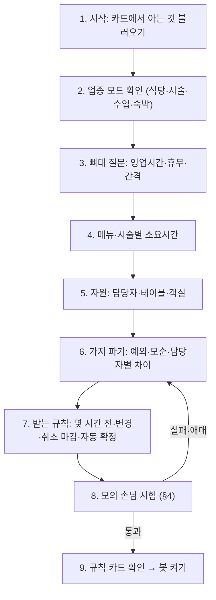

# 봇메이커: 인터뷰로 예약 봇을 만드는 에이전트 (BOTMAKER_PLAN)

> 2026-09-29 (KST) / Claude. 대표 제안: "예약 봇을 봇메이커라는 에이전트가 인터뷰로 만든다. 그릴미(grill-me)처럼 집요하게 물어서."
> 함께 읽을 것: [AI_BOOKING_AGENT_PLAN](AI_BOOKING_AGENT_PLAN.md)(손님 시나리오·시간 규칙·인증·카카오 연결), [OWNER_CONSOLE_PLAN](OWNER_CONSOLE_PLAN.md)(DB·사장님 화면), `app/services/prd_engine.py`(요구사항 엔진).
> 성격: 설계 제안. AI_BOOKING_AGENT_PLAN §4.1(처음 설정 인터뷰)을 이 문서가 대신한다.

## 0. 판단

**좋다. 이미 있는 요구사항 엔진과 같은 구조라서 새로 발명할 것이 적다.** 요구사항 엔진은 "대화 → 카드 → 사이트"를 만들고, 봇메이커는 "대화 → 예약 명세 → 봇"을 만든다.

| 요구사항 엔진 (있음) | 봇메이커 (새) |
|---|---|
| 카드 `sessions.prd`, 칸마다 filled·assumed 상태 | 예약 명세 `bot_spec`, 칸마다 같은 상태 |
| 추출은 AI(정해진 JSON), 무엇을 물을지는 규칙 | 같다 |
| 말하지 않은 숫자는 채우지 않음(`grounded`) | 같다. 펌 150분은 사장님 말에 "두 시간 반"이 있을 때만 filled |
| 리뷰어가 원문과 카드를 대조(D34) | 리뷰어 + **모의 손님 시험**(§4) |
| 요약 카드에서 사장님 확인 → 시안 → 공개 | 규칙 카드에서 확인 → 시험 결과 → 봇 켜기 |

봇은 가게마다 코드를 새로 짜지 않는다. **봇 = 공통 예약 엔진(AI_BOOKING_AGENT_PLAN §2.0) + 가게별 명세(JSON)** 이다. 봇메이커가 만드는 것은 명세뿐이므로 검증할 수 있고, 잘못돼도 되돌릴 수 있다.

## 1. "집요하게"의 뜻: 그릴미 방식을 사장님에게 맞게

그릴미는 결정 나무의 가지를 하나씩 끝까지 따라가며, 모든 빈칸이 풀릴 때까지 한 번에 하나씩 묻는다. 개발자에게는 좋지만, 가게 사장님에게 그대로 쓰면 지친다. 그래서 규칙 여섯 가지를 둔다.

| # | 규칙 | 예 |
|---|---|---|
| 1 | **한 번에 하나, 추천 답을 버튼으로** | "예약은 몇 분 간격으로 받을까요? 대부분 30분이에요." [30분(추천)] [1시간] [직접] |
| 2 | **추상적으로 묻지 말고 손님 상황으로 묻는다** | "정리 시간은요?"가 아니라 "펌 손님이 2시에 끝나면 다음 손님은 바로 받으세요, 15분 쉬세요?" |
| 3 | **답이 새 가지를 열면 끝까지 판다** | "실장님은 펌이 더 걸려요" → "얼마나요?" → "염색도요?" → "실장님만 하는 시술이 있나요?" |
| 4 | **모순은 그냥 넘기지 않는다** | 영업 21시 마감 + 펌 150분 + 마지막 예약 20시 → "20시에 펌 손님이 오면 22시 30분에 끝나요. 펌은 18시까지만 받을까요?" |
| 5 | **출구 세 개는 늘 열어 둔다** | [기본값으로] [나중에] [알아서 해 주세요] — 기존 엔진의 `LATER`·`LET_AI`·건너뛰기 그대로. 대신 그 칸은 assumed로 남고 규칙 카드에 노란 표시 |
| 6 | **끝은 "질문 수"가 아니라 "완성 기준"으로** | §3의 필수 칸이 다 차고 §4 시험을 통과하면 끝. 필수 칸이 남았으면 다음에 들어왔을 때 이어서 묻는다 |

## 2. 인터뷰 흐름



| 번호 | 설명 |
|---|---|
| 1 | 카드의 영업시간·메뉴·담당자·객실을 assumed로 먼저 채운다. 사장님에게는 "제가 이렇게 알고 있어요, 맞나요?"로 확인만 받는다 |
| 2 | 카드의 업종으로 미리 고르고 확인만 받는다. 모드마다 필수 칸이 다르다(§3) |
| 3~5 | AI_BOOKING_AGENT_PLAN §1.2의 입력표를 채운다. 표를 한 번에 보여 주고 칸을 눌러 고치게 해도 된다(말이 편한 사람은 말로) |
| 6 | 봇메이커의 핵심. 아래 "파고드는 질문 목록"을 돈다 |
| 8 | 가상의 손님 문장 10~20개를 엔진에 넣어 보고, 봇의 답을 사장님께 보여 준다 |
| 9 | 모든 칸의 출처(사장님 말·기본값·추정)를 표시한 카드. [봇 켜기]를 누르면 사이트 채팅창에 봇이 켜진다 |

### 파고드는 질문 목록 (미용실 예, 규칙으로 고른다)

| 조건 | 질문 |
|---|---|
| 담당자 2명 이상 | "선생님마다 시간이 다른 시술이 있나요?" → 있으면 시술마다 |
| 담당자 2명 이상 | "손님이 선생님을 고르게 할까요, 비어 있는 분께 배정할까요?" |
| 긴 시술(120분 이상) | "마감 몇 시간 전까지 받을까요?" (마감 − 소요시간을 추천값으로) |
| 복합 시술(펌 + 염색) | "같이 하면 따로 할 때 시간을 더하나요, 겹쳐서 줄어드나요?" |
| 영업시간이 요일마다 다름 | 요일별로 하나씩 확인 |
| 휴무가 "격주"·"둘째 주" | "이번 달 쉬는 날을 달력에서 찍어 주세요" (반복 규칙을 추정하지 않는다) |
| 인원 상한 없음(식당) | "몇 명까지 채팅으로 받을까요? 넘으면 전화로 안내할게요" |
| 브레이크 있음(식당) | "브레이크 직전에 들어온 손님 식사가 브레이크를 넘겨도 되나요?" |
| 자동 확정 켬 | "노쇼가 걱정되면 전날 확인 문자를 보낼까요?" |
| 취소 마감 짧음 | "마감이 지나 취소하려는 손님께는 뭐라고 할까요?" |

식당·숙박·수업은 같은 형식으로 업종별 목록을 둔다(`app/data/botmaker_questions.json`, 조건 → 질문 → 채우는 칸).

## 3. 산출물: 예약 명세 `bot_spec`

`contracts/botmaker_to_bot.schema.json`으로 고정한다(기존 에이전트 사이 계약 방식과 같다).

```json
{
  "site_key": "…",
  "mode": "slot",
  "step_min": 30,
  "weekly_hours": {"tue": [["10:00","20:00"]], "…": []},
  "services": [{"name": "펌", "duration_min": 150, "buffer_min": 15,
                "staff_minutes": {"실장": 180}, "staff": ["원장","실장"]}],
  "resources": [{"kind": "staff", "name": "실장", "hours": {"…": []}, "days_off": ["tue"]}],
  "policy": {"lead_min": 120, "max_days": 30, "change_deadline_hours": 24,
             "cancel_deadline_hours": 3, "auto_confirm": false, "hold_hours": 24,
             "party_max": 8, "last_start": {"펌": "18:00"}},
  "handoff": {"party_over_max": "phone", "complaint": "owner", "unknown": "owner"},
  "faq": [{"q": "주차", "a": "건물 뒤 2대", "source": "owner"}],
  "provenance": {"services.펌.duration_min": {"status": "filled", "turn": 7}}
}
```

| 모드 | 필수 칸(완성 기준) |
|---|---|
| slot | 영업시간, step_min, 시술마다 duration_min, 담당자 1명 이상, lead_min |
| table | 영업시간, step_min, 식사 시간, 페이싱(팀·명), party_max, 마지막 예약 |
| class | 수업마다 요일·시각·길이·정원 |
| night | 객실마다 인원, 입실·퇴실, 최소 숙박 |

**저장 위치**: 확정한 명세는 OWNER_CONSOLE_PLAN §3의 표(`shop_settings`·`booking_services`·`booking_resources`)로 풀어 넣는다. 명세 원본은 판 관리용으로 `bot_specs(site_key, version, spec JSONB, created_by, created_at)`에 남긴다. 나중에 "지난주 설정으로 되돌리기"가 이 표로 된다.

## 4. 모의 손님 시험 (봇을 켜기 전에)

인터뷰가 끝나면 봇메이커가 손님 역할을 맡아, 만든 명세로 공통 엔진을 돌려 본다.

| 종류 | 예 문장 | 합격 기준 |
|---|---|---|
| 기본 예약 | "내일 오후 3시 컷이요" | 명세상 가능한 시각만 제시 |
| 긴 시술 끝 | "토요일 7시 펌이요" | 마지막 예약 규칙 위반이면 거절하고 다른 시각을 제시 |
| 겹침 | 같은 시각에 두 손님 | 두 번째는 다른 시각을 안내 |
| 휴무 | "월요일 돼요?" | 휴무라고 답함 |
| 인원 초과 | "12명이요" | handoff 규칙대로 전화 안내 |
| 마감 지난 취소 | 1시간 전 취소 | 취소 마감 안내 |
| 모르는 질문 | "강아지 데려가도 돼요?" | FAQ에 없으면 사장님께 넘김(지어내지 않음) |

- 결과는 사장님에게 대화 모양으로 보인다: "손님이 '토요일 7시 펌'이라고 하면 봇은 '펌은 18시까지만 받아요. 16:30이나 17:00은 어떠세요?'라고 해요. 괜찮으세요?" [좋아요] [고칠래요]
- [고칠래요]를 누르면 해당 칸으로 인터뷰가 돌아간다(흐름 8 → 6).
- 같은 시험 목록을 `evals/`에 넣어 봇메이커 자체의 품질을 잰다. "없는 시각을 말한 횟수 0", "필수 칸을 빠뜨린 채 켠 봇 0"이 합격선이다.

## 5. 어디서 인터뷰하나

| 입구 | 언제 |
|---|---|
| 사이트 공개 직후 채팅방 | "예약도 채팅으로 받으시겠어요?" → [봇 만들기] → 같은 방에서 이어서 |
| `/owner` "예약 봇" 탭 | 나중에 시작하거나, 이어서 하거나, 다시 인터뷰 |
| 평소 바꾸기 | AI_BOOKING_AGENT_PLAN §4.2(한 문장 → 변경 카드)와 같다. 바꾼 결과는 새 판의 `bot_specs`가 된다 |

로그인(L1)한 방장만 봇을 만들 수 있다. 가족·직원이 함께 답하는 것은 기존 공유방 방식 그대로 되고, 봇 켜기는 방장만 한다.

## 6. 구현 순서

| 단계 | 할 일 | 재사용 |
|---|---|---|
| M1 | `bot_spec` 계약 + 모드별 필수 칸 + `botmaker_questions.json`(미용실·식당 먼저) | `prd_schema.py` 방식 |
| M2 | 봇메이커 엔진: 추출(JSON) · 질문 고르기(규칙) · grounded · 출구 세 개 · 모순 검사 | `prd_engine.py`의 추출·grounded·LATER·LET_AI |
| M3 | 모의 손님 시험 + 대화 모양 결과 카드 | AI_BOOKING_AGENT_PLAN A1의 `find_slots` |
| M4 | 규칙 카드 + [봇 켜기] → 사이트 채팅창 봇 켜짐 + `bot_specs` 판 관리 | 요약 카드 UI |
| M5 | 카카오 채널 연결 가게는 같은 명세로 카톡 봇도 켬(AI_BOOKING_AGENT_PLAN §6.1) | |

M1~M3은 AI_BOOKING_AGENT_PLAN의 A1(계산기)과 함께 가야 한다. 시험을 돌릴 엔진이 있어야 봇메이커가 "통과"를 판단할 수 있다.

## 7. 대표 결정 질문

| # | 질문 | 추천 답 |
|---|---|---|
| F1 | 봇 = 공통 엔진 + 가게별 명세(코드 생성 없음)로 할까 | 예. 검증·되돌리기가 되고 가게가 늘어도 운영이 같다 |
| F2 | 인터뷰 끝을 "필수 칸 + 모의 시험 통과"로 둘까 | 예. 질문 수로 끝내면 빈칸이 있는 봇이 켜진다 |
| F3 | "알아서 해 주세요"로 넘긴 칸도 봇을 켤 수 있게 할까 | 예. 대신 규칙 카드에 노란 표시를 하고, 첫 주 예약이 들어오면 그 칸을 다시 묻는다 |
| F4 | 첫 업종 | 미용실(가지가 가장 많아 봇메이커 검증에 좋다) → 식당 |

## 변경 이력

| 날짜 | 내용 |
|---|---|
| 2026-09-29 | 처음 작성 |
