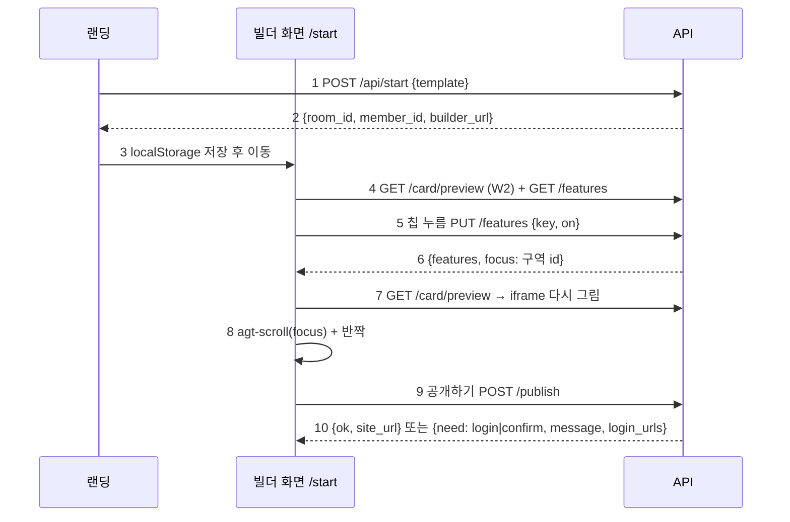

# 빌더 계약서: B1 시작·기능 API, B2 빌더 화면, B3 랜딩 연결 (BUILDER_CONTRACT)

> 2026-09-30 (KST) / Claude 작성, OpenCode 구현. 계획 [BUILDER_PLAN](BUILDER_PLAN.md), 결정 D57. 10/15 동결 전.
> 재사용: 물결 2 보며 고치기([EDIT_WAVE2_CONTRACT](EDIT_WAVE2_CONTRACT.md) — `GET /card/preview`, `PUT /card` items·layout, `SiteEditor`·`SectionPanel`), `layout_edits`, `rooms.create_room(template)`, 채팅의 `_publish`.
> 말로 고치기(B5)·사진 고치기(B6)는 베타 뒤라 이 계약에 없다. 다만 B2 화면에 **입력줄 자리**(비활성, "곧 말로 고칠 수 있어요")를 둔다.

## 0. 결론

- **새 경로 3개 + 화면 1개.** 나머지는 이미 있는 API를 그대로 부른다.
- 빌더 방은 만들 때부터 **"시안 있음 + 1안 고름"** 상태(`state = "DONE"`, `design_url` 있음, `design_choice = "v1"`, `card.builder = true`). 그래서 채팅의 "공개"와 빌더의 공개가 **같은 `_publish`**(로그인·빈칸 확인·공개 전 검사)를 탄다.
- 처음 미리보기는 가볍게(Q2): 안마다 **첫 화면 + 첫 구역 하나 + 문의**만 보이고 나머지는 숨김(`layout_edits.hidden`). 기능 칩은 숨긴 구역·더할 수 있는 구역을 켜는 버튼이다.
- 스탬프·온라인 주문은 가게 로그인이 필요하므로 빌더 칩에서는 **"공개 뒤 사장님 화면에서"** 안내만(누르면 설명). 공지는 칩으로 켠다.

## 1. 흐름



| 번호 | 단계 | 설명 |
|---|---|---|
| 1 | 시작 | 템플릿 id(펜션·카페·식당·미용실·공방·학원). IP당 10분 5번 |
| 2 | 응답 | `member_id`는 방장 신분이다. 응답 헤더 `Cache-Control: no-store` |
| 3 | 저장 | `localStorage['agt001_member_id']`(편집기·채팅방과 같은 키) |
| 4 | 처음 그림 | W2 미리보기 그대로 + 칩 목록 |
| 5~6 | 칩 | 구역 켜기/끄기·공지. 응답의 `focus`는 새로 보인 구역 id(끄면 null) |
| 7~8 | 다시 그림 | W2와 같은 iframe 다시 그리기, 붙은 구역으로 스크롤 + 1초 반짝 |
| 9~10 | 공개 | `_publish` 결과를 사람 말과 함께. 로그인 필요면 로그인 주소들, 빈칸이 있으면 한 번 더 확인(`force`) |

## 2. B1 API (`app/api/start.py` 신규 + `app/main.py` 라우터 등록)

### 2.1 `POST /api/start` `{"template": "cafe"}`

1. `template`이 `prd_engine.S.INDUSTRIES`에 있고 `other`가 아니어야 한다(아니면 400). IP 제한은 `app/api/inquiries._allow` 재사용.
2. `rid = rooms.create_room(template)`; `member_id = secrets.token_urlsafe(16)`를 `sanitize_token` 통과 모양으로(영숫자·`-`·`_`).
3. 입장: `rooms.post_message(rid, member_id, "사장님", "", base_url)` (빈 말 = 입장, 첫 입장자가 방장).
4. `store.room_tx(rid)` 안에서: `card = session["prd"]`, `card["builder"] = True`, `card["design_choice"] = "v1"`, `session["state"] = "DONE"`, `session["design_url"] = f"/design/{req}"`, 처음 레이아웃(§2.4).
5. 커밋 뒤(`store.after_commit`) 뒤에서 `design.render_variants(req, card, log_shown=False)` — 시안 파일(채팅방의 컨셉 보드·스크린샷용). 빌더 미리보기는 이 파일을 기다리지 않는다(W2 미리보기는 카드로 바로 그림).
6. 퍼널 `funnel.record("builder_start", props={"industry": template})` — `SERVER_EVENTS`에 추가.
7. 응답 `{"room_id", "member_id", "builder_url": "/start?room=<rid>"}`.

### 2.2 `GET /api/rooms/{room_id}/features` (방장만, W2와 같은 `_member_room` + 방장 확인)

```json
{
  "variant": "v1",
  "features": [
    {"key": "section:menu", "label": "메뉴", "kind": "section", "on": true, "locked": false},
    {"key": "section:space", "label": "공간", "kind": "section", "on": false, "locked": false},
    {"key": "section:sign", "label": "시그니처", "kind": "section", "on": false, "locked": false},
    {"key": "notice", "label": "공지", "kind": "shop", "on": false, "needs_text": true},
    {"key": "stamps", "label": "스탬프", "kind": "shop", "on": false, "after_publish": true},
    {"key": "order", "label": "온라인 주문", "kind": "shop", "on": false, "after_publish": true}
  ]
}
```

- `variant` = `card.design_choice` 또는 `v1`.
- 구역 칩: `layout_edits.sections()`(숨김 포함) + `addable()`. `hero`·`inquiry`는 목록에서 뺀다(항상 켜짐). `label`은 W2의 `_section_label` 재사용. `on` = 보이는 구역.
- 가게 칩: `notice`(`card.notice` 있음), `stamps`(`stamps.rule(req)`가 None 아님), `order`(`shop_settings.get(req)["order_on"]`, 포장 주문 청사진 `A-pickup`일 때만 목록에 넣음). `after_publish: true`면 화면은 누를 때 "공개한 뒤 사장님 화면에서 켤 수 있어요"만 보인다.

### 2.3 `PUT /api/rooms/{room_id}/features` `{"key": "section:space", "on": true, "text"?: "..."}` (방장만, `_check_origin`은 W2 PUT과 같게)

- `section:<id>`: 지금 안의 `layout_edits`에서 켜면 `hidden`에서 빼고, 없으면 `added`에 넣는다. 끄면 `hidden`에 넣는다. 저장은 W2 `_apply_layout`과 같은 `layout_edits.normalize`. 모르는 id·잠긴 구역은 400.
- `notice`: `on`이면 `text`(1~200자) 필요 — 없으면 400 `{"detail": "공지 글을 적어 주세요"}`. 끄면 공지 지움. W2 `PUT /card` notice와 같은 저장.
- `stamps`·`order`: 400 `{"detail": "공개한 뒤 사장님 화면에서 켤 수 있어요"}`.
- 바뀌면 W2 PUT과 같은 후속(공개본 있으면 다시 공개, 아니면 시안 파일 뒤에서 갱신)과 시스템 메시지("빌더에서 바꿨어요: 공간 켬"). 퍼널 `builder_feature`(`props={"kind": "section"|"notice", "choice": "on"|"off"}`).
- 응답: `{"features": [...](2.2와 같음), "focus": "<켜진 구역 id>" | null}`.

**구현 경계**: W2 `app/api/card.py`의 `_apply_layout`·`_section_label`·notice 저장·후속 처리 코드를 **함수로 꺼내 둘 다 부르게** 한다(복사 금지). card.py의 기존 동작은 바꾸지 않는다.

### 2.4 처음 레이아웃 (Q2)

`card["layout_edits"][v] = normalize({"hidden": 나머지})` — 안(`v1`~`v3`)마다 청사진 기본 구역 중 `hero`, **첫 번째 비잠금 구역**, `inquiry`만 남기고 나머지를 숨긴다. 청사진이 없으면 건너뛴다.

### 2.5 `POST /api/rooms/{room_id}/publish` `{"force": false}` (방장만, `_check_origin`)

- `store.room_tx` 안에서 `chat_flow._publish(session, base_url, force)`를 부르고, 그 답 글을 해석해 돌려준다:
  - 공개됨(`card.published` 생김): `{"ok": true, "site_url": session["deploy_url"]}`
  - 로그인 필요(답 글에 `/auth/kakao/start`): `{"need": "login", "message": <답 글 첫 줄>, "login_urls": [카카오, 구글]}` — `next`는 `/start?room=<rid>`로 바꾼다.
  - 빈칸 확인(답 글이 "공개 전에 확인해 주세요"): `{"need": "confirm", "message": <답 글>}` — 화면이 "그대로 공개"를 누르면 `force: true`로 다시.
  - 그 밖(공개 전 검사 막힘 등): `{"need": "blocked", "message": <답 글>}`
- 답 글 해석이 약하면 `_publish`에 결과 종류를 돌려주는 얇은 함수를 더해도 된다(`_publish` 자체 동작·문구는 그대로).
- 채팅방에도 같은 결과를 시스템 메시지로 남긴다.

### 2.6 `/start` 페이지 서빙

`app/api/public.py`: `GET /start` → `frontend/dist/builder.html`(없으면 404). `frontend/vite.config.*`의 `rollupOptions.input`에 `builder: 'builder.html'`.

## 3. B2 빌더 화면 (`frontend/src/builder/*` 신규, `frontend/builder.html` 신규)

| 번호 | 영역 | 내용 |
|---|---|---|
| 1 | 위 | 가게 이름·전화·위치 3칸(작은 입력줄, 휴대폰은 접기/펼치기). 저장은 W2 `saveCard(fields)`. "모양 바꾸기" 1안·2안·3안(선택 안 바꾸기 = `design_choice`는 기존 채팅 경로 대신 `PUT /card`에 `choice` 필드 추가 — **B1에 포함**: `CardIn.choice: Optional[Literal["v1","v2","v3"]]`) |
| 2 | 가운데 | W2 `SiteEditor`를 그대로 쓴다(미리보기·눌러 고치기·구역 패널). 빌더 모드 속성: 구역 목록(SectionList) 대신 칩을 쓰므로 목록은 접는다 |
| 3 | 아래 칩 | 가로로 밀리는 칩 줄(44px 이상). 켜진 칩 채움, 끈 칩 테두리. `after_publish` 칩은 눌러도 안내만. `notice`는 누르면 한 줄 입력 시트 |
| 4 | 붙는 느낌 | 칩 → PUT → 미리보기 다시 → iframe `onLoad` 뒤 `agt-scroll(focus)` + 반짝(편집 모드 스타일 `.agt-flash`: 1초 outline + 배경 펄스, `prefers-reduced-motion`이면 반짝 없음). **B1이 `site_render` 편집 스크립트에 `agt-flash` 처리 한 줄 추가** |
| 5 | 입력줄 자리 | 맨 아래 비활성 입력 "곧 말로 고칠 수 있어요"(B5 자리) |
| 6 | 공개 | 오른쪽 위 "공개하기" → 2.5. `login`이면 로그인 버튼 2개, `confirm`이면 빈칸 목록 + "그대로 공개" |
| 7 | 채팅 | "채팅으로 설명하기" 링크 → `/room.html?room=<rid>` (같은 방) |

- 휴대폰 우선(390px): 위 3칸 접힘, 미리보기 가득, 칩 줄은 화면 아래 고정. 760px 이상은 미리보기 390px 가운데 + 옆 패널.
- 연타: 칩 요청 중에는 그 칩만 잠그고, 미리보기는 마지막 응답만 반영.

## 4. B3 랜딩 연결 (`frontend/src/Landing.tsx`)

- 템플릿 카드·칩을 누르면: `POST /api/start {template}` → `localStorage['agt001_member_id'] = member_id` → `location.href = builder_url`. 실패하면 지금처럼 예시 문장을 채우는 동작으로.
- 자유 입력(설명 적고 보내기)은 **지금 그대로** 채팅으로.
- 퍼널 `template_click`은 그대로 남긴다.

## 5. 작업 묶음 (OpenCode)

| 묶음 | 담당 파일 | 선행 |
|---|---|---|
| B1 | `app/api/start.py`(신규), `app/main.py`(라우터), `app/api/card.py`(공통 함수 꺼내기 + `choice` 필드, 기존 동작 그대로), `app/api/public.py`(`/start`), `app/services/funnel.py`(사건 2개), `app/services/site_render.py`(편집 스크립트에 `agt-flash` 한 줄), `tests/unit/test_builder_api.py`(신규) | 없음 |
| B2+B3 | `frontend/builder.html`(신규), `frontend/src/builder/*`(신규), `frontend/vite.config.*`(입력 1줄), `frontend/src/editor/SiteEditor.tsx`(빌더 모드 속성만), `frontend/src/editor/cardApi.ts`(features·start·publish 함수), `frontend/src/Landing.tsx`(템플릿 클릭), `frontend/src/builder/*.test.tsx`(신규) | B1 응답 모양(§2)만. 가짜 fetch로 병렬 가능 |
| B4 | Claude: 390px 실제 흐름(템플릿 → 칩 3개 → 이름·전화 → 공개), 품질 점검 36쪽 전후, 퍼널 | B1·B2 |

**하지 말 것**: 청사진 JSON·`publish_check.py` 수정, `_publish`의 동작·문구 변경, 로그인 없이 공개되는 경로, 새 의존성, iframe `allow-same-origin`, 채팅 흐름(자유 입력) 변경.

## 6. 합격 테스트

| 번호 | 테스트 | 파일 |
|---|---|---|
| 1 | `POST /api/start`: 템플릿 6종 성공·모르는 id 400·IP 6번째 429, 응답의 member_id로 `GET /card/preview` 200(방장) | `test_builder_api.py` |
| 2 | 처음 레이아웃: 안마다 보이는 구역이 hero·첫 구역·inquiry뿐 | 같은 파일 |
| 3 | features: hero·inquiry 없음, 숨긴 구역 on=false, 카페(dinein)엔 order 없음·픽업엔 있음 | 같은 파일 |
| 4 | PUT section 켜기 → focus = 그 id, 미리보기 HTML에 그 구역 있음 / 끄기 → 없음 / 모르는 id 400 / 다른 참여자 403 | 같은 파일 |
| 5 | PUT notice: 글 없이 켜기 400, 글과 켜기 → 미리보기에 공지 띠 / stamps·order 400 안내 | 같은 파일 |
| 6 | publish: 로그인 필요 설정이면 need=login(`next`가 `/start?room=`), 빈칸이면 need=confirm, force로 공개 → site_url, 공개본에 편집 표시 0 | 같은 파일 |
| 7 | card.py 기존 테스트 전부 그대로 통과(공통 함수 꺼내기 회귀 없음) | `test_card_api.py` |
| 8 | 빌더 화면: 칩 누름 → PUT → 미리보기 다시 요청 → agt-scroll(focus) 전송, after_publish 칩은 PUT 없음, 공개 need=login이면 로그인 버튼 | `frontend/src/builder/*.test.tsx` |
| 9 | 랜딩: 템플릿 누름 → /api/start → builder_url 이동, 실패하면 예시 문장 채우기 | 같은 폴더 또는 `landing-smoke.test.tsx` |

## 변경 이력

| 날짜 | 내용 |
|---|---|
| 2026-09-30 | 처음 작성 (D57) |
