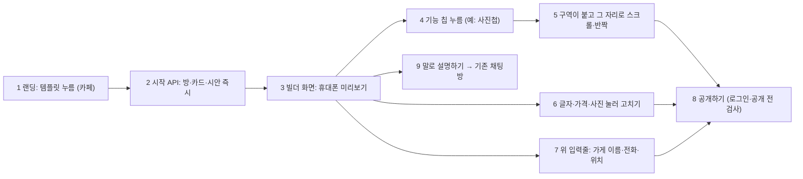
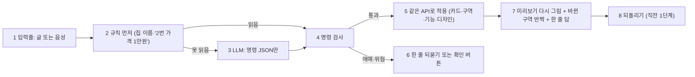

# 템플릿 빌더: 시안이 먼저, 기능을 누르면 구역이 붙는다 (BUILDER_PLAN)

> 2026-09-30 (KST) / Claude. 대표 요청: "템플릿은 채팅이 아니고 시안이 나오고 기능 누를 때마다 동적으로 추가되는 느낌" → 같은 날 **"빌더 + LLM 수정 방식"**(Q1 결정).
> 먼저 읽은 것: [EDIT_WAVE2_CONTRACT](EDIT_WAVE2_CONTRACT.md)(보며 고치기·구역 편집), [APP_COMMERCE_PLAN](APP_COMMERCE_PLAN.md), `frontend/src/templates.ts`(랜딩 템플릿 6종), `app/services/rooms.create_room(template_id)`, `layout_edits.pool`.

## 0. 결론

- **지금**: 랜딩에서 템플릿을 누르면 예시 문장이 입력창에 채워지고 → 채팅방에서 AI가 질문 → 요약·승인 → 그제야 시안 3안.
- **바꾼 뒤**: 템플릿을 누르면 **1초 안에 그 업종 시안이 휴대폰 화면으로 보인다**(가게 이름·사진·메뉴는 예시). 아래 **기능 칩**(메뉴·사진첩·예약·후기·공지·스탬프…)을 누를 때마다 그 구역이 사이트에 **붙으며 그 자리로 스크롤되고 잠깐 빛난다**. 글자·가격·사진은 누르면 바로 고친다(물결 2 보며 고치기). 다 되면 **공개하기**.
- **새로 만드는 것은 적다**: 미리보기·눌러서 고치기(W2 `SiteEditor`), 구역 붙이기(`layout_edits` added/hidden), 예시 내용(업종별 예시 묶음), 가게 기능(공지·스탬프·주문)은 이미 있다. 새로 필요한 건 ① 채팅 없이 방+카드+시안을 만드는 시작 API ② 기능 칩 목록·켜기 API ③ 빌더 화면(시작 페이지) ④ 랜딩 연결.
- **말로 고치기(LLM)**: 빌더 화면 아래에 입력줄(글·음성)을 둔다. "메뉴에 아메리카노 4,500원 추가", "사진첩 빼고 후기 넣어 줘", "색 좀 밝게"라고 하면 LLM이 **정해진 명령 목록(§1.5) 안의 JSON만** 내고, 그 명령은 칩·눌러 고치기와 **같은 API**를 탄다. LLM은 HTML·CSS를 쓰지 않고, 사장님이 말하지 않은 사실(가격·전화·주소·숫자)은 넣지 못한다. 바뀐 구역으로 스크롤·반짝 + 한 줄 답 + **되돌리기**.
- 채팅방은 없애지 않는다: 랜딩의 자유 입력(내 가게 설명 적기)은 지금처럼 채팅(요구사항 엔진·리뷰어)으로 간다. 빌더에서 한 것과 같은 방이라 오가도 이어진다.

## 1. 사장님 흐름

| 번호 | 단계 | 설명 |
|---|---|---|
| 1 | 템플릿 | 랜딩의 템플릿 6종(펜션·카페·식당·미용실·공방·학원). 지금은 예시 문장을 채우지만, 바꾼 뒤엔 바로 빌더로 간다 |
| 2 | 시작 | `POST /api/start {template}` → `rooms.create_room(template)` + 카드(업종만) + 시안 렌더(스크린샷 없이). 요구사항 승인 게이트를 건너뛴다(카드에 `builder: true`) |
| 3 | 미리보기 | 물결 2 `SiteEditor`의 iframe(srcdoc, sandbox) 그대로. 처음엔 **기본 구역만**(첫 화면 + 대표 구역 1개 + 문의) |
| 4 | 기능 칩 | 화면 아래 가로 칩 줄. 두 종류: **구역**(청사진 pool: 메뉴·사진첩·오시는 길·예약·후기·시그니처·선생님…) / **가게 기능**(공지 띠·스탬프·온라인 주문). 켜진 칩은 채워진 모양 |
| 5 | 붙기 | 칩 → `PUT` → 미리보기 다시 그림 → 새 구역으로 `agt-scroll` + 1초 반짝(편집 모드 CSS). 다시 누르면 숨김 |
| 6 | 고치기 | W2 그대로: 누른 구역의 칸이 아래 시트로 |
| 7 | 필수 칸 | 가게 이름·전화·위치 3칸만 위에 작은 입력줄(채팅의 첫 질문들을 대신). 비어도 미리보기는 예시로 보인다 |
| 8 | 공개 | 기존 공개 흐름(로그인·빈칸 확인·공개 전 검사). 필수 칸이 비었으면 그 칸으로 안내 |
| 9 | 채팅 | 기존 채팅방으로. 같은 방이라 빌더에서 한 것이 그대로 이어진다 |

## 1.5 말로 고치기 (LLM)

| 번호 | 단계 | 설명 |
|---|---|---|
| 1 | 입력 | 빌더 아래 입력줄. 마이크는 기존 음성 인식(말→글, 사장님이 확인 뒤 전송) |
| 2 | 규칙 먼저 | 칩 이름("사진첩 켜 줘"), 품목 번호 고치기(`prd_engine.correct_item_row`), 사실 칸 추출(`prd_engine.extract`, 근거 검사 포함)을 먼저. 비용·속도·정확도 |
| 3 | LLM | 규칙으로 못 읽은 말만. 입력: 지금 카드 요약 + 이 안의 구역 목록·붙일 수 있는 구역 + 기능 상태. 출력: 아래 표의 명령 배열 JSON만(`ui_agent`와 같은 울타리 방식) |
| 4 | 검사 | 명령마다 PUT과 같은 검사(길이·목록 안 id·잠긴 구역). **사실 값(가격·전화·주소·숫자·이름)은 사장님 말에 그대로 있어야 통과**(`ui_agent`·`copywriter`의 숫자 검사 재사용). 모르는 명령·틀린 값은 버림 |
| 5 | 적용 | `PUT /card`(fields·items·layout·notice), 기능 API(스탬프·주문), `design_concept.adjust`(색·글꼴·여백·모서리). 새 적용 경로를 만들지 않는다 |
| 6 | 되묻기 | "사진첩이 두 개예요, 어느 쪽?" 같은 한 줄. **온라인 주문 켜기·스탬프 켜기는 확인 버튼**(손님에게 보이는 기능) |
| 7 | 결과 | 칩과 같은 반짝·스크롤. 답은 한 줄("사진첩을 빼고 후기를 넣었어요") |
| 8 | 되돌리기 | 적용 직전 카드 스냅샷 1개를 세션에 둔다. "되돌려 줘"·버튼 |

**명령 목록 (LLM이 낼 수 있는 것 전부)**

| 명령 | 예 | 적용 |
|---|---|---|
| `set_field` {key, value} | "전화번호 02-123-4567" | `PUT /card` fields (가게 이름·전화·영업시간·위치·소개·연락 방법) |
| `item` {name, rename?, price?, note?, add?, remove?} | "라떼 5천원으로", "빙수 추가" | `PUT /card` items |
| `section` {id, action: add·hide·show·up·down} | "후기 넣고 사진첩 빼 줘" | `PUT /card` layout (청사진 pool 안의 id만) |
| `notice` {text, popup?} | "10월 3일 휴무 공지 띄워 줘" | `PUT /card` notice |
| `feature` {key: stamps·order, on, goal?, reward?} | "10번 오면 한 잔 무료 스탬프" | 기능 API — **확인 버튼 뒤에만** |
| `style` {text} | "좀 더 밝고 따뜻하게" | `design_concept.adjust` (정해진 팔레트·글꼴 안) |
| `variant` {v1·v2·v3} | "앱처럼 바꿔 줘" | 고른 안 바꾸기 |
| `ask` {question} | (애매할 때) | 되묻기 한 줄 |

## 2. 만들 것

| 묶음 | 내용 | 파일(예상) | 크기 |
|---|---|---|---|
| B1 시작·기능 API | `POST /api/start`(방·멤버·카드·시안, 레이트 제한), `GET/PUT /api/rooms/{id}/features`(칩 목록: pool 구역 + 공지·스탬프·주문, 켜기/끄기 → `layout_edits`·`notice`·스탬프 규칙·`order_on`), 빌더 카드는 요구사항 게이트 없이 시안 | `app/api/start.py`(신규), `app/api/card.py`, `app/services/chat_flow.py`(게이트 건너뛰기 한 곳) | 1.5일 |
| B2 빌더 화면 | `/start?template=cafe`: 위 필수 3칸, 가운데 미리보기(SiteEditor 재사용), 아래 기능 칩, 붙은 구역 스크롤·반짝, 공개하기·말로 설명하기 | `frontend/src/builder/*`(신규), `vite.config` 입력 1줄, `app/api/public.py`(`/start` 경로) | 2일 |
| B3 랜딩 연결 | 템플릿 누르면 `/start?template=…`로. 자유 입력은 지금처럼 채팅 | `frontend/src/Landing.tsx` | 0.5일 |
| B5 말로 고치기 | 규칙 먼저 → LLM 명령 JSON → 검사 → 같은 API 적용, 되묻기·확인 버튼, 되돌리기 1단계, 빌더 입력줄(글·음성). 평가: 말 60개(명령 종류별) 정확도·지어낸 값 0 | `app/services/builder_agent.py`(신규), `app/api/start.py`(`POST /api/rooms/{id}/say`), `frontend/src/builder/*`, `evals/builder_say/`(신규) | 2일 |
| B4 확인 | 390px 실제 흐름 캡처(템플릿 → 칩 3개 → 고치기 → 공개), 품질 점검 36쪽 전후, 퍼널 사건(`builder_start`·`builder_feature`) | Claude | 0.5일 |

## 3. 대표 결정 필요

| # | 질문 | 추천 |
|---|---|---|
| Q1 | 채팅을 어디까지 대신하나 | **결정(9/30): 빌더 + LLM 수정 방식.** 빌더 안 입력줄로 말하면 고쳐진다(§1.5). 랜딩 자유 입력은 채팅 유지 |
| Q2 | 처음 미리보기에 구역을 얼마나 | **첫 화면 + 대표 구역 1개 + 문의**만 켜고 나머지는 칩으로. "누를 때마다 붙는 느낌"이 살려면 처음이 가벼워야 한다 |
| Q3 | 시안 3안(기본·사진 강조·앱형)은 | 빌더는 **1안으로 시작**하고 위에 "모양 바꾸기"(3안 전환). 구역 편집은 안별로 이미 따로 저장된다 |
| Q4 | 로그인 시점 | **공개할 때**(지금 규칙 그대로). 빌더는 로그인 없이 바로 |
| Q5 | 일정 | 10/15 동결 전(10/1~10/6)에 넣어 10/17 베타에서 검증 / 또는 베타 뒤. 부품은 대부분 있어 1주 안. **D42(3주 부품 확장 금지)의 예외가 필요** |

## 4. 위험

| 위험 | 대응 |
|---|---|
| 요구사항 게이트를 건너뛰어 AI 검토(리뷰어)가 빠짐 | 빌더 카드는 사장님이 직접 칸을 채우므로 추출 오류가 없다. 공개 전 빈칸 확인·공개 전 검사는 그대로 |
| 빈 방이 많이 생김(누르기만 하고 떠남) | 시작 API 레이트 제한 + 24시간 동안 공개·편집 없는 빌더 방은 정리(기존 방 정리 규칙에 한 줄) |
| 예시 내용이 실제처럼 보여 그대로 공개 | 지금처럼 시안엔 "예시" 표시, 공개본엔 예시 칸 빼기·빈칸 확인(D51·D23) |
| LLM이 없는 사실을 만들어 넣음 | 사실 값은 사장님 말에 그대로 있어야 통과(§1.5 4번), 평가 '지어낸 값 0'이 합격 기준 |
| LLM이 엉뚱한 곳을 고침 | 명령 목록 밖은 버림, 바뀐 구역을 반짝여 보여 주고 되돌리기 1단계, 손님에게 보이는 기능(주문·스탬프)은 확인 버튼 |
| LLM 비용·지연 | 규칙 먼저(칩 이름·번호 고치기·사실 추출), 못 읽은 말만 LLM 1회(12초 제한), 실패하면 "버튼이나 화면을 눌러 고쳐 주세요" |
| 미리보기 다시 그리기가 느림 | 스크린샷 없이 렌더만(수십 ms). 칩 연타는 마지막 요청만 반영 |

## 변경 이력

| 날짜 | 내용 |
|---|---|
| 2026-09-30 | 처음 작성 (결정 Q1~Q5 대기) |
| 2026-09-30 | Q1 결정: 빌더 + LLM 수정 방식 → §1.5 말로 고치기(명령 목록·검사·되돌리기), B5 추가 |
