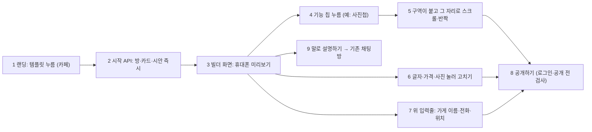

# 템플릿 빌더: 시안이 먼저, 기능을 누르면 구역이 붙는다 (BUILDER_PLAN)

> 2026-09-30 (KST) / Claude. 대표 요청: "템플릿은 채팅이 아니고 시안이 나오고 기능 누를 때마다 동적으로 추가되는 느낌".
> 먼저 읽은 것: [EDIT_WAVE2_CONTRACT](EDIT_WAVE2_CONTRACT.md)(보며 고치기·구역 편집), [APP_COMMERCE_PLAN](APP_COMMERCE_PLAN.md), `frontend/src/templates.ts`(랜딩 템플릿 6종), `app/services/rooms.create_room(template_id)`, `layout_edits.pool`.

## 0. 결론

- **지금**: 랜딩에서 템플릿을 누르면 예시 문장이 입력창에 채워지고 → 채팅방에서 AI가 질문 → 요약·승인 → 그제야 시안 3안.
- **바꾼 뒤**: 템플릿을 누르면 **1초 안에 그 업종 시안이 휴대폰 화면으로 보인다**(가게 이름·사진·메뉴는 예시). 아래 **기능 칩**(메뉴·사진첩·예약·후기·공지·스탬프…)을 누를 때마다 그 구역이 사이트에 **붙으며 그 자리로 스크롤되고 잠깐 빛난다**. 글자·가격·사진은 누르면 바로 고친다(물결 2 보며 고치기). 다 되면 **공개하기**.
- **새로 만드는 것은 적다**: 미리보기·눌러서 고치기(W2 `SiteEditor`), 구역 붙이기(`layout_edits` added/hidden), 예시 내용(업종별 예시 묶음), 가게 기능(공지·스탬프·주문)은 이미 있다. 새로 필요한 건 ① 채팅 없이 방+카드+시안을 만드는 시작 API ② 기능 칩 목록·켜기 API ③ 빌더 화면(시작 페이지) ④ 랜딩 연결.
- 채팅은 없애지 않는다: 빌더 화면에 **"말로 설명하기"** 버튼(기존 채팅방)을 둔다. 랜딩의 자유 입력(내 가게 설명 적기)은 지금처럼 채팅으로 간다.

## 1. 사장님 흐름

| 번호 | 단계 | 설명 |
|---|---|---|
| 1 | 템플릿 | 랜딩의 템플릿 6종(펜션·카페·식당·미용실·공방·학원). 지금은 예시 문장을 채우지만, 바꾼 뒤엔 바로 빌더로 간다 |
| 2 | 시작 | `POST /api/start {template}` → `rooms.create_room(template)` + 카드(업종만) + 시안 렌더(스크린샷 없이). 요구사항 승인 게이트를 건너뛴다(카드에 `builder: true`) |
| 3 | 미리보기 | 물결 2 `SiteEditor`의 iframe(srcdoc, sandbox) 그대로. 처음엔 **기본 구역만**(첫 화면 + 대표 구역 1개 + 문의) |
| 4 | 기능 칩 | 화면 아래 가로 칩 줄. 두 종류: **구역**(청사진 pool: 메뉴·사진첩·오시는 길·예약·후기·시그니처·선생님…) / **가게 기능**(공지 띠·스탬프·온라인 주문). 켜진 칩은 채워진 모양 |
| 5 | 붙기 | 칩 → `PUT` → 미리보기 다시 그림 → 새 구역으로 `agt-scroll` + 1초 반짝(편집 모드 CSS). 다시 누르면 숨김 |
| 6 | 고치기 | W2 그대로: 누른 구역의 칸이 아래 시트로 |
| 7 | 필수 칸 | 가게 이름·전화·위치 3칸만 위에 작은 입력줄(채팅의 첫 질문들을 대신). 비어도 미리보기는 예시로 보인다 |
| 8 | 공개 | 기존 공개 흐름(로그인·빈칸 확인·공개 전 검사). 필수 칸이 비었으면 그 칸으로 안내 |
| 9 | 채팅 | 기존 채팅방으로. 같은 방이라 빌더에서 한 것이 그대로 이어진다 |

## 2. 만들 것

| 묶음 | 내용 | 파일(예상) | 크기 |
|---|---|---|---|
| B1 시작·기능 API | `POST /api/start`(방·멤버·카드·시안, 레이트 제한), `GET/PUT /api/rooms/{id}/features`(칩 목록: pool 구역 + 공지·스탬프·주문, 켜기/끄기 → `layout_edits`·`notice`·스탬프 규칙·`order_on`), 빌더 카드는 요구사항 게이트 없이 시안 | `app/api/start.py`(신규), `app/api/card.py`, `app/services/chat_flow.py`(게이트 건너뛰기 한 곳) | 1.5일 |
| B2 빌더 화면 | `/start?template=cafe`: 위 필수 3칸, 가운데 미리보기(SiteEditor 재사용), 아래 기능 칩, 붙은 구역 스크롤·반짝, 공개하기·말로 설명하기 | `frontend/src/builder/*`(신규), `vite.config` 입력 1줄, `app/api/public.py`(`/start` 경로) | 2일 |
| B3 랜딩 연결 | 템플릿 누르면 `/start?template=…`로. 자유 입력은 지금처럼 채팅 | `frontend/src/Landing.tsx` | 0.5일 |
| B4 확인 | 390px 실제 흐름 캡처(템플릿 → 칩 3개 → 고치기 → 공개), 품질 점검 36쪽 전후, 퍼널 사건(`builder_start`·`builder_feature`) | Claude | 0.5일 |

## 3. 대표 결정 필요

| # | 질문 | 추천 |
|---|---|---|
| Q1 | 채팅을 어디까지 대신하나 | **템플릿으로 시작할 때만 빌더.** 자유 입력은 채팅 유지(요구사항 엔진·리뷰어가 강점). 빌더 안에 "말로 설명하기" |
| Q2 | 처음 미리보기에 구역을 얼마나 | **첫 화면 + 대표 구역 1개 + 문의**만 켜고 나머지는 칩으로. "누를 때마다 붙는 느낌"이 살려면 처음이 가벼워야 한다 |
| Q3 | 시안 3안(기본·사진 강조·앱형)은 | 빌더는 **1안으로 시작**하고 위에 "모양 바꾸기"(3안 전환). 구역 편집은 안별로 이미 따로 저장된다 |
| Q4 | 로그인 시점 | **공개할 때**(지금 규칙 그대로). 빌더는 로그인 없이 바로 |
| Q5 | 일정 | 10/15 동결 전(10/1~10/6)에 넣어 10/17 베타에서 검증 / 또는 베타 뒤. 부품은 대부분 있어 1주 안. **D42(3주 부품 확장 금지)의 예외가 필요** |

## 4. 위험

| 위험 | 대응 |
|---|---|
| 요구사항 게이트를 건너뛰어 AI 검토(리뷰어)가 빠짐 | 빌더 카드는 사장님이 직접 칸을 채우므로 추출 오류가 없다. 공개 전 빈칸 확인·공개 전 검사는 그대로 |
| 빈 방이 많이 생김(누르기만 하고 떠남) | 시작 API 레이트 제한 + 24시간 동안 공개·편집 없는 빌더 방은 정리(기존 방 정리 규칙에 한 줄) |
| 예시 내용이 실제처럼 보여 그대로 공개 | 지금처럼 시안엔 "예시" 표시, 공개본엔 예시 칸 빼기·빈칸 확인(D51·D23) |
| 미리보기 다시 그리기가 느림 | 스크린샷 없이 렌더만(수십 ms). 칩 연타는 마지막 요청만 반영 |

## 변경 이력

| 날짜 | 내용 |
|---|---|
| 2026-09-30 | 처음 작성 (결정 Q1~Q5 대기) |
