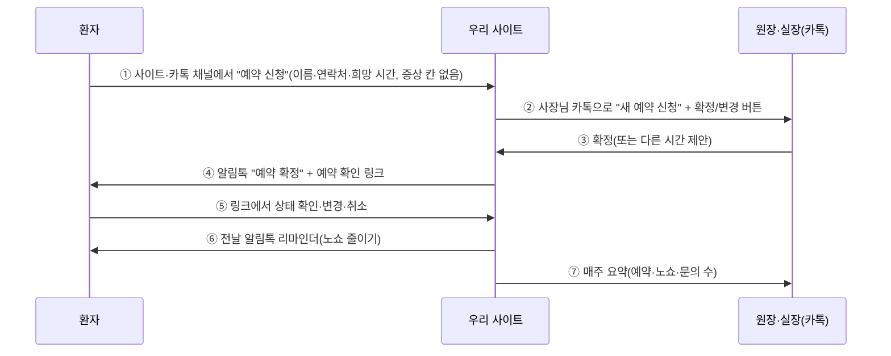

# 비즈니스 전략: 누구에게·무엇을·얼마에·어떻게 팔고, 언제 회수하나 (2026-09-26 초안)

> 계기: 대표 요청 "치과처럼 카카오톡으로 예약하고 예약 상태를 확인하는 서비스를 할 때, 고객군 상위 20개·영업 방법·기능·운영비·가격 전략·할인 프로모션·투자 회수".
> **모든 숫자는 검증 전 가설이다.** 외부 사실은 2026-09-26 확인(출처는 맨 아래). 시장 조사 초안은 OpenCode가 [BUSINESS_MODEL.md](BUSINESS_MODEL.md)로 따로 쓰는 중이다.

## 0. 5줄 요약

1. **팔 것**: "AI가 대신 만들어 주는, 카카오톡으로 예약·문의를 받고 알려 주는 홈페이지". 네이버 예약(무료)과 싸우지 않고 **옆에 붙는다**. 핵심 가치는 **예약 확인·변경·전날 알림으로 노쇼를 줄이고, 손님 연락이 사장님 카톡으로 바로 오는 것**이다.
2. **첫 고객**: 예약이 매출의 전부인데 아직 카톡·전화로 손수 받는 **1인·소규모 예약 업종**. 상위 3개는 필라테스·요가, 세차·디테일링, 1:1 PT. **치과는 가치가 크지만 의료광고·건강정보 규제 때문에 18위**다. "의료 모드"를 만든 뒤 3단계로 들어간다.
3. **가격(가설)**: 무료(홈페이지+문의 알림) / 스타터 월 19,900원 / 프로 39,900원 / 메디컬 79,000원, **제작비 99,000원**(프로모션으로 할인). 알림톡은 요금제에 건수를 넣고 넘으면 건당 과금한다.
4. **회수(가설)**: 구독료만 받으면 필요 투자 약 1,700만 원, 누적 회수 27개월. **제작비 + 평균 월 35,000원이면 필요 투자 약 420만 원, 월 흑자 6개월, 회수 11개월**(대표 인건비 제외). 대표 인건비 월 300만 원을 넣고 월 신규 30곳이면 필요 투자 약 2,000만 원, 회수 16개월.
5. **가장 큰 함의**: 상위 고객군의 핵심 기능인 **"예약 받기(D32 ②) + 손님에게 알림톡"이 아직 없다.** 10/17 검증 대상과 오픈 범위를 이에 맞게 다시 정해야 한다(§10).

## 1. 왜 우리인가 (네이버 예약이 무료인데)

| 이미 있는 것 | 사장님 불만 | 우리 자리 |
|---|---|---|
| 네이버 예약: 월 이용료 없음, 결제 연동 시에만 수수료 1.98~3.63% | 손님 연락은 결국 카톡·전화로 따로 온다. 네이버 밖 손님(인스타·단골)은 여전히 손으로 받는다 | 네이버 예약 링크는 우리 사이트에 **같이 건다**. 카톡으로 오는 손님을 정리해 준다 |
| 카카오헤어샵: 신규 손님 결제액의 **약 25%** 수수료(재방문 0%) | 신규 수수료가 부담 | **수수료 0원, 월정액** |
| 똑닥(병원): 환자 멤버십 월 1,000원, 병원 요금은 공개 안 됨 | 병원용, 동네 가게에는 없음 | 동네 가게·1인 전문직 |
| 외주 홈페이지: 200~550만 원(우리 참고 견적 기준) | 비싸고, 예약·알림이 없고, 고치기 어렵다 | 말로 만들고 말로 고친다 |

## 2. 치과 예시로 본 흐름 (대표 예시)

| 번호 | 필요한 것 | 지금 | 비고 |
|---|---|---|---|
| ① | 예약 신청 양식(공용 기능 D32 ②) | **없음**(문의 양식만) | 건강정보(증상)는 받지 않는다(민감정보). 의료 모드에서 "후기·치료 경험담" 부품을 끈다 |
| ② | 사장님 알림 | 있음(나에게 보내기, 실측 전) | |
| ③ | 확정·변경 화면 | 없음 | 관리자 화면·카톡 링크 |
| ④⑥ | **손님에게 알림톡** | **없음** | 알림톡은 사업자·카카오 비즈니스 채널·딜러사 계약 필요(건당 약 7~13원) |
| ⑤ | 예약 확인 페이지 | 없음 | 로그인 없는 개인 링크(추측 불가 토큰) |
| ⑦ | 요약 | 일부(D45 기록) | |

**치과가 18위인 이유**: 의료광고는 홈페이지가 사전 심의 대상 매체는 아니지만 치료 경험담·과장 표현이 금지된다(의료법 56조). 명칭·소재지·전화번호만으로 된 광고는 심의 면제다. 예약에 건강정보가 섞이면 민감정보 규정이 붙는다. 기존 병원 예약·전자차트와도 부딪힌다. **값은 크지만 준비물이 많다.** 그래서 "의료 모드"(금지 표현 점검, 후기 부품 끄기, 증상 안 받기)를 만든 뒤 3단계로 들어간다.

## 3. 고객군 상위 20

점수(각 1~5, 가설): **A** 예약·상담이 매출의 핵심, **B** 지금 카톡·전화로 손수 받는 고통, **C** 기존 플랫폼의 빈틈(없거나 수수료), **D** 월 지불 여력, **E** 도입 쉬움(규제·민감정보·연동이 적음).

| 순위 | 고객군 | 점수(A·B·C·D·E) | 누구에게(결정권자) | 어떻게 영업 | 핵심 기능 | 추천 요금제 |
|---|---|---|---|---|---|---|
| 1 | 필라테스·요가 스튜디오 | 22 (5·5·4·4·4) | 원장(강사 겸) | 강사 커뮤니티·장비 업체 제휴, 한 동네 집중 방문 | 체험 수업 신청, 수업 시간표, 전날 알림 | 프로 |
| 2 | 세차·디테일링·PPF | 22 (4·4·5·4·5) | 사장 | 인스타 DM(작업 사진 계정), 용품 도매상 제휴 | 견적 문의+차종 사진, 예약, 작업 완료 알림 | 프로 |
| 3 | 1:1 PT·퍼스널 트레이닝 | 22 (5·5·4·3·5) | 트레이너(1인) | 트레이너 커뮤니티·인스타 | 상담·체험 신청, 수업 예약·변경 | 스타터 |
| 4 | 인테리어·집수리 | 21 (4·4·4·5·4) | 대표 | 지역 카페·맘카페 광고, 자재상 제휴 | 견적 상담 신청+현장 사진, 포트폴리오 | 프로 |
| 5 | 피부관리·왁싱 | 21 (5·5·3·4·4) | 원장 | 화장품·장비 딜러 제휴 | 예약·리마인더·재방문 알림 | 프로 |
| 6 | 네일·속눈썹 1인숍 | 21 (5·5·3·3·5) | 원장(1인) | 인스타 DM, 재료상 | 예약·전날 알림·포트폴리오 | 스타터 |
| 7 | 반려견 미용·호텔 | 21 (5·5·4·3·4) | 사장 | 반려동물 용품 도매·지역 커뮤니티 | 예약(견종·크기), 픽업 시간, 완료 사진 알림 | 프로 |
| 8 | 사진 스튜디오 | 21 (5·4·4·3·5) | 대표 작가 | 인스타·웨딩/돌 박람회 | 촬영 예약·상품 안내·보정본 안내 | 스타터 |
| 9 | 개인 레슨(음악·미술·운동) | 21 (4·5·5·2·5) | 강사 본인 | 강사 커뮤니티·학원가 | 상담 신청·수업 변경 | 스타터 |
| 10 | 펜션·풀빌라(소형) | 20 (5·3·4·4·4) | 사장 | 지역 펜션협회, OTA 수수료 절감 메시지 | 객실·날짜 문의, 입실 안내 알림 | 프로 |
| 11 | 동물병원 | 20 (5·4·4·4·3) | 원장 | 수의 용품 딜러·지역 수의사회 | 진료 예약·접종 알림(건강정보 최소) | 메디컬 |
| 12 | 공방 원데이클래스 | 20 (5·4·3·3·5) | 공방 대표 | 클래스 플랫폼 수수료 절감 메시지 | 클래스 일정·신청·인원 마감 | 스타터 |
| 13 | 소형 미용실(1~3인) | 20 (5·4·3·3·5) | 원장 | 미용 재료상, "신규 수수료 0" | 예약·디자이너 선택·리마인더 | 스타터 |
| 14 | 학원·교습소 | 19 (4·4·3·4·4) | 원장 | 학원 관리 프로그램 업체 제휴 | 상담 신청·반 안내 | 스타터 |
| 15 | 동네 카센터 | 19 (3·3·5·3·5) | 사장 | 부품 도매상, 방문 | 점검 예약·완료 알림 | 스타터 |
| 16 | 입주·이사 청소 대행 | 19 (4·4·3·3·5) | 대표 | 지역 광고·부동산 제휴 | 견적 신청(평수·날짜) | 스타터 |
| 17 | 심리상담·코칭센터 | 18 (5·4·4·3·2) | 센터장 | 상담사 협회 | 상담 예약(민감정보 최소) | 메디컬 |
| 18 | 치과 의원 | 17 (5·3·3·5·1) | 원장·실장 | 치과 재료 딜러, 개원 컨설팅, 신규 개설 목록 | §2 흐름 + 의료 모드 | 메디컬 |
| 19 | 한의원 | 16 (5·3·3·4·1) | 원장 | 한의 재료 딜러 | §2 흐름 + 의료 모드 | 메디컬 |
| 20 | 캠핑장·글램핑 | 16 (5·2·2·3·4) | 사장 | 캠핑 플랫폼이 강해 후순위 | 사이트 예약 안내 | 스타터 |

참고 규모(2026-09-26 확인): 치과 병·의원 약 2만 곳, 반려동물 병원 약 4,159곳(전체 동물병원 5,474곳). 나머지 업종 수는 확인 못 함.

**들어가는 순서**: 1단계(오픈~3개월) 1·2·3위를 **한 지역에 집중**한다. 2단계에서 4~13위(뷰티·반려동물·펜션·공방). 3단계에서 의료 모드(동물병원·치과·한의원·상담).

## 4. 기능과 요금제 (가설)

| 기능 | 무료 | 스타터 19,900원 | 프로 39,900원 | 메디컬 79,000원 |
|---|---|---|---|---|
| AI가 만드는 홈페이지·말로 고치기 | ● (디자인 고치기 월 5회) | ● (20회) | ● (무제한 적정 사용) | ● |
| 문의 → 사장님 카톡 알림 | ● | ● | ● | ● |
| 우리 주소(가게.서비스) / 내 도메인 연결 | 우리 주소 + "제작" 표시 | 내 도메인 | 내 도메인 | 내 도메인 |
| 예약 신청·확정·변경(D32 ②) | — | ● | ● | ● |
| 손님 예약 확인 링크 | — | ● | ● | ● |
| 손님 알림톡(확정·변경) 포함 건수 | — | 월 200건 | 월 1,000건 | 월 2,000건 |
| 전날 리마인더(노쇼 줄이기) | — | — | ● | ● |
| 직원 여러 명 일정 | — | — | 5명 | 10명 |
| 네이버 예약 링크 병행·월간 리포트(문의·예약·노쇼) | — | 리포트만 | ● | ● |
| 의료 모드(금지 표현 점검·후기 끄기·증상 안 받기) | — | — | — | ● |
| 초과 알림톡 | — | 건당 15원 | 건당 15원 | 건당 12원 |
| 맞춤 칸 제작(D44) | — | 건당 30,000원 | 건당 30,000원 | 월 1건 포함 |

- **제작비 99,000원**(한 번): 사진 정리·첫 공개·도메인 연결 도움. 고객 확보 비용을 앞에서 회수하는 장치다(§8).
- **연간 결제는 2개월 무료**(약 17% 할인).
- 가격 앵커: 외주 제작 200~550만 원, 카카오헤어샵 신규 25%, 네이버 예약 무료 → "외주의 1/20, 수수료 0원, 네이버와 같이 쓴다".

## 5. 운영비 (가게 1곳, 월, 가설)

| 항목 | 스타터 | 프로 | 근거 |
|---|---|---|---|
| 알림톡(포함 건수를 다 쓴다고 가정, 건당 약 10원) | 약 2,000원 | 약 10,000원 | 딜러사 건당 7~13원 |
| AI(만들 때 한 번 0.1~0.6달러 + 월 수정) | 약 300~800원 | 약 500~1,000원 | COMMERCIAL_READINESS_PLAN §3 |
| 결제 수수료(카드 약 3%, 확인 필요) | 약 600원 | 약 1,200원 | 확인 못 함(PG사별) |
| 서버·저장(공용, 1천 곳 기준 나눔) | 약 100~200원 | 약 100~200원 | 무료 계층 뒤 유료 전환 가정 |
| 고객 지원(초기, 월 15~30분) | 약 3,000~5,000원 | 약 5,000~10,000원 | 자동화할수록 감소 |
| **합계** | **약 6,000~8,600원** | **약 17,000~22,000원** | 기여이익률 약 55~70% |

회사 고정비(월, 대표 인건비 제외, 가설): 서버 유료 전환·AI·도구 구독·회계·법무·콘텐츠 마케팅 **약 100~150만 원**.

## 6. 할인 프로모션

| 대상 | 내용 | 목적 |
|---|---|---|
| **창립 회원**(10/17 검증 참가 약 10명) | 제작비 면제 + **3개월 무료** + 이후 12개월 30% 할인(가격 고정) | 피드백·사례·추천. 대신 사례 공개와 월 1회 인터뷰 동의 |
| **오픈 런칭**(11/14~12/31) | **2개월 무료** + 제작비 50%(49,500원), 카드 등록 필요 | 카드를 등록해야 무료가 끝난 뒤 유료 전환률이 오른다 |
| 추천 | 추천한 사장님·받은 사장님 각 1개월 무료 | 동네·업종 안 입소문 |
| 지역·협회 단체 | 10곳 이상 함께 가입하면 3개월 무료 | 한 지역 집중(§3) |
| 정부 지원 연계 | 소상공인 스마트상점 기술보급사업은 도입비를 최대 70% 지원하고 S/W형이 있다. **기술공급기업으로 등록되면** 제작비·연간 요금을 지원금으로 낼 수 있다(2026년 공고 기준, 우리가 등록 대상인지 확인 필요) | 가격 장벽 제거, 큰 판로 |

무료 기간의 비용은 변동비(월 6천~2만 원)뿐이라 감당할 수 있다.

## 7. 영업 방법

| 채널 | 방법 | 고객 확보 비용(가설) |
|---|---|---|
| 한 지역 집중 방문 | 같은 동네 1~3위 업종 30곳을 돌며 **그 가게 사이트를 즉석에서 만들어 보여 준다**(휴대폰으로 3분) | 곳당 약 12만 원(시간 환산) |
| 인스타 DM·광고 | 작업 사진 계정(세차·네일·필라테스)에 "예약 알림 카톡으로" 짧은 영상 | 곳당 약 5~10만 원 |
| 재료·장비 딜러 제휴 | 딜러가 소개하면 첫 해 매출의 일부 수수료 | 곳당 약 3~5만 원 |
| 정부 지원 사업(스마트상점) | 기술공급기업 등록 후 모집 기간에 집중 | 확인 필요 |
| 사례 확산 | 창립 회원의 "공개 뒤 30일 문의 수"(D45)를 업종별 사례로 | 낮음 |

## 8. 투자와 회수 (가설, 시뮬레이션)

가정: 오픈 첫 달부터, 첫 3개월은 신규가 서서히 늘어남, 무료 2개월 뒤 유료, 변동비 가게당 월 6,000원. 대표 인건비 제외(따로 표시).

| 시나리오 | 월 신규 | 월 해지 | 고객 확보 비용 | 고정비 | 평균 월 요금 | 제작비 | 필요 투자(최대 누적 적자) | 월 흑자 | 누적 회수 | 12개월 뒤 유료 |
|---|---|---|---|---|---|---|---|---|---|---|
| 보수 | 5 | 6% | 12만 | 150만 | 28,000 | 0 | 약 6,100만 원(5년 안 회수 못 함) | — | — | 31곳 |
| 기본 | 15 | 4% | 8만 | 120만 | 28,000 | 0 | 약 1,700만 원 | 14개월째 | 27개월째 | 106곳 |
| 낙관 | 30 | 3% | 5만 | 100만 | 28,000 | 0 | 약 1,170만 원 | 8개월째 | 15개월째 | 225곳 |
| **개선(추천)** | 15 | 4% | 8만 | 120만 | **35,000** | **99,000** | **약 420만 원** | **6개월째** | **11개월째** | — |
| 개선 + 대표 인건비 300만 | 30 | 3% | 8만 | 420만 | 35,000 | 99,000 | 약 2,000만 원 | 9개월째 | 16개월째 | — |

- **가게 1곳의 숫자**(기본): 월 기여이익 22,000원, 평생 가치(해지 4%) 약 55만 원, 고객 확보 비용 회수 약 6개월(무료 2개월 포함).
- **손익분기 유료 고객**: 고정비 120만 원이면 약 55곳, 대표 인건비를 넣은 420만 원이면 약 191곳.
- **결론**: 구독료만 싸게 받으면 회수가 2년 넘게 걸린다. **제작비 + 프로 요금제 비중**을 올리는 것이 투자 회수의 핵심이다. 가장 민감한 숫자는 **해지율**과 **고객 확보 비용**이므로, 10/17과 오픈 첫 3개월에 이 둘을 실측한다.

## 9. 위험

| 위험 | 대응 |
|---|---|
| 네이버 예약이 무료라 "굳이?"라는 반응 | 대체가 아니라 병행. 카톡 알림·노쇼 감소·AI 제작을 숫자로(전날 알림 전후 노쇼율) |
| 알림톡에 사업자·비즈니스 채널·딜러 계약 필요 | 오픈 전 우리 사업자로 발신 프로필을 두고, 가게별 발신은 확인 필요 |
| 의료 규제 | 의료 모드 전에는 병원을 받지 않는다(3단계) |
| 결제·환불·전자상거래 고지 | 유료 전환 전 사업자·통신판매업·PG(D13·D32) |
| 체험판 모델 | COMMERCIAL_READINESS_PLAN 단계 A~F |

## 10. 지금 계획에 주는 영향 (결정 필요)

| # | 질문 | 추천 |
|---|---|---|
| BQ-1 | 10/17 검증 사장님을 누구로 모을까 | 지금 평가 6업종(식당·카페 등) 대신 **상위 1~3위 + 레슨·네일** 중심. 식당·카페는 네이버 예약이 강해 지불 의사가 약할 가능성 |
| BQ-2 | 예약 받기(D32 ②)와 손님 알림톡을 언제 만들까 | 10/17에는 **클릭 가능한 예약 흐름 시안**(가짜 데이터)으로 지불 의사만 확인. 실제 구현은 오픈 전(10/18~11/13)으로, 대신 D40·일부 관리자 기능을 뒤로 |
| BQ-3 | 가격 가설 | 10/17에 스타터·프로 두 가격을 보여 주고 "창립 회원 사전 신청(카드 등록)" 행동으로 검증 |
| BQ-4 | 정부 지원 판로 | 스마트상점 기술공급기업 요건 확인(다음 모집 공고) |

## 출처 (2026-09-26 확인)

- 네이버 예약 수수료: https://www.omago.ai/ko/blog/naver-booking-fees-truth-korea
- 카카오헤어샵 수수료(신규 25%·재방문 0%): https://www.newsworker.co.kr/news/articleView.html?idxno=128771 , https://edaily.co.kr/News/Read?mediaCodeNo=257&newsId=04532966619369640
- 똑닥 유료화: https://www.segye.com/newsView/20231221503965 , https://www.dailymedi.com/news/news_view.php?wr_id=902321
- 의료광고 심의 대상·면제: https://casenote.kr/%EB%B2%95%EB%A0%B9/%EC%9D%98%EB%A3%8C%EB%B2%95/%EC%A0%9C57%EC%A1%B0 , https://www.admedical.org/guide/target.do , https://www.medicalandmark.com/insights/medical-ad-review
- 치과 수: https://www.dailydental.co.kr/news/article.html?no=135658 , 동물병원 수: https://www.dailygaewon.com/news/articleView.html?idxno=16961
- 알림톡 단가: https://solapi.com/pricing , https://blog.bizgo.io/inside/alimtalk-price-by-volume/
- 스마트상점 기술보급사업: https://www.bizinfo.go.kr/web/lay1/bbs/S1T122C128/AS/74/view.do?pblancId=PBLN_000000000117079 , https://tossplace.com/story/smartstore_support_2026 , https://www.sbiz.or.kr/smst/index.do
