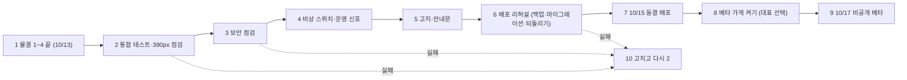

# 물결 5 계획: 동결 전 통합 점검·베타 준비 (COMMERCE_WAVE5_PLAN)

> 2026-09-30 (KST) / Claude. 상위 계획 [APP_COMMERCE_PLAN](APP_COMMERCE_PLAN.md) §2. 일정 제약 D47: **10/15 배포 동결, 10/17 비공개 베타(초대 사장님 약 10명), 11/14 정식 오픈 목표**.
> 물결 1~4(앱형 시안·보며 고치기·주문 결제·스탬프 쿠폰)는 10/13에 끝난다. 물결 5는 **새 기능을 더하지 않고** 네 물결을 베타에 안전하게 싣는 일이다.

## 0. 결론

- **기능은 늘리지 않는다.** 이 물결에서 새로 만드는 코드는 비상 스위치 1개, 통합 테스트 1개, 운영 신호 2개뿐이다. 나머지는 점검·문서·배포 리허설이다.
- **베타에서 주문·스탬프는 "켠 가게만"**: 기본은 꺼 두고, 대표가 고른 가게에만 사장님과 같이 켠다. 결제는 계속 **테스트 채널**(W3-E)이다.
- **비상 스위치**: 서버 설정 하나로 모든 가게의 주문 폼·결제·스탬프 화면을 한꺼번에 끈다(사이트는 그대로, "전화로 주문" 시트로 돌아감). 재배포 없이 끌 수 있어야 한다.
- 10/15 동결 뒤에는 **버그 수정만**(D47). 동결 전 마지막 배포는 0017·0018 마이그레이션을 포함하므로 **운영 DB 백업 → 적용 → 되돌리기 연습**을 리허설에서 한 번 한다.

## 1. 흐름

| 번호 | 단계 | 설명 |
|---|---|---|
| 1 | 물결 1~4 끝 | W4-E(실기기 바코드·전체 흐름) 합격이 시작 조건 |
| 2 | 통합 점검 | 자동 통합 테스트 1개(§2 5-1) + 품질 점검 36쪽 + 주문·스탬프 켠 카페 390px 캡처 |
| 3 | 보안 점검 | 물결 2~4 변경분 전체(§2 5-2). 막는 것 0건이어야 다음 |
| 4 | 스위치·신호 | §2 5-3·5-4 |
| 5 | 고지·안내 | 개인정보처리방침 추가 문구 초안(대표 승인), 베타 사장님 1쪽 안내문 |
| 6 | 리허설 | 운영과 같은 구성의 서버에서 백업 → 배포 → 흐름 한 바퀴 → 되돌리기 → 다시 배포 |
| 7 | 동결 배포 | 리허설과 같은 절차. 이후 버그 수정만 |
| 8 | 가게 켜기 | 대표가 고른 가게만 `order_on`·스탬프 규칙을 사장님과 함께 켠다 |
| 9 | 베타 | D41·D47 그대로 |
| 10 | 되돌아가기 | 2·3·6에서 막는 문제가 나오면 고치고 2부터 |

## 2. 할 일

| 번호 | 일 | 합격 기준 | 누가 | 날짜 |
|---|---|---|---|---|
| 5-1 | **통합 테스트** `tests/unit/test_commerce_flow.py`: 주문 폼 → 인증 → `/pay` → (포트원 가짜) 완료 → 도장 적립 → 목표 도달 쿠폰 발급 → 다음 주문에 쿠폰 잡기 → 0원이면 무료 완료 → 매장 사용 거절(이미 씀) → 전액 환불 → 도장 회수 | 한 테스트로 끝까지, 기존 단위 테스트와 함께 통과 | OpenCode W5-A | 10/13 |
| 5-2 | **보안 점검**: 물결 2~4 커밋 범위 `/security-review` + 손 점검 목록 — 사장님 경로의 가게 확인(남의 가게 404), 웹훅 서명, `/pay`·`/my` CSP·캐시, 쿠폰 번호 추측(12자리 난수 + 사장님 입력 제한), 기기 쿠키 경로·서명, 미리보기 iframe `allow-same-origin` 없음, 금액이 서버 값에서만 | 막는 문제 0건. 나온 것은 고치거나 대표 판단 | Claude | 10/13~10/14 |
| 5-3 | **비상 스위치** `.env` `COMMERCE_PAUSED`(기본 false) + 서비스 재시작(재배포 불필요, [WAVE5_CONTRACT](WAVE5_CONTRACT.md) §0). False면: 공개본 렌더에서 `order_form`·`stamps`를 넣지 않음, `/api/orders/*`·`/pay/*`는 "지금은 온라인 주문을 잠시 멈췄어요. 전화로 주문해 주세요" 200 화면, 웹훅은 그대로 받아 기록(돈이 오간 결제는 확정해야 함). 켜고 끈 뒤 `scripts/republish_commerce.py`로 켠 가게들의 공개본 다시 공개 | 끄면 1분 안에 모든 공개본에서 주문 폼이 사라짐(테스트), 웹훅은 계속 처리 | OpenCode W5-A | 10/13~10/14 |
| 5-4 | **운영 신호** 2개를 기존 익명 사건 기록(`funnel.record`)에 남기고 `funnel.report()`에 한 줄씩: ① 포트원 조회 금액·통화 불일치로 `failed`가 된 결제(`payment_mismatch`) ② 웹훅 서명 실패(`webhook_bad_signature`). 관리자 사이트 문제 신호(D49)·텔레그램 보내기는 아직 코드에 없어 **그때 붙인다** | 가짜로 일으켜 보고서 숫자 +1 | OpenCode W5-B | 10/14 |
| 5-5 | **고지 초안**: 개인정보처리방침 추가(결제 처리 위탁: 포트원·토스페이먼츠 / 손님 스탬프·쿠폰: 전화번호·도장 기록·쿠폰 번호, 보관 기간은 §3 결정대로), 공개 사이트 주문 폼 한 줄, 내 스탬프 화면 한 줄 | 대표 승인. **법률 검토(L1~L6)는 실결제 전 필수로 남김** | OpenCode W5-B 초안 → Claude 검토 → 대표 | 10/14 |
| 5-6 | **베타 사장님 안내문**(1쪽, 휴대폰으로 읽는 글): 보며 고치기, 앱형 시안, 공지 띠·팝업, 주문 받기 켜기(테스트 결제라 돈이 안 나감), 스탬프 규칙, 쿠폰 사용(번호 입력·카메라) | 대표가 한 번 읽고 막힘 없음 | OpenCode W5-B 초안 → Claude | 10/14 |
| 5-7 | **품질 점검**: `evals/run_site_quality` 36쪽 전후 비교(물결 1 직전 73e176a 대비 나빠진 항목 0) + 주문 켠 카페·스탬프 켠 카페 1쪽씩 390px(넘침·작은 칸·대비) | 나빠진 항목 0 | Claude | 10/14 |
| 5-8 | **배포 리허설**: `DB_OPERATIONS` §3·§4 대로 백업 → `scripts/deploy.sh` → 0017·0018 적용 확인 → 흐름 한 바퀴(테스트 결제 포함) → `scripts/rollback.sh` + 마이그레이션 0016으로 내리기 → 다시 배포. 걸린 시간 기록 | 되돌리기 뒤 기존 사이트·예약 정상, 다시 배포 뒤 주문 정상 | Claude + 대표(서버 권한) | 10/15 오전 |
| 5-9 | **동결 배포** | 5-8과 같은 절차, 배포 뒤 스모크(휴대폰 점검 `tests/e2e/mobile_flow.py` 11단계 + 주문 1건) | Claude | 10/15 |
| 5-10 | **남은 빚 정리**(동결 전에 할 수 있는 것만) — 아래 §4 | §4 표의 "동결 전" 줄 | OpenCode W5-C | 10/13~10/14 |

## 3. 대표 결정 필요

| # | 질문 | 추천 |
|---|---|---|
| Q1 | 베타 10곳 중 주문·스탬프를 켤 가게 | **포장 주문 카페 1~2곳만**(주문은 A-pickup만 지원). 스탬프는 매장 사용·수동 적립만으로도 쓸 수 있으니 카페·식당·미용실 중 원하는 곳 2~3곳 |
| Q2 | 손님 도장·쿠폰·주문 보관 기간 | 도장·쿠폰은 **마지막 활동 1년 뒤 삭제**, 주문(매출 기록)은 **5년**(전자상거래 거래 기록 보존 관행 — 법률 검토 L1~L6에서 확정). 물결 4까지는 "지우지 않음" 상태라 결정 전까지 쌓이기만 한다 |
| Q3 | 베타 중 테스트 결제를 손님에게 보여 줄지 | **보여 준다**(띠 문구 "테스트 결제예요. 실제로 돈이 나가지 않아요"). 손님이 실제로 결제를 눌러 보는 흐름이 베타 검증 대상 |
| Q4 | 실결제 시점 | 11/14 정식 오픈과 **분리**. PAYMENT_PLAN §2.3 상담 결과 + 법률 검토 + 약관이 끝난 뒤 따로 결정. 오픈은 테스트 결제 또는 주문 꺼 둔 채로도 가능 |
| Q5 | 동결 뒤 발견된 결제·쿠폰 버그 | 돈·개인정보에 닿으면 동결 중에도 고쳐 배포(리허설 절차 그대로), 화면 문제는 베타 뒤 |

## 4. 남은 빚 (검토 중 나온 것)

| 빚 | 어디서 | 처리 |
|---|---|---|
| AI 이미지 테스트가 `.env`의 실제 키에 기대어 키 없는 곳(CI)에서 실패 | W2-D 검증 | **동결 전** — 테스트에서 키를 가짜로 넣기 (W5-C) |
| 편집기 패널이 길어 저장 버튼까지 스크롤 | W2-D 캡처 | **동결 전** — 저장 버튼을 패널 아래 고정 (W5-C) |
| 더한 구역이 문의 양식 뒤에 붙음 | W2-A | **동결 전** — 더한 구역을 `inquiry` 바로 앞에 넣기 (W5-C, `layout_edits.normalize` 한 곳) |
| 환불: 포트원 취소 성공 뒤 DB 저장 실패 시 기록 없음 | W3-B 검토 | 베타 뒤 — 지금은 운영 신호 대신 로그 + 포트원 콘솔 대조 절차를 안내문(운영용)에 적음 |
| `complete()`가 포트원 조회 동안 결제 행을 잠금(최대 10초) | W3-B 검토 | 베타 뒤 — 규모상 문제 없음. 트래픽이 생기면 조회를 잠금 밖으로 |
| 손님 정리 함수가 주문·도장·쿠폰 손님을 지우던 것 | W4-C 준비 | W4-C에서 고침(확인만) |

## 5. 작업 묶음 (OpenCode)

| 묶음 | 담당 파일 | 선행 | 날짜 |
|---|---|---|---|
| W5-A 통합 테스트·비상 스위치 | `tests/unit/test_commerce_flow.py`(신규), `app/config.py`(한 줄), `app/api/orders.py`(스위치 검사), `app/services/design.py`(스위치 검사), `tests/unit/test_commerce_switch.py`(신규) | W4-C·D 커밋 | 10/13~10/14 |
| W5-B 운영 신호·문서 초안 | `app/services/payments.py`(신호 두 곳 기록만), `app/services/funnel.py`(보고서 두 줄), `docs/product/PRIVACY_COMMERCE_DRAFT.md`(초안, `static/privacy.html`은 대표 승인 뒤 Claude가 옮김), `docs/product/BETA_OWNER_GUIDE.md`·`COMMERCE_RUNBOOK.md`(신규) | W4-C·D 커밋 | 10/14 |
| W5-C 빚 정리 | `tests/unit/test_ai_images.py`, `frontend/src/editor/editor.css`·`SectionPanel.tsx`(저장 버튼 고정만), `app/services/layout_edits.py`(더한 구역 위치만) + 해당 테스트 | 없음(지금도 가능) | 10/13 |

W5-A와 W5-B는 `app/services/payments.py`를 같이 만지지 않게, W5-A는 payments.py를 건드리지 않는다. 계약서 [WAVE5_CONTRACT](WAVE5_CONTRACT.md)(9/30 작성, W4-C·D 결과가 다르면 실행 전에 고친다).

## 변경 이력

| 날짜 | 내용 |
|---|---|
| 2026-09-30 | 처음 작성 |
| 2026-09-30 | W5-A·B 계약 반영: 스위치는 .env+재시작, 방침은 문서 초안, 운영 신호는 사건 기록+스크립트 |
