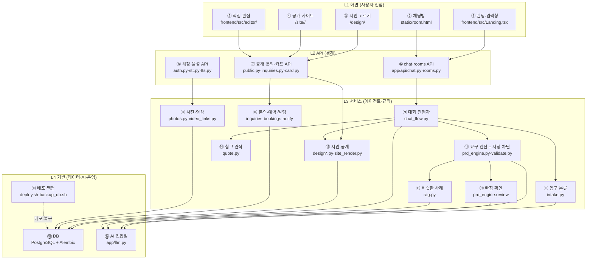
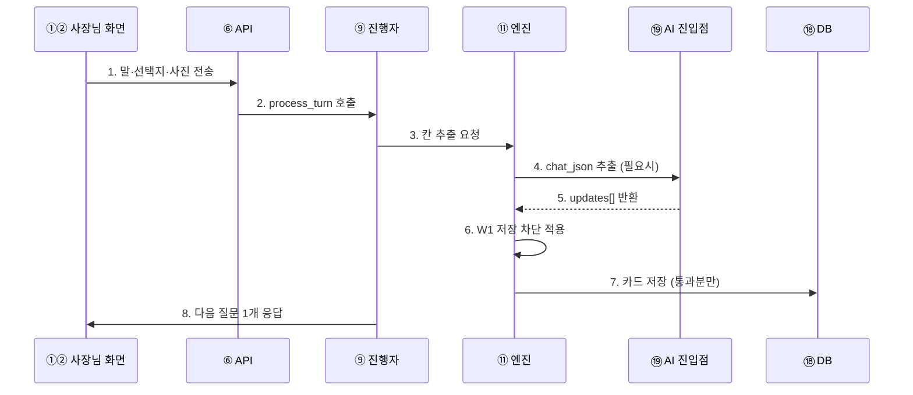
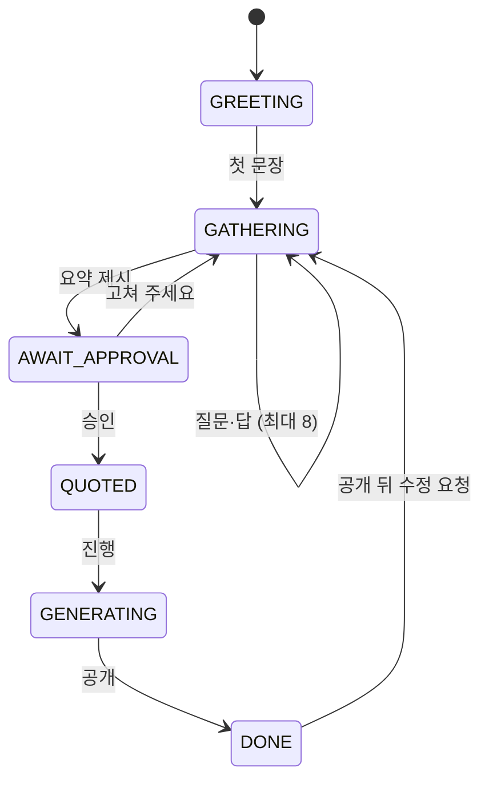

# 컴포넌트 카탈로그 (레이어·의미·인터페이스)

> 위치: L3 설계 / 상태: 정본 / 버전: 1.0 (2026-09-27)
> 용어: `docs/external/GLOSSARY.md`. 추적: `docs/external/TRACEABILITY.md` (SW-1~21).
> 번호 규칙: 다이어그램의 ①②…은 아래 설명표의 번호와 1:1이다. 번호는 다이어그램 안에서만 쓰고, 문서 본문에서는 이름으로 부른다.

## 1. 레이어 구조

### 번호 설명

| 번호 | 컴포넌트 | 의미 (한 줄) |
|---|---|---|
| ① | 랜딩·입력창 | 가치 제안 + 첫 문장 입력. React |
| ② | 채팅방 | 질문·선택지·음성·사진 입출력 화면. 4초 폴링 |
| ③ | 시안 고르기 | 3안 비교·선택 페이지 (별도 호스트) |
| ④ | 공개 사이트 | 방문자가 보는 최종 사이트. sandbox 격리 |
| ⑤ | 직접 편집 | 카드 값을 직접 고치는 화면 (방장만) |
| ⑥ | chat·rooms API | 대화·방·투표·초대의 HTTP 경계 |
| ⑦ | 공개·문의·카드 API | 시안·사이트 서빙, 문의 접수, 카드 조회·수정 경계 |
| ⑧ | 계정·음성 API | OAuth 콜백·세션, STT·TTS 경계 |
| ⑨ | 대화 진행자 | 상태 기계(GREETING→…→DONE)로 다음 담당 호출. AI 없음 |
| ⑩ | 입구 분류 | 종류 분류·금지 거절·질문 예산. AI 없음 |
| ⑪ | 요구 엔진 + 저장 차단 | 발화→칸 추출(NIM)+근거 검사+다음 질문 1개. 틀린 값 저장 차단(W1) |
| ⑫ | 빠짐 확인 | 요약 직전 원문↔카드 대조 1회 (NIM) |
| ⑬ | 비슷한 사례 | 사례집 42+프로필 9 임베딩 검색 (NIM) |
| ⑭ | 참고 견적 | 규칙 한 줄 계산. AI 없음 |
| ⑮ | 시안·공개 | 카드→3안 렌더→열기 전 검사→공개. AI 없음 |
| ⑯ | 문의·예약·알림 | 폼 저장→채팅방 알림+카톡, 예약 확정/거절 |
| ⑰ | 사진·영상 | EXIF 제거·축소·갱신, 영상 링크→카드. AI 없음 |
| ⑱ | DB | rooms·sessions·chat_turns·attachments·inquiries·bookings·funnel. 상태 전체 |
| ⑲ | AI 진입점 | `chat`·`chat_json`·`embed` 단일 진입 + 3단 폴백 |
| ⑳ | 배포·백업 | 스냅샷+자동 롤백, 일일 백업+서버밖 복사 |

## 2. 컴포넌트 입출력·역할표

| # | 입력 | 출력 | 역할 (언제 불리는가) |
|---|---|---|---|
| ⑨ | `process_turn(session_id, session, user_text, base_url, room)` | 답장 문자열 + 상태 전이 기록 | 매 턴 1회. 상태 보고 ⑩⑪⑭⑮ 중 하나 호출 |
| ⑩ | 첫 문장 텍스트 | 종류(가게·개인·단체·웹서비스)+프로필, 또는 거절문 | 대화 시작 1회 + 종류 바뀔 때 |
| ⑪ | `turn`/`extract_detail(text, last_question)` → updates[] | 카드 변경 + 다음 질문 1개 | 매 턴. `apply_updates`에서 W1 차단 적용 |
| ⑫ | `review(원문, 카드)` | 빠진 요구 보충 (인용 확인될 때만) | 요약 직전 1회 |
| ⑬ | 발화 텍스트 | 가장 비슷한 사례 1개 + 안내문 | 요약 전 1회. 실패해도 계속 |
| ⑭ | `rule_quote(확정 카드)` | "외주면 약 OO만원 상당 · 베타 무료" | 승인 뒤 1회 |
| ⑮ | 확정 카드 | 시안 3안 URL → 선택 → 공개 URL | 승인 뒤. 검사 실패 시 게시 차단 |
| ⑯ | 문의 폼 / 예약 폼 | 저장 + 채팅방 알림 + 카톡 | 방문자·사장님 요청 시 |
| ⑰ | 사진 파일 / 영상 링크 | 정제 JPEG + 카드 반영 / 영상 카드 | 업로드·링크 시 |
| ⑲ | `chat`·`chat_json(system, user)`·`embed`·`embed_many` | 모델 문자열·벡터 | ⑩⑪⑫⑬에서 호출. 과부하 시 자동 폴백 |
| ⑱ | SQL (트랜잭션) | 행. 보관: 문의 30일·채팅 90일 | 전부. 인메모리 상태 금지 |

## 3. 컴포넌트 간 계약 (contracts/)

| 계약 파일 | 연결 | 상태 |
|---|---|---|
| `gate_to_quote.schema.json` (BND-1) | 승인 → 견적 | ⚠ v0.1 잔재. 현재 `rule_quote(카드)` 직접 호출이라 스키마 대조 필요 |
| `gate_to_spec`·`spec_to_planner` | 승인 → Hermes 구 패스 | ⚠ 구식. 기본 경로가 시안 공개(D31)로 바뀌어 참조용 보관 |
| `quote_to_design`·`design_to_link` | 견적 → 시안 → 링크 | ⚠ v0.1 잔재. 대조 필요 |
| `rag_query.schema.json` (BND-8) | 사례 검색 요청/응답 | 현행 (사례집 기준) |
| `review_to_deliver` (+rejected 예시) | 검토 → 전달 | 현행 (⑱ 사람 검토 의미 유지) |
| `deploy_to_review.schema.json` | 배포 → 검토 | 현행 |

> 계약 대조 debt: BND-1·quote_to_design·design_to_link는 코드와 1:1 대조 후 "현행" 또는 "보관"으로 확정한다 (S4 링크 검사 때 함께).

## 4. 한 턴 시퀀스 (번호 + 설명)

| 번호 | 설명 |
|---|---|
| 1 | 화면이 글·선택·음성전사·사진을 API로 보낸다 |
| 2 | API가 세션을 읽어 진행자에 위임한다 |
| 3 | 진행자가 상태(GATHERING 등)에 따라 엔진에 추출을 요청한다 |
| 4 | 엔진이 필요할 때만 AI에 추출을 요청한다 (규칙으로 되는 건 AI 없이) |
| 5 | AI가 칸 변경 목록을 돌려준다. 지어낸 값은 여기서 1차 탈락 |
| 6 | W1이 전화·시간·가격·민감정보를 검사해 틀린 값은 버린다 |
| 7 | 통과분만 DB 카드에 저장한다. 버려진 칸은 pending 유지 |
| 8 | 진행자가 다음 질문 1개를 골라 화면에 돌려준다 |

## 5. 상태 (클래스 수준)

| 상태 | 칸 상태와 관계 |
|---|---|
| GATHERING | 칸이 FILLED·PENDING·PLACEHOLDER로 모인다 |
| AWAIT_APPROVAL | 리뷰어(⑫)가 먼저 돌고 카드가 고정된다 |
| QUOTED·GENERATING | 카드 변경 금지. `rule_quote`·시안은 고정 카드만 읽는다 |
| DONE | 직접 편집(⑤)으로 칸을 고치면 공개본에 반영, 버전 기록 |

## 변경 이력

| 버전 | 날짜 | 내용 |
|---|---|---|
| 1.0 | 2026-09-27 | 초판 (레이어 4·컴포넌트 20·계약 8종 상태 표기·시퀀스·상태도) |
