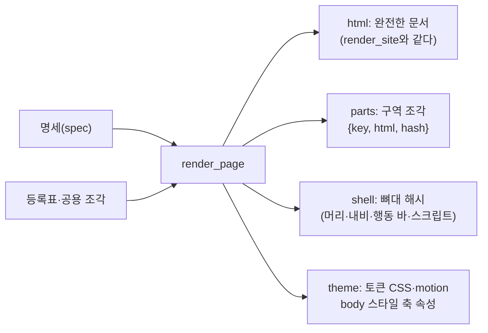
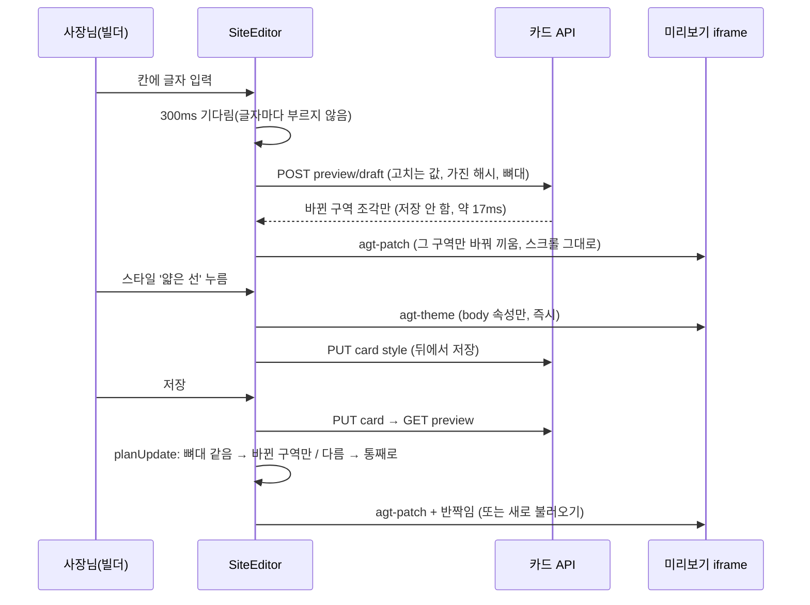

# 컴포넌트 엔진: 공통 부분 정리 · 디자인 다양화 · 실시간 렌더링 (COMPONENT_ENGINE_PLAN)

> 2026-10-04 (KST). 대표 요청: "사이트의 컴포넌트와 디자인을 다양화하고, 공통이 될 수 있는 부분을 분석해 컴포넌트로 개발하라. 테일윈드가 필요하면 도입해 실시간 렌더링이 되는 컴포넌트 엔진을 만들어라."
> 설계·구현·검증 Claude. 관련: [SECTION_LIBRARY_SPEC](SECTION_LIBRARY_SPEC.md)(토큰·부품 원본), [EDIT_WAVE2_CONTRACT](EDIT_WAVE2_CONTRACT.md)(보며 고치기), [MODULE_SCHEMA_PLAN](https://github.com/kyungsikjeung/agt001/pull/37)(내용 유형표).

## 0. 결론

1. **테일윈드는 도입하지 않는다.** 공개 사이트는 스크립트·외부 파일 없이(CSP sandbox, 게시 전 검사) CSS를 문서 안에 넣고, 색·글꼴·여백은 사이트마다 CSS 변수로 바꾼다. 테일윈드가 줄 수 있는 것(유틸리티 클래스)보다 옮기는 비용·3안 모양 흔들림이 크다. 대신 **CSS 변수 토큰 층**(테일윈드 v4도 내부는 이 방식)을 넓혔다(§2).
2. **공통 부분**: 구역 제목 "제목이 비면 기본 제목" 조각이 23개 템플릿에 반복 → 공용 조각 `{{> label}}` 하나 + 기본 제목은 **컴포넌트 등록표**(`templates/components.json`)로 옮겼다. 등록표가 58개 부품의 이름·설명·바꿔 쓸 수 있는 모양 묶음·스타일 축을 한곳에 둔다(§3).
3. **실시간 렌더링 엔진**: 렌더러가 문서를 **구역 조각**(구역 id·해시)·**뼈대 해시**·**토큰 CSS**로 나눠 준다(`site_render.render_page`). 빌더는 저장·입력할 때 iframe을 새로 불러오지 않고 **바뀐 구역만 바꿔 끼우고**(agt-patch), 색·스타일은 **토큰만 갈아 끼운다**(agt-theme). 입력 중에는 300ms 뒤 저장 없이 미리 그린다(draft, 서버 약 17ms)(§4·§5).
4. **다양화**: 사이트 전체 **스타일 축 2개 × 4값**(카드 면·구역 제목) + **새 변형 3종**(사진 벽돌 쌓기·두 줄 메뉴판·큰 인용문) + 구역별 **모양 바꾸기 묶음 5개**. 한 안에서 고를 수 있는 조합이 1가지(고정) → **9,600가지**(모양 600 × 스타일 16, 색·글꼴 제외)(§6).
5. **안전**: 기본값은 지금 모양 그대로다. 시안·공개본 출력은 **528개 렌더에서 한 글자도 바뀌지 않았음**을 확인했다(§7). 공개 사이트 모양은 사장님이 고를 때만 바뀐다.

## 1. 분석 (2026-10-04 코드 기준)

### 1.1 부품 목록

| 항목 | 값 |
|---|---|
| 템플릿 | 55개(27종류) → 58개(+3 새 변형) |
| 많은 종류 | hero 9 · offerings 5→6 · contact 5 · gallery 3→4 · intro 3→4 · booking 3 · around 3 · staff 3 |
| 실제 쓰이는 길 | 청사진 11개(A~I)가 쓰는 부품: hero·intro(인사말)·offerings(분류·가격표·시그니처)·gallery·around·staff·rooms·classes·timetable·청첩장 부품. reviews·features·stats·cta는 옛 샘플 길에서만 |
| CSS | site.css 2,142줄 + 부품 CSS 4개 762줄 (층: P2 → 컨셉 → 편집형 → 적합성 → QA 덮어쓰기) |
| 렌더 | Mustache(chevron) 서버 렌더 → 완전한 문서 한 장. 빌더 미리보기는 저장할 때마다 iframe을 통째로 다시 불러옴(기다림 표시·스크롤 처음으로) |

### 1.2 공통이 될 수 있는 부분

| 반복 | 횟수 | 처리 |
|---|---|---|
| 구역 뿌리 `<section class="s-T s-T--V" data-section-id aria-labelledby>` + `<h2 id="T-title-…">` | 39 | 모양 규약으로 유지(엔진이 이 뿌리로 구역을 찾는다) |
| 제목 비면 기본 제목 `{{#label}}…{{^label}}기본{{/label}}` | 24(23 + 기본값 2개인 rooms) | **공용 조각 `{{> label}}` + 등록표 `label_default`로 추출** |
| 버튼 `s-btn` 변형 | 50 | 이미 일관(그대로) |
| 빈칸 표시 `is-placeholder` | 69 | 이미 일관(그대로) |
| 예시 표시 `s-example` | 8가지 모양 | 다음 단계: 조각 `{{> example}}`로 |
| 카드 면 `background: var(--card)` | 16곳 | **스타일 축 surface가 한 번에 다룬다** |

### 1.3 문제점

| 문제 | 근거 | 처리 |
|---|---|---|
| 그림자 값 15가지, 글자 크기 25가지 | CSS 집계 | 단계 토큰 `--elev-1~3`, `--fs-sm~quote` 추가(새 부품부터). 기존은 고칠 때 옮긴다 |
| 11·12px 글자 7곳 | "작은 글자 14px 이상" 규칙과 어긋남 | 다음 단계(기존 모양이 바뀌므로 따로) |
| 사진 `loading="lazy"` 빠짐 12곳 | 템플릿 집계 | 새 부품은 넣음. 기존은 다음 단계 |
| 특이성 덮어쓰기 층("특이성이 높게 덮어쓴다") | site.css 1537줄 등 | 다음 단계: CSS `@layer` 검토(공개본 `!important` 순서가 바뀌므로 골든 비교와 함께) |
| 생성 사이트의 `ed-` 접두어(편집형 부품)가 빌더 편집기 `ed-`와 겹침 | hero--arch 등 | 이름만의 문제라 다음 단계 |
| 저장마다 iframe 통째 새로 불러오기 | SiteEditor | **엔진으로 해결(§5)** |

## 2. 테일윈드 판단 (결정 기록)

| 기준 | 테일윈드 도입 | CSS 변수 토큰(채택) |
|---|---|---|
| 사이트마다 색·글꼴·여백 | 설정을 변수에 묶어야 함(결국 같은 방식) | 렌더러가 `:root` 변수 주입(이미 있음) |
| 공개 사이트 보안(스크립트·외부 파일 없음) | 빌드 시 CSS 생성 필요(Node를 렌더 경로에) | 그대로 |
| 기존 58개 템플릿·2,900줄 CSS | 클래스 전부 다시 쓰기 → 3안 모양·품질 점수 흔들림 | 그대로 두고 단계 토큰만 추가 |
| 실시간 렌더링 | 상관없음(렌더 방식 문제) | 구역 조각·토큰 바꿔 끼우기로 해결 |
| 빌더(React) 화면 | 쓸 수 있으나 `--ed-*` 토큰·editor.css가 이미 있음 | 그대로 |

→ **필요 없다.** 다시 볼 때: 빌더를 처음부터 다시 짤 때, 또는 생성 사이트를 정적 빌드로 바꿀 때.

## 3. 컴포넌트 등록표 (`templates/components.json`, `app/services/components.py`)

```json
{"styles": {"surface": {"default": "soft", "values": {"soft": "부드러운 그림자", "outline": "얇은 선", "flat": "옅은 면", "lifted": "떠 있는 카드"}},
            "heading": {"default": "bar", "values": {"bar": "짧은 밑줄", "eyebrow": "작은 윗글", "center": "가운데 정렬", "display": "큰 제목"}}},
 "groups": {"photos": {"type": "gallery", "binds": ["space_photos", "style_photos", "menu_photos"], "variants": ["grid", "swipe", "marquee", "masonry"]}, "...": {}},
 "components": {"gallery--masonry": {"name": "벽돌 쌓기", "desc": "사진 비율대로 엇갈려 쌓기", "label_default": "사진첩", "new": true}, "...": {}}}
```

| 묶음 | 종류(bind) | 모양 |
|---|---|---|
| hero | hero | 사진 겹침·사진 옆·글자 강조·아치 사진·어두운 영화풍 |
| greeting | intro(greeting) | 짧은 소개·**큰 인용문** |
| catalog | offerings(catalog) | 분류 메뉴판·가격표·**두 줄 메뉴판**·사진 격자·사진 카드 |
| photos | gallery(사진 3종) | 격자·옆으로 넘기기·자동 흐름·**벽돌 쌓기** |
| location | around(location) | 지도·지도와 목록·교통 안내 |

- 같은 묶음 = 같은 데이터(bind)로 채울 수 있는 모양만. 사람 수로 모양이 정해지는 선생님 구역은 묶음이 없다.
- `components.problems()`: 템플릿·등록표·묶음·기본 제목이 서로 맞는지(테스트가 늘 확인).

## 4. 렌더 엔진 (`site_render.render_page`)



- `render_site`는 `render_page(...)["html"]`. 구역 밖 조각은 `@nav`·`@notice`·`@actionbar`·`@tabbar`·`@edit-script` 같은 이름.
- 편집 미리보기(edit=True)만 토큰 CSS를 `<style id="agt-theme">`·`<style id="agt-motion">`로 떼어 둔다(내용·순서 같음). 시안·공개본은 그대로.
- 편집 미리보기 스크립트가 `agt-patch`(구역 바꿔 끼우기·순서·반짝임)와 `agt-theme`(토큰·속성)을 **부모 창에서 온 것만** 받는다. 구역은 속성 값 비교로 찾는다(선택자에 id를 넣지 않음).

## 5. 실시간 미리보기 흐름



| API | 하는 일 |
|---|---|
| `GET /api/rooms/{id}/card/preview` | 기존 + `shell`·`order`·`theme`·`parts[{id,hash}]`·`style`·`styles`, 구역마다 `variant`·`base_variant`·`shapes` |
| `POST /api/rooms/{id}/card/preview/draft` | `{variant, fields?, layout?, style?, have, shell}` → 카드 사본에만 적용해 그린 뒤 바뀐 구역 html만, 뼈대가 다르면 완전한 문서. 방장만 |
| `PUT /api/rooms/{id}/card` | `style: {variant, surface, heading}`(안별 저장), `layout.variants: {구역 id: 모양}`(빼면 지금 값 유지, `{}`면 기본 모양으로) |

## 6. 다양화

| 무엇 | 내용 |
|---|---|
| 스타일 축 surface | soft(지금) · outline(투명 + 선) · flat(주색 8% 면) · lifted(깊은 그림자 + 손대면 살짝 뜸). 카드 면 12종에 한 번에 걸린다 |
| 스타일 축 heading | bar(지금) · eyebrow(작은 굵은 글 + 강조 막대) · center · display(큰 제목 + 아래 선) |
| 새 변형 | `gallery--masonry`(4:5·1:1·3:4 비율 돌림, 넓은 화면 3열) · `offerings--compact`(점선 이음 메뉴판, 넓은 화면 2열) · `intro--quote`(큰 인용문) |
| 구역 모양 바꾸기 | 빌더 구역 칸 맨 위 '모양' 카드(이름·한 줄 설명·새 표시). 누르면 미리보기에 먼저 그리고 저장. 말로 고른 1안에서도 빌더에서 고른 모양이 대화 모양보다 우선 |
| 3안 차이 점수 | 스타일 축이 다르면 1점씩 더한다(최대 17 → 19) |
| 어두운 띠 안 | 축 스타일은 `--card`·`--line`·`currentColor`만 써서 어두운 띠(inverse)에서도 흰 글자가 읽힌다 |

## 7. 검증

| 확인 | 결과 |
|---|---|
| 골든 코퍼스: 샘플 6 + 청사진 11×3안×빈·채운 카드 + 템플릿마다 한 구역(제목 있음·없음) × 시안·공개·편집 | 528개 렌더. 공용 조각·엔진 바꾼 뒤 **시안·공개 352개 바이트까지 같음**, 편집 176개는 토큰 style 분리만 다름. CSS 추가 뒤에도 CSS를 뺀 문서 528개 같음 |
| 파이썬 테스트 | `tests/unit/test_component_engine.py` 14개, `tests/unit/test_live_preview.py` 7개, `tests/engine/test_compose_v1.py` 1개 추가. 전체 1499개 통과 |
| 프런트 테스트 | `livePreview.test.tsx` 7개 추가(계획 계산, 저장 뒤 조각 교체·문서 그대로, 입력 미리 그리기·저장 안 함, 스타일 즉시·저장, 모양 바꾸기) |
| 눈으로 | `scripts/component_gallery.py --shots`: 모양 묶음 19칸 + 스타일 8칸을 390px로 캡처해 확인 |
| 속도 | 미리 그리기 서버 중앙값 16.6ms(최대 21ms), 문서 102KB 대신 바뀐 구역 몇 KB |

## 8. 컴포넌트 갤러리 (`scripts/component_gallery.py`)

`.venv/bin/python scripts/component_gallery.py [--shots]` → `generated/component-gallery/index.html`. 모양 묶음마다 같은 내용으로 모든 모양을, 스타일 축마다 같은 사이트를 휴대폰 폭 칸으로 나란히 보여 준다. 등록표 점검 결과도 위에 한 줄.

## 9. 다음 단계·대표 결정

| # | 무엇 | 추천 |
|---|---|---|
| Q1 | 3안 기본 스타일을 역할별로 다르게(① 정석 soft·bar ② 분위기 outline·eyebrow ③ 대비 lifted·display) | **새로 만드는 시안부터만** 적용(카드에 표시를 남겨 옛 사이트는 그대로). 갤러리 캡처를 보고 결정 |
| Q2 | 이미 공개된 사이트에 새 CSS 반영 | 모양이 바뀌는 규칙은 없으니 급하지 않음. 다음 배포 때 `scripts/republish_all.py` |
| N1 | 기존 부품을 단계 토큰(--elev·--fs)으로 옮기기 + 11·12px 정리 + 사진 lazy | 부품 하나씩, 골든 비교와 갤러리 캡처로 확인하며 |
| N2 | 실시간 대화(live.html)도 조각 바꿔 끼우기 | 같은 render_page를 쓰면 됨 |
| N3 | 실시간 대화 선택지(compose)에 새 모양(벽돌 쌓기·두 줄 메뉴판) 넣기 | 선택지 문구만 추가 |
| N4 | CSS `@layer`로 덮어쓰기 층 정리 | 공개본 `!important` 순서가 바뀌므로 골든 비교 + 갤러리로 |
| N5 | 예시 표시 8가지를 공용 조각 `{{> example}}`로 | 등록표에 문구를 두고 |

## 변경 이력

| 날짜 | 내용 |
|---|---|
| 2026-10-04 | 처음 작성: 분석·테일윈드 판단·등록표·render_page·실시간 미리보기·스타일 축·새 변형 3종·갤러리 |
