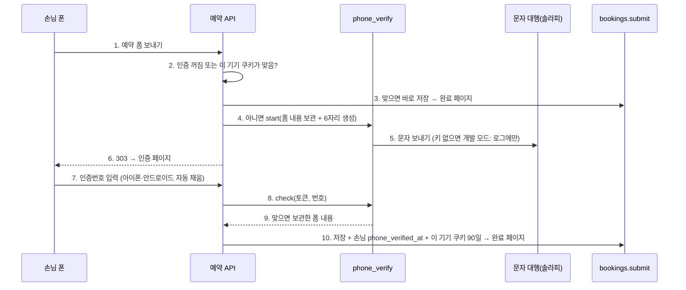

# 손님 명단·겹침 막기·문자 인증 — 계약·작업판 (CUSTOMER_PLAN)

> 2026-09-28 (KST). 근거: [research/RESEARCH_CUSTOMER_IDENTITY](research/RESEARCH_CUSTOMER_IDENTITY.md) 단계 1~3, 대표 결정(손님 회원가입 없음·본인인증 기본 끔·문자 인증은 기기 기억 + 자동 입력·보관은 지금 규칙과 같게).
> 운영 방식은 [BUILD_W1_W2 §0](BUILD_W1_W2.md)과 같다: 계약·검토·전체 테스트·커밋은 Claude, 구현은 OpenCode, 물결마다 소유 파일이 겹치지 않는다.

## 1. 계약

### 1.1 표 `customers` (Alembic 0011)

| 칸 | 형 | 설명 |
|---|---|---|
| id | bigint PK | |
| site_key | text | 가게(`sessions.requirement_id`) |
| phone | text | 정규화한 번호(숫자만, `+82` → `0`). `bookings.phone`처럼 평문 — 같은 DB에 암호화 사본을 따로 두지 않는다 |
| name | text null | 마지막으로 적은 이름 |
| first_seen, last_seen | timestamptz | |
| phone_verified_at | timestamptz null | 문자 인증 통과 시각(2물결) |

유일: `(site_key, phone)`. `inquiries.customer_id`, `bookings.customer_id`: bigint null, FK `customers.id` ON DELETE SET NULL, 색인.

### 1.2 `app/services/customers.py`

| 함수 | 계약 |
|---|---|
| `normalize_phone(raw) -> str \| None` | 숫자만 남김. `82`로 시작하고 11~12자리면 앞 `82`를 `0`으로. 결과가 `0`으로 시작하는 9~11자리가 아니면 None |
| `touch(db, site_key, phone_raw, name) -> int \| None` | 번호가 정규화되면 `INSERT … ON CONFLICT (site_key, phone) DO UPDATE SET last_seen = now(), name = COALESCE(EXCLUDED.name, customers.name) RETURNING id`. 안 되면 None. 호출한 트랜잭션 안에서 돈다 |
| `history(db, customer_id) -> dict` | `{"bookings": n, "inquiries": m}` — 그 손님에 붙은 기존 행 수(지금 넣는 행은 빼고 세도록, 붙이기 전에 부른다) |
| `visit_line(hist) -> str` | 둘 다 0이면 `"처음 오신 손님이에요."`, 아니면 `"이 번호로 예약 {n}번·문의 {m}번 있었어요."`(0인 쪽은 뺀다) |
| `purge_orphans(now=None) -> int` | 붙은 문의·예약이 하나도 없고 `last_seen`이 30일 지난 손님을 지운다 |

### 1.3 마감 검사 `availability.slot_taken(db, site_key, visit_date, visit_time, service) -> bool`

- 확정(`confirmed`) 예약만 센다. 정원은 `schedule(card)["capacity"]`(카드는 `_card_for_site`, 없으면 정원 1).
- 카드 구조 데이터에 객실(rooms)이 있으면 박 단위: `service`의 박 수(`_nights_of`)만큼 입실일부터 날마다, 확정 예약이 덮는 수가 정원 이상인 날이 하나라도 있으면 True.
- 아니면 시간 단위: 같은 날짜·같은 `visit_time` 확정 수가 정원 이상이면 True.
- 넘겨받은 `db` 세션으로 읽는다(확정 때 잠금 안에서 부르기 위해).

### 1.4 붙이기 (2물결 C)

| 곳 | 바뀌는 것 |
|---|---|
| `bookings.submit` | 저장 전에 `slot_taken`이면 `BookingError("이미 마감된 시간이에요. 다른 시간을 골라 주세요.")`. 저장 때 `touch` → `customer_id`, 채팅방·카톡 알림 끝에 `visit_line` 한 줄 |
| `bookings.decide` (confirm) | 트랜잭션 안에서 `pg_advisory_xact_lock(hashtext(site_key || ':' || visit_date))` 뒤 `slot_taken`이면 `SlotFull` → API 409 `slot full`, 상태는 그대로 requested |
| `inquiries.submit` | 연락처가 전화번호면 `touch` → `customer_id`, 알림에 `visit_line` |
| `app/main.py` | 시작 때 `customers.purge_orphans()` (문의·예약 삭제 뒤) |

## 2. 물결

### 1물결 (동시에)

| 작업 | 소유 파일 | 완료 확인 |
|---|---|---|
| **M1** 손님 명단 바탕 | `alembic/versions/0011_customers.py`(새), `app/db/models.py`(CustomerRow + customer_id 두 칸만), `app/services/customers.py`(새), `tests/unit/test_customers.py`(새, DB) | 전용 테스트 DB에서 자기 테스트 통과, `tests/engine` 통과 |
| **M2** 마감 검사 | `app/services/availability.py`(`slot_taken`만 추가), `tests/unit/test_slot_taken.py`(새, DB) | 전용 테스트 DB에서 자기 테스트 + `tests/unit/test_availability.py` 통과 |

### 2물결

| 작업 | 소유 파일 | 완료 확인 |
|---|---|---|
| **M3** 붙이기 | `app/services/bookings.py`, `app/services/inquiries.py`, `app/api/bookings.py`, `app/main.py`, `tests/unit/test_bookings.py`, `tests/unit/test_inquiries.py` | §1.4 전부 + 기존 테스트 통과 |

### 3물결 (문자 인증)

§4 참고. V1 → V2 차례로.

## 4. 3물결 계약: 문자 인증 (기기 기억 + 자동 입력)

### 4.1 흐름

| 번호 | 설명 |
|---|---|
| 1 | 지금 폼 그대로(생성 사이트는 스크립트 없음) |
| 2 | 설정 `booking_phone_verify`(기본 False). 쿠키 `pv_<site_key>`(path `/api/bookings/<site_key>`)의 서명이 맞고, 만료 전이고, 그 안의 번호가 폼 번호(정규화)와 같으면 인증 생략 |
| 3 | 지금 경로 그대로 |
| 4 | `phone_verifications`에 폼 내용(JSON)·번호·인증번호 해시·만료(3분)를 저장하고 추측 못 하는 토큰(`secrets.token_urlsafe(24)`)을 돌려준다. 같은 번호로 60초 안에 다시 요청하면 새로 보내지 않고 거절 |
| 5 | 문자 본문: `[<가게 이름 또는 '예약'>] 인증번호 <6자리>` + 빈 줄 + `@<public_base_url 호스트> #<6자리>`(안드로이드 Web OTP 형식, 없으면 줄 생략) |
| 6 | `/api/bookings/<site_key>/verify/<token>` |
| 7 | 우리 도메인 페이지. `<input name="code" inputmode="numeric" autocomplete="one-time-code" pattern="[0-9]{6}" maxlength="6">`. 스크립트 없음(아이폰 자동 채움은 속성만으로 되고, 안드로이드도 키보드 제안으로 채운다. Web OTP 스크립트는 필요하면 나중) + "다시 보내기" 버튼 |
| 8 | 5번 틀리면 잠김, 3분 지나면 만료 → "다시 보내기"로 새로. 다시 보내기도 1분 제한, **한 번호로 하루 5번까지**(가게 상관없이, 문자 폭탄·비용 막기) — V1 검토 때 추가 |
| 9~10 | 성공 행은 지운다. 쿠키: HttpOnly·Secure·SameSite=Lax·90일 |

### 4.2 모듈

| 파일 | 계약 |
|---|---|
| `app/config.py` | `booking_phone_verify: bool = False`, `solapi_api_key`, `solapi_api_secret`, `sms_sender`(발신번호, 모두 Optional[str]) |
| `app/services/sms.py` | `send(to, text) -> bool`. 세 값이 다 있으면 솔라피 `POST https://api.solapi.com/messages/v4/send`, 본문 `{"message": {"to", "from", "text"}}`, 헤더 `Authorization: HMAC-SHA256 apiKey=<key>, date=<ISO8601>, salt=<랜덤>, signature=<hex(HMAC-SHA256(secret, date+salt))>`, 10초 제한. 없으면 개발 모드: `log.warning`으로 받는 번호 끝 4자리와 본문을 남기고 True. 실패는 False(예외 안 냄) |
| 표 `phone_verifications` (0012) | id, token(유일), site_key, phone(정규화), code_hash(sha256(token + code)), payload(JSONB), attempts int 0, expires_at, created_at. 시작 때 만료 1일 지난 행 삭제 |
| `app/services/phone_verify.py` | `start(site_key, phone_raw, payload, shop_name) -> token`(`VerifyError` 한 줄 사유: 번호 틀림·60초 안 재요청·문자 실패), `check(token, code) -> dict`(payload; `VerifyError`: 없음·만료·틀림(남은 횟수)·잠김), `resend(token) -> token`(같은 payload로 새 행), `device_cookie(site_key, phone) -> str`, `device_ok(cookie, site_key, phone_raw) -> bool`, `purge()`. 서명 키: `token_enc_key` → 없으면 `kakao_client_secret` → 둘 다 없으면 기기 기억 끔(`device_cookie`가 None, `device_ok`는 False) |
| `app/api/bookings.py` | §4.1 2·4·6·7·8·10 경로. 폼 처리(slot·staff·nights 합치기)는 인증 앞에서 한 번만 하고 payload에 합친 값을 넣는다 |

### 4.3 3물결 작업

| 작업 | 소유 파일 | 완료 확인 |
|---|---|---|
| **V1** 인증 바탕 | `app/config.py`(4칸), `alembic/versions/0012_phone_verifications.py`(새), `app/db/models.py`(PhoneVerificationRow만), `app/services/sms.py`(새), `app/services/phone_verify.py`(새), `tests/unit/test_phone_verify.py`(새, DB) | 개발 모드 발송, 틀림·잠김·만료·재요청 제한·쿠키 서명 테스트 |
| **V2** 예약 경로 붙이기 | `app/api/bookings.py`, `app/services/customers.py`(`mark_verified(db, site_key, phone)` 추가만), `app/main.py`(purge 한 줄), `tests/unit/test_bookings_verify.py`(새, DB) | 인증 끔 = 지금과 같음, 켬 = 인증 페이지 → 저장·쿠키, 쿠키 있으면 문자 없이 저장, 다른 번호면 다시 인증 |

## 3. 진행 기록

| 물결 | 결과 | Claude 검토 |
|---|---|---|
| 1 (M1·M2) | `customers` 표·0011 마이그레이션·`customers.py` 5개 함수, `availability.slot_taken` | **수정**: 시간 없이 날짜만 받는 예약은 시간 칸이 없어 막지 않음 |
| 2 (M3) | 예약 신청 때 마감이면 거절 + 손님 연결 + 알림에 "처음 오신 손님이에요 / 이 번호로 예약 n번" 한 줄, 확정 때 날짜 잠금 + 마감이면 409 `slot full`(채팅방은 버튼을 남기고 안내), 전화번호 문의도 손님 연결, 시작 때 빈 손님 삭제 | 수용 |

| 3 (V1·V2) | 문자 인증: `sms.py`(솔라피, 키 없으면 개발 모드), `phone_verify.py`(3분·5번 잠김·1분 재요청), 0012 마이그레이션, 예약 폼 → 인증 페이지(`autocomplete="one-time-code"`) → 저장 + 손님 인증 시각 + 이 기기 쿠키 90일 | **수정**: ① 다시 보내기에 1분 제한이 없어 문자 폭탄 가능 → 1분 + 한 번호 하루 5번 ② 틀린 폼·마감도 문자부터 보냄 → `bookings.submit(check_only=True)`로 먼저 검사 ③ 다시 보낸 문자에 가게 이름 유지 |

**검증(2026-09-28)**: 전체 849개 통과, `draft_fit` 24건 PASS, `draft_score` 통과.
**켜는 법**: 서버 `.env`에 `SOLAPI_API_KEY`·`SOLAPI_API_SECRET`·`SMS_SENDER`(솔라피에 등록한 발신번호) + `BOOKING_PHONE_VERIFY=true`. 기기 기억 서명 키는 `TOKEN_ENC_KEY`(없으면 카카오 Client Secret, 둘 다 없으면 기기 기억 없이 매번 인증). 켜기 전 실제 아이폰·안드로이드로 자동 채움·쿠키 확인.

## 변경 이력

| 날짜 | 내용 |
|---|---|
| 2026-09-28 | 처음 작성 (계약 §1, 물결 3개) |
| 2026-09-28 | 1·2물결 완료 기록 |
| 2026-09-28 | §4 문자 인증 계약, 3물결 완료 기록 |
