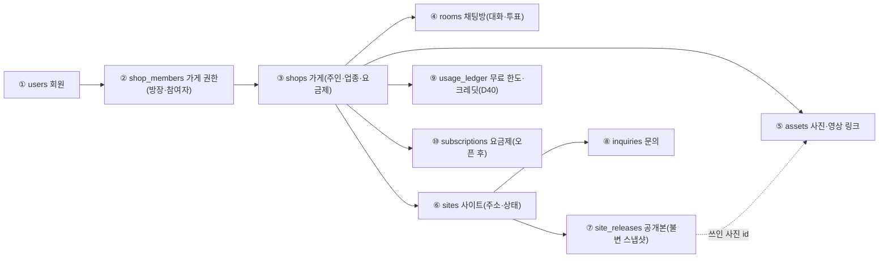
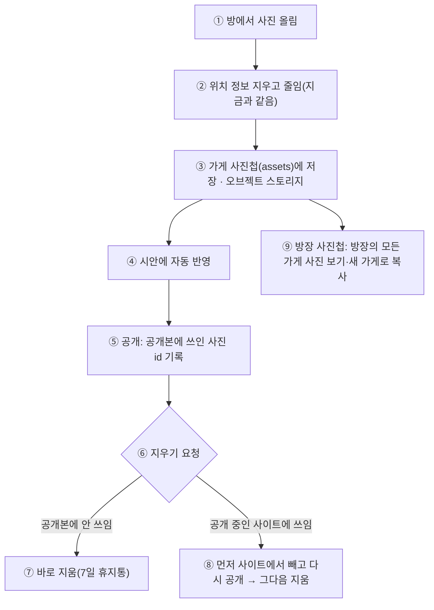

# 데이터 구조 재점검 — 사진·공개 사이트·보관 정책 (2026-09-26)

> 계기: 대표 요청 "방장 기준 사진 보관, 사진이 홈페이지 구성·공개(디플로이)와 어떻게 연결되는지, 서비스 전체 DB 구조 재검토".
> 범위: 지금 코드(`app/db/models.py`, `app/services/photos.py`·`design.py`·`inquiries.py`, `docker-compose.yml`, `scripts/backup_db.sh`)를 읽고 판단했다. 결정은 [DECISIONS.md](DECISIONS.md)에 따로 올린다.

## 0. 5줄 요약

1. **사진과 공개 사이트 파일은 백업되지 않는다.** 매일 백업은 DB(`pg_dump`)뿐이고, 사진은 서버 디스크의 `generated/uploads/`에만 있다. 디스크를 잃으면 사장님 사진은 되살릴 수 없다.
2. **사진이 "채팅방"에 묶여 있다.** 파일 주소가 `/uploads/<방>/<사진>.jpg`이고 공개 사이트가 이 주소를 그대로 쓴다. 방을 지우면(ROOM_POLICY T6) 운영 중인 사이트의 사진이 깨진다. 방장이 사진을 모아 두거나 다른 가게에 다시 쓸 수 없다.
3. **"가게"와 "사이트"가 독립된 데이터가 아니다.** 사이트 = 대화 세션의 `requirement_id`, 주인 = 방에 처음 들어온 사람. 오픈 후 월정액(가게·사이트 단위)을 붙일 곳이 없다.
4. **공개 이력이 없다.** 공개할 때마다 `published/index.html`을 덮어써서, 무엇이 언제 공개됐는지·되돌리기·사이트 내리기(D49) 기록이 없다.
5. **추천**: 베타(10/17) 전에는 **파일 백업만** 붙이고(하루), 오픈(11/14) 전에 **가게·사이트·공개본·사진(자산) 테이블**로 나누고 사진을 오브젝트 스토리지로 옮긴다.

## 1. 지금 구조

| 데이터 | 저장 위치 | 묶인 곳 | 보관·삭제 | 백업 |
|---|---|---|---|---|
| 요구사항 카드(사실·컨셉·사진 목록·고른 안·공개 상태) | `sessions.prd` (JSONB 한 덩어리) | 세션 1개 = 방 1개 | 규칙 없음 | DB 백업 |
| 방·참여자·메시지·투표·초대 | `rooms`, `room_members`, `room_messages`, `room_votes`, `room_invites` | 방 | ROOM_POLICY(닫힘 30일, T6 삭제) — **삭제는 아직 코드 없음** | DB 백업 |
| 사진 정보 | `attachments` (방 외래키, 방 삭제 시 함께 삭제) | 방 | 규칙 없음 | DB 백업 |
| **사진 파일** | 서버 디스크 `generated/uploads/<방>/<id>.jpg` | 방 | 규칙 없음 | **없음** |
| 시안 파일(3안·스크린샷) | `generated/<id>/design/` | 세션 | 다시 그릴 수 있음 | 없음(재생성 가능) |
| **공개 사이트 파일** | `generated/<id>/published/index.html` (덮어쓰기) | 세션 | 이력 없음 | **없음**(카드로 다시 그릴 수는 있음) |
| 사이트 문의 | `inquiries` (`site_key` 글자, 외래키 없음) | 사이트 키 | 30일(1년 여부 미정, Q-4) | DB 백업 |
| 회원·로그인·카카오 알림 토큰(암호화) | `users`, `oauth_accounts`, `login_sessions` | 회원 | 탈퇴 유예 30일(계획) | DB 백업 |
| 대화 기록·유입·디자인 기록 | `chat_turns`, `funnel_events` | — | 90일 자동 삭제 | DB 백업 |
| API 키·이전 키·관리자 기록 | `secrets`, `secret_versions`, `admin_audit` (D50) | — | 이전 키 7일, 기록은 미정(L6) | DB 백업(암호화된 채) |

## 2. 문제 목록

| # | 문제 | 영향 | 심각도 |
|---|---|---|---|
| D-1 | 사진·공개 파일 백업 없음 | 서버 디스크 고장·실수로 사장님 사진 영구 손실 | **베타 전 필수** |
| D-2 | 사진이 방에 묶임(주소·외래키·삭제 연쇄) | 방 삭제 시 운영 중 사이트 사진 깨짐, 방장 사진첩·재사용 불가 | 오픈 전 |
| D-3 | 가게·사이트가 독립 데이터 아님 | 월정액·해지·사이트 주인 이전·여러 사이트 운영 불가 | 오픈 전 |
| D-4 | 공개 이력 없음(덮어쓰기) | 되돌리기·"무엇이 공개됐나" 확인·사이트 내리기 기록 불가 | 오픈 전 |
| D-5 | 카드 JSONB에 사실·디자인·사진·공개 상태가 섞임 | 관리자 조회·통계가 무겁고, 명세(D38) 판 관리가 어렵다 | 오픈 전(나누기), 이후 점진 |
| D-6 | 보관 기간이 테이블마다 흩어지고 일부 미정 | 개인정보 파기 의무·방침 문구와 실제가 어긋날 위험 | 오픈 전 |
| D-7 | 문의에 외래키 없음, 연락처 평문 | 사이트 삭제 시 고아 문의, 유출 시 피해 | 오픈 전(검토) |
| D-8 | 코드생성(hermes) 때문에 앱 컨테이너에 Docker 소켓이 붙어 있음 | 앱이 뚫리면 서버 전체 장악 가능. 코드생성 결과는 공개에 쓰이지 않음 | 오픈 전(제거, [COMMERCIAL_READINESS_PLAN.md](COMMERCIAL_READINESS_PLAN.md) 단계 A) |

## 3. 목표 구조

| 번호 | 테이블 | 내용 | 지금에서 옮겨 오는 것 |
|---|---|---|---|
| ① | users | 회원(그대로) | — |
| ② | shop_members | 가게마다 방장·참여자 권한. 방장 = 가게를 만든 로그인 회원 | 방 첫 참여자·`user_rooms` |
| ③ | shops | 가게 이름·업종·주인. **결제·해지·보관 기간의 단위** | `sessions`(요구사항 카드의 가게 사실) |
| ④ | rooms | 대화 채널. 가게에 딸리지만 **방을 지워도 가게·사진·사이트는 남는다** | `rooms`에 `shop_id` 추가 |
| ⑤ | assets | 사진(정리된 JPEG + 사이트용 작은 크기), 영상 링크. **가게 소유**, 올린 사람 기록, 상태(사용 중·지움) | `attachments` + 파일 |
| ⑥ | sites | 공개 주소, 상태(초안·공개·내림), 지금 공개본 | `sessions.deploy_url`, `prd.published` |
| ⑦ | site_releases | 공개할 때마다 한 줄: 디자인 명세(D38)·가게 사실·고른 안·쓰인 사진 id의 **스냅샷**, 만든 사람·시각 | `published/index.html`(첫 판) |
| ⑧ | inquiries | `site_id` 외래키, 연락처 암호화 검토 | `inquiries.site_key` |
| ⑨ | usage_ledger | 지급·사용·충전(D40) | 새로 |
| ⑩ | subscriptions | 요금제·상태(오픈 후, 비즈니스 모델 확정 뒤) | 새로 |

## 4. 사진 흐름 (목표)

| 번호 | 규칙 |
|---|---|
| ① | 참여자 누구나 올릴 수 있다(지금과 같음). 올린 사람을 기록한다 |
| ② | 원본은 보관하지 않는다(S-6). 사이트용 작은 크기(예: 640px)를 함께 만들어 휴대폰에서 빨리 뜨게 한다 |
| ③ | 사진 주인은 **가게**(방이 아님). 주소는 방과 무관한 `/a/<사진id>.jpg`. 파일은 OCI 오브젝트 스토리지에 두고 서버는 캐시만. 무료 한도: 20GB·월 5만 요청(2026-09-26 확인, https://docs.oracle.com/en-us/iaas/Content/FreeTier/freetier_topic-Always_Free_Resources.htm) → **방문자 요청을 스토리지로 바로 보내지 않고** 서버(Caddy) 캐시로 서빙해야 요청 한도를 안 넘는다 |
| ④ | 지금처럼 사진이 오면 시안을 다시 그린다 |
| ⑤ | 공개는 파일 덮어쓰기가 아니라 **공개본 한 줄 추가**. 되돌리기 = 이전 공개본 다시 지정 |
| ⑥~⑧ | 운영 중인 사이트의 사진이 갑자기 깨지지 않게, 공개본에 쓰인 사진은 바로 지우지 않는다 |
| ⑨ | **방장 기준 보관**: 방장은 자기 계정의 모든 가게 사진을 한곳에서 보고, 새 가게를 만들 때 골라 복사해 쓴다. 다른 사장님과는 공유하지 않는다(D35) |

## 5. 보관 기간 (제안)

| 데이터 | 보관 | 근거·비고 |
|---|---|---|
| 가게·사이트·공개본·사진 | 가게가 살아 있는 동안 + **해지·삭제 후 30일** | 해지 후 30일 안에는 되살리기 가능 |
| 게스트만 있고 공개 안 된 가게 | 방이 닫힌 뒤 30일(ROOM_POLICY T6) | 로그인 주인이 없으면 가게째 삭제 |
| 방 메시지 | ROOM_POLICY 그대로 | 방 삭제 = 대화만 삭제 |
| 지운 사진 | 7일 휴지통 후 영구 삭제 | 실수 되돌리기 |
| 사이트 문의 | 30일(Q-4에서 1년 여부 결정 필요) | 사장님께 카톡·방으로 이미 전달됨 |
| 대화 기록·유입·디자인 기록 | 90일(그대로) | D16·D35·D45 |
| 관리자 기록(`admin_audit`) | 1년(접속 기록 보관 의무 확인 필요, L6) | D49 |
| 이전 API 키 | 7일(D50) | |
| DB 백업 | 매일, 보관 기간은 기존 백업 설정 따름 | 백업 안의 삭제 데이터 처리도 방침에 적어야 함(확인 필요) |

## 6. 옮기는 순서

| 단계 | 언제 | 내용 | 되돌리기 |
|---|---|---|---|
| M0 | **베타 전(1일)** | `generated/uploads`·`generated/*/published`를 매일 오브젝트 스토리지로 백업(DB 백업과 같은 시각). 복구 연습 1회 | 백업만 추가, 기존 동작 변화 없음 |
| M1 | 오픈 전(10/18~) | shops·shop_members·sites·site_releases·assets 테이블 추가 + 기존 데이터 채우기 스크립트(먼저 연습 실행으로 개수 대조) | 마이그레이션 되돌리기 + 스크립트는 읽기만 |
| M2 | 오픈 전 | 사진 주소 `/uploads/<방>/` → `/a/<id>` 전환(옛 주소는 새 주소로 넘겨 유지), 파일을 오브젝트 스토리지로. 공개는 공개본 추가 방식으로 | 옛 주소 유지로 깨짐 없음 |
| M3 | 오픈 전 | 보관 기간 자동 삭제(매일), 관리자 화면에 가게·사이트·공개본·사진첩 | — |

## 7. 결정이 필요한 것

| # | 질문 | 추천 |
|---|---|---|
| DQ-1 | 베타 전에 파일 백업(M0)을 넣을까 | **예**(하루, 실제 사장님 사진이 들어오기 시작함) |
| DQ-2 | 사진 주인을 방이 아니라 가게로, 방장 사진첩을 둘까 | **예**(§4) |
| DQ-3 | 가게·사이트·공개본·사진 테이블 분리를 오픈 전에 할까 | **예**(월정액·되돌리기·사이트 내리기의 바탕) |
| DQ-4 | 문의 보관 30일 vs 1년(Q-4) | 30일 유지(사장님께 이미 전달, 최소 보관) |
| DQ-5 | 문의 연락처 암호화 | 오픈 전 적용(키 저장소와 같은 열쇠 체계) |
