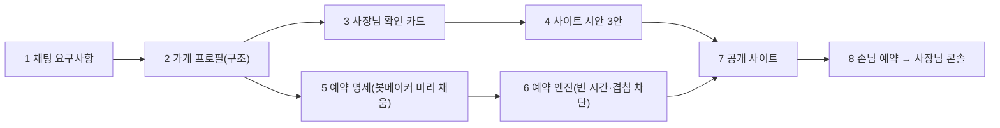

# 요구사항 깊이 · 사이트 디자인 품질 · 예약 (DEPTH_DESIGN_BOOKING_PLAN)

> 2026-09-29 (KST) / Claude. 대표 요청: "요구사항 고도화, 코드 제너레이션 UI 고도화, 기능들도". 대표 선택: ① 깊이 있는 요구사항 ② 만들어진 사이트 디자인 품질 ③ 예약.
> 먼저 읽은 것: [DESIGN_FIT_PLAN](DESIGN_FIT_PLAN.md)·[BUILD_W1_W2](BUILD_W1_W2.md)(3주차 남은 것), [BOOKING_RULES_PLAN](BOOKING_RULES_PLAN.md), booking-bot 브랜치(W1~W6, 6커밋·34파일·약 5,000줄), `app/services/card_data.py`, `prd_schema.py`(칸 19개), `templates/sections`(46개).
> 일정 제약: D47 — 10/15 동결, 10/17 비공개 베타. D42 — 3주 안에 부품 확장 안 함(이 계획은 §6-2에서 예외를 묻는다).

## 0. 결론

세 가지는 따로가 아니라 **하나의 데이터**로 이어진다.

- 지금 요구사항은 "글 칸"(메뉴: "김치찌개, 제육 1만원")이고, 사이트와 예약이 그 글을 각자 다시 쪼갠다(`card_data`가 결정론 파싱, booking-bot의 봇메이커는 따로 인터뷰). 그래서 오늘 같은 "와 가격"·"성수기 1박"이 사이트에 새고, 예약 봇은 같은 것을 또 묻는다.
- **가게 프로필**(품목·가격·소요 시간·담당자·자원·규칙)을 대화에서 한 번 구조로 받고, **사이트(디자인)와 예약이 같은 프로필을 읽게** 한다.
- 순서: **B1 예약 합치기(토대) → A 가게 프로필 → C 프로필을 보여 주는 디자인 → B2~B3 예약을 사이트에 연결**.

## 1. 흐름



| # | 무엇 | 지금 | 바뀌는 것 |
|---|---|---|---|
| 1 | 채팅 요구사항 | 칸 19개를 글로 받음 | 업종별 이어묻기로 가격·시간·담당자를 짝으로 받음 |
| 2 | 가게 프로필 | 없음(`card_data`가 매번 글을 다시 쪼갬) | `card["profile"]` 한 곳. 결정론 파서 먼저, LLM은 말에 있는 숫자만 |
| 3 | 확인 카드 | 채팅 글 요약 + 오늘 넣은 빈칸 묻기 | 품목·가격 표를 그대로 보여 주고 틀린 줄만 고치기 |
| 4 | 시안 3안 | 부품 조합, 품목은 이름만인 경우 많음 | 프로필의 분류·가격·담당자·소요 시간을 부품이 그대로 그림 |
| 5 | 예약 명세 | booking-bot 봇메이커가 처음부터 인터뷰 | 프로필로 미리 채우고 예약 규칙만 묻기 |
| 6 | 예약 엔진 | booking-bot 브랜치에만 있음(main 미합침) | main에 합침 |
| 7 | 공개 사이트 | 예약 부품은 공개 때 계산한 빈 시간을 박아 둠 | 예약 버튼 → 서버 예약 페이지(실시간 빈 시간) |
| 8 | 사장님 콘솔 | booking-bot의 `/owner` | 채팅방·설정에서 바로 가기 |

## 2. B1 — 예약 브랜치 합치기 (먼저, 토대)

**문제**: main(`77a563a`, 운영 DB에 적용됨)과 booking-bot이 둘 다 `0014_shops`를 만들었는데 모양이 다르다.

| | main (운영 적용) | booking-bot |
|---|---|---|
| 가게 키 | `shops.site_key` (PK) | `shops.id` (숫자 PK) + `site_key` 유일 |
| 권한 | owner·manager·staff | owner·staff |
| 추가 칸 | kind, deleted_at | category, closed_at, 전화·사업자 확인 4칸 |
| 0015 | `0015_sales` (주문·결제·정산) | `0015_booking_engine` (명세·막기·이벤트, btree_gist 배제 제약) |

**할 일**
1. booking-bot 코드를 main의 `site_key` 키로 옮긴다(`shop_id` → `site_key`). 운영 DB의 shops는 그대로 둔다.
2. `0016_booking_engine`: booking-bot의 0015 내용 + shops에 확인 4칸(phone_verified_at·biz_no·biz_verified_at·verified_by) 추가. 권한 manager는 남긴다.
3. `app/services/shops.py`는 main 것을 기준으로 booking-bot 함수(require_member 등)를 합친다.
4. booking-bot 테스트 5개 파일(test_booking_engine·botmaker·owner_chat_api·shops·slots)이 main에서 통과. 운영 DB 복사본에 0016 올려 보기.

담당: Claude가 합치기 계약·마이그레이션, OpenCode가 파일별 이식. booking-bot worktree를 다른 세션이 쓰고 있는지 먼저 확인(§6-3).

## 3. A — 가게 프로필 (깊이 있는 요구사항)

### 3.0 수정 (2026-09-29, 착수 때 확인)

새 `card["profile"]`을 따로 만들지 않는다. `card_data.build(card)`가 이미 catalog·staff·classes·rooms 구조를 내고, 사이트(`site_data`)와 예약 봇(`botmaker.seed`)이 모두 이것을 읽는다. **프로필 = card_data 결과에 칸을 더하는 것**으로 한다(A1: `price_won`, `duration_min`, 미용실 이어묻기 "가격과 걸리는 시간", `botmaker.seed`가 시간·가격까지 미리 채움). 아래 3.1은 목표 모양의 참고로 남긴다. 회귀 확인은 `tests/engine/test_card_data_snapshot.py`(코퍼스 12건).

### 3.1 계약 (목표 모양 참고)

```json
{
  "items": [
    {"name": "김치찌개", "category": "찌개", "price": 9000, "price_text": "9,000원",
     "duration_min": null, "capacity": null, "staff": [], "source": "owner"}
  ],
  "staff": [{"name": "원장 김단정", "role": "원장", "specialty": ["펌"], "days_off": ["월"]}],
  "resources": [{"kind": "room", "name": "101호", "seats": 4}],
  "seasons": [{"label": "성수기", "period": "7/15~8/20"}],
  "policies": {"parking": "건물 뒤 3대", "group": "단체 20명까지", "pets": null, "cancel": null}
}
```

- 모든 값은 사장님 말에 있는 것만(D26). 없는 칸은 `null`, 사이트는 그 줄을 숨긴다.
- `items[].name`이 사이트 메뉴 카드·예약 시술 이름·주문 상품의 같은 열쇠가 된다.

### 3.2 받는 법

| 원형 | 이어 묻는 것 (예산 밖 확인 1~2개) |
|---|---|
| A 식당·카페 | 분류(식사·음료·디저트), 대표 3개 가격, 단체·포장 |
| B 미용실 | 시술별 가격·걸리는 시간, 담당자와 전문 시술 |
| C 펜션 | 객실별 인원·가격·시즌, 입실·퇴실 |
| D 학원 | 반별 대상·요일·시간·수강료 |

- 파서 순서: `card_data`의 결정론 파서(가격 짝·객실 수·시즌·반 시간)를 **프로필을 만드는 쪽**으로 옮기고, 사이트는 프로필만 읽는다. 오늘 고친 `_strip_label`·시즌 요금 규칙도 여기로.
- 요약 확인: 품목·가격 표를 보여 주고 "3번째 줄 가격 1만원" 같은 고치기를 받는다.

### 3.3 기준 (평가)

- T3 시나리오 36개에 "프로필 정답"(품목 이름·가격·분류)을 붙여 **정확도**를 잰다. 목표: 품목 이름 90%, 가격 짝 90%, 지어낸 값 0건.
- 질문 수는 지금(평균 5.9)보다 늘리지 않는다. 이어 묻기는 한 번에 짝으로("대표 메뉴 3개와 가격을 한 번에 알려 주세요").

## 4. C — 사이트 디자인 품질

DESIGN_FIT_PLAN의 3주차 남은 것 + 프로필을 보여 주는 부품.

| # | 할 일 | 근거 |
|---|---|---|
| C1 | 메뉴 부품이 프로필 분류·가격을 그대로: 분류 탭(카페·식당), 가격 정렬, 대표 3개 배지 | FIT §1 "가격 3안 모두 없음" |
| C2 | 담당자 카드: 이름·전문 시술·쉬는 날, "이 선생님으로 예약" | FIT §1 "디자이너 없음" |
| C3 | 시술 카드에 걸리는 시간("펌 2시간 30분") | 프로필 duration |
| C4 | 사진에 맞춘 색(J2b), 처음 보는 업종 G·H 최소 청사진 | BUILD_W1_W2 남은 것 |
| C5 | **보고 고치기 루프**: 코퍼스 24건 × 3안을 390px 스크린샷 → `draft_fit` 채점 + 사람 눈 5가지(첫 화면에서 무엇을 파는지, 가격, 주 행동 버튼, 연락, 여백·정렬) → 고칠 목록 | FIT §5 |
| C6 | 지도: 지금 더미 그림 → 주소 문자 + "지도 앱으로 열기"(카카오·네이버 링크, API 키 없이) | FIT §6, P-F2 |

C1~C3은 **새 부품이 아니라 기존 부품의 데이터 칸 확장**으로 한다(D42 범위 안). 새 부품(FAQ·공지)은 10/17 뒤.

## 5. B2~B3 — 예약을 사이트에 연결

| # | 할 일 |
|---|---|
| B2 | 공개 때 프로필 → 예약 명세 미리 채움(시술·시간·담당자·객실). 봇메이커는 규칙(정리 시간·마감·브레이크·취소 기한)만 묻는다 |
| B3 | 공개 사이트 예약 부품: 명세를 켠 가게는 "예약하기" → 우리 서버 예약 페이지(실시간 빈 시간), 안 켠 가게는 지금 폼 |
| B4 | 채팅방 "더보기"·설정 페이지에 사장님 예약 콘솔(`/owner`) 링크, 새 예약 알림은 지금 문의 알림 경로 |

## 6. 대표 결정

1. **예약을 10/17 베타에 넣나?** 추천: 넣는다. 단 B1(합치기)·B3까지, 미용실(B)·식당(A)만. 펜션 객실 예약은 10/17 뒤.
2. **D42(3주 부품 확장 금지) 예외**: C1~C3은 기존 부품 칸 확장이라 허용 요청. 새 부품은 계속 금지.
3. **booking-bot worktree**를 지금 다른 세션이 작업 중인가? 합치기 전에 그 세션을 멈추거나 끝내야 한다.
4. **순서**: B1 → A → C → B2·B3 (추천) / 디자인 먼저(C1~C5) → A → B.

## 7. 일정 (KST, 10/15 동결 기준)

| 날짜 | 물결 | 내용 |
|---|---|---|
| 9/30~10/1 | 1 | B1 합치기(0016, site_key 이식, 테스트 5종) + A 계약 확정·T3 프로필 정답 붙이기 |
| 10/2~10/5 | 2 | A 파서 이전·이어묻기·확인 카드 / C5 첫 스크린샷 채점(기준선) |
| 10/6~10/9 | 3 | C1~C3 부품 칸 확장, B2 명세 미리 채움, B3 예약 페이지 연결 |
| 10/10~10/13 | 4 | C4·C6, C5 두 번째 채점, T3 전체, 운영 배포 |
| 10/14~10/15 | 5 | 고치기만, 동결 |

## 8. 위험

| 위험 | 대응 |
|---|---|
| B1 합치기에서 운영 shops 데이터 깨짐 | 운영 DB 덤프 복사본에 0016을 먼저 올린다. shops 모양은 바꾸지 않고 칸만 더한다 |
| 프로필 이전으로 기존 시안 회귀 | `card_data.build` 결과를 코퍼스 24건으로 전후 비교하는 스냅샷 테스트를 먼저 만든다 |
| 이어묻기로 질문 수 증가 | 짝으로 한 번에 묻기, T3 질문 수 상한 검사 |
| 두 세션이 같은 DB·브랜치 | 물결마다 담당 파일 목록, DB 테스트는 한 번에 하나 |

## 변경 이력

| 날짜 | 내용 |
|---|---|
| 2026-09-29 | 처음 작성 (대표 선택 ①깊이 ②디자인 품질 ③예약) |
| 2026-09-29 | B1 완료(`8752527`, 운영 복사본 0016 확인). §3.0: 프로필은 card_data 확장으로 |
