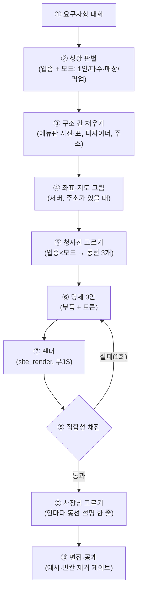

# 시안 적합성 재설계 플랜 (DESIGN_FIT_PLAN)

> 2026-09-28 (KST). 대표 지적: "카페인데 '사진첩' 제목 아래 사진", 메뉴 분류·가격 없음, 미용실 디자이너·예약 현황 없음, 지도 없음, 손님이 예약·주문·방문하고 싶지 않은 구도.
> 지킬 것: D31(AI가 쪽 HTML을 쓰지 않음), D26(가게 사실 지어내지 않음), 무JS 시안, 휴대폰 390px 1열. 일정: D47(10/15 동결, 10/17 비공개 베타).
> 이전 기록: [DESIGN_QUALITY_LOG.md](DESIGN_QUALITY_LOG.md)

## 0. 결론

지금까지는 **겉 품질**(색·글꼴·모션·AI 사진·내비)을 다듬었다. 문제는 그 아래 두 층이 비어 있는 것이다.

1. **무엇을 보여 주나** — 사장님이 말한 메뉴·가격·디자이너·주소가 시안에 안 나온다.
2. **손님을 어디로 보내나** — 업종의 주 행동(예약·주문·방문·상담)으로 가는 동선이 없다.

작업 순서를 바꾼다: **① 상황 판별·구조 데이터 → ② 목적 부품 → ③ 3안 = 손님 동선 3가지 → ④ 적합성 채점**. 기존 시각 품질 작업은 그 위에 얹는다.

## 1. 진단 (2026-09-28 실측)

시험: 미용실 카드(가격 "컷 2만원, 염색 8만원", 디자이너 2명, 주소)와 카페 카드(가격 2개, 주소, 전화)로 3안을 만들어 렌더했다.

| 확인 | 결과 | 원인 (코드) |
|---|---|---|
| 사장님이 말한 가격 | 3안 모두 없음 | `prd_engine._separate_menu_price`가 "아메리카노 4,500원"을 메뉴 칸·가격 칸으로 쪼개면서 짝을 잃는다. 시안은 `price: ""` 고정 ([design_variants.py:247](../../app/services/design_variants.py)) |
| 디자이너 | 3안 모두 없음 | `staff`는 질문하지만(`_FOLLOWUP_V0`) 시안이 읽지 않는다. 디자이너 부품이 없다 |
| 지도 | 없음. 미용실은 '오시는 길' 섹션도 없음 | `around--map-list`는 `map_url` 링크 자리만 있고 채우는 코드가 없다. 미용실 견본에 `around` 없음 |
| 카페 섹션 순서 | 1안·2안 모두 사진첩 → 소개 → 메뉴 (1·2안 순서 같음) | 업종 견본 + lead 규칙. 사진첩 제목은 템플릿에 '사진첩'으로 고정 |
| 미용실 연락 경로 | '영업시간·연락'·'예약·문의'·'예약 신청'·'문의하기' 4개. 2·3안은 예약 신청이 후기 뒤 맨 끝 | 추가 섹션 삽입 + `_ORDER`에 `booking`이 없어 정렬 때 맨 뒤로 ([design_variants.py:555](../../app/services/design_variants.py)) |
| 3안 차이 | 정보 구조는 같고 색·글꼴·순서만 다름 | `VARIANTS`가 스타일 변형 3벌 (D43) |
| 자동 점수 21/21 PASS | 위 문제가 전부 통과됨 | 21개 항목이 모두 시각·기술 검사. 코퍼스 12건에 가격·디자이너·분류 데이터가 하나도 없음 |

**근본 원인 4개**

| # | 층 | 원인 |
|---|---|---|
| R1 | 데이터 | 카드가 평평하다. 메뉴 이름 목록, 가격 한 줄, 담당자 한 줄뿐이다. 분류, 품목별 가격·사진, 1인/다수, 주 행동, 좌표가 없다 |
| R2 | 구성 | 업종마다 견본이 1개이고, 1인샵/다수나 매장/픽업 같은 상황에 따라 나뉘지 않는다. 3안은 같은 구성에 스타일만 3벌이다 |
| R3 | 부품 | 분류 메뉴판, 디자이너, 예약 현황, 지도, 하단 고정 행동 바 부품이 없다 |
| R4 | 채점 | "말한 것이 나오는가", "손님이 행동까지 가는가"를 재지 않는다 |

## 2. 목표 모습: 업종·상황별 손님 동선

| 업종·상황 | 주 행동 | 첫 화면 | 꼭 들어갈 부품 | 3안 = 동선 3가지 |
|---|---|---|---|---|
| 카페 (매장형) | 방문(길찾기). 외부 주문 링크가 있으면 주문 | 대표 메뉴 사진 + 가게 이름 + [길찾기] [메뉴 보기] | 분류 메뉴판(커피·음료·디저트, 분류별 사진·가격), 공간, 지도·영업시간 | ① 메뉴판형 ② 공간·방문형 ③ 시그니처형 |
| 카페 (픽업·주문) | 주문 (지금은 UI만. 누르면 "준비 중" 안내, D53⑤) | 대표 메뉴 + [주문하기] | 분류 메뉴판 + [담기]·[주문하기] 버튼, 픽업 안내, 지도 | ① 메뉴판형 ② 시그니처형 ③ 빠른 주문형 |
| 미용실 (1인) | 예약 | 원장 사진·이름·전문 분야 | 원장 소개, 시술·가격, 스타일 사진, 예약 현황, 지도 | ① 원장 브랜드형 ② 시술·가격형 ③ 스타일 포트폴리오형 |
| 미용실 (다수) | 예약 (디자이너 선택) | 디자이너 줄 + [예약하기] | 디자이너 카드(전문·사진·[이 디자이너로 예약]), 시술·가격, 디자이너별 예약 현황, 지도 | ① 디자이너 선택형 ② 시술·가격형 ③ 스타일형 |
| 펜션 | 예약 | 전경 | 객실 카드(사진·인원·요금), 날짜별 예약 현황, 주변·지도 | ① 객실 선택형 ② 풍경·경험형 ③ 요금·날짜형 |
| 학원 | 상담 신청 | 대상 + 반 | 반·시간표·수강료, 선생님, 상담 신청, 지도·차량 | ① 반·시간표형 ② 선생님형 ③ 상담 우선형 |

**공통 규칙**

- 주 행동 버튼은 첫 화면, 상단 내비, 하단 고정 바 세 곳에서 같다.
- 연락 섹션은 1개로 합친다(문의 양식은 따로 둔다).
- 사진은 반드시 맥락(메뉴 분류·디자이너·객실·공간)에 붙인다. '사진첩'은 남는 사진이 있을 때만 두고, 제목은 업종에 맞춘다(카페 '공간', 미용실 '스타일', 공방 '작품').

## 3. 새 흐름

| 번호 | 단계 | 설명 | 새로/기존 |
|---|---|---|---|
| ① | 요구사항 대화 | 기존 질문 엔진 그대로 | 기존 |
| ② | 상황 판별 | **LLM이 요구사항을 보고 물을 상황 질문을 0~3개 고른다**(D53③, 질문 한도 밖). 예: 미용실 "혼자 하세요? (혼자 / 2~3명 / 4명 이상)", 카페 "손님 주문은? (매장 방문 / 주문 앱 링크 / 픽업 주문)". 엔진이 허용 목록·개수·중복을 검증하고, 실패하면 업종 기본 질문으로 돌아간다 | 새로 |
| ③ | 구조 칸 | `catalog`(분류→품목→가격·사진), `staff_list`, `primary_action`, `order_url`. 메뉴판 사진 한 장을 올리면 그림을 읽는 모델이 분류·이름·가격을 뽑고, 사장님이 확인하면 FILLED가 된다(사장님 자료라 D26 안) | 새로 |
| ④ | 지도 | **지금은 '예시 지도' 더미 그림 + 주소 글자**(D53②). API 연동(§6)은 뒤로 미룬다 | 새로 |
| ⑤ | 청사진 | `templates/blueprints/<업종>-<모드>.json`: 주 행동, 첫 화면 구도, 섹션 순서, 섹션 제목, 동선 이름 3개 | 새로 (견본 대체) |
| ⑥ | 명세 3안 | 청사진의 동선 3개 위에 D43 스타일 대비(①정석 ②분위기 ③대비)를 얹는다 | 변경 |
| ⑦ | 렌더 | 새 부품을 추가하고 섹션 제목은 명세에서 받는다 | 변경 |
| ⑧ | 적합성 채점 | §5 항목. 실패하면 명세를 1회 다시 만든다(A4 `_verify_html`과 같은 방식) | 새로 |
| ⑨ | 고르기 | 안 이름을 '기본형/사진 강조형/간결형'에서 동선 이름으로 바꾼다. 예: "디자이너 고르고 예약 → 시간 고르기" | 변경 |
| ⑩ | 공개 | 기존 빈칸 감추기 게이트가 '예시' 값도 제거한다 | 변경 |

## 4. 단계 계획 (KST)

### 0단계: 기준 먼저 (9/29~9/30)

| # | 할 일 | 산출 | 담당 |
|---|---|---|---|
| 0-1 | 적합성 채점기 `scripts/draft_fit.py` + 코퍼스 6건 추가(카페 매장·카페 픽업·미용실 1인·미용실 다수·펜션·학원, 가격·디자이너·분류·주소 포함) | ✅ 기준선(9/28): 사실 반영 0.69, 가격 짝 0, 행동 일치 0, 지도 0, 동선 차이 0 | Claude |
| 0-2 | **정답 시안**(카페 매장형·카페 픽업·미용실 다수·미용실 1인)을 손 HTML이 아니라 **새 부품 + 실제 렌더러**로 만든다. 승인되면 버릴 것 없이 그대로 엔진이 쓴다 | ✅ `evals/fit_gold/*.json` → `static/compare/fit/`, **대표 승인 대기** | Claude |

승인 전에는 부품 개발을 시작하지 않는다. 목표 그림 없이 점수만 올리던 지난 루프를 반복하지 않기 위해서다.

### 1단계: 데이터 (9/30~10/3)

| # | 할 일 | 파일 |
|---|---|---|
| 1-1 | 카드 구조 칸: `catalog`, `staff_list`(이름·직함·전문·사진), `team_mode`, `primary_action`, `geo`, `order_url`. 기존 `offerings`·`price`·`staff`는 호환용으로 남기고 `catalog`를 우선 쓴다 | `prd_schema.py`, `prd_engine.py` |
| 1-2 | 메뉴·가격 짝 보존: `_separate_menu_price`에서 쪼갤 때 짝을 `catalog`에도 기록한다(한 곳만 고침) | `prd_engine.py` |
| 1-3 | **상황 탐색(LLM 판단, D53③)**: 필수 질문을 마친 뒤 요약 전에 LLM을 1회 부른다. 입력은 업종·카드 요약·대화 일부다. 출력은 `[{dimension, ask, options(3개 이하), why}]` 0~3개와 메뉴판 입력 제안 여부다. `dimension`은 허용 목록(`team_mode`·`order_mode`·`menu_categories`·`price_list`·`room_types`·`schedule` …)에서 고르고, 목록 밖이면 `other`로 기록한다(D44 측정). 엔진은 이미 아는 칸·사실 기본값·3개 초과를 막는다. 질문 한도 밖이다. 분류 기본값은 ASSUMED(D26이 허용하는 '구성 가정') | `prd_engine.py`, `prd_schema.py` |
| 1-4 | 메뉴판 한 번에 넣기: [메뉴판 사진 올리기 / 표로 직접 / 나중에] → 모델 추출 → 사장님 확인 | `photos.py`, `chat_flow.py` |
| 1-5 | 편집 화면(D27)에 메뉴판 표·디자이너 표 추가 | `frontend/src/editor/` (OpenCode) |

### 2단계: 부품 (10/1~10/7)

| 부품 | 내용 |
|---|---|
| `menu--categories` | 분류 칩(앵커 이동) + 분류별 대표 사진 + 품목·가격 줄 + '대표' 표시 |
| `staff--team` / `staff--solo` | 다수: 디자이너 카드 + [이 디자이너로 예약]. 1인: 원장 큰 소개 + 경력 + 스타일 |
| `around--map` | '예시 지도' 더미 그림 + 주소 + 주차·교통 (D53②) |
| `actionbar--sticky` | 휴대폰 하단 고정 바(주 행동 1개 + 전화). 기존 `quickbar--float` 확장 |
| `booking--slots` | 예약 현황(7일 × 시간대, 여유/마감 임박/마감, 다수면 디자이너별). 시안은 예시, 공개본은 확정 예약으로 계산 (D53④) |
| `order--soon` | 주문 UI(담기·주문하기). 누르면 `:target` 안내 창 "온라인 주문은 준비 중이에요"가 뜬다. 무JS (D53⑤) |
| 정리 | 섹션 제목 업종화, 연락 섹션 통합, `booking` 정렬 버그 수정 |

담당: 렌더 계약·맥락 데이터는 Claude, 템플릿·CSS 변형은 OpenCode.

### 3단계: 3안 = 동선 3가지 (10/6~10/10)

- 청사진 JSON을 6개(카페 2·미용실 2·펜션·학원) 만든다. 나머지 업종은 가장 가까운 청사진을 쓴다.
- `variants()`는 청사진의 동선 3개를 기본으로 하고, 그 위에 D43 스타일 대비와 최소 차이 8을 그대로 적용한다.

### 4단계: 검증·동결 (10/10~10/15)

- `draft_fit`이 전부 PASS이고 `draft_score` 21개도 유지한다.
- **손님 과제 테스트**(브라우저 390px): "라떼 가격 찾기", "토요일에 박하나 디자이너 예약", "길찾기 열기"를 각각 3번 누르기 안에 해낸다.
- 정답 시안과 나란히 캡처해 비교한다. 10/15에 동결한다.

## 5. 적합성 채점 (`draft_fit`, 새로)

| 항목 | 내용 | 기준 |
|---|---|---|
| fact_coverage | 카드의 FILLED 값(이름·전화·주소·시간·품목·가격·디자이너)이 3안 HTML에 모두 나온다 | 100% |
| price_pair | 가격이 해당 품목 줄 안에 있다 | 100% |
| category_fit | 분류가 있으면 분류별로 묶여 있다 | 100% |
| staff_mode_fit | 1인이면 원장 소개 1개, 다수면 카드 수가 인원 수와 같다 | 100% |
| action_consistency | 첫 화면·내비·하단 바의 행동 버튼이 업종 주 행동과 같다 | 100% |
| action_reach | 390×844 첫 화면 안에 주 행동 버튼이 있고, 예약·주문 섹션이 4번째 섹션 안에 온다 | 100% |
| contact_dupe | 연락·예약 섹션 수 (문의 양식 포함) | 2개 이하 |
| map_present | 주소가 FILLED면 지도 그림 + 길찾기 링크가 있다 | 100% |
| generic_heading | '사진첩'만 쓴 섹션 제목 수 | 0 |
| strategy_distinct | 3안의 두 번째 섹션·주 부품이 서로 다르다 | 3/3 |

## 6. 지도 방안 (나중. 지금은 더미 그림, D53②)

| 안 | 구성 | 장점 | 단점 |
|---|---|---|---|
| **A (권장)** | 좌표: 카카오 로컬 '주소 검색' REST(카카오 로그인 앱 키 재사용) → 그림: 네이버 클라우드 Static Map(서버에서 받음) → 버튼: 카카오맵·네이버지도 길찾기 링크(키 필요 없음) | 무JS라 시안·공개본 모두 보인다. 국내 지도 데이터 | 네이버 클라우드 계정·키가 필요하다 |
| B (나중) | 공개본에만 카카오맵 JS 지도를 플랫폼 페이지로(시안은 A의 그림) | 확대·이동 가능 | 스크립트, 도메인 등록 필요, 시안에서는 안 보임 |

**계약 전 확인**: 정적 지도 그림 저장(캐시) 허용 여부, 출처 표기 방식, 무료 구간·요금, 카카오 앱의 로컬 API 사용 설정.

## 7. 대표 결정 (2026-09-28 확정 → [DECISIONS D53](DECISIONS.md))

| # | 결정 | 확정 내용 |
|---|---|---|
| P-F1 | 시안의 빈 가격·디자이너 사진 | 시안에서는 '예시' 표시를 붙인 값을 쓴다. 공개할 때 자동으로 지운다 |
| P-F2 | 지도 | 지금은 더미 그림. API는 뒤로 미룬다(§6 A안은 후보로 남긴다) |
| P-F3 | 3안 역할 | 손님 동선 3가지 + D43 스타일 대비(대표가 따로 답하지 않아 권장안으로 진행) |
| P-F4 | 질문 예산 | 상황 질문·메뉴판 입력은 한도 밖. **무엇을 물을지는 LLM이 판단**하고, 엔진이 검증한다 |
| P-F5 | 예약 현황 | 시안은 예시. 공개본은 확정된 예약으로 계산한다 |
| P-F6 | 카페 주문 | UI만 만든다. 누르면 "준비 중" 안내가 뜬다(무JS) |

## 8. 10/17 전에 하지 않는 것

결제, 예약 자동 확정, JS 지도, 부품 50종 확장(D42), 새 업종 청사진(6개 밖).

## 9. 위험

| 위험 | 대응 |
|---|---|
| 질문이 늘어 이탈한다 | 상황 질문은 선택지형으로 하고, 메뉴판은 사진 한 장으로 받는다 |
| 메뉴판 사진 추출이 틀린다 | 사장님 확인 전에는 FILLED로 넣지 않는다 |
| 0-2 승인이 늦어진다 | 10/17 범위를 카페·미용실 2업종으로 줄이고, 나머지는 기존 견본을 쓴다 |
| 청사진과 D43 최소 차이가 충돌한다 | 동선이 다르면 섹션 순서·첫 화면이 이미 달라 거리 점수가 오른다. `_ensure_contrast`는 그대로 둔다 |

## 10. 부품 개발 기준 (프로덕션 완료 조건)

부품은 아래 10개를 모두 만족해야 "완료"다. 모션 규칙은 [MOTION_PLAN](MOTION_PLAN.md)을 따른다.

| # | 항목 | 기준 | 확인 방법 |
|---|---|---|---|
| 1 | 계약 | content 칸·형식·필수 여부를 [SECTION_LIBRARY_SPEC §2.9](SECTION_LIBRARY_SPEC.md)에 적는다. 형식이 틀린 값은 렌더러가 버린다 | 단위 테스트 |
| 2 | 4상태 | 채움 / 예시(D53①, '예시' 표시) / 빈칸(시안 자리 표시) / 공개본(예시 제거·빈 부품 제외) | `tests/unit/test_fit_components.py` |
| 3 | 반응형 | 360·390·768·1280에서 가로 넘침 0. 390은 1열, 760 이상은 2~3열 | 정답 시안 8쪽 × 4너비 검사 |
| 4 | 접근성 | 제목 순서, 라벨, 누름 칸 44px, 대비 4.5:1(토큰), 포커스 표시, 안내창은 링크로 닫힘, 동작 줄이기 대응 | 테스트 + 캡처 |
| 5 | 보안 | 스크립트 0, 주소는 허용 목록(`_clean_url`), 부품 안 링크는 `#`만, 글자는 chevron이 이스케이프 | 테스트 |
| 6 | 토큰만 | 색·여백·모서리·글꼴은 CSS 변수만 쓴다(예외: 예시 지도의 물·공원 색 2개) | 리뷰 |
| 7 | 모션 | MOTION_PLAN 원형 M1~M8만, transform·opacity만, reduced-motion 대응 | 리뷰 (2단계에서 자동) |
| 8 | 성능 | 첫 화면 밖 사진은 `loading=lazy`, 사진 칸은 `aspect-ratio`로 고정(흔들림 0) | 리뷰 |
| 9 | 공개 게이트 | 예시 값·예시 품목·예시 담당자·예시 현황은 공개본에 남지 않는다(D53①). 예시 사진은 표시와 함께 남는다(D51) | 테스트 |
| 10 | 사람 확인 | 정답 시안(`evals/fit_gold/*.json` → `scripts/render_fit_gold.py`)을 휴대폰 캡처로 본다 | `static/compare/fit/index.html` |

### 부품 현황 (2026-09-28)

| 부품 | 파일 | 상태 |
|---|---|---|
| 분류 메뉴판 | `offerings--categories` | ✅ 분류 칩(고정), 분류별 사진, 품목·가격 짝, 대표 표시, 예시 가격·예시 품목, 담기(주문 모드) |
| 담당자 | `staff--team`, `staff--solo` | ✅ 여러 명 카드(옆으로 넘김, 760 이상은 3열) + "○○에게 예약" / 1인 원장 소개 + 작업 사진 |
| 예시 지도 | `around--map` | ✅ 토큰 색 더미 지도 + 핀 맥박 + 카카오맵·네이버 지도 검색 링크(키 필요 없음). 공개본은 더미 그림 숨김 |
| 예약 현황 | `booking--slots` + `POST /api/bookings` `slot`·`staff` | ✅ 요일별 시간 칩(여유/마감 임박/마감, 마감은 누를 수 없음), 디자이너 선택. 공개본은 예시 현황이 빠지면 날짜 입력으로 대체 |
| 주문 준비 중 | `order--soon` | ✅ `:target` 아래 안내창, 전화 주문 버튼, 확인하면 메뉴로 돌아감 |
| 하단 행동 바 | `actionbar--sticky` (명세의 `actionbar`) | ✅ 휴대폰 전용, 첫 화면을 지나면 올라옴, 없는 섹션으로 가는 버튼은 그리지 않음 |
| 첫 화면·사진첩 | `hero--photo-*` `cta2`, `gallery--*` `label` | ✅ 두 번째 행동은 글자 링크(주 버튼 1개 유지), 사진첩 제목을 업종에 맞춤 |

**아직 안 된 것**: 엔진 연결(1단계 카드 구조 칸 + 3단계 청사진). 지금 `draft_fit`은 엔진이 만든 3안을 채점하므로 기준선(FAIL)이 그대로다. 부품은 준비됐고, `design_variants`가 이 부품을 고르게 되면 점수가 오른다.

## 11. 색 시스템 (2026-09-28 대표 지적: "색감이 안 좋다")

### 진단 (팔레트 8종을 OKLCH로 측정)

| 원인 | 근거 |
|---|---|
| 주색이 탁함 | 5종(forest·coffee·charcoal-gold·moss·sage)이 밝기 0.44~0.48, 채도 0.035~0.068에 몰려 있다(중간 밝기·저채도 = 흙탕물 색) |
| 강조색이 모두 겨자색 | 6종의 강조색 색상각이 55~85°로 같다. 어느 팔레트든 갈색·황토 느낌 |
| 바탕이 모두 누런 크림 | 7종이 같은 크림(색상각 68~106°)이라 갈색 주색과 합쳐 세피아 단색이 된다 |
| 색이 버튼에만 쓰임 | 토큰이 4색뿐이고 면(섹션 띠·카드·선)은 흰색·검정을 섞어 만든다. 팔레트를 바꿔도 버튼 색만 바뀐다(비교표 1) |
| 첫 화면 회색 판 | 섹션 여백 때문에 글자 뒤 반투명 검정 상자가 사진 위에 뜬 판처럼 보였다 |

### 해결

| # | 할 일 | 상태 |
|---|---|---|
| C1 | 첫 화면: 글자 상자 배경을 없애고, 사진 전체에 아래로 짙어지는 그라데이션을 깐다 | ✅ 엔진 반영 (`site.css` 끝) |
| C2 | **팔레트 규칙**: 주색은 OKLCH 채도 0.10 이상이거나, 의도한 무채색(밝기 0.3 이하, 예: 에스프레소 검정). 강조색은 주색과 색상각이 90° 이상 떨어지거나 없다. 바탕은 채도 0.008 이하로 하고, 색상각은 주색 쪽으로 기울인다(전부 누런 크림 금지). 탁한 5종은 교체하고, 업종마다 2~3종을 고른다(예: 카페 = 에스프레소·테라코타 / 크림·코발트 / 딥그린·로즈) | 시연 완료, 승인 대기 |
| C3 | **색 역할·배치(60·30·10)**: 바탕 60 / 브랜드 틴트 면(섹션 띠·칩, 주색 9%) 30 / 버튼·강조 10 + 페이지마다 짙은 브랜드 띠 1곳(`--inverse`, 밝기 0.25 근처로 고정해 쨍하지 않게). 선·카드도 주색 쪽으로 기울인다. 명세 토큰 `tone: calm`(틴트만) / `rich`(짙은 띠 포함)을 두고 3안 역할과 잇는다(③대비 = rich) | 시연 완료(비교표 2), 승인 대기 |
| C4 | **사진에 맞춘 색**: 대표 사진(사장님 사진 또는 예시)에서 주요 색을 뽑아(PIL, OKLCH), 색상각이 어울리는 팔레트를 고른다(①정석 = 비슷한 색, ③대비 = 반대 색) | 3단계 |
| C5 | **색 채점**: `draft_score`에 탁함 지수(넓은 면에 밝기 0.35~0.6·채도 0.07 미만 금지), 강조색 색상각 차이, 역할별 글자 대비 AA, 사진-팔레트 색상각 차이를 추가 | 2단계 |

비교표: `static/compare/fit/color-compare.png`(팔레트만 교체) · `color-compare-roles.png`(팔레트 + 역할 규칙).

## 변경 이력

| 날짜 | 내용 |
|---|---|
| 2026-09-28 | 처음 작성 (진단 실측 + 0~4단계 + 결정 6건) |
| 2026-09-28 | 대표 결정 반영(D53): 예시 값 허용·공개 시 제거, 더미 지도, LLM 상황 탐색, 주문 UI만 |
| 2026-09-28 | 색 시스템 진단·계획(§11), 첫 화면 덮개 개선(C1) |
| 2026-09-28 | 0단계 완료: `draft_fit` 기준선, 정답 시안 4장(실제 렌더러로), 부품 7종 + 부품 개발 기준(§10) + 모션 계획(MOTION_PLAN) |
