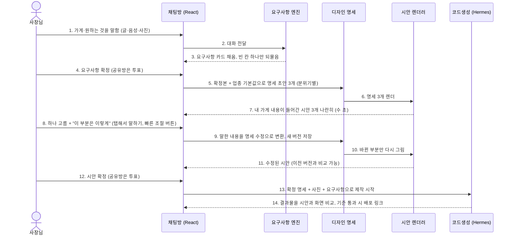
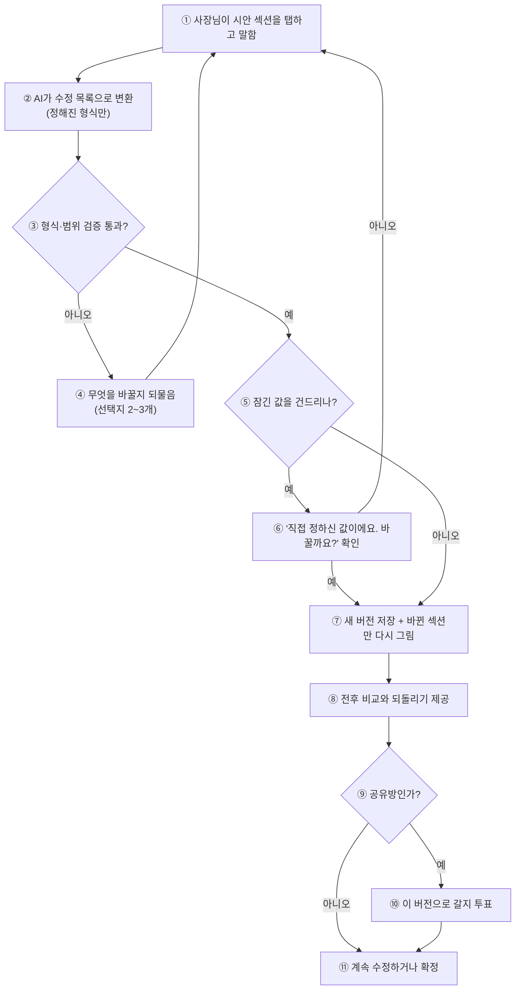

# 요구사항 엔진 → 시안: 사용자가 원하는 UI를 받아내는 계획

> 작성일: 2026-09-25 / 상위: [PRODUCT_ROADMAP.md](PRODUCT_ROADMAP.md) 2·3단계, [DECISIONS.md](DECISIONS.md)
> 범위: 대화로 요구사항을 확정한 뒤, 사용자가 원하는 **모습**을 시안으로 확인·수정·확정하고, 그 시안 그대로 제작에 넘기는 과정.

## 1. 지금 무엇이 문제인가

| # | 현재 | 문제 |
|---|---|---|
| 1 | 시안이 `templates/variant-1.html` 하나. 기능 목록과 견적을 적은 요약 페이지다 | 사용자 가게 사이트가 **어떻게 생길지**를 보여주지 못한다 |
| 2 | 디자인 취향을 묻는 단계가 없다 | 색·분위기·사진 배치는 AI가 임의로 정한다 |
| 3 | 시안(정적 템플릿)과 제작물(Hermes 자유 생성)이 서로 다른 방식으로 만들어진다 | 시안에서 본 것과 받는 결과가 다를 수 있다. 사용자 신뢰를 가장 크게 깎는 지점 |
| 4 | 수정은 "처음부터 다시"뿐이다 | "이 부분만 밝게" 같은 부분 수정을 할 수 없다 |
| 5 | 제작 결과를 시안과 비교하지 않는다 | 결과가 약속과 다른지 알 수 없다 |

## 2. 원칙

1. **묻지 말고 보여주고 고르게 한다.** 소상공인은 "모던 미니멀"을 말로 설명하지 못하지만, 보면 고른다. 추상적인 질문 대신 **자기 가게 내용이 들어간 미리보기**를 나란히 보여준다.
2. **시안과 결과물은 같은 엔진으로 만든다.** 시안은 우리가 만든 섹션 부품과 디자인 설정값으로 즉시 그린다. 제작도 같은 부품과 설정값에서 출발한다. 본 것이 곧 받는 것이다.
3. **모든 수정은 설정 변경으로 기록한다.** 시안은 "디자인 명세(JSON)"의 그림일 뿐이다. 수정은 명세의 일부를 바꾸고, 버전이 남고, 되돌릴 수 있다.
4. **빠르게.** 시안은 몇 초 안에 나와야 한다. 90초 걸리는 코드생성은 확정 뒤에만 돌린다.
5. **여러 명이 함께 고른다.** 공유방에서는 시안 선택과 확정도 기존 과반 투표로 한다.

## 3. 전체 흐름



| 번호 | 설명 |
|---|---|
| 1 | 사장님이 글, 음성(예정), 사진으로 가게와 원하는 것을 말한다 |
| 2 | 채팅이 대화를 요구사항 엔진에 넘긴다 |
| 3 | 엔진이 요구사항 카드(업종, 목적, 섹션, 연락처·영업시간 같은 필수 정보, 사진 용도)를 채우고, 가장 중요한 빈 칸 하나만 선택지와 함께 되묻는다 (2단계 PRD 엔진) |
| 4 | 요구사항을 확정한다. 공유방이면 과반 투표 |
| 5 | 확정본에 업종 기본값을 더해 분위기가 다른 디자인 명세 초안 3개를 만든다(예: 따뜻한 / 깔끔한 / 고급스러운) |
| 6 | 렌더러가 명세 3개를 실제 페이지로 그린다 |
| 7 | 사장님 가게 이름·문구·사진이 들어간 시안 3개를 휴대폰 화면 크기로 나란히 보여준다. 몇 초 안에 나온다 |
| 8 | 하나를 고르고, 시안의 특정 부분을 탭해서 말하거나(예: "사진 더 크게") 빠른 조절 버튼(더 밝게, 글씨 크게)을 누른다 |
| 9 | AI가 말한 내용을 명세의 해당 부분 수정으로 바꾼다. 수정마다 새 버전이 저장된다 |
| 10 | 바뀐 섹션만 다시 그린다 |
| 11 | 수정된 시안을 보여준다. 이전 버전과 나란히 비교하거나 되돌릴 수 있다 |
| 12 | 시안을 확정한다. 공유방이면 과반 투표 |
| 13 | 확정된 명세, 사진, 요구사항을 코드생성에 넘긴다. 코드생성은 같은 섹션 부품에서 출발한다 |
| 14 | 결과물 화면을 확정 시안과 비교해 크게 다르면 스스로 고친 뒤, 기준을 통과하면 배포 링크를 준다 |

## 4. 사용자의 취향을 받는 방법

| 수단 | 어떻게 | 무엇을 채우나 | 시기 |
|---|---|---|---|
| 분위기 고르기 | 내 가게 내용이 들어간 시안 3개 중 하나 선택. "둘 다 좋다"면 섞기 | 색·글꼴·여백·모서리·사진 처리 | P-4 |
| 사진에서 색 뽑기 | 올린 사진·로고에서 대표색을 뽑아 색 조합 3개 제안 | 색 | P-5 (사진 업로드 4단계와 연결) |
| 탭해서 말하기 | 시안의 섹션을 누르고 말하기(글·음성). 예: "여기 사진 더 크게", "이 문구 더 짧게" | 해당 섹션의 설정·문구 | P-6 |
| 빠른 조절 버튼 | 더 밝게/차분하게, 글씨 크게, 사진 크게, 섹션 순서 바꾸기 | 전체 설정값 | P-6 |
| 두 버전 비교 | 수정 전후, 또는 두 후보를 나란히. 공유방은 투표 | 선택 | P-6 |
| 참고 사이트 | 마음에 드는 사이트 주소를 붙이면 분위기(색·배치 경향)만 분석해 반영. 내용·이미지는 복사하지 않는다 | 색·배치 경향 | P-9 (나중에, 이미지 분석 모델 필요 — 확인 필요) |

**휴대폰 기준 설계:** 시안은 휴대폰 화면 모양으로 먼저 보여주고, 전체 화면 미리보기에서 휴대폰/PC 전환을 둔다. 소상공인 대부분이 휴대폰으로 보기 때문이다.

## 5. 디자인 명세 (채팅과 제작 사이의 계약)

사용자가 원하는 UI를 "받는다"는 것은 결국 이 명세를 채우는 일이다. 요구사항(무엇을)과 디자인 명세(어떻게 보이게)를 나눈다.

```json
{
  "version": 3,
  "based_on_prd_version": 2,
  "tokens": {
    "palette": {"primary": "#2F5D50", "accent": "#E9B872", "ground": "#FAF7F2", "ink": "#1F2622"},
    "font_pair": "serif-warm",
    "density": "comfortable",
    "radius": "soft",
    "image_style": "full-bleed"
  },
  "sections": [
    {"id": "hero", "type": "hero", "variant": "photo-overlay", "content": {"title": "…", "subtitle": "…", "image": "asset:12"}},
    {"id": "rooms", "type": "cards", "variant": "photo-grid", "content": {"items": ["…"]}},
    {"id": "around", "type": "list", "variant": "map-list", "content": {"items": ["주변 맛집·여행지"]}},
    {"id": "contact", "type": "contact", "variant": "call-first", "content": {"phone": "…", "hours": "…", "address": "…"}}
  ],
  "locked": ["contact.phone"]
}
```

- `tokens`는 정해진 선택지 안에서만 고른다(글꼴 조합 6종, 여백 3단계 등). 자유 값을 허용하면 품질이 무너진다.
- `sections[].type`과 `variant`는 **섹션 부품 목록**(§6) 안에서만 고른다.
- `locked`는 사용자가 직접 확정한 값이다. AI가 다른 수정을 하다가 바꾸지 못한다.
- 업종별 템플릿(D15의 예시 6개)도 이 명세의 **미리 채운 값**이다. "이 템플릿으로 시작하기"는 이 명세를 불러오는 것과 같다.
- AI는 명세를 직접 쓰지 않고, 정해진 형식(JSON 스키마)으로 **수정 목록**만 낸다. 서버가 검증한 뒤 적용한다.

## 6. 섹션 부품 목록 (시안과 제작의 공통 재료)

| 섹션 | 변형 예 | 비고 |
|---|---|---|
| 첫 화면 | 사진 위 문구 / 사진 옆 문구 / 문구만 | 모든 업종 |
| 소개 | 짧은 글 / 사장님 인사 / 숫자로 보는 가게 | |
| 상품·객실·메뉴 | 사진 격자 / 목록+가격 / 탭 | 업종별 이름만 다름 |
| 사진첩 | 격자 / 가로 넘기기 | 사진 업로드와 연결 |
| 주변·오시는 길 | 지도 링크+목록 / 교통 안내 | 지도는 외부 링크(지도 삽입은 나중에) |
| 영업시간·연락 | 전화 먼저 / 예약 문의 먼저 / 카카오톡 채널 | 전화 버튼은 모바일 상단 고정 |
| 후기 | 자리만 (가짜 후기 금지) | 실제 후기를 받을 때만 |
| 예약·문의 | 전화·문자·외부 예약 링크 | 결제 없음(D13) |

- 모든 부품은 반응형, 접근성(대비·글자 크기·키보드), 가벼운 무게(외부 스크립트 없음)를 기본으로 만든다.
- 첫 버전은 8종 × 2~3변형 = 약 20개. OpenCode가 명세서대로 만들고 Claude가 검토한다.

## 7. 제작 연결과 검증 (시안 = 결과)

| 단계 | 내용 |
|---|---|
| 기본 골격 | 확정 명세를 렌더러로 그린 페이지를 제작의 출발점으로 넣는다. Hermes는 백지에서 시작하지 않는다 |
| 코드생성의 역할 | 부품으로 표현하지 못한 요구(특수 섹션, 문구 다듬기, 세부 인터랙션)만 추가한다. 명세의 `locked` 값과 색·글꼴은 바꾸지 못하게 지시하고 결과에서 검사한다 |
| 화면 비교 | 결과물과 확정 시안을 같은 크기로 캡처해 비교한다. 차이가 기준을 넘으면 차이 부분을 알려 주고 다시 고치게 한다(최대 2회) |
| 요구사항 검사 | 요구사항 카드의 완료 기준을 자동 검사한다(전화번호·영업시간·주소가 보이는지, 모바일에서 가로 스크롤이 없는지 등) |
| 실패 시 | 기준을 못 넘으면 시안 그대로의 페이지(렌더러 결과)를 먼저 배포하고, 추가 요구는 "제작 중"으로 남긴다. 사용자는 적어도 확정한 시안은 받는다 |

## 8. 수정 흐름



| 번호 | 설명 |
|---|---|
| ① | 사장님이 시안의 한 부분을 누르고 원하는 것을 말한다 |
| ② | AI가 말을 명세 수정 목록으로 바꾼다. 정해진 형식 밖의 출력은 받지 않는다 |
| ③ | 서버가 형식과 허용 범위(부품 목록, 선택지 안의 값)를 검사한다 |
| ④ | 이해하지 못했거나 범위를 벗어나면, 무엇을 바꿀지 선택지 2~3개로 되묻는다 |
| ⑤ | 사장님이 직접 확정한 값(잠긴 값)을 바꾸려는 수정인지 본다 |
| ⑥ | 잠긴 값이면 바꿔도 되는지 먼저 확인한다 |
| ⑦ | 새 버전으로 저장하고 바뀐 섹션만 다시 그린다 |
| ⑧ | 수정 전후를 나란히 보여주고 되돌릴 수 있게 한다 |
| ⑨ | 공유방인지 본다 |
| ⑩ | 공유방이면 이 버전으로 갈지 과반 투표를 한다 |
| ⑪ | 계속 고치거나 시안을 확정한다 |

## 9. 데이터 (기존 PostgreSQL, 추가 비용 0원)

| 테이블 | 내용 | 규모 추정 |
|---|---|---|
| `prd_versions` | 요구사항 카드 확정본(JSON), 버전, 확정 방식(단독·투표) | 프로젝트당 수 개 |
| `design_specs` | 디자인 명세(JSON), 버전, 기준 요구사항 버전, 상태(후보·선택·확정) | 프로젝트당 10~30개 (수정마다 1개), 행당 수 KB |
| `design_feedback` | 섹션 ID, 원문(글·음성 전사), 변환된 수정 목록, 결과 버전 | 수정당 1개 |
| `attachments` | 사진(4단계 계획 그대로) | 파일은 디스크, 행은 메타데이터 |

- 시안 이미지는 디스크(`generated/<id>/design/v<N>/`)에 두고 DB에는 경로만 둔다.
- 프로젝트 1,000개 × 30버전 × 5KB ≈ 150MB. 무료 한도(블록 스토리지 200GB 중 현재 47GB 사용) 안이다.

## 10. 측정 (DECISIONS.md D16의 퍼널에 추가)

| 이벤트 | 의미 | 목표 |
|---|---|---|
| `design_shown` | 첫 시안 3개 표시 | 요구사항 확정 후 30초 안 |
| `design_revised` | 수정 1회 | 확정까지 평균 3회 이하 |
| `design_approved` | 시안 확정 | 시안을 본 사람의 60% 이상 |
| `build_matches_design` | 결과물-시안 비교 통과 | 90% 이상 |

## 11. 작업 순서

| WP | 내용 | 담당 | 의존 |
|---|---|---|---|
| P-1 | 요구사항 스키마·추출·빈 칸 질문·카드·확정 (2단계 PRD 엔진 핵심) | Claude | 1-0e(React 골격) |
| P-2 | 디자인 명세 스키마, 수정 목록 형식, 검증기 | Claude | P-1 |
| P-3 | 섹션 부품 1차 (8종 × 2~3변형) + 디자인 설정값(색 조합, 글꼴 조합 6종) | OpenCode → Claude 검토 | P-2 |
| P-4 | 렌더러: 명세 → 페이지·캡처, 분위기별 후보 3개 생성 | Claude | P-3 |
| P-5 | 채팅 안 시안 비교·선택 화면, 사진 대표색 추출 | OpenCode(화면) + Claude | P-4, 4단계 사진 업로드 |
| P-6 | 탭해서 말하기 → 수정 목록 → 부분 다시 그리기, 버전 비교·되돌리기, 공유방 투표 | Claude | P-4 |
| P-7 | 시안 확정 게이트, 퍼널 이벤트 | Claude | P-6 |
| P-8 | 제작 연결: 시안 골격 + Hermes 제한 지시 + 화면 비교·요구사항 자동 검사 | Claude | P-7, 0-3(작업 큐) |
| P-9 | 참고 사이트 분석 | 조사 먼저 (OpenCode) | P-4 |

템플릿 예시 6개(1-0f)는 P-3·P-4 결과로 만든다. 부품과 렌더러가 생기면 예시 사이트는 명세 6개만 쓰면 된다.

## 12. 사용자 결정이 필요한 것

| # | 질문 | 추천 |
|---|---|---|
| D17 | 시안을 섹션 부품 기반으로 만들지, 매번 AI가 자유롭게 만들지 | 부품 기반 + 부품으로 안 되는 부분만 AI. "본 것이 곧 받는 것"을 지킬 수 있는 유일한 방법 |
| D18 | 첫 시안 후보 수 | 3개 (더 많으면 고르기 어렵다) |
| D19 | 참고 사이트 분석 포함 시기 | 나중에(P-9). 저작권·모방 우려가 있어 분위기만 반영 |
