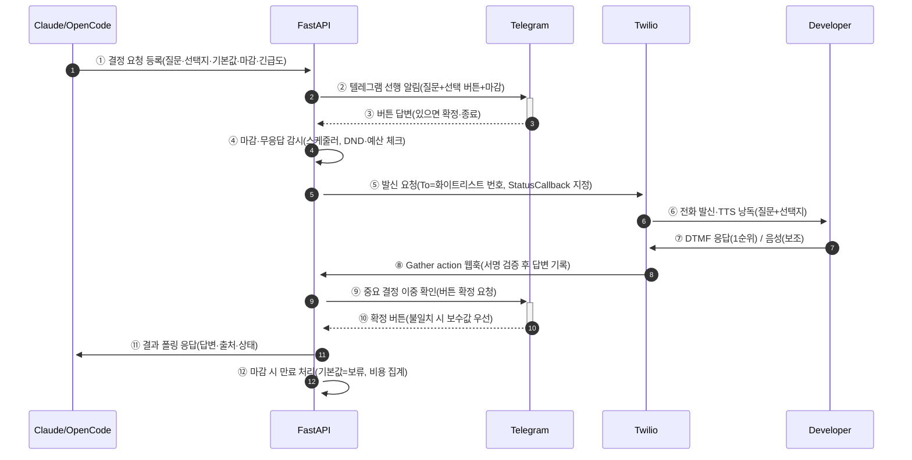
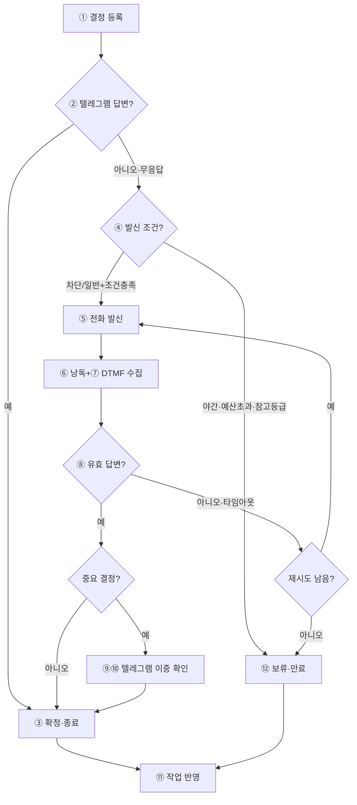

# 개발자 결정 요청 전화 (DEV_DECISION_CALL) — 조사 WP 0-6a

- 작성일: 2026-09-25 (공식 문서 기준, 불확실 항목은 "확인 필요" 표기)
- 목적: Claude/OpenCode 자동 개발 중 사람 결정이 필요할 때, **개발자 본인(한국 휴대폰, 한국어)**에게 자동으로 전화를 걸어 결정 사항을 읽어 주고 답변(키패드/음성/링크)을 받아 작업에 반영하는 방법 설계
- 전제: 운영 중인 HTTPS 엔드포인트(FastAPI, Caddy)가 있어 웹훅 수신 가능. 텔레그램 봇 이미 운영 중(본 문서에 토큰·번호·메일 등 비밀값 기재 금지, 자리표시자만 사용)
- 범위: 어떤 서비스에도 가입·결제·발신하지 않고 웹 문서만 열람함

---

## 1. 전화 발신 수단 비교

### 1.1 한눈 비교표

| # | 수단 | 한국 휴대폰으로 발신 | 한국어 TTS / STT | 발신번호(Caller ID) 표시 | 분당 비용(한국 착신) | 번호 월 임대료 | 가입 요건 | 웹훅/서명 | 추천도 |
|---|------|---------------------|------------------|--------------------------|---------------------|----------------|-----------|-----------|--------|
| 1 | Twilio Programmable Voice | 가능 (공식 가격표에 KR 착신 요금 명시) | TTS ko-KR 지원(Polly/Google). STT Gather `language` + Google v2/Deepgram (한국어 정확도는 "확인 필요") | 전송한 Caller ID 유지 시도되나 한국 착신은 Local Non-guaranteed / 국제발신 표기 가능. 한국 번호 구매 불가 → 해외 번호로 표시됨 | 발신: 일반 $0.0552/분, 모바일 $0.0524/분. Gather 음성인식 $0.02~0.04/회, TTS Neural $0.0032/100자 | 한국 음성 번호 없음. 해외 번호 $1.15/월부터 사용 | 이메일+신원확인(Trust Hub KYC, 번호 종류별 상이 — "확인 필요"). 사업자 등록 필수 아님 | Voice 웹훅(TwiML) + StatusCallback. `X-Twilio-Signature` HMAC-SHA1 검증 | ★ 본 문서 추천안 |
| 2 | Vonage Voice API | 가능 (글로벌 PSTN, 50+ 언어 TTS 표기) | TTS 50+ 언어(한국어 포함 표기, 음질 "확인 필요"). ASR 120+ 언어 표기 | 해외 번호 발신. 한국 발신번호 사전등록 규정 별도 준수 필요 | "as low as" $0.01538/분이나 **한국 착신 단가는 대시보드/xls 기준 — "확인 필요"**. 초당 과금 | 가상번호 임대료 별도 ("확인 필요") | 개발자 계정+애플리케이션(JWT). 무료 크레딧 | answer/event/input 웹훅(NCCO JSON). JWT 서명 웹훅 지원 | 차선책 |
| 3 | AWS Amazon Connect (+ Polly) | 가능 (서울 리전, 한국 DID 보유) | Polly ko-KR(Seoyeon·Jihye) 지원. Connect 한국어 speech-to-speech 2026년 서울 리전 확장 | 한국 DID 발신 가능. 일 $0.0864 수준 DID 유지비 | Voice $0.018/분(Basic) 또는 $0.038/분(AI 포함) **+ 통신료 별도**. 한국 DID 인바운드 $0.0020/분(2023년 인하 공지). 한국 아웃바운드 단가 "확인 필요" | DID 일 과금(한국 $0.0864/일 ≈ 월 $2.6) | AWS 계정. 컨택트센터 구성(플로우·큐) 필요 | Contact Flow + Lambda/EventBridge 연동 | 과잉 스펙(비추천, 이유 후술) |
| 4 | 한국 사업자형 (NHN Cloud·Naver SENS·070/문자 중계) | 음성 발신 API로 부적합. **문자 폴백용으로 적합** | 해당 없음(문자 서비스) | **발신번호 사전등록제 필수**(서류인증, 영업일 3~4일) | SMS 약 9원/건, LMS 약 28원/건, 알림톡 약 8~10원/건(시장 가이드 기준, NHN 공식 요금표는 콘솔 기준 — "확인 필요") | 없음(충전식) | 사업자/본인 명의 서류 | REST API + 결과 웹훅(제공자별 상이) | 문자 폴백용으로만 채택 |
| 5 | AI 음성 에이전트 (Vapi·Retell·ElevenLabs + Twilio 연동) | Twilio/Vonage/SIP 경유로 가능 | 한국어 지원(제공자 종속: ElevenLabs 70+ 언어, Retell 30+ 언어 — 한국어 품질 "확인 필요") | 하위 전화망(Twilio 등)에 종속 | 실효 $0.13~0.31/분(Vapi: 호스팅 $0.05/분 + 모델 원가 + 전화료), Retell 정액 $0.07/분 + 전화료, ElevenLabs Agents $0.08/분 + 전화료 | Retell $2/월 등 | 카드 등록, 동시통화·HIPAA 별도 과금 | 각 플랫폼 웹훅 + 하위 전화망 웹훅 이중 처리 | 현 규모에 과잉(비추천) |
| 6 | PagerDuty / Opsgenie (온콜 알림) | 가능(음성 알림 연락수단) | 해당 없음(결정 분기 없음, 승인/인지(Ack)만) | 서비스 제공 번호로 발신 | 좌석 과금: PagerDuty $21~41/사용자/월대(플랜별 상이 — "확인 필요"), Opsgenie Essentials 약 $9/사용자/월. **Opsgenie는 2027-04 종료 예정 → JSM Ops 이전** | 포함 | 좌석 계약 | Incident 웹훅 | 결정 수집용으로는 부적합. 에스컬레이션 보조로만 고려 |

### 1.2 상세: Twilio Programmable Voice (추천안의 기반)

| 항목 | 내용 | 출처 |
|------|------|------|
| 한국 착신 발신 단가 | 일반 $0.0552/분, 모바일 $0.0524/분. 브라우저/SIP $0.004/분 별도 | https://www.twilio.com/en-us/voice/pricing/kr |
| 번호 | 한국 음성 활성화 번호 없음. 90개 이상 로케일 해외 번호로 발신, $1.15/월부터 | https://www.twilio.com/en-us/voice/pricing/kr, https://www.twilio.com/en-us/sip-trunking/pricing/kr |
| 한국 착신 도달성 | 국내·국제 아웃바운드 Yes. 단 긴급전화 불가 | https://www.twilio.com/en-us/guidelines/kr/south-korea-voice-guidelines---twilio |
| Caller ID | 아웃바운드가 보낸 Caller ID 유지 시도. 국내 Local Non-guaranteed, 국제 +E.164. 즉 한국 수신자에 **국제발신 표시·번호 보장 없음** | https://www.twilio.com/en-us/guidelines/kr/south-korea-voice-guidelines---twilio |
| 한국어 TTS | `<Say language="ko-KR">` + Polly/Google 음성 (ko-KR Chirp3-HD 등). Polly ko-KR = Seoyeon·Jihye | https://www.twilio.com/docs/voice/twiml/say/text-speech, https://docs.aws.amazon.com/polly/latest/dg/available-voices.html |
| TTS 단가 | Standard $0.0008/100자, Neural $0.0032/100자, Generative $0.0130/100자 | https://www.twilio.com/en-us/voice/pricing/kr |
| DTMF+음성 수집 | `<Gather input="dtmf speech" language numDigits action hints>` 최대 60초 음성 수집. STT 제공자: Google v1/v2·Deepgram, Twilio Picks 자동 선택 | https://www.twilio.com/docs/voice/twiml/gather |
| Gather 음성인식 단가 | Twilio Picks $0.02/회, Deepgram Nova·Google v2 $0.025/회, Legacy $0.035~0.04/회. **DTMF만 쓰면 음성인식 과금 없음** | https://www.twilio.com/en-us/voice/pricing/kr |
| 한국어 STT 정확도 | Gather `language` 한국어 지정 가능하나, 본 용도(짧은 선택지) 실측 품질은 "확인 필요". 그래서 **DTMF 1순위** 설계 | https://www.twilio.com/docs/voice/twiml/gather |
| 웹훅 | 수신 TwiML URL, 아웃바운드 StatusCallback(initiated/ringing/answered/completed), 녹취 상태 콜백. HTTPS 권장 | https://www.twilio.com/docs/usage/webhooks/voice-webhooks |
| 서명 검증 | `X-Twilio-Signature` = HMAC-SHA1(URL+파라미터, AuthToken). SDK 검증기 사용, 직접 구현 금지 | https://www.twilio.com/docs/usage/webhooks/webhooks-security.md |
| 가입 | 무료 평가판($15 크레딧, 검증된 번호로만 발신·문구에 trial 표시). 정식 발신은 신원확인·충전 필요. 한국 거주자 가입 서류 세부 "확인 필요" | https://www.twilio.com/en-us/voice/pricing/kr (trial 안내), Twilio Trust Hub 문서 참조 |

### 1.3 상세: Vonage Voice API

| 항목 | 내용 | 출처 |
|------|------|------|
| TTS | 50+ 언어, 200+ 음성 변형. 음성 방송·IVR·whisper 지원 | https://www.vonage.com/communications-apis/voice/features/tts |
| ASR | 120+ 언어 음성인식 표기 | https://www.vonage.com/communications-apis/voice (기능 일람) |
| 발신 방식 | `POST /v1/calls` + NCCO(`talk`·`input`) → `answer_url`에 NCCO JSON 반환 | https://developer.vonage.com/en/voice/voice-api/overview |
| 웹훅 | answer(필수)·event(필수)·input(선택) 웹훅. 서명 웹훅(JWT) 지원 | https://developer.vonage.com/en/voice/voice-api/webhook-reference |
| 과금 | 초 단위 과금. "Voice calls as low as €0.01314/$0.01538/분"이나 **국가별 단가는 대시보드/xls — 한국 단가 "확인 필요"** | https://www.vonage.com/communications-apis/voice/pricing, https://www.vonage.com/communications-apis/pricing |
| 가입 | 무료 개발자 계정+크레딧, 애플리케이션(JWT 키) 방식 | https://developer.vonage.com/en/voice/voice-api/overview |

### 1.4 상세: AWS (Amazon Connect / Polly)

| 항목 | 내용 | 출처 |
|------|------|------|
| Connect 음성료 | Basic $0.018/분, AI 포함 $0.038/분 + 통신료 별도 | https://aws.amazon.com/connect/pricing |
| 한국 DID | 일 $0.0864, 인바운드 $0.0020/분으로 인하(2023 공지). 한국 아웃바운드 단가는 Global Telephony 표 기준 — "확인 필요" | https://aws.amazon.com/about-aws/whats-new/2023/04/amazon-connect-reduces-south-korea-did-rates |
| 한국어 음성 AI | 2026-04-20 서울 리전 agentic speech-to-speech 한국어 포함 확장 | https://aws.amazon.com/about-aws/whats-new/2026/04/amazon-connect-aws |
| Polly 한국어 | ko-KR = Seoyeon·Jihye(F) 지원 | https://docs.aws.amazon.com/polly/latest/dg/available-voices.html |
| 판단 | 1인 개발자 결정 수집용으로는 플로우·큐·에이전트 구성 과잉. Chime SDK PSTN 신규 발신 용도로는 "확인 필요"(레거시 전환 중) | — |

### 1.5 상세: 한국 규정 + 국내 사업자

| 항목 | 내용 | 출처 |
|------|------|------|
| 발신번호 거짓표시 금지 | 전기통신사업법 제84조의2: 속임 목적의 거짓 표시 금지. 위반 시 3년 이하 징역 또는 1억원 이하 벌금. 사업자는 변작 차단·정정 송출·국제전화 안내 의무 | https://www.law.go.kr/LSW//lsLinkCommonInfo.do?ancYnChk&chrClsCd=010202&lsJoLnkSeq=1019731109, https://law.go.kr/lsLawLinkInfo.do?chrClsCd=010202&lsJoLnkSeq=1000432016 |
| 2026 개정 동향 | 변작기(심박스 등) 제조·수입·판매·대여 금지(위반 시 3년 이하/1억원 이하). 가입제한서비스 기본 제공 확대 | https://www.digitaltoday.co.kr/news/articleView.html?idxno=665094 (2026-05-12) |
| 발신번호 사전등록제 | 국내 문자·발신 서비스는 **소유 명의 번호만 사전등록 후 사용**. 서류인증(사업자등록증·신분증·가입증명원 등), 영업일 3일 내외 | https://guide.ncloud-docs.com/docs/sens-callingno, https://support-help.nhn-commerce.com/guide/sms/law_notice |
| NHN Cloud/NCP SENS | SMS·알림톡 중심. **음성 전화 발신 API 없음**. 문자 폴백용으로만 적합. 요금은 콘솔 기준("확인 필요"), 시장 가이드상 SMS 약 9원/건·알림톡 약 8~10원/건 | https://www.nhncloud.com/kr/service/notification/sms, https://api.ncloud-docs.com/docs/en/sens-alimtalk-send |
| 실무 함의 | Twilio 등 해외망 발신은 **국내 사전등록 번호로 표시 불가** → 수신자에 국제발신(009/006 접두·[국제발신] 표기)으로 보일 수 있음. 스팸 오인·차단 가능성을 전제로 **사전 안내 + 텔레그램 병행** 필수 | https://www.twilio.com/en-us/guidelines/kr/sms (발신 표기 관행), 위 법령 |

### 1.6 상세: AI 음성 에이전트 플랫폼

| 항목 | 내용 | 출처 |
|------|------|------|
| Vapi | 호스팅 $0.05/분 + 모델 원가(STT/LLM/TTS) + 전화료. 실효 $0.13~0.31+/분. 동시 10 포함. HIPAA 애드온 $1,000/월. Twilio/Vonage/SIP 연동 | https://www.vapi.ai/pricing |
| Retell | 정액 $0.07/분(STT 포함 표기) + 전화료(Twilio 실비). 번호 $2/월. 30+ 언어, 지연 ~600~800ms | https://www.retellai.com/comparisons/retell-vs-vapi, https://www.coval.ai/blog/retell-ai-review-2026-features-pricing-and-when-to-use-it |
| ElevenLabs | Conversational Agents $0.08/분, TTS v3 conversational $0.05/1K자, 70+ 언어. Twilio 연동 사례 표기 | https://elevenlabs.io/pricing/api?price.platform=api |
| 판단 | 고정 선택지(1/2/보류) 수집에는 LLM 대화형 과잉. 비용 2~4배, 웹훅 이중화, 한국어 품질 "확인 필요". **2단계 고도화 후보로만 유지** | — |

### 1.7 상세: PagerDuty / Opsgenie

| 항목 | 내용 | 출처 |
|------|------|------|
| 역할 한계 | 음성 알림은 가능하나 **질문-선택지-답변 수집 불가**(Ack 중심). 본 WP의 핵심 요구 불충족 | https://support.atlassian.com/opsgenie/docs/send-voice-and-sms-notifications |
| 요금 감 | PagerDuty 좌석 $21~41/사용자/월대(플랜·외부 비교 기준 상이 — "확인 필요"), Opsgenie Essentials 약 $9/사용자/월 | 웹 검색 종합(공식 요금표 수시 변경 — "확인 필요") |
| 종료 이슈 | **Opsgenie 2027-04 종료 예정**, PagerDuty 이전 지원 공지 | https://www.pagerduty.com/resources/incident-management-response/whitepaper/replacing-opsgenie |
| 판단 | 결정 수집 수단으로 부적합. 에스컬레이션 보조 채널로만 고려하고 신규 도입 비추천 | — |

---

## 2. 답변 받는 방식 비교

| 방식 | 구현 예(Twilio 기준) | 신뢰성 | 오인식 위험 | 비용 | 권장 용도 |
|------|----------------------|--------|-------------|------|-----------|
| DTMF(키패드) | `<Gather numDigits="1" action="...">` "찬성이면 1번, 반대면 2번, 보류면 3번" | 최상. 잡음·사투리 영향 없음. 로그가 숫자로 남음 | 거의 없음(잘못 누름 제외). 타임아웃 시 재안내로 보완 | 추가 과금 없음 | **모든 결정의 1순위. 특히 돈·운영 변경은 DTMF 필수** |
| 음성인식(STT) | `<Gather input="speech" language="ko-KR">` + hints(선택지 단어) | 중간. 짧은 발화·고유명사·잡음에 약함 | 있음("1번" vs "일번", "보류" vs "보류요" 등). hints로 완화 | $0.02~0.04/회 | DTMF 실패 시 보조. 자유 의견 한마디 수집용 |
| 통화 후 문자/텔레그램 링크 | 통화에서 고유 코드 안내 → 텔레그램 버튼/링크 답변 | 높음(기록·재확인 가능) | 낮음(버튼 선택) | 문자료 별도 | **중요 결정의 확정 수단**. 통화+버튼 이중 확인 |

### 중요 결정 처리 원칙

1. 돈이 드는 결정·운영 변경(배포 승인·스키마 변경·유료 API·도메인 구매 등)은 **DTMF + 텔레그램 버튼 이중 확인**을 원칙으로 한다. 음성 단독 확정 금지.
2. 통화 중 답변과 텔레그램 답변이 다르면 **보수적(보류·거부) 우선**, 불일치를 작업 로그에 남긴다.
3. 마감 내 확정 답변 없으면 **기본값(보류하고 다른 작업 계속)**으로 자동 처리한다. "무응답 = 승인" 금지.

---

## 3. 에스컬레이션 정책 설계

### 3.1 결정 긴급도 등급

| 등급 | 정의 (예시) | 채널 | 목표 응답 |
|------|-------------|------|-----------|
| 차단(Blocker) | 돈·보안·운영 변경. 답 없으면 작업 중단 | 텔레그램 즉시 → N분 후 전화 → 재시도 → 마감 시 보류 | 30분 이내 |
| 일반(Normal) | 방향 선택(스키마·라이브러리 등). 기본값으로 진행 가능 | 텔레그램만. 마감 임박 시 1회 전화 | 4시간 이내 |
| 참고(FYI) | 사후 공유·기록용 | 텔레그램만(전화 없음) | 응답 불필요 |

### 3.2 타이밍·재시도·방해금지

| 항목 | 기본값(조정 가능) | 비고 |
|------|-------------------|------|
| 텔레그램 선행 | 결정 등록 즉시 전송(질문+선택지 버튼+마감) | 전화보다 먼저. 스팸 오인 방지용 사전 안내 겸함 |
| 전화 개시 | 차단: 텔레그램 후 N=10분 무응답 시. 일반: 마감 30분 전 무응답 시 1회만 | N·횟수는 설정값으로 분리 |
| 재시도 | 차단: 최대 2회, 간격 10분. 음성사서함 감지 시 즉시 중단하고 문자로 전환 | Twilio AMD($0.0075/회) 사용 시 비용·오탐 유의 |
| 야간 방해금지 | 22:00~08:00(KST) 전화 금지(차단 등급도 원칙 금지, 예외는 설정으로 명시적 허용 시만). 해당 시간대는 텔레그램만 + 다음날 08:05 재개 | 긴급 우회 스위치는 기본 OFF |
| 최종 무응답 | 상태 `expired` → 기본값(보류) 적용 → "보류하고 다른 작업 계속". 다음 기회에 재상정 가능 | 무응답 승인 금지 |
| 비용 상한 | 월 전화 예산(예: $20) 초과 시 전화 채널 자동 비활성화 + 텔레그램 전용 폴백 | StatusCallback에서 분당 집계 |

---

## 4. 시스템 설계 초안

### 4.1 결정 요청 레코드(필드)

| 필드 | 타입 | 설명 |
|------|------|------|
| `id` | 문자열(예: `dec-20260925-001`) | 고유 ID |
| `question` | 텍스트(한국어, 비밀값 금지) | "도메인 구매를 승인합니까?" 등 |
| `options` | 배열(최대 4개) | `[{key:"1", label:"승인"}, {key:"2", label:"거부"}, {key:"3", label:"보류"}]` |
| `default` | 키 | 마감 무응답 시 적용값(원칙 `보류`) |
| `severity` | 차단/일반/참고 | §3.1 등급 |
| `deadline` | 시각(KST) | 마감. 경과 시 자동 만료 |
| `status` | pending/notified/calling/answered/confirmed/expired/cancelled | 상태머신 |
| `answer` | 키 + 출처(DTMF/음성/텔레그램) + 시각 | 확정 답변 기록 |
| `call_sids` | 배열 | Twilio CallSid 등 발신 이력 |
| `cost_usd` | 숫자 | 누적 통화료(상한 체크용) |

### 4.2 등록 방법 (Claude/OpenCode → 시스템)

| 방법 | 형태 | 예시 |
|------|------|------|
| CLI 스크립트(권장) | `scripts/dev-decision-request.sh --question ... --options ...` → FastAPI에 등록 + 텔레그램 전송 | `scripts/dev-decision-request.sh --question "유료 API 월 20달러 결제를 승인합니까?" --options "1:승인,2:거부,3:보류" --default 3 --severity blocker --deadline "+30m"` |
| HTTP API | `POST /api/dev-decisions` (내부 토큰 인증) | `{question, options, default, severity, deadline}` → `{id}` |
| 결과 조회(폴링) | `GET /api/dev-decisions/{id}` → 작업자가 상태·답변 확인 | `{status, answer, source}` |

> 등록·조회는 사람 개입 없이 CLI/API로 완결. 전화 발신 트리거는 서버 스케줄러(§4.3)가 담당.

### 4.3 흐름도

#### sequenceDiagram (autonumber + 번호별 설명)

| 번호 | 단계 | 설명 |
|------|------|------|
| ① | 결정 요청 등록 | Claude/OpenCode가 CLI·API로 질문·선택지(최대 4)·기본값(보류)·마감·긴급도를 등록. 통화 대본에 비밀값 포함 금지 검증 |
| ② | 텔레그램 선행 알림 | 등록 즉시 질문+선택 버튼+마감 전송. 국제발신 스팸 오인 방지용 사전 안내 겸함 |
| ③ | 버튼 답변 | 마감 전 버튼 답이 오면 확정하고 전화 단계 생략 |
| ④ | 감시 | 스케줄러가 무응답·마감·야간 방해금지(22–08 KST)·월 예산 상한 체크. 조건 충족 시만 발신 |
| ⑤ | 발신 요청 | Twilio REST로 발신. `To`는 화이트리스트(개발자 번호 자리표시자)만 허용, `StatusCallback` 지정 |
| ⑥ | 낭독 | TwiML `<Say language="ko-KR">`로 질문+선택지 낭독 후 `<Gather numDigits="1">` |
| ⑦ | 응답 | 개발자가 키패드 입력(DTMF 1순위). 실패 시 음성 한마디 보조 또는 재안내 |
| ⑧ | 웹훅 기록 | Gather action·StatusCallback 수신. `X-Twilio-Signature` 검증 실패 시 폐기·경고 |
| ⑨ | 이중 확인 | 돈·운영 변경은 텔레그램 버튼으로 2차 확정 요청(통화 단독 확정 금지) |
| ⑩ | 확정 | 버튼 확정. 통화 답변과 불일치 시 보수값(보류·거부) 우선 + 로그 기록 |
| ⑪ | 결과 전달 | 작업자가 `GET /api/dev-decisions/{id}` 폴링으로 답변·출처·상태 수신 후 작업 반영 |
| ⑫ | 만료 처리 | 마감 경과·예산 초과·재시도 소진 시 `expired` + 기본값(보류) 적용, "다른 작업 계속" |

#### flowchart (노드 번호 + 설명)

| 노드 | 설명 |
|------|------|
| ① | CLI·API로 결정 등록(비밀값 포함 금지 검증) |
| ②③ | 텔레그램 선행. 버튼 답이 오면 전화 없이 확정 종료 |
| ④ | 발신 게이트: 긴급도·무응답 경과·DND 시간·월 예산·재시도 잔여 확인 |
| ⑤⑥⑦ | 화이트리스트 번호로 발신, ko-KR 낭독, DTMF 수집(음성 보조) |
| ⑧ | 서명 검증된 웹훅만 답변으로 기록. 무효는 폐기·경고 |
| ⑨⑩ | 중요 결정은 텔레그램 버튼 2차 확정. 불일치 시 보수값 우선 |
| ⑪ | 작업자가 폴링으로 결과 수신·반영 |
| ⑫ | 마감·소진 시 만료 + 기본값(보류) → 다른 작업 계속 |
| J | 재시도(차단 최대 2회·간격 10분). 음성사서함이면 중단·문자 전환 |

### 4.4 보안·비용 통제

| 항목 | 설계 |
|------|------|
| 웹훅 서명 검증 | Twilio `X-Twilio-Signature` HMAC-SHA1을 SDK 검증기로 확인. 실패 시 403·폐기·경고 로그 (Vonage면 JWT 서명 웹훅) |
| 발신 대상 화이트리스트 | 환경설정이 아닌 코드·설정 상수에 개발자 번호 1건만 허용. `To`가 목록 밖이면 발신 거부. 문서·로그에 실제 번호 기록 금지(자리표시자 `+82-10-XXXX-XXXX` 사용) |
| 비밀값 금지 | 질문·TTS 대본·로그에 토큰·키·비밀번호 포함 금지. 등록 시 정규식 검사로 차단 |
| HTTPS | 웹훅 엔드포인트 HTTPS only(Caddy 기존 종료 활용). Basic-auth 또는 URL 토큰 병행 검토 |
| 비용 상한 | 월 예산(예: $20) 초과 시 발신 차단 + 텔레그램 전용 폴백. StatusCallback 분 집계 |
| 녹취·전사 | 기본 OFF. 분쟁 대비 필요 시에만 ON + 보관기간 명시(녹취 $0.0025/분·보관 $0.0005/분·전사 $0.05/분 별도) |
| 멱등·재입 방지 | 결정 ID당 발신 1회 원칙 + 재시도 카운터. 중복 웹훅은 CallSid+Digits로 dedup |

---

## 5. 추천안·월 예상 비용·사용자 할 일

### 5.1 추천안: Twilio Programmable Voice + DTMF 1순위 + 텔레그램 이중 확인

| 이유 | 설명 |
|------|------|
| 요구 정합 | 고정 선택지 수집에 TTS+Gather가 정확히 맞음. AI 대화형(Vapi·Retell·ElevenLabs)·컨택트센터(Connect)·Ack 전용(PagerDuty)은 과잉 또는 부적합 |
| 한국 현실성 | 한국 착신 공식 요금·도달성·ko-KR TTS가 문서로 확인됨. Vonage 한국 단가·음질은 "확인 필요"가 많음 |
| 신뢰성 | DTMF는 STT 오인식 없음·과금 없음. 중요 결정은 텔레그램 버튼 이중 확인으로 보완 |
| 기존 자산 활용 | 운영 중인 HTTPS 엔드포인트에 TwiML·StatusCallback만 추가. 텔레그램 봇과 병행 |
| 저비용 | 아래 추산 월 약 $8 수준. 좌석제 온콜·AI 플랫폼 대비 1/3~1/10 |

### 5.2 월 예상 비용 (하루 결정 요청 3건 × 30일 = 90통, 통화 1분 가정)

| 항목 | 계산 | 월 비용 |
|------|------|---------|
| 한국 모바일 착신 90분 | 90 × $0.0524 | $4.72 |
| 해외 발신번호 임대 1개 | $1.15/월 | $1.15 |
| TTS Neural 한국어(통당 약 500자) | 45,000자 × $0.0032/100자 | $1.44 |
| Gather 음성인식(30% 보조 사용) | 27회 × $0.02 | $0.54 |
| 합계 | — | **약 $7.9/월 (약 11,000원)** |
| 범위 | Standard TTS·DTMF만 쓰면 약 $6, 재시도·사서함 감지 추가 시 약 $10 | **$6~10/월** |

> Vonage는 한국 단가 "확인 필요"로 동급 추정 $4~8이나 미확정. Vapi·Retell류는 동량 기준 $14~28로 2~4배. Connect는 $5 내외+구성 공수. PagerDuty류는 좌석료가 본 용도를 압도.

### 5.3 사용자가 직접 해야 할 일

| # | 할 일 | 비고 |
|---|-------|------|
| 1 | Twilio 계정 생성·신원확인·충전(카드), 해외 발신번호 1개 구매(월 $1.15~) | 본 조사에서는 미수행. 한국 거주 가입 서류는 콘솔에서 "확인 필요" |
| 2 | 발신 전 수신자(개발자 본인)에게 국제발신 표시 사전 인지 + 화이트리스트 번호(`+82-10-XXXX-XXXX` 자리표시자 위치에 실제값은 서버 설정에만) 등록 | 문서·로그에 실제 번호 기재 금지 |
| 3 | FastAPI에 `/voice/dev-decision`(TwiML)·`/voice/gather`·`/voice/status` 3개 엔드포인트 + 서명 검증 + `scripts/dev-decision-request.sh` 구현 | 후속 구현 WP에서 수행 |
| 4 | 텔레그램 이중 확인 버튼·야간 DND(22–08 KST)·월 예산 상한($20 예시)·재시도(최대 2회) 설정값 확정 | §3 값은 기본 제안, 운영 중 조정 |
| 5 | (문자 폴백을 원하면) NHN Cloud/NCP SENS에 발신번호 사전등록(서류인증 3~4일) | 전화 대체가 아닌 보조 수단 |
| 6 | 첫 실통화 전 콘솔 테스트 발신 1~2회로 ko-KR TTS·DTMF·서명 검증 확인. 한국어 STT 보조 품질 미달 시 DTMF+텔레그램 링크로 고정 | STT 품질 "확인 필요" 항목 해소 |

---

## 출처 URL

- https://www.twilio.com/en-us/voice/pricing/kr
- https://www.twilio.com/en-us/sip-trunking/pricing/kr
- https://www.twilio.com/en-us/guidelines/kr/south-korea-voice-guidelines---twilio
- https://www.twilio.com/docs/voice/twiml/gather
- https://www.twilio.com/docs/voice/twiml/say/text-speech
- https://www.twilio.com/docs/usage/webhooks/voice-webhooks
- https://www.twilio.com/docs/usage/webhooks/webhooks-security.md
- https://www.twilio.com/en-us/guidelines/kr/sms
- https://developer.vonage.com/en/voice/voice-api/overview
- https://developer.vonage.com/en/voice/voice-api/webhook-reference
- https://www.vonage.com/communications-apis/voice/features/tts
- https://www.vonage.com/communications-apis/voice/pricing
- https://aws.amazon.com/connect/pricing
- https://aws.amazon.com/about-aws/whats-new/2023/04/amazon-connect-reduces-south-korea-did-rates
- https://aws.amazon.com/about-aws/whats-new/2026/04/amazon-connect-aws
- https://docs.aws.amazon.com/polly/latest/dg/available-voices.html
- https://www.vapi.ai/pricing
- https://www.retellai.com/comparisons/retell-vs-vapi
- https://elevenlabs.io/pricing/api?price.platform=api
- https://support.atlassian.com/opsgenie/docs/send-voice-and-sms-notifications
- https://www.pagerduty.com/resources/incident-management-response/whitepaper/replacing-opsgenie
- https://www.law.go.kr/LSW//lsLinkCommonInfo.do?ancYnChk&chrClsCd=010202&lsJoLnkSeq=1019731109
- https://www.digitaltoday.co.kr/news/articleView.html?idxno=665094
- https://guide.ncloud-docs.com/docs/sens-callingno
- https://www.nhncloud.com/kr/service/notification/sms
- https://support-help.nhn-commerce.com/guide/sms/law_notice
