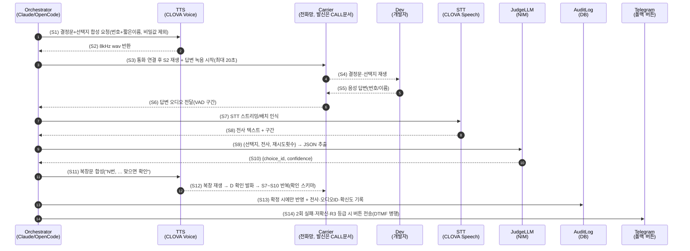
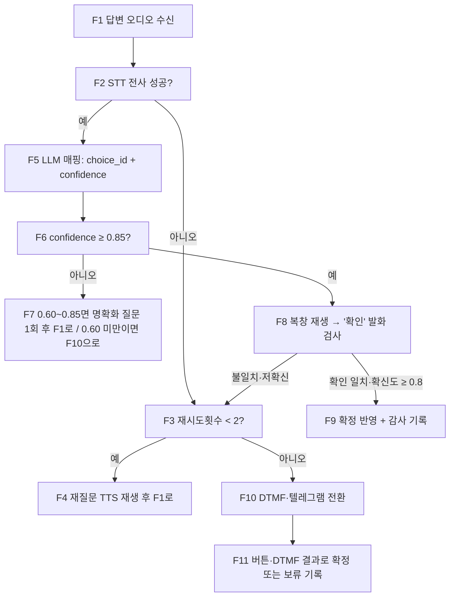

# 개발자 결정 음성 인터페이스 조사 (STT·TTS·판정 프로토콜) — WP 0-6b

> 작성일: 2026-09-25 / 범위: **말로 묻고 말로 답받는 부분만** (TTS 발화 → STT 수신 → 선택지 판정 → 오인식 방지).
> 전화 발신 수단(SIP/Twilio/번호 구매 등) 비교는 별도 문서 `DEV_DECISION_CALL.md`(다른 작업자 담당, 본 작업에서 수정하지 않음)에 위임하고, 본 문서는 그 위에서 도는 음성 결정 프로토콜과 STT·TTS 선정에 집중한다.
> 전제: 본 프로젝트는 NVIDIA NIM(LLM·임베딩) 사용 중(`app/llm.py` 단일 진입점). 나중에 서비스 이용자(소상공인)의 휴대폰 음성 요구사항 입력(STT/TTS)에도 재사용 가능한지 함께 평가한다.
> 조사 방법: 가입·로그인·결제·키 발급·실통화·API 호출 없이 **웹 문서 열람만**으로 수행. 가격은 2026년 현재 공식 요금표 기준이며, 페이지 렌더링상 수치가 가려진 항목은 "확인 필요"로 표기했다.

## 0. 결론 먼저 (추천 조합 1개)

| 역할 | 추천 | 이유 한 줄 |
|---|---|---|
| STT | **네이버 CLOVA Speech 스트리밍 인식** (예비: 리턴제로 RTZR/VITO `sommers_ko`) | 한국어·전화망(PSTN) 특화 주장, 8kHz 전화 대응, gRPC 스트리밍, 월 20분 무료 Free 플랜. 같은 한국어 전화 품질 축에서 실측 비교 후 교체 가능하도록 STT 어댑터로 감싼다 |
| TTS | **CLOVA Voice Premium** (`wav`, `sampling-rate=8000`) | 한국어 자연스러움, 전화망 직접 재생용 8kHz wav 공식 지원, 월 100만 글자 무료 포함, 건당 수백 글자 용도라 월 비용 0원 구간 |
| 판정 LLM | **기존 NIM LLM** (`app/llm.py` 재사용, JSON 스키마 추출) | 추가 음성 벤더 불필요, STT 텍스트 → `{선택지 ID, 확신도}` 구조화만 하므로 경량 프롬프트로 충분, 감사 로그와 함께 남김 |
| 전화 연동 | **서버 매개 파이프라인** (발신·통화 제어는 `DEV_DECISION_CALL.md`에 위임. 본 문서는 "TTS 파일 재생 → 녹음 수집 → STT → 판정" 인터페이스만 정의) | 실시간 일체형(Realtime/Live)에 결정을 통째로 맡기면 전사·확신도·복창 확인을 제어할 수 없고 분당 단가가 10배 이상. 결정 확정은 반드시 §4 프로토콜을 거친다 |

**월 예상 비용 (하루 3건 × 건당 1.5분 = 월 약 135분, §6 상세): STT 약 3,000~5,000원 + TTS 0원(무료 구간) + 판정 LLM 0원(기존 NIM 할당 내) + 전화망 비용 별도(`DEV_DECISION_CALL.md` 참조). 음성 스택만 보면 월 5천원대.**

## 1. 한국어 STT 비교

공통 전제: 결정 통화는 **전화 음질(8kHz)** 이고 발화는 짧다("2번", "확인", "아니요, 1번으로 해줘"). 따라서 장문 정확도보다 **① 8kHz 대응 ② 스트리밍 지연 ③ 짧은 발화 인식 ④ 한국어 전화 특화**가 중요하다.

### 1.1 한눈 표

| # | STT | 한국어·전화 대응 | 실시간 스트리밍 | 지연(공식·발표치) | 가격(2026 공식) | 무료 한도 | 비고·출처 |
|---|---|---|---|---|---|---|---|
| S1 | OpenAI `gpt-4o-transcribe` / `mini` | Whisper 계열 다국어(한국어 포함). 전화 특화 모델 아님 | 배치 중심. HTTP 청크 스트리밍은 가능하나 실시간 arri 지연 500~1500ms급(서드파티 실측) | 서드파티 리뷰 기준 첫 청크 0.5~1.5s | 표준 약 $0.006/분, mini 약 $0.003/분(토큰 과금) | 없음 | [OpenAI Pricing](https://developers.openai.com/api/docs/pricing), [모델 페이지](https://developers.openai.com/api/docs/models/gpt-4o-mini-transcribe) |
| S2 | Google Cloud Speech-to-Text V2 | `ko-KR`, `phone_call` 모델, 125개 언어 | gRPC/WebSocket 스트리밍 지원(단 세션 길이 제한 유의) | 공식 수치 미공개(확인 필요) | V2 표준 $0.016/분, 동적 배치 $0.003/분, 1초 단위 올림 | V1 월 60분 무료 | [STT 요금표](https://cloud.google.com/speech-to-text/pricing) |
| S3 | Azure AI Speech STT | `ko-KR` STT·TTS 모두 지원 | 실시간·배치·Fast Transcription 지원 | 공식 수치 미공개(확인 필요) | 실시간 표준 시간당 과금(요금표 동적 렌더링 — **확인 필요**, 계열 표준 약 $1/시간으로 알려짐, 인용 시 재확인) | 실시간 전사 월 5시간 무료 | [언어 지원](https://learn.microsoft.com/en-us/azure/ai-services/speech-service/language-support), [요금표](https://azure.microsoft.com/ko-kr/pricing/details/speech/) |
| S4 | 네이버 CLOVA Speech | 한국어 최고 수준 주장, **전화망 음성(PSTN) 고성능 명시** | gRPC 스트리밍(16kHz PCM). 단문 REST(최대 60초), 장문(최대 2~6시간) | 공식 수치 미공개(확인 필요) | 15초 단위 올림 과금. 장문 Free 플랜 **월 20분 무료**. 예시 표기상 약 0.5원/초(= 약 30원/분) 수준으로 보이나 플랜별 상이 — **최종 요금표 확인 필요** | 월 20분(Free 플랜, 계정당 도메인 1개) | [CLOVA Speech](https://www.ncloud.com/product/aiService/clovaSpeech), [스펙](https://guide.ncloud-docs.com/docs/clovaspeech-spec.md) |
| S5 | 리턴제로 RTZR/VITO (`sommers_ko`) | 한국어 통화 특화, 일상 대화 데이터 학습 주장, **8kHz LINEAR16 예제 공식 제공** | gRPC·WebSocket 스트리밍, `domain="CALL"` 설정 | 공식 수치 미공개(확인 필요) | Batch·Streaming 동일, T1 시간당 1,000원, 대량 시 300원까지(구간 누진) | 가입 시 600분(10시간) | [요금제](https://www.rtzr.ai/pricing), [OpenAPI 요금](https://developers.rtzr.ai/docs/en/pricing/), [스트리밍 예제](https://developers.rtzr.ai/docs/stt-streaming/grpc/) |
| S6 | Deepgram Nova-3 | `ko`/`ko-KR` 지원(모노링구얼 모델로 한국어 지정) | 네이티브 스트리밍, sub-300ms 주장 | 스트리밍 150~300ms(공식 가이드) | 모노링구얼 PAYG $0.0077/분(프로모션·플랜별 변동) | $200 크레딧 | [요금](https://deepgram.com/pricing), [지연 가이드](https://developers.deepgram.com/docs/measuring-streaming-latency.mdx), [모델·언어](https://developers.deepgram.com/docs/models-languages-overview) |
| S7 | NVIDIA Riva / Speech NIM (Parakeet 등) | **Parakeet 1.1b RNNT Multilingual이 ko-KR 포함 25개 언어** 스트리밍+오프라인. 구형 Riva Conformer ko-KR도 존재 | 스트리밍+오프라인 지원 | GPU 상주 시 낮음(환경 의존, 확인 필요) | NIM 셀프호스팅은 GPU 인프라 비용. 클라우드 분당 과금 아님 | 없음(자체 GPU 필요) | [NIM ASR 배포](https://docs.nvidia.com/nim/speech/26.07.0/asr/deploy-asr-models/index.html), [지원 매트릭스](https://docs.nvidia.com/nim/riva/asr/1.6.0/support-matrix.html), [Parakeet RNNT](https://docs.nvidia.com/nim/speech/latest/asr/deploy-asr-models/parakeet-rnnt.html), [모델 페이지](https://build.nvidia.com/nvidia/parakeet-1_1b-rnnt-multilingual-asr) |
| S8 | 오픈소스 로컬 (whisper.cpp / faster-whisper) | Whisper large 계열 한국어 지원. 전화 특화 아님(8kHz 업샘플 필요) | WhisperLive·whisper-streaming 등 부가 구현 필요(기본은 배치) | CPU small 기준 13분 오디오 약 1~2분(i7·8스레드 벤치) — 실시간은 tiny/base/small+VAD 조합만 가능 | 라이선스 0원 + OCI A1 인스턴스 비용 내 | — | [faster-whisper](https://github.com/SYSTRAN/faster-whisper) (벤치·양자화 int8) |

### 1.2 OCI A1 (ARM, 2 OCPU / 12GB) 실행 가능성

| 방안 | 판정 | 이유 |
|---|---|---|
| faster-whisper `tiny`/`base`/`small` + int8 + VAD, 짧은 발화만 인식 | **가능(후보)** | 8스레드 x86 벤치상 small이 실시간 계수 여유 있음. A1 2 OCPU ARM은 느리므로 `tiny.ko` 또는 `base.ko`부터 실측, 빔사이즈 축소·VAD로 묵음 구간 스킵. 결정 통화(짧은 숫자 발화) 용도로는 충분할 가능성 높음 |
| whisper.cpp large-v3 계열 상시 스트리밍 | **부적합** | 메모리·지연 모두 2 OCPU에서 실시간 불가. 배치 사후 전사·감사 용도로만 고려 |
| NVIDIA Riva / Speech NIM (Parakeet 1.1b 등) 상주 | **불가** | GPU 필수(멀티 모드 50GB VRAM 언급 수준). A1에는 GPU가 없어 실행 불가. GPU 노드 추가 시 재평가 |
| 권장 구조 | **클라우드 STT를 1차, 로컬 tiny를 폴백·사후검증용** | 장애·비용 이중화. 판정 프로토콜(§4)은 STT 벤더에 무관하게 동일하게 동작하도록 어댑터 분리 |

### 1.3 공개 벤치마크 요약 (영어 중심, 한국어 공식 벤치 희소 — 해석 주의)

| 벤치 | 수치(발표·서드파티 정리) | 한국어 해석 |
|---|---|---|
| OpenAI 계열 WER(LibriSpeech clean) | gpt-4o-transcribe 4.1%, mini 4.8%, Whisper-v3 large 5.3%(서드파티 리뷰 인용) | 영어 기준. 한국어·전화(8kHz)에서는 별도 실측 필수 |
| Deepgram Nova-3 | 스트리밍 중앙값 WER 6.84%, 배치 5.26%(자사 발표) | 노이즈·전화 환경 강점 주장. 한국어 짧은 숫자 발화는 실측 필요 |
| CLOVA / VITO | "국내 최고 수준", "통화 특화" 등 정성 주장 + 자사 데이터셋 기준 수치 | 공개 대조 벤치가 없어 **벤더 제공 샘플이 아닌 실제 개발자 음성 50~100건**으로 직접 비교해야 함 |

## 2. 한국어 TTS 비교

결정 통화 TTS 요구사항: ① 한국어 숫자·고유명사 발음 ② 통화 시작 지연(첫 오디오까지) ③ 전화망 연동(8kHz wav 직접 재생이 가장 단순) ④ 건당 수백 글자라 가격은 무료 구간 내 여부.

| # | TTS | 한국어 자연스러움 | 지연 | 가격(2026 공식) | 전화망 연동 | 출처 |
|---|---|---|---|---|---|---|
| T1 | CLOVA Voice Premium | 한국어 100종 보이스, NeuVis 엔진(Pro), 감정·속도·피치 파라미터 | REST 배치 합성(실시간 스트리밍 아님). 미리 합성 후 재생 방식에 적합 | 월 100만 글자 포함 플랜 + 초과분 글자당(1,000자 올림). 본 용도(월 수만 글자)는 무료 구간 | **`wav` + `sampling-rate=8000` 공식 지원** — 전화망 재생 최적 | [CLOVA Voice](https://www.ncloud.com/product/aiService/clovaVoice), [TTS Premium API](https://api.ncloud-docs.com/docs/en/ai-naver-clovavoice-ttspremium) |
| T2 | Google Cloud TTS | Chirp 3 HD(고품질), Neural2, Standard | REST/WebSocket. 공식 지연 수치 미공개(확인 필요) | Chirp 3 HD $30/100만 글자, Neural2 $16/100만 글자, Standard·WaveNet $4/100만 글자, Gemini TTS는 토큰 과금 | mp3/wav 합성 후 게이트웨이에서 재생. 8kHz 변환은 서버 측에서 처리 | [TTS 요금표](https://cloud.google.com/text-to-speech/pricing) |
| T3 | Azure AI Speech TTS | `ko-KR` 다수 보이스, Neural HD/Flash 계열 | 실시간·배치 합성 | 글자당 과금(요금표 동적 렌더링 — **확인 필요**) + 월 50만 글자 무료 | SSML·viseme 지원. SIP 직접 연동은 전화망 구성에 따름 | [TTS 개요](https://learn.microsoft.com/en-us/azure/ai-services/speech-service/text-to-speech), [요금표](https://azure.microsoft.com/ko-kr/pricing/details/speech/) |
| T4 | OpenAI `gpt-4o-mini-tts` | 한국어 지원하나 보이스는 영어 최적화(공식 명시) — 고유명사·숫자 발음 사전 테스트 필수 | 스트리밍 재생 지원 | 텍스트 $0.60/100만 토큰 + 오디오 $12/100만 토큰 (커뮤니티 실측 환산 약 $0.87/시간) | mp3/Opus/AAC/WAV/PCM 출력 후 재생 | [TTS 가이드](https://developers.openai.com/api/docs/guides/text-to-speech), [모델 페이지](https://developers.openai.com/api/docs/models/gpt-4o-mini-tts) |
| T5 | ElevenLabs TTS | 70+ 언어, 한국어 지원. 품질 최상급이나 전화(8kHz)에서는 체감 차이 축소 | 저지연 스트리밍(Flash 계열) | Multilingual 약 $0.10/1,000자, Flash 약 $0.05/1,000자 (≒ 분당 약 $0.05~0.10) | API 합성 후 재생. Conversational AI 사용 시 분당 과금으로 전환 | [API 요금](https://elevenlabs.io/pricing/api?price.platform=api) |
| T6 | NVIDIA Magpie TTS Multilingual/Zeroshot | **2026 릴리스에서 한국어(ko-KR) 추가**(릴리스노트 명시) | GPU 상주 시 낮음 | 인프라 비용(분당 과금 아님) | Riva 파이프라인 내 합성. A1 단독 불가(GPU 필요) | [릴리스노트](https://docs.nvidia.com/nim/speech/latest/about/release-notes.html) |

**판정:** 결정 통 Rach화(짧고 정형화된 안내)에는 T1이 가장 유리하다. 8kHz를 네이티브로 뽑아 트랜스코딩을 없애고, 무료 구간 안에서 끝나며, 한국어 숫자("2번") 발음이 안정적이기 때문이다. 서비스 이용자용(소상공인 대상, 감성 품질 중요)에는 T1 유지 또는 품질 실측 후 Chirp 3 HD / ElevenLabs로 교체하는 이중 구조를 권장(§7).

## 3. 실시간 음성 대화형(스트리밍 일체형) 방식

| # | 방식 | 한국어 | 전화(SIP/Twilio) 연동 | 분당 비용(2026 공식·실측 환산) | 결정 용도 적합성 | 출처 |
|---|---|---|---|---|---|---|
| R1 | OpenAI Realtime API (`gpt-realtime` 계열, 2025-08 GA) | 입력 음성 다국어(한국어 포함) | **SIP 네이티브**(트렁크를 OpenAI에 직접 연결, 번호는 Twilio/Telnyx 별도 구매) | 토큰 과금. flagship 오디오 입력 $32/100만·출력 $64/100만 → 실측 환산 약 $0.05~0.15/분, mini 약 $0.02~0.05/분 + 캐리어 별도(Twilio SIP 약 $0.004/분, 인바운드 약 $0.0085/분) | **부적합(1차 제외)**. 전사·확신도·복창을 서버가 제어할 수 없고, 짧은 결정 통화에 과스펙·고비용 | [GA 발표](https://openai.com/index/introducing-gpt-realtime/), [모델 페이지](https://developers.openai.com/api/docs/models/gpt-realtime), [요금](https://developers.openai.com/api/docs/pricing) |
| R2 | Gemini Live API | 한국어 음성 지원(공식 문서 기준, 세부 요금은 **확인 필요** — 본 조사에서 요금 페이지 열람 실패) | WebSocket/WebRTC. SIP는 별도 브리지 필요 | **확인 필요** | R1과 동일 이유로 제외. 요금·지연 확정 후 이용자용 자유 대화에만 재평가 | 요금·한도 **확인 필요** (ai.google.dev 문서 참조) |
| R3 | ElevenLabs Conversational AI | 다국어(한국어 포함) | Twilio·SIP 연동, 위젯·전화 지원 | 포함분 초과 시 **$0.08/분 + LLM·전화 별도**, 버스트 $0.16/분 | 제외. 음질은 좋으나 결정 확정 로직을 외부에 맡기게 됨 | [Agents 요금](https://elevenlabs.io/pricing/agents), [API 요금](https://elevenlabs.io/pricing/api?price.platform=api) |
| R4 | Vapi / Retell 등 음성 에이전트 플랫폼 | 모델·STT·TTS 조합(한국어 구성 가능, 실측 필요) | 전화번호·SIP 내장 또는 BYO | Vapi: 호스팅 약 $0.05/분 + 모델 원가 패스스루 + 전화료. Retell: $0.07~0.31/분(구성별, 인프라 $0.055/분 + LLM + TTS + 전화) | 제외. 빠른 시제품에는 유리하나, **오인식 방지 확정 프로토콜(§4)의 통제권**이 필요하므로 직접 파이프라인 권장 | [Vapi 요금](https://vapi.ai/pricing), [Retell 요금](https://www.retellai.com/pricing) |

**핵심 판단:** 이 WP의 목표는 "자연스러운 잡담"이 아니라 **"엉뚱한 결정이 반영되지 않게 번호로 확정"** 이다. 일체형 실시간 모델은 (1) 중간 전사·확신도를 얻을 수 없거나 불안정하고, (2) 복창·DTMF 폴백·위험등급 분기를 끼우기 어렵고, (3) 1.5분 통화에 분당 $0.1~0.3은 과비용이다. 따라서 **서버 매개 파이프라인(§4)** 을 표준으로 하고, R1~R4는 나중에 이용자용 자유 발화(요구사항 설명) 기능에서만 재평가한다.

## 4. 결정 판정 프로토콜 (가장 중요)

설계 원칙 3개: **(a) 확인 전에는 절대 반영하지 않는다** (복창 확인 필수), **(b) 숫자로 좁힌다** (자유 발화 → 번호 매핑, 모호하면 재질문), **(c) 두 번 실패하면 채널을 바꾼다** (음성 고집 금지 → DTMF/텔레그램 버튼).

### 4.1 발화 스크립트 규칙

| 규칙 | 내용 | 예시 |
|---|---|---|
| P1 | 선택지는 **번호 + 6글자 이내 짧은 이름**으로만 읽는다. 한 번에 최대 4개 | "1번, 오늘중 배포. 2번, 도메인 구매. 3번, 보류." |
| P2 | 비밀값·토큰·URL·금액 상세를 통화에 **절대 읽지 않는다**. 필요하면 "텔레그램으로 보낸 버튼을 눌러주세요"로 전환 | 금액은 "3만원대"처럼 구간만, 전체 계좌·키 금지 |
| P3 | 답변 유도는 번호 우선, 이름 허용, 자유 의견은 판정 대상이 아님을 명시 | "번호로 말씀해 주세요. 없으면 '다시'라고 말씀해 주세요" |
| P4 | 복창 문구는 고정 템플릿 | "**{번호}번, {짧은 이름}으로 이해했습니다. 맞으면 '확인'이라고 말씀하세요. 다르면 번호를 다시 말씀해 주세요**" |
| P5 | '확인' 외의 긍정 표현("응", "어", "네")은 **확인으로 인정하지 않고** "확인이라고 말씀해 주세요"로 1회 재요청 (방언·오인식 방지) | STT가 "응"을 "2" 등으로 오인식하는 사고 방지 |

### 4.2 판정 LLM JSON 스키마

STT 원문 → NIM LLM이 아래 스키마로만 출력한다. LLM이 결정을 내리는 것이 아니라 **STT 텍스트를 선택지 ID로 매핑**하는 역할이다.

```json
{
  "type": "object",
  "required": ["choice_id", "confidence", "needs_retry", "raw_echo"],
  "properties": {
    "choice_id": {
      "type": ["string", "null"],
      "description": "매핑된 선택지 ID (예: 'c1'..'c4'). 매핑 불가면 null"
    },
    "confidence": { "type": "number", "minimum": 0, "maximum": 1 },
    "needs_retry": { "type": "boolean", "description": "재질문 필요 여부" },
    "raw_echo": { "type": "string", "description": "STT 원문 그대로 (감사 로그용)" }
  }
}
```

시스템 프롬프트 요지(구현 시 `app/services/voice_decision.py` 등에 배치): 선택지 목록 + STT 원문 + 직전 재시도 횟수를 입력하고, 번호("2번", "둘", "이")·짧은 이름·부정("아니요, 1번")을 정규화한다. "확인" 단계에서는 `{"confirmed": true/false, "confidence"}` 만 출력하는 별도 스키마를 사용한다. 확신도는 규칙+모델 판단 결합(§4.4 임계값).

### 4.3 전체 흐름 — sequenceDiagram (autonumber)



**번호별 설명:**

| 번호 | 단계 | 설명 | 실패 시 |
|---|---|---|---|
| S1~S2 | 질문 합성 | P1·P2 규칙 준수. 합성문은 DB에 원문 보관(감사). 8kHz wav 그대로 사용해 트랜스코딩 제거 | 합성 실패 → 텍스트 폴백(텔레그램)으로 즉시 전환 |
| S3~S4 | 재생 | 통화 연결·재생·녹음 제어는 전화망 연동 담당. 본 프로토콜은 오디오 파일 I/O 경계만 정의 | 무응답 20초 → 1회 재재생 후 S14 |
| S5~S6 | 답변 수집 | VAD로 발화 구간만 전달. 전체 통화 녹음과 답변 구간 클립을 분리 저장 | 무음·잡음만 → 재질문 1회 |
| S7~S8 | STT | 스트리밍 1차, 미수신 시 배치 재시도. 원문은 수정 없이 보관 | STT 빈 결과 → 재질문(재시도 카운트+1) |
| S9~S10 | 판정 추출 | §4.2 스키마 강제. `choice_id=null` 허용(모호함 명시) | 스키마 위반 → 재추출 1회, 이후 S14 |
| S11~S12 | 복창 확인 | **확정 전 필수**. '확인' 엄격 매칭(P5) | 확인 불일치 → 번호부터 재질문 |
| S13 | 반영·기록 | 확인된 건만 상태머신에 반영. 전사·확신도·오디오 참조ID·시각을 한 행으로 기록 | — |
| S14 | 채널 전환 | DTMF("번호를 눌러주세요") + 텔레그램 버튼 동시 제공. 음성에 집착하지 않음 | 10분 타임아웃 → 결정 보류로 기록 후 작업 중단 |

### 4.4 판정 로직 — flowchart



**노드별 설명:**

| 노드 | 임계값·동작 | 근거 |
|---|---|---|
| F2 | STT 빈 결과·타임아웃은 실패로 간주 | 짧은 발화는 빈 결과가 흔하므로 정상 분기로 처리 |
| F3·F4 | 음성 재시도는 **최대 2회**. 안내문은 매번 짧아짐(2회차는 "번호만 말씀해 주세요") | 무한 루프 방지. 2회는 VITO·CLOVA 모두 무료 구간 내에서 무시 가능 |
| F6 | 확정 후보 임계값 **0.85** | 숫자 발화는 변별이 쉬우므로 높게. 초기값이며 실측 100건 후 조정(§4.6) |
| F7 | 0.60~0.85는 1회 명확화("2번, 도메인 구매가 맞나요?"), 0.60 미만은 즉시 전환 | 저확신 음성을 붙잡을수록 오확정 위험 증가 |
| F8 | 확인 단어는 **'확인' 정확 일치**(STT 정규화 후). 확신도 0.8 이상 | P5. "네/응"의 방언·오인식("2" 유사음) 차단 |
| F9 | 반영은 확인 이후 1회만. 멱등키(결정 ID)로 중복 반영 방지 | 재전송·재통화 시 이중 집행 방지 |
| F10·F11 | R3 등급(§4.5)은 F6을 통과해도 F10을 경유(2차 확인 강제) | 돈·비가역 결정은 음성만으로 끝내지 않음 |

### 4.5 위험 등급별 규칙

| 등급 | 예시 | 음성 확정 | 추가 규칙 |
|---|---|---|---|
| R1 (저위험·가역) | PRD 문구 선택, 기본값 승인, 일정 확인 | 복창 확인만으로 확정 가능 | 감사 로그만 기록 |
| R2 (중위험·비용 소액/재작업) | 유료 플러그인 1만원대, 재배포 | 복창 확인 + 통화 종료 후 텔레그램 요약 자동 전송(이의 10분) | 이의 있으면 롤백 |
| R3 (고위험·비가역/고액) | 도메인 구매·유료 결제·운영 DB 삭제·외부 계약 | **음성 확정 불가**. 음성은 "의사 청취"까지만, 확정은 텔레그램 버튼(또는 PR 승인)으로만 | 통화에서 금액·계좌·키를 읽지 않음(P2). 버튼에 금액·대상·되돌리기 불가 명시 |

### 4.6 오인식 방지 체크리스트 + 녹음·보관 정책

| # | 항목 | 내용 |
|---|---|---|
| C1 | 숫자 유사음 표 | "1(일)-2(이)-3(삼)" 혼동 대비: 복창에서 번호+이름 동시 확인. "일이요/이요" 종결어미를 LLM 프롬프트에 예시로 포함 |
| C2 | 임계값 캘리브레이션 | 초기 0.85/0.60/0.80으로 시작, 개발자 본인 음성 100건 수집 후 ROC 기준으로 조정. 조정값은 코드 상수로 버전 기록 |
| C3 | 감사 로그 스키마 | `decision_id, choice_id, stt_raw, confidence, confirm_audio_id, channel(voice/dtmf/telegram), risk_grade, created_at`. 원문 그대로 보관 |
| C4 | 보관·파기 | 답변 구간 클립 90일, 전체 통화 녹음 30일 후 파기(개인정보 최소보관). 전사 텍스트는 결정 기록으로 1년. 파기 주기는 cron으로 강제 |
| C5 | 비밀값 금지 | 프롬프트·합성문 생성 단계에서 비밀 패턴(키·토큰·계좌 형식) 검사. 검출 시 합성 중단 + 텔레그램 전환 |
| C6 | 고지 | 통화 시작 멘트에 "결정 확인을 위해 녹음·전사되며 N일 후 파기됩니다" 1문장 포함. 동의 없으면("동의 안 함" 발화 시) 즉시 종료·파기 |

## 5. 전화망 연동 방식 (본 문서 범위: 음성 I/O 경계만)

발신·번호·SIP 트렁크 선정은 `DEV_DECISION_CALL.md`에 위임한다. 본 프로토콜이 전화망 측에 요구하는 인터페이스는 아래 4개뿐이다.

| 요구 | 내용 |
|---|---|
| 재생 | 8kHz wav 파일 재생 API (CLOVA Voice 출력을 그대로 사용) |
| 녹음 | 답변 구간 오디오(8kHz, wav) + VAD 구간 정보 반환 |
| DTMF | RFC 2833 등 숫자 수신 이벤트. F10 전환 시 사용 |
| 웹훅 | 무응답·통화종료·실패 이벤트를 Orchestrator로 전달 |

## 6. 월 예상 비용 (하루 3건 × 건당 1.5분)

가정: 월 30일 × 3건 × 1.5분 = **월 135분**. 건당 TTS 약 300자(질문 200 + 복창 100) = 월 약 27,000자. 판정 LLM은 건당 2회 호출(매핑+확인) × 90건 = 월 180회, 경량 프롬프트.

| 항목 | 계산 | 월 비용 |
|---|---|---|
| STT (CLOVA Speech 스트리밍, 예시 단가 약 30원/분 가정) | 135분 × 약 30원 | **약 4,000원 (요금표 재확인 필요)** |
| STT (대안 RTZR T1) | 2.25시간 × 1,000원/시간 | 약 2,250원 (10시간 무료 이후, 구간 누진) |
| TTS (CLOVA Voice, 월 2.7만자) | 100만 글자 무료 구간 내 | **0원** |
| 판정 LLM (NIM, 기존 할당 내) | 월 180회 경량 호출 | **추가 0원** |
| 참고: OpenAI 대체 시 (mini STT) | 135분 × $0.003 | 약 $0.41 |
| 참고: 일체형(Realtime flagship) 시 | 135분 × 약 $0.10 | 약 $13.5 — **본안의 10배 이상, 제외 근거** |
| **합계(추천 조합, 전화망 제외)** | | **약 3,000~5,000원/월** |

전화 번호·통화료는 `DEV_DECISION_CALL.md` 산정분과 합산할 것 (참고: Twilio 유사 요금 인바운드 약 $0.0085/분 → 135분 ≈ $1.15 수준, 실제 요금표 확인 필요).

## 7. 서비스 이용자(소상공인) 음성 입력에 재사용할 부분

| 자산 | 개발자 결정용 → 이용자용 재사용 | 차이·주의 |
|---|---|---|
| STT 어댑터(벤더 추상화) | 그대로 재사용. 이용자 자유 발화는 장문·잡음(매장 소음)이므로 `phone_call`·잡음 강건 모델로 전환 | 결정용은 짧은 숫자, 이용자용은 긴 서술 — VAD·엔드포인트 설정 분리 |
| TTS 8kHz 파이프라인 | 재사용하되 품질 등급 분리: 결정용 CLOVA 유지, 이용자용은 Chirp 3 HD/ElevenLabs 병행 실측 | 이용자는 감성 품질이 전환율에 영향. A/B 후 선정 |
| 판정 JSON 스키마·복창 UX | **핵심 재사용**: PRD 확정("1번, 카페형으로 이해했습니다. 맞으면 확인") 흐름이 동일 | 이용자는 번호 대신 "응/어"가 많으므로 확인 어휘를 넓히되, R3급(결제·공개)만 엄격 유지 |
| 감사·보관·비밀값 정책 | 그대로 승격. 이용자 음성은 개인정보 비중이 높아 보관 30일·파기 강화 | 약관·동의 UX 추가 필요 |
| 로컬 tiny 폴백 | 이용자 폭증 시 비용 완충용으로 재사용 (비용 상한 장치) | 품질 모니터링(샘플 WER)과 함께 운영 |
| 재사용 불가 | Realtime 일체형 확정 로직, 개발자 전용 확인 어휘(P5 엄격 매칭) | 이용자 UX에 맞게 완화·분리 |

## 8. 도입 순서 (권장)

1. STT 어댑터 + CLOVA Speech 스트리밍 연결, TTS 8kHz 재생, §4 스크립트(P1~P5) 하드코딩으로 1건 수동 통화로 검증.
2. 판정 LLM(JSON 스키마) + 복창 + 감사 로그 + DTMF/텔레그램 폴백 구현. 본인 음성 100건으로 임계값 조정.
3. R3 등급 강제 버튼, 보관 파기 cron, 비밀값 검사(C5) 추가 후 운영 전환.
4. CLOVA↔VITO A/B 실측(정확도·지연·비용) 후 1차 벤더 고정. 결과는 본 문서에 부록으로 추가.
5. 이용자용은 STT 어댑터·복창 UX만 가져가 별도 파일로 설계 (본 문서 수정 금지 대신 새 문서).

## 9. 출처

- OpenAI 요금·모델: https://developers.openai.com/api/docs/pricing · https://developers.openai.com/api/docs/models/gpt-4o-mini-transcribe · https://developers.openai.com/api/docs/models/gpt-4o-mini-tts · https://developers.openai.com/api/docs/guides/text-to-speech · https://developers.openai.com/api/docs/models/gpt-realtime · https://openai.com/index/introducing-gpt-realtime/
- Google STT/TTS 요금: https://cloud.google.com/speech-to-text/pricing · https://cloud.google.com/text-to-speech/pricing
- Azure 언어·요금: https://learn.microsoft.com/en-us/azure/ai-services/speech-service/language-support · https://azure.microsoft.com/ko-kr/pricing/details/speech/ · https://learn.microsoft.com/en-us/azure/ai-services/speech-service/text-to-speech
- CLOVA: https://www.ncloud.com/product/aiService/clovaSpeech · https://www.ncloud.com/product/aiService/clovaVoice · https://guide.ncloud-docs.com/docs/clovaspeech-spec.md · https://api.ncloud-docs.com/docs/en/ai-naver-clovavoice-ttspremium
- RTZR/VITO: https://www.rtzr.ai/pricing · https://developers.rtzr.ai/docs/en/pricing/ · https://developers.rtzr.ai/docs/stt-streaming/grpc/
- Deepgram: https://deepgram.com/pricing · https://developers.deepgram.com/docs/measuring-streaming-latency.mdx · https://developers.deepgram.com/docs/models-languages-overview
- NVIDIA: https://docs.nvidia.com/nim/speech/26.07.0/asr/deploy-asr-models/index.html · https://docs.nvidia.com/nim/riva/asr/1.6.0/support-matrix.html · https://docs.nvidia.com/nim/speech/latest/asr/deploy-asr-models/parakeet-rnnt.html · https://build.nvidia.com/nvidia/parakeet-1_1b-rnnt-multilingual-asr · https://docs.nvidia.com/nim/speech/latest/about/release-notes.html
- 로컬: https://github.com/SYSTRAN/faster-whisper
- 대화형·플랫폼: https://elevenlabs.io/pricing/agents · https://elevenlabs.io/pricing/api?price.platform=api · https://vapi.ai/pricing · https://www.retellai.com/pricing
- 서드파티 실측(보조, 공식 아님): TokenMix gpt-4o-transcribe 리뷰, convertaudiototext 2026 요금 비교, Fora Soft Realtime 요금 분석 — 수치는 공식 요금표와 교차 확인 후 사용.
