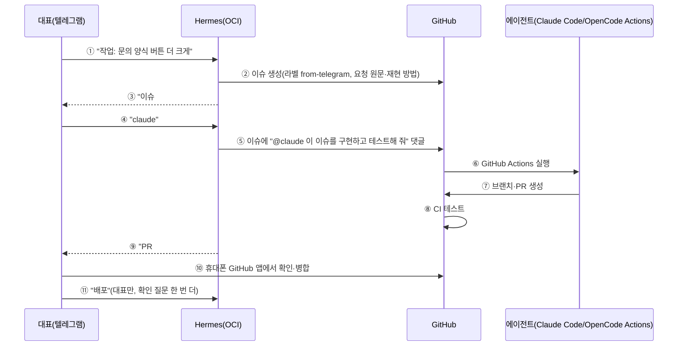

# 개발·운영 체계: Hermes(OCI) 감시 + 텔레그램 작업 지시 (2026-09-26)

> 계기: 대표 요청 "OCI의 Hermes로 모니터링·작업 지시 환경이 있는지, 좋은 개발을 위한 시스템 구축", "텔레그램으로 작업을 지시하는 방법 리서치".
> 서버 확인은 읽기 전용으로만 했다(설정 파일의 키·토큰은 열지 않음).

## 0. 5줄 요약

1. **Hermes 게이트웨이는 9/22부터 OCI에서 돌고 있고 텔레그램 대화방 1개가 연결돼 있다.** 대시보드는 서버 안(127.0.0.1:9119)에서만 열린다(안전).
2. 하지만 **agt001을 지켜보는 예약 작업은 0건**, 프로젝트 전용 기능(스킬)도 없다. 앱 자체 운영자 알림(D33 텔레그램)도 코드가 없다. 즉 "대화 창구만 있고 감시·지시 체계는 없다".
3. Hermes의 모델이 NIM 체험판이다(상업·운영 사용 문제, [COMMERCIAL_READINESS_PLAN.md](COMMERCIAL_READINESS_PLAN.md) C-8).
4. **추천 구조**: 텔레그램 → Hermes가 GitHub 이슈로 접수 → 이슈에서 Claude Code(`@claude`)나 OpenCode(`/opencode`)가 GitHub Actions로 작업해 PR → CI 테스트 → 대표가 휴대폰으로 확인·병합 → 배포. Hermes는 **감시·보고·접수만** 하고 코드 수정·배포 권한은 주지 않는다.
5. 감시는 **AI 없는 스크립트 예약 작업**(Hermes cron의 스크립트 전용 모드)으로 해서 비용 0원·체험판 문제 없음.

## 1. 지금 상태 (2026-09-26 서버 확인)

| 항목 | 상태 |
|---|---|
| Hermes 게이트웨이 | 실행 중(9/22~), `hermes_cli.main gateway run` |
| Hermes 대시보드 | 실행 중, **127.0.0.1:9119만**(외부 차단). 보려면 SSH 터널 |
| 연결 채널 | 텔레그램 1개 |
| 모델 | `nvidia/nemotron-3-super-120b-a12b`(NIM 체험판) |
| 예약 작업(cron) | 실행 기록 0건 |
| 스킬 | 기본 묶음(devops·research 등)만, agt001 전용 없음 |
| 서버 cron | 매일 DB 백업 1개(사진·공개 파일은 백업 안 됨, DATA_ARCHITECTURE_REVIEW D-1) |
| CI | GitHub Actions 테스트, 최근 5회 모두 성공 |
| 배포 | 맥에서 `scripts/deploy.sh`(rsync·ssh). 서버는 git pull 못 함(GIT_PULL_ROOT_CAUSE) |
| 스테이징 | 없음(DELIVERY_PIPELINE 0-4b 대기) |
| 서버 자원 | 디스크 45G 중 18G 사용, 메모리 12G(여유 충분), 2코어 |

## 2. 역할

| 누가 | 하는 일 | 권한 |
|---|---|---|
| 대표 | 결정·승인, 텔레그램으로 지시, 휴대폰으로 PR 확인·병합 | 전부 |
| Claude Code | 계획·핵심 코드·검토(로컬 세션, 또는 GitHub Actions `@claude`) | 브랜치·PR |
| OpenCode | 후속 작업·단순 검증(로컬 백그라운드, 또는 GitHub Actions `/opencode`) | 브랜치·PR |
| Hermes(OCI) | 24시간 감시·보고, 텔레그램 지시를 GitHub 이슈로 접수, 정해 둔 점검 스크립트 실행 | **읽기 + 이슈 쓰기만**(코드·배포 권한 없음) |
| GitHub | 작업 목록(이슈)·기록·CI | — |

## 3. 텔레그램으로 작업 지시하는 흐름

| 번호 | 설명 |
|---|---|
| ① | 대표만 쓸 수 있다(Hermes 페어링 목록에 대표 1명만, https://hermes-agent.nousresearch.com/docs/user-guide/messaging/) |
| ② | Hermes는 GitHub **이슈 쓰기만** 되는 fine-grained 토큰을 쓴다(코드 쓰기 권한 없음) |
| ③~④ | 핵심 코드는 Claude, 단순·후속은 OpenCode(메모리의 역할 분담과 같음) |
| ⑤~⑦ | Claude Code GitHub Actions: 이슈·PR 댓글의 `@claude`로 실행, 브랜치·PR을 만든다(https://code.claude.com/docs/en/github-actions). OpenCode는 `/opencode`(https://opencode.ai/docs/github/). **댓글이 곧 명령이라, 저장소 관리자 댓글만 실행되게 막는다** |
| ⑧ | 지금 CI(테스트) 그대로 |
| ⑨ | Hermes가 PR 요약을 텔레그램으로 |
| ⑩ | 병합은 사람이 한다 |
| ⑪ | 배포는 처음에는 맥의 `deploy.sh`(Claude 세션)로. 서버 배포 키(GIT_PULL_ROOT_CAUSE §4)가 생기면 Hermes에 **정해 둔 배포 스크립트 하나만** 허용하고, 실행 전 확인을 받는다 |

다른 길: 맥에서 도는 Claude Code 세션은 휴대폰 Claude 앱의 원격 제어로도 지시할 수 있다(텔레그램 아님).

## 4. Hermes 감시 (AI 없는 스크립트 예약 작업)

Hermes cron은 스크립트만 돌리고 결과를 텔레그램으로 보내는 모드가 있다(https://hermes-agent.nousresearch.com/docs/guides/cron-script-only). AI를 안 부르니 비용 0원·체험판 문제 없음.

| 주기 | 점검 | 알림 조건 |
|---|---|---|
| 5분 | `/health` 응답, 컨테이너 3개 실행 | 2번 연속 실패 즉시 |
| 1시간 | 백엔드 로그의 오류(Traceback·ERROR) 수, NIM 한도 초과(429) 수 | 기준 넘으면 즉시 |
| 매일 09:00 | 요약: 새 방·공개 사이트·문의 수(D45 `design_report`), 백업 성공, 디스크·메모리, 어제 오류 수 | 매일 보고 |
| 매일 새벽 | 공개 사이트 품질 점검(D49 다음 범위) | 새 문제만 |
| 매주 | OCI 비용(`scripts/oci_cost_report.sh`), Zen 사용액 | 0원 초과·한도 80% |

## 5. 좋은 개발을 위한 규칙 (추천)

| # | 규칙 | 이유 |
|---|---|---|
| R-1 | 작업마다 이슈 → 브랜치 → PR → CI 통과 → 병합 | 지금은 main에 바로 커밋. 에이전트가 여럿이 되면 기록·되돌리기가 필요 |
| R-2 | 스테이징(0-4b) 먼저 만들고, DB 마이그레이션은 스테이징에서 먼저 | 오픈 전 데이터 구조 이전(DATA_ARCHITECTURE_REVIEW M1~M2)이 크다 |
| R-3 | 서버 배포 키로 `git pull` 배포 + 배포 기록(버전 태그) | 맥이 꺼져 있어도 배포·되돌리기 |
| R-4 | 매일 밤 평가(요구사항 시뮬레이션·공개 사이트 품질)를 CI 예약으로 | 품질 후퇴를 다음 날 안다(평가 호출은 체험판 약관의 평가 용도) |
| R-5 | Hermes 모델을 체험판에서 싼 유료 모델로, 도구 권한은 감시 스크립트·이슈 쓰기로 제한 | 운영 사용·보안 |

## 6. 순서와 시간(추정)

| 단계 | 내용 | 시간 | 언제 |
|---|---|---|---|
| S1 | Hermes 스크립트 감시(§4 중 5분·1시간·매일 보고) | 0.5~1일 | **베타 전(1주)** — 베타 중 장애를 바로 알아야 함 |
| S2 | 텔레그램 → 이슈 접수 스킬 + GitHub Actions(`@claude`·`/opencode`) + 관리자만 실행 | 1일 | 2주 |
| S3 | 스테이징·PR 규칙·서버 배포 키 | 1~2일 | 베타 뒤(10/18~) |

비용: S1 0원. S2는 Actions에서 도는 에이전트 호출 비용(Claude는 API 키 또는 구독 토큰 방식 — 우리 계정에 맞는 방식 확인 필요, OpenCode는 연결한 모델 비용).
