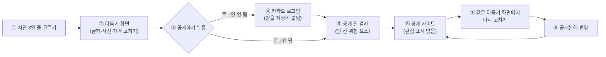

# 편집·공개 흐름 계획 (EDIT_PUBLISH_PLAN)

> 2026-09-29 (KST) 초안. 대표 요청: ① 공개 주소가 눌리지 않아 복사·붙여넣기를 해야 함 ② 공개 전에 시안을 고칠 수 있는지 ③ 로그인을 꼭 해야 하는지, 편집→공개인지 공개→편집인지 ④ 다른 아이디어.
> 결정이 필요한 곳은 §6에 모았다. 구현은 OpenCode 물결로 나눈다(§7).

## 1. 지금 코드가 하는 일 (2026-09-29 확인)

| 번호 | 항목 | 지금 동작 | 근거 |
|---|---|---|---|
| 1 | 채팅 속 주소 | 전화번호만 `tel:` 고리로 바뀐다. `https://…` 주소는 그냥 글자라 누를 수 없다 | `static/room.html` `appendPhoneLinkedText` |
| 2 | 공개 답장 | "사이트를 열었어요: {주소}" + "사이트 고치기: {주소}/editor?room=…"를 글자로만 보낸다 | `app/services/chat_flow.py` `_publish` |
| 3 | 공개 전 편집 | **이미 된다.** 시안이 생기면 방장에게 더보기 → "직접 고치기"가 보인다. 하지만 더보기 안에 숨어 있어 찾기 어렵다 | `static/room.html` 더보기(`editorLink`, `hasDesign`) |
| 4 | 편집 저장 뒤 | 공개 뒤에는 저장하자마자 공개본을 다시 그린다. **공개 전에는 카드만 바뀌고 시안 3안 그림은 옛날 그대로**다(사진 올리기만 시안을 다시 그림) | `app/api/card.py` `put_card`, `app/services/photos.py` |
| 5 | 편집 화면 모양 | 칸 9개(가게 이름·전화·영업시간·위치·가격·상품·소개·대상·연락 방법)를 글상자로 고친다. 사진은 목록만 보이고 올리기·지우기는 없다. 미리보기 없음 | `frontend/src/editor/CardEditor.tsx` |
| 6 | 가격 | 가격 칸 하나에 글로 적는다("성수기 15만원, 비수기 10만원"). 상품별 가격을 따로 고칠 수 없다 | `app/services/card_data.py` `season_prices`, `_catalog` |
| 7 | 눌러서 고치는 미리보기 | 목업 편집기에는 이미 있다(섹션을 그려 놓고 글자를 누르면 고치기). 실제 카드에는 안 붙어 있다 | `frontend/src/editor/SectionPreview.tsx`, `MockEditor.tsx` |
| 8 | 로그인 | 시안 만들기·고르기·고치기는 로그인 없이 된다. **처음 공개만** 로그인 필수(방장이 방을 계정에 붙여야 함) | `app/config.py` `publish_login_required=True`, OWNER_SETTINGS_PLAN §1.1 |
| 9 | 공개 사이트 | 편집용 표시(사진 추가 아이콘 등)는 들어가지 않는다. 편집은 `/editor` 별도 화면에서만 | `app/services/site_render.py` |
| 10 | 사진 API | 방 사진 올리기·지우기 API가 이미 있다 | `app/api/rooms.py` `POST/DELETE /room/{id}/photos` |

## 2. 판단: 편집 → 공개, 그리고 공개 뒤에도 같은 편집

**추천: "고르기 → 다듬기(편집) → 공개 → 언제든 다시 고치기" 한 줄 흐름. 편집 화면은 하나이고, 공개 전과 공개 뒤에 같은 화면을 쓴다.**

- 공개 전에 고칠 수 없으면, 틀린 전화번호·가격이 손님에게 먼저 보인다. 가게 사이트는 첫인상이 곧 신뢰다.
- 공개 뒤에도 가격·사진은 계속 바뀐다. 그래서 공개 뒤 편집도 꼭 필요하다.
- 화면을 둘로 나누면 사장님이 "어디서 고치지?"를 헷갈린다. 같은 화면에 "공개하기 / 공개본에 반영" 버튼만 상태에 따라 바꾼다.

| 번호 | 단계 | 누가 | 설명 |
|---|---|---|---|
| ① | 시안 고르기 | 사장님 | 지금처럼 채팅방에서 1·2·3안 중 하나를 고른다 |
| ② | 다듬기 화면 | 사장님 | 고른 안을 실제 사이트 모양 그대로 보여 주고, 글자·가격을 눌러 고치고, 사진 자리에서 사진을 더한다. 로그인 없이 된다 |
| ③ | 공개하기 | 사장님 | 다듬기 화면 맨 아래 큰 버튼. 채팅으로 "공개"라고 해도 같다 |
| ④ | 로그인 | 사장님 | 처음 공개 때 한 번만. 다른 기기에서 고치려면 계정이 있어야 해서 여기서 받는다 |
| ⑤ | 공개 전 검사 | 시스템 | 지금 있는 빈 칸 확인과 게시 전 검사(`publish_check`)를 그대로 쓴다 |
| ⑥ | 공개 사이트 | 손님 | 편집 아이콘·버튼이 전혀 없는 깨끗한 화면 |
| ⑦ | 다시 고치기 | 사장님 | 공개 답장·채팅방 버튼·설정 페이지에서 같은 다듬기 화면으로 들어간다 |
| ⑧ | 공개본에 반영 | 사장님 | 고친 내용을 공개 사이트에 반영한다(§6 결정 1: 바로 반영할지, 버튼으로 반영할지) |

### 로그인 판단

- **공개 전 다듬기는 로그인 없이.** 써 보기 전에 로그인을 요구하면 대부분 떠난다. 지금 결정(OWNER_SETTINGS_PLAN, 9/28)과 같다.
- **처음 공개에만 로그인 필수 유지.** 공개된 사이트에는 책임지는 주인이 있어야 하고, 다른 기기에서 고치려면 계정이 필요하다. 지금 코드 그대로다.
- 바꿀 점은 로그인 안내의 위치뿐이다. 지금은 채팅 답장에 로그인 주소 두 줄이 글자로 나간다. 다듬기 화면의 "공개하기" 버튼을 누르면 로그인 창으로 바로 가고, 로그인 뒤 그 화면으로 돌아와 공개가 이어지게 한다.

## 3. 할 일 1: 주소를 누를 수 있게 (가장 먼저, 작음)

1. **채팅 속 주소를 고리로.** `appendPhoneLinkedText`를 넓혀 `https://…` 주소도 `<a>`로 만든다. 지금처럼 `innerHTML` 없이 `createElement`로 만든다. 우리 주소(같은 호스트, 미리보기 호스트)는 같은 탭, 바깥 주소는 새 탭 + `rel="noopener"`.
2. **공개 답장에 버튼 붙이기.** 글자 주소를 찾아 쓰지 않고, 공개 답장 메시지에 정보를 담는다(`m.site = {url, editor_url}`). 방 화면은 이걸 보고 말풍선 아래에 버튼 넷을 단다.
   - **사이트 열기**
   - **주소 복사**: `navigator.clipboard`. 복사되면 "복사했어요" 표시
   - **카톡으로 보내기**: 초대 공유와 같은 `Kakao.Share`. 실패하면 복사로 넘어감
   - **사이트 고치기**: 방장에게만
3. 휴대폰에서는 "카톡으로 보내기" 옆에 `navigator.share`(휴대폰 기본 공유 창)도 둔다. 문자·인스타·밴드로 바로 보낼 수 있다.

## 4. 할 일 2: 다듬기 화면을 실제 사이트 모양으로

목업 편집기(`SectionPreview`)의 "눌러서 고치기"를 실제 카드에 붙인다. 새로 만들지 않고 있는 것을 옮긴다.

| 번호 | 무엇 | 어떻게 |
|---|---|---|
| 4-1 | 미리보기 | 고른 안을 공개 사이트와 같은 렌더러로 그린다. 편집 모드 표시(`edit=1`)는 이 화면에서만 붙는다 |
| 4-2 | 글자 고치기 | 제목·소개·영업시간·전화 등을 누르면 그 자리에서 고친다. 저장은 지금 API(`PUT /api/rooms/{id}/card`) 그대로 |
| 4-3 | 가격 고치기 | 상품·객실·메뉴마다 "이름 / 가격" 줄로 고친다. 성수기·비수기 요금표는 표로. 저장할 때는 지금의 가격 글 형식으로 바꿔 넣어 렌더러를 건드리지 않는다(§6 결정 3) |
| 4-4 | 사진 더하기 | 사진 자리마다 "＋ 사진" 단추. 지금 사진 API(`POST /room/{id}/photos`)에 항목 태그를 붙여 올린다. 지우기·순서 바꾸기도 |
| 4-5 | 시안 다시 그리기 | 공개 전 저장에도 `design.render_variants`를 불러 시안 그림을 새로 고친다(지금은 사진만 그렇다). 여러 번 연달아 고치면 마지막 저장 뒤 한 번만 그린다 |
| 4-6 | 공개 사이트 보호 | 편집 표시(`data-edit`, "＋ 사진" 단추)는 공개본 HTML에 절대 들어가지 않게 한다. `publish_check`에 "편집 표시가 있으면 공개 막기"를 더하고, 테스트로 고정한다 |
| 4-7 | 찾기 쉽게 | 시안을 고르면 채팅방 입력줄 위에 "다듬기" 버튼(지금 공개 뒤에만 보이는 "사이트 고치기" 버튼을 공개 전에도). 더보기 안 링크는 그대로 |

## 5. 할 일 3: 다른 아이디어 (우선순위 순)

| 번호 | 아이디어 | 왜 | 크기 |
|---|---|---|---|
| 5-1 | **카톡 공유 미리보기 그림(OG 태그)** | 공개 주소를 카톡에 붙이면 지금은 그림 없이 주소만 보인다. 가게 이름·대표 사진이 뜨면 손님이 누른다 | 작음 |
| 5-2 | **QR 코드** | 가게 계산대·전단지에 붙인다. 공개 답장·설정 페이지에 "QR 받기" | 작음 |
| 5-3 | **짧은 주소** | `/site/<긴 번호>/` 대신 `/s/망원분식` 같은 이름 주소. 말로 불러 줄 수 있다 | 중간 (이름 겹침·금칙어 처리) |
| 5-4 | **고친 기록·되돌리기** | D27에 이미 적힌 약속. 잘못 고쳐도 한 번에 돌아간다 | 중간 |
| 5-5 | **휴대폰/컴퓨터 미리보기 전환** | 손님 대부분은 휴대폰으로 본다 | 작음 |
| 5-6 | **다듬기 화면의 "AI에게 부탁하기"** | "분위기를 더 따뜻하게"처럼 구조·분위기 변경은 채팅으로(D27). 채팅방으로 한 번에 이동 | 작음 |
| 5-7 | **공개 전 점검표** | 빈 칸·사진 없는 항목·전화 연결 확인을 한눈에. 지금 채팅 문장으로 나가는 걸 화면으로 | 작음 |
| 5-8 | **방문 수 한 줄** | "이번 주 23명이 봤어요". 사장님이 다시 들어올 이유 | 중간 |

## 6. 결정이 필요한 것

| 번호 | 질문 | 추천 | 다른 선택 |
|---|---|---|---|
| 1 | 공개 뒤 고친 내용을 바로 반영할까, "반영" 버튼을 따로 둘까 | **바로 반영**(지금 동작 유지) + 5-4 되돌리기 | 초안/공개본 두 벌 보관 + "공개본에 반영" 버튼. 안전하지만 카드를 두 벌 다뤄야 해서 품이 크다 |
| 2 | 공개 전 다듬기에 로그인이 필요할까 | **아니요**(처음 공개 때만) | 다듬기부터 로그인 필수. 다른 기기 편집이 쉬워지지만 이탈이 는다 |
| 3 | 가격을 항목별 데이터로 바꿀까 | **이번엔 화면만 항목별, 저장은 지금 글 형식** | 카드에 `items[{name, price, photo}]` 새 칸. 제대로지만 추출 엔진·렌더러·검사까지 바뀐다 |
| 4 | 우선순위 | **3 → 4-7·4-5 → 4-1~4-4·4-6 → 5-1·5-2** | |

## 7. 물결 나누기 (OpenCode 구현, Claude 계약·검토)

| 물결 | 일 | 맡는 파일 | 합격 기준 |
|---|---|---|---|
| 1 | §3 주소 고리·공개 답장 버튼 | `static/room.html`(주소 고리·버튼 부분), `app/services/chat_flow.py`(`_publish` 메시지 정보만), `app/services/rooms.py`(메시지에 `site` 담기) | 공개 뒤 채팅방에서 주소를 누르면 열리고, 복사·카톡·고치기 버튼이 보인다. 390px 캡처 |
| 1 | §4-5 공개 전 저장 뒤 시안 다시 그리기 | `app/api/card.py` | 공개 전 전화번호를 고치면 시안 그림에 새 번호. 단위 테스트 |
| 2 | §4-1~4-4 실제 카드 미리보기 편집 | `frontend/src/editor/*` | 누르면 고치고, 사진 더하기·가격 줄 편집이 저장되고, 새로고침해도 남는다. Vitest |
| 2 | §4-6 공개본 보호 | `app/services/publish_check.py`, `tests/unit/` | 편집 표시가 들어간 HTML은 공개 거절. 지금 공개 사이트 전체에 편집 표시 0건 |
| 3 | §4-7 다듬기 버튼·공개하기 버튼과 로그인 이어가기 | `static/room.html`, `frontend/src/editor/*` | 시안 고른 뒤 버튼이 보이고, 로그인 뒤 다듬기 화면으로 돌아와 공개가 이어진다 |
| 4 | §5-1 OG 태그, §5-2 QR | `app/services/site_render.py`, `app/api/public.py` | 카톡에 주소를 붙이면 가게 이름·사진이 뜬다(실기기 확인) |

같은 물결의 일은 같은 파일을 나눠 갖지 않는다. 물결 사이마다 Claude가 전체 테스트(단위·엔진·프런트·휴대폰 11단계)를 돌린다.
