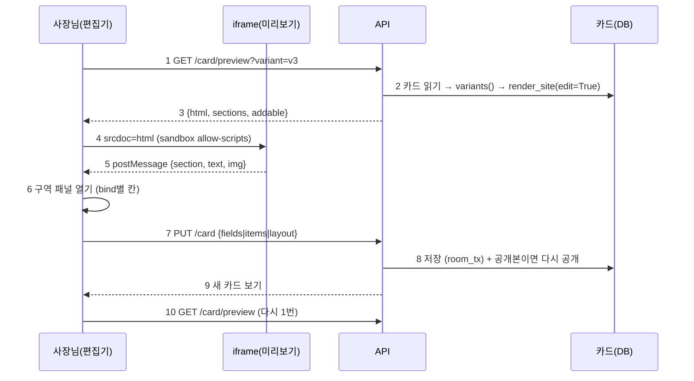

# 물결 2 계약서: 보며 고치기 + 구역 순서·숨기기·추가 (EDIT_WAVE2_CONTRACT)

> 2026-09-30 (KST) / Claude 작성, OpenCode 구현. 상위 계획 [APP_COMMERCE_PLAN](APP_COMMERCE_PLAN.md) §2 물결 2 (10/2~10/8), 결정 D56 ④.
> D27("내용은 직접, 구조는 채팅")을 D56 ④가 넓힌다: 구역 **순서·숨기기·추가**까지 직접. 구역 **안의 모양(variant)·색·글꼴**은 여전히 채팅.

## 0. 결론

- 편집기(`/editor?room=`)에 **"보며 고치기"** 탭을 더한다. 시안을 실제 모양 그대로 iframe에 띄우고, 누른 구역의 고칠 칸을 옆(휴대폰은 아래) 패널에 연다.
- 미리보기 HTML은 API가 JSON으로 주고, 편집기가 `iframe srcdoc` + `sandbox="allow-scripts"`(same-origin 없음)로 띄운다. 새 공개 경로·새 호스트 없음. 누름은 iframe 안 작은 스크립트가 `postMessage`로 알린다.
- 템플릿(mustache)은 **하나도 안 고친다**. 모든 구역 뿌리에 이미 있는 `data-section-id`로 구역을 알아내고, 항목은 누른 글자로 맞춘다.
- 구역 편집은 카드에 `card["layout_edits"][안 id]`로 저장하고, **청사진 뼈대(skeleton)에 resolve 전에** 적용한다. 그래서 내비·하단 탭·행동 바가 저절로 맞고, 채팅으로 시안을 다시 만들어도 편집이 남는다.

## 1. 흐름



| 번호 | 단계 | 설명 |
|---|---|---|
| 1 | 미리보기 요청 | 방장만. 고른 안(`choice`)이 있으면 그 안, 없으면 `v1` |
| 2 | 렌더 | 저장된 시안 파일이 아니라 **지금 카드로 바로** 그린다(스크린샷 없음, 수십 ms). 비동기 시안 갱신을 기다리지 않는다 |
| 3 | 응답 | HTML + 구역 목록 + 추가할 수 있는 구역 |
| 4 | 띄우기 | `sandbox="allow-scripts"`만. `allow-same-origin` 금지(앱 저장소·쿠키 격리) |
| 5 | 누름 알림 | 링크·폼 동작은 막고, 가장 가까운 `[data-section-id]`와 누른 글자(80자)·그림 여부를 보낸다 |
| 6 | 패널 | §4 표대로 칸을 연다. 누른 글자가 항목 이름과 같으면 그 항목을 먼저 펼친다 |
| 7 | 저장 | 기존 `PUT /api/rooms/{id}/card`에 `items`·`layout`을 더한다 |
| 8 | 반영 | 기존 규칙 그대로: 공개본이 있으면 즉시 다시 공개(공개 전 검사), 없으면 시안 파일 비동기 갱신 |
| 9 | 응답 | 기존 `_view` + `layout` |
| 10 | 다시 그림 | 편집기가 1번을 다시 부른다 |

## 2. API

### 2.1 `GET /api/rooms/{room_id}/card/preview?variant=v1|v2|v3` (신규)

- 인증: 기존 `_member_room` + **방장만**(`rooms.owner_id(room) == member_id`, 아니면 403). 카드가 없거나 시안 전이면 409 `{"detail": "no design yet"}`.
- `variant` 생략·이상한 값 → `card["design_choice"]` 또는 `"v1"`.
- 응답:

```json
{
  "variant": "v3",
  "html": "<!doctype html>…(edit=True 렌더)…",
  "sections": [
    {"id": "hero", "label": "첫 화면", "bind": "hero", "locked": true, "hidden": false},
    {"id": "menu", "label": "메뉴", "bind": "catalog", "locked": false, "hidden": false},
    {"id": "space", "label": "공간", "bind": "space_photos", "locked": false, "hidden": true}
  ],
  "addable": [{"id": "sign", "label": "시그니처", "bind": "signature"}]
}
```

- `sections`: 이 안의 **숨긴 것까지 포함한** 순서대로. `label`은 `design._section_name`을 재사용(없으면 `nav` → `label` → id).
- `locked`: `hero`, `inquiry`는 true(옮기기·숨기기 불가, D32 문의 양식 기본 포함).
- `addable`: 같은 청사진의 다른 안(3개 전략)에 있고 이 안에 없는 구역. 이미 추가한 것은 빠진다.
- 응답 헤더: `Cache-Control: no-store`.

### 2.2 `PUT /api/rooms/{room_id}/card` (확장)

기존 `fields`·`notice`는 그대로. 둘을 더한다. 셋 다 한 요청에 올 수 있고, 하나라도 바뀌면 기존처럼 시스템 알림 한 줄("직접 편집으로 고쳤어요: 메뉴 항목, 구역 순서").

```json
{
  "items": [
    {"name": "아메리카노", "rename": "아이스 아메리카노", "price": "4,500원", "note": "샷 추가 500원"},
    {"name": "바닐라라떼", "remove": true},
    {"name": "레몬에이드", "add": true, "price": "5,000원"}
  ],
  "layout": {"variant": "v3", "order": ["sign", "menu", "around", "inquiry"], "hidden": ["sign"], "added": ["space"]}
}
```

**items** (메뉴·반·객실·시술 항목. 저장은 이미 있는 카드 칸만 쓴다):

| 키 | 저장 위치 | 규칙 |
|---|---|---|
| `name` | 찾기 키 | `offerings` 칸 값 목록 안에 있어야 함(없으면 그 줄 무시). `add`일 때만 새 이름 |
| `rename` | `slots.offerings.value`의 그 원소 | 1~30자. `price_pairs`·`item_notes`의 키와 사진 태그 `item:<옛 이름>`도 새 이름으로 옮긴다 |
| `price` | `card["price_pairs"][name]` | 0~20자. 빈 글이면 키 삭제. `card_data.price_won`으로 못 읽어도 저장은 한다(글 그대로 표시) |
| `note` | `card["item_notes"][name]` | 0~80자. 빈 글이면 키 삭제 |
| `remove` | 목록에서 빼고 두 사전의 키도 삭제 | 마지막 1개는 못 뺀다(400) |
| `add` | 목록 끝에 추가, 상태 `FILLED` | 최대 20개. 같은 이름이면 무시 |

- 쓰기는 `prd_engine._put(card, "offerings", 새 목록, S.FILLED, turn, "editor")` 한 번. 한 요청에 items 최대 30줄.

**layout** (구역, 안별):

- 저장: `card["layout_edits"][variant] = {"order": [...], "hidden": [...], "added": [...]}`. `layout: {"variant": "v3", "reset": true}`면 그 안의 키를 지운다.
- 서버가 `layout_edits.normalize`로 정리한 뒤 저장한다(§3.1). 정리 결과가 기존과 같으면 "바뀐 것 없음".
- 400: `variant`가 v1~v3가 아님. 그 밖의 이상한 id는 400이 아니라 **조용히 버린다**(채팅으로 업종이 바뀌어 청사진이 달라져도 안 깨지게).

응답: 기존 `_view`에 `"layout": card.get("layout_edits") or {}`를 더한다.

## 3. 서버 구현 경계

### 3.1 `app/services/layout_edits.py` (신규, 순수 함수만. DB·파일 접근 없음)

```python
LOCKED = ("hero", "inquiry")
MAX_ADDED = 3

def pool(blueprint: dict) -> dict[str, dict]:
    """청사진 3개 전략의 구역 노드를 id별로 (처음 나온 것). hero는 없음(skeleton이 만든다)."""

def normalize(edits: dict | None, blueprint: dict, pos: int) -> dict | None:
    """{order, hidden, added}를 이 청사진·안 기준으로 정리. 아무 효과 없으면 None.
    - added: pool에 있고 이 안에 없는 id만, 최대 3
    - hidden: 이 안(+added)에 있는 id만, LOCKED 제외
    - order: 이 안(+added) id의 순열로 맞춤. 빠진 id는 원래 순서대로 뒤에, 모르는 id는 버림. LOCKED도 옮길 수 없다: inquiry는 원래 자리 유지"""

def apply(skeleton: dict, blueprint: dict, pos: int, edits: dict | None) -> dict:
    """SD.skeleton 결과(hero가 0번)에 적용한 새 명세. hero는 항상 0번.
    added 노드는 SD.skeleton과 같은 모양({id,type,variant,bind,content:{}, label/nav/tone/order/optional})으로 넣는다.
    hidden은 목록에서 뺀다(resolve가 내비·행동 바를 남은 구역으로 계산)."""

def sections(blueprint: dict, pos: int, edits: dict | None) -> list[dict]:
    """GET preview의 sections(숨긴 것 포함, 순서대로) — [{id, bind, locked, hidden, node}]."""

def addable(blueprint: dict, pos: int, edits: dict | None) -> list[dict]:
    """pool 중 이 안(+added)에 없는 것."""
```

### 3.2 `design_variants._blueprint_variants` 한 줄 연결

`spec = SD.skeleton(blueprint, pos)` 바로 다음:

```python
spec = LE.apply(spec, blueprint, pos, (card.get("layout_edits") or {}).get(strategy.get("id") or f"v{pos + 1}"))
```

- `_to_app`(3안 앱형)·`_recolor_v3`·`_agent_apply`는 손대지 않는다. 앱형 변환은 구역 목록을 바꾸지 않으므로 편집이 그대로 남는다.
- `min_distance` 검사는 편집 전후 상관없이 그대로 돈다(편집으로 v3 색이 바뀔 수 있음 — 허용).
- 청사진 없는 옛 경로(`_legacy_variants`)는 편집을 무시한다. GET preview는 `sections: []`, `addable: []`로 응답하고 편집기가 "이 시안은 구역 편집이 안 돼요"를 보인다.

### 3.3 `site_render.render_site(..., edit: bool = False)`

- `edit=True`일 때만 `</body>` 앞에 아래 두 가지를 넣는다. `public=True`와 같이 오면 `ValueError`.
  - 스타일: `[data-section-id]{cursor:pointer}` `[data-section-id]:hover{outline:2px dashed var(--c-primary);outline-offset:-2px}`. 하단 탭·행동 바는 구역이 아니라(`data-section-id` 없음) 눌러도 알림이 없고, 스크립트가 이동만 막는다.
  - 스크립트(인라인, 외부 없음): `click`을 capture 단계에서 받아 `preventDefault()`, `closest('[data-section-id]')`의 id, `(e.target.innerText||e.target.alt||'').trim().slice(0,80)`, `e.target.tagName==='IMG'`를 `parent.postMessage({type:'agt-edit', section, text, img}, '*')`. `submit`도 `preventDefault()`.
- `edit=True` 출력에 `data-edit-mode` 속성을 `<body>`에 단다(테스트용 표지).
- 공지 팝업(`_notice_popup`)은 edit 모드에서 넣지 않는다(편집을 가림). 띠는 둔다.

### 3.4 `app/api/card.py`

- `CardIn`에 `items: list[ItemIn] = []`, `layout: Optional[LayoutIn] = None`. pydantic으로 길이 제한(§2.2 표).
- `GET preview`: `DV.variants(card)`에서 그 안을 찾아 `render_site(v["spec"], site_key=requirement_id, title=DV.title_for(card), kind=DV.kind_for(card), edit=True)`. `sections`·`addable`은 `AT.blueprint(card)`와 `LE.sections/addable`로. 청사진 전략 위치 `pos`는 `["v1","v2","v3"].index(variant)`.
- 공개본 다시 공개·비동기 시안 갱신·시스템 알림은 **기존 코드 경로를 그대로** 탄다(`changed` 목록에 `"items"`, `"layout"`을 넣기만). 라벨: items → `S.label_for(ind, "offerings")`, layout → "구역".

## 4. 편집기 패널 (bind별)

| 번호 | bind | 패널 칸 | 저장 |
|---|---|---|---|
| 1 | hero | 가게 이름, 한 줄 소개, 영업시간, 위치 + 대표 사진 바꾸기 | `fields`(shop_name, detail, hours, location), 사진은 기존 올리기 API `tag="hero"` |
| 2 | catalog · classes · rooms · signature · menu_photos | 항목 목록: 이름·가격·설명, 빼기, 더하기 + 항목 사진 | `items`, 사진 `tag="item:<이름>"` |
| 3 | location | 위치, 영업시간, 전화 | `fields` |
| 4 | booking · dates · order_soon · none(inquiry) | 전화, 연락 방법, 영업시간 | `fields` |
| 5 | space_photos · style_photos | 사진 올리기 | 기존 올리기 API `tag="space"` (`photo_needs.valid_tag`가 받는 태그는 `hero`·`space`·`item:<이름>`뿐) |
| 6 | staff · concerns · timetable · 그 밖 | "이 구역의 내용은 채팅으로 말해 주세요" 한 줄 | — |

모든 패널 아래 공통: **구역 위로 / 아래로 / 숨기기(보이기)**. `locked`면 이 버튼들을 그리지 않는다. 구역 목록 맨 아래 **"구역 더하기"**(addable 목록), 맨 위 **"이 안 처음 모양으로"**(reset, 확인 한 번).

- 휴대폰(<760px): iframe 위, 패널은 아래에서 올라오는 시트. 넓은 화면: 왼쪽 iframe(390px 고정 폭), 오른쪽 패널.
- 저장 중엔 버튼 잠금, 실패하면 기존 `ed-error` 줄. 저장 성공 뒤 미리보기 다시 불러오기, 스크롤 위치는 누른 구역으로(`srcdoc` 새로 넣은 뒤 iframe 안 스크립트가 `location.hash` 없이도 가도록 `postMessage({type:'agt-scroll', section})`을 부모→iframe으로 보내고, 스크립트가 `scrollIntoView`).
- `message` 수신은 `e.source === iframe.contentWindow`이고 `e.data.type === 'agt-edit'`일 때만. `e.origin`은 `"null"`이다(정상).

## 5. 작업 묶음 (OpenCode)

| 묶음 | 담당 파일(이것만 고친다) | 선행 | 날짜 |
|---|---|---|---|
| W2-A 구역 편집 코어 | `app/services/layout_edits.py`(신규), `app/services/design_variants.py`(§3.2 한 줄 + import), `tests/unit/test_layout_edits.py`(신규) | 없음 | 10/2~10/3 |
| W2-B 렌더·API | `app/services/site_render.py`(§3.3만), `app/api/card.py`, `tests/unit/test_card_api.py`, `tests/unit/test_site_render.py` | A의 함수 이름(§3.1)만. 병렬 가능 | 10/2~10/5 |
| W2-C 편집기 | `frontend/src/editor/SiteEditor.tsx`(신규), `frontend/src/editor/SectionPanel.tsx`(신규), `frontend/src/editor/cardApi.ts`, `frontend/src/editor/CardEditor.tsx`(탭 전환만), `frontend/src/editor/editor.css`, `frontend/src/editor/SiteEditor.test.tsx`(신규) | §2 응답 모양만. 목(mock) fetch로 병렬 가능 | 10/3~10/7 |
| W2-D 연결 확인 | Claude: 390px 실제 흐름 캡처, 공개 후 편집 유지, 품질 점검 36쪽 전후 비교 | A·B·C | 10/7~10/8 |

**하지 말 것** (가드레일):
- mustache 템플릿·`templates/blueprints/*.json`·`site.css`·`publish_check.py` 수정 금지.
- iframe에 `allow-same-origin` 금지. 새 공개 경로(`/design/…/edit` 같은 것) 금지.
- `MockEditor`·`specReducer`(옛 SECTION_LIBRARY 목업, 구역 종류가 지금 청사진과 다름)는 재사용하지 말고 건드리지도 않는다.
- 새 npm·pip 의존성 금지.
- 커밋은 pytest 종료 코드 0 + `frontend`에서 `npm test`·`npx tsc --noEmit` 통과 뒤에만. 테스트 DB는 세션마다 따로(`TEST_DATABASE_URL`).

## 6. 합격 테스트

| 번호 | 테스트 | 파일 |
|---|---|---|
| 1 | `normalize`: 모르는 id 버림, hero·inquiry 숨기기/옮기기 불가, added 최대 3, 효과 없으면 None | `test_layout_edits.py` |
| 2 | `apply`: hero 0번 유지, 숨긴 구역 없음, 추가 구역이 skeleton 모양 | `test_layout_edits.py` |
| 3 | 편집 → `DV.variants(card)` 구역 순서 반영, 숨긴 구역으로 가는 내비·탭 링크 0개 | `test_layout_edits.py` |
| 4 | 청사진이 바뀐 카드(업종 변경)에 옛 편집이 있어도 예외 없음 | `test_layout_edits.py` |
| 5 | `render_site(edit=True)`에 `data-edit-mode`·`agt-edit` 있음, `public=True` 출력엔 둘 다 0건, `edit=True, public=True`는 ValueError | `test_site_render.py` |
| 6 | GET preview: 방장 200·다른 참여자 403·시안 전 409, `sections`에 숨긴 구역 `hidden:true` | `test_card_api.py` |
| 7 | PUT items: 이름 바꾸면 가격·설명·사진 태그 따라감, 마지막 1개 빼기 400, 가격 빈 글이면 키 삭제 | `test_card_api.py` |
| 8 | PUT layout → 공개된 카드면 `published/index.html`의 구역 순서가 바뀜(새로고침·공개 뒤에도 남음), 공개본에 `data-edit-mode` 0건 | `test_card_api.py` |
| 9 | 편집기: 미리보기 누름 → 해당 구역 패널, 다른 창의 가짜 `message` 무시, 저장 뒤 미리보기 다시 요청 | `SiteEditor.test.tsx` |
| 10 | 390px 실제 흐름(카페·학원): 가격 고치기 → 공개 → 공개본에 새 가격, 구역 숨기기 → 공개본 하단 탭에서 빠짐 | W2-D 캡처 |

## 7. 위험

| 위험 | 대응 |
|---|---|
| 편집 중 채팅으로 시안을 다시 만듦 | 편집은 카드에 있고 뼈대 단계에서 적용되므로 남는다. 업종이 바뀌면 `normalize`가 조용히 버림(테스트 4) |
| 항목 이름을 누른 글자로 맞추기 실패(가격·설명을 누름) | 구역 패널은 열리고 항목 목록이 다 보인다. 맞춤은 편의일 뿐 |
| iframe 스크립트가 앱을 건드림 | `srcdoc` + `sandbox="allow-scripts"`(출처 없음), 부모는 `e.source`로만 받음 |
| 미리보기 렌더가 느림 | 스크린샷 없이 `render_site`만. 느리면 W2-D에서 재고 판단 |

## 변경 이력

| 날짜 | 내용 |
|---|---|
| 2026-09-30 | 처음 작성 |
