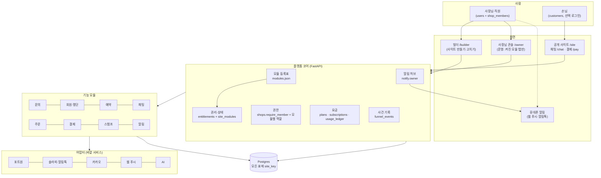
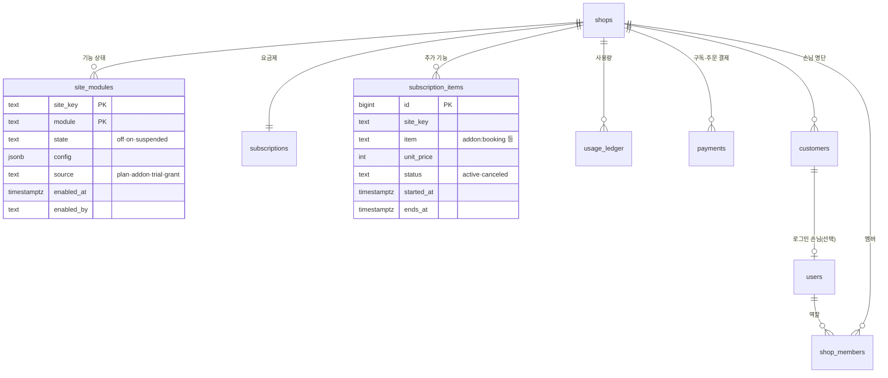
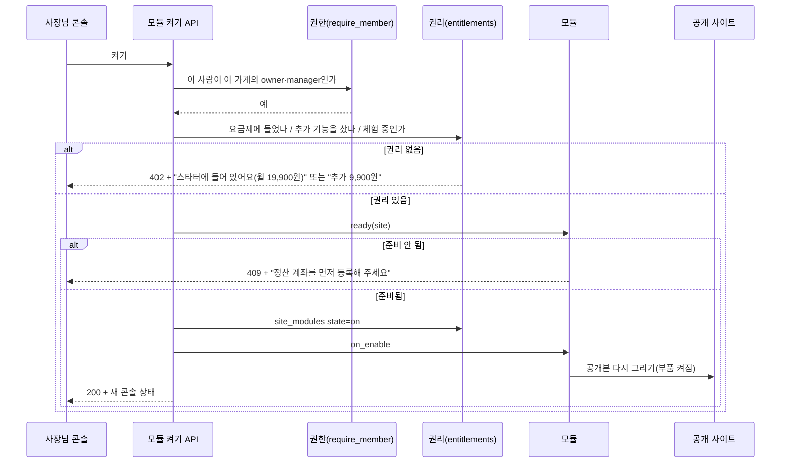
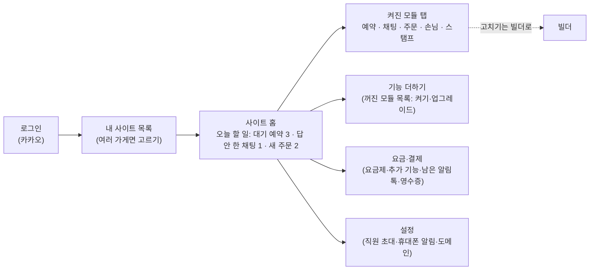
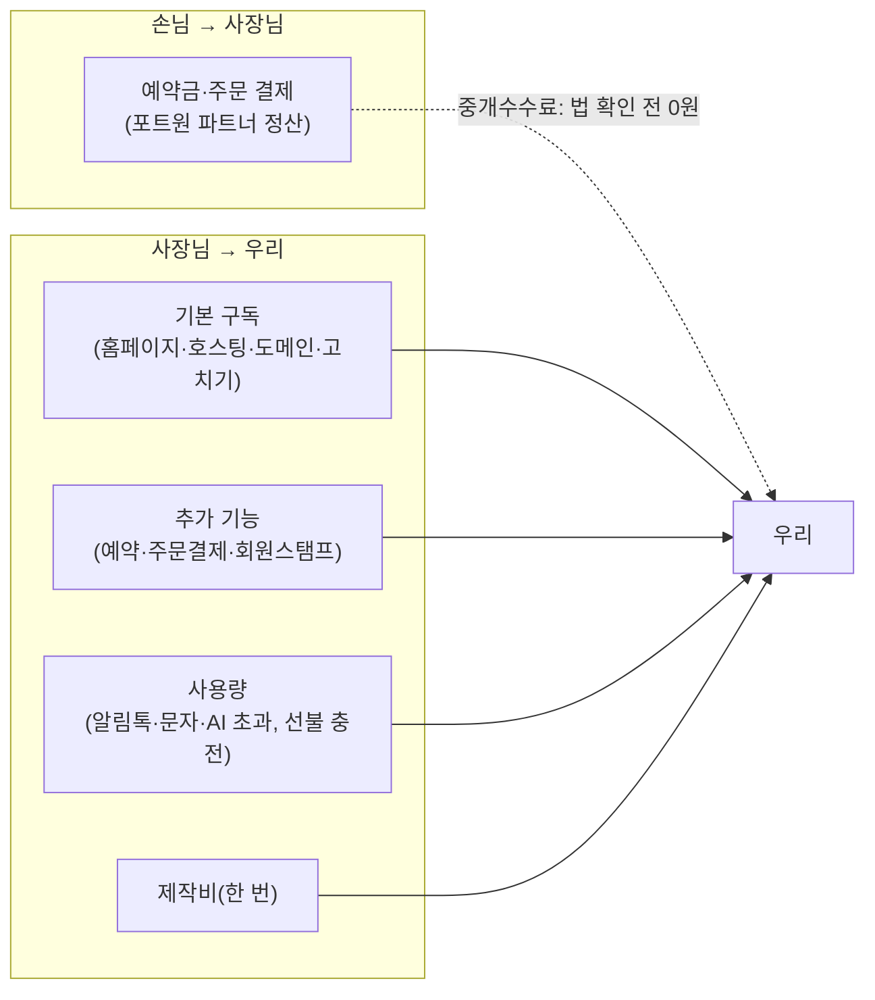

# 사장님 > 사이트 > 기능 통합 관리 + BaaS 연동 수익 아키텍처 (FEATURE_PLATFORM_PLAN)

> 2026-10-03 (KST). 대표 요청: "사장님 > 사이트 > 기능(회원 관리·예약·채팅·결제)을 사이트 전반에서 어떻게 관리할지, 홈페이지는 만들고 BaaS와 연동해 수익을 내려 한다. 무엇을 구현해야 하는지 아키텍처를 짜 봐."
> 설계 Claude. 기존 문서와의 관계: 기능 하나 = 모듈 하나라는 방향은 [MODULE_SCHEMA_PLAN](https://github.com/kyungsikjeung/agt001/pull/37)(내용 유형표, 손님이 **보는** 묶음)과 같다. 이 문서는 그 위층, 즉 **켜고 끄고·권한·돈**을 다룬다. 돈 흐름은 [PAYMENT_PLAN](PAYMENT_PLAN.md), 가격 가설은 [BUSINESS_STRATEGY](BUSINESS_STRATEGY.md) §4, 알림은 [OWNER_NOTIFY_PLAN](OWNER_NOTIFY_PLAN.md).

## 0. 결론

1. **BaaS를 사서 끼우지 않고, 우리 백엔드를 "기능 모듈" 단위로 포장해 판다.** 예약·주문·결제·정산·손님 명단·채팅·스탬프는 이미 우리 Postgres + FastAPI에 있다(§1). 바깥 서비스(포트원·솔라피/알림톡·카카오·웹 푸시·NIM)는 모듈 안의 **어댑터**로 숨긴다. 사장님은 BaaS를 몰라도 된다.
2. 구조는 3층이다: **사장님(계정) → 사이트(가게, `site_key`) → 기능 모듈.** 권한·요금·데이터를 모두 `site_key` 단위로 묶는다(이미 `shops`가 결제 단위).
3. 새로 만들 핵심 4가지: ① **모듈 등록표**(어떤 기능이 있고 무엇이 필요한지) ② **사이트별 기능 상태표** `site_modules`(켜짐·설정·어디서 받은 권리인지) ③ **사장님 콘솔 셸**(사이트 고르기 → 오늘 할 일 → 켜진 모듈 탭만 자동으로) ④ **요금·권리 계산**(요금제 + 추가 기능 + 사용량 장부).
4. 수익은 다섯 줄기: 기본 구독, 추가 기능(애드온), 사용량(알림톡·AI 초과, 선불 충전), 제작비(한 번), 손님 결제 중개수수료(법 확인 전까지 0원).
5. 지금은 기능마다 켜는 곳이 흩어져 있다(설정 표 칸·규칙 표 유무·청사진 구역·하드코딩 탭). 이걸 등록표 하나로 모으는 것이 1단계이고, 돈 받기는 그 뒤다.

## 1. 지금 있는 것 (코드 확인 2026-10-03)

| 기능 | 데이터(표) | 서비스 | 사장님 화면 | 켜고 끄는 곳 |
|---|---|---|---|---|
| 홈페이지·호스팅 | `sessions`, `shops` | `site_render`, `deploy` | 빌더 `/builder` | 공개 여부 |
| 문의 | `inquiries` | `inquiries` | 채팅방 알림 | 항상 켜짐 |
| 손님 명단(회원의 바탕) | `customers`(가게별·전화번호, `user_id` 칸 있음), `phone_verifications` | `customers`, `phone_verify` | — | `shop_settings.phone_verify` |
| 예약 | `bookings`, `booking_closures`, `booking_events`, `bot_specs` | `bookings`, `booking_engine`, `slots`, `availability` | `/owner` 예약·예약 봇·휴무 탭 | 청사진 구역 |
| 손님 채팅 | `guest_chat_threads`·`messages`, `agent_threads` | `guest_chat`, `chat_agent` | `/owner` 채팅 탭 | `shop_settings.guest_chat_on` |
| 온라인 주문 | `orders`, `order_items` | `orders` | `/owner` 주문 탭 | `shop_settings.order_on` |
| 결제·환불·정산 | `payments`, `refunds`, `settlements`, `shop_payout` | `payments`(포트원 V2) | 주문 탭 | 포트원 입점 상태 |
| 스탬프·쿠폰 | `stamp_rules`, `stamp_events`, `coupons` | `stamps`, `barcode` | `/owner` 스탬프 탭 | 규칙 행이 있으면 켜짐 |
| 권한 | `shop_members`(owner·manager·staff) | `shops.require_member` | — | — |
| 요금제 | `subscriptions`(표만 있음) | **없음** | — | — |
| 사용 한도 | `usage_ledger`(design·restyle만) | `usage` | 빌더 남은 횟수 | 코드 상수 `FREE` |

문제:
- **켜는 방법이 기능마다 다르다**: 설정 표 칸(`order_on`·`guest_chat_on`), 규칙 행 유무(스탬프), 청사진 구역(예약), 아예 없음(문의). 새 기능을 넣을 때마다 `owner.html` 탭·빌더 칩(`start._features`)·설정 칸·사이트 버튼을 손으로 다 만든다.
- **요금과 연결이 없다**: 무엇이 무료이고 무엇이 유료인지 코드가 모른다. `subscriptions`는 비어 있다.
- **회원**은 "가게별 전화번호 명단"까지만 있다. 손님 로그인·마이페이지는 주문 확인(`/api/orders/{site}/my`) 일부뿐이다.

## 2. 목표 구조



| 층 | 하는 일 | 원칙 |
|---|---|---|
| 화면 | 빌더는 "만들기", 콘솔은 "운영". 공개 사이트는 손님 | 콘솔 탭·빌더 칩·사이트 버튼은 등록표에서 **그려진다**(하드코딩 금지) |
| 코어 | 등록표·권리·권한·요금·알림·기록 | 모든 모듈이 같은 문(`require_site` → `require_module`)을 지난다 |
| 모듈 | 기능 하나의 데이터·규칙·화면 조각 | 다른 모듈은 함수로만 부른다(표를 직접 만지지 않음) |
| 어댑터 | 바깥 서비스 호출 | 한 서비스 = 한 파일(`payments.py`가 포트원을 혼자 맡는 지금 원칙 그대로) |
| 데이터 | Postgres 하나 | 모든 표에 `site_key`. 가게끼리는 앱에서 막고(지금처럼), 3단계에서 행 보안(RLS)을 더할지 결정 |

## 3. 모듈 계약

### 3.1 등록표 `app/data/modules.json`

```json
{"booking": {
   "label": "예약", "group": "손님 받기",
   "requires": ["customers"],
   "ready": "booking_ready",
   "roles": {"view": ["owner", "manager", "staff"], "edit": ["owner", "manager"]},
   "owner_tab": {"key": "bookings", "label": "예약", "badge": "pending_count"},
   "builder_chip": {"label": "예약", "after_publish": false},
   "site_parts": ["booking-section", "action-bar:book"],
   "meters": ["booking"],
   "settings": {"slot_minutes": "int", "deposit": "money", "phone_verify": "bool"}
 },
 "chat":    {"label": "손님 채팅", "requires": [], "owner_tab": {"key": "chats", "label": "채팅", "badge": "unread"}, "site_parts": ["chat-fab", "contact:chat"], "meters": ["ai_reply"]},
 "order":   {"label": "온라인 주문", "requires": ["payment", "customers"], "ready": "payout_active"},
 "payment": {"label": "결제", "requires": [], "ready": "payout_active", "owner_tab": {"key": "payout", "label": "정산"}},
 "members": {"label": "회원", "requires": ["customers"], "owner_tab": {"key": "members", "label": "손님"}},
 "stamps":  {"label": "스탬프·쿠폰", "requires": ["customers"]},
 "notify":  {"label": "휴대폰 알림", "requires": [], "meters": ["alimtalk", "sms"]}}
```

- `requires`: 먼저 켜져 있어야 하는 모듈. 켤 때 함께 켜고, 끌 때 의존하는 것이 켜져 있으면 막는다.
- `ready`: 켤 준비가 됐는지 보는 함수 이름(예: 결제는 포트원 입점 `shop_payout.status == active`). 준비 안 됐으면 "무엇을 하면 켜져요" 안내를 돌려준다.
- `site_parts`: 공개 사이트에 붙는 부품 id. MODULE_SCHEMA_PLAN의 `components`와 같은 이름을 쓴다.
- `meters`: 사용량 이름. 요금제의 포함량·초과 요금이 이 이름으로 붙는다.

### 3.2 모듈 코드 모양 `app/modules/<key>.py`

```python
class Module(Protocol):
    key: str
    def ready(self, site_key: str) -> tuple[bool, str]: ...      # (준비됨, 안 됐으면 사장님에게 보일 한 줄)
    def on_enable(self, site_key: str, by: str) -> None: ...     # 기본 설정 만들기·공개본 다시 그리기 예약
    def on_disable(self, site_key: str, by: str) -> None: ...    # 데이터는 지우지 않는다. 손님 쪽 부품만 숨김
    def badge(self, site_key: str) -> int: ...                   # 콘솔 탭 숫자(안 읽은 채팅·대기 예약)
    def today(self, site_key: str) -> list[dict]: ...            # 콘솔 홈 "오늘 할 일" 줄
```

처음에는 지금 서비스 파일을 **감싸기만** 한다(예: `modules/chat.py`가 `guest_chat`·`shop_settings`를 부른다). 파일을 옮기지 않는다.

## 4. 데이터 모델 (새 표·바뀌는 표)



| 무엇 | 내용 |
|---|---|
| `site_modules`(신규) | 사이트별 모듈 상태. `state`는 `off`·`on`·`suspended`(돈 문제로 멈춤, 데이터는 그대로). `config`는 등록표 `settings` 모양 |
| `subscription_items`(신규) | 요금제 밖에서 산 추가 기능 한 줄씩. 월 결제 때 `subscriptions.plan` 값 + 이 줄들을 더한다 |
| `subscriptions`(있음) | `plan`(free·starter·pro…), 빌링키, 다음 결제일, 실패 횟수. 이제 실제로 채운다 |
| `usage_ledger`(있음, 넓힘) | `action` 검사 목록에 `alimtalk`·`sms`·`ai_reply`·`booking` 추가. 지급(grant)·사용(use)·충전(topup) 그대로 |
| 요금제 표 | DB가 아니라 코드 상수 `PLANS`(PAYMENT_PLAN §4의 `PLAN_LIMITS`). 버전을 붙여 가격이 바뀌어도 옛 가입자는 옛 값 |
| `shop_settings`(있음) | `order_on`·`guest_chat_on`·`phone_verify`는 `site_modules`로 옮긴다. 한 배포 동안은 **둘 다 쓰고 새 표를 읽고**, 그다음 배포에서 옛 칸을 지운다 |

옮기기(마이그레이션) 첫날 채우기: `order_on=true` → `order on`, `guest_chat_on` → `chat`, 스탬프 규칙 행이 있음 → `stamps on`, 예약 구역이 있는 공개 사이트 → `booking on`, 모든 공개 사이트 → `inquiry on`. 모두 `source = grant`(베타 무료 권리)로 둔다.

## 5. 권리·권한 계산



- `entitlements.check(site_key, module) -> (ok, reason, offer)`: `module in PLANS[plan].modules` 또는 `subscription_items`에 살아 있는 줄 또는 체험 기간이면 ok.
- 모든 사장님 API 앞에 `require_module(site_key, module, need="view"|"edit")` 하나. 등록표 `roles`로 역할을 본다(직원은 예약 보기·채팅 답만, 요금·정산·삭제는 owner만).
- 손님 쪽 API(`/api/bookings/{site}` 등)는 `state == on`일 때만 받는다. 꺼짐·멈춤이면 "지금은 받지 않아요 + 전화 안내"(지금 `guest_chat_on` 꺼짐 처리와 같은 모양).
- **결제 실패·해지**: 7일 유예 → 유료 모듈 `suspended` → 손님 쪽 부품 숨김, 콘솔엔 "결제가 안 돼 멈췄어요" 띠. **데이터는 절대 지우지 않는다**(다시 결제하면 바로 복구).
- 가게끼리 막기: 모듈마다 "다른 가게 사장님 → 403·손님 쿠키로 남의 것 못 봄" 테스트를 등록표에서 **자동 생성**한다.

## 6. 사장님 콘솔 (사장님 > 사이트 > 기능)



| API | 돌려주는 것 |
|---|---|
| `GET /api/owner/sites` | 내 사이트 목록 + 역할 + 요금제 + 오늘 할 일 합계(지금 `/api/owner/shops` 넓힘) |
| `GET /api/owner/sites/{key}/console` | `{site, plan, role, modules:[{key,label,state,source,badge,tab,ready,reason,offer}], today:[…]}` — 콘솔이 이것만 보고 탭을 그린다 |
| `POST /api/owner/sites/{key}/modules/{m}` | `{on: true|false, config?}` → §5 흐름 |
| `GET·PUT /api/owner/sites/{key}/modules/{m}/settings` | 등록표 `settings` 모양으로 검사 |
| `GET /api/owner/sites/{key}/billing` | 요금제·추가 기능·이번 달 사용량·다음 결제일·영수증 |
| `POST /api/owner/sites/{key}/members` | 직원 초대(역할), owner만 |

- 기존 `/api/owner/shops/{key}/…` 경로는 그대로 두고, 새 경로는 같은 서비스를 부른다(한 번에 다 바꾸지 않음).
- `static/owner.html`(정적 HTML, 탭 하드코딩)은 콘솔 응답으로 탭을 그리게 고친다. **React(`frontend/`)로 옮기는 것은 F2 끝에 따로 결정**(빌더와 같은 부품·테스트를 쓸 수 있다는 이점 vs 옮기는 비용).
- 빌더 기능 칩(`app/api/start.py` `_features`)도 등록표의 `builder_chip`으로 그린다. 꺼진 유료 모듈 칩은 누르면 "기능 더하기"로 간다(10/3 J5 안내 창 자리).
- 휴대폰: 콘솔을 홈 화면에 설치(PWA) + 웹 푸시(OWNER_NOTIFY_PLAN). 알림을 누르면 해당 탭으로 바로.

## 7. 회원(손님) 관리

| 단계 | 내용 | 비고 |
|---|---|---|
| 지금 | 가게별 전화번호 명단(`customers`), 예약·주문·문의·스탬프가 번호로 이어짐, 번호 인증(문자) | 손님 가입 없음 |
| M1 손님 탭 | 콘솔 "손님" 탭: 명단·방문 횟수·마지막 방문·스탬프·메모, 검색, 내보내기(CSV, owner만) | 표는 이미 있음 |
| M2 손님 로그인(선택) | 공개 사이트 "내 예약·주문·스탬프" → 카카오 로그인 → `customers.user_id` 연결(같은 번호 인증 1회). 한 손님이 여러 가게를 써도 가게별 명단은 따로 | 로그인 쿠키는 앱 주소(`__Host-`)라 공개 사이트(다른 주소)와 분리된 지금 보안 구조를 지킨다: 로그인은 앱 주소 창에서, 사이트에는 짧은 표만 넘김 |
| M3 회원 혜택 | 회원 가격·쿠폰 자동 발급(스탬프 모듈과 연결) | 수요 확인 뒤 |
| 공통 | 개인정보: 손님 명단은 **사장님이 처리자, 우리는 수탁자**. 방침·위수탁 문구, 탈퇴·삭제 요청 처리, 보관 기간 | 법률 검토(BACKLOG O-2) |

## 8. 외부 BaaS를 쓸지 — 판단

| 안 | 내용 | 좋은 점 | 나쁜 점 | 판단 |
|---|---|---|---|---|
| **A. 우리 백엔드를 모듈로 포장(이 문서)** | 지금 FastAPI + Postgres를 등록표·권리·요금으로 묶는다 | 이미 만든 예약·결제·정산·채팅을 그대로 씀. 한국 결제(포트원)·알림톡·카카오 연결이 이미 있다. 데이터가 한 곳 | 인증·파일·실시간을 우리가 계속 돌봐야 함 | **추천** |
| B. 사이트마다 외부 BaaS 프로젝트(Supabase 등) | 가게마다 백엔드 하나 | 가게끼리 완전히 갈림 | 무료 프로젝트 수 한도·가게 수만큼 관리, 이미 만든 코드 버림, 한국 결제·알림톡은 어차피 직접 | 하지 않음 |
| C. 공용 외부 BaaS 하나로 옮기기 | 인증·DB·실시간을 외부로 | 인증·실시간·저장소를 얻음 | 이미 있는 기능과 겹침, 옮기는 비용, 결제·알림톡은 여전히 직접 | 하지 않음 |
| D. 부분만 외부 | 무거운 부품만 외부 서비스로 | 운영 짐을 덜어냄 | 서비스 하나 늘 때마다 계약·비용 | **필요할 때 부품 단위로**: 사진 저장(오브젝트 스토리지, 디스크가 차면), 실시간(SSE로 모자라면) |

"BaaS 연동으로 수익"의 뜻을 이렇게 정리한다: **우리가 소상공인용 BaaS가 되고, 사장님은 그걸 '기능 켜기'로 산다.** 바깥 BaaS·API는 원가(어댑터)다.

## 9. 수익 구조



가격 표(가설 — BUSINESS_STRATEGY §4 숫자를 "기본 + 추가 기능" 모양으로 다시 묶은 것. 10/17 사장님 인터뷰로 검증):

| | 무료 | 스타터 월 19,900원 | 프로 월 39,900원 |
|---|---|---|---|
| 홈페이지·호스팅·문의·손님 채팅(AI 답 포함량) | ● | ● | ● |
| 웹 푸시 알림 | ● | ● | ● |
| 내 도메인·"제작" 표시 없음 | — | ● | ● |
| 디자인 고치기 | 월 5회 | 월 20회 | 적정 사용 무제한 |
| 예약(+확인 링크) | 추가 9,900원 | ● | ● |
| 온라인 주문·결제 | 추가 9,900원 | 추가 9,900원 | ● |
| 회원·스탬프·쿠폰 | 추가 4,900원 | 추가 4,900원 | ● |
| 알림톡 포함 | — | 월 200건 | 월 1,000건 |
| 초과 알림톡·문자 | 선불 충전에서 차감 | 같음 | 같음 |
| 직원 계정 | 1명 | 3명 | 10명 |

- 요금 결제: 포트원 빌링키 + 결제 예약(PAYMENT_PLAN §4 그대로, 우리 cron 없음). 추가 기능은 다음 결제일까지 일할 계산 **안 함**(처음엔 다음 결제일부터 청구, 그 전까지는 체험으로 켬).
- 사용량은 **선불 충전**(1만 원 단위)으로 받는다: 못 받은 돈이 생기지 않고, 알림톡 원가(건당 약 7~13원)를 먼저 확보한다. 잔액이 0이면 알림톡 대신 웹 푸시만 간다(멈추지 않음).
- 손님 결제 중개수수료는 PAYMENT_PLAN §2.3의 법 확인(PG 등록 대상 여부)을 **문서로 받기 전까지 0원**.

## 10. 구현 목록 (단계별)

| 단계 | 내용 | 파일(신규·수정) | 합격 조건 | 기간(추정) |
|---|---|---|---|---|
| **F1 기반** | 등록표·모듈 감싸기·`site_modules`·첫날 채우기·`entitlements.check`(지금은 모두 grant)·`require_module` | `app/data/modules.json`, `app/services/modules.py`, `app/services/entitlements.py`, `app/modules/*.py`, `alembic/versions/00xx_site_modules.py`, `app/db/models.py` | 기존 테스트 전부 통과(동작 그대로), 옛 설정 칸과 새 표가 같은 값, 의존 모듈 검사, 다른 가게 403 자동 테스트 | 1주 |
| **F2 콘솔** | `/console` API, `owner.html` 탭을 응답으로 그리기, 사이트 홈 "오늘 할 일", 기능 더하기 화면, 빌더 칩·공개 사이트 부품을 등록표로 | `app/api/owner.py`, `static/owner.html`, `app/api/start.py`, `app/services/site_data.py` | 모듈을 끄면 콘솔 탭·빌더 칩·사이트 부품이 같이 사라짐, 360px 한 줄 탭 | 1주 |
| **F3 알림 허브** | OWNER_NOTIFY_PLAN N1~N8 | 그 문서 | 그 문서 §4 | 1주 |
| **F4 요금** | `PLANS`, 구독 결제(빌링키·예약 결제·웹훅으로 다음 달 예약), `subscription_items`, 선불 충전, 유예·멈춤·복구, 영수증 | `app/services/billing.py`(신규), `app/services/payments.py`(웹훅 갈래), `app/services/usage.py`, `/settings` 요금 화면 | 포트원 테스트 결제로 가입→다음 달 예약 등록→실패 3회→7일 뒤 멈춤→결제→복구, 금액은 DB·포트원 조회로만 | 1~2주 |
| **F5 회원** | §7 M1·M2 | `app/services/customers.py`, `app/api/owner.py`, 공개 사이트 "내 정보" | 다른 가게 명단 못 봄, 로그인 손님 = 번호 인증 1회, 탈퇴 시 연결만 끊고 가게 기록은 익명 | 1주 |
| **F6 (선택) 바깥 판매** | 우리가 만들지 않은 홈페이지(아임웹·카페24 등)에도 예약·채팅을 **링크·버튼 코드**로 붙여 파는 길. 사이트 API 키·호출 한도·사용량 계량 | `app/api/public.py`, `keystore` | 키별 한도·사용량 장부 기록 | 수요 확인 뒤 |

순서 이유: F1 없이 돈을 받으면 "무엇을 샀는지"를 코드가 모른다. F3은 F1과 따로 갈 수 있어 병행 가능. F4는 포트원 계약(대표) 뒤에 실제 결제를 켠다(그 전엔 테스트 결제).

## 11. 위험·결정 필요

| # | 무엇 | 추천 |
|---|---|---|
| Q1 | 가격 모양: "요금제 묶음" vs "기본 + 추가 기능" vs 둘 다(위 표) | 둘 다. 추가 기능 합보다 프로가 싸게 보이게 |
| Q2 | 베타 사용자 권리 | 첫날 채우기의 `grant`를 오픈(11/14) 뒤 3개월 유지, 그 뒤 요금제로 |
| Q3 | 콘솔을 React로 옮길지 | F2 끝에 결정(지금 정적 HTML로 F2 먼저) |
| Q4 | 행 보안(RLS) 도입 | 가게 100곳 넘거나 직원 계정이 늘 때. 그 전엔 자동 생성 403 테스트로 막는다 |
| Q5 | 손님 결제 수수료 | 포트원 법 확인 문서 받기 전 0원(PAYMENT_PLAN P2) |
| 위험 | 법: 결제 중개(전자금융거래법), 알림톡은 정보성만, 손님 명단 위수탁 | 각각 포트원 상담·카카오 템플릿 심사·법률 검토(O-2) |
| 위험 | 기능이 늘수록 콘솔이 복잡 | 켜진 모듈만 탭, 오늘 할 일 한 화면, 업종별 기본 켜짐 묶음(OWNER_CONSOLE_PLAN §4 "업종별 모드") |

## 변경 이력

| 날짜 | 내용 |
|---|---|
| 2026-10-03 | 처음 작성(대표 요청: 사장님 > 사이트 > 기능 통합 관리, BaaS 연동 수익, 아키텍처) |
