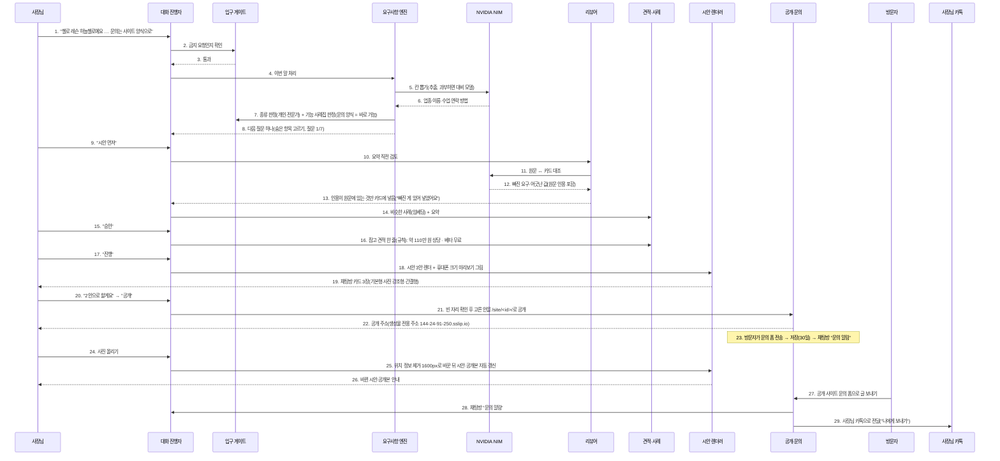
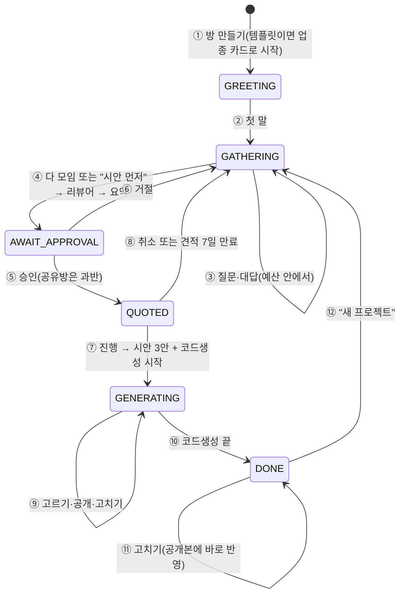

# FLOWDOC: 에이전트 실행 흐름 (기본 요구 9, REQ-FLOW-001)

> 기준: 2026-09-26 운영 코드와 운영 실행(첼로 레슨 사례). 코드가 바뀌면 이 문서를 함께 고친다.
> 에이전트 = 한 가지 일을 맡은 모듈. AI(NVIDIA NIM)를 부르는 곳과 규칙만 쓰는 곳을 구분해 적는다.

## 1. 역할

| 에이전트 | 하는 일 | AI 사용 | 코드 |
|---|---|---|---|
| 대화 진행자 | 상태(GREETING→GATHERING→AWAIT_APPROVAL→QUOTED→GENERATING→DONE)에 따라 다음 담당을 부른다 | 없음(규칙) | `app/services/chat_flow.py` |
| 입구 게이트 | 금지 요청 거절, 문의 종류(가게·개인·단체·웹서비스) 판정, 기능 사례집 판정 | 없음(규칙 + 사례집) | `app/services/intake.py`, `prd_schema.py` |
| 요구사항 엔진 | 한 턴의 말에서 칸을 뽑고, 다음 질문 하나를 고른다 | NIM `chat_json` (추출) | `app/services/prd_engine.py` (`turn`, `extract_detail`) |
| 리뷰어 | 요약 직전 원문과 카드를 대조해 빠진 요구를 채우고, 어긋난 값은 묻는다 | NIM `chat_json` | `prd_engine.review` (D34) |
| 사례 찾기(RAG) | 기능 사례집·프로필에서 가장 비슷한 사례 1개 | NIM 임베딩 | `app/services/rag.py` |
| 견적 | 참고 견적 한 줄(규칙 계산) + 베타 무료 | 없음 | `app/services/quote.py` (`rule_quote`, D25) |
| 시안 렌더러 | 카드 → 시안 3안(부품 + 토큰) + 미리보기 그림 | 없음(정해진 부품) | `design_variants.py`, `site_render.py`, `design.py` |
| 공개 | 고른 시안을 `/site/<id>/`로 연다. 빈 자리가 있으면 먼저 확인 | 없음 | `chat_flow._publish`, `design.publish_choice` |
| 코드생성(Hermes) | 확정 스펙으로 정적 웹 프로젝트 생성(격리 컨테이너, 선택 기능) | Hermes 에이전트 | `app/services/codegen.py` |
| 문의 받기 | 공개 사이트 폼 → 저장(30일) → 채팅방 알림 + 사장님 카톡("나에게 보내기") | 없음 | `app/services/inquiries.py`, `app/services/kakao_talk.py` |
| 사진·영상 | 사진 올리기(위치 정보 제거·1600px) → 시안·공개본 자동 갱신, 영상 링크 → 영상 카드 | 없음(규칙) | `app/services/photos.py`, `app/services/video_links.py` |
| 직접 편집 | `/editor?room=`에서 실제 카드를 불러와 바뀐 칸만 저장, 공개본에 바로 반영(방장만) | 없음(규칙) | `app/api/card.py`, `frontend/src/editor/`, `static/room.html` |
| 음성 | 말 → 글(Parakeet), 답장 → 말(Magpie). 무전기 모드(누르고 말하기·자동 전송·답장 자동 읽기) | NVIDIA 음성 | `stt.py`, `tts.py` |

모든 NIM 호출은 `app/llm.py` 한 곳을 지난다. 주 모델(super)이 과부하면 ultra → lightning 순서로 넘기고, 세 모델이 동시에 실패하면 2초 쉬고 한 바퀴 더 돈다.

## 2. 한 프로젝트의 실행 흐름 (운영 실측: 첼로 레슨)

| 번호 | 담당 | 설명 |
|---|---|---|
| 1 | 사장님 | 첫 메시지. 음성으로 말하면 Parakeet가 글로 바꿔 입력창에 넣는다 |
| 2~3 | 입구 게이트 | 사칭·피싱·도박 등 금지 요청이면 여기서 이유와 함께 거절하고 끝 |
| 4 | 대화 진행자 | GATHERING 상태라 요구사항 엔진에 넘긴다 |
| 5~6 | 요구사항 엔진 + NIM | 정해진 JSON으로 칸을 뽑는다. 사실(전화·시간·가격·주소)은 원문 근거가 있어야 남긴다("오후 세 시" ↔ "15:00"도 인정) |
| 7 | 입구 게이트 | 업종 표현으로 종류를 정하고(모호하면 종류를 한 번 묻는다), 기능 요구는 사례집에서 판정한다 |
| 8 | 요구사항 엔진 | 종류별 질문 예산 안에서 질문 하나를 고른다(선택지 버튼 포함) |
| 9 | 사장님 | "시안 먼저"는 언제든 질문을 끝낸다. 남은 칸은 가정·자리 표시로 채운다 |
| 10~13 | 리뷰어 + NIM | 요약 직전 한 번. 원문 인용이 실제 원문에 없으면 버리고(지어내기 방지), 가정값을 어긋남으로 보는 오탐은 코드로 거른다 |
| 14 | 사례 찾기 | 기능 사례집·프로필 임베딩으로 가장 가까운 사례 1개를 말한다. 없으면 없다고 말한다 |
| 15~16 | 견적 | AI가 금액을 만들지 않는다. 종류·담을 내용·기능 판정으로 계산한 참고값 한 줄 |
| 17~19 | 시안 렌더러 | 업종 기본 조합에서 부품 변형·토큰만 바꾼 3안. 사장님이 말한 사실만 넣는다 |
| 20~22 | 공개 | 빈 자리가 있으면 목록을 보여 주고 "그대로 공개"로 한 번 더 확인(사람 최종 검토) |
| 23 | 문의 받기 | 스팸 숨김 칸·IP당 10분 5건. 알림은 채팅방 + 사장님 카톡("나에게 보내기", 실제 수신 실측 전) |
| 24 | 사장님 | 채팅방 사진 버튼으로 올린다. 사진이 없으면 요약·시안 때 묻는다 |
| 25 | 사진·영상 + 시안 렌더러 | 위치 정보(EXIF)를 지우고 긴 변 1600px JPEG로 바꾼 뒤 대표 사진·사진첩에 자동 배치한다 |
| 26 | 시안 렌더러 | 올린 사진이 시안 3안과 공개본에 바로 반영된다 |
| 27~29 | 문의 받기 + 사장님 카톡 | 방문자가 공개 사이트 문의 폼으로 보내면 저장(30일) 뒤 채팅방에 "문의 알림"이 뜨고 사장님 카톡으로도 전달된다 |

코드생성(Hermes)은 17 "진행" 때 백그라운드로 함께 돌고, 끝나면 결과를 알린다. 공개 사이트는 사장님이 고른 시안을 먼저 쓴다(D31).

## 3. 대화 상태

| 번호 | 설명 |
|---|---|
| ① | 랜딩에서 템플릿을 골랐으면 업종과 구성만 가정으로 채운 카드로 시작(D26) |
| ② | 첫 말부터 요구사항 엔진이 받는다 |
| ③ | 한 번에 질문 하나. 가게 8·개인 7·단체 8·웹서비스 12개가 기본 예산, 확인이 필요한 기능마다 1개 추가(최대 4) |
| ④ | 요약 직전에 리뷰어가 한 번 검토한다 |
| ⑤ | 1:1은 "승인", 공유방은 참여자 과반. 투표가 24시간 안 끝나면 투표만 초기화 |
| ⑥ | 무엇을 고칠지 다시 묻는다 |
| ⑦ | 시안 3안을 먼저 보여 주고 코드생성은 뒤에서 돈다 |
| ⑧ | 견적은 7일 뒤 만료되어 정리 단계로 돌아간다 |
| ⑨ | "N안으로 할게요", "공개", "전화번호는 …"을 제작 중에도 받는다 |
| ⑩ | 코드생성 결과를 알린다. 실패하면 QUOTED로 돌아가 다시 "진행"할 수 있다 |
| ⑪ | 완료 뒤의 말은 고칠 내용으로 받는다(예전에는 아무 말에나 카드가 지워졌다) |
| ⑫ | 새로 시작은 분명히 말할 때만 |

## 4. 실측 기록 (2026-09-26)

| 항목 | 값 |
|---|---|
| 추출 평가 T2(60개) | 1차 77.3% → 고친 뒤 90.2% / 87.1%, 지어낸 값 0건(3차) |
| 리뷰어 1회 | 약 3초(놓친 카톡 문의 요구를 찾음) |
| NIM 과부하 | 주 모델 503 → ultra로 넘겨 2.2초 응답 |
| 음성 | 합성 2.25초, 합성→재인식 왕복에서 문장 거의 같음 |
| 사례집 임베딩 | 51개 한 번에 2.4초 |
