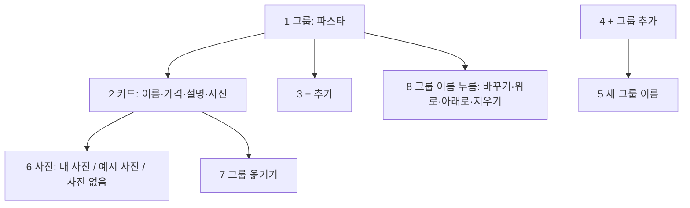

# 계약서: 그룹 + 카드 추가 (GROUP_CARDS_CONTRACT)

> 2026-10-01 (KST) / Claude 작성, 구현, Claude 검토. 계획 [OWNER_FEEDBACK_1001_PLAN](OWNER_FEEDBACK_1001_PLAN.md) §2(#6·#7), 결정 D58: **베타 뒤**. 베타(10/17) 전에는 main에 합치지 않는다(대표가 따로 정하면 예외).
> 재사용: 항목 고치기 `_apply_items`(`app/api/card.py`, 짝값 `price_pairs`·`item_notes`), 분류 `card_data._catalog`(`menu_categories` 칸), 사장님 항목 사진 `card_data.item_photo`(태그 `item:<이름>`), 항목 사진 순서 `site_data._item_image`(사장님 → AI → 태그 사진 → 예시 팩), 보며 고치기 구역 패널 `SectionPanel`.

## 0. 결론

- 항목(메뉴·시술·반·수업)을 **그룹 아래 카드**로 고친다.
  - 그룹 = `menu_categories` 칸 값(순서 그대로).
  - 항목마다 그룹을 `card["item_groups"] = {항목 이름: 그룹 이름}`에 적는다(`price_pairs`와 같은 짝값).
  - 그룹이 안 적힌 항목은 지금처럼 낱말표로 나눈다. 그룹 목록이 있으면 낱말표가 못 넣는 항목은 첫 그룹이다(지금 규칙).
- 카드마다 사진은 셋 중 하나다.
  - **내 사진**: 지금 업로드(태그 `item:<이름>`). 있으면 늘 먼저다.
  - **예시 사진**(기본): AI → 태그 사진 → 예시 팩. 공개본에 "예시 이미지" 표시(D51).
  - **사진 없음**: `card["item_photo_off"] = [항목 이름…]`. 그 항목은 그림 없이 글만 나온다(내 사진이 있어도 숨긴다).
- 편집기는 **보이는 그대로** 시작한다. 처음 열 때 그룹 목록 = 지금 사이트에 보이는 분류 순서, 항목의 그룹 = 지금 보이는 분류다.
- 그룹으로 나누지 않는 모양(카드형·사진 격자·가격표)은 그룹 순서대로 한 줄로 늘어놓는다.
- 범위 밖: 펜션 객실(`rooms`), 말로 그룹 고치기, 그룹마다 사진 따로 올리기, 내 사진을 예시 사진으로 되돌리기.

| 번호 | 단계 | 설명 |
|---|---|---|
| 1 | 그룹 | `menu_categories` 값 하나. 빈 그룹은 공개 사이트에 안 나온다 |
| 2 | 카드 | 항목 하나: 이름(필수)·가격·설명·사진. 지금 항목 줄과 같은 칸 |
| 3 | + 추가 | 그룹 끝. 이름만 넣어도 그 그룹에 들어간다. 나머지는 나중에 |
| 4 | + 그룹 추가 | 목록 끝. 그룹은 10개까지 |
| 5 | 새 그룹 이름 | 1~12자, 같은 이름 안 됨. 목록 끝에 붙는다 |
| 6 | 사진 | 기본은 예시 사진. "사진 올리기"는 지금 업로드. "사진 없음"을 고르면 글만 카드 |
| 7 | 그룹 옮기기 | 카드 안 "그룹" 고르기. 옮긴 그룹의 끝에 붙는다 |
| 8 | 그룹 이름 누름 | 이름 바꾸기(안의 항목이 따라간다), 위로·아래로, 지우기(안의 항목은 첫 그룹으로 간다고 확인) |

## 1. 데이터

| 번호 | 무엇 |
|---|---|
| 1 | `menu_categories` 칸: 그룹 이름 목록(순서). 편집기가 쓰면 `FILLED`, 출처 `editor`(`prd_engine._put`). 이름 1~12자(앞뒤 공백 뺌), 최대 10개, 같은 이름 없음 |
| 2 | `card["item_groups"]`: `{항목 이름: 그룹 이름}`. 그룹이 목록에 없으면 읽을 때 무시한다(낱말표로) |
| 3 | `card["item_photo_off"]`: "사진 없음"을 고른 항목 이름 목록(순서 상관없음, 중복 없음) |
| 4 | 항목 이름 바꾸기·빼기는 `price_pairs`·`item_notes`처럼 `item_groups`·`item_photo_off`도 옮기고 지운다(`_apply_items`) |

## 2. 서버

| 번호 | 무엇 | 파일 |
|---|---|---|
| 1 | `ItemIn`에 `group: Optional[str]`(최대 12자)와 `photo: Optional[Literal["auto", "none"]]`. `group`이 그룹 목록에 없으면 400 "없는 그룹이에요". `add`와 함께 오면 새 항목을 그 그룹에 넣는다. `photo="none"`은 `item_photo_off`에 넣고 `"auto"`는 뺀다 | `app/api/card.py` |
| 2 | `CardIn.groups: Optional[GroupsIn]`, `GroupsIn = {order: list[str], rename: dict[str, str] = {}}`. 순서대로 `menu_categories`를 통째로 쓴다. `rename`은 `item_groups` 값도 바꾼다. `order`에서 빠진 그룹을 가리키던 `item_groups`는 지운다(→ 첫 그룹). `order`가 빈 목록이면 칸을 비우고 `item_groups`를 지운다(→ 낱말표). 이름 규칙(§1-1)을 어기면 400 | 같은 파일 |
| 3 | 한 요청 안에서는 `groups`를 먼저, `items`를 다음에 적용한다(새 그룹에 새 항목을 한 번에 넣을 수 있게). 바뀐 게 없으면 저장·다시 그리기를 안 한다(지금과 같음) | 같은 파일 |
| 4 | `card_data._catalog`: 항목의 그룹 = `item_groups`에 있고 그룹 목록에 있으면 그것, 아니면 지금 규칙. 그룹 순서 = 그룹 목록 순서, 그다음 나머지(낱말표 분류, 처음 나온 순서) | `app/services/card_data.py` |
| 5 | `site_data._item_image`: 이름이 `item_photo_off`에 있으면 `{}`(그림 없음). 분류 대표 사진은 그 분류에서 **사진이 있는 첫 항목**을 쓰고, 모든 항목이 사진 없음이면 대표 사진도 없다(예시 팩도 안 씀). 사진 없음 항목이 하나도 없으면 지금과 같다 | `app/services/site_data.py` |
| 6 | `GET /card/preview`의 `items` 줄마다 `group`(지금 보이는 분류)과 `photo`(`"own"` 내 사진 있음 / `"auto"` / `"none"`)를 더하고, 응답에 `groups`(지금 보이는 분류 이름 순서)를 더한다. 처음 열 때 이것이 사이트와 같아야 한다 | `app/api/card.py` |
| 7 | 그대로 둘 것: 항목 20개 상한, 마지막 항목 빼기 400, `fix-targets`, 말로 고치기·빌더 에이전트(새 항목은 지금처럼 낱말표로 나뉜다) | - |

## 3. 화면 (보며 고치기 항목 패널)

| 번호 | 무엇 | 파일 |
|---|---|---|
| 1 | 항목 패널을 그룹 묶음으로 그린다. 그룹 머리(누르면 메뉴 열림) 아래 카드들, 그룹 끝 "+ 추가", 목록 끝 "+ 그룹 추가". 그룹이 하나도 없으면 지금처럼 한 목록 + "+ 그룹 추가" | `frontend/src/editor/SectionPanel.tsx` |
| 2 | 카드: 이름·가격·설명(지금 칸), "그룹" 고르기(`select`), 사진 줄 = 작은 그림(내 사진·예시 사진) 또는 "사진 없음" 글 + "사진 올리기"(지금 업로드) + "예시 사진"/"사진 없음" 고르기(내 사진이 있으면 "사진 없음"만) | 같은 파일 |
| 3 | 그룹 메뉴: 이름 바꾸기(같은 칸에서 바로), 위로·아래로, 지우기("안의 항목은 첫 그룹으로 가요. 지울까요?" 한 번 더 누름, `window.confirm` 안 씀) | 같은 파일 |
| 4 | 저장 한 번에 `groups`(바뀌었을 때만, 이름 바꾼 것은 `rename`)와 `items` 바뀐 줄(지금 `buildItemOps`에 `group`·`photo` 더함)을 보낸다 | 같은 파일, `frontend/src/editor/cardApi.ts`(타입) |
| 5 | 390px에서 넘침 없음, 누름 칸 44px, 그룹 머리는 제목 단계(`h3`) 안 단추, 사진 고르기는 `role="radiogroup"` | `frontend/src/editor/editor.css` |

## 4. 작업 묶음

| 묶음 | 파일(소유) |
|---|---|
| GC1 서버 | `app/api/card.py`(`ItemIn`·`GroupsIn`·`_apply_items`·`_apply_groups`·미리보기 `items`/`groups`), `app/services/card_data.py`(`_catalog`), `app/services/site_data.py`(`_item_image`·분류 대표), `tests/unit/test_group_cards.py`(신규) |
| GC2 화면 | `frontend/src/editor/SectionPanel.tsx`(항목 패널), `frontend/src/editor/cardApi.ts`, `frontend/src/editor/editor.css`, `frontend/src/editor/SectionPanel.test.tsx` |

- GC2는 GC1의 API 모양(§2-1·2·6)만 알면 된다. 파일이 겹치지 않아 병렬로 할 수 있다.

**하지 말 것**: 객실 묶기, 말로 그룹 고치기, 새 의존성, 사진 파일 지우기, 공개 사이트에 새 스크립트, 그룹마다 사진 올리기.

## 5. 합격 테스트

| 번호 | 테스트 |
|---|---|
| 1 | `groups`: 순서 바꾸기, 이름 바꾸기(항목이 따라감), 지우기(그 항목은 첫 그룹), 빈 목록(낱말표로), 같은 이름·13자·11개·없는 이름 rename → 400 |
| 2 | `items`: 그룹 넣어 추가, 그룹 옮기기, 이름 바꾸기·빼기 때 `item_groups`·`item_photo_off`가 따라감, 없는 그룹 400, 한 요청에 새 그룹 + 그 그룹 새 항목 |
| 3 | `_catalog`: 적은 그룹이 낱말표보다 먼저, 순서는 그룹 목록, 빈 그룹은 안 나옴. 아무것도 안 고친 카드는 지금과 같은 결과 |
| 4 | 사진 없음: 분류형·카드형에서 그 항목 그림 없음, 분류 대표는 다음 항목 사진, 모두 사진 없음이면 대표 없음. 내 사진이 있어도 숨김 |
| 5 | 미리보기 API: 고치기 전 `groups`·항목 `group`이 공개 사이트 분류와 같다. `photo`는 내 사진·사진 없음·기본을 구분 |
| 6 | 화면: 그룹 추가 → 그 그룹에 항목 추가 → 다른 그룹으로 옮기기 → 그룹 이름 바꾸기 → 그룹 지우기 확인 → 저장 본문 |
| 7 | Claude: 390px·노트북 미리보기 캡처(그룹 패널, 공개 사이트 분류형) |

## 변경 이력

| 날짜 | 내용 |
|---|---|
| 2026-10-01 | 처음 작성 (D58: 베타 뒤) |
