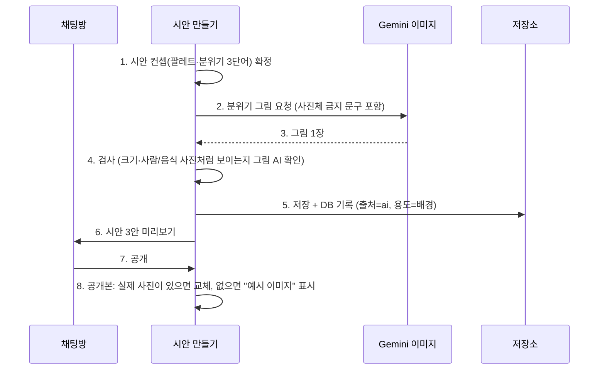

# AI 분위기 그림 (D51) — 계획

> 작성 2026-09-27, Claude. 결정: DECISIONS D51. 상위 원칙: D36(실물 사진은 사장님 사진만).

## 0. 한 줄 요약

시안 3안의 **배경·무늬·추상 일러스트**만 Gemini 이미지로 만든다. 실물처럼 보이는 음식·객실·매장 사진은 만들지 않고, 공개 사이트에서는 실제 사진으로 바꾸거나 **"예시 이미지"** 표시를 붙인다.

## 1. 어디에 쓰나 / 안 쓰나

| 자리 | AI 그림 | 이유 |
|---|---|---|
| 첫 화면 배경(사진이 없을 때) | ✅ 추상 배경·질감(색은 시안 컨셉 팔레트) | 글자 중심 첫 화면이 밋밋한 문제(3안 차이) |
| 섹션 구분 무늬·장식 | ✅ | 분위기 차이 |
| 업종 일러스트(가위·커피잔 같은 선 그림) | ✅ 사진이 아닌 그림체만 | 지금 SVG 예시 그림의 보강 |
| 메뉴·시술·객실 사진 자리 | ❌ | 없는 것을 있는 것처럼 보이게 함(허위 광고 소지) |
| 가게 외관·내부·사람 | ❌ | 실물 오인, 초상 |

## 2. 흐름

| 번호 | 설명 |
|---|---|
| 1 | 이미 있는 디자인 컨셉(design_concept)의 팔레트·분위기 3단어를 그대로 쓴다 |
| 2 | 프롬프트에 "사진이 아닌 추상·평면 그림, 사람·음식·건물·글자 없음"을 항상 넣는다 |
| 3~4 | 받은 그림은 크기를 맞추고, Qwen 그림 채점으로 "실물 사진처럼 보이는지"를 한 번 본다. 걸리면 버리고 기존 SVG 그림 |
| 5 | `attachments`에 `source=ai`, `role=background`로 남긴다(사진 배치 표 계획과 같은 표) |
| 6 | 시안 미리보기에는 그대로 보인다 |
| 7~8 | 공개할 때 실제 사진이 있으면 그 자리를 실제 사진으로, 없으면 그림 모서리에 "예시 이미지" 작은 표시 |

## 3. 비용·한도·장애

- 시안 1번(3안)에 그림 최대 3장. 월 지출 한도를 Google AI Studio에서 먼저 건다.
- 생성은 몇 초~수십 초 → 시안은 먼저 SVG 그림으로 보여 주고, 그림이 오면 교체(기다리게 하지 않음).
- 키 없음·한도 초과·실패 → 지금처럼 SVG 예시 그림. 서비스는 멈추지 않는다.
- 보내는 정보: 업종·분위기 단어·팔레트만. 가게 이름·전화·주소·사진은 보내지 않는다(개인정보처리방침에 전송처 추가).

## 4. 작업 (키 받은 뒤)

| # | 작업 | 담당 |
|---|---|---|
| G-1 | 키 확인: 작은 그림 1장으로 무료 등급 가능 여부·시간·비용 확인 | Claude |
| G-2 | `app/services/imagegen.py`(요청·저장·실패 시 None) + 프롬프트 고정문 + 테스트(가짜 응답) | Claude |
| G-3 | 시안에 배경 그림 연결(사진 없을 때만), 공개본 "예시 이미지" 표시 | Claude + OpenCode(CSS) |
| G-4 | 사이트 품질 평가에 "AI 그림에 예시 표시가 있는지" 점검 추가 | OpenCode |
