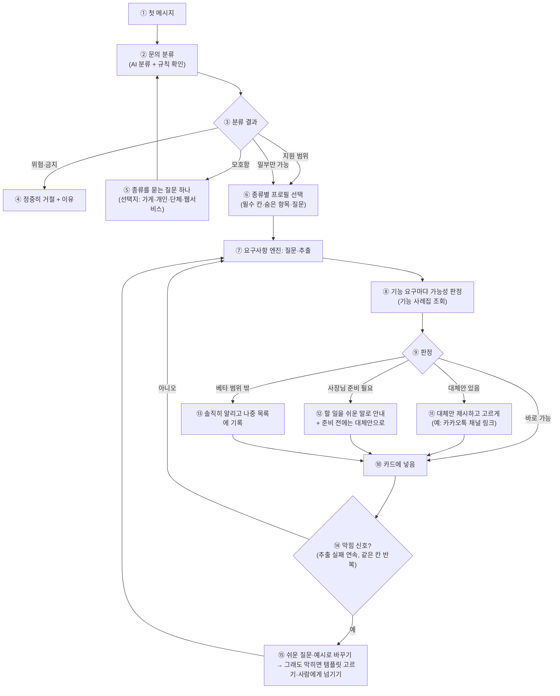
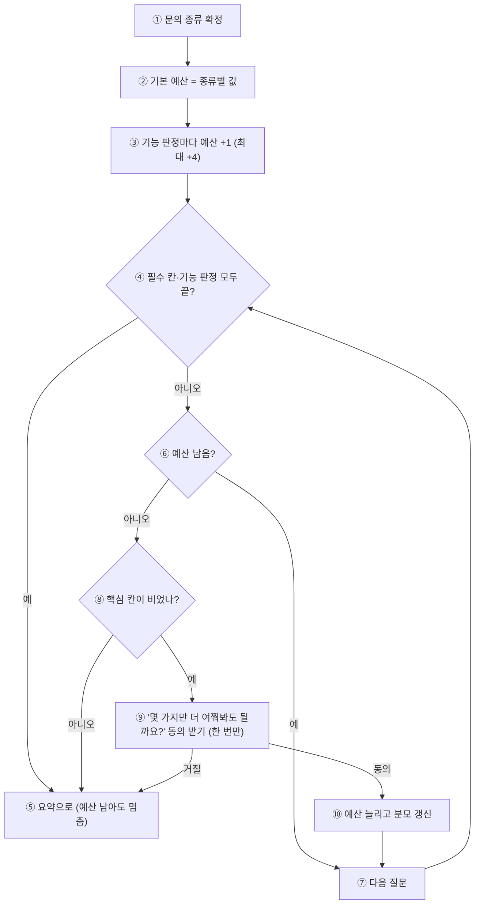

# 문의 분류 게이트와 기능 가능성 판정 — 설계 초안

> 작성일: 2026-09-26 / 상위: [REQUIREMENTS_ENGINE_PLAN.md](REQUIREMENTS_ENGINE_PLAN.md)
> 계기: 실제 입력 "첼로 사이트를 만들고 싶어요. 문의가 제 카카오톡으로 오게 해 주세요"에 엔진이 가게용 질문("주차·배송")을 하고 카카오톡 요구를 버렸다(긴급 수정 231bd7c). 원인은 입구에서 **무슨 문의인지 가르는 게이트가 없고**, 기능 요구를 **만들 수 있는지 판정하는 단계가 없기** 때문이다.

## 1. 지금 없는 것

| # | 빠진 것 | 결과 |
|---|---|---|
| 1 | 문의 종류 분류 | 모든 문의를 "소상공인 가게 사이트"로 가정. 개인·단체·웹앱 문의에 가게 질문을 한다 |
| 2 | 기능 가능성 판정 | "카카오톡으로 문의 받기", "회원가입", "결제" 같은 요구를 만들 수 있는지, 어떤 조건인지 말해 주지 못한다 |
| 3 | 막힐 때의 대처 | 추출이 계속 실패하거나 대화가 겉돌 때 같은 질문만 반복한다 |
| 4 | 범위 밖·위험 요청 | 사칭·피싱·불법 영업을 걸러내지 않는다(약관 초안에는 금지되어 있음) |

## 2. 전체 흐름

| 번호 | 설명 |
|---|---|
| ① | 사장님(또는 문의자)의 첫 메시지 |
| ② | AI가 문의 종류를 분류하고(정해진 형식), 규칙이 한 번 더 확인한다(금지어·범위 밖 기능) |
| ③ | 분류 결과에 따라 갈린다 |
| ④ | 사칭·피싱·불법 영업 등은 이유를 밝히고 정중히 거절한다 |
| ⑤ | 종류가 모호하면 종류를 묻는 질문 하나만 한다 |
| ⑥ | 종류별 프로필(필수 칸, 숨은 항목, 질문 문구)을 고른다. 고정 6업종 표는 프로필의 한 종류가 된다 |
| ⑦ | 기존 요구사항 엔진이 질문하고 칸을 채운다 |
| ⑧ | "필요한 기능" 칸에 들어온 요구마다 기능 사례집에서 가능성과 방법을 찾는다 |
| ⑨ | 판정은 네 가지다 |
| ⑩ | 카드에 넣는다(판정·방법 포함) |
| ⑪ | 그대로는 안 되지만 대체안이 있으면 보여주고 고르게 한다 |
| ⑫ | 사장님이 준비할 것(예: 카카오톡 채널 개설)이 있으면 쉬운 말로 안내하고, 준비 전에는 대체안으로 만든다 |
| ⑬ | 베타에서 못 하는 것은 솔직히 알리고 "나중에 할 일"에 남긴다 |
| ⑭ | 추출이 연속 실패하거나 같은 칸을 계속 묻게 되면 막힘으로 본다 |
| ⑮ | 질문을 쉽게 바꾸고(예시·선택지), 그래도 막히면 템플릿 고르기나 사람 상담으로 넘긴다 |

## 3. 문의 종류 (초안)

| 종류 | 예 | 지원 | 프로필 |
|---|---|---|---|
| 가게·매장 | 펜션, 카페, 식당, 미용실, 공방, 학원 | 핵심 | 기존 6업종 표 |
| 개인·전문가 | 첼로 레슨, 연주자, 강사, 사진작가, 프리랜서 | 지원 | 새 프로필: 소개, 경력·작품, 레슨·서비스, 일정, 문의 |
| 단체·모임 | 동호회, 교회, 동네 행사, 비영리 단체 | 지원 | 새 프로필: 소개, 활동, 일정·공지, 가입·문의 |
| 기능 중심 웹서비스 | 회원가입·결제·예약 관리가 있는 쇼핑몰·앱 | 일부 | 소개 사이트는 만들고, 기능은 사례집 판정 |
| 범위 밖·위험 | 사칭, 피싱, 도박·불법 영업, 성인 | 거절 | — |
| 모호함 | "사이트 하나 만들어 주세요" | 되묻기 | — |

## 4. 기능 사례집 (RAG의 첫 자료)

사장님 요구를 기능 단위로 모아 두고, 요구가 들어오면 가장 가까운 항목을 찾아 판정·방법·질문을 가져온다. 확정 사실은 여기서가 아니라 카드에서 읽는다(REQUIREMENTS_RAG_REVIEW.md 원칙).

| 칸 | 내용 |
|---|---|
| 이름·별칭 | "카카오톡으로 문의 받기", "톡으로 연락", "문의 알림" |
| 판정 | 바로 가능 / 대체안 / 사장님 준비 필요 / 베타 범위 밖 |
| 우리가 하는 방법 | 예: 카카오톡 채널 1:1 채팅 링크 버튼 |
| 사장님 할 일 | 예: 카카오톡 채널 만들기(무료, 약 5분), 채널 주소 알려주기 |
| 대체안 | 예: 전화 버튼, 문자 버튼 |
| 추가 질문 | 예: "카카오톡 채널이 있나요?" (있어요 / 없어요, 만드는 법 알려주세요 / 전화로 받을게요) |
| 키·계정 필요 | 예: 카카오 개발자 키 불필요(링크 방식) |
| 비용·약관 | 예: 알림톡은 건당 과금·템플릿 심사 |

**예: "문의가 제 카카오톡으로 오게"**

| 방법 | 판정 | 조건 |
|---|---|---|
| 카카오톡 채널 1:1 채팅 버튼 | 사장님 준비 필요(무료) | 사장님이 카카오톡 채널을 만들고 주소를 알려주면 된다. 키 불필요 |
| 사이트 문의 양식 → 사장님 카카오톡 "나에게 보내기" | 베타 범위 밖(검토) | 우리 카카오 앱으로 사장님이 한 번 로그인·동의하면 가능. 다만 문의 양식 저장은 베타 제외 결정(USER_DB_PLAN UQ-4)과 부딪힌다 |
| 카카오 알림톡 | 베타 범위 밖 | 비즈니스 채널·발송 대행사·템플릿 심사·건당 과금(D6 보류) |

## 5. 막힘 처리 규칙 (초안)

| 신호 | 처리 |
|---|---|
| 추출 결과가 2턴 연속 비어 있음 | 같은 칸을 예시와 선택지로 다시 묻는다 |
| 같은 칸을 3번 물었는데 못 채움 | 그 칸은 가정(사실 칸은 자리 표시)으로 두고 넘어간다 |
| 잡담·무관한 말 2턴 | "사이트 이야기로 돌아갈까요?" + 지금 칸 질문 |
| 사장님이 헷갈림 표현("무슨 말이에요", "모르겠어요") | 질문을 더 쉬운 말로, 예시 2개와 함께 |
| 위 처리 후에도 막힘 | 템플릿 6개 중 고르기 제안, 또는 사람 상담 요청 |

## 6. 질문 예산 — 몇 개까지 물을지 판단하는 규칙

D20의 "최대 8질문"은 가게 사이트 기준이다. 문의 종류와 복잡도에 따라 예산을 다르게 잡고, **예산보다 정보 충족을 우선**한다.

| 요소 | 규칙 (초안) |
|---|---|
| 기본 예산 | 가게 8, 개인·전문가 7, 단체·모임 8, 기능 중심 웹서비스 12 |
| 기능 추가분 | "사장님 준비 필요"·"대체안" 판정 기능마다 +1 (확인 질문용), 최대 +4 |
| 멈추는 조건 | (a) 필수 칸이 모두 찼고 기능 판정이 끝났다 → 예산이 남아도 멈춘다. (b) 예산 소진 → 남은 칸은 가정·자리 표시로 두고 요약. (c) 사장님이 "시안 먼저" → 언제든 멈춘다 |
| 늘리는 조건 | 예산이 끝났는데 **필수 칸 중 사실이 아닌 핵심 칸**(업종·목적·담을 내용)이 비어 있으면, 한 번만 "몇 가지만 더 여쭤봐도 될까요? (최대 N개)"로 **동의를 받고** 늘린다 |
| 진행 표시 | "질문 3/8"처럼 분모에 현재 예산을 보여준다. 예산이 늘면 분모도 바뀌었음을 알린다 |
| 한 번에 묻기 | 서로 관계있는 사실(체크인·체크아웃, 영업 요일·시간)은 한 질문으로 묶어 예산을 아낀다 |

| 번호 | 설명 |
|---|---|
| ① | 입구 게이트가 문의 종류를 정한다 |
| ② | 종류별 기본 예산을 잡는다 |
| ③ | 확인이 필요한 기능이 있으면 그만큼 늘린다(최대 4개) |
| ④ | 필요한 정보가 다 모였는지 본다 |
| ⑤ | 다 모였으면 예산이 남아도 멈추고 요약한다 |
| ⑥ | 아직이면 예산이 남았는지 본다 |
| ⑦ | 다음 질문을 한다 |
| ⑧ | 예산이 끝났는데 업종·목적·담을 내용 같은 핵심 칸이 비었는지 본다 |
| ⑨ | 비었으면 한 번만, 몇 개를 더 물을지 밝히고 동의를 받는다 |
| ⑩ | 동의하면 예산과 진행 표시를 늘린다 |

## 7. 결정이 필요한 것

| # | 질문 | 추천 |
|---|---|---|
| G1 | 가게가 아닌 문의(개인·단체·웹서비스)를 받을지, 어디까지 | 개인·단체는 받는다(프로필 추가). 웹서비스는 소개 사이트만 만들고 기능은 판정대로 |
| G2 | 분류를 AI에 맡길지, 규칙으로 할지 | AI 분류(정해진 형식) + 규칙 확인(금지어·범위 밖 기능) |
| G3 | 베타 범위 밖 기능을 요청받았을 때 | 솔직히 알리고 대체안으로 만든 뒤 "나중 할 일"에 기록 |
| G4 | 사람에게 넘기는 창구 | 개발자 결정 요청 시스템(텔레그램)으로 운영자에게 알림 |
| G5 | 문의 양식(사이트 방문자가 사장님께 보내는 글)을 베타에 넣을지 | UQ-4(베타 제외)를 다시 볼지 결정 필요. 카카오톡 문의 요구가 실제로 나왔다 |
| G6 | 질문 예산 규칙(§6) — 종류별 기본값, 늘리는 조건 | §6 초안대로. D20(8질문)은 가게 기본값으로 유지 |
