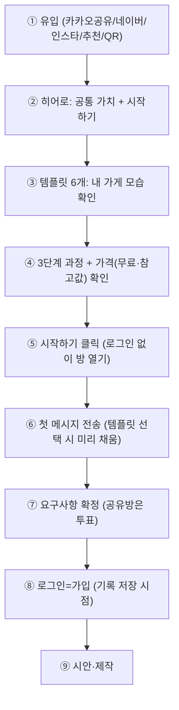
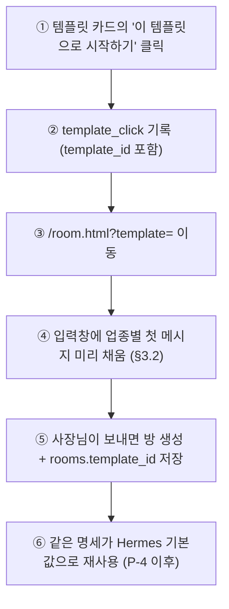

# 랜딩 페이지 기획 (WP 1-0c)

> **상태 (2026-09-25):** 사용자 지시로 랜딩은 입력창 중심의 단순형으로 만들었다(frontend/src/Landing.tsx). 이 문서의 섹션 구성(§2)은 채택하지 않았고, §3 템플릿 명세 초안·구글 테스트 모드 안내 문구·§5 추가 이벤트만 사용한다.
> 소유: 기획자(agt001) / 요청: PM / 목표: **유입과 전환** (방문 → "시작하기" → 첫 대화 → 가입)
> 기준 문서: `static/landing.html`(초안), `PRODUCT_ROADMAP.md` 1단계, `ROOM_POLICY.md`, `OAUTH_SETUP.md`, `DESIGN_PIPELINE_PLAN.md`, `DECISIONS.md`(D12·D13·D14·D15·D16·D9 — 본 기획은 확정 결정을 따르고 다른 안을 내지 않음)
> 제약: 코드·HTML 수정 금지(기획 문서만), 인프라 OCI 무료 티어 + 기존 PostgreSQL 1개, 신규 유료는 월 합계 $5 이하(본 기획: **0원**), 실제 업체명·실존 인물·가짜 후기를 진짜처럼 쓰지 않음(후기·사례는 "예시" 자리표시자)

---

## 1. 타깃과 유입 경로

### 1.1 타깃 정의 (D12: 업종 구분 없이)

| 항목 | 내용 |
|---|---|
| 누구 | 펜션·카페·식당·미용실·공방·학원 등 소규모 사업자. 개발 지식 없음, 휴대폰이 주 기기, 바쁨(짬 날 때 5~10분), IT 부담(설정·가입 싫어함), 가격 민감 |
| 공통 욕구 | "우리 가게 사이트가 있었으면" + "맡길 돈·시간·지식이 없음" |
| 첫 화면 메시지 | 공통 가치 한 문장. 업종 차이는 템플릿(§3)으로만 보여줌 (D12) |
| 전환 설계 원칙 | ① 읽기보다 누르기(스크롤 1~2화면 안에 시작 버튼 2회 노출) ② 가입 장벽 제거(로그인 없이 시작, D14) ③ 가격 불안 제거(베타 무료 + 견적은 참고값, D13) ④ "내 가게도 되겠구나" 확신(템플릿 6개, D15) |

### 1.2 유입 경로별 첫 화면 대응

| 경로 | 유입 형태·심리 | 첫 화면에서 보여줄 것 | 기술 메모 (0원) |
|---|---|---|---|
| 카카오톡 공유 | 지인·가족이 보낸 링크. 신뢰는 높고 주의는 짧음. 모바일 95%+ | 히어로 그대로 + 공유받은 사람이 바로 이어쓰는 흐름 안내("링크 하나로 함께 정하기" 섹션 노출 유지) | `?source=kakao&campaign=share` 쿼터 유지 → `funnel_events.source/campaign`에 기록. 카카오 미리보기(OG) 대응(§6) |
| 네이버 검색·플레이스 | "펜션 홈페이지 만들기" 같은 문제 검색. 비교 중, 가격·방법이 궁금 | 히어로 + 가격·견적 안내(베타 무료·참고값 문구)가 첫 2화면 안에 보이게 | `title·description`에 "소상공인 웹사이트 만들기" 포함, 네이버 서치어드바이저 등록(§6). `source=naver` |
| 인스타그램 | 사진·분위기 중심. 예쁜 결과물에 반응 | 템플릿·예시 갤러리를 히어로 바로 아래 배치(모바일 2열 썸네일) | OG 이미지 1200×630 1종. `source=instagram` |
| 지인 추천·입소문 | "누가 했다더라" — 신뢰 확인이 목적 | "만드는 과정 3단계" + "확인한 그대로 만든다" 보장 문구 우선 | 추천인 코드 없음(1단계 범위 밖). `source=referral` |
| 오프라인 QR (매장·명함·전단) | 사장님 본인이 휴대폰으로 찍음. 즉시 시작 의향 높음 | 히어로의 "지금 시작하기" 버튼을 화면 최상단 고정(스티키 CTA, 모바일) | QR 목적지는 랜딩(`/landing.html`) 단일. 방 바로 열기(`/room.html`) QR은 매장용으로 P1에 별도 검토(방 폭주·스팸 고려) |

경로별 랜딩 분기(페이지 A/B)가 아니라 **단일 페이지 + 쿼리 기록**으로 대응한다. 이유: 베타 방문 규모에서 분기는 관리 비용만 들고, D16 자체 퍼널로 경로별 전환율을 볼 수 있기 때문.

### 1.3 유입 → 전환 흐름도

| 번호 | 설명 |
|---|---|
| ① | 모든 유입은 단일 랜딩으로. `source/campaign` 쿼리만 `funnel_events`에 남김 |
| ② | D12 공통 가치. "말하면 웹사이트가 됩니다" + 로그인 불필요 안내 |
| ③ | D15 템플릿 6개. "내 가게는 이렇게 되겠구나" 확신 형성 |
| ④ | 3단계 과정 + D13(베타 무료·AI 견적은 참고값)으로 가격 불안 제거 |
| ⑤ | `start_click` 이벤트. 로그인 없이 `/room.html`로 이동 |
| ⑥ | 서버 `request_submitted`. 템플릿 시작 시 첫 메시지 자동 입력(§3) |
| ⑦ | 서버 `requirement_approved`. 공유방은 과반 투표(ROOM_POLICY §2) |
| ⑧ | 서버 `signup`. 게스트 방이 계정으로 귀속(ROADMAP 1단계) |
| ⑨ | `generate_start/done`, 이후 P-4 시안 이벤트는 §5 참고 |

---

## 2. 랜딩 구성요소 목록

> 범례: P0 = 출시 필수 / P1 = 출시 직후 / P2 = 이후. "현재 초안" 열은 `static/landing.html` 기준.

| # | 섹션 | 목적 | 들어갈 내용 (한국어 카피 초안) | 전환에 미치는 이유 | 우선순위 | 현재 초안 |
|---|---|---|---|---|---|---|
| S1 | 헤더 + 스티키 CTA | 어디서든 시작 가능 | 브랜드 "agt001 · 말하면 웹사이트가 됩니다" + 버튼 "지금 시작하기" | 바쁜 사장님은 끝까지 안 읽음. CTA가 항상 손에 닿아야 함 | **P0** | 있음(유지) |
| S2 | 히어로 (공통 가치) | 5초 안에 "나를 위한 것" 인지 | H1: "말로 설명하고 사진만 올리면, 확인한 그대로 웹사이트가 공개됩니다" / 서브: "채팅과 음성, 사진으로 설명하면 AI가 요구사항을 정리합니다. 확정하기 전에는 만들지 않습니다." / 버튼 3개: "지금 시작하기(로그인 없이)"·"카카오로 시작"·"Google로 시작" / 안내: "로그인 없이도 바로 시작할 수 있습니다. 기록을 저장하고 싶을 때 로그인하면 됩니다." + 구글 테스트 모드 안내(아래 S2-1) | D12 공통 가치. 로그인 장벽 제거 문구가 시작 클릭율을 직접 올림 | **P0** | 있음(유지, 구글 안내 문구만 추가) |
| S2-1 | 구글 테스트 모드 안내 (D9) | 초대받지 않은 사용자의 이탈·오류 방지 | 구글 버튼 근처 작은 글씨: "Google 로그인은 현재 초대된 분만 가능해요. 처음이시면 카카오 또는 로그인 없이 시작해 주세요." / 거부 시 랜딩 복귀 토스트: "구글 로그인은 현재 초대된 분만 가능해요. 카카오로 시작해 주세요." | 오류 화면 대신 안내로 전환 기회 보존 (D9) | **P0** | 없음(추가) |
| S3 | 대화 예시 | 사용법의 이해(읽지 않고 봄) | 사장님(예시): "바닷가 근처 작은 펜션이에요. 객실 세 개랑 바비큐 자리 소개하고 싶어요. 사진도 있어요." / AI: "정리해 보았습니다. 객실 안내, 요금과 예약 문의, 오시는 길을 넣으면 될까요? 맞으면 확인을 눌러주세요." | IT 부담 해소. "나도 저렇게 말하면 되겠네" 형성 | **P0** | 있음(유지) |
| S4 | 템플릿 6개 ("내 가게 모습") | "우리 가게도 되겠구나" 확신 | §3의 6종(펜션·카페·식당·미용실·공방·학원). 각 카드: "예시" 표시 + 한 줄 설명 + "이 템플릿으로 시작하기" 버튼 | 업종 차이를 보여주는 유일한 장치(D12·D15). 템플릿 클릭→시작이 최단 전환 경로 | **P0** | 자리표시자 3개 → 6개로 교체(문구·버튼은 기획, 제작은 별도 WP) |
| S5 | 만드는 과정 3단계 | 막연한 불안 제거 | 1 "말하기·사진 올리기 — 휴대폰에서 바로 할 수 있습니다" / 2 "요구사항 확인 — 정리된 내용이 맞는지 직접 확인합니다. 확정하기 전에는 코드를 만들지 않습니다" / 3 "사이트 완성·공개 — 확정한 내용으로 만들어 공개 주소로 보여줍니다. 이후에도 대화로 고칠 수 있습니다" | "어렵지 않다 + 내 동의 없이 안 만든다"가 핵심 신뢰 | **P0** | 있음(유지) |
| S6 | 가격·견적 안내 (D13) | 가격 민감 해소 | "베타 기간에는 무료로 만들 수 있습니다." / "AI가 알려주는 금액은 외주를 맡긴다면 이 정도라는 참고값입니다. 결제는 없습니다." | 가격 불확실이 이탈 1순위. 결제 없음을 명시해야 시작함 | **P0** | 없음(**추가**, P0) |
| S7 | 함께 쓰기 (공유방·투표) | 가족·직원 동원(결정자 확장) | "혼자 시작해도 됩니다. 나중에 링크를 공유하면 같은 방에서 이어서 정리할 수 있어요." / "가족이나 직원과 함께 이야기하고, 정리된 내용이 맞는지 투표로 확정합니다." | 사장님 혼자 못 정하는 경우가 많음. 초대=유입 증폭 | **P0** | 있음(유지) |
| S8 | 하단 시작 박스 | 마지막 밀어주기 | "지금 바로 만들어 보세요. 공유방이 바로 열립니다. 로그인은 나중에 해도 됩니다." + 시작 버튼 3종 반복 | 스크롤 끝까지 온 사람의 전환 회수 | **P0** | 있음(유지) |
| S9 | 푸터 (개인정보처리방침 링크) | 법적 요건 (D14) | "공유방 열기 · 개인정보처리방침 · © 2026 agt001" | 로그인(가입)이 있어 방침 페이지 필수. 구글 브랜드 검수 요건(OAUTH_SETUP §2.3) | **P0** | 방침 링크 없음(**추가**, 페이지는 별도 WP) |
| S10 | 자주 묻는 질문(FAQ) | 반복 문의 선제 해소 | Q1 "정말 무료인가요?" → "베타 기간에는 무료입니다. ..." / Q2 "사진이 없어도 되나요?" → "있으면 좋고, 없어도 말로 시작할 수 있습니다." / Q3 "잘못 만들면 어떻게 되나요?" → "확정하기 전에는 만들지 않고, 만든 뒤에도 대화로 고칠 수 있습니다." / Q4 "컴퓨터가 없어도 되나요?" → "휴대폰으로 다 됩니다." / Q5 "우리 가게 정보는 어떻게 되나요?" → "방이 삭제되기 전까지 보관되며, 대화 내용은 광고에 쓰지 않습니다." (상세 보관 정책은 ROOM_POLICY·방침 페이지에) | 스크롤 깊은 사용자의 마지막 불안 해소. 검색 유입(롱테일)에도 유리 | **P1** | 없음 |
| S11 | 결과물 갤러리 (실제 생성 사이트 중 공개 동의분) | 사회적 증거 | 초기에는 S4 템플릿(예시 사이트)으로 겸함. 실제 사장님 공개 동의분이 생기면 별도 "사장님들이 공개한 사이트" 코너로 분리, 각 항목에 "사장님 공개 동의" 표시 | 베타 초기에는 모을 수 없음 → P1. 가짜 후기 금지 원칙과 정합 | **P1** | — (S4로 겸함) |
| S12 | 후기·신뢰 요소 | 신뢰 보강 | 베타 초기에는 **후기 코너를 두지 않음**. 대신 "보장 문구"로 대체: "확정하기 전에는 만들지 않습니다. 비밀번호를 저장하지 않습니다." / 실제 이용자 문구가 생기면 "예시"가 아닌 실명·상호 동의 기반으로만 게재 (P2) | 가짜 후기 금지. 없는 신뢰를 꾸미면 역효과 | **P2** (보장 문구는 P0에 포함) | trust-line 있음(유지) |
| — | 사전 신청·문의 양식 (PM 요청 예시) | — | **두지 않는다 (D14)**. 연락처를 받지 않고 로그인이 곧 가입 | D14 확정. 대신 시작하기·로그인 버튼이 가입 경로 | 제외 | — |
| — | 카카오톡 채널 상담 (PM 요청 예시) | — | **두지 않는다 (1단계 범위 밖)**. D6 알림톡 보류, tribal 상담 채널은 운영 비용 발생. 문의는 채팅방(방 자체가 상담 창구)으로 흡수 | 상담=방에서 해결. 채널 개설·응대 인력 없이 시작 | 제외 | — |

> 소상공인 특성 반영 체크: 바쁨 → 스티키 CTA·짧은 문장 / 휴대폰 → 48px 버튼·1열 우선 / IT 부담 → 대화 예시·로그인 불필요 / 가격 민감 → S6 무료·참고값 명시.

---

## 3. 템플릿 (D15: 엔진 예시 사이트 6개 + 정적 카탈로그)

> 전제: 템플릿은 `DESIGN_PIPELINE_PLAN.md` §5 "디자인 명세"의 **미리 채운 값**(`tokens`, `sections[type,variant,content]`)이다. `type`·`variant`는 §6 섹션 부품 목록 안에서만 고른다. 가상 가게는 전부 "예시"로 표시한다. "이 템플릿으로 시작하기"는 해당 명세를 불러오는 것과 같고, 채팅방에는 아래 "첫 메시지(미리 채움)"가 입력창에 들어가 요구사항 수집을 빨리 시작한다. Hermes 기본값으로도 같은 명세를 쓴다.

### 3.1 공통 규칙

| 항목 | 규칙 |
|---|---|
| 개수·업종 | 6개 고정: 펜션·카페·식당·미용실·공방·학원 (D15) |
| 표시 | 카드마다 "예시" 태그. 상호명은 가상("예시: ○○") |
| 사진 | 예시 사이트 렌더용 자리 이미지. 사장님에게는 "필요한 사진·정보"를 각 카드에 3~4개로 안내 |
| 시작 동작 | 버튼 클릭 → `/room.html?template=<id>` 이동 → 입력창에 첫 메시지 미리 채움 + `template_click` 기록. 방 생성 시 `rooms.template_id` 저장(DECISIONS 판정표) |
| 토큰 선택지 | `font_pair` 6종·`density` 3단계 등 정해진 선택지 안에서만(파이프라인 §5). 아래 값은 초안이며 P-3에서 확정 |

### 3.2 템플릿 6종

#### T1. 펜션 (`pension`)

| 항목 | 내용 |
|---|---|
| 사이트 섹션 구성 | 첫 화면(사진 위 문구) → 소개(짧은 글) → 객실(사진 격자) → 사진첩(격자) → 주변·오시는 길(지도 링크+목록) → 영업시간·연락(전화 먼저) → 예약·문의(전화·문자·외부 예약 링크). 후기는 자리만 |
| 필요한 사진·정보 | 객실 사진 3장 이상 / 바비큐·외부 자리 사진 / 요금(성수기·비수기) / 예약 문의 전화번호 / 주소·오시는 길 |
| 샘플 문구 | "예시: 바닷가 근처 작은 펜션. 객실 세 개와 바비큐 자리를 소개합니다." |
| 첫 메시지(미리 채움) | "펜션 소개 사이트를 만들고 싶어요. 객실이 3개 있고 바비큐 자리가 있어요. 요금과 예약 문의, 오시는 길을 넣고 싶어요. 사진은 곧 올릴게요." |
| 디자인 명세 초안 | `tokens: {palette: {primary: #2F5D50, accent: #E9B872, ground: #FAF7F2, ink: #1F2622}, font_pair: serif-warm, density: comfortable, radius: soft, image_style: full-bleed}` / `sections: [{id: hero, type: hero, variant: photo-overlay, content: {title: "(예시) 바닷가 근처 작은 펜션", subtitle: "객실 세 개·바비큐 자리", image: "asset:cover"}}, {id: rooms, type: rooms, variant: photo-grid, content: {items: ["객실 안내", "요금", "바비큐 자리"]}}, {id: around, type: around, variant: map-list, content: {items: ["오시는 길", "주변 안내"]}}, {id: contact, type: contact, variant: call-first, content: {phone: "(예시)", hours: "(예시)", address: "(예시)"}}]` |

#### T2. 카페 (`cafe`)

| 항목 | 내용 |
|---|---|
| 사이트 섹션 구성 | 첫 화면(사진 옆 문구) → 소개(사장님 인사) → 메뉴(목록+가격) → 사진첩(가로 넘기기) → 오시는 길 → 영업시간·연락(카카오톡 채널형) |
| 필요한 사진·정보 | 대표 메뉴 사진 3장 / 매장 전경·내부 사진 / 메뉴·가격 / 영업시간·휴무일 / 지도·문의 방법 |
| 샘플 문구 | "예시: 동네 카페. 대표 메뉴와 영업시간을 알립니다." |
| 첫 메시지(미리 채움) | "카페 소개 사이트를 만들고 싶어요. 대표 메뉴 3개와 영업시간, 오시는 길을 넣고 싶어요. 메뉴 사진은 곧 올릴게요." |
| 디자인 명세 초안 | `tokens: {palette: {primary: #6F4E37, accent: #D9A679, ground: #FBF6EF, ink: #2A2320}, font_pair: sans-clean, density: comfortable, radius: soft, image_style: card}` / `sections: [{id: hero, type: hero, variant: photo-side, content: {title: "(예시) 동네 카페", subtitle: "대표 메뉴·영업시간 안내", image: "asset:cover"}}, {id: menu, type: menu, variant: list-price, content: {items: ["대표 메뉴 3개", "가격"]}}, {id: gallery, type: gallery, variant: swipe, content: {items: ["매장 사진"]}}, {id: contact, type: contact, variant: chat-first, content: {hours: "(예시)", address: "(예시)"}}]` |

#### T3. 식당 (`restaurant`)

| 항목 | 내용 |
|---|---|
| 사이트 섹션 구성 | 첫 화면(사진 위 문구) → 소개(숫자로 보는 가게: 좌석·주차 등) → 메뉴(목록+가격) → 사진첩(격자) → 오시는 길·주차 안내 → 영업시간·연락(전화 먼저) → 예약·문의(전화·문자) |
| 필요한 사진·정보 | 대표 메뉴 사진 / 매장·좌석 사진 / 메뉴·가격 / 영업시간·브레이크타임·휴무 / 주차·주소·전화번호 |
| 샘플 문구 | "예시: 동네 식당. 메뉴와 영업시간, 주차 안내를 담습니다." |
| 첫 메시지(미리 채움) | "식당 소개 사이트를 만들고 싶어요. 메뉴와 가격, 영업시간과 주차 안내를 넣고 싶어요. 대표 메뉴 사진은 곧 올릴게요." |
| 디자인 명세 초안 | `tokens: {palette: {primary: #8C2F2F, accent: #E8B04B, ground: #FDF8F1, ink: #26211E}, font_pair: sans-clean, density: compact, radius: sharp, image_style: card}` / `sections: [{id: hero, type: hero, variant: photo-overlay, content: {title: "(예시) 동네 식당", subtitle: "메뉴·영업시간·주차 안내", image: "asset:cover"}}, {id: menu, type: menu, variant: list-price, content: {items: ["메뉴", "가격"]}}, {id: access, type: around, variant: map-list, content: {items: ["주차 안내", "오시는 길"]}}, {id: contact, type: contact, variant: call-first, content: {phone: "(예시)", hours: "(예시)", address: "(예시)"}}]` |

#### T4. 미용실 (`salon`)

| 항목 | 내용 |
|---|---|
| 사이트 섹션 구성 | 첫 화면(문구만 또는 사진 옆 문구) → 소개(짧은 글) → 시술·요금(목록+가격) → 사진첩(스타일 사진 격자) → 영업시간·연락(예약 문의 먼저) → 예약·문의(전화·외부 예약 링크) |
| 필요한 사진·정보 | 스타일 사진 4장 이상 / 매장 내부 사진 / 시술·요금 / 영업시간·휴무 / 예약 방법·전화번호 |
| 샘플 문구 | "예시: 동네 미용실. 시술과 요금, 예약 문의를 담습니다." |
| 첫 메시지(미리 채움) | "미용실 소개 사이트를 만들고 싶어요. 시술 종류와 요금, 예약 문의 방법을 넣고 싶어요. 스타일 사진은 곧 올릴게요." |
| 디자인 명세 초안 | `tokens: {palette: {primary: #3A3A3C, accent: #C9A96A, ground: #FAFAF8, ink: #1E1E20}, font_pair: serif-elegant, density: comfortable, radius: soft, image_style: card}` / `sections: [{id: hero, type: hero, variant: text-only, content: {title: "(예시) 동네 미용실", subtitle: "시술·요금·예약 문의"}}}, {id: price, type: menu, variant: list-price, content: {items: ["시술 종류", "요금"]}}, {id: gallery, type: gallery, variant: photo-grid, content: {items: ["스타일 사진"]}}, {id: contact, type: contact, variant: booking-first, content: {phone: "(예시)", hours: "(예시)"}}]` |

#### T5. 공방 (`workshop`)

| 항목 | 내용 |
|---|---|
| 사이트 섹션 구성 | 첫 화면(사진 위 문구) → 소개(사장님 인사) → 수업(탭: 원데이·정규) → 작품 사진첩(격자) → 수업 일정·신청 문의 → 오시는 길 |
| 필요한 사진·정보 | 작품 사진 4장 이상 / 수업·작업 공간 사진 / 수업 종류·일정·수강료 / 신청 방법·문의처 |
| 샘플 문구 | "예시: 동네 공방. 수업과 작품을 보여줍니다." |
| 첫 메시지(미리 채움) | "공방 소개 사이트를 만들고 싶어요. 수업 일정과 작품 사진, 신청 문의 버튼을 넣고 싶어요. 작품 사진은 곧 올릴게요." |
| 디자인 명세 초안 | `tokens: {palette: {primary: #4A6741, accent: #D8C69A, ground: #F7F4EC, ink: #23281F}, font_pair: serif-warm, density: roomy, radius: soft, image_style: full-bleed}` / `sections: [{id: hero, type: hero, variant: photo-overlay, content: {title: "(예시) 동네 공방", subtitle: "수업·작품 소개", image: "asset:cover"}}, {id: classes, type: menu, variant: tabs, content: {items: ["원데이 수업", "정규 수업"]}}, {id: gallery, type: gallery, variant: photo-grid, content: {items: ["작품 사진"]}}, {id: contact, type: contact, variant: booking-first, content: {phone: "(예시)", hours: "(예시)"}}]` |

#### T6. 학원 (`academy`)

| 항목 | 내용 |
|---|---|
| 사이트 섹션 구성 | 첫 화면(사진 옆 문구) → 소개(숫자로 보는 학원: 대상·정원 등) → 수업·시간표(목록) → 사진첩(교실 사진) → 오시는 길 → 상담·문의(전화 먼저) |
| 필요한 사진·정보 | 교실·수업 사진 / 수업 종류·대상·시간표·수강료 / 상담 전화번호 / 주소·통학 안내 |
| 샘플 문구 | "예시: 동네 학원. 수업과 시간표, 상담 문의를 담습니다." |
| 첫 메시지(미리 채움) | "학원 소개 사이트를 만들고 싶어요. 수업 종류와 시간표, 상담 문의 방법을 넣고 싶어요. 교실 사진은 곧 올릴게요." |
| 디자인 명세 초안 | `tokens: {palette: {primary: #2B4C9B, accent: #5BB8E6, ground: #F4F7FD, ink: #1D2433}, font_pair: sans-clean, density: compact, radius: round, image_style: card}` / `sections: [{id: hero, type: hero, variant: photo-side, content: {title: "(예시) 동네 학원", subtitle: "수업·시간표·상담 문의", image: "asset:cover"}}, {id: programs, type: menu, variant: list-price, content: {items: ["수업 종류", "시간표", "수강료"]}}, {id: gallery, type: gallery, variant: photo-grid, content: {items: ["교실 사진"]}}, {id: contact, type: contact, variant: call-first, content: {phone: "(예시)", hours: "(예시)", address: "(예시)"}}]` |

### 3.3 템플릿 → 방 연결 흐름

| 번호 | 설명 |
|---|---|
| ① | 카드당 버튼 1개. 로그인 요구 없음 |
| ② | 클라이언트 이벤트 `template_click`. 어떤 템플릿이 눌리는지 측정 |
| ③ | 쿼리로 템플릿 ID 전달. 정적 카탈로그에서 조회(DB 불필요) |
| ④ | 사장님은 고치지 않고 바로 보내도 됨. 요구사항 수집 시작 가속 |
| ⑤ | 방 생성 시점에만 `rooms.template_id` 1열 저장(R-1 스키마에 포함) |
| ⑥ | P-3·P-4 이후 예시 사이트와 같은 명세로 시안 후보·제작 출발점 재사용 |

---

## 4. 데이터 요구사항 판정 (D15·D16 확정 확인 — 짧게)

> DECISIONS.md "DB 필요 여부 판정 (랜딩)"을 확인하는 수준으로만 판정한다. 월 방문 1만 명 가정.

| 구성요소·템플릿 | 판정 | 이유 · 저장 내용(필요 시 필드 초안) · 규모·보관 |
|---|---|---|
| 템플릿 카탈로그 6개 | **(a) 정적 파일** | 자주 바뀌지 않고 배포와 함께 버전 관리가 나음. JSON/TS 1파일, 이미지 6~12장. DB 불필요 (D15) |
| 예시 사이트 6개 | **(a) 정적 파일(생성물)** | 기존 `/site/<id>/` 서빙 그대로. 파일이 곧 결과물. DB 불필요 |
| 결과물 쇼케이스(실제 사장님 공개 동의분) | **당장은 없음(P1)**. 생기면 기존 `rooms`+생성물 경로 재사용, 동의 플래그 1열만 추가 검토 | 베타 초기에는 모을 수 없음. 별도 테이블 만들지 않음 |
| 사전 신청·문의(연락처) | **없음** | D14: 받지 않는다. 개인정보 동의·보관 설계 불필요 |
| 유입 추적(UTM·경로·전환 이벤트) | **(b) DB — `funnel_events` (구현됨)** | 방문~제작을 서버 단계와 한 줄로 이어 보기 위해. 필드: `event, visitor_id(무작위), session_id, source, campaign, template_id, ts`. 개인정보(IP·이름·대화) 저장 안 함. 규모: 방문 1만 × 1명 평균 5이벤트 ≈ **월 5만 행·수 MB**. **90일 보관 후 삭제** (D16) |
| 템플릿 선택 → 채팅방 연결 | **(b) 최소 — `rooms.template_id` 1열** | 어느 템플릿에서 시작했는지 measures·기본값 재사용용. R-1(Alembic)에 포함 |
| A/B 테스트 변형 | **없음(1단계)** | 단일 페이지 + 쿼리 기록으로 충분. 변형 테이블 만들지 않음. 필요해지면 P2에서 검토 |

추가 비용: **0원** (기존 PostgreSQL, 월 5만 행은 무료 한도 안).

---

## 5. 측정 지표(KPI)와 퍼널

### 5.1 퍼널 단계 → 이벤트 매핑

| 단계 | 이벤트 (종류) | 기록 시점·방법 | KPI (베타 초기 목표) |
|---|---|---|---|
| 방문 | `landing_view` (클라이언트) | 랜딩 로드 시 1회. `source/campaign`(UTM·경로) 포함 | 분모. 경로별 방문 수 |
| 시작하기 | `start_click` (클라이언트) | "지금 시작하기" 클릭 | 방문→시작 **20% 이상** |
| 템플릿 선택 | `template_click` (클라이언트) | "이 템플릿으로 시작하기" 클릭, `template_id` 포함 | 템플릿 경유 시작 비중·업종별 관심 |
| 로그인 클릭 | `login_click` (클라이언트) | 카카오·구글 버튼 클릭(제공자 구분은 값으로) | 로그인 시도율 |
| 방 열림 | `chat_open` (클라이언트) | `/room.html` 로드(방 생성·입장) | 시작→방 열림 **80% 이상** |
| 첫 메시지 | `request_submitted` (서버) | 첫 요구 제출. chat_flow가 같은 트랜잭션에서 기록 | 방 열림→첫 메시지 **50% 이상** |
| 요구사항 확정 | `requirement_approved` (서버) | PRD 확정(공유방은 투표 완료) | 첫 메시지→확정 **30% 이상** |
| 가입 | `signup` (서버) | 로그인 완료(카카오·구글). 로그인이 곧 가입(D14) | 확정 전후 가입 수 (가입이 확정 뒤에 와도 됨) |
| 제작 | `generate_start` / `generate_done` (서버) | 코드생성 시작·완료 | 확정→제작 완료 **80% 이상** |

### 5.2 추가 제안 이벤트 (이름+이유만, D16)

| 이벤트 (제안) | 종류 | 이유 |
|---|---|---|
| `login_success` | 서버 | `login_click`은 시도, `signup`은 가입 완료와 섞임. 로그인 성공률을 따로 봐야 구글 테스트 모드(D9) 거부율을 잴 수 있음 |
| `google_test_blocked` | 클라이언트 | D9 폴백 문구가 뜬 횟수. 초대 범위·안내 문구 효과 측정 |
| `quote_view` | 클라이언트 | D13 참고값 견적 노출 횟수. 가격 안내(S6)가 전환에 미치는지 확인용 |

> 기존 `CLIENT_EVENTS`(`landing_view, start_click, template_click, login_click, chat_open`)와 `SERVER_EVENTS`(`request_submitted, requirement_approved, generate_start, generate_done, signup`)는 `app/services/funnel.py`에 구현됨. 추가분은 이름·이유만 제안하고 구현은 별도 WP에서.

### 5.3 외부 분석 도구 대신 자체 기록으로 충분한지

| 선택 | 의견 |
|---|---|
| **자체 기록으로 충분 (추천)** | 이유 3가지. ① 개인정보를 저장하지 않는 설계(이름·IP·대화 미저장, 90일 삭제)와 외부 스크립트(추적기) 최소화가 개인정보 방침을 단순하게 유지함. ② 브라우저 단계+서버 단계(투표·확정·제작)를 한 테이블에서 이어 봐야 하는데 외부 도구는 서버 단계와 이어 붙이기 어려움. ③ 월 5만 행 규모는 쿼리 몇 개로 충분하고 비용 0원. 유료 분석(GA 유료·Mixpanel·Amplitude)은 월 $5 제약을 넘거나 무료 한도·개인정보 위탁 문제가 생기므로 1단계에서 도입하지 않음 |

---

## 6. 검색·공유 노출

| 항목 | 내용 (초안) |
|---|---|
| 제목 | `agt001 — 말하면 웹사이트가 됩니다 (소상공인 웹사이트 만들기)` (50자 내, 핵심 키워드 포함) |
| 설명 | `말로 설명하고 사진만 올리면 AI가 요구사항을 정리하고, 확인한 그대로 웹사이트를 만들어 공개합니다. 로그인 없이 시작, 베타 기간 무료.` |
| OG·트위터 카드 | `og:title`(제목과 동일) · `og:description`(설명과 동일) · `og:type=website` · `og:image` 1200×630 1종(히어로 문구+버튼, 0원 자체 제작) · `twitter:card=summary_large_image` |
| 카카오 공유 미리보기 | OG와 동일 이미지·문구 사용(카카오톡 공유가 기존 기능이므로 같은 태그 재사용). 스크랩 캐시 갱신은 배포 후 카카오 공유 디버거에 해당(카카오 개발자 도구)로 1회 확인 |
| 네이버 검색 등록 | 네이버 서치어드바이저에 사이트 등록 + `sitemap.xml`·`robots.txt` 제출(P1). 당장은 `title·description`·시맨틱 태그(`h1` 1개·`lang=ko`)로 대응 |
| 구조화 데이터 | `JSON-LD` `WebSite` 1블록(P0, 0원): `{"@context":"https://schema.org","@type":"WebSite","name":"agt001","inLanguage":"ko","description":"…"}`. `LocalBusiness`는 쓰지 않음(가상 가게를 실재처럼 노출할 위험) |
| 접근성·모바일 | `lang=ko`·`h1` 1개·버튼 48px·대비 유지(초안 CSS 계승). 이미지는 `alt` 필수, 예시 이미지에는 "예시" 명시 |

---

## 7. 개인정보·법적 고지

| 항목 | 내용 |
|---|---|
| 연락처 수집 | **하지 않음 (D14)**. 따라서 연락처 동의 문구·보관 기간 설계 불필요 |
| 그럼에도 필요한 것 | **개인정보처리방침 링크 (P0)**. 로그인이 곧 가입이므로 방침 페이지가 필요하고, 구글 브랜드 검수 요건이기도 함(OAUTH_SETUP §2.3). 푸터에 링크, 페이지는 별도 WP에서 작성 |
| 퍼널 기록 고지 | `funnel_events`는 익명(무작위 `visitor_id`, IP 미저장, 대화·이름 미저장) + **90일 보관 후 삭제**(D16·`funnel.py` `RETENTION_DAYS=90`). 방침 페이지에 1~2줄로 고지: "방문·버튼 클릭 등 이용 흐름을 익명으로 기록하며 90일 뒤 삭제합니다." |
| 견적·결제 고지 | **결제 없음 (D13)**. 랜딩 S6에 명시: "베타 기간 무료. AI 금액은 외주 참고값이며 결제는 없습니다." 전자상거래·환불 고지 불필요 |
| 후기·사례 | 가짜 후기 금지. 예시 사이트·문구에는 "예시" 표시(D15). 실제 사장님 공개분은 동의 기반으로만(P1 이후) |

---

## 8. PM에게 묻는 질문 (추천 답 포함)

| # | 질문 | 추천 답 (이유) |
|---|---|---|
| Q1 | 템플릿 6개의 예시 화면을 정적 이미지로 먼저 둘지, 엔진(P-3·P-4)이 나올 때까지 자리표시자로 둘지? | **자리표시자 유지 + S6 가격 안내를 먼저.** 가짜 완성품처럼 보이는 이미지는 신뢰를 깎음. 예시 사이트는 P-3·P-4 결과물로 교체 (D15·파이프라인 §11과 정합) |
| Q2 | S6 가격 문구를 "베타 기간 무료" + "AI 견적은 외주 참고값" 두 줄로 확정해도 되는지? | **확정 추천.** D13 그대로 옮긴 문안으로 결제 오해를 차단. "언제까지 무료" 같은 기한은 적지 않음(확정 불가) |
| Q3 | D9 구글 폴백 문구(S2-1)를 제안 문안 그대로 써도 되는지? | **그대로 사용 추천.** "초대된 분만 가능 + 카카오 대안"을 한 문장으로. 거부 시 토스트 문구도 동일 |
| Q4 | FAQ(S10)를 P1으로 미뤄도 되는지? (P0에서 빼는 대신 S6 가격 안내만 넣음) | **미루기 추천.** P0는 시작 전환에 직접 닿는 것만. FAQ 문안은 본 기획 초안 그대로 P1에서 사용 |
| Q5 | 개인정보처리방침 페이지를 랜딩 WP에 포함할지 별도 WP(로그인 WP와 함께)로 할지? | **로그인 WP와 함께(별도) 추천.** 방침 없이 로그인을 열 수 없으므로 OAuth 연결 WP(1-2/1-6)의 완료 조건에 포함. 랜딩에서는 푸터 링크 자리만 확보 |
| Q6 | OG 이미지(1200×630)를 디자이너 없이 텍스트형 1종으로 자체 제작해도 되는지? | **가능 추천. 0원.** 히어로 문구+버튼 3개 배치의 단순 이미지. 사진 유료 소스 불필요 |
| Q7 | 오프라인 QR 목적지를 랜딩으로 단일화해도 되는지? (방 바로 열기 QR은 P1 검토) | **랜딩 단일 추천.** 방 바로 열기는 스팸·유기 방 양산 위험. 매장 QR도 랜딩 경유로 통계를 남김 |
| Q8 | 추가 이벤트 3개(`login_success, google_test_blocked, quote_view`)를 다음 WP에 포함해도 되는지? | **포함 추천.** 이름·이유만 본 기획에서 확정하고 구현은 1~2개 WP 안에. 비용·스키마 변경 없음(행 1종 추가 수준) |

---

## 9. 요약 (PM 전달용)

### 9.1 P0 구성요소

헤더+스티키 CTA(S1) / 히어로 공통 가치+구글 테스트 안내(S2·S2-1) / 대화 예시(S3) / 템플릿 6개+시작 버튼(S4) / 3단계 과정(S5) / 가격·견적 안내-신규(S6) / 함께 쓰기(S7) / 하단 시작 박스(S8) / 푸터 개인정보처리방침 링크-신규(S9). 제외: 사전 신청·문의(D14), 카카오 채널 상담(1단계 밖), 후기 코너(P2, 보장 문구로 대체).

### 9.2 템플릿 목록

6개 고정 — T1 펜션(`pension`)·T2 카페(`cafe`)·T3 식당(`restaurant`)·T4 미용실(`salon`)·T5 공방(`workshop`)·T6 학원(`academy`). 전부 "예시" 표시, 각 카드에 필요한 사진·정보 3~4개 + "이 템플릿으로 시작하기" → 채팅방 입력창에 업종별 첫 메시지 미리 채움 + `rooms.template_id` 저장. 명세는 `tokens`+`sections[type,variant,content]` 형식(§3.2 초안, P-3 확정).

### 9.3 DB 필요 여부 판정 요약

정적: 템플릿 카탈로그·예시 사이트(파일). DB: `funnel_events`(구현됨, 익명·월 ~5만 행·90일 보관)·`rooms.template_id` 1열(R-1에 포함). 없음: 연락처·사전 신청(D14), A/B 변형 테이블. 추가 비용 **0원**.

### 9.4 PM 질문 요약

Q1 예시 화면은 자리표시자 유지(신뢰 우선) / Q2 가격 2줄 문안 확정 / Q3 구글 폴백 문안 그대로 / Q4 FAQ는 P1 / Q5 방침 페이지는 로그인 WP에서 / Q6 OG 자체 제작 0원 / Q7 QR은 랜딩 단일 / Q8 추가 이벤트 3개 다음 WP 포함. 상세는 §8 표 참고.
