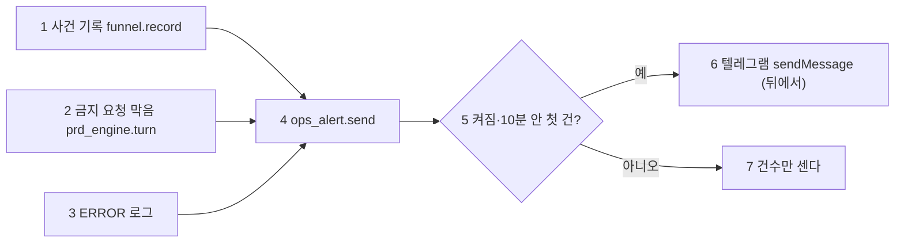

# 계약서: 운영자 텔레그램 알림 (OPS_ALERT_CONTRACT)

> 2026-10-01 (KST) / Claude 작성·구현·검토. 근거: D33(막히면 운영자에게 텔레그램 알림), D49(다음: 텔레그램 알림), 정식 오픈 전 필수 O-4.
> 재사용: 키 저장소 `keystore.get("telegram_bot_token")`(관리자 화면에서 교체 가능, D50), 설정 `telegram_chat_id`, 사건 기록 `funnel.record`, 금지 요청 판정 `intake.blocked_reason`, 가림 `evals.live_metrics.mask_pii`.

## 0. 결론

- 베타 동안 대표가 서버에 들어가지 않고도 휴대폰 텔레그램으로 이상을 안다.
- **토큰과 대화방이 둘 다 있을 때만** 보낸다. 없으면 아무것도 하지 않는다(지금 운영과 같음).
- **개인정보를 넣지 않는다.** 사건 종류·사이트 키·업종·사유·숫자만 넣고, 보내기 직전에 `mask_pii`를 한 번 더 건다.
- 같은 종류는 **10분에 한 번**만 보내고, 그사이 생긴 건수는 다음 알림에 "(그사이 같은 알림 N건 더)"로 붙인다.
- 보내기는 뒤(스레드)에서 하며, 실패해도 앱은 그대로다.
- 텔레그램 API 주소에는 봇 토큰이 들어 있다. httpx가 남기는 요청 로그 줄에서 그 주소를 지운다(관리자 키 연결 테스트의 `getMe`도 같이 막힌다). 실패 로그에는 예외 종류만 남긴다.

| 번호 | 단계 | 설명 |
|---|---|---|
| 1 | 사건 | `site_published`(새 공개), `payment_mismatch`(결제 금액 불일치), `webhook_bad_signature`(웹훅 서명 실패) |
| 2 | 금지 요청 | 사칭·피싱·도박 요청을 막을 때 그 사유 한 줄 |
| 3 | 오류 | ERROR 이상 로그(처리 안 된 예외 포함). 알림 모듈·httpx 자신의 로그는 빼서 되돌이가 없게 |
| 4 | 보내기 | 종류(kind)와 글 |
| 5 | 판단 | 토큰·대화방이 없거나 같은 종류를 10분 안에 보냈으면 보내지 않는다 |
| 6 | 전송 | `https://api.telegram.org/bot<토큰>/sendMessage`, 5초 제한, 미리보기 끔 |
| 7 | 쉬는 중 | 건수만 세어 다음 알림에 붙인다 |

## 1. 알림 글

| 종류 | 글 |
|---|---|
| `site_published` | `[공개] 새 사이트 <키> · <업종> · <안>` |
| `payment_mismatch` | `[결제] 금액 불일치로 실패 처리 · 가게 <키> · <사유>` |
| `webhook_bad_signature` | `[결제] 웹훅 서명 실패 · <사유>` |
| `blocked` | `[대화] 금지 요청을 막았어요 · <사유>` |
| `error:<로거>` | `[오류] <로거> · <메시지 앞 200자> (<예외 종류>)` |

## 2. 파일

| 파일 | 내용 |
|---|---|
| `app/services/ops_alert.py`(신규) | `configured()`, `send(kind, text)`, `on_event(event, props)`, `install()`(ERROR 로그 처리기, 여러 번 불러도 한 번만) |
| `app/services/funnel.py` | `record`가 기록한 뒤 `ops_alert.on_event` |
| `app/services/prd_engine.py` | 금지 요청을 막을 때 `ops_alert.send("blocked", …)` |
| `app/main.py` | 서버가 뜰 때 `ops_alert.install()` |
| `tests/unit/test_ops_alert.py`(신규) | 꺼짐이면 안 보냄, 10분에 한 번·건수 붙이기, 가림, 사건·금지 요청·오류 로그 연결, 알림 모듈 로그는 무시 |

## 3. 운영에서 켜기

1. 텔레그램에서 @BotFather로 봇을 만들고 토큰을 받는다.
2. 그 봇에게 아무 말이나 한 번 보낸 뒤 `https://api.telegram.org/bot<토큰>/getUpdates`를 열어 `chat.id`를 찾는다.
3. 서버 `.env`에 `TELEGRAM_BOT_TOKEN=<토큰>`, `TELEGRAM_CHAT_ID=<id>`를 넣고 다시 시작한다(토큰은 나중에 관리자 화면에서 바꿀 수 있다).
4. 시험: `sudo docker compose exec -T backend sh -c 'PYTHONPATH=/app python -c "from app.services import ops_alert; print(ops_alert.send(\"test\", \"알림 시험\", wait=True))"'` → `True`가 나오고 휴대폰에 "알림 시험"이 오면 끝(`wait=True`는 바로 보내고 결과를 돌려준다).

## 변경 이력

| 날짜 | 내용 |
|---|---|
| 2026-10-01 | 처음 작성 |
