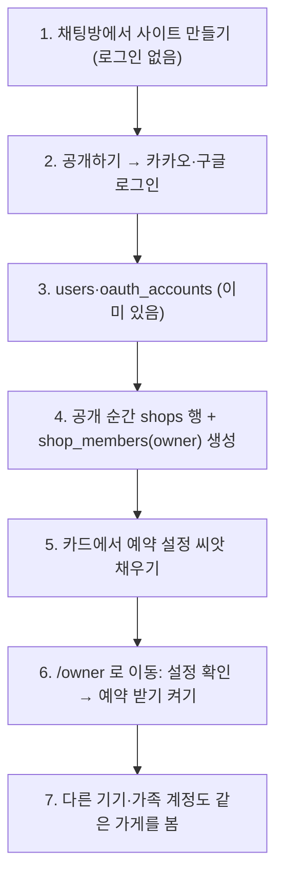
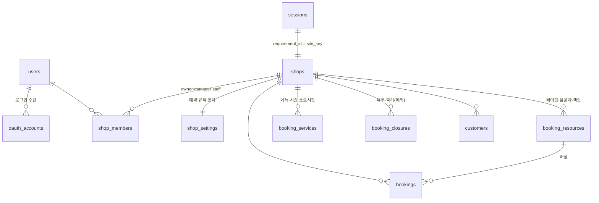

# 사장님 예약 관리 화면 (OWNER_CONSOLE_PLAN)

> 2026-09-29 (KST) / Claude. 대표 질문: "쉬는 날, 테이블당 좌석 수, 시간 등 변수가 너무 많다. 사장님이 예약을 쉽게 받는 관리자 화면과, 카카오·구글 로그인한 사장님에게 가게 데이터를 붙이는 구조는?"
> 먼저 읽은 것: `app/db/models.py`, `app/services/availability.py`, `app/services/bookings.py`, `app/api/bookings.py`, `app/services/shop_settings.py`, `app/api/settings.py`, `app/services/auth.py`, `app/services/rooms.py`, [BOOKING_RULES_PLAN](BOOKING_RULES_PLAN.md), [OWNER_SETTINGS_PLAN](OWNER_SETTINGS_PLAN.md), DECISIONS D47·D49.
> 성격: 설계 제안. [BOOKING_RULES_PLAN](BOOKING_RULES_PLAN.md)(계산 규칙)의 **위층**이다 — 누가(계정·가게), 어디서(화면), 무엇을 DB에 두나. 계산 규칙은 그 문서를 따르고, 바꾸는 곳만 §4에 적는다.
> 손님 대화 시나리오·시간 규칙·사장님 AI 설정·사장님 인증은 [AI_BOOKING_AGENT_PLAN](AI_BOOKING_AGENT_PLAN.md).
> 이 문서의 "관리자"는 **가게 사장님 화면**이다. 플랫폼 운영자 화면(D49·D50)과 다르다.

## 0. 지금 구조에서 확인한 것

| 지금 | 위치 | 문제 |
|---|---|---|
| 사장님 = "방의 첫 멤버(기기 쿠키 member_id)" | `rooms.owner_id`, `bookings._owner_site_key` | 확정·거절 권한이 **계정이 아니라 기기**에 붙어 있다. 사장님이 다른 휴대폰에서 로그인하면 새 참여자라 예약을 확정할 수 없다(README 알려진 한계). 방장을 넘기면 가게 주인도 바뀐다 |
| 계정 → 가게 연결이 3단 추론 | `shop_settings.owned_sites`: `user_rooms` → 방 읽기 → 방장 비교 → 세션 → `requirement_id` | 가게를 나타내는 표가 없다. 방마다 방·세션을 따로 읽는다(N+1). 직원·가족 계정을 붙일 곳이 없다 |
| 영업시간 = 카드 글자를 매번 정규식으로 읽음 | `availability._parse_hours` | 시각을 **앞의 두 개만** 읽는다: "11~15시, 17~21시"는 11~15시만, "평일 10시~20시, 토요일 10시~15시"는 **토요일이 휴무**가 된다(2026-09-29 실행 확인: `(600, 1200, {'sat','sun'})`). 임시 휴무(10/9)·브레이크를 넣을 곳이 없다 |
| 정원 = 객실 수 또는 담당자 수 | `availability.schedule` | 식당은 늘 1팀. 좌석·팀 수 개념 없음 |
| 예약 관리 = 채팅방 메시지의 확정·거절 버튼 | `bookings.decide`, `static/room.html` | 달력·오늘 목록이 없다. 전화로 받은 예약을 넣어 자리를 막을 수 없다 |
| `bookings.site_key`는 글자, 외래키 없음 | `models.BookingRow` | 가게가 지워져도 예약이 남는다. 가게 표가 생기면 붙일 수 있다 |

좋은 점(그대로 쓴다): 로그인은 이미 `users` + `oauth_accounts`(카카오·구글, 제공자 토큰 저장 안 함) 분리형이다. 가게별 설정 표 `shop_settings`, 손님 명단 `customers`, 확정 때 날짜 잠금이 있다.

## 1. 다른 서비스들의 흐름 (공통 패턴)

| 서비스 | 사장님 쪽 구조 | 가져올 것 |
|---|---|---|
| 네이버 스마트플레이스 예약 | 네이버 로그인 → **업체 등록(사람 ≠ 업체)** → 예약 상품 → 요일별 시간·수량 → 휴무일 달력 | 사람과 가게를 나눈다. 수량(시간당 몇 팀) |
| 캐치테이블·테이블링 파트너 | 매장 계정에 직원 초대(권한) → 좌석/테이블 → 시간대별 수용 팀 수 → 당일 타임라인 | "시간당 최대 N팀·N명" 한도, 당일 타임라인, 전화 예약 직접 입력 |
| 카카오헤어샵·네이버 미용 | 디자이너별 근무표 → 시술별 소요시간 → 디자이너×시간 달력 | 담당자 열 × 시간 행 달력 |
| Calendly·Google 캘린더 예약 | **주간 반복 일정 + 날짜별 예외** + 앞뒤 여유 + 최소 몇 시간 전 + 최대 며칠 뒤 | 변수를 "반복 + 예외"로 줄이는 틀 |
| OpenTable | 교대(점심·저녁) + 페이싱(15분마다 최대 N명) + 인원별 식사 시간 | 식당은 테이블 배정보다 **페이싱**이 먼저 |

**공통 결론 3가지**

1. **계정(사람)과 가게(업체)를 나누고, 그 사이에 권한 표를 둔다.** 소셜 로그인은 "누구인지"만 알려 주고, 어떤 가게를 볼 수 있는지는 우리 DB의 `가게 멤버` 표가 정한다.
2. **변수는 "주간 반복 + 날짜 예외 + 자원 + 소요시간" 네 가지로 접는다.** 사장님은 처음에 반복을 한 번 정하고, 매일은 예외(휴무·막기)만 만진다.
3. **처음엔 업종 기본값으로 채워 두고 고치게 한다.** 빈 설정 화면을 주지 않는다(D53과 같은 방식).

## 2. 계정 → 가게 연결 (로그인 흐름)

| 번호 | 설명 |
|---|---|
| 1 | 지금과 같다 |
| 2 | 지금과 같다(`chat_flow._publish`의 로그인 필수, OWNER_SETTINGS §1.1) |
| 3 | 로그인 시 `(provider, provider_user_id)`로 `users.id`를 찾거나 만든다. 이미 있음 |
| 4 | **새 것**. 처음 공개 때 `shops(site_key=requirement_id, …)`와 `shop_members(site_key, user_id, role='owner')`를 한 트랜잭션으로 만든다. 이후 권한은 이 표만 본다 |
| 5 | 카드의 영업시간·담당자·객실·메뉴를 §3 표에 한 번 옮긴다(`availability._parse_hours`·`card_data`를 씨앗 만들 때만 쓴다). 못 읽은 칸은 업종 기본값 + "확인 필요" 표시 |
| 6 | 예약 받기는 사장님이 설정을 한 번 확인한 뒤 켠다(`booking_enabled`). 켜기 전에는 지금처럼 "신청만 받고 사장님이 확정" |
| 7 | 방장이 `/owner`에서 초대 링크 → 받은 사람이 로그인하면 `shop_members(role='staff')`. 방 초대(`room_invites`)와 같은 해시 토큰 방식 |

**권한 한 곳으로**: `shops.require(user_id, site_key, role)` 하나를 두고 `bookings.decide`, `shop_settings.can_edit`, `/owner` API가 모두 이것을 부른다. 채팅방 확정 버튼은 로그인했으면 계정으로, 아니면 지금처럼 방장 기기로 확인(기존 방 호환).

## 3. DB 구조 (Alembic 0014~)

### 3.1 새 표

| 표 | 칸 | 설명 |
|---|---|---|
| `shops` | **구현(0014)은 SALES_DB_PLAN과 맞춰** `id` bigint PK + `site_key` UNIQUE, `name`, `category`, `closed_at`, 확인 칸. 모드는 명세(`bot_specs`)에 둔다 | 가게 자체. `site_key`를 그대로 PK로 써서 기존 `bookings`·`customers`·`inquiries`·`shop_settings`를 고치지 않고 외래키만 건다 |
| `shop_members` | `site_key` FK, `user_id` FK users, `role`(owner·manager·staff), `created_at`. PK(site_key, user_id) | 권한. owner는 가게당 1명(부분 유니크 인덱스 `WHERE role='owner'`) |
| `booking_resources` | `id`, `site_key` FK, `kind`(staff·table·room), `name`, `seats_min`, `seats_max`, `hours` JSONB null(비면 가게 시간), `active`, `sort` | BOOKING_RULES §2.1 그대로 |
| `booking_services` | `id`, `site_key` FK, `name`, `duration_min`, `buffer_min`, `staff_minutes` JSONB, `resource_ids` int[] | BOOKING_RULES §2.2 그대로 |
| `booking_closures` | `id`, `site_key` FK, `resource_id` null(null = 가게 전체), `start_at`, `end_at` timestamptz, `reason`, `created_by` | **예외 한 표로**: 임시 휴무일(하루 전체), 오늘 14~16시 막기, 디자이너 휴가. 정기 휴무는 주간 시간표에서 요일을 비워 표현 |

### 3.2 기존 표 바꿈

| 표 | 추가 칸 | 이유 |
|---|---|---|
| `shop_settings` | `booking_enabled` bool, `weekly_hours` JSONB `{"mon":[["11:00","15:00"],["17:00","21:00"]], …}`(없는 요일 = 정기 휴무), `step_min`, `lead_min`, `max_days`, `party_min`, `party_max`, `pace_teams`, `pace_people`, `auto_confirm`, `hold_hours` | BOOKING_RULES §2.3의 `booking_policy`를 **새 표 대신 이미 있는 가게별 1행 표에** 넣는다. 가게당 1행이라 따로 둘 이유가 없다 |
| `bookings` | `start_at`, `end_at` timestamptz, `resource_id` FK null, `service_id` FK null, `source`(web·phone·walkin), `created_by` null(users.id, 사장님이 직접 넣은 것), `cancel_token_hash` | 시간 구간 겹침 계산·DB 배제 제약(BOOKING_RULES §3), 전화 예약 직접 입력, 손님 취소 링크 |
| `bookings.status` | `requested·confirmed·declined` + `cancelled·no_show·expired` | 노쇼 표시 → 손님 명단 이력, 결정 안 한 신청은 `hold_hours` 뒤 `expired` |

`visit_date`·`visit_time`은 당장 지우지 않는다: 새 칸을 채운 뒤 한 판 동안 둘 다 쓰고, 읽는 곳이 없어지면 지운다.

### 3.3 진실은 DB, 카드는 씨앗

- 공개 전(시안): 지금처럼 카드 → `availability.schedule`(가정값).
- 공개 뒤: `shop_settings.weekly_hours`·`booking_closures`·자원이 진실. `availability.schedule`은 `shops` 행이 있으면 DB에서 읽고, 없으면 카드를 읽는다(기존 방 호환).
- 사장님이 채팅에서 "영업시간 바꿔요"라고 하면 카드와 DB를 함께 바꾼다(한쪽만 바뀌지 않게 같은 함수로).

## 4. "변수가 너무 많다"를 줄이는 법 — 업종별 모드

사장님에게는 모드 하나만 고르게 하고(업종으로 미리 골라 둠), 그 모드에 필요한 칸만 보여 준다.

| 모드 `shops.kind` | 업종 | 사장님이 정하는 것 | 숨기는 것 |
|---|---|---|---|
| `table` 식당·카페 | 음식점 | 영업시간·브레이크, **30분마다 최대 N팀 / N명**(페이싱), 식사 시간(인원별), 인원 범위 | 테이블 목록은 **선택**(켜면 BOOKING_RULES R4 배정) |
| `slot` 1:1 시술 | 미용실·네일·병원·상담 | 담당자, 담당자 근무표, 시술별 시간 | 좌석 |
| `class` 정원 수업 | 공방·학원·필라테스 | 수업(요일·시각·정원) | 담당자별 계산 |
| `night` 숙박 | 펜션 | 객실(인원), 입실·퇴실 시각 | 시간 칸 |

**BOOKING_RULES와 다른 점 한 가지**: 식당은 테이블 배정(R4)부터 가지 않는다. 동네 식당 사장님은 "7시에 4팀까지"로 생각한다. 페이싱(`pace_teams`·`pace_people`) 한도만으로 먼저 받고, 테이블 목록은 원하는 가게만 켠다. 계산이 훨씬 단순하고(시간 칸별 합계), 테이블 붙이기(6명 = 4+2) 문제도 미룬다.

**업종 기본값** (공개 때 씨앗, "확인 필요" 표시)

| 모드 | 기본값 |
|---|---|
| table | 30분 간격, 칸당 3팀·12명, 식사 90분, 1~8명, 마감 1시간 전까지, 2시간 전까지 받기 |
| slot | 30분 간격, 컷 60·펌 150·염색 120, 정리 15분, 담당자 = 카드 staff |
| class | 카드 classes의 요일·시각·정원 |
| night | 객실 = 카드 rooms, 입실 15시·퇴실 11시 |

## 5. 사장님 화면 `/owner` (휴대폰 먼저)

`/settings`를 `/owner`로 키운다. 화면은 React(`frontend/`)로 만든다 — `/projects`가 이미 같은 방식(로그인 쿠키 + `auth.ts`)이고, 달력은 정적 HTML로 만들기 버겁다. `/settings`는 `/owner/settings`로 옮기고 옛 주소는 넘겨 준다.

| 탭 | 내용 | 매일 쓰나 |
|---|---|---|
| **오늘** (첫 화면) | ① 결정 대기 N건 카드(확정·거절 큰 버튼, "처음 오신 손님 / n번째" 표시 — `customers.visit_line`) ② 오늘 타임라인(시각 순, 자원이 있으면 자원 열) ③ "지금 막기"·"전화 예약 넣기" 버튼 | 매일 |
| **달력** | 일·주 보기. 빈 칸 누르기 → 전화 예약 넣기 / 이 시간 막기. 날짜 누르기 → 하루 휴무. 예약 누르기 → 상세·노쇼·취소 | 매일 |
| **예약 설정** | 처음엔 4단계 확인 마법사, 이후엔 같은 칸을 편집: ① 영업시간(요일별, 브레이크, 정기 휴무) ② 모드별 칸(§4) ③ 받는 규칙(몇 시간 전까지·며칠 뒤까지·자동 확정) ④ 미리보기(손님이 보게 될 빈 시간) → "예약 받기 켜기" | 가끔 |
| **손님** | `customers` 목록(방문 수·노쇼 수·마지막 방문), 번호 가려 표시 | 가끔 |
| **가게 설정** | 지금 `/settings`의 문자 인증·솔라피 키 + 직원 초대 | 드물게 |

채팅방 알림·확정 버튼은 그대로 둔다(같은 `bookings.decide`를 부른다). 사장님 카톡 알림에 `/owner` 링크를 붙인다.

### API (로그인 필수, 변경은 `_check_origin`, 권한은 `shops.require`)

| 경로 | 설명 |
|---|---|
| `GET /api/owner/shops` | 내 가게 목록(`shop_members` 한 번 조회, `owned_sites` 대체) |
| `GET /api/owner/shops/{k}/bookings?from=&to=` | 달력·오늘 |
| `POST /api/owner/shops/{k}/bookings` | 전화·방문 예약 직접 입력(`source=phone`) |
| `POST /api/owner/shops/{k}/bookings/{id}/{confirm|decline|cancel|no_show}` | 상태 바꾸기 |
| `GET·PUT /api/owner/shops/{k}/booking-settings` | `shop_settings` 예약 칸 |
| `GET·POST·DELETE /api/owner/shops/{k}/closures` | 휴무·막기 |
| `GET·PUT /api/owner/shops/{k}/resources`, `/services` | 자원·소요시간 |
| `GET /api/owner/shops/{k}/availability?date=` | 미리보기 = 손님 예약 페이지와 **같은 계산 함수** |

## 6. 단계 (D47 일정에 맞춤)

| 단계 | 시점 | 할 일 | DB 바꿈 |
|---|---|---|---|
| **O0** | 10/15 동결 전 가능 | `/owner` 오늘·목록 화면(기존 `bookings`만 읽기) + 로그인 계정으로 확정·거절(`user_rooms`로 권한 확인). 다른 기기 확정 문제 해결 | 없음 |
| **O1** | 10/17 검증 뒤 | `shops`·`shop_members` + 공개 때 생성 + 기존 가게 채우기(`user_rooms` 중 방장 행 → owner). 권한을 `shops.require`로 모음 | 0014 |
| **O2** | O1 뒤 | `shop_settings` 예약 칸 + `booking_closures` + 예약 설정 화면(영업시간·휴무·막기) + `availability`가 DB 우선으로 읽기. `_parse_hours` 한계(두 구간·요일별) 해소 | 0015 |
| **O3** | O2 뒤 | 식당 페이싱(`table` 모드) + 전화 예약 입력 + 노쇼·취소 상태 | 0016 |
| **O4** | BOOKING_RULES R1~R3 | 소요시간·`start_at/end_at`·자원·배제 제약·`/book/<site_key>` 실시간 예약 페이지 | 0017~ |
| 나중 | | 직원 초대, 테이블 배정(R4), 채팅으로 "내일 휴무" → closures(R5), 노쇼 보증금(D13 뒤) | |

**O0이 먼저인 이유**: DB를 바꾸지 않고, 베타 사장님 10명이 실제로 겪을 첫 문제(다른 휴대폰에서 확정 못 함, 예약을 한눈에 못 봄)를 푼다. 10/17 반응을 보고 O2·O3 순서를 정한다.

## 7. 대표 결정 질문

| # | 질문 | 추천 답 |
|---|---|---|
| C1 | 가게 표(`shops`)를 따로 두고 권한을 `shop_members`로 옮길까 | 예. 지금은 "방의 첫 기기"가 주인이라 기기·방장 넘기기에 흔들린다 |
| C2 | 식당은 테이블 배정 전에 페이싱(칸당 N팀·N명)만으로 시작할까 | 예. 동네 식당 대부분이 이렇게 생각하고, 계산이 단순하다 |
| C3 | 공개 뒤 예약 규칙의 진실은 DB, 카드는 씨앗으로 둘까 | 예. 카드 글자를 매번 정규식으로 읽는 지금 방식은 두 구간·요일별 시간을 잃는다 |
| C4 | `/owner`를 React로 만들고 `/settings`를 그 안으로 옮길까 | 예. `/projects`와 같은 방식 |
| C5 | 직원 계정(여러 명 관리)을 첫 판에 넣을까 | 표(`shop_members.role`)만 먼저, 초대 화면은 베타 반응 뒤 |

## 변경 이력

| 날짜 | 내용 |
|---|---|
| 2026-09-29 | 처음 작성 |
