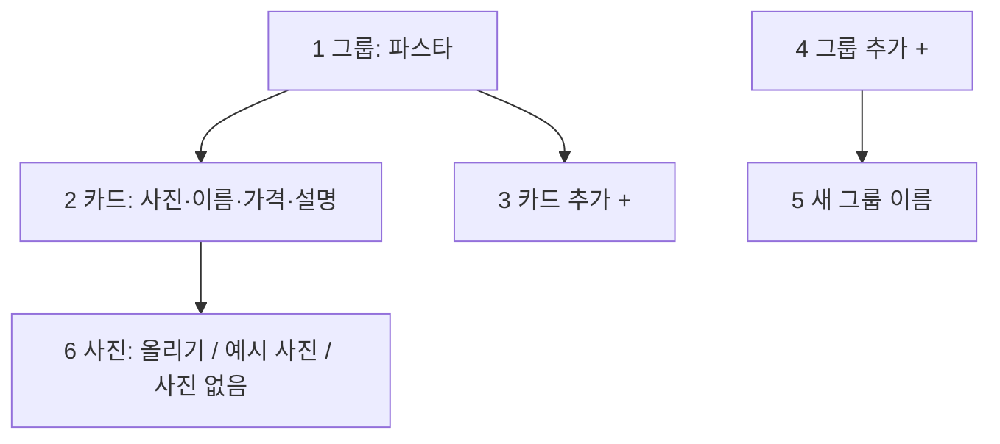
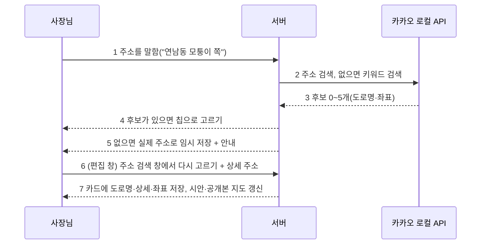
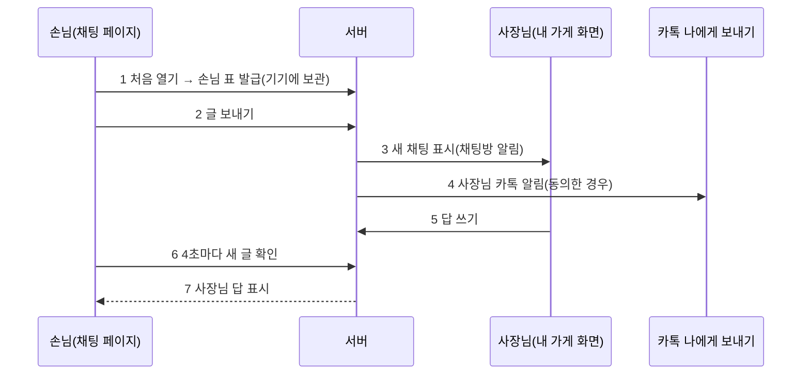

# 대표 피드백 정리와 계획 (2026-10-01 KST)

> Claude 작성. 9/30 밤 사용 한도로 멈춘 동안 보내 주신 요청 11가지를 지금 코드와 맞춰 보고 나눴다.
> 관련 결정: D51(AI 예시 사진), D53②(지도는 예시 이미지, API는 뒤로), D55②(새 부품은 10/17 뒤), D56(공지 띠·팝업), D57(빌더, 사장님 사진은 보정만).
> 베타 10/17, 동결 10/15. 말로 고치기(B5)·사진 고치기(B6)는 `builder-b5-b6` 브랜치에 있고 아직 배포 전이다.

## 0. 한눈에

| # | 요청 | 지금 상태 | 할 일 | 크기 |
|---|---|---|---|---|
| 1 | 음성 답에서 전화번호를 "일억…"이 아니라 "공일공…"으로 | **고침** `d676a01` | 배포 | - |
| 2 | 편집으로 고친 게 공개 사이트에 안 보임 | **고침** `1099230`. 서버는 매번 다시 공개하고 있었는데, 공개 페이지에 `Cache-Control`이 없어 브라우저가 옛 화면을 추측 캐시(1주 된 공개본은 ~17시간)했다. 운영 응답으로 확인 | 배포 | - |
| 3 | 사진 편집 창에서 내 사진도 올리기 | **고침** `739254a` (사진 시트 "내 사진 올리기") | B6과 같이 배포 | - |
| 4 | 보며 고치기에 고칠 입력칸이 없고, 사진 편집 창이 없음 | 입력칸(말로 고치기 B5)과 사진 편집 창(B6)은 **만들었고 배포 전** (운영은 "준비 중" 자리) | 브랜치 검토(S4·P3) 끝나면 배포 | - |
| 5 | "고칠 게 있어요" → 어디를 고칠지 태그로 고르고, 세부 칸을 글·음성으로 | 요약 뒤 "고칠 게 있어요"는 자유 글만 받는다 | §1 | 중 |
| 6 | 가격·상품을 추가하는 형식 + 사진 올릴지 말지 | 항목 줄은 이름·가격·설명만. 항목 사진은 따로 올려야 한다 | §2 (7과 합침) | 중 |
| 7 | "구역 더하기" 말고 그룹 이름 + 그 아래 사진·제목·설명 카드를 계속 추가 | 구역 단위 더하기만 있다. 메뉴 분류(`menu_categories`)는 있지만 항목이 분류를 고르지 못한다 | §2 | 중 |
| 8 | 공지를 글 또는 사진(둘 중 하나 필수), 사진은 여러 장·넘기기, 공지 버튼은 단순한 아이콘으로 | 공지는 글만(띠 + 팝업, D56) | §3 | 소 |
| 9 | 주소 상세 검색(배달 앱처럼 골라 넣기) + 실제 지도, 못 찾는 주소는 실제 주소로 임시로 넣고 안내 | 주소는 글자 그대로, 지도는 카카오·네이버 검색 링크만 (D53②) | §4 | 중~대 |
| 10 | 공간 예시 사진 4장, 음식 메뉴는 태그로, 없는 예시 사진은 만들어 태그와 함께 저장 | 업종마다 공용 예시 5~6장, 공간 사진은 1장 | §5 | 중 |
| 11 | 사이트에 "채팅하기" → 손님과 사장님이 따로 대화, 기술 계획 필요 | 없음. 문의 양식 + 채팅방 알림 + 카톡 나에게 보내기만 | §6 | 대 |
| 12 | "알리오올리오·뇨끼"라고 했는데 "스파게티"가 또 나옴, 말한 걸 다시 묻지 말 것 | 코드·예시 데이터에는 "스파게티"가 없다. AI가 대화 중에 만든 말로 보인다 | §7 확인 필요 | - |

## 1. 고칠 곳을 태그로 고르기 (#5)

- "고칠 게 있어요"를 누르면 자유 글 대신 **고칠 곳 칩**이 뜬다: 가게 이름 · 메뉴·가격 · 영업시간 · 주소 · 전화 · 소개 · 사진 · 공지. 칩은 이 가게 카드에 **채워진 칸만** 보인다(업종 이름표는 `S.label_for`).
- 칩을 누르면 그 칸의 **세부 칩**(메뉴·가격이면 항목 이름들, 영업시간이면 요일·시간·쉬는 날)이 뜨고, 고르면 입력줄 하나가 열린다. 입력줄은 글 + 마이크(기존 `voice.ts`, 알아들은 글은 입력에만 넣고 자동 전송 없음).
- 보내면 새 대화 엔진을 거치지 않고 **그 칸만** 고친다: 서버는 B5 말로 고치기의 검증(`builder_agent.validate`: 말하지 않은 숫자 금지 등)을 재사용하고, 대상 칸을 칩이 준 값으로 고정한다.
- 채팅방(`static/room.html`)과 빌더 SayBar가 같은 칩 목록 API를 쓴다: `GET /api/rooms/{id}/fix-targets` → `[{key, label, parts:[{key,label,current}]}]`.

## 2. 그룹 + 카드 추가 (#6·#7)

같은 요청이라 하나로 만든다. 지금 "항목 줄"을 **그룹(분류) 아래 카드**로 바꾼다.

| 번호 | 단계 | 설명 |
|---|---|---|
| 1 | 그룹 | `menu_categories` 값 하나. 이름을 누르면 바꾸기·지우기·순서 |
| 2 | 카드 | 항목 하나: 이름(필수)·가격·설명·사진. 지금 `ItemIn`에 `group`만 더한다 |
| 3 | 카드 추가 | 그룹 끝의 "+ 추가". 이름만 넣어도 저장, 나머지는 나중에 |
| 4 | 그룹 추가 | 목록 끝의 "+ 그룹 추가" |
| 5 | 새 그룹 | 이름을 넣으면 `menu_categories`에 붙는다 |
| 6 | 사진 | 카드마다 세 가지 중 하나: **올리기**(기존 업로드, 태그 `item:<이름>`), **예시 사진**(§5 태그 사진), **사진 없음**(글만 카드). 기본은 예시 사진이고 공개본에는 예시 표시(D51) |

- 업종 공통 모양이다: 식당·카페는 메뉴, 미용실은 시술, 학원은 반, 펜션은 객실, 공방은 수업. 부품은 이미 있는 메뉴 카드(`categories`)를 쓴다.
- "구역 더하기"는 그대로 두고, 구역 안의 내용 추가를 이 모양으로 바꾼다.

## 3. 공지: 글 또는 사진 (#8)

- 공지를 켤 때 **글** / **사진** 중 하나를 반드시 고른다(둘 다 비면 저장 안 됨). `card.notice = {"kind": "text"|"photos", "text", "photos": [주소…], "popup"}`. 기존 글 공지는 `kind: "text"`로 읽는다.
- 사진 공지는 1~5장. 팝업 안에서 **가로로 넘기기**(CSS scroll-snap, 스크립트 없이), 아래 점으로 몇 번째인지 표시한다. 띠에는 첫 장 작은 그림 + "공지".
- 공지 띠의 **"공지" 글자 단추를 작은 종 아이콘 하나**로 바꾼다(누를 칸 44px, 글 없는 아이콘은 `aria-label="공지"`).
- D55②(새 부품은 10/17 뒤)와 부딪힌다. 공지 부품을 넓히는 일이라 **대표 결정이 필요하다**(§8 ①).

## 4. 주소 검색과 실제 지도 (#9)

### 4.1 무엇을 쓰나 — 카카오 하나로 (추천)

| 용도 | 추천 | 까닭 |
|---|---|---|
| 주소 고르기(배달 앱처럼) | **카카오(다음) 우편번호 서비스** | 키 없이 무료. 배달·쇼핑 앱이 쓰는 그 화면. 도로명·지번·건물 이름을 주고, 상세 주소(층·호)는 따로 적는다 |
| 말로 한 주소 확인·좌표 | **카카오 로컬 API**(주소 검색 → 없으면 키워드 검색) | 이미 카카오 로그인 앱이 있고 `kakao_rest_api_key`가 설정돼 있다 |
| 공개 사이트 지도 | **카카오맵 JavaScript SDK** | 같은 카카오 앱의 JavaScript 키. 공개 호스트 도메인을 카카오 개발자 콘솔에 등록해야 한다 |

- 네이버 지도는 네이버 클라우드 결제 수단 등록이 필요하고, 구글 지도는 결제 계정이 필요하며 한국 지도 정보가 적다. 무료 한도·요금은 가입 화면에서 다시 확인한다(여기 숫자를 적지 않는다).
- 공개 사이트는 외부 스크립트를 막는다(`publish_check`). 지도만 **`https://dapi.kakao.com/v2/maps/sdk.js` 한 주소를 허용 목록**에 넣는다(주문 화면의 포트원 허용과 같은 방식). 키는 JavaScript 키(공개용)만 쓰고, REST 키는 서버 밖으로 나가지 않는다.
- D53②("지도 API는 뒤로")를 뒤집는 일이라 **대표 결정이 필요하다**(§8 ②).

### 4.2 흐름

| 번호 | 단계 | 설명 |
|---|---|---|
| 1 | 말함 | 채팅·음성·말로 고치기 어디서든 `location` 칸 |
| 2 | 검색 | 서버에서만 부른다(REST 키 비노출). 가게 이름·전화는 보내지 않고 주소 말만 |
| 3 | 후보 | 도로명 주소, 지번, 좌표(x·y) |
| 4 | 고르기 | 1개면 "○○ 맞죠?" 확인, 여러 개면 칩. 고르면 "상세 주소(층·호)가 있으면 적어 주세요" 한 번 |
| 5 | 못 찾음 | 사장님이 말한 시·구가 있으면 **그 시·구청 주소**, 없으면 서울시청 주소를 **임시로** 넣고 `location.status = placeholder`. 답: "주소를 찾지 못해서 임시로 ○○로 넣었어요. 편집 창의 주소 검색에서 바꿔 주세요." 공개 전 빈칸 확인(D23)에 걸려 그대로 공개되지 않는다 |
| 6 | 다시 고르기 | 빌더·편집기 주소 칸 옆 "주소 검색" 단추 → 우편번호 서비스 창 |
| 7 | 저장 | `card.location_geo = {"road", "detail", "x", "y"}`. 지도 구역은 좌표가 있으면 실제 지도, 없으면 지금처럼 예시 지도 + 링크 |

## 5. 예시 사진: 공간 4장, 메뉴는 태그 사진 (#10)

- **공간 4장**: 업종마다 공간 예시를 1장 → 4장으로(입구·내부·자리·분위기). Gemini로 만들어 `templates/art/ex/`에 넣는다(D51 규칙: 사람·글자·간판·로고 없음). 한 번 만드는 비용이라 사장님별 호출이 아니다.
- **메뉴 태그 사진 창고**: 메뉴 이름을 태그로 정리한다("알리오올리오" → `pasta-oil`, "까르보나라" → `pasta-cream`). 태그 사진이 창고에 있으면 쓰고, 없으면 **태그로만** 한 장 만들어 창고에 저장해 다음 가게도 쓴다.
  - 창고: `generated/art-lib/<태그>.webp` + `art_lib.json`(태그·낱말·만든 날). 사장님 사진·가게 정보는 들어가지 않는다(태그 낱말만 AI에 보냄).
  - 태그 정하기: 먼저 낱말표(자주 나오는 메뉴 100개), 없으면 LLM이 정해진 태그 목록에서 고르고, 목록에도 없으면 새 태그를 제안받아 저장한다.
  - 비용 제한: 새 태그 사진은 하루 최대 N장(대표 결정 §8 ③), 넘으면 업종 기본 예시.
  - 공개본에는 지금처럼 "예시 이미지" 표시(D51). 사장님이 사진을 올리면 항상 그게 먼저다.

## 6. 손님 ↔ 사장님 채팅 (#11) — 기술 계획

### 6.1 제약

- 공개 사이트는 CSP `sandbox`(출처 없음)라 **기기 저장소·쿠키를 못 쓴다**. 사이트 안에 채팅을 두면 손님이 새로고침할 때마다 대화가 사라진다.
- 그래서 **"채팅하기"는 앱 주소의 채팅 페이지를 새 탭으로 연다**(`/chat/<site_key>`, sandbox의 `allow-popups-to-escape-sandbox`로 이미 허용). 이 페이지는 제 출처라 기기에 손님 표를 보관할 수 있다.

### 6.2 흐름

| 번호 | 단계 | 설명 |
|---|---|---|
| 1 | 손님 표 | 무작위 표를 발급해 손님 기기(localStorage)에 두고, 서버에는 해시만 저장. 같은 기기면 다시 열어도 대화가 이어진다 |
| 2 | 보내기 | 500자, IP당 10분 10건, 스팸 숨김 칸(문의 양식과 같은 방식). 처음 보낼 때 개인정보 안내 한 줄 |
| 3 | 채팅방 알림 | 기존 알림(`notify`)을 재사용. 사장님 "내 가게" 화면에 채팅 탭: 대화 목록 + 답 입력 |
| 4 | 카톡 | 기존 `kakao_talk` 나에게 보내기(추가 동의한 사장님만). 글 원문은 보내지 않고 "새 채팅이 왔어요 + 링크" |
| 5 | 답 | 사장님 화면에서 글로. 음성 입력은 기존 마이크 재사용 |
| 6 | 새 글 확인 | 채팅방과 같은 4초 폴링(`room.html` 방식). 실시간 연결(SSE)은 쓰는 가게가 늘면 |
| 7 | 표시 | 사장님이 자리에 없으면 "사장님이 확인하면 답해요 · 영업시간 ○○" |

- **저장**: 새 표 2개 — `chat_threads(site_key, visitor_hash, 만든 때, 마지막 때, 상태)`, `chat_messages(thread_id, seq, 보낸 쪽, 글, 때)`. 30일 보관 뒤 삭제(문의와 같게). 사장님 차단 단추.
- **사이트 쪽**: 공개 사이트에는 "채팅하기" 단추(새 탭 링크) 하나만 넣는다. 외부 스크립트가 없어 공개 전 검사와 부딪히지 않는다.
- **뒤에 붙일 것(선택)**: AI가 카드 정보(영업시간·주소·가격)로 먼저 답하고 모르면 사장님께 넘기기([AI_BOOKING_AGENT_PLAN](AI_BOOKING_AGENT_PLAN.md)과 같은 틀). 사장님이 카카오톡 채널이 이미 있으면 "카톡 채널로 채팅" 링크만 거는 선택지도 둔다(만들 것 없음).
- **크기**: 서버(표 2개·경로 5개·알림) 1묶음, 손님 채팅 페이지 1묶음, 사장님 채팅 탭 1묶음. OpenCode 3묶음.

## 7. 확인 필요: "스파게티"가 다시 나온 것 (#12)

- 저장소의 코드·예시 데이터·예시 사진 목록에는 "스파게티"가 없다. 대화 중에 AI(요구사항 엔진 추출 또는 답 문구)가 만든 말로 보인다.
- 운영 대화를 읽어야 원인을 알 수 있다(이번에는 운영 DB 읽기를 권한에서 막아 보지 못했다). 그 방 링크나 캡처를 주시면 다음 둘 중 어디인지 가려 고친다.
  - 추출이 "알리오올리오·뇨끼"를 "스파게티"로 묶어 새 값을 만든 경우 → 말하지 않은 값 금지 규칙(근거 검사) 보강
  - 이미 받은 메뉴를 답 문구에서 다시 나열하거나 다시 묻는 경우 → "이미 아는 칸 다시 묻지 않기"와 답 문구 줄이기

## 8. 대표 결정이 필요한 것

| 번호 | 결정 | 추천 |
|---|---|---|
| ① | 공지 사진·넘기기(§3)를 10/17 베타 전에 넣을까 (D55② 예외) | 넣는다. 공지 부품 안의 확장이라 작다 |
| ② | 실제 지도(§4)로 D53②를 뒤집을까, 언제 | 주소 검색·확인(4.2의 1~6)은 베타 전, 공개 사이트 지도(7)는 도메인 등록 확인 뒤 베타 직후 |
| ③ | 메뉴 태그 사진을 AI로 새로 만드는 하루 상한 | 하루 20장 |
| ④ | 손님 채팅(§6)을 베타에 넣을까 | 베타 뒤. 베타에는 문의 양식 + 카톡 알림으로 충분하고, 채팅은 사장님이 답할 시간을 약속해야 하는 기능이라 베타 사장님 몇 분과 먼저 써 본다 |
| ⑤ | 고칠 곳 태그(§1)·그룹 카드(§2) 순서 | §1 먼저(채팅방·빌더 둘 다 좋아짐), §2 다음 |

## 9. 순서 (결정 뒤 계약서로)

| 차례 | 묶음 | 선행 |
|---|---|---|
| 1 | 배포: #1·#2(지금 바로 가능, main으로 옮겨서) | 대표 확인 |
| 2 | 배포: B5·B6 + #3 | 다른 세션의 S4 평가·P3 확인 |
| 3 | §1 고칠 곳 태그 | ⑤ |
| 4 | §4 주소 검색·확인 | ② |
| 5 | §3 공지 사진 | ① |
| 6 | §2 그룹 카드 + §5 예시 사진 | ③ |
| 7 | §6 손님 채팅 | ④ |

## 변경 이력

| 날짜 | 내용 |
|---|---|
| 2026-10-01 | 처음 작성 |
